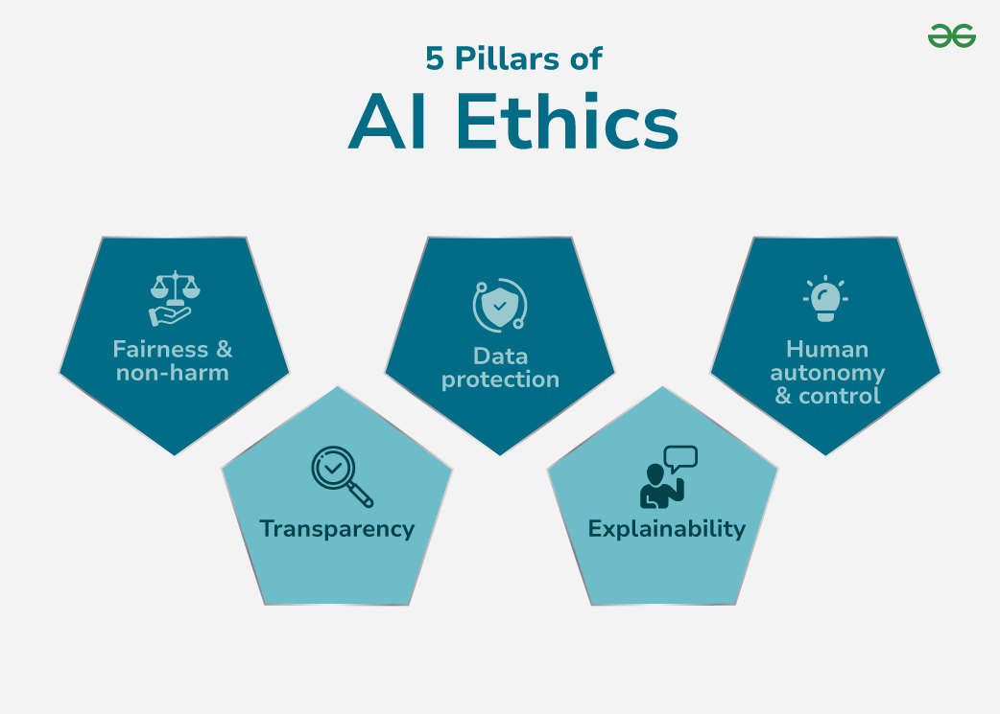

## 🌐 AI Ethics -- Principles, Challenges & The Future

Artificial Intelligence (AI) is transforming industries, decision-making, and everyday life. But with this power comes responsibility.  
As AI systems grow more capable and autonomous, concerns about **fairness**, **accountability**, **privacy**, and **bias** intensify.  
**AI Ethics** guides the development and deployment of AI in ways that align with human values and societal norms.

---

## 📌 Why AI Ethics Matters

- **Avoiding Bias** — Prevent discriminatory outcomes by detecting and correcting bias in training data and algorithms.  
- **Privacy Protection** — Manage sensitive data responsibly to maintain trust.  
- **Transparency** — Ensure AI decisions can be understood and explained.

---

## 🏛 The 5 Pillars of AI Ethics

These pillars form the foundation for **trustworthy AI**.

### 1. Fairness & Non-Discrimination
AI must assess based on relevant criteria, not race, gender, or location.

- **Challenges**: Biased training data can lead to systemic discrimination.  
- **Solutions**: Use diverse datasets, bias-detection tools, and fairness-aware algorithms.

### 2. Transparency
We must understand how AI reaches its conclusions.

- **Challenges**: Complex models like deep neural networks operate as opaque "black boxes."  
- **Solutions**: Invest in **Explainable AI (XAI)**, visual decision trees, and factor attribution methods.

### 3. Data Protection
Safeguard personal data from misuse.

- **Challenges**: Risk of breaches, unauthorized use, or regulatory non-compliance.  
- **Solutions**: Clear consent policies, encrypted storage, and strict access control.

### 4. Explainability
Goes beyond transparency: ensuring explanations are **meaningful to affected individuals**.

- **Challenges**: Technical complexity can hinder non-expert understanding.  
- **Solutions**: Simplify outputs into human-readable narratives and decision breakdowns.

### 5. Human Autonomy & Control
AI should **assist**, not replace, human decision-making.

- **Challenges**: Over-reliance risks loss of oversight, especially in safety-critical domains.  
- **Solutions**: Always include human-in-the-loop controls and override options.

---

## Ethical Challenges in AI

1. **Opacity**: Deep models lack transparency, making audits difficult.  
2. **Security Threats**: Vulnerable to adversarial attacks, data poisoning, and breaches.  
3. **Algorithmic Bias**: Bias in training data leads to unfair outcomes.  
4. **Accountability Gaps**: No clear responsibility when AI causes harm.  
5. **Risk Management**: AI can fail in unpredictable ways without proper safeguards.

---

## 📜 AI Code of Ethics

- **Openness & Transparency**: Document model logic, versioning, and decision history.  
- **Data Security Standards**: Use encryption, authentication, and least-privilege access.  
- **Fairness & Equity**: Audit and test for demographic parity and equal opportunity.  
- **Responsibility & Accountability**: Assign clear ethical ownership at every stage.  
- **Safety & Well-being**: Include failsafe mechanisms and rollback strategies.

---

## Implementing Ethical AI

- **Promote Transparency**: Use interpretable models and maintain thorough documentation.  
- **Ensure Security**: Encrypt all stored/transferred data, use role-based access.  
- **Reduce Bias**: Regularly audit datasets, re-balance representation, and track fairness metrics.  
- **Define Responsibility**: Implement ethics checkpoints in the AI lifecycle.  
- **Strengthen Safety**: Perform edge-case stress testing and high-risk scenario simulations.

---

## Steps Toward More Ethical AI

1. Establish clear ethical guidelines.  
2. Debias datasets and algorithms before deployment.  
3. Respect informed consent and user data rights.  
4. Integrate ethical thinking from ideation to post-deployment monitoring.  
5. Create audit trails for decision-making processes.

---

## 🔮 The Future of AI Ethics

- **Evolving Research**: Growth of XAI, bias mitigation, and AI governance frameworks.  
- **Stronger Regulation**: International AI laws and compliance standards emerging.  
- **New Domains, New Ethics**: Autonomous vehicles, predictive medicine, and AI-driven law enforcement will require dedicated ethical oversight.

---

> **Ethical AI is about trust.**  
> By embedding fairness, transparency, accountability, and safety into AI systems, we can ensure technology serves everyone: not just a privileged few.

### References

[AI_ethics_Wikipedia](https://en.wikipedia.org/wiki/Ethics_of_artificial_intelligence)