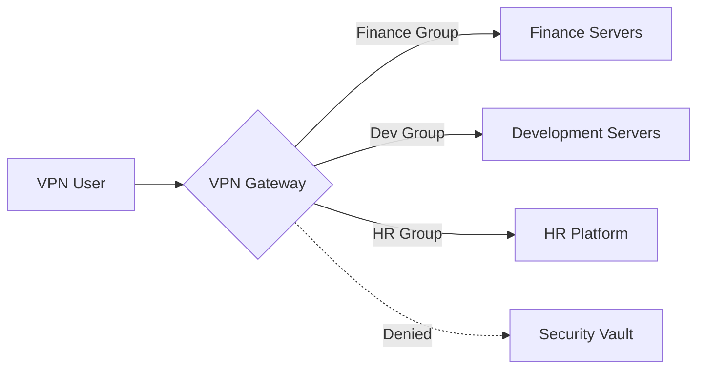

## 0.0 Executive Summary: Why VPNs Still Matter in a Zero Trust World

In the modern enterprise, the "perimeter" has largely evaporated. However, the Virtual Private Network (VPN) remains a critical tool for infrastructure management, secure administrative access, and legacy application bridging. This guide is designed for a 300-user environment—a scale where manual management becomes impossible, but "massive enterprise" solutions might be overkill.

We focus on **WireGuard** as our primary protocol due to its high performance, modern cryptographic primitives, and simplified codebase, while acknowledging the role of OpenVPN and IPsec for specific use cases.

## 0.1 How to Read This Guide

This document is building a progressive technical stack. We move from high-level conceptual models to low-level implementation details and operational runbooks.

- **Sections 1.0–3.0:** Foundational concepts (The "What").
- **Sections 4.0–8.0:** Architecture and Design (The "Why").

- **Sections 9.0–13.0:** Identity and Security (The "How").
- **Sections 14.0–18.0:** Advanced Engineering and Scaling (The "Hard").

- **Appendices:** Real-world configuration templates and troubleshooting.

:::tip[Operator Perspective]
A VPN is not a security solution on its own; it is a **transport layer** that should be governed by a robust Identity Provider (IdP) and strict egress policies. Never allow "Any/Any" routing within your tunnel.
:::

---

## 1.0 VPN Fundamentals: The Encrypted Overlay

At its core, a VPN creates a virtual point-to-point connection through an untrusted physical network. In an enterprise context, this typically involves an encrypted tunnel between a client device (laptop, phone) and a central gateway.

### 1.1 The Lifecycle of a Connection

When a user initiates a VPN connection, the following sequence occurs:

1. **Authentication:** The client proves its identity (often via certificates or MFA-backed credentials).
2. **Key Exchange:** The client and server negotiate session keys using a protocol like Diffie-Hellman or Noise.
3. **Tunnel Instantiation:** A virtual network interface (e.g., `wg0` or `tun0`) is created on both ends.
4. **Routing Injection:** The system routing table is updated to send specific IP ranges through the virtual interface.
5. **Encapsulation:** Outgoing packets are wrapped in an outer header (UDP/TCP), encrypted, and sent to the gateway.
6. **Decapsulation:** The gateway unwraps the packet and forwards it to the internal destination.

### 1.2 Encapsulation and Overhead

Every time you wrap a packet in a VPN tunnel, you add bytes.

- **WireGuard Overhead:** 32 bytes (IP header + UDP header + WireGuard header).
- **OpenVPN Overhead:** 60-80 bytes (varies by cipher and transport).
If your standard internet connection has a limit of 1500 bytes (MTU), and the VPN adds 32 bytes, your actual data limit inside the tunnel is 1468. If you ignore this, your packets will be "fragmented," leading to slow speeds and broken websites.

---

## 2.0 Hardcore Terminology for Network Engineers

To design a professional system, you must speak the language of packet flow and cryptography:

- **Transport Layer (UDP vs. TCP):** VPNs strictly prefer UDP. TCP-over-TCP (TCP Meltdown) causes catastrophic performance degradation during packet loss because both layers attempt retransmission.
- **MTU (Maximum Transmission Unit):** The physical limit of a packet size (usually 1500 bytes). Because VPNs add headers (overhead), the internal MTU must be lower (e.g., 1420 for WireGuard) to avoid fragmentation.

- **MSS Clamping:** A technique used by routers to intercept TCP handshakes and "clamp" the Maximum Segment Size to fit within the VPN's reduced MTU, preventing "black hole" connections where headers fit but data payloads don't.
- **PFS (Perfect Forward Secrecy):** A property where a compromise of long-term keys does not compromise past session keys. Every session uses a unique ephemeral key.

- **Split Tunneling:** Routing only company traffic (e.g., `10.0.0.0/8`) through the VPN while sending Netflix/YouTube via the user's local ISP. Essential for bandwidth conservation.
- **Full Tunneling (Force Tunneling):** Routing all traffic through the VPN. Required for high-compliance environments to ensure all web traffic passes through corporate DNS and DLP (Data Loss Prevention) filters.

- **CGNAT (Carrier-Grade NAT):** When an ISP shares one public IP with many users. This often breaks traditional VPNs like IPsec but is handled well by WireGuard.
- **Perfect Forward Secrecy (PFS):** If your server's long-term private key is stolen today, the attacker cannot decrypt the sessions they recorded yesterday. Every handshake generates a dynamic, one-time session key.

---

## 3.0 Protocol Deep Dive: WireGuard vs. The World

For 300 users, your protocol choice dictates your maintenance overhead for the next three years.

### 3.1 WireGuard (The Gold Standard)

- **Pros:** ~4,000 lines of code (auditable), state-of-the-art crypto (ChaCha20, Poly1305), near-instant handshakes, extremely high throughput.
- **Cons:** State-less by design (requires manual management or a Coordination Layer like NetBird, Tailscale, or Firezone for 300+ users).

- **Ideal for:** Performance-focused teams, mobile users, and modern Linux/Cloud environments.

### 3.2 OpenVPN (The Legacy Workhorse)

- **Pros:** Incredible flexibility, supports TCP (to bypass restrictive firewalls), runs on almost anything.
- **Cons:** Massive codebase (600k+ lines), slow context switching (User-space vs Kernel-space), complex certificate management.

- **Ideal for:** Environments requiring strict TLS-based compliance or legacy hardware support.

### 3.3 IKEv2/IPsec (The Native Choice)

- **Pros:** High performance, natively supported by Windows, iOS, and macOS without extra apps.
- **Cons:** Notoriously difficult to configure correctly; "IPsec" has many incompatible variants.

- **Ideal for:** "Zero-Install" deployments where you cannot push third-party clients to users.

---

## 4.0 Architecture: Designing for 300 Users

When scaling to 300 users, you can no longer rely on a single Linux box running a bash script. You need an architecture that survives a Friday afternoon hardware failure.

### 4.1 High Availability (HA) Pair

Deploy two VPN gateways in an Active-Passive or Active-Active configuration.

- **Keepalived/VRRP:** Use a Virtual IP (VIP). If Gateway A dies, Gateway B takes the VIP within seconds.
- **State Sync:** For protocols like IPsec, you may need to sync session states so users don't drop their connection during a failover. (WireGuard is "silent" and reconnects instantly, making this easier).

### 4.2 The "Gateway on Every Continent" Model

For a distributed workforce, a single gateway in London will frustrate users in Tokyo.

- **Anycast IP:** Use a cloud-based Anycast service to route users to the nearest healthy VPN node.
- **Geo-DNS:** Resolve `vpn.company.com` to different regional IPs based on the user's location.

### 4.3 Elastic Scaling (The Cloud Native Way)

In AWS or Azure, place your VPN gateways in an **Auto-Scaling Group**. If CPU usage exceeds 70%, the cloud automatically spins up a third gateway. This requires an external state-store (like Redis) or a coordination layer to share user keys across nodes.

---

## 5.0 Security Objectives: The "Five Pillars"

Your implementation must prove it meets these criteria before you go live:

1. **Identity-First Access:** No one enters without a valid entry in the IdP (e.g., Entra ID, Okta, Google Workspace).
2. **Cryptographic Integrity:** Use modern ciphers only. Disable RSA-2048, SHA-1, and 3DES.
3. **Lateral Movement Prevention:** Use a "Deny All" default. Users in the `Marketing` group shouldn't be able to ping the `Database` subnet.
4. **Endpoint Posture:** Check if the connecting device has Disk Encryption enabled and an active Antivirus before allowing the tunnel to form.
5. **Visibility:** Every connection, disconnection, and failed handshake must be logged to a central SIEM (Security Information and Event Management) system.

---

## 6.0 Threat Modeling for Your VPN Gateway

The VPN gateway is a massive target. If it falls, the attacker is "inside."

### 6.1 Internal Threats (The "Sneaky Administrator")

- **Risk:** An IT person creates a "backdoor" static key for their personal laptop.
- **Mitigation:** Mandatory MFA for every session. No exceptions. Log all key-generation events and audit them weekly. Use "Just-In-Time" (JIT) access for admin tasks.

### 6.2 External Threats (The "Credential Stuffer")

- **Risk:** Attackers find a leaked password and log in as a VP.
- **Mitigation:** Device-binding. The VPN only works if BOTH the password AND the specific hardware certificate/device-ID are present. Implement Rate Limiting on the authentication endpoint.

### 6.3 Infrastructure Threats (The "DDoS")

- **Risk:** UDP flooding makes the VPN unusable for everyone.
- **Mitigation:** WireGuard's "Cookie" mechanism for DoS protection. It ignores packets without a valid MAC until a handshake is proven. Use a cloud-based WAF (Web Application Firewall) to filter malicious traffic at the edge.

---

## 7.0 Routing and Subnet Design (Medium Difficulty)

Efficient routing prevents performance choke points and simplifies security rules.

### 7.1 Avoiding Subnet Collisions

Many home routers use `192.168.1.0/24`. If your corporate network also uses that range, the user won't be able to reach internal resources because their computer thinks the traffic is "local" to their house.

- **Standardize on the `10.x.x.x` or `172.16.x.x` space.**
- **Use a unique segment for the VPN pool** (e.g., `100.64.0.0/10` - Carrier Grade NAT range) to avoid overlaps.

### 7.2 The NAT Trap

If you NAT everyone to a single IP when they enter the network, your firewall logs will show all traffic coming from "The VPN Server." You lose the ability to see *which* user accessed *which* server.

- **Solution:** Route the VPN subnet directly. Ensure internal servers have a route back to the VPN gateway for those IPs.

---

## 8.0 Full Tunnel vs Split Tunnel: A Deep Contextual Analysis

This decision is often political, not technical.

### 8.1 The Case for Full Tunnel

- **Security:** You can force all web traffic through a secure gateway (SWG). This prevents users from visiting phishing sites or downloading malware on company time.
- **Privacy:** It protects the user's traffic from snooping on public Wi-Fi (hotels, coffee shops).

- **Compliance:** Many industries (Finance, Health) require full tunneling to be compliant with data protection laws.

### 8.2 The Case for Split Tunnel

- **Performance:** Zoom/Teams calls don't need to go to your data center and back out; let them go straight to the internet.
- **Cost:** You don't pay for the bandwidth of a user watching 4K YouTube on their lunch break.

- **Hardware Strain:** Your VPN gateway doesn't have to process gigabytes of harmless traffic (like Netflix).

:::caution[The Hybrid Middle Ground]
Most modern enterprises use **Split Inclusion**. Include your internal CIDR ranges (e.g., `10.0.0.0/8`) and specific SaaS IPs, but leave the rest of the world to the local ISP.
:::

---

## 9.0 Identity Architecture: Connecting the VPN to Reality

For 300 users, you cannot manage local Linux users on the gateway. You need an identity bridge.

### 9.1 The Identity Loop

1. **Client Application** requests a login.
2. **Gateway** redirects the user to the OIDC/SAML login page (Okta/Entra ID).
3. **User** completes MFA (FIDO2, Authenticator App).
4. **IdP** sends a token (JWT) back to the Gateway.
5. **Gateway** generates a short-lived WireGuard key and pushes it to the client.

### 9.2 MFA Implementation Strategy

- **Avoid SMS:** It is vulnerable to SIM swapping and SS7 intercepts.
- **Prefer TOTP or WebAuthn:** If you are serious about security, require a hardware key (Yubikey) for VPN access. FIDO2 is the peak of modern authentication security.

---

## 10.0 Access Control Lists (ACLs) and Micro-Segmentation

A VPN should not be a "flat" network.



### 10.1 Implementing RBAC

- Map IdP groups to network tags.
- If you use **WireGuard**, use a tool like **NetBird** or **Tailscale** to define these rules via a web UI.

- If you use **Linux/Iptables**, you need a dynamic script that updates rules when a user connects. This is often called a "Dynamic Firewall Policy."

---

## 11.0 Monitoring and Logging: Being the "Eye in the Sky"

If someone asks "Who accessed the backup server at 2 AM?", your VPN logs must have the answer.

### 11.1 Vital Metrics to Track

- **Concurrent Sessions:** Are we hitting our hardware CPU/RAM limits?
- **Data Throughput per User:** Is someone exfiltrating data (unusually high upload relative to their role)?

- **Handshake Latency:** Is the authentication server slow?
- **Dropped Packets:** Indicative of MTU issues or ISP throttling.

### 11.2 SIEM Integration

Stream your logs to Elasticsearch, Splunk, or Azure Monitor. Look for "impossible travel"—a user logging in from New York, and then 10 minutes later from Frankfurt. This is a primary indicator of a stolen session token.

---

## 12.0 Solving the MTU/MSS Headache (Hard)

This is the #1 cause of VPN helpdesk tickets. A user connects, but they can't open large websites or send emails.

### 12.1 The "Ping of Death" Test

If your VPN is up but data is stuck, run:
`ping -M do -s 1400 10.0.0.1` (on Linux) or `ping 10.0.0.1 -f -l 1400` (on Windows).
Keep lowering `1400` until the ping succeeds. That is your path MTU.

### 12.2 The Fix

- Set WireGuard MTU to `1280` (the safest minimum for IPv6).
- Enable MSS Clamping on your gateway:
    `iptables -t mangle -A FORWARD -p tcp --tcp-flags SYN,RST SYN -j TCPMSS --clamp-mss-to-pmtu`
This ensures that your server tells the remote server to shrink its packets before they even reach the VPN tunnel.

---

## 13.0 High Availability and Load Balancing (Hard)

To support 300 users without downtime, you need redundancy.

### 13.1 Round-Robin DNS

The simplest form. Point `vpn.company.com` to three different IP addresses. The client randomly picks one. If one fails, the user might have to reconnect 2-3 times to get a "live" server.

### 13.2 TCP/UDP Load Balancers

Use a cloud load balancer (like AWS NLB or Azure Load Balancer). It performs health checks and only sends traffic to functioning gateways. Note: This can be tricky with WireGuard because it is connectionless (UDP). You must use "Session Stickiness" based on the source IP.

---

## 14.0 Disaster Recovery (DR) for the VPN

What happens if your primary data center goes dark?

- **Cloud Backup:** Always have a "Cold Standby" gateway in a different cloud region (e.g., AWS vs GCP).
- **Config as Code:** Store your VPN configs in Git. If a server dies, you should be able to spin up a new one in 5 minutes using Terraform or Ansible. "Immutability" is your best friend in DR.

- **Emergency Keys:** Keep a set of physical "Glass Break" keys in a safe, in case the IdP itself is down.

---

## 15.0 Operational Excellence: The Developer Experience

A secure VPN that is hard to use will be bypassed by your most talented engineers.

- **Auto-Connect:** Configure the client to turn on whenever the user isn't on the corporate office Wi-Fi.
- **SSO Integration:** One click to log in. No separate passwords or complex key files for the user to manage.

- **Silent Updates:** Use an MDM (Jamf, InTune) to push client updates without bothering the user.
- **Friendly Hostnames:** Ensure your internal DNS (e.g., `jira.int.company.com`) works over the VPN so users don't have to remember IP addresses.

---

## 16.0 Compliance and Auditing (The "Boring" But Vital Part)

If you are subject to SOC2, HIPAA, or GDPR, your VPN is a critical control.

- **Audit Trail:** Log every time an admin changes an ACL.
- **Session Termination:** Automatically kick off users after 12 or 24 hours to force a re-authentication with MFA. This prevents "Eternal Tunnels" on stolen laptops.

- **Data Residency:** If you are in the EU, ensure your VPN gateways aren't routing traffic through nodes in non-compliant jurisdictions (like certain US-based data centers).

---

## 17.0 Performance Optimization at the Kernel Level

For maximum speed, tweak the Linux kernel on your gateways. These changes allow the server to handle 10,000+ packets per second without breaking a sweat.

```bash
# Increase packet queue lengths
sysctl -w net.core.netdev_max_backlog=5000
# Increase receive/send buffer sizes (16MB)
sysctl -w net.core.rmem_max=16777216
sysctl -w net.core.wmem_max=16777216
# Enable BBR (Bottleneck Bandwidth and Round-trip propagation time) for TCP
sysctl -w net.core.default_qdisc=fq
sysctl -w net.ipv4.tcp_congestion_control=bbr
```

### 17.1 Multiqueue Support

Modern servers have 16+ CPU cores. WireGuard handles this well by default, but ensure your server's NIC (Network Interface Card) is configured to distribute interrupt requests (IRQs) across all cores. Check `/proc/interrupts` to verify. If all interrupts are hitting Core 0, your performance will plateau.

---

## 18.0 Future Proofing: ZTNA and the Post-VPN World

The industry is moving toward Zero Trust Network Access (ZTNA).

- **Idea:** Instead of giving a user "network access," you give them "application access" via a reverse proxy.
- **Timeline:** Start migrating web-based apps to ZTNA (Cloudflare Tunnel, Zscaler, Pomerium) while keeping the VPN for thick-client apps and server management. The VPN becomes the "Admin Plane" while ZTNA becomes the "User Plane."

---

## 19.0 Troubleshooting Scenarios: Real-World Lessons

### Scenario A: The "Slow Video Call"

**Symptom:** User says Zoom works fine on home Wi-Fi but stutters on VPN.
**Diagnosis:** The user is on a "Long Fat Pipe" (high latency, high bandwidth). Standard TCP congestion control (Cubic) fails here because it thinks latency is a sign of congestion.

**Fix:** Switch the gateway to BBR (as shown in Section 17.0). BBR measures actual bandwidth and handles latency much more gracefully.

### Scenario B: The "Zombie Session"

**Symptom:** The dashboard shows a user is connected, but the user says they disconnected 4 hours ago.
**Diagnosis:** The client's internet dropped abruptly (tunnel into a elevator), and the gateway never received a "goodbye" packet. Because UDP is connectionless, the server keeps the session alive.

**Fix:** Reduce the `PersistentKeepalive` and implement a server-side "Dead Peer Detection" (DPD) timeout of 10 minutes.

### Scenario C: The "Internal Site Loading Forever"

**Symptom:** The page title appears in the browser tab, but the page content never loads.
**Diagnosis:** MTU mismatch. The small handshake packets fit, but the large data packets (HTML/Images) are being dropped by a router in the middle.

**Fix:** Implement MSS Clamping on the gateway (Section 12.2).

---

## 20.0 Linux, Mac, and Windows CLI Quick-Start

### 20.1 Linux (Client)

```bash
# Install
sudo apt install wireguard
# Config
sudo nano /etc/wireguard/wg0.conf
# Up
sudo wg-quick up wg0
```

### 20.2 macOS (Client)

Use the official Mac App Store app for the best experience, or use Homebrew for the CLI:

```bash
brew install wireguard-tools
sudo wg-quick up ./myconfig.conf
```

### 20.3 Windows (Client)

Use the official MSI installer from `wireguard.com`. It installs a system service that allows non-admins to toggle the VPN on/off (if configured correctly).

---

## Appendix A: WireGuard Base Server Configuration (Ubuntu 22.04)

```ini
# /etc/wireguard/wg0.conf
[Interface]
PrivateKey = <SERVER_PRIVATE_KEY>
Address = 10.0.0.1/24
ListenPort = 51820

# Force MTU to avoid fragmentation
MTU = 1420

# PostUp/PostDown for routing
PostUp = iptables -A FORWARD -i %i -j ACCEPT; iptables -t nat -A POSTROUTING -o eth0 -j MASQUERADE
PostDown = iptables -D FORWARD -i %i -j ACCEPT; iptables -t nat -D POSTROUTING -o eth0 -j MASQUERADE

[Peer]
# Staff Member 1
PublicKey = <CLIENT_PUBLIC_KEY>
AllowedIPs = 10.0.0.2/32
```

## Appendix B: Advanced Linux Client Setup

```bash
# Generate keys
wg genkey | tee privatekey | wg pubkey > publickey
# Create config
sudo nano /etc/wireguard/wg0.conf
# Start service permanently
sudo systemctl enable --now wg-quick@wg0
```

## Appendix C: Troubleshooting Checklist

1. **Can't Connect?** -> Check if UDP port 51820 is open on the corporate firewall.
2. **Connected but no Internet?** -> Check `sysctl net.ipv4.ip_forward` is set to `1`.
3. **Slow Performance?** -> Lower the MTU to `1280`.
4. **Specific Apps Failing?** -> Check MSS Clamping rules.
5. **DNS Failures?** -> Ensure `/etc/resolv.conf` on the client is pointing to the internal DNS server or use the `DNS = 10.0.0.1` directive in `wg0.conf`.

---

## Conclusion: Final Thoughts for the Architect

Building a VPN for 300 users is a balancing act between **Security**, **Privacy**, and **Usability**. By choosing a modern protocol like WireGuard, automating your identity flow, and respecting the laws of networking (MTU/MSS), you can build a system that is both invisible to users and impenetrable to attackers.

The most successful VPN is the one that no one knows is running. Stay paranoid, stay logged, and always test your failover before you need it.

---

## 21.0 Advanced Cryptographic Configuration for Secure Tunnels

While WireGuard and IPsec provide robust security out-of-the-box, enterprise environments often require explicit cryptographic hardening to meet regulatory standards like FIPS 140-2 or NIST guidelines.

### 21.1 Cipher Suite Selection (The Modern Stack)

In a world of increasing quantum compute potential, choosing the right ciphers is vital:

- **KEM (Key Encapsulation Mechanisms):** Start investigating post-quantum algorithms like **Kyber** or **McEliece**. While not standard in most VPN clients yet, they are reaching the "experimental support" phase in some WireGuard forks.
- **AEAD (Authenticated Encryption with Associated Data):** Always use AEAD-capable ciphers like **ChaCha20-Poly1305** or **AES-GCM**. These provide both confidentiality and integrity in a single pass, preventing "Ciphertext Malleability" attacks.

### 21.2 The Noise Protocol Framework

WireGuard is built on the **Noise Protocol Framework**. This framework allows for "1-RTT" handshakes, meaning the connection is established in a single round-trip. This is why WireGuard feels significantly faster than the "4-way handshake" required by older protocols.

---

## 22.0 Cloud-Native VPN Integration (AWS, GCP, Azure)

If your 300 users are primarily accessing resources in a public cloud, your VPN architecture should reflect that.

### 22.1 AWS Transit Gateway (TGW)

Instead of connecting every user to a gateway in a VPC, connect them to an **AWS Client VPN** that is associated with a Transit Gateway.

- **Benefit:** The Transit Gateway acts as a central router for all your VPCs. Any new VPC you create is instantly reachable by the VPN without reconfiguring the gateways.
- **Security:** You can apply Security Groups to the TGW attachments, creating a central point of control.

### 22.2 Azure Virtual WAN

For organizations heavily invested in Microsoft 365 and Azure, **Azure Virtual WAN** provides a global "branch-to-cloud" connectivity model.

- **Point-to-Site (P2S):** This is the Azure term for user-to-gateway VPN. It supports OpenVPN and IKEv2 and integrates natively with Microsoft Entra ID (formerly Azure AD) for MFA.

---

## 23.0 Managing VPN Latency: The laws of Physics

No matter how fast your server is, you cannot beat the speed of light. However, you can optimize the "last mile" and "middle mile."

### 23.1 Reducing Handshake Latency

In high-latency regions (e.g., users in South America connecting to a Virginia-based server), every extra round-trip in the handshake adds 500ms of wait time.

- **Solution:** Use UDP-based protocols (WireGuard) that require minimum round-trips. Avoid TCP-based VPNs at all costs.

### 23.2 The "Middle Mile" Optimization

Large cloud providers (AWS, Cloudflare, Google) have private fiber backbones that are 30-40% faster than the public internet.

- **Technique:** Have the user connect to a "local" entry point (PoP) near their home. That PoP then carries the traffic over the provider's private backbone to your central data center. This is the secret behind the speed of **Tailscale** (via their DERP relays) and **Cloudflare Warp**.

---

## 24.0 Conclusion: The Final Word on Resilience

At the end of the day, a VPN for 300 users is a piece of **Mission Critical Infrastructure.** If the VPN is down, the company stops working.

1. **Redundancy is king.** (Two nodes are one; one node is none).
2. **Identity is the perimeter.** (MFA is not optional).
3. **Performance is binary.** (If it's slow, users won't use it).
4. **Logging is the truth.** (If it isn't logged, it didn't happen).

Stay diligent, monitor your packet drops, and always keep your private keys private.
