## The Ground Shifts One Last Time

Four volumes in, we have built walls ([I](/posts/secure_systems_architecture/)), verified every principal at every door ([II](/posts/identity_and_access_in_depth/)), made our messages unforgeable ([III](/posts/cryptography_engineering_in_depth/)), and learned to detect and survive the breach that gets through anyway ([IV](/posts/detection_and_response_in_depth/)). Every one of those ideas assumed something that quietly stopped being true: that there is a *server*, a *machine*, a *thing* that persists, that you own, and that you can point at.

In the cloud-native world, that assumption dissolves:

* The "server" is a **container** that lives for ninety seconds and is replaced by an identical twin.
* The infrastructure isn't racked; it's a **YAML file** that a pipeline applies.
* The application isn't something you wrote; it's **your code plus two thousand dependencies** you didn't, assembled by a build system you'd struggle to fully audit.

This finale is about defending *that* world, where the perimeter is gone entirely, workloads are cattle not pets, and the most devastating breaches of the decade arrive not through your front door but through your **supply chain**. Everything the series taught still applies, but the surfaces it applies to now flicker in and out of existence thousands of times a day.

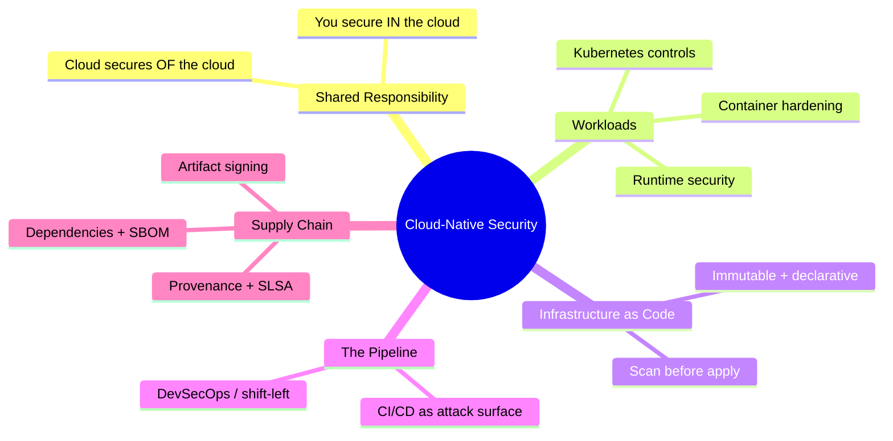

---

## Part I: The Shared Responsibility Model

The first and most misunderstood idea in cloud security: **the cloud provider does not secure your application.** They secure the *infrastructure* the cloud runs on; you secure what you *put in* it. The line moves depending on the service model, and breaches live in the confusion about where it sits [^1]:

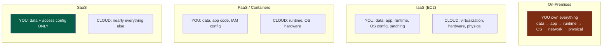

:::important[Your responsibility never reaches zero]
Notice the constant across every column: **you always own your data and your access configuration.** The overwhelming majority of "cloud breaches" are not the provider being hacked, they are a *customer* misconfiguration: a public S3 bucket, an over-permissive IAM role, a database exposed to `0.0.0.0/0`. The cloud gives you powerful defaults-off primitives; leaving them off is on you. Misconfiguration, not provider compromise, is the number-one cause of cloud data exposure. [^2]
:::

---

## Part II: Securing the Workload

### Chapter 1: Container Security - The Layered Reality

A container is not a lightweight VM; it's a set of isolated *processes* on a **shared host kernel**. That single fact drives its entire threat model, and the defense is layered from image to runtime:

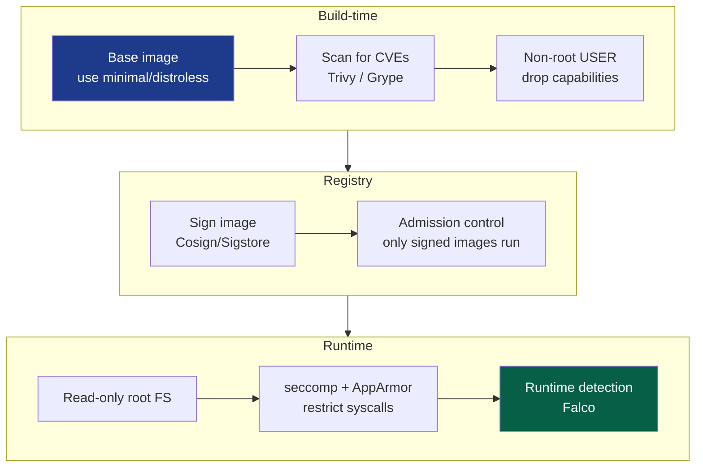

The highest-leverage container practices, in order of bang-for-buck:

* **Minimal base images** - a `distroless` or scratch image contains your app and *nothing else*: no shell, no package manager, no `curl`. An attacker who lands inside has no tools to pivot with. It also shrinks the CVE surface by an order of magnitude, no OS packages means no OS package vulnerabilities.
* **Never run as root** - a container process running as root that escapes the container is root *on the host*. Set a non-root `USER`, drop all Linux capabilities and add back only what's needed.
* **Read-only root filesystem** - if the container can't write to its own filesystem, an attacker can't drop a payload onto it.
* **Scan every image** - `Trivy`/`Grype` in CI, block the build on critical CVEs.

:::warning[The container escape is the whole ballgame]
Because containers share the host kernel, a **kernel exploit or a misconfiguration is a full host takeover**, and from one host, often the whole cluster. The cardinal sins that make this trivial: running `--privileged`, mounting the Docker socket (`/var/run/docker.sock`) into a container (that's root on the host, gift-wrapped), and running as UID 0. Treat a privileged container as a decision requiring the same scrutiny as handing out `sudo`. [^3]
:::

### Chapter 2: Kubernetes - Hardening the Orchestrator

Kubernetes is a distributed operating system for containers, and its security is a subject unto itself. The attack surface spans four fronts, memorized as the **4 C's of Cloud Native Security**: Cloud, Cluster, Container, Code [^4].

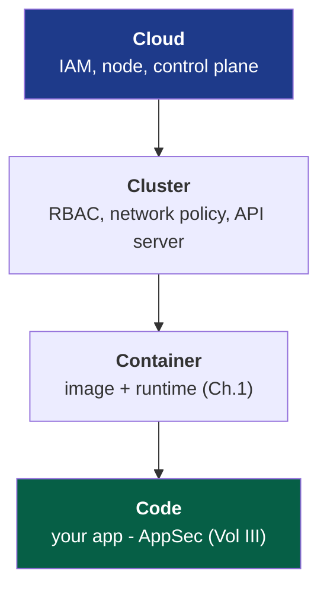

The load-bearing cluster controls, each closing a specific attack path:

::::steps

:::step[RBAC - least privilege for the API]{subtitle="Who can do what to the cluster"}
The Kubernetes API server is the crown jewel, whoever controls it controls every workload. Apply the least-privilege lessons of Volume II: no wildcard `cluster-admin` for service accounts, scope roles to namespaces, and never mount the default service account token where it isn't needed. A pod with an over-privileged token is a pivot point straight to cluster takeover.
:::

:::step[Network Policies - default deny]{subtitle="East-west segmentation"}
By default, *every pod can talk to every other pod*, flat, trusting, exactly the network model Volume I warned against. Apply a **default-deny** NetworkPolicy and explicitly allow only required flows. This is microsegmentation (Vol I/II) applied to the pod network: it turns a single compromised pod from a launch pad into a dead end.
:::

:::step[Pod Security Standards - restrict the dangerous]{subtitle="Enforce the container rules"}
Enforce the **Restricted** Pod Security Standard: no privileged pods, no host namespace sharing, non-root only, read-only root FS. This is where the Chapter 1 container rules get *mandated* by the platform instead of merely recommended to developers.
:::

:::step[Secrets - don't use base64 as "encryption"]{subtitle="Protect the sensitive"}
Kubernetes Secrets are only **base64-encoded**, not encrypted, in etcd by default. Enable **encryption at rest** for etcd, and better, integrate an external manager (Vault, cloud KMS via CSI driver) so secrets never sit in etcd in a recoverable form. Anyone with etcd read access reads every secret otherwise.
:::

::::

:::tip[Admission control is your policy chokepoint]
Every object entering the cluster passes through the **admission controller**, the ideal place to enforce policy as code. Tools like **OPA Gatekeeper** or **Kyverno** let you *reject* non-compliant workloads at the door: "no image without a signature," "no container without resource limits," "no `latest` tags." It's the PEP from Volume II's Zero Trust model, applied to the cluster's front gate. Policy enforced at admission can't be forgotten by a developer. [^5]
:::

### Chapter 3: Runtime Security - Assume the Pod Is Compromised

Everything so far is preventive. Applying Volume IV's *assume-breach* mindset to workloads: a container *will* eventually run something it shouldn't. **Runtime security** watches live behavior and flags the anomalous, a shell spawning inside a container that should only ever run one process, an outbound connection to a never-before-seen IP, a write to `/etc/passwd`. Tools like **Falco** turn the kernel's syscall stream into detections, extending the SIEM/detection-engineering discipline of Volume IV down to the ephemeral workload.

---

## Part III: Infrastructure as Code - Securing the Blueprint

In cloud-native, infrastructure is **declared, not configured**, Terraform, CloudFormation, Pulumi. This is a security *gift*: because the entire infrastructure is code, you can **scan it for misconfigurations before a single resource exists.**

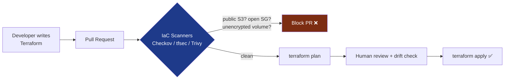

This is the ultimate expression of **shift-left** (Volume I's SSDLC theme): the misconfiguration that would have caused a breach, a security group open to the world, an unencrypted database, a public bucket, is caught in a code review, *before it ever exists in production*. The cost of fixing a vulnerability grows by orders of magnitude the later it's found:

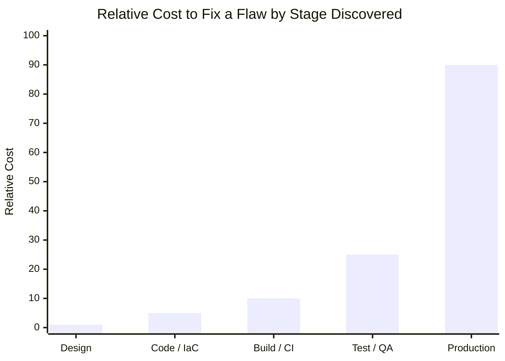

Each step right multiplies the cost, and a *breach* in production is off this chart entirely. IaC scanning is how you push detection to the cheapest possible column.

:::note[Immutability is a security property]
IaC enables **immutable infrastructure**: servers are never patched in place, they're *replaced* from a known-good image. This quietly kills two problems. **Configuration drift** (the slow divergence of "what's running" from "what we think is running") disappears, because every deploy rebuilds from source. And attacker **persistence** gets much harder, a backdoor planted on a running host is wiped the next time that host is redeployed, which might be hours later. Cattle, not pets, is a security posture, not just an ops convenience.
:::

---

## Part IV: The Supply Chain - The Frontier of the Decade

Here is the uncomfortable truth of modern software: **you wrote maybe 5% of what you ship.** The other 95% is open-source dependencies, base images, and build tooling, code from strangers, transitively pulled, running with your application's full privileges. The supply chain is now the most actively exploited frontier in security, because why breach a hardened target when you can compromise something *it trusts*?

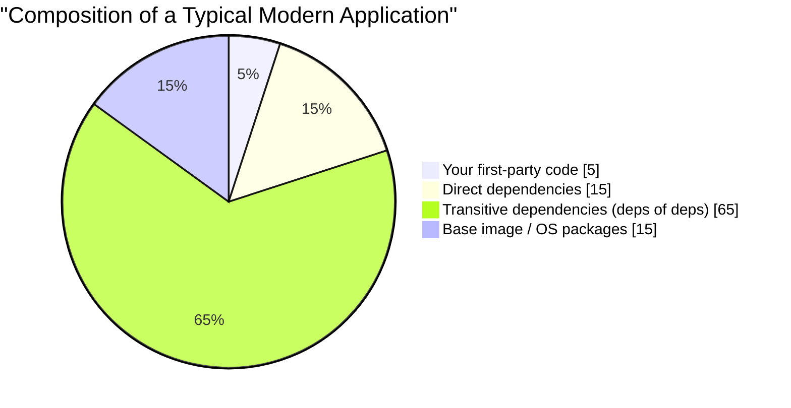

That giant "transitive" slice is the point: you *chose* your 15 direct dependencies, but you inherited hundreds you've never heard of, any one of which can end your security.

### Chapter 4: The Anatomy of a Supply Chain Attack

The catastrophes that defined recent years, **SolarWinds** (2020, a compromised build pipeline injected a backdoor into signed updates shipped to 18,000 organizations) and **Log4Shell** (2021, a trivially exploitable RCE in a logging library embedded in *millions* of applications) [^6], share a shape:

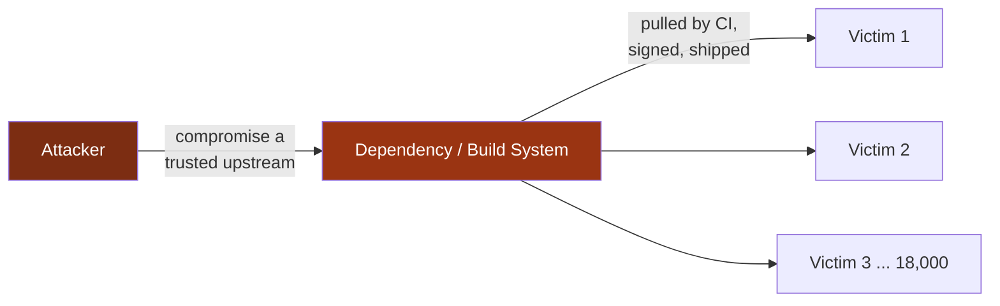

One compromise, thousands of victims, all of whom did everything else right. This asymmetry is why supply-chain security became a national-security priority, and why the defenses below are now table stakes, not sophistication.

### Chapter 5: The Modern Defenses - SBOM, Signing, and SLSA

Three interlocking practices answer the three supply-chain questions, *what's in it, is it what it claims to be, and can I trust how it was built*:

| Defense | Question it answers | What it is |
| --- | --- | --- |
| **SBOM** | *What's actually in my software?* | A Software Bill of Materials, a machine-readable inventory of every component and version. When the next Log4Shell drops, you grep your SBOMs and know in minutes, not weeks, whether you're exposed. [^7] |
| **Artifact signing** | *Is this artifact genuine and untampered?* | Cryptographically sign build outputs (**Sigstore/Cosign**) so consumers verify provenance, applying Volume III's signatures to your build artifacts. |
| **SLSA** | *Can I trust the process that built it?* | Supply-chain Levels for Software Artifacts, a graded framework for build integrity: source verified, build isolated, provenance generated and signed. [^8] |

The end-to-end secure pipeline weaves these together with everything in this series:

```mermaid
flowchart LR
    SRC[Signed commit<br/>+ branch protection] --> DEP[Dependency scan<br/>+ pin versions + SBOM]
    DEP --> BUILD[Isolated, ephemeral<br/>build - SLSA provenance]
    BUILD --> SAST[SAST + secret scan]
    SAST --> ART[Sign artifact<br/>Cosign]
    ART --> IMGSCAN[Image CVE scan]
    IMGSCAN --> ADMIT[Admission control:<br/>verify signature + policy]
    ADMIT --> RUN[Runtime security<br/>Falco]
    style BUILD fill:#1e3a8a,color:#fff
    style ADMIT fill:#065f46,color:#fff
```

:::warning[The CI/CD pipeline is itself a prime target]
Your build system has godlike privileges, it can read every secret, sign every artifact, and deploy to production. A leaked CI token, a malicious pull-request that runs untrusted code in a privileged runner, or a poisoned GitHub Action is a direct path to shipping backdoored software *with your own valid signature on it*. Treat the pipeline as production infrastructure: least-privilege tokens (OIDC-federated, short-lived, per Volume II), no secrets in logs, pinned action versions (by SHA, not tag), and isolated, ephemeral runners for untrusted code. The pipeline that builds your defenses is a target for the same reason a mint is: it manufactures trust. [^9]
:::

---

## Part VI: DevSecOps - Making Security Continuous

All five volumes converge on a single cultural shift. The old model, a security team that reviewed software at the end and said "no", cannot survive a world that deploys a thousand times a day. **DevSecOps** dissolves the security team's gate and distributes its expertise *into* the pipeline, so security is automated, continuous, and everyone's job.

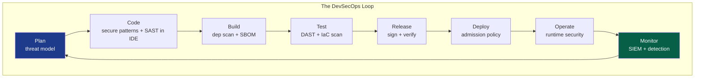

Every node in that loop is a chapter from this series, now automated and embedded: threat modeling (I), secure coding and crypto (III), dependency and IaC scanning (V), signing (III/V), admission control and Zero Trust enforcement (II), runtime detection and SIEM (IV). Security stops being a *phase* and becomes a *property* of the pipeline, checked continuously, enforced by code, invisible when it passes and loud only when it fails.

:::important[The cultural core of it all]
DevSecOps is 20% tools and 80% culture. Its founding belief is that **security is a shared responsibility, not a department's veto.** You get there by making the secure path the *easy* path: pre-approved hardened base images, secure-by-default templates, IaC modules that are compliant out of the box, and automated feedback in seconds, in the pull request, not in a quarterly audit. When doing the secure thing is *less* work than doing the insecure thing, security scales. When it's a tax, developers route around it, every time.
:::

---

## Conclusion: The Synthesis of the Series

We began, in Volume I, at the physical layer, a cable in a wall, a frame on a wire, and we end here, at a container that exists for ninety seconds inside infrastructure that is itself just text in a git repository. Across five volumes, one truth compounded at every level:

> **There is no single control that secures a system. Security is depth, layers of independent, overlapping controls, each assuming the one in front of it will eventually fail.**

Look back at what that depth actually became:

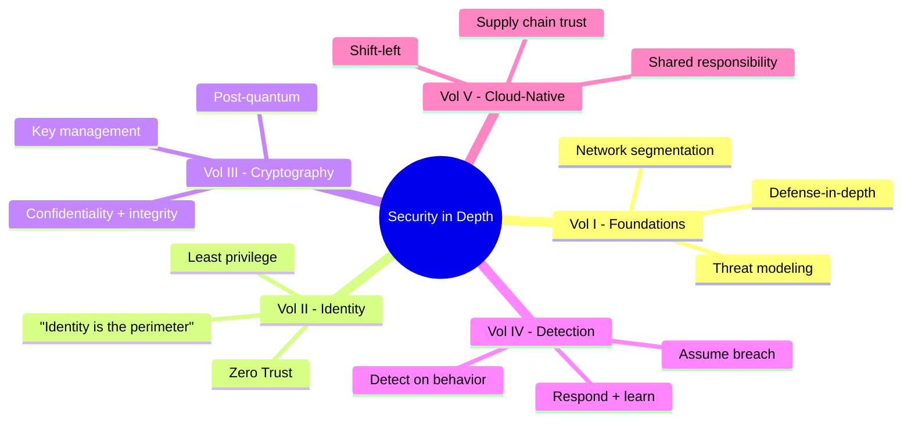

The firewall assumes the network could be breached, so identity verifies every request. Identity assumes a credential could be stolen, so cryptography makes the session unforgeable and forward-secret. Cryptography assumes an endpoint could still be owned, so detection watches for the behavior that betrays it. Detection assumes the workload itself could be poisoned, so the supply chain proves what we ship is what we built. Not one of these controls trusts the others to be perfect, and *that distrust, engineered into architecture,* is the whole art.

The perimeter dissolved. The machines became ephemeral. The code became mostly strangers'. And through all of it, the discipline held: **layer your defenses, verify everything, assume breach, prove provenance, and never trust a single wall to be the last one.** That is security in depth. That is the job.

Thank you for walking the whole stack. Go build things that are hard to break, and humble enough to survive being broken.

---

## References

[^1]: [AWS - Shared Responsibility Model](https://aws.amazon.com/compliance/shared-responsibility-model/)
[^2]: [Gartner / CSA - The Egregious Eleven: Top Cloud Security Threats](https://cloudsecurityalliance.org/artifacts/top-threats-to-cloud-computing-egregious-eleven/)
[^3]: [NIST (2017) - SP 800-190: Application Container Security Guide](https://csrc.nist.gov/publications/detail/sp/800-190/final)
[^4]: [Kubernetes - Overview of Cloud Native Security (The 4C's)](https://kubernetes.io/docs/concepts/security/overview/)
[^5]: [Open Policy Agent - Gatekeeper](https://open-policy-agent.github.io/gatekeeper/website/docs/)
[^6]: [CISA - Apache Log4j Vulnerability Guidance](https://www.cisa.gov/uscert/apache-log4j-vulnerability-guidance)
[^7]: [NTIA - Software Bill of Materials (SBOM)](https://www.ntia.gov/SBOM)
[^8]: [SLSA - Supply-chain Levels for Software Artifacts](https://slsa.dev/)
[^9]: [OWASP - Top 10 CI/CD Security Risks](https://owasp.org/www-project-top-10-ci-cd-security-risks/)
