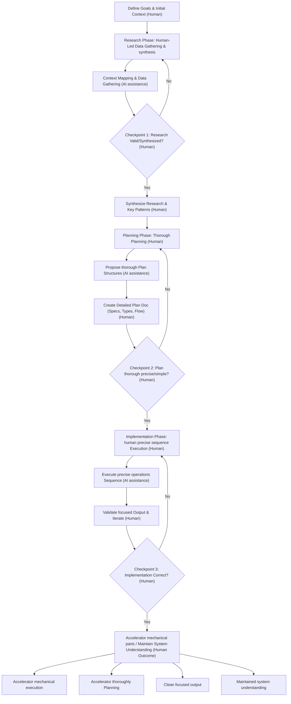

There is a quiet phenomenon happening across engineering teams right now. A developer uses an AI agent to generate a complex feature. The tests pass. The code is deployed. But if you ask that developer to explain the exact mechanics of what was just shipped, they might struggle.

We are shipping code we don't fully understand, and the velocity at which we are doing it is unprecedented.

Recent industry discussions—most notably from engineering leaders tackling massive codebases at enterprise companies—have highlighted a glaring paradox in modern software development. AI tools have turned tasks that used to take days into mere hours. But large production systems inevitably fail, and when they do, you need a human who deeply understands the system to debug it.

We are not the first generation to face a software crisis, but we are the first to face it at an infinite scale of generation.

## The Illusion of "Easy"

To understand why our codebases are becoming harder to comprehend, we have to revisit a fundamental engineering philosophy: the difference between *simple* and *easy*.

As famously defined by Rich Hickey (creator of Clojure), **simple** refers to structure. It means a component does one thing and is not entangled with others. **Easy**, on the other hand, means proximity. It means the solution is readily available at your fingertips—like pulling a package from npm, copying a snippet from Stack Overflow, or prompting an LLM.

Simplicity requires deliberate thought, design, and architectural untangling. "Easy" requires almost no thought at all.

AI is the ultimate "easy" button. In a chat interface, there is zero friction to adding functionality. You ask an AI to add authentication, then OAuth, then patch a session bug. Before long, you aren't doing software engineering; you are managing a bloated context window. Because AI models are eager to please, they simply layer new code over old code, morphing the logic to satisfy your latest prompt without any resistance to bad architectural decisions.

We trade simplicity for speed now, only to pay the price in massive complexity later.

## Accidental Complexity in the AI Era

In his legendary 1986 paper *No Silver Bullet*, Fred Brooks divided software complexity into two categories:
1.  **Essential Complexity:** The fundamental difficulty of solving the actual business problem.
2.  **Accidental Complexity:** The messy workarounds, legacy abstractions, and technical debt we create while trying to implement the solution.

In a massive, aging codebase, these two types of complexity are deeply intertwined. Separating them requires historical context and human intuition.

AI generation tools struggle immensely with this. When an LLM scans a repository, it lacks the judgment to tell the difference between a core business rule and an outdated, hacky workaround. It treats every existing pattern as a strict requirement to be preserved. If you ask an AI to refactor a deeply coupled legacy system, it will often spiral out of control, either giving up or recreating the old, broken patterns using new syntax.

## The Solution: Spec-Driven Development

If the core issue is a lack of comprehension, the solution is not to prompt harder or wait for a smarter model. The solution is to change our relationship with code generation entirely. We must shift from writing code to *specifying architecture*.

This methodology—often referred to as context compression or spec-driven development—forces the human engineer to do the hard work of thinking before the AI does the mechanical work of typing. It typically involves three distinct phases:

### 1. Guided Research
Instead of asking the AI to start coding, you feed it relevant architecture diagrams, docs, and targeted code snippets. You ask it to map out dependencies and identify edge cases. As the human, you validate and correct this analysis. The output is not code, but a verified research document.

### 2. High-Fidelity Planning
Using the research, you draft a strict implementation plan. This includes defining function signatures, data flows, and service boundaries. This document should be so precise that a junior engineer could execute it without making architectural choices. This is where you actively strip out accidental complexity.

### 3. Constrained Implementation
Finally, you hand the exact, validated specification to the AI to execute. Because the AI is heavily constrained by your blueprint, it doesn't wander into "complexity spirals." You can review the generated code quickly because you are simply verifying it against your own plan.

## The Future of the Engineer

The hardest part of software engineering has never been typing the syntax. It has always been knowing *what* to type in the first place.

If we use AI to bypass the critical thinking phase, our system intuition will atrophy. We will lose the hard-earned instinct that tells us a specific architecture is too fragile or too tightly coupled.

The engineers who thrive in the AI era will not be the ones who generate the highest volume of code. They will be the ones who maintain a deep, structural understanding of what they are building, who can see the architectural seams, and who use AI to accelerate the mechanics while fiercely protecting the simplicity of the design.

***
