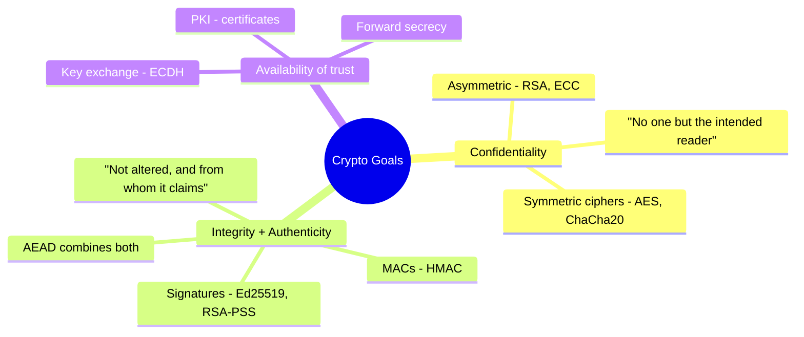
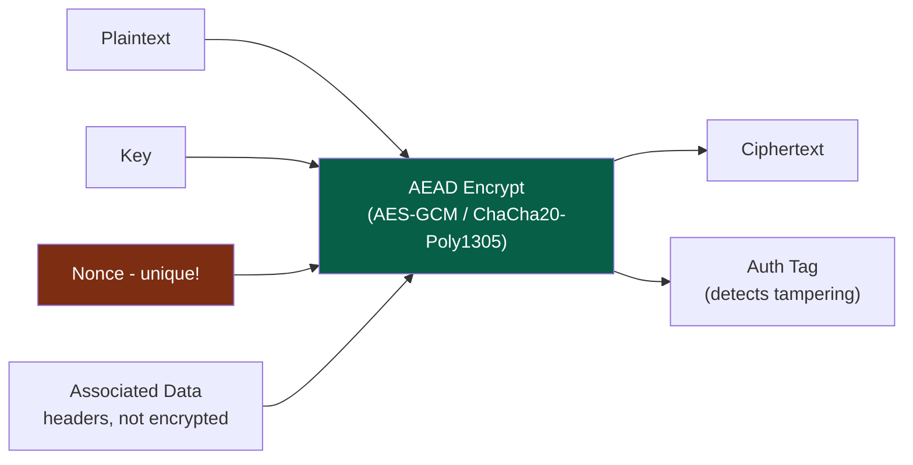
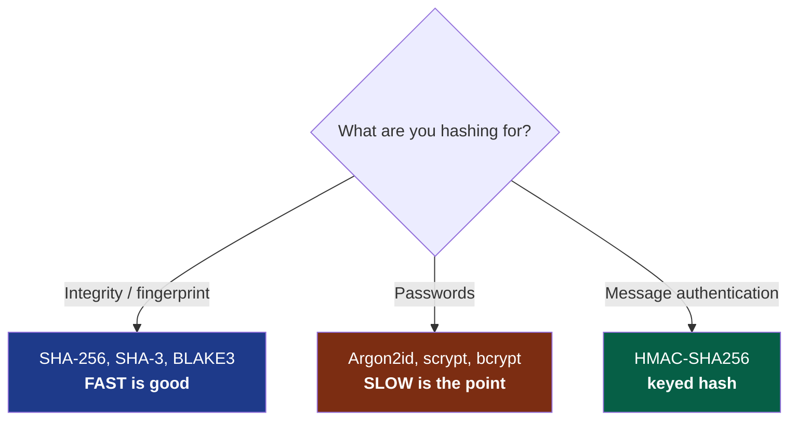
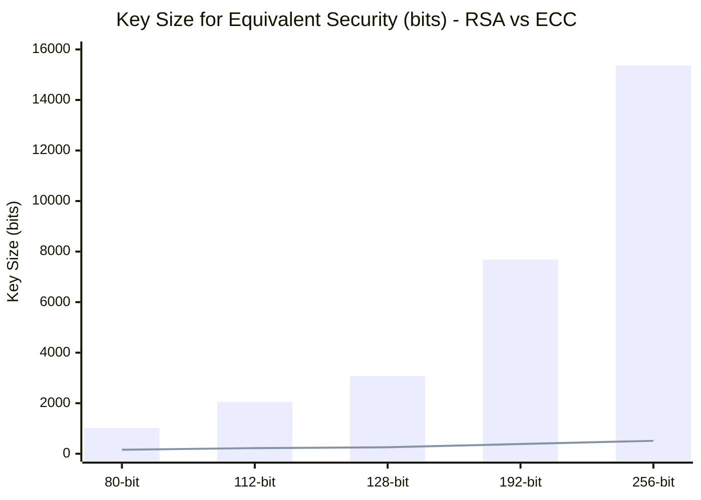
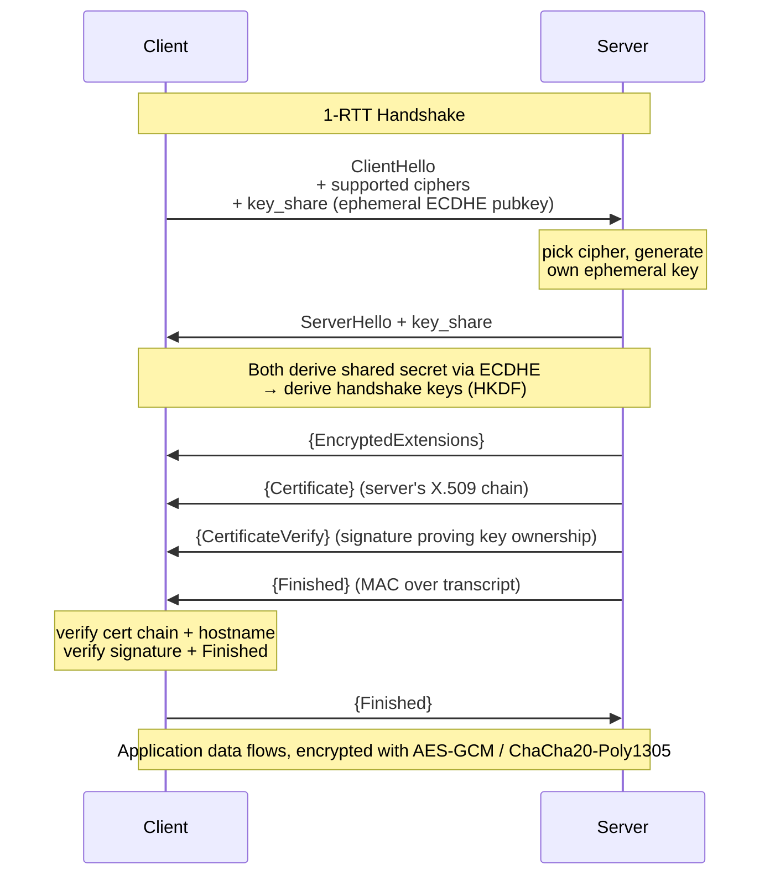
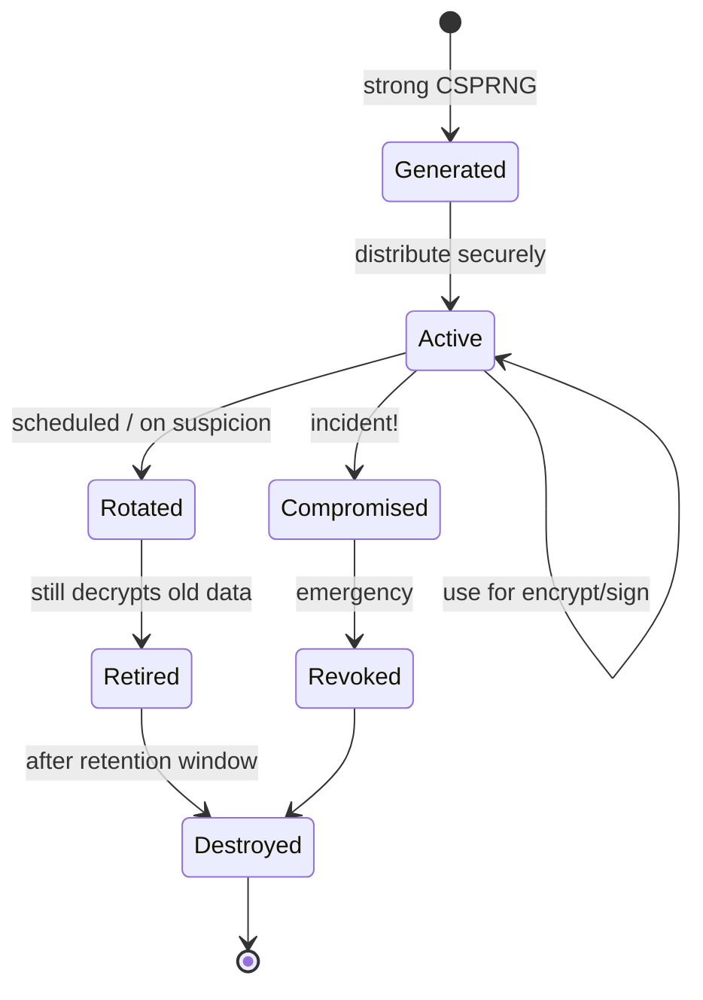
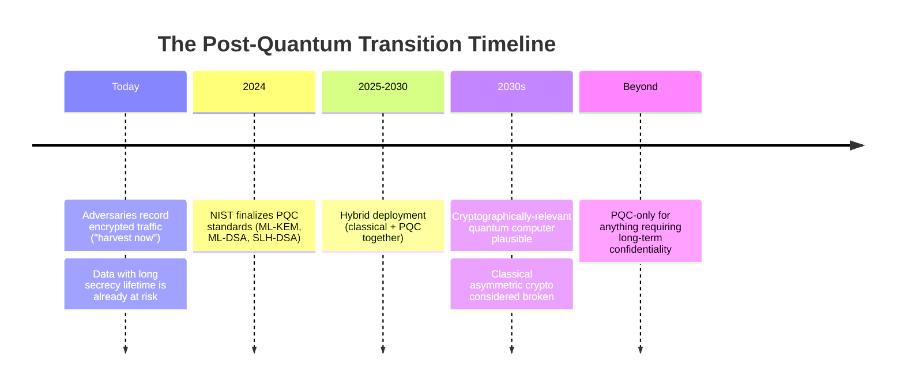
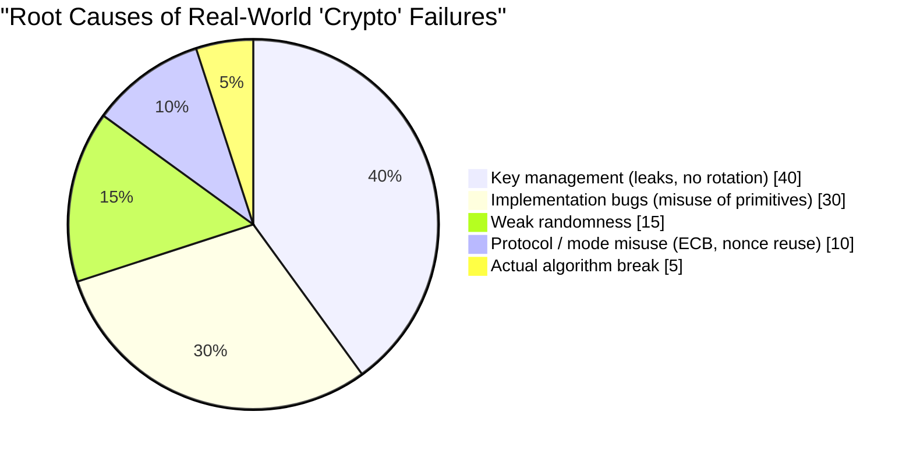

## The Box We Kept Closing

Twice now this series has leaned on cryptography and waved its hands. [Volume I](/posts/secure_systems_architecture/) said "use TLS." [Volume II](/posts/identity_and_access_in_depth/) said "the signature is bound to the origin" and "hash with Argon2id" and moved on. Every one of those sentences hid a machine of exquisite, brittle machinery.

This volume opens the box.

The goal is not to make you a cryptographer, that path runs through years of mathematics and a healthy fear of your own cleverness. The goal is to make you a **cryptography *engineer***: someone who knows which primitive solves which problem, why the safe defaults are safe, and, above all, how to recognize the moment you are about to do something catastrophic.

:::important[The First Commandment]
**Do not invent your own cryptography. Do not implement your own primitives.** Not the cipher, not the mode, not the padding, not the random number generator. Use vetted, high-level libraries (libsodium, Tink, the platform's native crypto) that make the safe choice the *default* choice. Everything in this volume exists so you understand what those libraries do, not so you rebuild them. Every catastrophic crypto failure in history began with an engineer who thought this rule didn't apply to them. [^1]
:::

---

## Part I: The Three Goals and the Primitives That Serve Them

All of cryptography, in practice, serves some combination of three goals:

A fourth goal, **non-repudiation** (you cannot later deny you signed it), falls out of digital signatures specifically, and is the one property symmetric crypto *cannot* give you, because both parties share the key, either could have produced the tag.

### Chapter 1: Symmetric Cryptography - Fast, Shared, and Modal

Symmetric crypto uses **one shared key** for both encryption and decryption. It is *fast* (hardware-accelerated AES runs at gigabytes per second) but has one hard problem: **how do both parties get the same key without an eavesdropper seeing it?** (Part II answers that.)

The subtlety that sinks beginners is **modes of operation**. A block cipher like AES encrypts one fixed 16-byte block. To encrypt anything real, you chain blocks, and the chaining mode is where security lives or dies.

:::warning[The ECB penguin - why mode matters]
The naive mode, **ECB (Electronic Codebook)**, encrypts each block independently. Identical plaintext blocks produce identical ciphertext blocks. Encrypt a bitmap of the Linux penguin in ECB and you can still *see the penguin* in the ciphertext, the outline leaks straight through. ECB destroys confidentiality on any data with structure. If you ever see `AES/ECB` in code, treat it as a bug. [^2]
:::

The modern answer is **AEAD (Authenticated Encryption with Associated Data)**, which fuses confidentiality *and* integrity into one primitive so you cannot get one without the other:

The two AEAD ciphers you should reach for:

| Cipher | Strengths | Watch out for |
| --- | --- | --- |
| **AES-256-GCM** | Hardware-accelerated everywhere (AES-NI), ubiquitous | **Nonce reuse is catastrophic**, repeating a nonce under the same key leaks the authentication key and plaintext XOR |
| **ChaCha20-Poly1305** | Fast in *software* (great on mobile/IoT without AES-NI), constant-time by design | Same nonce-uniqueness requirement |

:::caution[The nonce is not a secret, but it must be unique]
A **nonce** (number-used-once) does not need to be secret, it ships in the clear. But under a given key it must **never repeat**. With GCM's 96-bit random nonce, birthday-bound collisions become a real risk after roughly $2^{32}$ messages under one key. The safe patterns: use a *counter* nonce (guaranteed unique), rotate keys well before the limit, or use a nonce-misuse-resistant mode like **AES-GCM-SIV**. [^3]
:::

### Chapter 2: Hashing - The One-Way Street

A cryptographic hash maps arbitrary input to a fixed-size digest such that it is infeasible to (a) reverse it, (b) find two inputs with the same digest (**collision resistance**), or (c) find an input matching a given digest (**preimage resistance**).

Three uses that people constantly conflate, and they need *different* functions:

This is the crux: **for file integrity you want the fastest secure hash; for passwords you want the slowest.** Using SHA-256 for passwords is a vulnerability (a GPU cracks billions/sec); using Argon2id for a file checksum is just pointlessly slow. Same word, "hash", opposite requirements.

**MACs** add a key so that only someone holding the secret can produce or verify the tag, this is integrity *and* authenticity. Use **HMAC** and always compare tags with a **constant-time comparison**, an early-exit `==` leaks timing information an attacker can use to forge tags byte by byte.

$$
\text{HMAC}(K, m) = H\big((K \oplus opad)\,\|\,H((K \oplus ipad)\,\|\,m)\big)
$$

The double-hashing structure is not decoration, it defends against **length-extension attacks** that would otherwise let an attacker append data to a naïvely-keyed `H(K \| m)` construction.

### Chapter 3: Asymmetric Cryptography - Solving the Key-Exchange Problem

Asymmetric (public-key) crypto uses a **keypair**: a public key you share freely and a private key you guard with your life. Anyone can encrypt to your public key; only your private key decrypts. Or: you sign with your private key; anyone verifies with your public key.

* **RSA** - the classic. Security rests on the hardness of factoring large integers. Now considered *large and slow*, 3072-bit keys for 128-bit security. Fine, but heavy.
* **Elliptic Curve Cryptography (ECC)** - the same security with dramatically smaller keys, because it rests on the elliptic-curve discrete-log problem, which is harder per bit. A **256-bit ECC key ≈ a 3072-bit RSA key**.

The chasm between the bars (RSA) and the line (ECC) at high security levels is why modern protocols default to elliptic curves: **Ed25519** for signatures, **X25519** for key exchange, both fast, small, and designed to be hard to misuse [^4].

:::note[Asymmetric crypto rarely encrypts your data directly]
Public-key operations are slow and size-limited. In practice you almost never RSA-encrypt a file. You use asymmetric crypto to **exchange or wrap a symmetric key**, then encrypt the bulk data with fast AEAD. This is **hybrid encryption**, and it is what TLS, PGP, age, and every sane system actually do.
:::

---

## Part II: Key Exchange & The TLS 1.3 Handshake

We can now answer the question symmetric crypto couldn't: how do two strangers agree on a shared secret over a wire an attacker is watching?

### Chapter 4: Diffie-Hellman and Forward Secrecy

**Diffie-Hellman (DH)** is the beautiful trick at the heart of it. Both parties mix their private secret with the other's public value and, thanks to the algebra, arrive at *the same* shared secret, while an eavesdropper who saw both public values cannot compute it.

The killer property is **(Perfect) Forward Secrecy**. If each session uses an *ephemeral* DH keypair (ECDHE, the "E" is ephemeral) that is thrown away afterward, then even if an attacker records all your encrypted traffic today *and steals your long-term private key next year*, they still cannot decrypt the recorded sessions. The session keys died with the sessions.

:::important[Why forward secrecy is non-negotiable now]
"Record now, decrypt later" is a real, funded adversary strategy, especially with quantum computers on the horizon (Chapter 7). Forward secrecy means today's captured ciphertext does not become a liability the day your server key leaks. TLS 1.3 makes forward-secret ECDHE **mandatory**, the old static-RSA key exchange (no forward secrecy) was removed entirely. [^5]
:::

### Chapter 5: The TLS 1.3 Handshake, For Real

Here is the handshake we kept saying "use TLS" about, the actual thing. TLS 1.3 cut the round trips from two to one and stripped out every insecure option [^5]:

Every step earns its place:

* **`key_share` in the very first message** - the client *guesses* the group and sends its ephemeral key immediately, which is how TLS 1.3 saves a round trip.
* **`Certificate` + `CertificateVerify`** - the certificate binds the server's identity to a public key (via the PKI chain from Volume II); the *signature* proves the server actually holds the matching private key. A stolen certificate without the private key is useless.
* **`Finished`** - a MAC over the entire handshake transcript. If a man-in-the-middle tampered with *any* earlier message (e.g., a downgrade attack stripping strong ciphers), the transcripts won't match and the handshake aborts.

:::tip[What TLS 1.3 deleted is as important as what it kept]
TLS 1.3 removed RSA key exchange, static DH, CBC-mode ciphers, RC4, MD5, SHA-1, compression (goodbye CRIME/BREACH), and renegotiation. The design philosophy: **fewer knobs means fewer ways to misconfigure yourself into a breach.** A protocol with no insecure options can't be talked into one. Disable TLS 1.0/1.1 everywhere; prefer 1.3, allow 1.2 only for legacy clients.
:::

---

## Part III: Key Management - Where Theory Meets Reality

The dirty secret of applied cryptography: **the algorithms are almost never the weak point. Key management is.** AES-256 has never been broken. But keys get committed to git, logged, emailed, hard-coded, and never rotated. The lifecycle is the discipline:

The load-bearing practices:

::::steps

:::step[Generate from a real CSPRNG]{subtitle="Birth"}
Keys must come from a **cryptographically secure** random source (`/dev/urandom`, `getrandom()`, the platform CSPRNG). Never `Math.random()`, never a timestamp seed, never a "clever" PRNG. Predictable randomness is the single most common root cause of "unbreakable" crypto being trivially broken.
:::

:::step[Store in a KMS or HSM]{subtitle="Custody"}
A **Hardware Security Module (HSM)** or cloud **KMS** stores the key such that it *never leaves* the boundary in plaintext, you send data *to* it for signing/decryption. This means an attacker who owns your application server still cannot exfiltrate the raw key.
:::

:::step[Use envelope encryption for scale]{subtitle="Structure"}
Encrypt data with a per-object **Data Encryption Key (DEK)**; encrypt each DEK with a central **Key Encryption Key (KEK)** held in the KMS. To rotate, you re-encrypt the small DEKs, not petabytes of data. This is how every major cloud does encryption at rest.
:::

:::step[Rotate, and be able to rotate *fast*]{subtitle="Maintenance"}
Rotation must be automated and non-disruptive, tag ciphertext with a key ID so old and new keys coexist during transition. The org that can rotate a key in minutes survives a leak; the one that would need a week-long migration is held hostage by its own architecture.
:::

::::

:::warning[The randomness failures that made history]
2008 Debian OpenSSL: a well-meaning patch neutered the entropy source, reducing the keyspace to ~32,767 possibilities, every SSH and TLS key generated for two years was guessable. 2010: Sony's PS3 reused a fixed nonce in ECDSA signatures, leaking the master signing key. The pattern is eternal: **cryptography fails at the randomness and the reuse, not at the cipher.** [^6]
:::

---

## Part IV: The Quantum Horizon

Every asymmetric primitive in this volume, RSA, ECC, Diffie-Hellman, rests on a math problem (factoring, discrete log) that a sufficiently large **quantum computer** running **Shor's algorithm** would solve efficiently. That machine does not exist yet. The threat, however, is already here.

### Chapter 7: Harvest Now, Decrypt Later

The asymmetric split in the quantum threat:

* **Asymmetric crypto (RSA, ECC, DH)** - *broken* by Shor's algorithm. This is the emergency.
* **Symmetric crypto (AES) and hashes (SHA-2/3)** - only *weakened* by Grover's algorithm, which effectively halves the security level. The fix is trivial: use **AES-256** (which retains 128-bit security post-quantum) and 384-bit+ hashes. Symmetric crypto is basically fine.

In 2024 NIST standardized the first post-quantum algorithms [^7]:

* **ML-KEM** (Kyber) - key encapsulation, the replacement for ECDH key exchange.
* **ML-DSA** (Dilithium) and **SLH-DSA** (SPHINCS+) - digital signatures.

:::note[The pragmatic move today: hybrid]
No one flips to PQC-only overnight, the new algorithms are younger and less battle-tested. The industry answer is **hybrid key exchange**: run classical X25519 *and* ML-KEM together, combining both shared secrets, so the session is secure unless *both* are broken. Chrome, Cloudflare, and others already deploy X25519+ML-KEM by default. If you procure crypto with a decade-plus secrecy requirement, ask your vendors about their PQC roadmap **now**. [^8]
:::

---

## Part V: The Hall of Shame - How Engineers Break Good Crypto

The algorithms are sound. Here is how real systems die anyway, a field guide to the failures you will actually cause or find in review:

| Anti-pattern | Why it kills you | The fix |
| --- | --- | --- |
| **Rolling your own crypto** | You will get a subtle detail wrong; attackers won't miss it | Use libsodium / Tink / platform crypto |
| **ECB mode** | Leaks plaintext structure (the penguin) | AEAD: AES-GCM / ChaCha20-Poly1305 |
| **Nonce / IV reuse** | Catastrophic key/plaintext leak under GCM | Counter nonces, or AES-GCM-SIV |
| **Weak randomness** | Predictable keys = no keys at all | CSPRNG only, never `Math.random()` |
| **SHA-256 for passwords** | GPU cracks billions/sec | Argon2id / scrypt / bcrypt |
| **`==` for MAC/tag compare** | Timing side-channel forges tags | Constant-time comparison |
| **Not verifying certificates** | `verify=False` reopens the MitM door | Validate chain + hostname + expiry |
| **No forward secrecy** | One key leak decrypts all history | Ephemeral ECDHE (TLS 1.3) |
| **Encrypt without authenticate** | Padding-oracle & bit-flipping attacks | AEAD, or encrypt-then-MAC |

Read that chart again. **Actual algorithm breaks are the smallest slice.** Ninety-five percent of "crypto failures" are engineering failures, key handling, misuse, randomness, all of which are firmly in *your* control and covered by the disciplines in this volume.

:::important[The takeaway]
Good cryptography is not about knowing the math. It is about **respecting the boundaries** the math imposes: unique nonces, secret keys, real randomness, authenticated ciphertext, verified certificates, forward secrecy, rotation. Get those boundaries right with vetted libraries and you inherit the full strength of primitives smarter people spent decades hardening. Cross a boundary, and no algorithm can save you.
:::

---

## Conclusion & The Road Ahead

We have now built trust from the primitives up: the ciphers that keep secrets, the signatures that prove identity, the handshake that ties them together over a hostile wire, the key lifecycle that keeps it all honest, and the quantum reckoning already casting its shadow.

But cryptography, identity, and network walls are all *preventive* controls. They assume you can keep the attacker out. **Volume IV** accepts the opposite premise, the one every seasoned defender internalizes: *assume breach.* We move to the blue team's operational reality, detection engineering, the MITRE ATT&CK framework, threat hunting, SIEM/SOAR pipelines, and the incident-response and forensics playbooks you run when, not if, the prevention fails.

Prevention is a promise you cannot fully keep. Detection is how you survive breaking it.

---

## References

[^1]: [Latacora - Cryptographic Right Answers](https://www.latacora.com/blog/2018/04/03/cryptographic-right-answers/)
[^2]: [Filippo Valsorda / Wikipedia - Block cipher mode of operation (ECB penguin)](https://en.wikipedia.org/wiki/Block_cipher_mode_of_operation#Electronic_codebook_(ECB))
[^3]: [IETF - RFC 8452: AES-GCM-SIV Nonce Misuse-Resistant AEAD](https://datatracker.ietf.org/doc/html/rfc8452)
[^4]: [Bernstein, D. J. et al. - Ed25519 & Curve25519](https://ed25519.cr.yp.to/)
[^5]: [IETF - RFC 8446: The Transport Layer Security (TLS) Protocol Version 1.3](https://datatracker.ietf.org/doc/html/rfc8446)
[^6]: [Debian - DSA-1571-1 openssl predictable random number generator](https://www.debian.org/security/2008/dsa-1571)
[^7]: [NIST (2024) - Post-Quantum Cryptography Standards (FIPS 203/204/205)](https://csrc.nist.gov/projects/post-quantum-cryptography)
[^8]: [Cloudflare - The state of the post-quantum Internet](https://blog.cloudflare.com/pq-2024/)
