## The Premise That Changes Everything

The first three volumes were, at heart, optimistic. [Volume I](/posts/secure_systems_architecture/) built walls. [Volume II](/posts/identity_and_access_in_depth/) put a guard at every door. [Volume III](/posts/cryptography_engineering_in_depth/) made the messages between them unforgeable. All of it *preventive*, all of it premised on keeping the attacker out.

This volume begins where that optimism ends, with the sentence every seasoned defender has tattooed on their soul:

> **Assume breach.** Given enough time, budget, and motivation, a determined adversary gets in. The question is not *whether* you will be compromised, but *how fast you notice, and how well you respond.*

The industry measures this with two brutal numbers: **MTTD** (Mean Time to Detect) and **MTTR** (Mean Time to Respond). The 2024 industry average dwell time, from initial compromise to detection, is still measured in *days to weeks*. In that window, an attacker moves laterally, escalates, and exfiltrates. This volume is about collapsing that window.

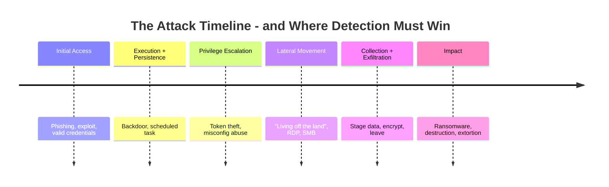

Every hour you shave off detection is an hour of that timeline the attacker doesn't get. Welcome to the blue team.

---

## Part I: Telemetry - You Cannot Detect What You Cannot See

Detection is a data problem before it is a clever-analytics problem. If the evidence was never collected, no algorithm recovers it. So the blue team's first job is **visibility**: instrumenting the estate to emit the right signals.

### Chapter 1: The Sources of Truth

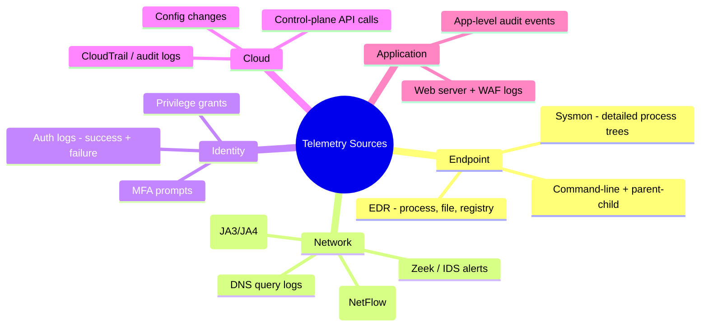

**The Defender's View:** Not all logs are equal. The most valuable telemetry is the kind that captures *behavior*, especially **process command lines with parent-child lineage** (Sysmon Event ID 1) and **authentication events**. A firewall log tells you a connection happened; a process tree tells you `winword.exe` spawned `powershell.exe` spawned `cmd.exe` running an encoded command, which is a story, and the story is the detection.

:::important[Logging is a coverage problem - map it]
The classic failure is *silent gaps*: you're logging 80% of your estate and the breach lands in the other 20%. Maintain a **logging coverage matrix**, source × data type × retention, and treat a gap as a vulnerability. A detection rule is worthless if the data it needs was never ingested. Audit your coverage the way you'd audit patch levels.
:::

### Chapter 2: The SIEM Pipeline

A **SIEM** (Security Information and Event Management) is the aggregation brain: it ingests everything above, normalizes it to a common schema, correlates across sources, and raises alerts. The modern pipeline:

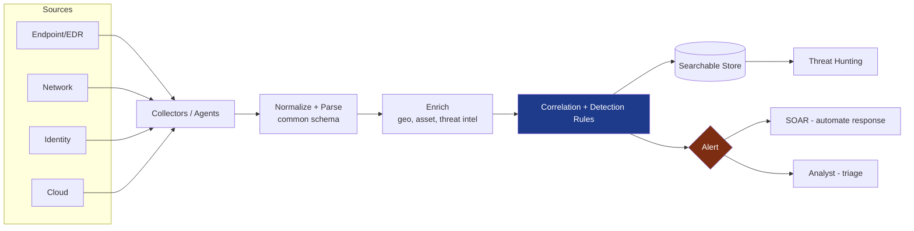

The **enrichment** step is quietly the most valuable: an IP address is noise until you know it's a Tor exit node, that the asset is a domain controller, and that the user normally logs in from another continent. Enrichment turns data into *context*, and context is what makes an alert actionable instead of ignorable.

---

## Part II: Detection Engineering

Buying a SIEM does not give you detections any more than buying a piano gives you music. **Detection engineering** is the discipline of writing, testing, and maintaining the rules that turn telemetry into alerts, treating detections as code.

### Chapter 3: MITRE ATT&CK - The Common Language

**MITRE ATT&CK** is the field's shared map: a matrix of adversary **Tactics** (the *why*, e.g., Persistence, Lateral Movement) and **Techniques** (the *how*, e.g., T1053 Scheduled Task) observed in real intrusions [^1]. It is the Rosetta Stone that lets red team, blue team, and threat intel speak the same language.

The defender's power move is **coverage mapping**, overlaying your detection rules onto the matrix to expose blind spots:

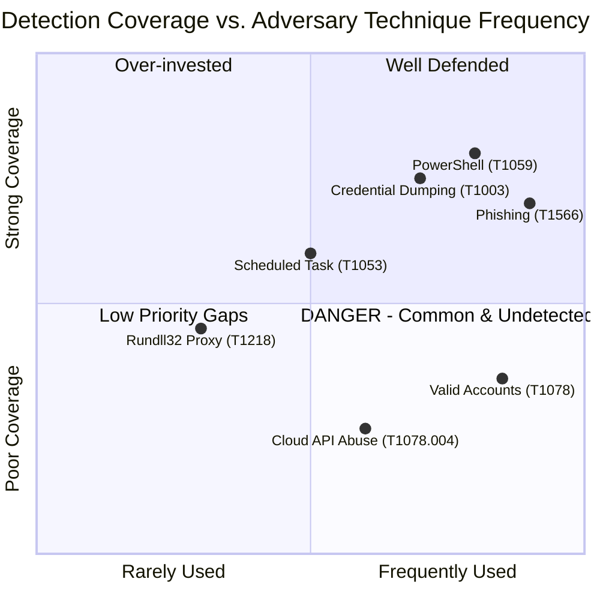

Quadrant 4, **common techniques with weak coverage**, is your prioritized backlog. This is how a small blue team allocates finite effort: defend what attackers actually do and you don't yet catch, before chasing exotic techniques nobody uses against you.

### Chapter 4: The Pyramid of Pain

Not all detections are equal in *how much they hurt the adversary*. David Bianco's **Pyramid of Pain** ranks indicators by how costly they are for an attacker to change once you're detecting on them [^2]:

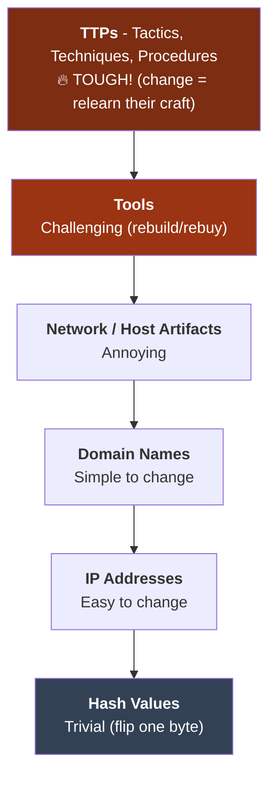

The lesson reshapes strategy. Blocking a file **hash** feels satisfying but the attacker recompiles and defeats it in seconds. Detecting a **behavior**, "any Office app spawning a scripting engine that reaches out to the internet", forces the adversary to abandon an entire *technique*. **Detect on behavior, not just indicators.** The higher up the pyramid your detection lives, the more it costs your adversary to evade.

:::tip[Detection-as-code]
Treat detections like software: write them in a portable format (**Sigma** rules), store them in **git**, code-review them, and *test* them against known-malicious samples and, crucially, benign activity to measure false positives. A detection with a 40% false-positive rate is worse than no detection, it trains analysts to click "ignore." Version, test, and retire rules the way you would any production code. [^3]
:::

### Chapter 5: The Signal-to-Noise War

The eternal tension of detection is the tradeoff between catching real attacks (true positives) and drowning analysts in false alarms:

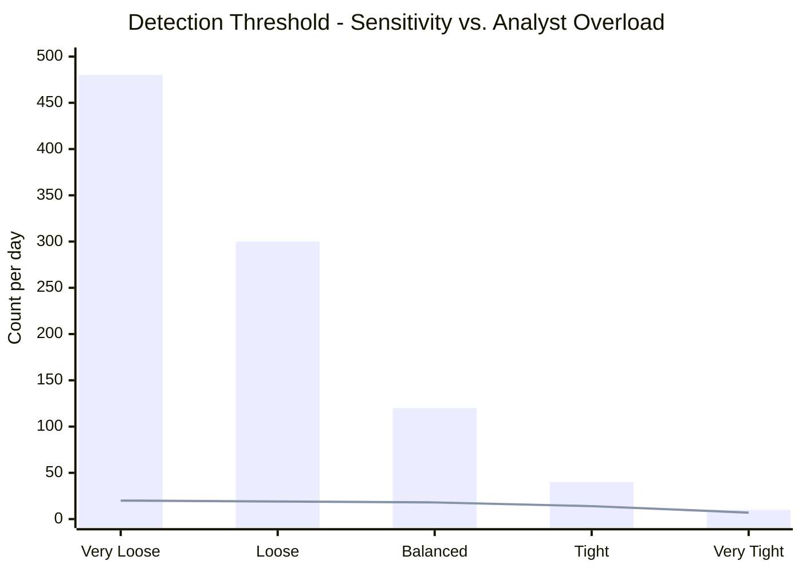

The bars are total alerts; the line is *true* positives. Tune too loose (left) and analysts triage 480 alerts to find 20 real ones, they burn out and start rubber-stamping. Tune too tight (right) and you miss real attacks. **Alert fatigue is a security control failure**, not just an HR problem. The goal is not maximum alerts; it is maximum *true positives per analyst-hour*, which is why SOAR (next) exists.

---

## Part III: The SOC - Response at Machine Speed

### Chapter 6: Tiered Operations and SOAR

A **Security Operations Center (SOC)** is the team and process that lives in the alert stream. The classic structure, and its modern automation:

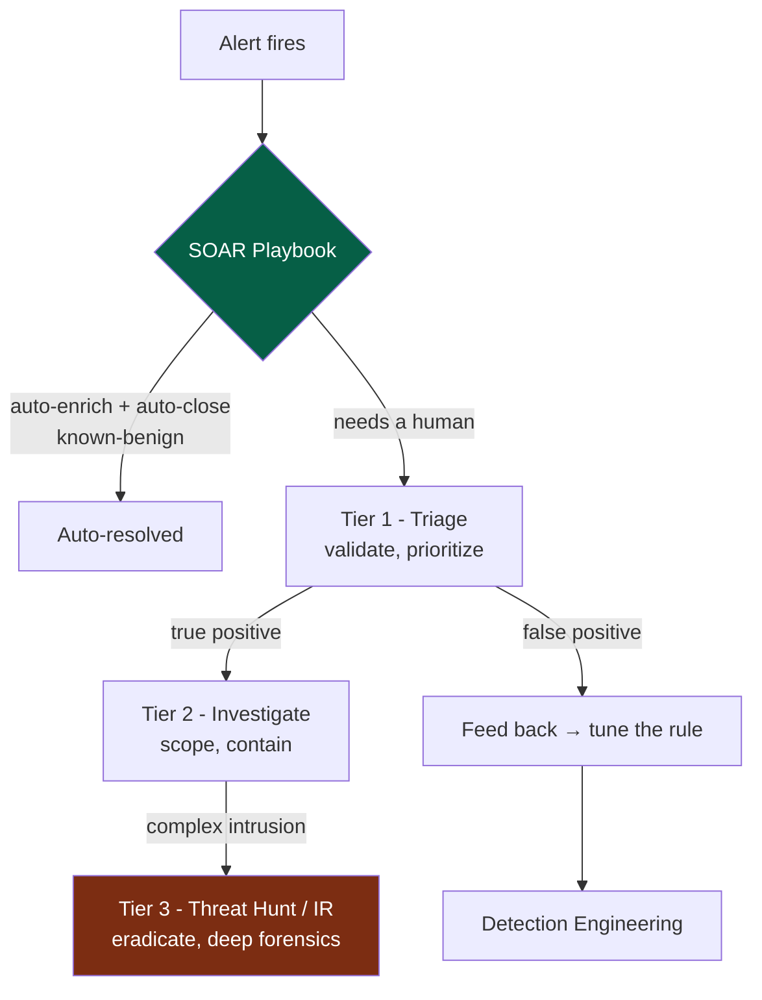

**SOAR** (Security Orchestration, Automation and Response) is the force multiplier. It runs *playbooks*, automated sequences that enrich an alert, gather context, and even take contained action (isolate a host, disable an account, block an IP) without waiting for a human. A well-built SOAR pipeline auto-resolves the bulk of low-fidelity noise so humans spend their attention where judgment actually matters.

:::note[The feedback loop is the whole point]
Notice the arrow from Tier 1 back to Detection Engineering. A mature SOC is a *learning system*: every false positive tunes a rule, every missed detection (found later) becomes a new one. A SOC that only reacts to alerts without feeding lessons back into its detections is running to stand still.
:::

### Chapter 7: Threat Hunting - Assume They're Already In

Detection waits for a rule to fire. **Threat hunting** is the opposite posture: proactively searching the telemetry for adversaries who slipped past the rules, on the explicit assumption that they're already inside. It is *hypothesis-driven*:

::::steps

:::step[Form a hypothesis]{subtitle="Where would they hide?"}
Grounded in threat intel or ATT&CK: *"If an attacker achieved persistence, I'd expect anomalous scheduled tasks created outside business hours by non-admin accounts."* A good hypothesis is specific and falsifiable.
:::

:::step[Gather and analyze the data]{subtitle="Go look"}
Query the SIEM/EDR for evidence for or against the hypothesis. Pivot on process lineage, network destinations, authentication anomalies. Look for the *absence* of normal as much as the presence of evil.
:::

:::step[Uncover, or refine]{subtitle="Findings"}
Either you find something (escalate to IR) or you don't, both are wins. A hunt that finds nothing has *validated* a control and mapped normal behavior.
:::

:::step[Operationalize the finding]{subtitle="Automate it away"}
Whatever the hunt taught you becomes a *new automated detection*, so you never have to hunt for that same thing by hand again. Hunts should continuously convert into rules.
:::

::::

:::caution[Hunting requires baselines]
You cannot spot *anomalous* without knowing *normal*. Effective hunting depends on baselining, what does a typical day of DNS, authentication, and process activity look like for *this* environment? Attackers exploit the fact that most orgs have never characterized their own normal, which is why "living off the land" (using built-in tools like PowerShell and `certutil`) is so effective: it hides in traffic you never learned to read.
:::

---

## Part IV: When It All Goes Loud - Incident Response

Eventually a detection is real and severe. Now you execute the **Incident Response** process, and the difference between a contained incident and a company-ending breach is almost always *preparation and discipline under pressure*, not heroics.

### Chapter 8: The NIST IR Lifecycle

NIST SP 800-61 defines the canonical loop [^4]:

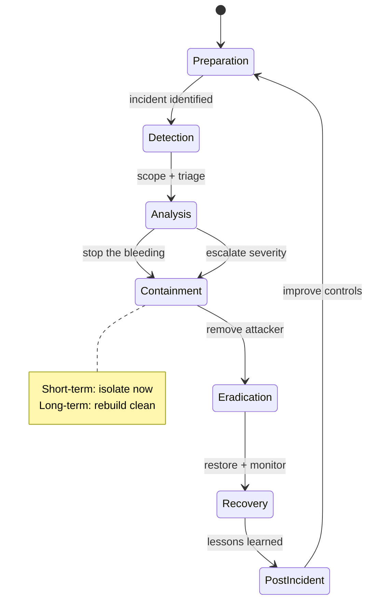

The phase engineers most often get wrong is **Containment**. Two failure modes:

* **Tipping off the attacker too early** - pulling the plug on one host while they hold ten others just tells them you're onto them, and they burn everything or accelerate exfiltration. Sometimes you *watch* before you *strike*, gathering scope.
* **Not containing fast enough** - the opposite sin, deliberating while data leaves the building.

:::warning[Do not destroy the evidence you'll need]
The panicked instinct is to *reimage the box now*. But a live compromised host holds volatile evidence, running processes, network connections, memory-resident malware, that vanishes the instant you power off. Where feasible, **capture memory and disk images before eradication.** You will need them for scope ("what else did they touch?"), for legal/regulatory obligations, and to ensure eradication was actually complete. Order of volatility matters: memory first, then disk. [^5]
:::

### Chapter 9: Digital Forensics - Reconstructing the Truth

When the incident is over (or for legal proceedings), **Digital Forensics and Incident Response (DFIR)** reconstructs exactly what happened. The cardinal principle is the **chain of custody** and **order of volatility**, evidence must be collected in order from most to least ephemeral, and every handling step documented, or it's worthless in court and untrustworthy for scoping:

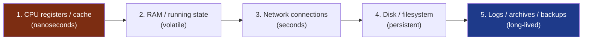

Forensic analysts reconstruct the intrusion timeline from filesystem metadata (MFT, `$LogFile`), memory dumps (Volatility), Windows event logs, and artifacts like prefetch and shimcache, weaving thousands of timestamps into a coherent narrative of *how they got in, what they did, and what they took.*

### Chapter 10: The Blameless Postmortem

The most valuable phase is the one under time pressure to skip: **lessons learned**. The rule that makes it work is **blamelessness**, the analysis targets *systems and processes*, never individuals. The instant a postmortem becomes about assigning blame, people stop telling the truth, and you lose the very information you need to improve.

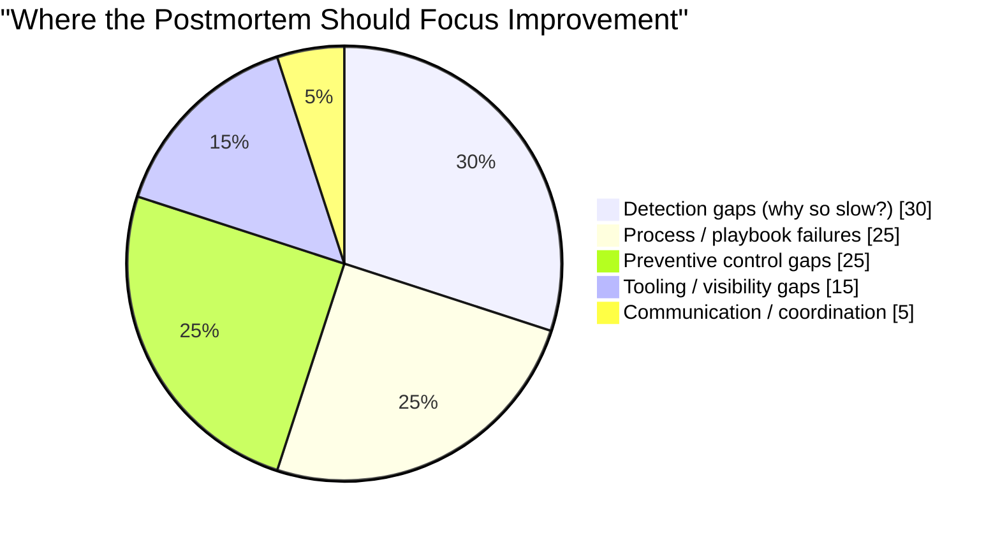

Every incident is expensive tuition. The organizations that compound their security maturity are the ones that *extract the full lesson*: each breach permanently closes the gap that allowed it, feeding directly back into the Preparation phase, and into the detections of Part II.

---

## Part V: Threat Intelligence - Knowing Your Adversary

Detection and response sharpen dramatically when you know *who* is likely to target you and *how they operate*. **Cyber Threat Intelligence (CTI)** is the discipline of turning raw data about adversaries into decisions, and it operates at three altitudes:

| Level | Audience | Question it answers | Example |
| --- | --- | --- | --- |
| **Strategic** | Executives / board | *Who targets our industry and why?* | "Ransomware groups increasingly target healthcare billing" |
| **Operational** | SOC leadership | *What campaigns and TTPs are active now?* | "This group uses spear-phishing → Cobalt Strike → double extortion" |
| **Tactical** | Analysts / tools | *What specific indicators do I block/detect?* | IOCs, ATT&CK technique IDs, YARA/Sigma rules |

The connective framework is the **Diamond Model**, every intrusion event has four vertices, and pivoting between them expands your understanding:

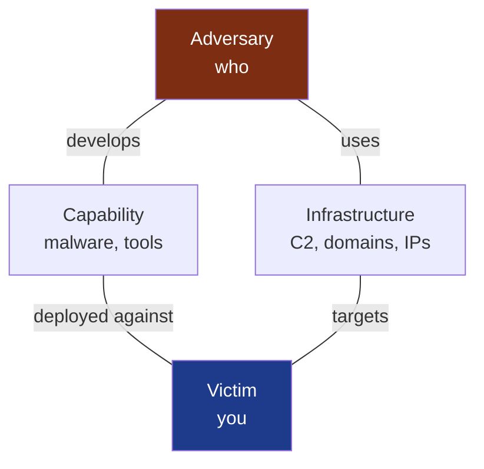

Knowing one C2 domain (Infrastructure) lets you pivot to other domains on the same registrar/pattern; knowing the malware (Capability) lets you write a YARA rule that catches the adversary's *next* campaign. CTI is how the blue team stops playing pure defense and starts anticipating.

:::important[Intelligence must drive action, or it's trivia]
A feed of ten thousand malicious IPs that no rule consumes is noise, not intelligence. The test of CTI is a closed loop: does it change what you detect, block, hunt for, or prioritize? Feed tactical IOCs into your SIEM enrichment, feed operational TTPs into your ATT&CK coverage map, and feed strategic assessments into your risk decisions. Intelligence that doesn't reach a control is a report no one reads.
:::

---

## Conclusion & The Road Ahead

We have now lived the defender's full loop: **see** (telemetry), **detect** (engineering rules on behavior), **respond** (SOC and IR discipline), **learn** (blameless postmortems), and **anticipate** (threat intelligence). We accepted that prevention fails, and built the muscle to survive it, to shrink dwell time from weeks toward minutes.

But there's one frontier where all of this gets harder and faster at once: the **cloud-native** world of ephemeral containers, declarative infrastructure, and software assembled from thousands of open-source dependencies you never wrote. Here the perimeter dissolves further, workloads live for seconds, and the most dangerous breaches enter not through your code but through your *supply chain*, a poisoned dependency, a compromised build pipeline, a leaked CI token.

**Volume V**, the finale, brings the whole series home to modern cloud-native and DevSecOps security: container and Kubernetes hardening, infrastructure-as-code scanning, securing the CI/CD pipeline, SBOMs and SLSA, and defending the software supply chain, where the next decade's defining breaches are already happening.

---

## References

[^1]: [MITRE - ATT&CK Framework](https://attack.mitre.org/)
[^2]: [David Bianco (2013) - The Pyramid of Pain](https://detect-respond.blogspot.com/2013/03/the-pyramid-of-pain.html)
[^3]: [SigmaHQ - Generic Signature Format for SIEM Systems](https://github.com/SigmaHQ/sigma)
[^4]: [NIST (2012) - SP 800-61 Rev. 2: Computer Security Incident Handling Guide](https://csrc.nist.gov/publications/detail/sp/800-61/rev-2/final)
[^5]: [IETF - RFC 3227: Guidelines for Evidence Collection and Archiving](https://datatracker.ietf.org/doc/html/rfc3227)
