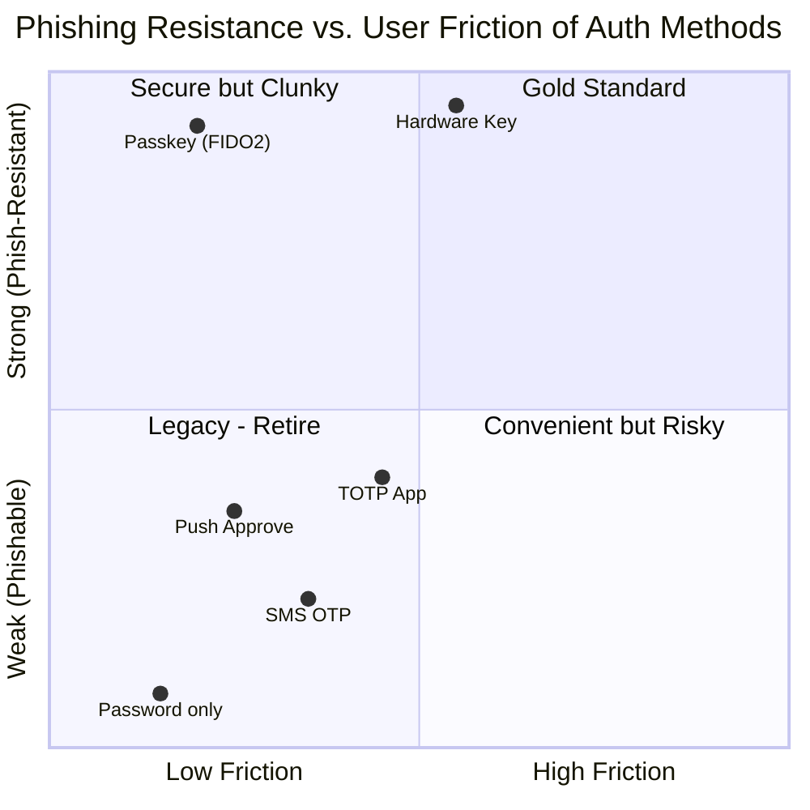
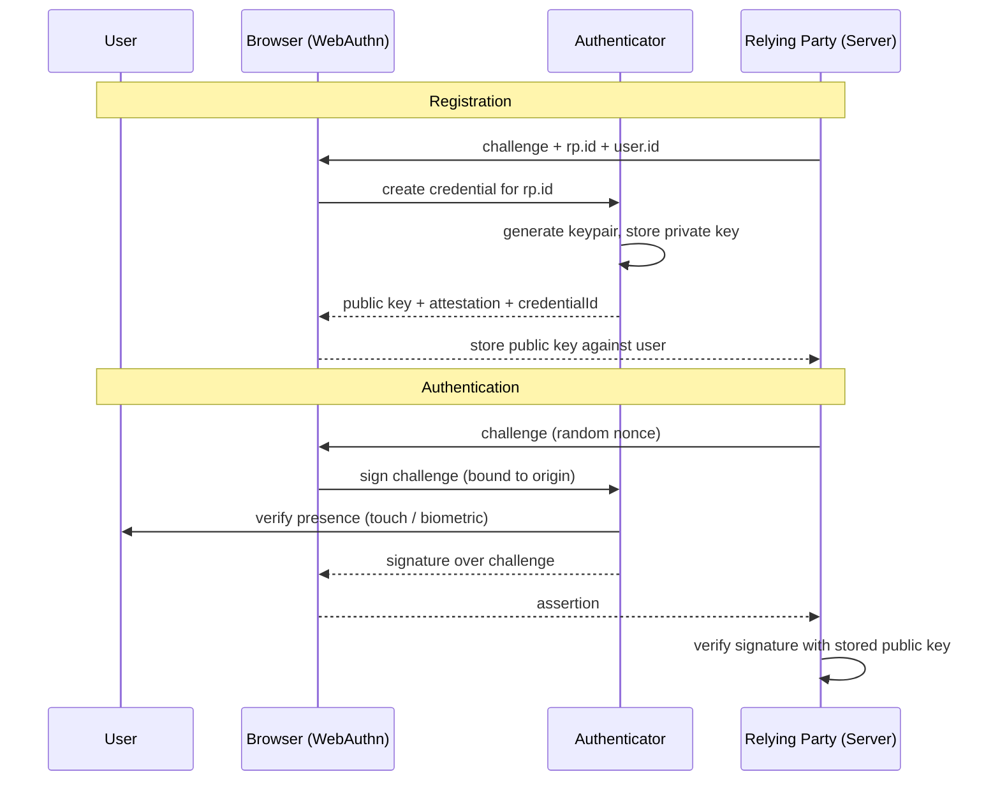
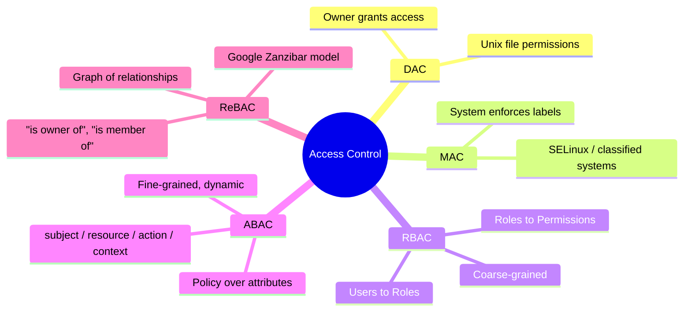
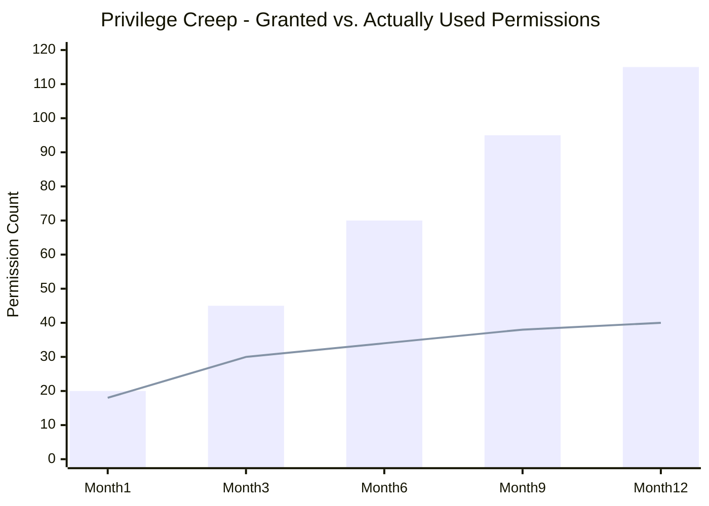
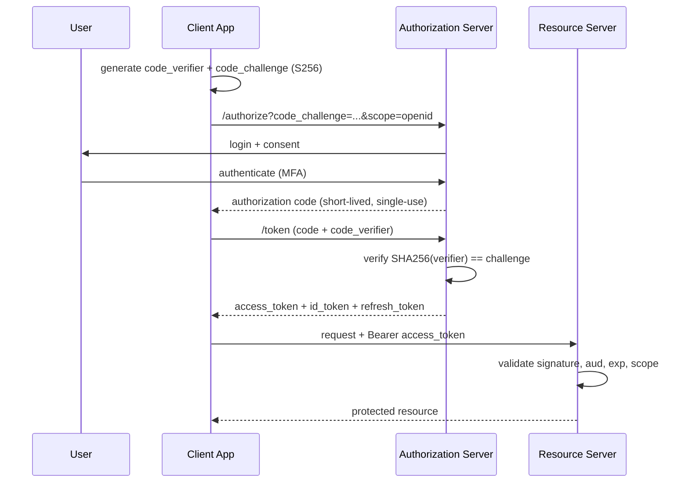
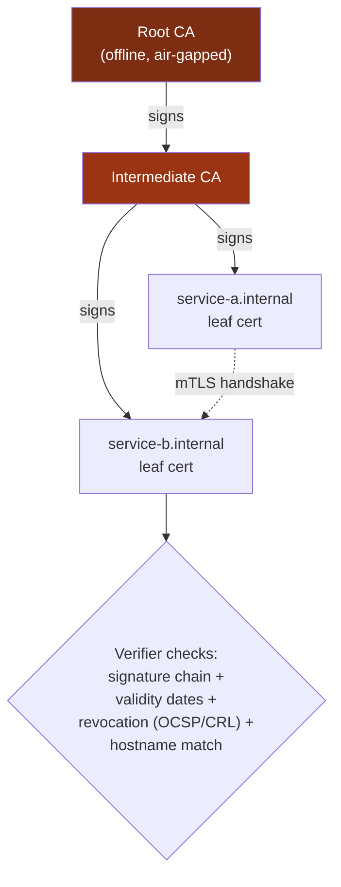
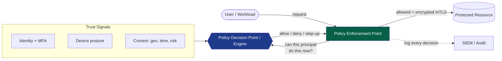
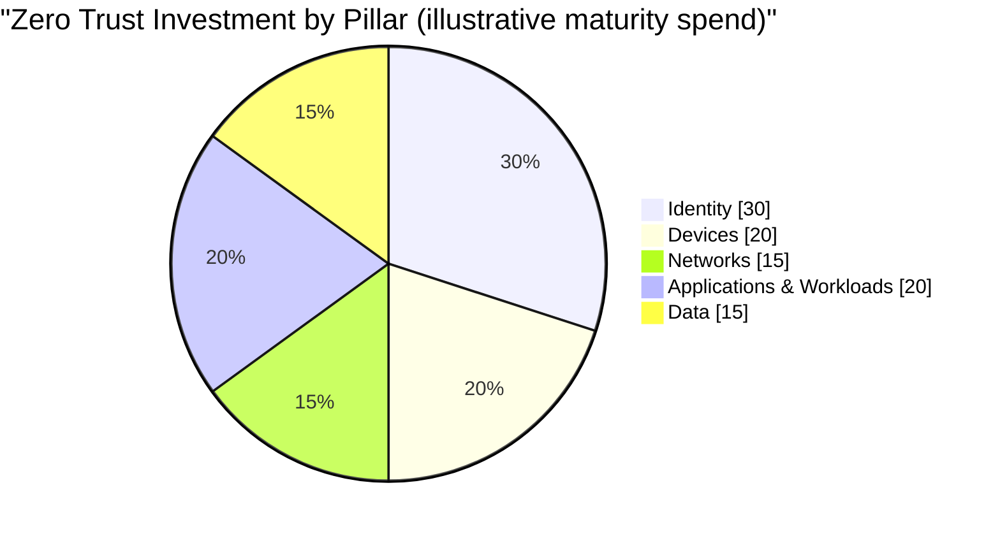

## Where Volume I Left Off

In [Volume I](/posts/secure_systems_architecture/) we walked the whole stack, from copper to code, through four pairs of eyes: the Network Engineer, the Defender, the Hacker, and the Software Engineer. We drew our walls at the network edge, sprinkled IDS sensors along the corridors, and treated the firewall as the gatekeeper of the realm.

Then the realm dissolved.

Laptops went home. Servers moved to someone else's data center. APIs started calling APIs across the public internet. The tidy castle-and-moat picture, where "inside" meant *trusted* and "outside" meant *hostile*, stopped describing reality. The moat is gone. What is left is a swarm of principals: people, services, devices, and workloads, each asking to do something, each needing to prove who they are and what they are allowed to touch.

That is the subject of this volume. **Identity is the new perimeter** [^1], and every request is a border crossing.

:::note[The through-line of this volume]
Authentication answers *"who are you?"* Authorization answers *"what may you do?"* Everything else in this article, factors, tokens, sessions, policy engines, key material, exists to make those two answers **trustworthy, revocable, and auditable** at machine speed.
:::

---

## Part I: Authentication - Proving Who You Are

### Chapter 1: The Three Factors, Reconsidered

Every authentication scheme reduces to combinations of three classic factors, plus two modern additions:

* **Something you know** - passwords, PINs, passphrases.
* **Something you have** - a hardware key, a phone, a smart card.
* **Something you are** - fingerprint, face, iris.
* **Somewhere you are** - geolocation / network context (a *contextual* signal, not a hard factor).
* **Something you do** - behavioral biometrics: typing cadence, mouse dynamics.

**The Hacker's View:** Each factor has a native attack. Knowledge factors are *phished* and *sprayed*. Possession factors are *stolen* or *SIM-swapped*. Inherence factors are *spoofed* (a lifted fingerprint, a printed face) and, crucially, **cannot be rotated** once compromised, you get ten fingerprints for life.

**The Defender's View:** Multi-Factor Authentication (MFA) works because the attacker must now compromise factors of *different kinds* simultaneously. But not all MFA is equal. This is the single most important nuance defenders miss:



The lesson from the chart: **SMS-based OTP is MFA, but it is weak MFA.** It resists password reuse but not a real-time phishing proxy or a SIM swap. Only **FIDO2 / WebAuthn** credentials, where the private key never leaves the authenticator and the signature is cryptographically bound to the origin, are genuinely *phishing-resistant* [^2].

:::warning[MFA fatigue is a real attack]
In 2022, several high-profile breaches used **push-bombing**: the attacker already has the password, then spams the victim with approval prompts until, out of annoyance or confusion, they tap "Approve." Push-based MFA without *number matching* is a design flaw, not a security control. Prefer passkeys, or enforce number matching plus context (app name, location) on every prompt. [^3]
:::

### Chapter 2: Passwords That Refuse to Die

Even in a passkey future, password databases will exist for a decade. Storing them correctly is non-negotiable.

The rule: **never store what the user typed.** Store a slow, salted, memory-hard hash.

$$
H = \text{Argon2id}(\text{password}, \text{salt}, m, t, p)
$$

where $m$ is memory cost (KiB), $t$ is time cost (iterations), and $p$ is parallelism. Argon2id is the current OWASP-recommended default because it resists both GPU cracking (via memory hardness) and side-channel attacks (via its hybrid data access pattern) [^4].

Why *slow* hashing matters, expressed as attacker economics. If an attacker can compute $R$ hashes per second, cracking a password drawn uniformly from a keyspace of size $N$ takes, on average:

$$
t_{\text{crack}} = \frac{N}{2R}
$$

A fast hash like unsalted SHA-256 gives a modern GPU rig $R \approx 10^{11}$ guesses/second. A tuned Argon2id can drop that to $R \approx 10^{3}$. That eight-order-of-magnitude collapse in $R$ is the entire game.

:::tip[The password storage checklist]

1. **Hash** with Argon2id (or scrypt / bcrypt if Argon2 is unavailable).
2. **Salt** uniquely per user (defeats rainbow tables).
3. Consider a server-side **pepper** stored in an HSM/KMS, separate from the database (defeats an attacker who dumps only the DB).
4. **Never** cap password length aggressively or forbid paste, both push users toward weaker secrets.
5. Check new passwords against **breach corpora** (e.g., HaveIBeenPwned's k-anonymity API) [^5].

:::

### Chapter 3: The Passwordless Endgame - WebAuthn & Passkeys

WebAuthn (the browser API) plus CTAP (the authenticator protocol) together form **FIDO2**. The mental model:



The magic is in one line: **the signature is bound to the origin (`rp.id`)**. A phishing site at `paypa1.com` cannot get the authenticator to produce a valid assertion for `paypal.com`, because the browser refuses to release it. This eliminates the entire category of credential phishing by construction, not by user vigilance [^2].

A **passkey** is simply a *discoverable, syncable* FIDO2 credential, backed up to a cloud keychain (Apple, Google, Microsoft, or a password manager) so it survives device loss. That sync is the ergonomic breakthrough that made passwordless viable for consumers.

---

## Part II: Authorization - Deciding What You May Do

Authentication is the easy half. **Authorization is where real systems bleed.** The OWASP Top 10 has ranked *Broken Access Control* as the **#1** web risk, above injection and crypto failures combined [^6].

### Chapter 4: The Models - From Roles to Attributes to Relationships



**RBAC (Role-Based)** is where most organizations live: a user has roles, roles bundle permissions. It is easy to reason about and audit. Its failure mode is **role explosion**, when "editor for region EU on the finance project during business hours" becomes its own role, you have thousands of them and no one understands the graph.

**ABAC (Attribute-Based)** solves that by evaluating a *policy* over attributes at request time:

```txt
# A tiny ABAC policy (OPA / Rego style)
allow if {
    input.subject.department == input.resource.owner_department
    input.action == "read"
    input.context.time_hour >= 9
    input.context.time_hour < 18
}
```

**ReBAC (Relationship-Based)**, popularized by Google's **Zanzibar** paper [^7] and open-sourced as systems like OpenFGA and SpiceDB, models authorization as a graph: *"Alice is an editor of Doc, Doc is in Folder, Bob is a viewer of Folder → Bob can view Doc."* It shines for the "can user X do Y to object Z?" checks that dominate SaaS products with sharing and nesting.

:::important[The IDOR trap - authorization's most common wound]
An **Insecure Direct Object Reference (IDOR)** is what happens when you authenticate the user but forget to *authorize the object*. The classic:

```bash
GET /api/invoices/1043   ->  200 OK  (my invoice)
GET /api/invoices/1044   ->  200 OK  (someone else's invoice!)
```

The fix is a discipline, not a library: **every object fetch must be scoped to the requesting principal.** Never `SELECT * FROM invoices WHERE id = ?`; always `... WHERE id = ? AND owner_id = ?`, or push the check into a central policy engine. IDOR is *the* reason Broken Access Control tops the OWASP list. [^6]
:::

### Chapter 5: The Principle of Least Privilege, Quantified

Least privilege says: grant the *minimum* permissions needed, for the *minimum* time. In practice, entitlements only ever accumulate, this drift is called **privilege creep**. A useful mental metric is the ratio of permissions *used* to permissions *granted*:



The widening gap between the bars (granted) and the line (used) is your **standing attack surface**: privileges an attacker inherits the moment they compromise the account, and that no one is watching. The countermeasures:

* **Just-in-Time (JIT) access:** grant elevated rights for a bounded window, then auto-revoke.
* **Access reviews / recertification:** periodic "do you still need this?" campaigns.
* **Privileged Access Management (PAM):** vault admin credentials, broker sessions, record everything.

---

## Part III: Tokens, Sessions & Federation

### Chapter 6: OAuth 2.0, OIDC, and the Confusion Between Them

The single most common architectural error in this space is conflating **OAuth 2.0** (authoriz*ation* - delegated access) with **OpenID Connect** (authentic*ation* - proving identity). OIDC is a thin identity layer *on top of* OAuth 2.0 [^8].

* **OAuth 2.0** answers: *"Will you let this app act on your behalf to access resource R?"* It issues **access tokens**.
* **OIDC** answers: *"Who is this user?"* It issues an **ID token** (a signed JWT with claims about the user).

The modern, recommended flow for essentially everything, SPAs, mobile, and web apps alike, is **Authorization Code + PKCE**:



**Why PKCE (Proof Key for Code Exchange)?** Without it, an attacker who intercepts the authorization code (via a malicious app registered on the same URI scheme, say) could redeem it. PKCE binds the code to a secret (`code_verifier`) that only the legitimate client knows, so a stolen code is useless. **OAuth 2.1** makes PKCE mandatory for all clients and removes the dangerous *implicit* and *password* grant types entirely [^9].

:::caution[Stop using the Implicit flow]
The legacy Implicit grant returned tokens directly in the URL fragment, a design from an era before browsers had `fetch` and CORS. Tokens leaked into history, referrers, and logs. If a tutorial tells you to use `response_type=token`, the tutorial is a decade out of date. Authorization Code + PKCE, always.
:::

### Chapter 7: Sessions vs. Tokens - The Stateful/Stateless Tradeoff

| Property | Server Session (cookie → session store) | Self-contained JWT |
| --- | --- | --- |
| State | Server holds session; cookie is an opaque ID | Server holds nothing; token *is* the state |
| Revocation | **Instant** - delete the session row | **Hard** - valid until `exp`, needs a denylist |
| Scaling | Needs shared store (Redis) | Trivially horizontal |
| Payload | Tiny cookie | Larger token on every request |
| Best for | Classic web apps, need instant logout | Service-to-service, short-lived access tokens |

The industry-standard compromise: **short-lived access tokens (5–15 min) + long-lived refresh tokens.** The access token is a JWT you never revoke (it expires fast anyway); the refresh token is a revocable, rotating credential held server-side. Revoking a user cuts them off within one access-token lifetime.

:::warning[The three JWT footguns]

1. **`alg: none`** - historically, some libraries accepted a token that *declared* it needed no signature. Always pin the expected algorithm server-side; never trust the header's `alg`.
2. **HS256 vs RS256 confusion** - an attacker submits an HS256 token signed with your *public* RSA key as the HMAC secret. Pin the algorithm.
3. **Storing JWTs in `localStorage`** - readable by any XSS payload. Prefer `HttpOnly`, `Secure`, `SameSite` cookies for browser sessions. [^10]

:::

### Chapter 8: Federation & SSO

**Single Sign-On (SSO)** lets one login serve many applications. The two dominant protocols:

* **SAML 2.0** - XML-based, verbose, still dominant in enterprise B2B and legacy systems.
* **OIDC** - JSON/JWT-based, the default for new applications, mobile, and APIs.

The player list: an **Identity Provider (IdP)** - Okta, Entra ID, Keycloak, Google - authenticates the user and vouches for them to a **Service Provider (SP)** / Relying Party. The value is centralized: one place to enforce MFA, one place to disable a departing employee, one audit trail.

:::note[Deprovisioning is the silent killer]
SSO's greatest security benefit is **instant, central offboarding.** The most common real-world failure is the orphaned account, an employee leaves, HR closes the SSO account, but a local admin account on some forgotten server lives on. Reconcile every identity source against your HR system of record. An account no human owns is an account an attacker owns.
:::

---

## Part IV: Machine Identity & Secrets

Humans are a rounding error. In a modern cloud estate, **machine identities outnumber human ones by 45 to 1** [^11], every microservice, function, container, and CI job needs to authenticate to something.

### Chapter 9: PKI and the Chain of Trust

Machine-to-machine trust is built on **X.509 certificates** and Public Key Infrastructure. A certificate binds a public key to an identity, signed by a Certificate Authority (CA) the verifier trusts.



The root's private key is the crown jewel, kept **offline and air-gapped**, because its compromise invalidates everything below it. Intermediates do the day-to-day signing so the root rarely comes out of the vault.

**mTLS (mutual TLS)** is PKI's answer to service-to-service auth: *both* sides present certificates, so a service proves its identity to callers *and* callees. This is the cryptographic backbone of Zero Trust between workloads (and the reason service meshes like Istio and Linkerd exist, they automate cert issuance and rotation via **SPIFFE/SPIRE** identities) [^12].

### Chapter 10: Secrets Management

The oldest sin in software: the hard-coded secret.

```python
# The vulnerability that never dies
DB_PASSWORD = "hunter2"          # committed to git, forever in history
API_KEY = "sk_live_a1b2c3d4..."  # leaked in the client bundle
```

Git *never forgets*. A secret committed once and "removed" in the next commit is still in the history, still scraped by bots watching public pushes within seconds. The disciplines:

::::steps

:::step[Never commit secrets]{subtitle="Prevention"}
Use pre-commit hooks (`gitleaks`, `trufflehog`) to block secrets before they enter history. Enforce it in CI so no one can bypass it locally.
:::

:::step[Centralize in a secrets manager]{subtitle="Storage"}
HashiCorp Vault, AWS Secrets Manager, or cloud KMS. Applications fetch secrets at runtime via an authenticated identity, secrets never touch source control or env files baked into images.
:::

:::step[Prefer dynamic, short-lived secrets]{subtitle="Rotation"}
Vault can generate a database credential valid for one hour, then revoke it. A leaked one-hour credential is far less dangerous than a static one that has been valid for three years.
:::

:::step[Rotate on a schedule and on suspicion]{subtitle="Response"}
Automate rotation. When a secret *might* be exposed, rotate first and investigate second. Rotation must be a boring, one-click, zero-downtime operation, or it will never happen.
:::

::::

:::tip[Workload identity beats stored secrets]
The best secret is the one you never store. **Workload identity federation** (AWS IAM Roles for Service Accounts, GCP Workload Identity, OIDC-federated CI runners) lets a workload prove *what it is* to get short-lived credentials, with no long-lived key sitting anywhere to steal. If you are still pasting static cloud keys into CI, this is your highest-leverage upgrade.
:::

---

## Part V: Synthesis - Building a Zero Trust Architecture

We can now assemble everything into the model NIST formalized in **SP 800-207**: **Zero Trust** [^13]. Its founding assumption, and the reason it replaces the castle-and-moat, is a single sentence:

> **Never trust, always verify.** The network is assumed hostile. Location grants nothing. Every request is authenticated, authorized, and encrypted, on its own merits, every time.

The reference architecture has a **Policy Decision Point (PDP)** that evaluates policy, and **Policy Enforcement Points (PEP)** scattered in the data path that ask the PDP and enforce its verdict:



The five pillars a mature Zero Trust program addresses (per the CISA Zero Trust Maturity Model) [^14]:



Notice **Identity takes the largest slice**, that is not an accident. Once the network confers no trust, identity becomes the primary control plane. Everything in this volume, factors, tokens, policy engines, machine identity, is in service of making that control plane trustworthy.

:::important[Zero Trust is a journey, not a product]
No vendor sells "Zero Trust in a box." It is an *architecture* and an *operating principle* applied incrementally: start by putting phishing-resistant MFA on your most critical app, add device posture checks, then microsegment, then extend to workloads. Maturity is measured in eliminated implicit trust, not in dollars spent on appliances.
:::

---

## Conclusion & The Road Ahead

Volume I defended a place. This volume defended a *principal*, wherever it happens to be. We replaced the wall with a question asked at every door: *prove who you are, and prove you may.*

But every claim in this volume, every token signature, every mTLS handshake, every hashed password, rests on cryptography we have so far treated as a magic box that "just works." In **Volume III**, we open that box. We will build the primitives from the ground up: symmetric and asymmetric ciphers, the real TLS 1.3 handshake, key exchange and forward secrecy, and the looming disruption of post-quantum cryptography, along with the catalogue of ways engineers get all of it catastrophically wrong.

The identity you just learned to trust is only as strong as the math that signs it.

---

## References

[^1]: [Microsoft (2021) - Identity is the new security perimeter](https://www.microsoft.com/en-us/security/business/security-101/what-is-identity-access-management-iam)
[^2]: [FIDO Alliance - How FIDO Works](https://fidoalliance.org/how-fido-works/)
[^3]: [CISA (2022) - Implementing Phishing-Resistant MFA](https://www.cisa.gov/sites/default/files/publications/fact-sheet-implementing-phishing-resistant-mfa-508c.pdf)
[^4]: [OWASP - Password Storage Cheat Sheet](https://cheatsheetseries.owasp.org/cheatsheets/Password_Storage_Cheat_Sheet.html)
[^5]: [Troy Hunt - Have I Been Pwned: Pwned Passwords (k-Anonymity)](https://haveibeenpwned.com/API/v3#PwnedPasswords)
[^6]: [OWASP - A01:2021 Broken Access Control](https://owasp.org/Top10/A01_2021-Broken_Access_Control/)
[^7]: [Google (2019) - Zanzibar: Google's Consistent, Global Authorization System](https://research.google/pubs/pub48190/)
[^8]: [OpenID Foundation - What is OpenID Connect](https://openid.net/developers/how-connect-works/)
[^9]: [IETF - OAuth 2.1 Authorization Framework (draft)](https://datatracker.ietf.org/doc/html/draft-ietf-oauth-v2-1)
[^10]: [OWASP - JSON Web Token Cheat Sheet](https://cheatsheetseries.owasp.org/cheatsheets/JSON_Web_Token_for_Java_Cheat_Sheet.html)
[^11]: [CyberArk (2023) - Identity Security Threat Landscape Report](https://www.cyberark.com/threat-landscape/)
[^12]: [SPIFFE - Secure Production Identity Framework For Everyone](https://spiffe.io/docs/latest/spiffe-about/overview/)
[^13]: [NIST (2020) - SP 800-207: Zero Trust Architecture](https://csrc.nist.gov/publications/detail/sp/800-207/final)
[^14]: [CISA - Zero Trust Maturity Model v2.0](https://www.cisa.gov/zero-trust-maturity-model)
