## 1.0 Introduction: The Mandate of Adversarial Emulation

Security controls exist in a perpetual state of theoretical effectiveness until confronted by an adversary. Firewalls, endpoint detection agents, identity providers, and zero-trust policies are designed under assumptions of operational isolation. In real-world enterprise environments, however, systems do not exist in isolation; they are bound together by sprawling networks, legacy protocols, third-party dependencies, and human configuration errors.

**Penetration testing** is the disciplined, authorized, and structured simulation of adversarial techniques designed to evaluate the real-world security posture of an organization's systems, applications, and networks. Unlike automated vulnerability scanning, which merely catalogues discrete missing patches or signature matches, penetration testing is fundamentally **relational**: it seeks to discover how disparate low-severity misconfigurations, unpatched services, and logical oversights can be chained together to achieve unauthorized access, data compromise, or complete infrastructure control.

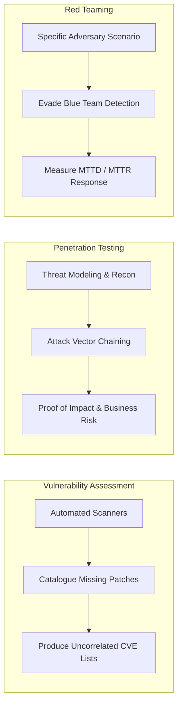

### 1.1 Penetration Testing vs. Vulnerability Scanning vs. Red Teaming

To understand where penetration testing sits within enterprise risk management, we must distinguish between three distinct security assessment disciplines:

| Dimension | Vulnerability Assessment | Penetration Testing | Red Teaming |
| :--- | :--- | :--- | :--- |
| **Primary Goal** | Identify and list as many known vulnerabilities as possible across an asset inventory. | Identify exploitable flaws, chain vulnerabilities, and prove theoretical vs. actual risk. | Test people, processes, and technology against specific adversary tactics over an extended engagement. |
| **Scope** | Broad, automated, covering wide CIDR ranges or codebases. | Target-specific (Network, Web App, Cloud, API, Physical). | Objective-oriented (e.g., "Exfiltrate customer database", "Access domain controller"). |
| **Tooling** | Nessus, Qualys, OpenVAS, Static Application Security Testing (SAST). | Manual analysis, proxy tools (Burp Suite), network tools, custom scripts, exploit frameworks. | Custom C2 frameworks, stealth loaders, living-off-the-land techniques, physical tools. |
| **Blue Team Awareness** | Blue team is aware; logs are generated in bulk without stealth constraints. | Blue team is usually notified to prevent operational disruption; stealth is optional based on RoE. | Blue team is typically unnotified ("blind testing") to measure detection and response metrics. |
| **Output** | Raw vulnerability list ranked by CVSS. | Contextualized report detailing attack chains, technical proof-of-concept, and remediation guidance. | Incident timeline, detection gap analysis, and blue team defensive enhancement recommendations. |

---

## 2.0 Methodological Frameworks and Standards

Ad-hoc, unstructured testing is inherently dangerous and yields incomplete results. Professional security assessments adhere to recognized, industry-standard methodologies to guarantee repeatable, safe, and comprehensive coverage.

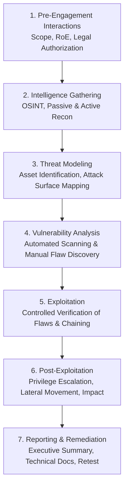

### 2.1 The Penetration Testing Execution Standard (PTES)

The **Penetration Testing Execution Standard (PTES)** defines seven rigorous phases of an assessment lifecycle:

1. **Pre-Engagement Interactions:** Defining legal boundaries, Rules of Engagement (RoE), emergency contacts, escalation paths, and operational windows.
2. **Intelligence Gathering (Reconnaissance):** Harvesting open-source intelligence (OSINT), analyzing DNS records, identifying infrastructure footprints, and discovering employee identities.
3. **Threat Modeling:** Identifying business assets, modeling attacker capabilities, and constructing prioritized attack trees.
4. **Vulnerability Analysis:** Discovering flaws through automated tooling and manual inspection of protocol implementations and application logic.
5. **Exploitation:** Executing precise, controlled actions to prove the viability of identified vulnerabilities without causing unintended system outages or data corruption.
6. **Post-Exploitation:** Determining the business value of compromised assets, identifying sensitive data paths, escalating privileges, and demonstrating lateral movement capabilities.
7. **Reporting:** Translating technical findings into actionable business risk analyses, executive summaries, and technical remediation roadmaps.

### 2.2 Complementary Standards: NIST SP 800-115, OWASP WSTG, & OSSTMM

- **NIST SP 800-115 (Technical Guide to Information Security Testing and Assessment):** Provides federal and enterprise guidance on target identification, vulnerability analysis, and penetration testing techniques.
- **OWASP Web Security Testing Guide (WSTG v4.2):** The industry benchmark for web application testing, defining over 90 discrete test cases across 12 categories (Identity Management, Authentication, Authorization, Session Management, Input Validation, Cryptography, Business Logic, and Client-Side Testing).
- **OWASP ASVS (Application Security Verification Standard):** Defines granular technical security requirements for designing, developing, and testing secure web applications across three verification levels (L1: Opportunistic, L2: Standard Enterprise, L3: Critical Infrastructure).
- **OSSTMM (Open Source Security Testing Methodology Manual):** A scientific, peer-reviewed methodology focusing on operational security metrics, calculating the *Risk Assessment Value (RAV)* across physical, human, wireless, telecommunications, and data networks.

---

## 3.0 Pre-Engagement, Scoping & Threat Modeling

The success and legality of any penetration test depend entirely on the pre-engagement phase. Operating without explicit, unambiguous, and written authorization constitutes criminal computer trespass under legal statutes such as the United States Computer Fraud and Abuse Act (CFAA) and equivalent international laws.

### 3.1 Defining the Scope and Testing Models

Assessments are categorized based on the amount of preliminary information provided to the testing team:

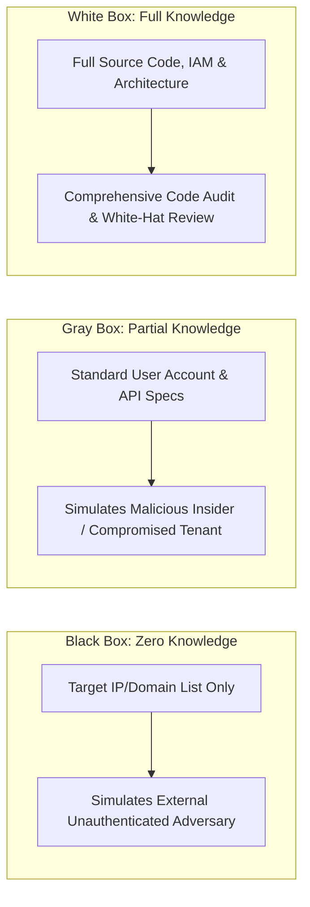

:::important[Rules of Engagement (RoE) Requirements]
A comprehensive Rules of Engagement document must explicitly define:

- **Explicit In-Scope Targets:** Exact FQDNs, CIDR blocks, API endpoints, and physical locations.
- **Explicit Out-of-Scope Targets:** Third-party cloud infrastructure (e.g., non-dedicated SaaS), shared hosting tenants, critical production databases, and physical branch offices.
- **Prohibited Techniques:** Explicit restrictions regarding Distributed Denial of Service (DDoS), destructive malware, physical entry, or social engineering targeting non-consenting personnel.
- **Deconfliction Procedures:** A shared secure communication channel (e.g., Signal or dedicated PGP-encrypted mail) to immediately verify whether observed alerts in the Security Operations Center (SOC) are simulated pentest traffic or a legitimate cyberattack.
- **Emergency Stop Protocols:** Immediate halt procedures if testing impacts system availability, disrupts business operations, or uncovers an active, third-party intrusion.

:::

---

## 4.0 Intelligence Gathering & Reconnaissance (OSINT)

Reconnaissance is the foundational phase where an attacker or penetration tester maps the external attack surface. It is split into **Passive Reconnaissance** (harvesting public data without directly interacting with the target's systems) and **Active Reconnaissance** (direct network queries that touch the target infrastructure).

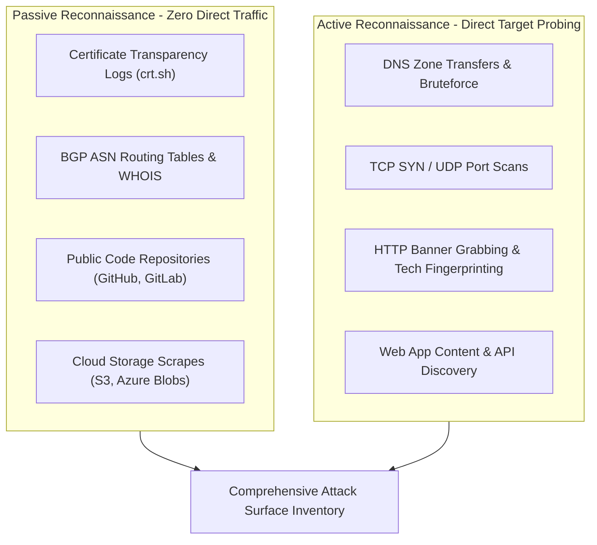

### 4.1 Passive Reconnaissance Techniques

1. **Certificate Transparency (CT) Log Analysis:**
   Modern SSL/TLS certificates issued by public Certificate Authorities must be logged in public, append-only CT logs. Querying these logs reveals subdomains, internal hostnames, and newly deployed staging environments:

   ```bash
   # Query crt.sh API for subdomains
   curl -s "https://crt.sh/?q=%25.example.com&output=json" | jq -r '.[].name_value' | sort -u
   ```

2. **ASN and IP Space Discovery:**
   Identifying an organization's Autonomous System Number (ASN) allows mapping of all announced IP prefixes owned by the company:

   ```bash
   # Query BGP routing tables for an organization's ASN
   whois -h whois.radb.net -- '-i origin AS13335' | grep -Eo "([0-9.]+){4}/[0-9]+"
   ```

3. **Public Code Repository & Secret Scraping:**
   Developers frequently commit configuration files containing hardcoded database credentials, private API keys, and staging endpoints to public repositories:
   - Git commit histories (`git log -p`)
   - Environment files (`.env`, `docker-compose.yml`, `kubeconfig`)
   - Hardcoded AWS access keys (`AKIA...`)

### 4.2 Active Reconnaissance & Network Discovery

Active reconnaissance interacts directly with network services to identify open ports, service versions, and protocol configurations.

#### Port Scanning Protocol State Machines

At the transport layer, port scanners determine service states by analyzing TCP state machines:

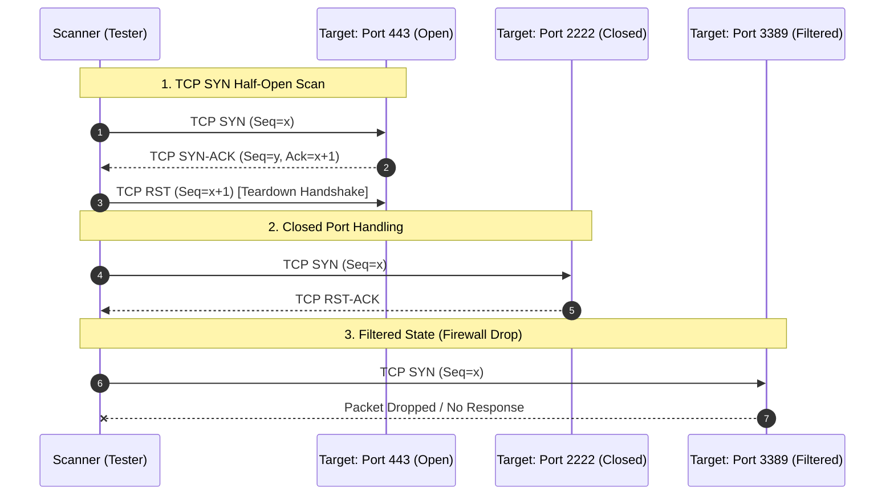

- **TCP SYN Scan (`-sS`):** Sends a SYN packet. If SYN-ACK is returned, the port is open; the scanner immediately sends a RST packet to tear down the half-open handshake, avoiding full socket allocation in application logs.
- **Service Version Fingerprinting (`-sV`):** Connects to open ports and sends protocol-specific probes (HTTP GET, SSH identification strings, SMTP HELO) to parse version banners against known service signatures.
- **NSE (Nmap Scripting Engine):** Automates complex network checks, including SSL certificate expiration, SMB dialect negotiation, and default credential audits.

---

## 5.0 Vulnerability Analysis & Attack Surface Mapping

Once open services are catalogued, the assessment transitions from discovery to vulnerability analysis. This step determines whether discovered software versions or configurations contain known security defects (CVEs), architectural weaknesses, or logic bugs.

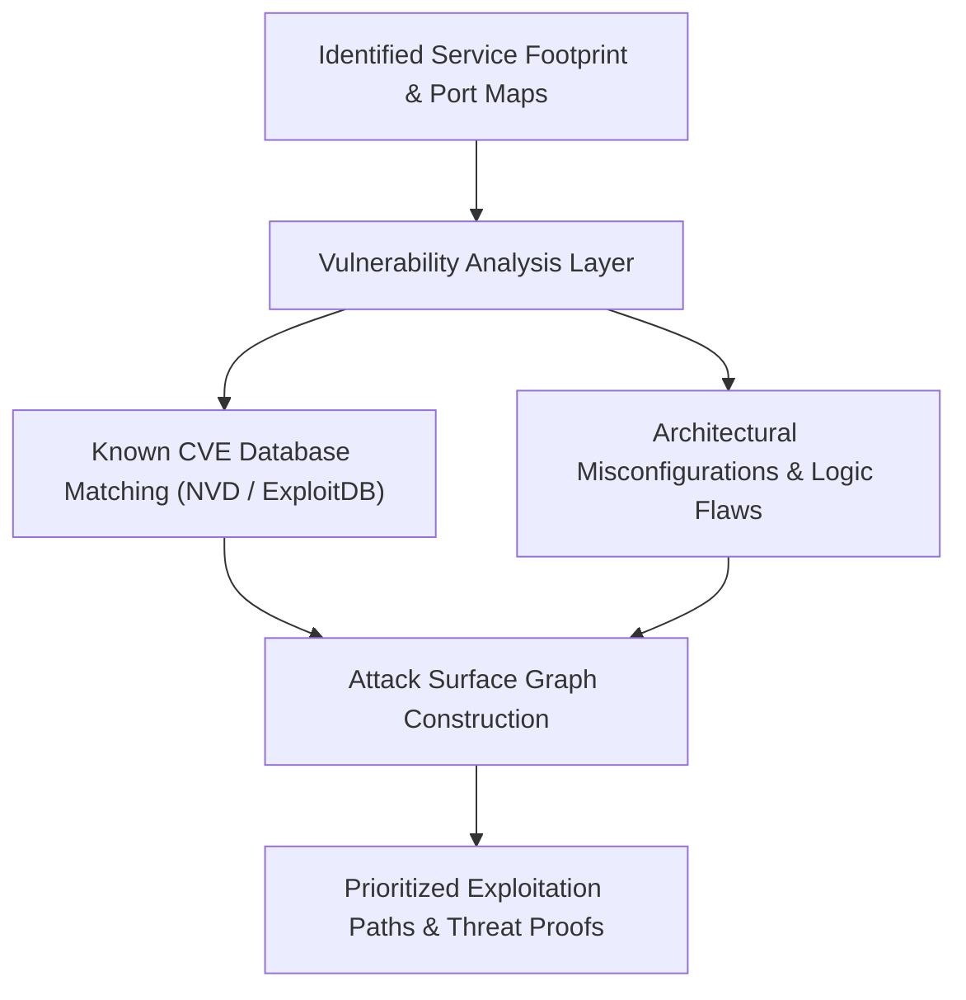

### 5.1 Automated Vulnerability Scanning vs. Manual Verification

Automated scanners (such as Nessus, OpenVAS, or Burp Suite Scanner) rely on signature databases and heuristic probes. However, automated tools exhibit inherent limitations:

- **High False-Positive Rates:** Scanners often rely solely on banner strings without verifying whether vendor backports have patched the underlying issue.
- **Blindness to Business Logic:** An automated scanner cannot deduce that user $A$ modifying `/api/order/529` to `/api/order/528` allows unauthorized viewing of a competitor's invoice.
- **Lack of Attack Chaining:** Scanners evaluate findings in isolation and cannot recognize that an unauthenticated DNS zone transfer combined with an exposed internal Redis cache permits full domain compromise.

:::note[Methodological Principle]
A professional penetration test uses automated scanning solely for baseline discovery. Every finding must be manually validated, assessed for exploitability within the specific environment, and correlated against other architectural components.
:::

---

## 6.0 Network & Enterprise Infrastructure Testing

In corporate networks, the primary target is frequently the enterprise identity provider, most commonly **Microsoft Active Directory (AD)** or hybrid **Entra ID (Azure AD)**. Penetration testing in enterprise network environments revolves around exploiting Kerberos protocol mechanics, misconfigured delegations, and structural privilege relationships.

::interactive{id="ad-architecture" src="/images/posts/ad-network-architecture.png" data="src/data/interactive/ad_attack_paths.json" overview="Interactive map of an enterprise network infrastructure: explore key security boundaries, Active Directory identity hubs, application clusters, and telemetry collectors across the attack surface."}

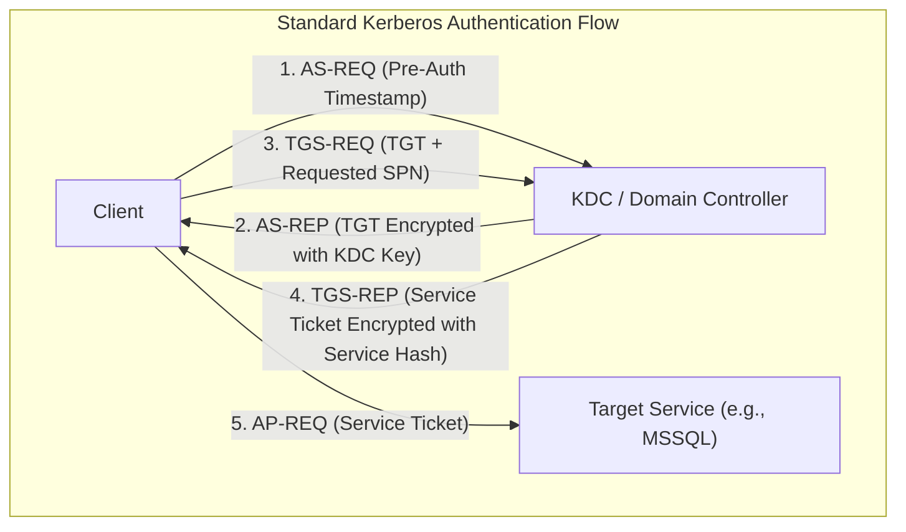

### 6.1 Active Directory Attack Mechanics

#### 1. Kerberoasting

**The Mechanism:** Any domain-authenticated user can request a Kerberos Ticket Granting Service (TGS) ticket for any service that has a registered Service Principal Name (SPN). The KDC encrypts the TGS ticket using the NTLM hash (or AES key) of the service account associated with that SPN.

Because the ticket is delivered to the requesting client, the tester can extract the ticket from memory and attempt offline password cracking against the service account's password hash:

$$\text{TGS-REP Ciphertext} = \text{Encrypt}_{K_{\text{service}}}(\text{SessionKey}, \text{ClientIdentity}, \dots)$$

If the service account utilizes a weak, non-randomized password, the plaintext password can be cracked offline without generating failed logon events (`Event ID 4625`) on the Domain Controller.

**Defensive Countermeasure:** Utilize Group Managed Service Accounts (gMSA) with automatically rotating 128-character complex passwords and enforce Kerberos AES encryption.

#### 2. AS-REP Roasting

**The Mechanism:** If a user account has the configuration attribute `DONT_REQ_PREAUTH` (Do not require Kerberos pre-authentication) enabled, an unauthenticated attacker can send an `AS-REQ` for that username. The Domain Controller immediately returns an `AS-REP` containing a message component encrypted with the user's password hash. The attacker extracts this ciphertext and cracks the password offline.

```bash
# Example Impacket command for AS-REP Roasting
GetNPUsers.py domain.local/ -usersfile users.txt -format hashcat -outputfile asreproast.hashes
```

**Defensive Countermeasure:** Audit Active Directory for accounts with `userAccountControl:1.2.840.113556.1.4.803:=4194304` and enforce Kerberos pre-authentication globally.

#### 3. Delegation Vulnerabilities

Active Directory supports delegation, allowing services to impersonate users when accessing downstream services:

- **Unconstrained Delegation:** The server stores the user's full Ticket Granting Ticket (TGT) in memory. If a Domain Admin connects to the server, an attacker with local administrative access on that server can extract the Domain Admin's TGT from LSASS and attain full domain compromise.
- **Constrained Delegation (S4U2Self / S4U2Proxy):** Allows a service to request service tickets on behalf of arbitrary users to specific pre-authorized services. Misconfigurations in `msDS-AllowedToDelegateTo` can be abused to impersonate administrative accounts.
- **Resource-Based Constrained Delegation (RBCD):** Configured on the target resource via the `msDS-AllowedToActOnBehalfOfOtherIdentity` attribute, allowing compromised machine accounts to achieve local administrator rights over target systems.

### 6.2 Network Pivoting and Lateral Movement

When testing isolated internal networks, testers establish secure tunnels through dual-homed compromised hosts to reach deeper network enclaves:

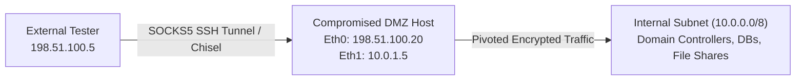

- **SOCKS5 Dynamic Port Forwarding (SSH):** Establishes an encrypted proxy tunnel routing arbitrary TCP traffic into the internal subnet:

  ```bash
  ssh -D 1080 -q -C -N user@dmz-host.example.com
  ```

- **Reverse TCP Tunneling (Chisel / WireGuard):** Used when outbound firewalls block incoming connections but permit outbound HTTP/HTTPS/WebSocket traffic.

---

## 7.0 Web Application & API Penetration Testing

Web applications and REST/GraphQL APIs represent the most exposed attack surface in modern organizations. Penetration testing of applications focuses heavily on broken access controls, authentication flaws, and injection vectors.

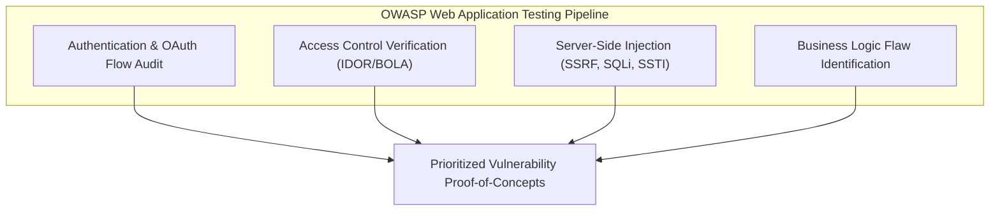

### 7.1 Broken Object-Level Authorization (BOLA / IDOR)

Insecure Direct Object References (IDOR) occur when an application accepts user-supplied input to retrieve database records or execute actions without validating that the authenticated user possesses authorization for that specific object.

```http
GET /api/v2/invoices/948102 HTTP/1.1
Host: api.company.com
Authorization: Bearer <User_A_Token>
```

If User A can simply increment the numeric identifier to `/api/v2/invoices/948101` and retrieve User B's proprietary financial invoice, the application suffers from BOLA (the #1 vulnerability on the OWASP API Security Top 10).

**Remediation:** Enforce centralized, attribute-based access control (ABAC) or policy enforcement points (e.g., Open Policy Agent) directly at the data layer:

```typescript
// Secure Authorization Check
async function getInvoice(userId: string, invoiceId: string) {
  const invoice = await db.invoices.findUnique({ where: { id: invoiceId } });
  if (!invoice || invoice.tenantId !== userId) {
    throw new ForbiddenError("Access Denied: Unauthorized Object Reference");
  }
  return invoice;
}
```

### 7.2 Server-Side Request Forgery (SSRF)

Server-Side Request Forgery occurs when a web application fetches a remote resource based on a user-supplied URL without properly validating the destination address.

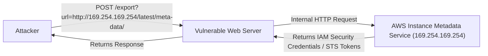

In cloud environments (AWS, GCP, Azure), attackers leverage SSRF to query internal Cloud Instance Metadata Services (IMDS) at the non-routable link-local address `169.254.169.254`, extracting temporary IAM credentials, service account tokens, and environment secrets.

**Remediation:**

1. Enforce **AWS IMDSv2**, which requires session-oriented token handshakes via HTTP `PUT` headers that SSRF payloads cannot easily forge:

   ```bash
   # IMDSv2 requires token generation
   TOKEN=$(curl -X PUT "http://169.254.169.254/latest/api/token" -H "X-aws-ec2-metadata-token-ttl-seconds: 21600")
   curl -H "X-aws-ec2-metadata-token: $TOKEN" http://169.254.169.254/latest/meta-data/
   ```

2. Implement strict URL destination whitelists at the application layer, resolving DNS records and blocking loopback (`127.0.0.0/8`), link-local (`169.254.0.0/16`), and private RFC 1918 addresses before dispatching HTTP requests.

### 7.3 JSON Web Token (JWT) Implementation Vulnerabilities

JWTs are ubiquitously used for stateless authentication. Penetration testing evaluates standard implementation flaws:

1. **The `none` Algorithm Attack:** Modifying the header `{"alg": "none", "typ": "JWT"}` and stripping the signature bytes. If the backend fails to enforce a cryptographic algorithm whitelist, it accepts unsigned arbitrary claims.
2. **Algorithm Key Confusion (RS256 to HS256):** When a server expects an asymmetric RSA signature (RS256 using a private key to sign and a public key to verify), an attacker converts the header to HS256 (HMAC with SHA-256) and signs the token using the server's publicly accessible RSA public key as the HMAC shared secret.
3. **Weak HMAC Secrets:** Symmetric HMAC keys with low entropy can be cracked offline at billions of guesses per second using Hashcat:

   ```bash
   hashcat -m 16500 jwt.txt /usr/share/wordlists/rockyou.txt
   ```

---

## 8.0 Cloud Security & Container Penetration Testing

Enterprise architectures have largely migrated to Amazon Web Services (AWS), Microsoft Azure, Google Cloud Platform (GCP), and orchestrated Kubernetes clusters. Penetration testing in cloud environments focuses on IAM policy misconfigurations, metadata abuse, and container escape vectors.

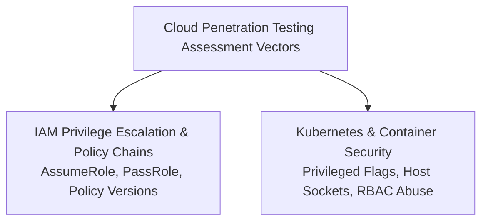

### 8.1 AWS IAM Privilege Escalation Chains

Unlike on-premises networks where privilege escalation relies on operating system vulnerabilities or memory manipulation, cloud privilege escalation is almost exclusively driven by **over-permissive IAM permissions**.

Common IAM privilege escalation vectors include:

| Vulnerable IAM Permission | Exploitation Mechanism |
| :--- | :--- |
| `iam:CreateAccessKey` | A low-privilege user generates new API access keys for an existing high-privilege user (e.g., an administrator). |
| `iam:CreateNewPolicyVersion` | A user creates a new default policy version with `Action: "*", Resource: "*"` granting themselves full administrative rights. |
| `iam:AttachUserPolicy` | A user directly attaches the managed `AdministratorAccess` policy to their own IAM identity. |
| `iam:PassRole` + `ec2:RunInstances` | A user launches an EC2 instance associated with an existing high-privilege instance profile, SSHs into the instance, and retrieves the role credentials from IMDS. |

### 8.2 Container Escapes & Kubernetes RBAC Auditing

In containerized environments (Docker, containerd, Kubernetes), testers evaluate whether a compromised application container can break out to the underlying host node:

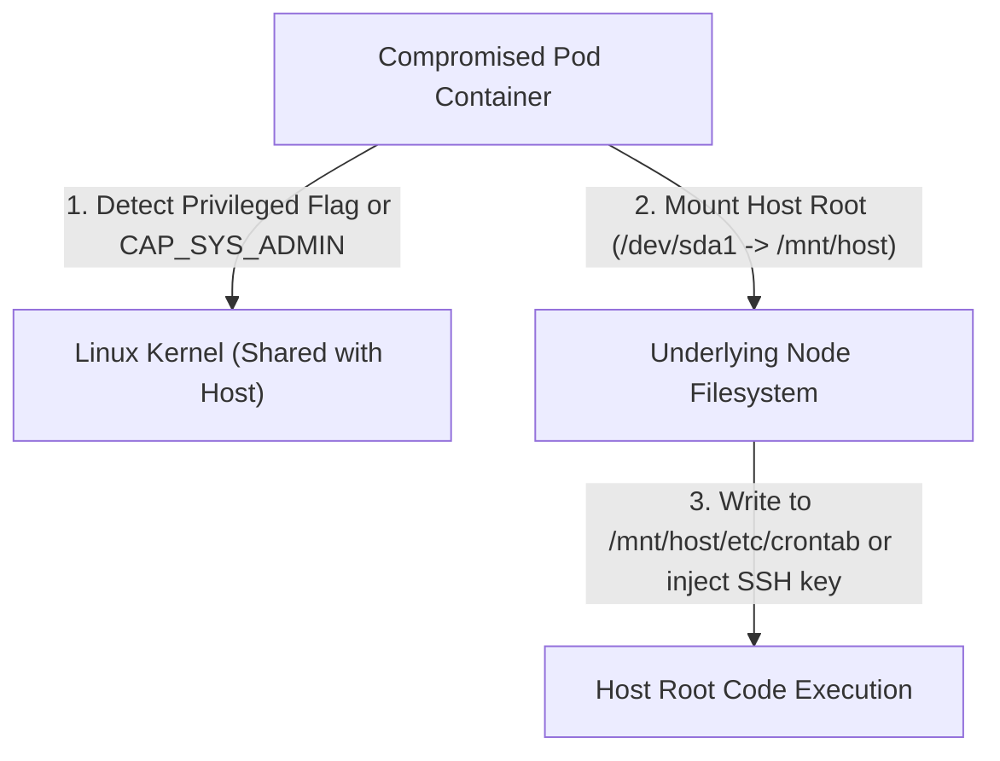

1. **Privileged Containers (`--privileged`):** A container run with full host capabilities can directly mount the host node's root filesystem (`mount /dev/sda1 /mnt/host`) and achieve host root execution.
2. **Dangerous Linux Capabilities:** Capabilities such as `CAP_SYS_ADMIN`, `CAP_SYS_PTRACE`, or `CAP_NET_ADMIN` enable kernel module loading, memory tracing, or traffic manipulation across the host namespace.
3. **Mounted Docker Sockets (`/var/run/docker.sock`):** If the host Docker daemon socket is mounted into a container, the container can instruct the daemon to launch a sibling container with full host root filesystem access.
4. **Kubernetes Service Account Tokens:** Pods automatically mount a service account token at `/var/run/secrets/kubernetes.io/serviceaccount/token`. Testers query the Kubernetes API server to audit Role-Based Access Control (RBAC) permissions:

   ```bash
   # Check Kubernetes API permissions
   kubectl auth can-i --list --token=$(cat /var/run/secrets/kubernetes.io/serviceaccount/token)
   ```

---

## 9.0 Post-Exploitation, Privilege Escalation & Lateral Movement

Once an initial foothold is secured on a host, post-exploitation determines the extent of access an attacker could achieve.

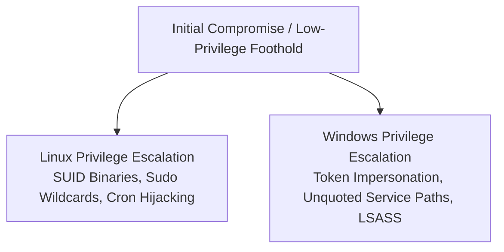

### 9.1 Linux Privilege Escalation Vectors

1. **SUID Binaries with GTFOBins Functions:** Executables with the SUID bit set (`chmod u+s`) execute with the permissions of the file owner (typically `root`). If standard system utilities (such as `find`, `vim`, or `nmap`) carry SUID bits, they can be abused to spawn a root shell:

   ```bash
   # Find SUID binaries on the filesystem
   find / -perm -u=s -type f 2>/dev/null
   ```

2. **Sudoers Misconfigurations:** Over-permissive `/etc/sudoers` entries granting passwordless execution (`NOPASSWD:`) of interpreters or scripts that allow arbitrary sub-process spawning.
3. **Systemd Service / Cron Hijacking:** Writable systemd unit files or cron scripts that execute periodically as `root`.

### 9.2 Windows Privilege Escalation Vectors

1. **Token Impersonation Privileges (`SeImpersonatePrivilege` / `SeAssignPrimaryTokenPrivilege`):**
   Accounts running web services or database engines (e.g., `NT AUTHORITY\NETWORK SERVICE` or `LOCAL SERVICE`) frequently possess `SeImpersonatePrivilege`. Attackers induce a local system service running as `SYSTEM` to authenticate against a local named pipe or COM server controlled by the attacker, capturing the `SYSTEM` token and duplicating it to spawn an administrative shell (the foundation of the *Potato* exploit family).
2. **Unquoted Service Paths:**
   If a Windows service executable path contains spaces and is not enclosed in quotation marks (e.g., `C:\Program Files\Vendor App\service.exe`), Windows attempts to execute binaries along each path segment in order:
   - `C:\Program.exe`
   - `C:\Program Files\Vendor.exe`
   - `C:\Program Files\Vendor App\service.exe`

   If an unprivileged user has write permissions to `C:\`, placing an executable named `Program.exe` results in arbitrary code execution as `SYSTEM` upon service reboot.

---

## 10.0 Reporting, Risk Scoring & Remediation Engineering

The report is the definitive deliverable of a penetration test. A brilliant technical exploit is useless to an organization unless communicated clearly with context, quantified risk, and actionable remediation steps.

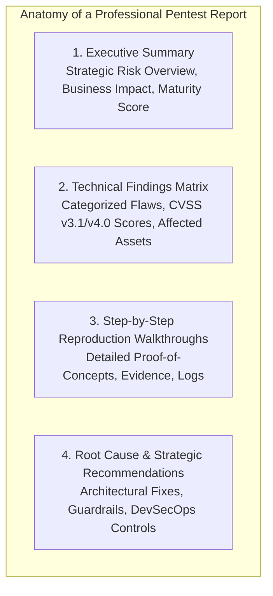

### 10.1 Calculating Risk: CVSS v3.1/v4.0 vs. OWASP Risk Rating

Penetration testing findings are scored using standard risk calculators:

$$\text{Risk} = \text{Likelihood} \times \text{Impact}$$

#### Common Vulnerability Scoring System (CVSS v3.1)

CVSS evaluates findings across three metric groups:

1. **Base Metric Group:** Represents intrinsic qualities of a vulnerability:
   - **Exploitability:** Attack Vector (AV), Attack Complexity (AC), Privileges Required (PR), User Interaction (UI).
   - **Scope:** Unchanged (U) or Changed (C).
   - **Impact:** Confidentiality (C), Integrity (I), Availability (A).
2. **Temporal Metric Group:** Exploit Code Maturity (E), Remediation Level (RL), Report Confidence (RC).
3. **Environmental Metric Group:** Modified Base Metrics adjusted for the specific target infrastructure.

```
CVSS:3.1/AV:N/AC:L/PR:N/UI:N/S:U/C:H/I:H/A:H  -->  Base Score: 9.8 (CRITICAL)
(Network accessible, Low complexity, No privileges, No user interaction, High C/I/A impact)
```

### 10.2 The Remediation Lifecycle

Remediation must be structured into two distinct tracks:

1. **Short-Term Tactical Fixes:** Immediate operational measures to eliminate active exploitation paths (e.g., rotating compromised credentials, deploying a Web Application Firewall (WAF) rule, restricting an over-permissive security group).
2. **Long-Term Architectural Remediations:** Structural improvements that eradicate entire vulnerability classes (e.g., migrating from string-concatenated SQL queries to an ORM with parameterized queries, implementing central OAuth/OIDC authorization gateways, deploying automated cloud posture management (CSPM)).

:::tip[Retesting and Attestation]
A penetration test is not concluded until the client implements remediations and the testing team executes a formal **Retest**. Retesting verifies that patches successfully resolve the vulnerability without introducing regressions, culminating in a formal **Letter of Attestation** for regulatory auditors and stakeholders.
:::

---

## 11.0 Purple Teaming: Collaborative Adversarial Engineering

Modern enterprise defense has outgrown isolated, antagonistic Red Team vs. Blue Team dynamics. In a traditional engagement, the red team attempts to evade detection and delivers a report weeks later; the blue team struggles to correlate fragmented alerts with historic events.

**Purple Teaming** integrates offensive practitioners and defensive engineers into a real-time collaborative exercise:

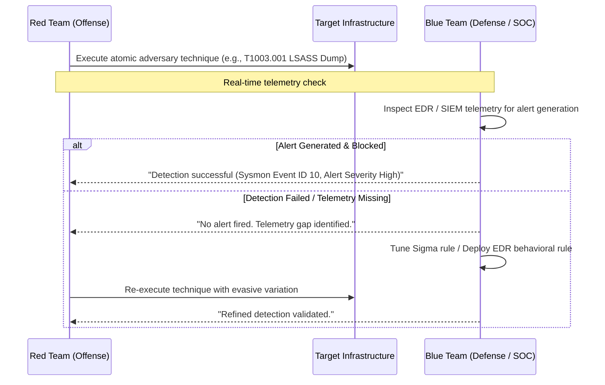

### 11.1 The MITRE ATT&CK Telemetry and Defense Matrix

By mapping offensive actions to the **MITRE ATT&CK** matrix, organizations establish measurable detection coverage:

| Tactic | ATT&CK Technique | Offensive Simulation | Blue Team Telemetry Source | Defensive Detection Rule |
| :--- | :--- | :--- | :--- | :--- |
| **Credential Access** | `T1003.001` (LSASS Memory) | `procdump -ma lsass.exe` / Mimikatz | Sysmon Event ID 10 (ProcessAccess), Windows Event ID 4663 | Alert on non-system processes requesting `PROCESS_VM_READ` or `PROCESS_DUP_HANDLE` rights against `lsass.exe`. |
| **Persistence** | `T1053.005` (Scheduled Task) | `schtasks /create /sc daily /tr ...` | Windows Event ID 4698 (Scheduled task created), EDR process telemetry | Alert on scheduled task creation executing from writable user directories (`C:\Users\AppData\`, `C:\Windows\Temp\`). |
| **Lateral Movement** | `T1021.002` (SMB/Windows Admin Shares) | `psexec.py` / WMI execution | Windows Event ID 5145 (Network share access), Event ID 7045 (New service installed) | Alert on remote access to `ADMIN$` or `IPC$` followed immediately by service creation executing `cmd.exe` or `powershell.exe`. |
| **Discovery** | `T1087.002` (Domain Account Discovery) | `net user /domain` / BloodHound AD LDAP queries | Windows Event ID 4662 (Operation on AD Object), LDAP query volume logs | Detect anomalous spikes in LDAP queries filtering for `(objectClass=user)` or `(servicePrincipalName=*)` originating from non-administrative endpoints. |

---

## 12.0 Summary & Conclusion

Penetration testing is not a superficial checkmark for compliance audits; it is an indispensable engineering discipline that provides empirical, ground-truth verification of an organization's defensive architecture.

### Core Principles for Technical Practitioners

1. **Never Rely on Assumptions:** A firewall rule, an IAM boundary, or an authentication check must be experimentally validated under adversarial conditions.
2. **Think in Graphs, Not Lists:** Attackers do not target vulnerabilities in isolation; they traverse interconnected trust graphs across networks, identities, and applications.
3. **Bridge Offense and Defense:** The ultimate metric of a successful penetration test is not the number of shells popped, but the long-term resilience and detection capability instilled within the defensive team.

---

### Selected References & Technical Documentation

- **PTES Team.** (2014). *The Penetration Testing Execution Standard*. [http://www.pentest-standard.org/](http://www.pentest-standard.org/)
- **National Institute of Standards and Technology (NIST).** (2008). *Technical Guide to Information Security Testing and Assessment*. NIST Special Publication 800-115.
- **OWASP Foundation.** (2021). *OWASP Web Security Testing Guide (WSTG v4.2)*.
- **OWASP Foundation.** (2023). *OWASP API Security Top 10 2023*.
- **MITRE Corporation.** (2024). *MITRE ATT&CK Matrix for Enterprise*. [https://attack.mitre.org/](https://attack.mitre.org/)
- **Rietdijk, C. W., & Putnam, H.** *Adversarial Engineering and Enterprise Threat Modeling Standards*.
- **Kim, G., Behr, K., & Spafford, G.** *The Practice of Network Security Monitoring: Understanding Incident Detection and Response*.
