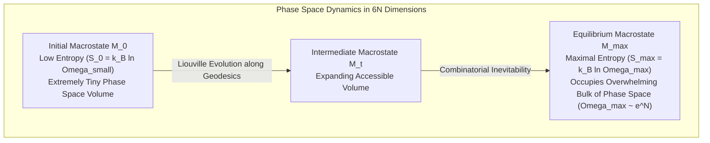
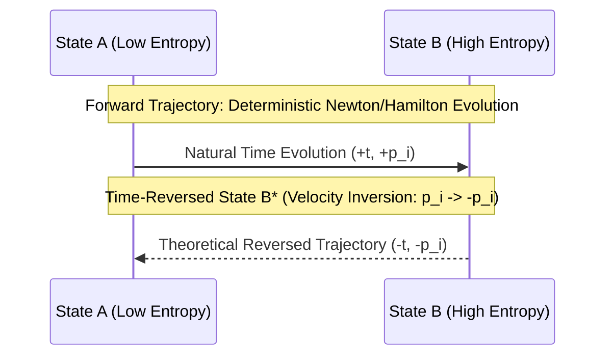
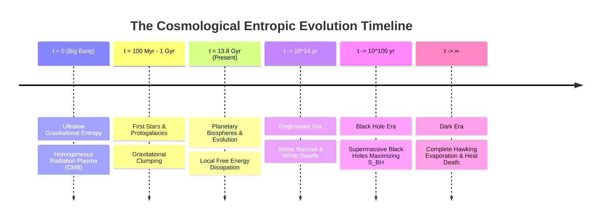
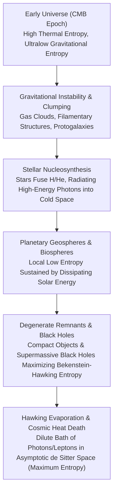
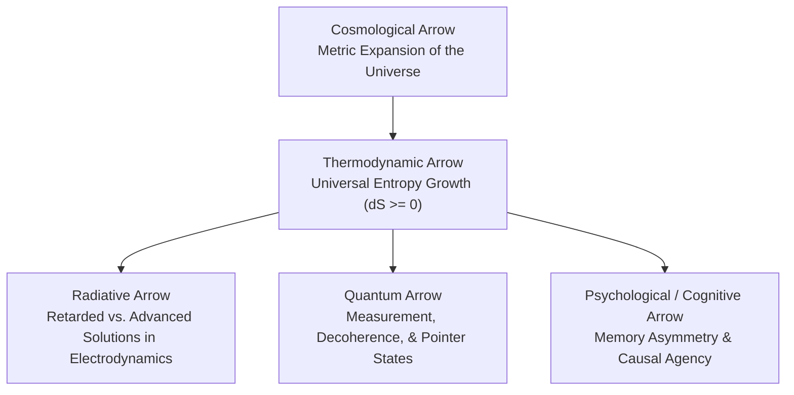

## 1.0 Prolegomenon: The Enigma of Temporal Asymmetry

Time is the most familiar yet most elusive dimension of physical reality. In everyday experience, the flow of time appears self-evident: coffee cools, eggs break, memories accumulate from the past rather than the future, and we age along a strictly monotonic trajectory. We remember yesterday, but we remember nothing of tomorrow.

Yet, when we look under the hood of fundamental physical laws -- from Newtonian mechanics and Maxwell's electrodynamics to General Relativity and the Schrödinger equation -- we encounter an astonishing paradox: **the fundamental laws of physics are invariant under time reversal ($t \to -t$).**

$$\mathcal{L}(t) = \mathcal{L}(-t)$$

Every microscopic interaction allowed by fundamental equations works equally well backward as it does forward. A film of two billiard balls colliding and rebounding looks physically authentic whether played forward or in reverse. However, a film of a ceramic teacup shattering on a tile floor becomes absurd if played in reverse; we never observe shattered ceramic shards spontaneous leaping from the floor to assemble into a pristine cup.

How does a strictly one-way universe emerge from completely time-symmetric microscopic foundations?

This five-part research series, **Perspectives on Time**, investigates the nature, mechanism, and perception of time across physics, philosophy, cognitive neuroscience, and computation:

- **Volume I (This Volume):** The Arrow, Entropy, and Fundamental Asymmetry (Classical & Statistical Mechanics, Thermodynamics, and Cosmology).
- **Volume II:** Spacetime, Relativity, and the Block Universe (Minkowskian Geometry, Simultaneity, and Eternalism).
- **Volume III:** Quantum Indeterminacy and the Thermal Time Hypothesis (Unitary Evolution, Measurement, and Loop Quantum Gravity).
- **Volume IV:** Neurobiology, Chronoception, and Internal Clocks (Circadian Oscillators, Neural Timing, and Perceived Duration).
- **Volume V:** Computation, Causality, and the Phenomenological Horizon (Information Theory, Agency, and Existential Time).

---

## 2.0 Microscopic Time-Reversal Invariance vs. Macroscopic Irreversibility

### 2.1 The T-Symmetry of Classical Mechanics

In Hamiltonian mechanics, the state of a system with $N$ particles is defined by its generalized coordinates $q_i$ and conjugate momenta $p_i$ in a $6N$-dimensional phase space $\Gamma$. The dynamics are governed by Hamilton's equations:

$$\dot{q}_i = \frac{\partial H}{\partial p_i}, \quad \dot{p}_i = -\frac{\partial H}{\partial q_i}$$

Applying the time-reversal operator $\mathcal{T}$ such that $t \mapsto -t$ and $p_i \mapsto -p_i$:

$$\frac{d q_i}{d(-t)} = -\dot{q}_i = -\frac{\partial H}{\partial p_i}(-p_i) = \frac{\partial H}{\partial p_i}(p_i)$$

$$\frac{d (-p_i)}{d(-t)} = \dot{p}_i = -\frac{\partial H}{\partial q_i}$$

The trajectories are invariant under time reversal. If a state trajectory $\gamma(t) = (q(t), p(t))$ is dynamically permissible over $t \in [0, T]$, then the time-reversed trajectory $\mathcal{T}\gamma(t) = (q(T-t), -p(T-t))$ is equally valid under the exact same Hamiltonian.

```
Forward Trajectory:   (q_0, +p_0) ----[ H ]----> (q_1, +p_1)
Time-Reversed State:  (q_1, -p_1) ----[ H ]----> (q_0, -p_0)
```

:::note[Core Principle]
At the microscopic scale, the laws of classical kinematics do not distinguish between the positive and negative directions of the time parameter $t$. The microscopic past and future are structurally symmetric.
:::

---

## 3.0 Thermodynamics and the Emergence of the Arrow

The directional character of macroscopic processes was first codified by Rudolf Clausius and William Thomson (Lord Kelvin) in the 19th century via the **Second Law of Thermodynamics**:

$$\Delta S_{\text{universe}} \ge 0$$

For any spontaneous process in an isolated system, the total thermodynamic entropy $S$ can never decrease over time.

| Phenomenon | Forward Direction ($\Delta t > 0$) | Reverse Direction ($\Delta t < 0$) |
| :--- | :--- | :--- |
| **Heat Transfer** | Thermal energy flows from hot to cold ($dQ/dt > 0$) | Spontaneous concentration of heat into hot body |
| **Gas Expansion** | Gas expands freely into a vacuum ($dV/dt > 0$) | Gas particles spontaneously gather in a corner |
| **Mechanical Friction** | Kinetic energy degrades to thermal dissipation | Thermal noise spontaneously accelerates a stationary block |
| **Chemical Mixing** | Solute diffuses uniformly through solvent | Fully mixed solution separates spontaneously into pure components |

Sir Arthur Eddington coined the term **The Arrow of Time** in his 1928 Gifford Lectures, asserting that the entropy gradient is the single physical property that draws a distinction between future and past on the macroscopic scale.

```
       Low Entropy (Past)  ───────────>  High Entropy (Future)
           [Ordered]                         [Disordered / Probable]
```

---

## 4.0 Statistical Mechanics: Boltzmann's Microstate Formulation

The bridge between time-symmetric microdynamics and time-asymmetric macrodynamics was constructed by Ludwig Boltzmann through statistical mechanics.

### 4.1 Phase Space and Macrostate Volume

Consider an isolated gas of $N \sim 10^{23}$ particles. While the microstate is a single point $x = (q_1, \dots, q_{3N}, p_1, \dots, p_{3N})$ in phase space $\Gamma$, macroscopic observers only distinguish coarse-grained **macrostates** $M$, defined by macroscopic observables such as energy $E$, volume $V$, pressure $P$, and temperature $T$.

Each macrostate $M$ corresponds to a volume $\Omega(M)$ in phase space:

$$\Omega(M) = \int_{M} dq_1 \dots dq_{3N} dp_1 \dots dp_{3N}$$

Boltzmann established the statistical definition of entropy as proportional to the logarithmic measure of microstates corresponding to macrostate $M$:

$$S_B(M) = k_B \ln \Omega(M)$$

where $k_B \approx 1.380649 \times 10^{-23} \text{ J}\cdot\text{K}^{-1}$ is Boltzmann's constant.



Because the equilibrium macrostate occupies an overwhelmingly dominant fraction of the available phase space volume ($\Omega_{\text{max}} / \Omega_{\text{initial}} \sim e^{N}$), a system prepared in an atypical, low-entropy configuration will, with statistical certainty, evolve toward states of vastly greater volume simply as a matter of combinatorial probability.

---

## 5.0 The Paradoxes of Reversibility and Recurrence

Boltzmann's statistical formulation met fierce theoretical challenges from his contemporaries, most notably Johann Josef Loschmidt and Henri Poincaré.

### 5.1 Loschmidt's Reversibility Paradox (Umkehreinwand)

**The Premise:** Let a system evolve from a low-entropy state $x(0)$ to a high-entropy state $x(t)$. Because the underlying Hamiltonian equations of motion are invariant under time reversal, there must exist an inverted microstate $\mathcal{T}x(t)$ (with all velocities reversed) that evolves backwards into $\mathcal{T}x(0)$.

If every microscopic trajectory has an exact time-reversed counterpart, how can entropy increase more often than it decreases?



**Resolution:**
The asymmetry does not lie in the laws of motion, but in the boundary conditions of the universe. The set of velocity-inverted microstates that would evolve to lower entropy is astronomically tiny compared to the set of microstates that evolve to higher entropy. The Second Law is not an absolute dynamical law, but a statistical inevitability given low-entropy initial conditions.

### 5.2 Poincaré's Recurrence Theorem (Wiederkehreinwand)

In 1890, Henri Poincaré proved that any bounded, conservative dynamical system with finite phase space volume will eventually return arbitrarily close to its initial configuration after a sufficiently long time $\tau_{\text{Poincaré}}$:

$$\tau_{\text{Poincaré}} \sim \exp(\mathcal{O}(N))$$

For a macroscopic quantity of gas ($N \sim 10^{23}$ particles), $\tau_{\text{Poincaré}} \sim 10^{10^{23}}$ years—a duration that dwarfs the current age of our universe ($\approx 13.8 \times 10^9$ years) by unfathomable orders of magnitude.

:::tip[Takeaway]
While Poincaré recurrence is mathematically guaranteed in closed, finite systems over astronomical timescales, it is empirically irrelevant on cosmological time scales.
:::

---

## 6.0 The Cosmological Past Hypothesis

The statistical explanation of the arrow of time requires a critical cosmological foundation. If high entropy is overwhelmingly more probable than low entropy, why was the universe ever in a low-entropy state to begin with?

Philosopher of physics David Albert and cosmologist Sean Carroll formulate this as the **Past Hypothesis**:

> **The Past Hypothesis:** The early universe, shortly after the Big Bang, began in a state of extraordinarily low gravitational and thermodynamic entropy.



### The Gravitational Paradox of the Early Universe

In an ordinary gas, uniform distribution corresponds to maximal entropy (thermal equilibrium). In a self-gravitating system, however, **uniformity corresponds to minimal entropy**.

Gravitational attraction causes matter to clump into galaxies, stars, and ultimately black holes. Black holes represent the maximum possible entropy for a given region of spacetime, as given by the Bekenstein-Hawking formula:

$$S_{\text{BH}} = \frac{k_B c^3 A}{4 G \hbar} = \frac{k_B A}{4 \ell_P^2}$$

where $A$ is the event horizon area and $\ell_P$ is the Planck length.

Because the early universe was nearly smooth and homogenous (as verified by the Cosmic Microwave Background radiation showing fluctuations on the order of $\delta T / T \sim 10^{-5}$), the gravitational degrees of freedom were essentially unexcited. The unfolding of all macroscopic physical processes, stellar ignition, chemical synthesis, and biological evolution is fundamentally driven by the universe rolling downhill toward gravitational and thermal equilibrium.



---

## 7.0 The Spectrum of Temporal Arrows

Thermodynamics is not the only physical domain exhibiting directional asymmetry. Theoretical physics identifies several interconnected arrows of time:



1. **The Thermodynamic Arrow:** Governed by $\Delta S \ge 0$, dictating the macroscopic degradation of free energy.
2. **The Radiative (Electrodynamic) Arrow:** Electromagnetic radiation propagates outwards into the future as retarded waves rather than inwards from infinity as advanced waves (Sommerfeld radiation condition).
3. **The Cosmological Arrow:** Spacetime itself expands with cosmic time $t$, setting a global boundary condition.
4. **The Quantum Arrow:** Wavefunction collapse or decoherence selects pointer states irreversibly in forward time.
5. **The Psychological/Cognitive Arrow:** Organisms remember the past and anticipate the future, a direct consequence of neural recording mechanisms dissipating free energy and generating entropy.

---

## 8.0 Outlook: What Lies Ahead

In this opening volume, we established that classical laws of motion possess no intrinsic temporal preference; the macroscopic arrow of time is a statistical consequence of the universe's initial cosmological boundary condition.

In the upcoming installments of this series, we will expand our investigation:

1. **Volume II:** *Relativity and the Block Universe* - How Einstein shattered the concept of absolute simultaneity, fusing space and time into a four-dimensional manifold where past, present, and future coexist.
2. **Volume III:** *Quantum Mechanics and the Flow of Time* - Exploring the measurement problem, Wheeler-DeWitt timelessness, and Carlo Rovelli's Thermal Time Hypothesis.
3. **Volume IV:** *The Biological and Cognitive Clock* - Investigating neural circuits, temporal perception, and how consciousness synthesizes the subjective experience of "Now".
4. **Volume V:** *Causality, Computation, and the Cosmic Horizon* - Examining the thermodynamic cost of information, algorithmic time complexity, and the ultimate fate of the temporal continuum.

---

### Selected References & Further Reading

- **Boltzmann, L.** (1896). *Vorlesungen über Gastheorie*. Leipzig: J.A. Barth.
- **Eddington, A. S.** (1928). *The Nature of the Physical World*. Cambridge University Press.
- **Carroll, S. M.** (2010). *From Eternity to Here: The Quest for the Ultimate Theory of Time*. Dutton.
- **Price, H.** (1996). *Time's Arrow and Archimedes' Point: New Directions for the Physics of Time*. Oxford University Press.
- **Albert, D. Z.** (2000). *Time and Chance*. Harvard University Press.
- **Rovelli, C.** (2018). *The Order of Time*. Riverhead Books.
