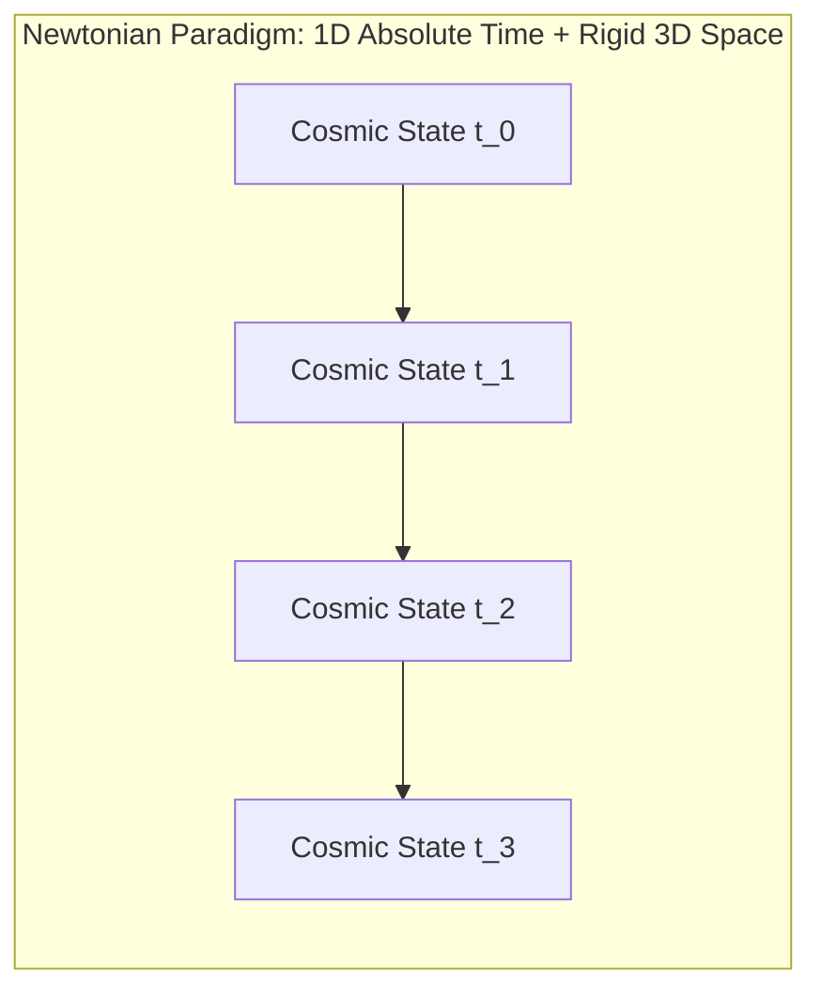
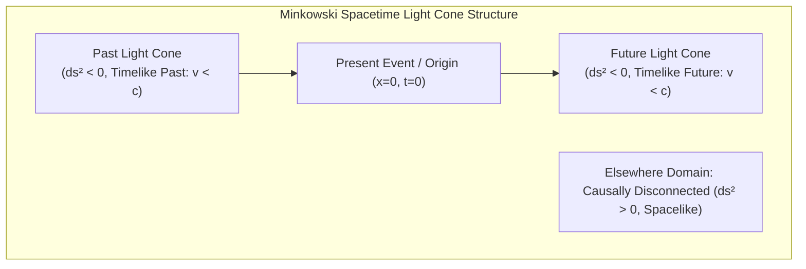
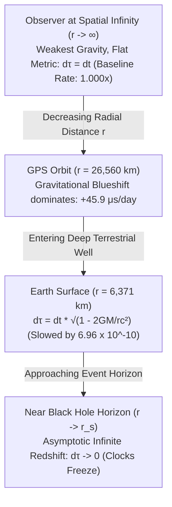
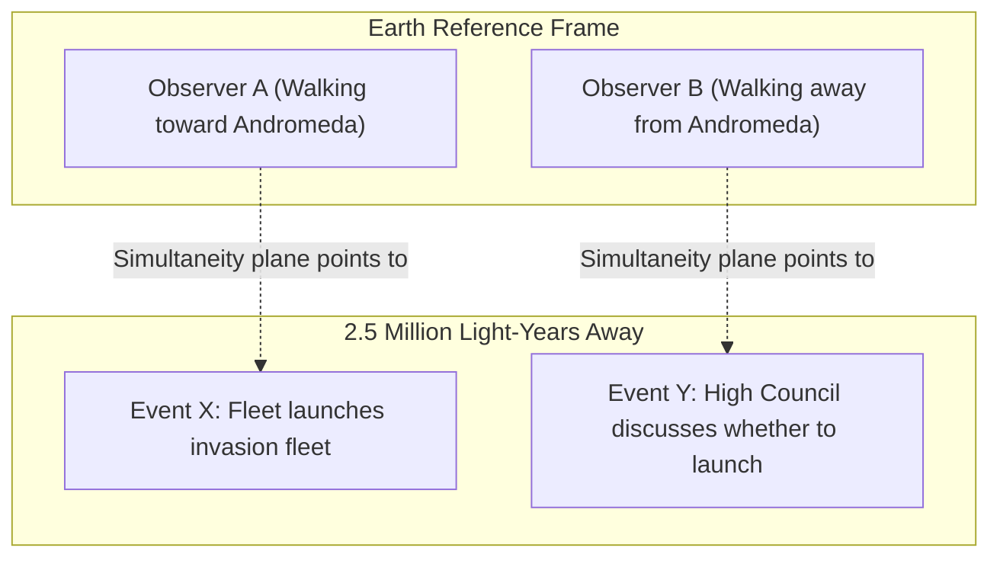
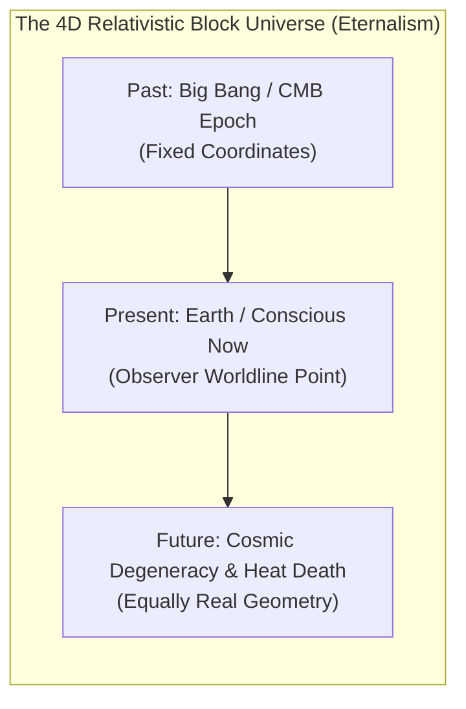
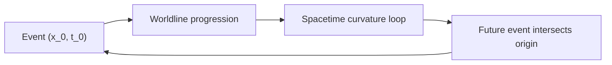

## 1.0 The Collapse of Absolute Simultaneity

In classical Newtonian mechanics, time was conceived as a cosmic clock ticking uniformly and inexorably across the universe, independent of any observer or physical matter:

> *"Absolute, true, and mathematical time, in and of itself and of its own nature, without reference to anything external, flows uniformly."*
> - Sir Isaac Newton, *Philosophiae Naturalis Principia Mathematica* (1687)

Under this paradigm, every event in the cosmos shared a single, universal coordinate $t$. Two events occurring simultaneously for an observer on Earth were undeniably simultaneous for an observer orbiting Jupiter or traveling at arbitrary velocities across deep space.



This comfortable architecture collapsed in 1905 when Albert Einstein resolved the conflict between Newtonian kinematics and Maxwell's electrodynamics. By accepting that **the speed of light in a vacuum ($c \approx 299,792,458 \text{ m/s}$) is invariant for all inertial observers**, Einstein demonstrated that time is neither absolute nor universal: **simultaneity is relative**.

---

## 2.0 Minkowski Spacetime and the Invariant Interval

In 1908, mathematician Hermann Minkowski synthesized Einstein's Special Relativity into a unified four-dimensional geometric continuum:

> *"Henceforth space by itself, and time by itself, are doomed to fade away into mere shadows, and only a kind of union of the two will preserve an independent reality."*

### 2.1 The Metric of Spacetime

In flat 4D spacetime ($\mathbb{R}^{1,3}$), the invariant spacetime interval $ds$ between two infinitesimally separated events with coordinate differences $(dt, dx, dy, dz)$ is defined by the Minkowski metric tensor $\eta_{\mu\nu}$:

$$ds^2 = \eta_{\mu\nu} dx^\mu dx^\nu = -c^2 dt^2 + dx^2 + dy^2 + dz^2$$

While different observers in relative motion disagree on elapsed spatial distance $\Delta x$ and elapsed temporal interval $\Delta t$, all inertial observers compute the exact same invariant interval $ds^2$.



### 2.2 Causal Classification of Intervals

Spacetime separates into three distinct causal domains relative to any event $P$:

| Interval Condition | Classification | Physical Interpretation |
| :--- | :--- | :--- |
| $ds^2 < 0$ | **Timelike** | Events can be causally connected by a signal traveling slower than light ($v < c$). A reference frame exists where both events occur at the same spatial point. |
| $ds^2 = 0$ | **Lightlike / Null** | Events are connected exclusively by a light pulse ($v = c$). Trajectories of photons. |
| $ds^2 > 0$ | **Spacelike** | Events cannot communicate or influence each other ($v > c$). There is no objective temporal order; some observers see event $A$ before $B$, others see $B$ before $A$. |

:::important[Causal Invariance]
While the temporal order of spacelike-separated events is frame-dependent, the temporal order of timelike-separated events is **strictly invariant** across all physical frames of reference. Cause always precedes effect within the light cone.
:::

---

## 3.0 Relativistic Time Dilation & The Twin Paradox

### 3.1 Kinematic Dilation

When an ideal clock moves with velocity $v$ relative to an inertial observer, the time interval $dt$ measured by the stationary observer is related to the clock's proper time $d\tau$ (time measured in the clock's rest frame) by the Lorentz factor $\gamma$:

$$dt = \gamma \, d\tau = \frac{d\tau}{\sqrt{1 - \frac{v^2}{c^2}}}$$

As velocity approaches the speed of light ($v \to c$), $\gamma \to \infty$, and the passage of proper time for the moving body asymptotically halts relative to the stationary frame.

```mermaid
graph LR
    subgraph Inertial Frame S [Observer at Rest]
        A["Clock A ticks: t_1"] --> B["Clock A ticks: t_2"]
    end
    subgraph Moving Frame S' [Spacecraft moving at v = 0.99c]
        C["Clock B ticks: tau_1"] --> D["Clock B ticks: tau_2"]
    end
    A -. Observed rate: gamma = 7.09 .-> C
    B -. Delta t = 7.09 * Delta tau .-> D
```

### 3.2 Proper Time along Worldlines

In relativity, the duration experienced by an observer along an arbitrary parameterized worldline $x^\mu(\lambda)$ is the metric length of that path:

$$\tau = \int_{A}^{B} d\tau = \frac{1}{c} \int_{A}^{B} \sqrt{-\eta_{\mu\nu} \frac{dx^\mu}{d\lambda} \frac{dx^\nu}{d\lambda}} \, d\lambda$$

In Euclidean geometry, the straight line represents the *shortest* distance between two points. In Lorentzian geometry (due to the minus sign in the metric signature), **a geodesic (unaccelerated straight worldline) represents the *maximal* proper time between two timelike events**.

This resolves the celebrated **Twin Paradox**: The traveling twin accelerates and changes inertial frames, tracing a non-geodesic trajectory through spacetime. When the twins reunite, the traveling twin is physically and verifiably younger because their integrated worldline length $\tau$ is shorter.

---

## 4.0 General Relativity: Curvature as the Engine of Time

In 1915, Einstein generalized relativity to include gravitation by identifying gravity not as a physical force acting through space, but as the **intrinsic curvature of four-dimensional spacetime** induced by energy, momentum, and stress:

$$G_{\mu\nu} + \Lambda g_{\mu\nu} = \frac{8\pi G}{c^4} T_{\mu\nu}$$

where $G_{\mu\nu} \equiv R_{\mu\nu} - \frac{1}{2} R g_{\mu\nu}$ is the Einstein tensor and $T_{\mu\nu}$ is the energy-momentum tensor.

### 4.1 Gravitational Time Dilation

In the vicinity of a static, spherically symmetric mass $M$, the geometry is described by the **Schwarzschild metric**:

$$ds^2 = -\left(1 - \frac{2GM}{r c^2}\right) c^2 dt^2 + \left(1 - \frac{2GM}{r c^2}\right)^{-1} dr^2 + r^2 (d\theta^2 + \sin^2\theta \, d\phi^2)$$

For an observer stationary at radial coordinate $r$, the relationship between local proper time $d\tau$ and coordinate time $t$ (time measured at spatial infinity $r \to \infty$) is given by:

$$d\tau = \sqrt{1 - \frac{2GM}{r c^2}} \, dt = \sqrt{1 - \frac{r_s}{r}} \, dt$$

where $r_s = \frac{2GM}{c^2}$ is the Schwarzschild radius (event horizon).



:::tip[Empirical Verification]
Gravitational time dilation is not an abstract theory; modern technological systems depend on its precise calculation. GPS satellites orbit at $r \approx 26,560 \text{ km}$, where general relativistic blueshift (+45.9 $\mu\text{s/day}$) and special relativistic redshift (-7.2 $\mu\text{s/day}$) produce a net advance of $+38.7 \mu\text{s/day}$. Without relativistic calibration, GPS positioning would accumulate navigational errors exceeding 11 kilometers every single day.
:::

---

## 5.0 Philosophical Implications: The 4D Block Universe

The relativity of simultaneity undermines **Presentism**, the philosophical intuition that only the instantaneous three-dimensional "Now" is real, while the past has vanished and the future is unwritten.

### 5.1 The Rietdijk-Putnam Argument & The Andromeda Paradox

In 1966, physicists C. Wim Rietdijk and Hilary Putnam independently formalized the philosophical consequence of Special Relativity:

Consider two individuals on Earth walking past each other at a leisurely pace ($v \approx 5 \text{ km/h}$). Because they are in relative motion, their planes of simultaneity tilt with respect to one another:

$$\Delta t_{\text{simultaneity}} = \frac{v \cdot D}{c^2}$$

When projected across the astronomical distance to the Andromeda Galaxy ($D \approx 2.5 \times 10^6 \text{ light-years}$), this minuscule velocity difference results in their respective "presents" on Andromeda diverging by several days.



For Observer A, the alien invasion fleet has already launched. For Observer B, the meeting to decide whether to build the fleet has not yet taken place. Because both observers' reference frames are equally valid under the postulates of relativity, both events must possess equal physical reality.

### 5.2 Eternalism (Four-Dimensionalism)

This leads inexorably to **Eternalism**, commonly known as the **Block Universe**:



In the Block Universe model:

1. Past, present, and future are all equally real and exist immutably as coordinates within a four-dimensional geometric manifold.
2. There is no dynamic "moving spotlight" of the present; the passage of time is a cognitive artifact of conscious observers embedded along timelike worldlines.
3. As Einstein wrote in a letter of condolence to the family of his lifelong friend Michele Besso in March 1955:

> *"Now he has departed from this strange world a little ahead of me. That means nothing. For us believing physicists, the distinction between past, present, and future is only a stubbornly persistent illusion."*

---

## 6.0 Causal Anomalies: Closed Timelike Curves (CTCs)

Because General Relativity defines spacetime as a dynamic, malleable manifold, certain exact solutions to the Einstein Field Equations permit paths that loop back onto their own causal pasts: **Closed Timelike Curves (CTCs)**.



### 6.1 Notable CTC Solutions in General Relativity

1. **Gödel's Rotating Universe (1949):** Kurt Gödel discovered an exact cosmological solution for a homogeneous rotating universe without expansion, where an object moving along a trajectory far from the axis of rotation can return to its own starting event in spacetime.
2. **The Kerr Metric (Spinning Black Holes):** Within the inner Cauchy horizon of a rotating Kerr black hole, the ring singularity exhibits negative curvature regions where $\phi$-coordinate lines become timelike, permitting closed timelike trajectories.
3. **Morris-Thorne Traversable Wormholes (1988):** Two mouths of a spatial wormhole held open by exotic matter with negative energy density ($\rho < 0$), when accelerated relative to one another, create a time difference that transforms the spatial shortcut into a time machine.

### 6.2 Hawking's Chronology Protection Conjecture

To prevent causal paradoxes (such as the Grandfather Paradox or bootstrapping information loops), Stephen Hawking formulated the **Chronology Protection Conjecture** (1992):

> *"The laws of physics do not allow the appearance of closed timelike curves."*

In semiclassical gravity, as an observer or light ray approaches the threshold of forming a closed timelike curve (a Cauchy horizon), the quantum vacuum energy-momentum tensor $\langle T_{\mu\nu} \rangle_{\text{ren}}$ diverges to infinity due to resonant destructive feedback, collapsing the metric and preventing the time loop from closing.

---

## 7.0 Synthesis: The Tension Between Geometry and Quantum Reality

General Relativity paints an exquisitely deterministic, geometric portrait of time: a static four-dimensional tapestry where every moment in history is permanently laid out.

Yet, this geometric picture stands in acute contradiction with the other titan of modern physics: **Quantum Mechanics**.

| Characteristic | General Relativity | Quantum Mechanics |
| :--- | :--- | :--- |
| **Nature of Time** | Dynamical coordinate woven into the spacetime metric $g_{\mu\nu}$. | External, fixed background parameter $t$ in Schrödinger's equation: $i\hbar \frac{\partial \psi}{\partial t} = \hat{H}\psi$. |
| **Determinism** | Strictly deterministic; future worldlines are geodetically fixed. | Probabilistic; state evolution undergoes discontinuous collapse or branch splitting. |
| **Simultaneity** | Local and relative; no preferred global foliation. | Entanglement implies instantaneous non-local state correlations (EPR/Bell tests). |

In the next volume of this series, we will confront this fundamental impasse.

---

## 8.0 Preview: What Lies Ahead in Volume III

In **Volume III: Quantum Indeterminacy and the Thermal Time Hypothesis**, we will investigate:

1. The Problem of Time in Quantum Gravity: Why time completely vanishes from the Wheeler-DeWitt equation ($\hat{\mathcal{H}}|\Psi\rangle = 0$).
2. Quantum Entanglement and Relativistic Causality: The No-Communication Theorem and Bell non-locality.
3. Carlo Rovelli & Alain Connes' **Thermal Time Hypothesis**: How time emerges as a statistical thermodynamic property of quantum state observation rather than a fundamental property of the universe.
4. Quantum Clocks, Page-Wootters Mechanism, and Relational Time.

---

### Selected References & Further Reading

- **Einstein, A.** (1905). *Zur Elektrodynamik bewegter Körper*. Annalen der Physik, 17, 891-921.
- **Minkowski, H.** (1908). *Raum und Zeit*. Physikalische Zeitschrift, 10, 104-111.
- **Putnam, H.** (1967). *Time and Physical Geometry*. The Journal of Philosophy, 64(8), 240-247.
- **Gödel, K.** (1949). *An Example of a New Type of Cosmological Solutions of Einstein's Field Equations of Gravitation*. Reviews of Modern Physics, 21(3), 447.
- **Hawking, S. W.** (1992). *Chronology protection conjecture*. Physical Review D, 46(2), 603.
- **Carroll, S. M.** (2019). *Something Deeply Hidden: Quantum Worlds and the Emergence of Spacetime*. Dutton.
