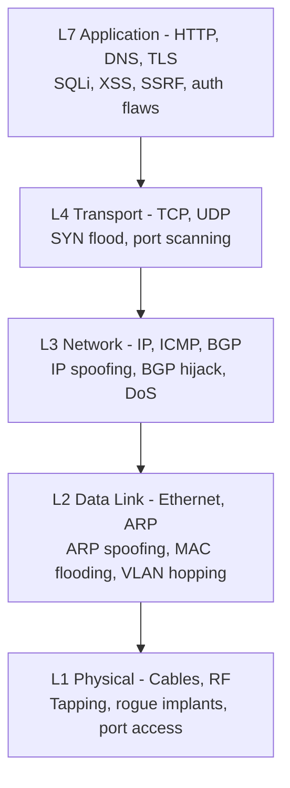
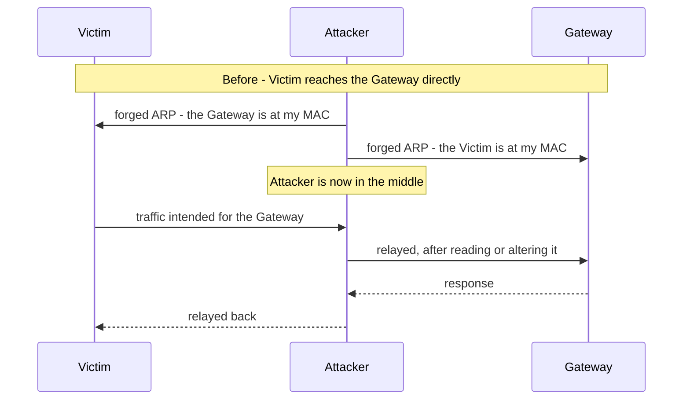
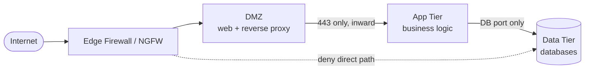
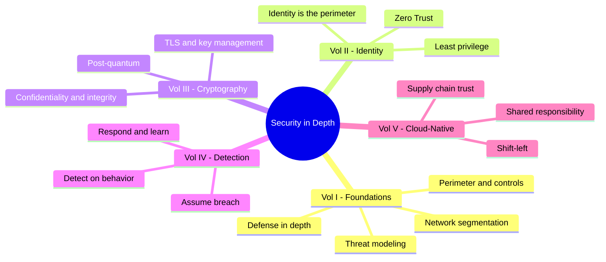
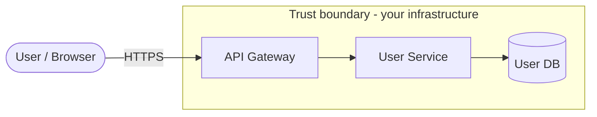
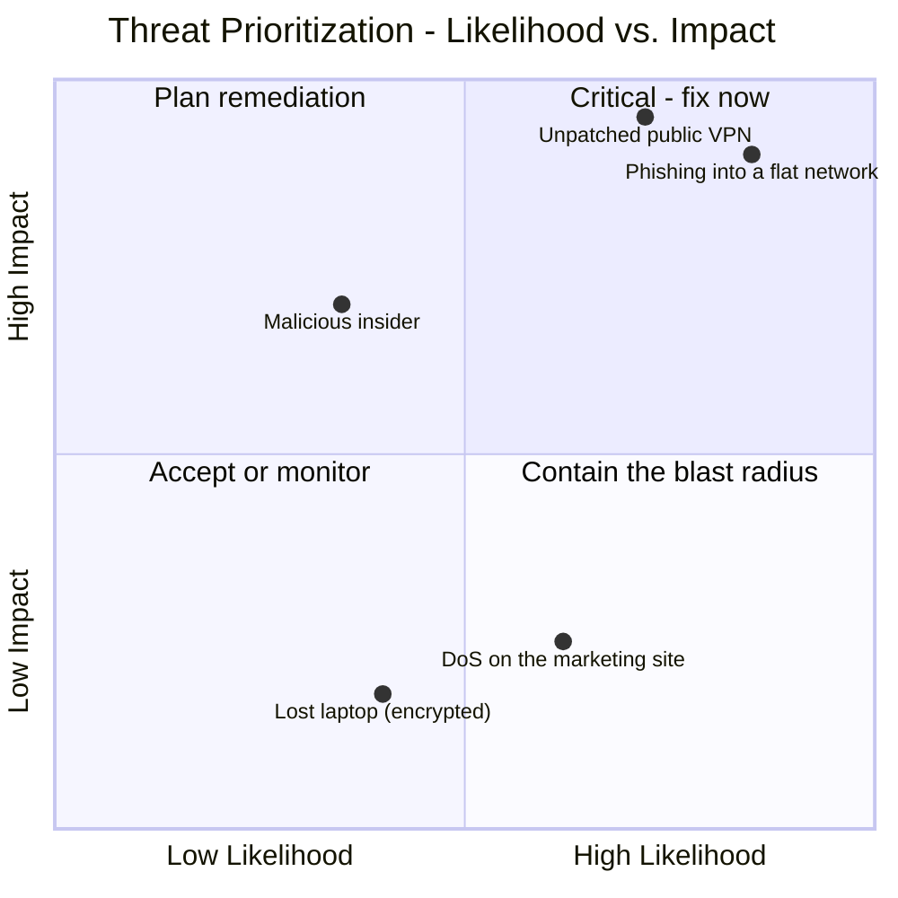
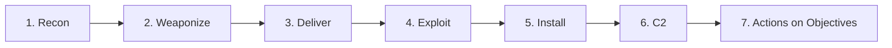
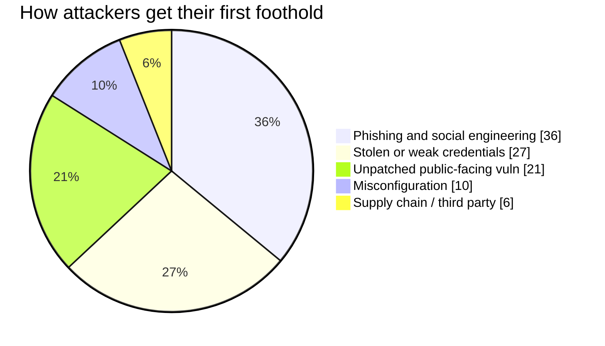
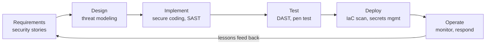
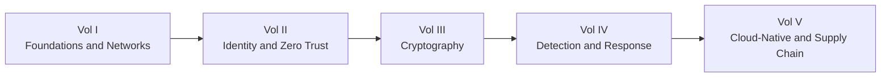

## Where the Series Begins

This is the opening volume of a five-part journey through **Security Architecture**. Over the series we will walk the entire stack, from copper to container, and the map looks like this:

* **Volume I (this one)** - the foundations: the network as an attack surface, defensible design, defense in depth, threat modeling, and the attacker's method.
* **Volume II** - [Identity, Access & the Zero Trust Frontier](/posts/identity_and_access_in_depth/): when the perimeter dissolves, identity becomes the new boundary.
* **Volume III** - [Cryptography Engineering](/posts/cryptography_engineering_in_depth/): the primitives that make any of it trustworthy.
* **Volume IV** - [Detection, Response & Threat Intelligence](/posts/detection_and_response_in_depth/): what you do when prevention fails.
* **Volume V** - [Cloud-Native & Supply Chain Security](/posts/cloud_native_and_supply_chain_security_in_depth/): securing the ephemeral, and proving what you ship.

What makes this guide different is its method. Every topic is examined through **four pairs of eyes**, because a real system is argued over by four kinds of engineer at once:

* The **Network Engineer** who builds the foundation.
* The **Defender** who has to protect it.
* The **Hacker** who tries to break it.
* The **Software Engineer** who writes the code that runs on it.

:::note[The thesis of the whole series]
No single control is trustworthy. Firewalls fail, credentials leak, code has bugs, and dependencies get poisoned. Security is therefore not a product you buy but a **property you engineer**: layers that each assume the one before it has already failed. This volume builds the outermost layers and the mindset. The rest of the series builds inward.
:::

---

## Part I: The Network Is the Territory

Data communication begins at the network, and so does attack. A superficial reading of the OSI or TCP/IP model is not enough [^1]; a security professional reads each layer twice, once for what it *does* and once for how it can be *turned*.

### Chapter 1: The Stack Through a Security Lens

Every layer carries its own native attacks and its own native defenses. The lower you go, the more physical and absolute the compromise.

**Layer 1 - Physical.** The world of cables, fiber, and switches. To the Hacker it is the ultimate vector *if reachable*: a network tap on an unencrypted run [^2], a cheap implant left behind a firewall as a persistent command-and-control foothold, or simply a laptop plugged into a live jack in a lobby. The Defender's answer is procedural and physical - locked rooms, disabled ports, tamper-evident seals - backed technically by **IEEE 802.1X** network access control, which forces any device that physically connects to authenticate before it gets a single usable frame [^3].

**Layer 2 - Data Link.** MAC addresses, switches, and **ARP**, the protocol that maps IP to MAC and was designed with implicit trust [^4]. That trust is the vulnerability:

That is **ARP spoofing**, and it hands the attacker a Man-in-the-Middle position on the local segment [^5]. Its cousins are **MAC flooding** (overflow the switch's CAM table until it fails open and broadcasts everything like a hub [^6]) and **VLAN hopping** (escape your VLAN through a misconfigured trunk port [^7]). The Defender's toolkit here is switch hygiene: **port security** to pin MACs per port [^8], **DHCP snooping** to kill rogue DHCP servers, and **Dynamic ARP Inspection** to drop forged ARP against a trusted binding table.

**Layer 3 - Network.** IP addresses and routing. **IP spoofing** forges a source address - the engine behind reflected DoS such as the classic Smurf attack [^9] - and **BGP hijacking** corrupts the internet's routing tables to swallow traffic wholesale, a nation-state-grade tool for espionage and mass interception [^10]. The Defender filters: **ingress/egress filtering** per BCP 38 / RFC 2827 drops packets whose source IP is a lie [^11], and ACLs enforce who may talk to whom.

**Layer 4 - Transport.** **TCP** (connection-oriented, three-way handshake) and **UDP** (fire-and-forget). The **SYN flood** exhausts a server's half-open connection table with spoofed SYNs that never complete [^12]; **port scanning** with tools like `nmap` maps the listening attack surface [^13]. The Defender answers with **stateful firewalls** that only pass an ACK they have a handshake for, and **SYN cookies** that allocate no state until the client proves it is real [^14].

### Chapter 2: Designing a Defensible Network

A **flat network** - where every device can reach every other - is a hacker's paradise. Compromise one forgotten printer and you can walk to the domain controller. A defensible network is a **segmented** one [^15].

Segmentation - subnets, **VLANs**, and a tiered **DMZ** [^16] - turns every hop into a monitored choke point. It is least privilege expressed as topology: the web server has no business dialing the domain controller, so the firewall forbids it, and a compromised web server finds itself in a dead end instead of on a highway.

**Microsegmentation** takes this to its logical end: a policy boundary around *each workload*, not each zone. Two VMs on the same subnet are not implicitly trusted; every flow must be explicitly allowed. That principle - *never trust, always verify* - is the seed of **Zero Trust**, and it grows into the entire subject of the next volume.

:::important[The first hand-off]
Microsegmentation asks *"should these two principals be allowed to talk?"* - and once you take that question seriously, the network address stops being a good enough answer. You need to verify **identity**. That is exactly where **[Volume II](/posts/identity_and_access_in_depth/)** picks up: identity as the new perimeter.
:::

### Chapter 3: The Gatekeepers - Firewalls and IDS/IPS

A **stateful firewall** understands connection context; a **Next-Generation Firewall (NGFW)** goes further with application awareness (block one app, allow another, both on port 443), integrated intrusion prevention, and threat-intel feeds [^17]. A **Web Application Firewall (WAF)** operates at Layer 7 to blunt OWASP Top 10 attacks [^18].

:::warning[A WAF is a safety net, not a cure]
A WAF may block a naive `OR 1=1`, but WAF evasion is a mature discipline - encoding, obfuscation, and case tricks bypass signatures every day. The real fix for injection lives in the code (parameterized queries), not in a filter bolted on in front of it. Treat the WAF as defense in depth, never as the defense.
:::

**IDS** watches and alerts; **IPS** sits in-line and blocks. Both detect by **signature** (precise against known threats, blind to novel ones) or **anomaly** (can catch the unknown, drowns you in false positives) [^19]. And both go deaf against encrypted traffic unless you pay for decryption - a foreshadowing of why *detection* eventually has to move off the wire and onto the endpoint, the story of Volume IV.

---

## Part II: Defense in Depth - and Why It Is This Series

Defense in depth is the recognition that any one control *will* fail, so you build layers that each buy time, visibility, and another chance to stop the attacker [^20]. The medieval castle is the tired-but-perfect analogy: moat, wall, archers, keep, crown jewels, and the guards who tie it together.

Here is the move that organizes this whole series: **each layer of the castle is a volume.**

* The **moat and outer wall** are network perimeter and segmentation - **this volume**.
* The **guard at every door** is identity and access - **[Volume II](/posts/identity_and_access_in_depth/)**.
* The **sealed messages** the guards trust are cryptography - **[Volume III](/posts/cryptography_engineering_in_depth/)**.
* The **archers watching for the breach** are detection and response - **[Volume IV](/posts/detection_and_response_in_depth/)**.
* The **provenance of the stones themselves** is supply chain and cloud-native security - **[Volume V](/posts/cloud_native_and_supply_chain_security_in_depth/)**.

**The Hacker's View:** an attacker sees the layers as obstacles and hunts for the weakest seam in each. A perfect firewall is worthless if an employee clicks a phishing link; flawless code is worthless on an unpatched host. Depth matters precisely because the attacker only needs *one* path, and depth is how you make sure no single failure is that path.

---

## Part III: Threat Modeling - Thinking Like an Attacker on Purpose

Threat modeling is a structured way to find the weak seams *before* you build them [^21]. It is proactive, cheap, and one of the highest-leverage security activities a team can do. The canonical mnemonic is Microsoft's **STRIDE** [^22].

Consider a mundane endpoint: `PUT /api/users/{id}`. Draw its data-flow diagram first, marking the **trust boundary** where data crosses from the hostile outside into your infrastructure.

Now walk STRIDE across every element and flow:

| STRIDE threat | The question to ask this endpoint | Primary defense |
|---|---|---|
| **S**poofing | Can user A change `{id}` and edit user B's profile? | Strong authN + per-object authZ |
| **T**ampering | Can a MitM alter the body in transit? | TLS (Volume III) |
| **R**epudiation | Can a user deny they made the change? | Signed, immutable audit logs |
| **I**nformation disclosure | Does the response leak PII or a password hash? | Minimize output, encrypt at rest |
| **D**enial of service | Can one client flood it and starve the DB? | Rate limiting, quotas |
| **E**levation of privilege | Is there an injection path to admin? | Parameterized queries, least privilege |

Most real-world breaches begin with the two ends of that table: **Spoofing** (broken authentication) and **Elevation of privilege**. The single most common web flaw, an **Insecure Direct Object Reference (IDOR)**, is just Spoofing wearing a URL - the app trusts a user-supplied `{id}` without checking that *this* user may touch *that* object [^23].

Enumerating threats is only half the job; you cannot fix everything, so you rank by **likelihood × impact** and spend your budget where the product of the two is highest.

Here is the same discipline as a repeatable loop you can run in a one-hour design meeting:

:::steps

:::step[Decompose the system]{subtitle="Draw the data-flow diagram"}
Map every process, data store, external entity, and flow. Draw the **trust boundaries** explicitly - they are where attacks cross from untrusted to trusted, and where most of your findings will cluster. If you cannot draw it, you do not understand it well enough to secure it.
:::

:::step[Enumerate threats with STRIDE]{subtitle="Be systematic, not clever"}
Walk Spoofing, Tampering, Repudiation, Information disclosure, Denial of service, and Elevation of privilege across each element. The point of a mnemonic is to stop you skipping the category you would rather not think about.
:::

:::step[Rank by likelihood and impact]{subtitle="Spend where it matters"}
Plot each threat on the risk matrix. A catastrophic-but-impossible threat and a trivial-but-constant one both waste your attention. Fund the top-right quadrant first.
:::

:::step[Mitigate, then verify]{subtitle="Turn findings into tests"}
Every accepted threat becomes an engineering task *and* a test case - an authZ integration test, a rate-limit check, a fuzzing target. A threat model that does not change the backlog was theater.
:::

:::

---

## Part IV: The Attacker's Method

To break the chain you must first see it. Lockheed Martin's **Cyber Kill Chain** models a typical intrusion as seven stages; the defender's goal is to break it as *early* as possible, because cost-to-remediate climbs at every step [^24].

Reconnaissance blends **passive OSINT** with **active** probing (port scans, DNS enumeration, Shodan sweeps). Weaponization and delivery build and ship the payload - overwhelmingly by **phishing**, still the number-one way in:

After **exploitation** and **installation**, the attacker "calls home" over a **C2** channel and begins **actions on objectives**. Post-foothold, the tradecraft shifts to staying quiet:

* **Lateral movement** - hop from the first host toward the crown jewels. In a Windows domain this means dumping credentials from memory and reusing them, often via **Pass-the-Hash**, no plaintext password required.
* **Persistence** - survive reboots and patches with a foothold that regrows.
* **Living off the Land (LotL)** - avoid custom malware entirely; use `PowerShell`, `PsExec`, and other tools already trusted on the box, so nothing looks out of place.

:::caution[Why the perimeter alone can never win]
LotL is the reason Volume I's walls are necessary but not sufficient. An attacker using only legitimate, signed system tools throws no signatures for a firewall or antivirus to match. Catching them requires watching *behavior* - a Word document that spawns PowerShell that opens a network socket - which is the province of **[Volume IV](/posts/detection_and_response_in_depth/)** and its map of attacker behavior, **MITRE ATT&CK**. Prevention assumes you can keep them out. Detection assumes you could not.
:::

---

## Part V: Secure by Design

The cheapest vulnerability is the one never written. **Shifting left** means moving security earlier in the lifecycle, where a fix costs a code review instead of an incident [^25].

Under the pipeline sit a handful of principles that predate the cloud and will outlive it - the timeless design rules articulated by Saltzer and Schroeder [^26]:

* **Least privilege** - every principal gets the minimum access it needs, and nothing more.
* **Fail-safe defaults** - deny by default; grant by exception.
* **Complete mediation** - check every access, every time, not just the first.
* **Economy of mechanism** - keep the security-critical parts small enough to audit.
* **Defense in depth** - the through-line of this entire series.

These are the constants. The *specifics* of how you satisfy them are where the rest of the series lives, and Volume I deliberately hands each one off rather than duplicating it:

* Authentication, authorization, session management, and secrets - **[Volume II](/posts/identity_and_access_in_depth/)**.
* "Never roll your own crypto," how TLS actually works, and how to manage keys - **[Volume III](/posts/cryptography_engineering_in_depth/)**.
* The SOC, SIEM/SOAR, threat hunting, and the incident-response lifecycle you run when a control fails - **[Volume IV](/posts/detection_and_response_in_depth/)**.
* Container and Kubernetes hardening, IaC scanning, SBOMs, and defending the dependency supply chain (remember **Log4Shell** [^27]) - **[Volume V](/posts/cloud_native_and_supply_chain_security_in_depth/)**.

:::tip[The mental model to carry forward]
Read every later volume as a deeper answer to a question raised here. Volume I asks *"how do we keep the attacker out and slow them down?"* - and each answer eventually admits its own limit, which is the question the next volume opens with. That chain of honest limits is the series.
:::

---

## Conclusion & The Road Ahead

We started at the physical layer - a cable, a switch, a forged ARP reply - and climbed to a design meeting where four engineers argue over a data-flow diagram. Along the way we built the outer defenses: a segmented, defensible network; layered controls that assume each other's failure; a repeatable way to find weak seams before an attacker does; and a clear-eyed model of how that attacker actually operates.

The modern systems engineer must be a polymath - reasoning about the packet and the application logic, the firewall rule and the container manifest, thinking like a builder, a defender, and a breaker at once. Security is not a feature you add. It is a property of a system engineered, at every layer, to survive the failure of the layer beside it.

We built walls in this volume. But the moment laptops go home, servers move to someone else's data center, and APIs call APIs across the open internet, the wall stops describing reality. The "inside" you were protecting dissolves into a swarm of principals - people, services, devices, workloads - each asking to do something, each needing to prove who it is and what it may touch.

That is where **[Volume II - Identity, Access & the Zero Trust Frontier](/posts/identity_and_access_in_depth/)** begins. **Identity is the new perimeter**, and every request is a border crossing. See you there.

---

## References

[^1]: [Cloudflare - What is the OSI Model?](https://www.cloudflare.com/learning/ddos/glossary/open-systems-interconnection-model-osi/)
[^2]: [Krebs, B. (2012) - The Growing Threat From Tiny, Silent Network Taps](https://krebsonsecurity.com/2012/03/the-growing-threat-from-tiny-silent-network-taps/)
[^3]: [Cisco - What Is 802.1X?](https://www.cisco.com/c/en/us/products/security/what-is-802-1x.html)
[^4]: [Microsoft (2021) - Address Resolution Protocol](https://learn.microsoft.com/en-us/windows-server/administration/performance-tuning/network-subsystem/address-resolution-protocol)
[^5]: [OWASP - Address Resolution Protocol Spoofing](https://owasp.org/www-community/attacks/ARP_Spoofing)
[^6]: [Imperva - MAC Flooding](https://www.imperva.com/learn/application-security/mac-flooding/)
[^7]: [Cisco - VLAN Hopping Attack](https://www.cisco.com/c/en/us/td/docs/switches/lan/catalyst4500/12-2/15-02SG/configuration/guide/config/dhcp.html)
[^8]: [GeeksforGeeks (2023) - Port Security in Computer Networks](https://www.geeksforgeeks.org/port-security-in-computer-networks/)
[^9]: [Cloudflare - Smurf DDoS Attack](https://www.cloudflare.com/learning/ddos/smurf-ddos-attack/)
[^10]: [Cloudflare - What is BGP hijacking?](https://www.cloudflare.com/learning/security/glossary/bgp-hijacking/)
[^11]: [IETF (2000) - RFC 2827: Network Ingress Filtering](https://datatracker.ietf.org/doc/html/rfc2827)
[^12]: [Cloudflare - SYN Flood Attack](https://www.cloudflare.com/learning/ddos/syn-flood-ddos-attack/)
[^13]: [Nmap - Official Nmap Project Site](https://nmap.org/)
[^14]: [Wikipedia - SYN cookies](https://en.wikipedia.org/wiki/SYN_cookies)
[^15]: [SANS Institute (2016) - Implementing Network Segmentation](https://www.sans.org/white-papers/37232/)
[^16]: [Palo Alto Networks - What is a DMZ?](https://www.paloaltonetworks.com/cyberpedia/what-is-a-dmz)
[^17]: [Palo Alto Networks - What is a Next-Generation Firewall (NGFW)?](https://www.paloaltonetworks.com/cyberpedia/what-is-a-next-generation-firewall-ngfw)
[^18]: [OWASP - OWASP Top 10](https://owasp.org/www-project-top-ten/)
[^19]: [SANS Institute (2001) - Understanding Intrusion Detection Systems](https://www.sans.org/white-papers/27/)
[^20]: [NSA (2021) - Defense in Depth](https://www.nsa.gov/portals/75/documents/what-we-do/cybersecurity/professional-resources/csg-defense-in-depth-20210225.pdf)
[^21]: [OWASP - Threat Modeling](https://owasp.org/www-community/Threat_Modeling)
[^22]: [Microsoft (2022) - The STRIDE Threat Model](https://learn.microsoft.com/en-us/azure/security/develop/threat-modeling-tool-threats)
[^23]: [OWASP - A01:2021 Broken Access Control (IDOR)](https://owasp.org/Top10/A01_2021-Broken_Access_Control/)
[^24]: [Lockheed Martin - The Cyber Kill Chain](https://www.lockheedmartin.com/en-us/capabilities/cyber/cyber-kill-chain.html)
[^25]: [OWASP - Shift Left](https://owasp.org/www-community/Shift_Left)
[^26]: [Saltzer & Schroeder (1975) - The Protection of Information in Computer Systems](https://www.cs.virginia.edu/~evans/cs551/saltzer/)
[^27]: [CISA - Apache Log4j Vulnerability Guidance](https://www.cisa.gov/uscert/apache-log4j-vulnerability-guidance)
