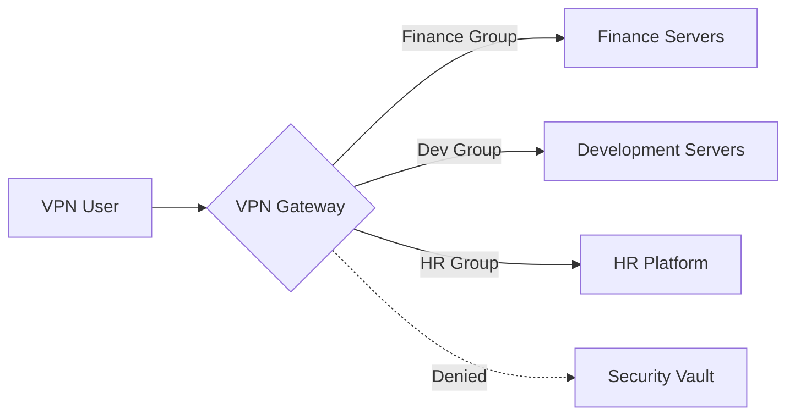

## 0.0 ملخص تنفيذي: لماذا لا تزال شبكات VPN مهمة في عالم الثقة الصفرية (Zero Trust)

في المؤسسات الحديثة، "المحيط" قد تبخر إلى حد كبير. ومع ذلك، تظل الشبكة الخاصة الافتراضية (VPN) أداة بالغة الأهمية لإدارة البنية التحتية، والوصول الإداري الآمن، وجسر التطبيقات القديمة. تم تصميم هذا الدليل لبيئة تضم 300 مستخدم - وهو حجم يصبح فيه الإدارة اليدوية مستحيلة، لكن حلول "المؤسسات الضخمة" قد تكون مبالغًا فيها.

نركز على **WireGuard** كبروتوكولنا الأساسي نظرًا لأدائه العالي، وبدائياته التشفيرية الحديثة، وقاعدة الشفرة المبسطة، مع الاعتراف بدور OpenVPN و IPsec لحالات استخدام محددة.

## 0.1 كيفية قراءة هذا الدليل

هذه الوثيقة تبني مجموعة تقنية متقدمة تدريجيًا. ننتقل من نماذج المفاهيم عالية المستوى إلى تفاصيل التنفيذ منخفضة المستوى ودفاتر التشغيل.

- **الأقسام 1.0-3.0:** المفاهيم التأسيسية (ماذا).
- **الأقسام 4.0-8.0:** العمارة والتصميم (لماذا).

- **الأقسام 9.0-13.0:** الهوية والأمان (كيف).
- **الأقسام 14.0-18.0:** الهندسة المتقدمة والتوسع (الصعب).

- **الملاحق:** قوالب التكوين الواقعية واستكشاف الأخطاء وإصلاحها.

:::tip[منظور المشغل]
شبكة VPN ليست حلاً أمنيًا بحد ذاتها؛ إنها **طبقة نقل** يجب أن تحكمها مزود هوية (IdP) قوي وسياسات خروج صارمة. لا تسمح أبدًا بتوجيه "أي/أي" (Any/Any) داخل نفقك.
:::

---

## 1.0 أساسيات شبكة VPN: التراكب المشفر

في جوهرها، تنشئ شبكة VPN اتصالاً افتراضيًا من نقطة إلى نقطة عبر شبكة مادية غير موثوق بها. في سياق المؤسسات، يتضمن هذا عادةً نفقًا مشفرًا بين جهاز عميل (كمبيوتر محمول، هاتف) وبوابة مركزية.

### 1.1 دورة حياة الاتصال

عندما يبدأ المستخدم اتصال VPN، يحدث التسلسل التالي:

1. **المصادقة:** يثبت العميل هويته (غالبًا عبر الشهادات أو بيانات الاعتماد المدعومة بـ MFA).
2. **تبادل المفاتيح:** يتفاوض العميل والخادم على مفاتيح الجلسة باستخدام بروتوكول مثل Diffie-Hellman أو Noise.
3. **إنشاء النفق:** يتم إنشاء واجهة شبكة افتراضية (مثل `wg0` أو `tun0`) على كلا الطرفين.
4. **حقن التوجيه:** يتم تحديث جدول توجيه النظام لإرسال نطاقات IP محددة عبر الواجهة الافتراضية.
5. **التغليف:** يتم تغليف الحزم الصادرة في رأس خارجي (UDP/TCP)، ويتم تشفيرها، وإرسالها إلى البوابة.
6. **فك التغليف:** تفك البوابة الحزمة وتعيد توجيهها إلى الوجهة الداخلية.

### 1.2 التغليف والنفقات العامة (Overhead)

في كل مرة تقوم فيها بتغليف حزمة في نفق VPN، فإنك تضيف بايتات.

- **النفقات العامة لـ WireGuard:** 32 بايت (رأس IP + رأس UDP + رأس WireGuard).
- **النفقات العامة لـ OpenVPN:** 60-80 بايت (تختلف حسب التشفير والنقل).
إذا كان اتصال الإنترنت القياسي الخاص بك يحتوي على حد أقصى يبلغ 1500 بايت (MTU)، وتضيف VPN 32 بايت، فإن الحد الأقصى للبيانات الفعلية داخل النفق هو 1468. إذا تجاهلت هذا، فسيتم "تجزئة" حزمك، مما يؤدي إلى سرعات بطيئة ومواقع ويب معطلة.

---

## 2.0 مصطلحات تقنية متقدمة لمهندسي الشبكات

لتصميم نظام احترافي، يجب عليك فهم لغة الحزم والتشفير:

- **طبقة النقل (UDP مقابل TCP):** تفضل شبكات VPN بشدة UDP. تسبب TCP-over-TCP (TCP Meltdown) تدهورًا كارثيًا في الأداء أثناء فقدان الحزم لأن كلا الطبقتين تحاولان إعادة الإرسال.
- **MTU (وحدة الإرسال القصوى):** الحد المادي لحجم الحزمة (عادة 1500 بايت). نظرًا لأن شبكات VPN تضيف رؤوسًا (نفقات عامة)، يجب أن يكون MTU الداخلي أقل (مثل 1420 لـ WireGuard) لتجنب التجزئة.

- **MSS Clamping (تثبيت حجم المقطع الأقصى):** تقنية تستخدمها أجهزة التوجيه لاعتراض مصافحات TCP و"تثبيت" حجم المقطع الأقصى ليناسب MTU المخفض لشبكة VPN، مما يمنع اتصالات "الثقب الأسود" حيث تتناسب الرؤوس ولكن ليس حمولات البيانات.
- **PFS (السرية الأمامية المثالية):** خاصية لا تؤدي فيها تسوية المفاتيح طويلة الأجل إلى تسوية مفاتيح الجلسة السابقة. تستخدم كل جلسة مفتاحًا مؤقتًا فريدًا.

- **Split Tunneling (النفق المقسم):** توجيه حركة مرور الشركة فقط (مثل `10.0.0.0/8`) عبر VPN مع إرسال Netflix/YouTube عبر ISP المحلي للمستخدم. ضروري للحفاظ على عرض النطاق الترددي.
- **Full Tunneling (Force Tunneling) (النفق الكامل - فرض النفق):** توجيه جميع حركة المرور عبر VPN. مطلوب للبيئات عالية الامتثال لضمان مرور جميع حركة مرور الويب عبر DNS الخاص بالشركة ومرشحات منع فقدان البيانات (DLP).

- **CGNAT (NAT على مستوى شركة الاتصالات):** عندما يشارك مزود خدمة الإنترنت عنوان IP عامًا واحدًا مع العديد من المستخدمين. هذا غالبًا ما يعطل شبكات VPN التقليدية مثل IPsec ولكنه يتم التعامل معه جيدًا بواسطة WireGuard.
- **Perfect Forward Secrecy (PFS) (السرية الأمامية المثالية):** إذا تم سرقة مفتاح الخادم الخاص طويل الأجل اليوم، فلا يمكن للمهاجم فك تشفير الجلسات التي سجلها بالأمس. تولد كل مصافحة مفتاح جلسة ديناميكي للاستخدام مرة واحدة.

---

## 3.0 غوص عميق في البروتوكولات: WireGuard مقابل العالم

بالنسبة لـ 300 مستخدم، يحدد اختيار البروتوكول عبء الصيانة الخاص بك للسنوات الثلاث القادمة.

### 3.1 WireGuard (المعيار الذهبي)

- **المزايا:** ~4,000 سطر من الشفرة (قابلة للتدقيق)، تشفير حديث (ChaCha20، Poly1305)، مصافحات شبه فورية، إنتاجية عالية للغاية.
- **العيوب:** عديم الحالة بطبيعته (يتطلب إدارة يدوية أو طبقة تنسيق مثل NetBird، Tailscale، أو Firezone لـ 300+ مستخدم).

- **مثالي لـ:** الفرق التي تركز على الأداء، والمستخدمين المتنقلين، وبيئات Linux/Cloud الحديثة.

### 3.2 OpenVPN (محرك العمل القديم)

- **المزايا:** مرونة مذهلة، يدعم TCP (لتجاوز جدران الحماية المقيدة)، يعمل على أي شيء تقريبًا.
- **العيوب:** قاعدة شفرة ضخمة (600 ألف+ سطر)، تبديل سياق بطيء (مساحة المستخدم مقابل مساحة النواة)، إدارة شهادات معقدة.

- **مثالي لـ:** البيئات التي تتطلب امتثالاً صارمًا قائمًا على TLS أو دعم الأجهزة القديمة.

### 3.3 IKEv2/IPsec (الاختيار الأصلي)

- **المزايا:** أداء عالي، مدعوم أصليًا من قبل Windows و iOS و macOS بدون تطبيقات إضافية.
- **العيوب:** من الصعب تكوينه بشكل صحيح؛ "IPsec" له العديد من الاختلافات غير المتوافقة.

- **مثالي لـ:** عمليات النشر "بدون تثبيت" حيث لا يمكنك دفع عملاء تابعين لجهات خارجية للمستخدمين.

---

## 4.0 العمارة: التصميم لـ 300 مستخدم

عند التوسع إلى 300 مستخدم، لم يعد بإمكانك الاعتماد على صندوق Linux واحد يقوم بتشغيل نص bash. تحتاج إلى بنية تحتية تتحمل فشل الأجهزة يوم الجمعة بعد الظهر.

### 4.1 زوج التوافر العالي (HA)

انشر بوابتي VPN في تكوين نشط-سلبي (Active-Passive) أو نشط-نشط (Active-Active).

- **Keepalived/VRRP:** استخدم عنوان IP افتراضي (VIP). إذا تعطلت البوابة A، تتولى البوابة B عنوان VIP في غضون ثوانٍ.
- **مزامنة الحالة:** بالنسبة لبروتوكولات مثل IPsec، قد تحتاج إلى مزامنة حالات الجلسة حتى لا يفقد المستخدمون اتصالهم أثناء الفشل. (WireGuard "صامت" ويعيد الاتصال فورًا، مما يسهل هذا الأمر).

### 4.2 نموذج "البوابة في كل قارة"

للقوى العاملة الموزعة، ستكون بوابة واحدة في لندن مصدر إزعاج للمستخدمين في طوكيو.

- **Anycast IP:** استخدم خدمة Anycast المستندة إلى السحابة لتوجيه المستخدمين إلى أقرب عقدة VPN تعمل.
- **Geo-DNS:** حل `vpn.company.com` إلى عناوين IP إقليمية مختلفة بناءً على موقع المستخدم.

### 4.3 التوسع المرن (الطريقة السحابية الأصلية)

في AWS أو Azure، ضع بوابات VPN الخاصة بك في **مجموعة تغيير الحجم التلقائي (Auto-Scaling Group)**. إذا تجاوز استخدام وحدة المعالجة المركزية 70%، فإن السحابة تقوم تلقائيًا بتشغيل بوابة ثالثة. يتطلب هذا مخزن حالة خارجي (مثل Redis) أو طبقة تنسيق لمشاركة مفاتيح المستخدم عبر العقد.

---

## 5.0 أهداف الأمان: "الأركان الخمسة"

يجب أن يثبت تنفيذك أنه يلبي هذه المعايير قبل أن تبدأ العمل:

1. **الوصول أولاً بالهوية:** لا يدخل أحد دون وجود صالح في IdP (مثل Entra ID، Okta، Google Workspace).
2. **نزاهة التشفير:** استخدم أحدث التشفيرات فقط. قم بتعطيل RSA-2048 و SHA-1 و 3DES.
3. **منع الحركة الجانبية:** استخدم "رفض الكل" (Deny All) كإعداد افتراضي. لا ينبغي للمستخدمين في مجموعة `Marketing` أن يتمكنوا من الوصول إلى شبكة `Database` الفرعية.
4. **وضع الطرفية:** تحقق مما إذا كان الجهاز المتصل لديه تشفير القرص ممكّنًا وفحص مكافحة الفيروسات نشطًا قبل السماح بإنشاء النفق.
5. **الرؤية:** يجب تسجيل كل اتصال، وانفصال، ومصافحة فاشلة إلى نظام مركزي لإدارة معلومات الأمان والأحداث (SIEM).

---

## 6.0 نمذجة التهديدات لبوابة VPN الخاصة بك

بوابة VPN هي هدف ضخم. إذا سقطت، فإن المهاجم يكون "بالداخل".

### 6.1 التهديدات الداخلية (المسؤول المتسلل)

- **المخاطر:** يقوم شخص تقني بإنشاء مفتاح ثابت "باب خلفي" للكمبيوتر المحمول الخاص به.
- **التخفيف:** MFA إلزامي لكل جلسة. لا استثناءات. قم بتسجيل جميع أحداث إنشاء المفاتيح وقم بتدقيقها أسبوعيًا. استخدم الوصول "في الوقت المناسب" (Just-In-Time - JIT) للمهام الإدارية.

### 6.2 التهديدات الخارجية (المهاجم الذي يجرب كلمات المرور)

- **المخاطر:** يجد المهاجمون كلمة مرور مسربة ويسجلون الدخول كـ VP.
- **التخفيف:** ربط الجهاز. لا تعمل VPN إلا إذا كان كل من كلمة المرور وشهادة الجهاز / معرف الجهاز المحدد موجودين. قم بتطبيق تحديد المعدل (Rate Limiting) على نقطة نهاية المصادقة.

### 6.3 تهديدات البنية التحتية (هجوم حجب الخدمة الموزع - DDoS)

- **المخاطر:** يؤدي فيضان UDP إلى جعل VPN غير قابلة للاستخدام للجميع.
- **التخفيف:** آلية "Cookie" الخاصة بـ WireGuard للحماية من هجمات حجب الخدمة. تتجاهل الحزم التي لا تحتوي على MAC صالح حتى يتم إثبات المصافحة. استخدم جدار حماية تطبيقات الويب (WAF) المستند إلى السحابة لتصفية حركة المرور الضارة عند الحافة.

---

## 7.0 التوجيه وتصميم الشبكات الفرعية (متوسط الصعوبة)

يمنع التوجيه الفعال نقاط الاختناق في الأداء ويبسط قواعد الأمان.

### 7.1 تجنب تضارب الشبكات الفرعية

تستخدم العديد من أجهزة التوجيه المنزلية `192.168.1.0/24`. إذا كانت شبكتك الداخلية تستخدم نفس النطاق، فلن يتمكن المستخدم من الوصول إلى الموارد الداخلية لأن جهازه يعتقد أن حركة المرور "محلية" لمنزله.

- **توحيد استخدام المساحة `10.x.x.x` أو `172.16.x.x`.**
- **استخدم مقطعًا فريدًا لمجموعة VPN** (مثل `100.64.0.0/10` - نطاق NAT على مستوى شركة الاتصالات) لتجنب التداخلات.

### 7.2 فخ NAT

إذا قمت بتطبيق NAT على الجميع إلى عنوان IP واحد عند دخول الشبكة، فإن سجلات جدار الحماية الخاصة بك ستظهر جميع حركة المرور القادمة من "خادم VPN". تفقد القدرة على رؤية **أي** مستخدم قام بالوصول إلى **أي** خادم.

- **الحل:** قم بتوجيه شبكة VPN الفرعية مباشرة. تأكد من أن الخوادم الداخلية لديها مسار عودة إلى بوابة VPN لتلك العناوين IP.

---

## 8.0 النفق الكامل مقابل النفق المقسم: تحليل سياقي معمق

غالبًا ما يكون هذا القرار سياسيًا، وليس تقنيًا.

### 8.1 حالة النفق الكامل

- **الأمان:** يمكنك فرض مرور جميع حركة مرور الويب عبر بوابة آمنة (SWG). هذا يمنع المستخدمين من زيارة مواقع التصيد الاحتيالي أو تنزيل البرامج الضارة في وقت عمل الشركة.
- **الخصوصية:** تحمي حركة مرور المستخدم من التلصص على شبكات Wi-Fi العامة (الفنادق، المقاهي).

- **الامتثال:** تتطلب العديد من الصناعات (المالية، الصحية) النفق الكامل للامتثال لقوانين حماية البيانات.

### 8.2 حالة النفق المقسم

- **الأداء:** لا تحتاج مكالمات Zoom/Teams إلى الذهاب إلى مركز البيانات الخاص بك والعودة؛ دعها تذهب مباشرة إلى الإنترنت.
- **التكلفة:** لا تدفع مقابل عرض النطاق الترددي لمستخدم يشاهد YouTube بدقة 4K في وقت استراحة الغداء.

- **ضغط الأجهزة:** لا يجب أن تعالج بوابة VPN الخاصة بك جيجابايت من حركة المرور غير الضارة (مثل Netflix).

:::caution[الحل الوسط الهجين]
تستخدم معظم المؤسسات الحديثة **تضمين مقسم (Split Inclusion)**. قم بتضمين نطاقات CIDR الداخلية الخاصة بك (مثل `10.0.0.0/8`) وعناوين IP محددة لتطبيقات SaaS، ولكن اترك باقي العالم لمزود خدمة الإنترنت المحلي.
:::

---

## 9.0 بنية الهوية: ربط VPN بالواقع

بالنسبة لـ 300 مستخدم، لا يمكنك إدارة مستخدمي Linux المحليين على البوابة. تحتاج إلى جسر هوية.

### 9.1 حلقة الهوية

1. **تطبيق العميل** يطلب تسجيل الدخول.
2. **البوابة** تعيد توجيه المستخدم إلى صفحة تسجيل الدخول OIDC/SAML (Okta/Entra ID).
3. **المستخدم** يكمل MFA (FIDO2، تطبيق المصادقة).
4. **IdP** يرسل رمزًا (JWT) مرة أخرى إلى البوابة.
5. **البوابة** تنشئ مفتاح WireGuard قصير العمر وتدفعه إلى العميل.

### 9.2 استراتيجية تنفيذ MFA

- **تجنب SMS:** إنها عرضة لتبديل شريحة SIM واعتراضات SS7.
- **فضل TOTP أو WebAuthn:** إذا كنت جادًا بشأن الأمان، فاطلب مفتاحًا ماديًا (Yubikey) للوصول إلى VPN. FIDO2 هو قمة أمان المصادقة الحديثة.

---

## 10.0 قوائم التحكم في الوصول (ACLs) والتجزئة الدقيقة

لا ينبغي أن تكون شبكة VPN شبكة "مسطحة".



### 10.1 تنفيذ RBAC (التحكم في الوصول على أساس الدور)

- قم بتعيين مجموعات IdP إلى علامات الشبكة.
- إذا كنت تستخدم **WireGuard**، فاستخدم أداة مثل **NetBird** أو **Tailscale** لتعريف هذه القواعد عبر واجهة ويب.

- إذا كنت تستخدم **Linux/Iptables**، فأنت بحاجة إلى نص برمجي ديناميكي يقوم بتحديث القواعد عند اتصال المستخدم. يُطلق على هذا غالبًا "سياسة جدار حماية ديناميكية".

---

## 11.0 المراقبة والتسجيل: كونك "العين في السماء"

إذا سأل أحدهم "من وصل إلى خادم النسخ الاحتياطي في الساعة 2 صباحًا؟"، فيجب أن تحتوي سجلات VPN الخاصة بك على الإجابة.

### 11.1 المقاييس الحيوية التي يجب تتبعها

- **الجلسات المتزامنة:** هل نصل إلى حدود وحدة المعالجة المركزية/الذاكرة العشوائية الخاصة بأجهزتنا؟
- **إنتاجية البيانات لكل مستخدم:** هل يقوم شخص ما بتسريب البيانات (تحميل مرتفع بشكل غير عادي مقارنة بدوره)؟

- **زمن استجابة المصافحة:** هل خادم المصادقة بطيء؟
- **الحزم المتساقطة:** مؤشر على مشاكل MTU أو تباطؤ مزود خدمة الإنترنت.

### 11.2 التكامل مع SIEM

قم ببث سجلاتك إلى Elasticsearch أو Splunk أو Azure Monitor. ابحث عن "السفر المستحيل" - يقوم مستخدم بتسجيل الدخول من نيويورك، ثم بعد 10 دقائق من فرانكفورت. هذا مؤشر أساسي على سرقة رمز الجلسة.

---

## 12.0 حل صداع MTU/MSS (صعب)

هذا هو السبب رقم 1 لتذاكر مكتب المساعدة الخاصة بـ VPN. يتصل المستخدم، ولكنه لا يستطيع فتح مواقع الويب الكبيرة أو إرسال رسائل البريد الإلكتروني.

### 12.1 اختبار "Ping of Death"

إذا كان VPN يعمل ولكن البيانات عالقة، قم بتشغيل:
`ping -M do -s 1400 10.0.0.1` (على Linux) أو `ping 10.0.0.1 -f -l 1400` (على Windows).
استمر في خفض `1400` حتى ينجح اختبار ping. هذا هو MTU الخاص بالمسار.

### 12.2 الحل

- قم بتعيين WireGuard MTU إلى `1280` (الحد الأدنى الأكثر أمانًا لـ IPv6).
- قم بتمكين MSS Clamping على البوابة الخاصة بك:
    `iptables -t mangle -A FORWARD -p tcp --tcp-flags SYN,RST SYN -j TCPMSS --clamp-mss-to-pmtu`
هذا يضمن أن خادمك يخبر الخادم البعيد بتقليص حزمه قبل وصولها حتى إلى نفق VPN.

---

## 13.0 التوافر العالي وموازنة التحميل (صعب)

لدعم 300 مستخدم بدون انقطاع، تحتاج إلى تكرار.

### 13.1 DNS Round-Robin (توزيع الحمل الدوراني)

الشكل الأبسط. وجّه `vpn.company.com` إلى ثلاثة عناوين IP مختلفة. يختار العميل واحدًا بشكل عشوائي. إذا فشل أحدهما، فقد يضطر المستخدم إلى إعادة الاتصال 2-3 مرات للحصول على خادم "نشط".

### 13.2 موازنات التحميل TCP/UDP

استخدم موازن تحميل سحابي (مثل AWS NLB أو Azure Load Balancer). يقوم بإجراء فحوصات صحية ويرسل حركة المرور فقط إلى البوابات التي تعمل. ملاحظة: يمكن أن يكون هذا صعبًا مع WireGuard لأنه غير متصل (UDP). يجب عليك استخدام "ثبات الجلسة" بناءً على عنوان IP المصدر.

---

## 14.0 التعافي من الكوارث (DR) لشبكة VPN

ماذا يحدث إذا انقطع مركز البيانات الأساسي الخاص بك؟

- **النسخ الاحتياطي السحابي:** احتفظ دائمًا بـ "نسخة احتياطية باردة" (Cold Standby) في منطقة سحابية مختلفة (مثل AWS مقابل GCP).
- **التكوين كرمز (Config as Code):** قم بتخزين تكوينات VPN الخاصة بك في Git. إذا تعطل خادم، يجب أن تكون قادرًا على تشغيل خادم جديد في 5 دقائق باستخدام Terraform أو Ansible. "الثبات" (Immutability) هو أفضل صديق لك في DR.

- **مفاتيح الطوارئ:** احتفظ بمجموعة من مفاتيح "كسر الزجاج" المادية في خزانة، في حالة عدم توفر IdP نفسه.

---

## 15.0 التميز التشغيلي: تجربة المطور

شبكة VPN آمنة يصعب استخدامها سيتم تجاوزها من قبل مهندسيكم الأكثر موهبة.

- **الاتصال التلقائي:** قم بتكوين العميل ليتم تشغيله كلما لم يكن المستخدم متصلاً بشبكة Wi-Fi المكتبية الخاصة بالشركة.
- **تكامل SSO:** نقرة واحدة لتسجيل الدخول. لا توجد كلمات مرور منفصلة أو ملفات مفاتيح معقدة للمستخدم لإدارتها.

- **تحديثات صامتة:** استخدم MDM (Jamf، InTune) لدفع تحديثات العميل دون إزعاج المستخدم.
- **أسماء مضيفين ودية:** تأكد من أن DNS الداخلي الخاص بك (مثل `jira.int.company.com`) يعمل عبر VPN حتى لا يضطر المستخدمون إلى تذكر عناوين IP.

---

## 16.0 الامتثال والتدقيق (الجزء "الممل" ولكنه حيوي)

إذا كنت تخضع لـ SOC2 أو HIPAA أو GDPR، فإن VPN الخاص بك هو تحكم حاسم.

- **سجل التدقيق:** سجل في كل مرة يقوم فيها مسؤول بتغيير ACL.
- **إنهاء الجلسة:** قم بإنهاء تلقائي للمستخدمين بعد 12 أو 24 ساعة لإجبارهم على إعادة المصادقة باستخدام MFA. هذا يمنع "الأنفاق الأبدية" على أجهزة الكمبيوتر المحمولة المسروقة.

- **محل البيانات:** إذا كنت في الاتحاد الأوروبي، فتأكد من أن بوابات VPN الخاصة بك لا تقوم بتوجيه حركة المرور عبر عقد في ولايات قضائية غير متوافقة (مثل بعض مراكز البيانات التي مقرها الولايات المتحدة).

---

## 17.0 تحسين الأداء على مستوى النواة

للحصول على أقصى سرعة، قم بضبط نواة Linux على بواباتك. تسمح هذه التغييرات للخادم بمعالجة 10,000+ حزمة في الثانية دون عناء.

```bash
# زيادة أطوال قوائم الحزم
sysctl -w net.core.netdev_max_backlog=5000
# زيادة أحجام مخزن الاستلام/الإرسال (16 ميجابايت)
sysctl -w net.core.rmem_max=16777216
sysctl -w net.core.wmem_max=16777216
# تمكين BBR (عرض النطاق الترددي لعنق الزجاجة ووقت الانتشار ذهابًا وإيابًا) لـ TCP
sysctl -w net.core.default_qdisc=fq
sysctl -w net.ipv4.tcp_congestion_control=bbr
```

### 17.1 دعم تعدد قوائم الانتظار (Multiqueue)

تحتوي الخوادم الحديثة على 16+ نواة CPU. يتعامل WireGuard مع هذا بشكل جيد بشكل افتراضي، ولكن تأكد من أن بطاقة واجهة الشبكة (NIC) الخاصة بالخادم الخاص بك معدة لتوزيع طلبات المقاطعة (IRQs) عبر جميع النوى. تحقق من `/proc/interrupts` للتحقق. إذا كانت جميع المقاطعات تحدث على النواة 0، فإن أدائك سيستقر.

---

## 18.0 التحصين المستقبلي: ZTNA وعالم ما بعد VPN

تتجه الصناعة نحو الوصول إلى الشبكة بالثقة الصفرية (ZTNA).

- **الفكرة:** بدلاً من منح المستخدم "وصولاً إلى الشبكة"، فإنك تمنحه "وصولاً إلى التطبيق" عبر وكيل عكسي.
- **الجدول الزمني:** ابدأ في ترحيل التطبيقات المستندة إلى الويب إلى ZTNA (Cloudflare Tunnel، Zscaler، Pomerium) مع الاحتفاظ بـ VPN للتطبيقات السميكة وإدارة الخادم. تصبح VPN "مستوى المسؤول" بينما تصبح ZTNA "مستوى المستخدم".

---

## 19.0 سيناريوهات استكشاف الأخطاء وإصلاحها: دروس واقعية

### السيناريو أ: "مكالمة فيديو بطيئة"

**العرض:** يقول المستخدم أن Zoom يعمل بشكل جيد على شبكة Wi-Fi المنزلية ولكنه متقطع على VPN.
**التشخيص:** المستخدم متصل بـ "أنبوب طويل ممتد" (زمن وصول عالٍ، عرض نطاق ترددي عالٍ). يفشل التحكم في ازدحام TCP القياسي (Cubic) هنا لأنه يعتقد أن زمن الوصول هو علامة على الازدحام.

**الحل:** قم بتبديل البوابة إلى BBR (كما هو موضح في القسم 17.0). يقيس BBR عرض النطاق الترددي الفعلي ويتعامل مع زمن الوصول بشكل أكثر سلاسة.

### السيناريو ب: "جلسة الزومبي"

**العرض:** تظهر لوحة المعلومات أن المستخدم متصل، لكن المستخدم يقول إنه قطع الاتصال قبل 4 ساعات.
**التشخيص:** انقطع اتصال الإنترنت الخاص بالعميل فجأة (نفق إلى مصعد)، ولم تتلق البوابة أبدًا حزمة "وداع". نظرًا لأن UDP غير متصل، فإن الخادم يحتفظ بالجلسة قيد التشغيل.

**الحل:** قلل من `PersistentKeepalive` وقم بتطبيق مهلة "اكتشاف الأقران المعطل" (Dead Peer Detection - DPD) على جانب الخادم لمدة 10 دقائق.

### السيناريو ج: "تحميل الموقع الداخلي إلى الأبد"

**العرض:** يظهر عنوان الصفحة في علامة تبويب المتصفح، ولكن محتوى الصفحة لا يتم تحميله أبدًا.
**التشخيص:** عدم تطابق MTU. الحزم الصغيرة للمصافحة تتناسب، ولكن الحزم الكبيرة للبيانات (HTML/صور) يتم إسقاطها بواسطة جهاز توجيه في المنتصف.

**الحل:** قم بتطبيق MSS Clamping على البوابة (القسم 12.2).

---

## 20.0 Linux و Mac و Windows: بدء سريع باستخدام سطر الأوامر

### 20.1 Linux (العميل)

```bash
# التثبيت
sudo apt install wireguard
# التكوين
sudo nano /etc/wireguard/wg0.conf
# التشغيل
sudo wg-quick up wg0
```

### 20.2 macOS (العميل)

استخدم التطبيق الرسمي من Mac App Store للحصول على أفضل تجربة، أو استخدم Homebrew لس سطر الأوامر:

```bash
brew install wireguard-tools
sudo wg-quick up ./myconfig.conf
```

### 20.3 Windows (العميل)

استخدم المثبت MSI الرسمي من `wireguard.com`. يقوم بتثبيت خدمة نظام تسمح للمستخدمين غير المسؤولين بتبديل VPN (إذا تم تكوينها بشكل صحيح).

---

## الملحق أ: تكوين خادم WireGuard الأساسي (Ubuntu 22.04)

```ini
# /etc/wireguard/wg0.conf
[Interface]
PrivateKey = <SERVER_PRIVATE_KEY>
Address = 10.0.0.1/24
ListenPort = 51820

# فرض MTU لتجنب التجزئة
MTU = 1420

# PostUp/PostDown للتوجيه
PostUp = iptables -A FORWARD -i %i -j ACCEPT; iptables -t nat -A POSTROUTING -o eth0 -j MASQUERADE
PostDown = iptables -D FORWARD -i %i -j ACCEPT; iptables -t nat -D POSTROUTING -o eth0 -j MASQUERADE

[Peer]
# عضو الموظفين 1
PublicKey = <CLIENT_PUBLIC_KEY>
AllowedIPs = 10.0.0.2/32
```

## الملحق ب: إعداد عميل Linux متقدم

```bash
# إنشاء مفاتيح
wg genkey | tee privatekey | wg pubkey > publickey
# إنشاء تكوين
sudo nano /etc/wireguard/wg0.conf
# بدء الخدمة بشكل دائم
sudo systemctl enable --now wg-quick@wg0
```

## الملحق ج: قائمة تدقيق استكشاف الأخطاء وإصلاحها

1. **لا يمكن الاتصال؟** -> تحقق مما إذا كان منفذ UDP 51820 مفتوحًا على جدار الحماية الخاص بالمؤسسة.
2. **متصل ولكن لا يوجد إنترنت؟** -> تحقق من أن `sysctl net.ipv4.ip_forward` مضبوط على `1`.
3. **أداء بطيء؟** -> قم بخفض MTU إلى `1280`.
4. **تطبيقات معينة تفشل؟** -> تحقق من قواعد MSS Clamping.
5. **فشل DNS؟** -> تأكد من أن `/etc/resolv.conf` على العميل يشير إلى خادم DNS الداخلي أو استخدم التوجيه `DNS = 10.0.0.1` في `wg0.conf`.

---

## الخلاصة: أفكار أخيرة للمهندس المعماري

إن بناء شبكة VPN لـ 300 مستخدم هو موازنة بين **الأمان** و**الخصوصية** و**سهولة الاستخدام**. من خلال اختيار بروتوكول حديث مثل WireGuard، وأتمتة تدفق الهوية الخاص بك، واحترام قوانين الشبكات (MTU/MSS)، يمكنك بناء نظام يكون غير مرئي للمستخدمين وغير قابل للاختراق للمهاجمين.

أنها شبكة VPN الأكثر نجاحًا هي تلك التي لا يعرف أحد أنها تعمل. كن متشككًا دائمًا، وابقَ مسجلاً، واختبر دائمًا تجاوز الفشل قبل أن تحتاجه.

---

## 21.0 تكوين تشفير متقدم للأنفاق الآمنة

بينما توفر WireGuard و IPsec أمانًا قويًا بشكل افتراضي، غالبًا ما تتطلب بيئات المؤسسات تصلبًا تشفيرًا صريحًا لتلبية المعايير التنظيمية مثل FIPS 140-2 أو إرشادات NIST.

### 21.1 اختيار حزمة التشفير (المجموعة الحديثة)

في عالم يتزايد فيه احتمال الحوسبة الكمومية، يعد اختيار التشفيرات الصحيحة أمرًا حيويًا:

- **KEM (آليات تغليف المفاتيح - Key Encapsulation Mechanisms):** ابدأ في التحقيق في خوارزميات ما بعد الكم مثل **Kyber** أو **McEliece**. بينما لم تصبح قياسية في معظم تفرعات WireGuard بعد، إلا أنها تصل إلى مرحلة "الدعم التجريبي".
- **AEAD (التشفير المصادق عليه مع البيانات المرتبطة - Authenticated Encryption with Associated Data):** استخدم دائمًا التشفيرات التي تدعم AEAD مثل **ChaCha20-Poly1305** أو **AES-GCM**. توفر هذه كلاً من السرية والنزاهة في تمريرة واحدة، مما يمنع هجمات "قابلية تعديل النص المشفر".

### 21.2 إطار عمل بروتوكول Noise

تم بناء WireGuard على **إطار عمل بروتوكول Noise**. يسمح هذا الإطار بـ "مصافحات 1-RTT"، مما يعني إنشاء الاتصال في جولة ذهاب وعودة واحدة. هذا هو السبب في أن WireGuard يبدو أسرع بكثير من "المصافحة رباعية الاتجاهات" المطلوبة في البروتوكولات الأقدم.

---

## 22.0 التكامل السحابي الأصلي لشبكات VPN (AWS، GCP، Azure)

إذا كان المستخدمون الـ 300 يصلون بشكل أساسي إلى موارد في سحابة عامة، فيجب أن تعكس بنية VPN الخاصة بك ذلك.

### 22.1 AWS Transit Gateway (TGW)

بدلاً من توصيل كل مستخدم ببوابة في VPC، قم بتوصيلهم بـ **AWS Client VPN** المرتبط بـ Transit Gateway.

- **الفائدة:** يعمل Transit Gateway كموجه مركزي لجميع وحدات VPC الخاصة بك. أي VPC جديد تقوم بإنشائه يمكن الوصول إليه فورًا بواسطة VPN دون إعادة تكوين البوابات.
- **الأمان:** يمكنك تطبيق مجموعات الأمان (Security Groups) على مرفقات TGW، مما يخلق نقطة تحكم مركزية.

### 22.2 Azure Virtual WAN

بالنسبة للمؤسسات التي تستثمر بكثافة في Microsoft 365 و Azure، يوفر **Azure Virtual WAN** نموذج اتصال عالمي "من الفرع إلى السحابة".

- **Point-to-Site (P2S) (نقطة إلى موقع):** هذا هو مصطلح Azure لشبكة VPN من مستخدم إلى بوابة. يدعم OpenVPN و IKEv2 ويتكامل أصليًا مع Microsoft Entra ID (المعروف سابقًا باسم Azure AD) لـ MFA.

---

## 23.0 إدارة زمن استجابة VPN: قوانين الفيزياء

بغض النظر عن مدى سرعة الخادم الخاص بك، لا يمكنك التغلب على سرعة الضوء. ومع ذلك، يمكنك تحسين "الميل الأخير" و "الميل الأوسط".

### 23.1 تقليل زمن استجابة المصافحة

في المناطق ذات زمن الوصول العالي (مثل المستخدمين في أمريكا الجنوبية المتصلين بخادم مقره فيرجينيا)، يضيف كل جولة ذهاب وعودة إضافية في المصافحة 500 مللي ثانية من وقت الانتظار.

- **الحل:** استخدم بروتوكولات قائمة على UDP (WireGuard) تتطلب الحد الأدنى من جولات الذهاب والإياب. تجنب شبكات VPN القائمة على TCP بأي ثمن.

### 23.2 تحسين "الميل الأوسط"

لدى مزودي الخدمات السحابية الكبار (AWS، Cloudflare، Google) شبكات ألياف بصرية خاصة أسرع بنسبة 30-40% من الإنترنت العام.

- **التقنية:** اجعل المستخدم يتصل بنقطة دخول "محلية" (PoP) قريبة من منزله. ثم يقوم هذا PoP بنقل حركة المرور عبر العمود الفقري الخاص بالمزود إلى مركز البيانات المركزي الخاص بك. هذا هو سر سرعة **Tailscale** (عبر مرحلات DERP الخاصة بهم) و **Cloudflare Warp**.

---

## 24.0 الخلاصة: الكلمة الأخيرة حول المرونة

في نهاية المطاف، تعد شبكة VPN لـ 300 مستخدم **بنية تحتية بالغة الأهمية**. إذا كانت VPN معطلة، فإن الشركة تتوقف عن العمل.

1. **التكرار هو الملك.** (اثنان هما واحد؛ واحد هو لا شيء).
2. **الهوية هي المحيط.** (MFA ليس اختياريًا).
3. **الأداء ثنائي.** (إذا كان بطيئًا، فلن يستخدمه المستخدمون).
4. **التسجيل هو الحقيقة.** (إذا لم يتم تسجيله، فإنه لم يحدث).

كن مجتهدًا، وراقب انخفاض حزمك، واحتفظ دائمًا بمفاتيحك الخاصة خاصة.
