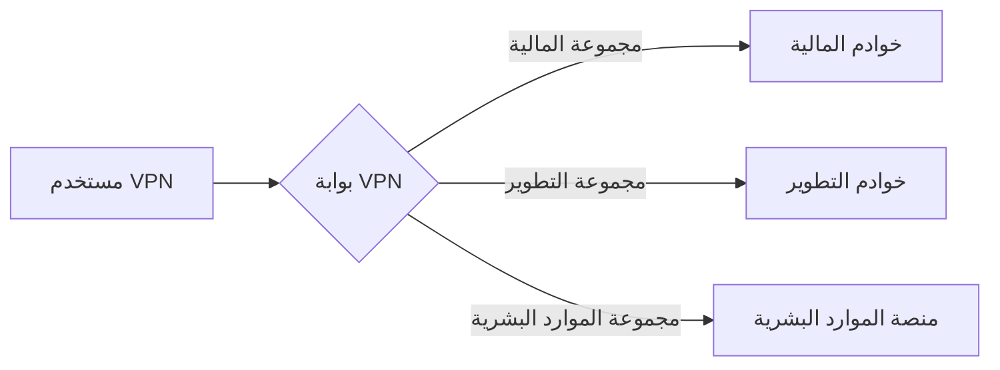

## 0.0 ملخص تنفيذي: لماذا تظل شبكات VPN مهمة في عالم انعدام الثقة (Zero Trust)؟

في بيئة المؤسسات الحديثة، تبخر "المحيط" (Perimeter) الأمني إلى حد كبير. ومع ذلك، تظل الشبكة الافتراضية الخاصة (VPN) أداة حيوية لإدارة البنية التحتية، والوصول الإداري الآمن، وربط التطبيقات القديمة. صُمم هذا الدليل لبيئة تضم 300 مستخدم—وهو نطاق تصبح فيه الإدارة اليدوية مستحيلة، بينما قد تكون حلول "المؤسسات الضخمة" مبالغاً فيها.

نحن نركز على **WireGuard** كبروتوكول أساسي نظراً لأدائه العالي، وخصائصه التشفيرية الحديثة، وقاعدة الأكواد المبسطة، مع الإقرار بدور OpenVPN و IPsec في حالات استخدام محددة.

## 0.1 كيفية قراءة هذا الدليل

يبني هذا المستند حزمة تقنية تدريجية. ننتقل من النماذج المفاهيمية عالية المستوى إلى تفاصيل التنفيذ منخفضة المستوى وكتيبات التشغيل.

- **الأقسام 1.0–3.0:** المفاهيم الأساسية ("ما هو").
- **الأقسام 4.0–8.0:** الهندسة والتصميم ("لماذا").

- **الأقسام 9.0–13.0:** الهوية والأمن ("كيف").
- **الأقسام 14.0–18.0:** الهندسة المتقدمة والتوسع ("الجزء الصعب").

- **الملاحق:** قوالب تكوين واقعية واستكشاف الأخطاء وإصلاحها.

:::tip[منظور المشغل]
الشبكة الافتراضية الخاصة ليست حلاً أمنياً بحد ذاتها؛ بل هي **طبقة نقل** يجب أن تخضع لإدارة مزود هوية (IdP) قوي وسياسات خروج صارمة. لا تسمح أبداً بالتوجيه "Any/Any" داخل النفق الخاص بك.
:::

---

## 1.0 أساسيات VPN: الطبقة المشفرة المتراكبة

في جوهرها، تنشئ الـ VPN اتصالاً افتراضياً من نقطة إلى نقطة عبر شبكة مادية غير موثوقة. في سياق المؤسسات، يتضمن هذا عادةً نفقاً مشفراً بين جهاز العميل (كمبيوتر محمول، هاتف) وبوابة مركزية.

### 1.1 دورة حياة الاتصال

عندما يبدأ المستخدم اتصال VPN، تحدث التسلسلات التالية:

1. **المصادقة:** يثبت العميل هويته (غالباً عبر شهادات أو بيانات اعتماد مدعومة بـ MFA).
2. **تبادل المفاتيح:** يتفاوض العميل والخادم على مفاتيح الجلسة باستخدام بروتوكول مثل Diffie-Hellman أو Noise.
3. **إنشاء النفق:** يتم إنشاء واجهة شبكة افتراضية (مثل `wg0` أو `tun0`) على كلا الطرفين.
4. **حقن التوجيه:** يتم تحديث جدول توجيه النظام لإرسال نطاقات IP محددة عبر الواجهة الافتراضية.
5. **التغليف:** يتم تغليف الحزم الصادرة برأس خارجي (UDP/TCP)، وتشفيرها، وإرسالها إلى البوابة.
6. **فك التغليف:** تقوم البوابة بفك تغليف الحزمة وإعادة توجيهها إلى الوجهة الداخلية.

### 1.2 التغليف والحمل الزائد (Overhead)

في كل مرة تقوم فيها بتغليف حزمة في نفق VPN، فإنك تضيف بايتات إضافية.

- **حمل WireGuard:** 32 بايت (رأس IP + رأس UDP + رأس WireGuard).
- **حمل OpenVPN:** 60-80 بايت (يختلف حسب التشفير والنقل).
إذا كان اتصال الإنترنت القياسي لديك يحتوي على حد 1500 بايت (MTU)، وأضافت الـ VPN 32 بايت، فإن حد بياناتك الفعلي داخل النفق هو 1468. إذا تجاهلت هذا، فسيتم "تجزئة" حزمك، مما يؤدي إلى سرعات بطيئة ومواقع ويب معطلة.

---

## 2.0 مصطلحات تقنية لمهندسي الشبكات

لتصميم نظام احترافي، يجب أن تتحدث لغة تدفق الحزم والتشفير:

- **طبقة النقل (UDP vs. TCP):** تفضل شبكات VPN بروتوكول UDP. يؤدي TCP-over-TCP (انهيار TCP) إلى تدهور كارثي في الأداء أثناء فقدان الحزم لأن كلتا الطبقتين تحاولان إعادة الإرسال.
- **MTU (وحدة الإرسال القصوى):** الحد المادي لحجم الحزمة (عادة 1500 بايت). نظراً لأن شبكات VPN تضيف رؤوساً (حملاً زائداً)، يجب أن يكون MTU الداخلي أقل (مثلاً 1420 لـ WireGuard) لتجنب التجزئة.

- **تثبيت MSS (MSS Clamping):** تقنية تستخدمها أجهزة التوجيه لاعتراض مصافحات TCP و"تثبيت" الحد الأقصى لحجم المقطع ليتناسب مع MTU المخفض للـ VPN، مما يمنع اتصالات "الثقب الأسود" حيث تتناسب الرؤوس ولكن لا تتناسب حمولات البيانات.
- **PFS (سرية التوجيه المثالية):** خاصية لا يؤدي فيها اختراق المفاتيح طويلة الأمد إلى اختراق مفاتيح الجلسات السابقة. تستخدم كل جلسة مفتاحاً مؤقتاً فريداً.

- **نفق الانقسام (Split Tunneling):** توجيه حركة مرور الشركة فقط (مثلاً `10.0.0.0/8`) عبر VPN مع إرسال Netflix/YouTube عبر مزود خدمة الإنترنت المحلي للمستخدم. ضروري للحفاظ على النطاق الترددي.
- **النفق الكامل (Full Tunneling):** توجيه كل حركة المرور عبر VPN. مطلوب لبيئات الامتثال العالي لضمان مرور كل حركة مرور الويب عبر DNS الشركات وفلاتر DLP (منع فقدان البيانات).

- **CGNAT:** عندما يشارك مزود خدمة الإنترنت IP عاماً واحداً مع العديد من المستخدمين. غالباً ما يؤدي هذا إلى تعطيل شبكات VPN التقليدية مثل IPsec، لكن يتم التعامل معه جيداً بواسطة WireGuard.

---

## 3.0 بروتوكولات VPN: مقارنة WireGuard مع الآخرين

بالنسبة لـ 300 مستخدم، يحدد اختيارك للبروتوكول عبء الصيانة للسنوات الثلاث القادمة.

### 3.1 WireGuard (المعيار الذهبي)

- **المميزات:** ~4,000 سطر برمجي (قابل للتدقيق)، تشفير حديث (ChaCha20, Poly1305)، مصافحات شبه فورية، إنتاجية عالية جداً.
- **العيوب:** عديم الحالة بالتصميم (يتطلب إدارة يدوية أو طبقة تنسيق مثل NetBird أو Tailscale أو Firezone لـ 300+ مستخدم).

### 3.2 OpenVPN (الحصان القديم)

- **المميزات:** مرونة مذهلة، يدعم TCP (لتجاوز الجدران النارية المقيدة)، يعمل على أي شيء تقريباً.
- **العيوب:** قاعدة أكواد ضخمة (600 ألف+ سطر)، تبديل سياق بطيء، إدارة معقدة للشهادات.

### 3.3 IKEv2/IPsec (الخيار الأصلي)

- **المميزات:** أداء عالٍ، مدعوم محلياً بواسطة Windows وiOS وmacOS بدون تطبيقات إضافية.
- **العيوب:** صعب التكوين بشكل صحيح؛ لـ "IPsec" العديد من المتغيرات غير المتوافقة.

---

## 4.0 الهندسة المعمارية: تصميم لـ 300 مستخدم

عند التوسع لـ 300 مستخدم، لا يمكنك الاعتماد على خادم Linux واحد يشغل سكريبت bash. أنت بحاجة إلى بنية تتحمل فشل الأجهزة.

### 4.1 زوج التوفر العالي (HA)

قم بنشر بوابتي VPN في تكوين Active-Passive أو Active-Active.

- **Keepalived/VRRP:** استخدم IP افتراضياً (VIP). إذا تعطلت البوابة A، تتولى البوابة B الـ VIP في ثوانٍ.
- **مزامنة الحالة:** بالنسبة لبروتوكولات مثل IPsec، قد تحتاج إلى مزامنة حالات الجلسة حتى لا يفقد المستخدمون اتصالهم أثناء تجاوز الفشل.

### 4.2 نموذج "بوابة في كل قارة"

بالنسبة لقوى عاملة موزعة، ستُحبط بوابة واحدة في لندن المستخدمين في طوكيو.

- **Anycast IP:** استخدم خدمة Anycast سحابية لتوجيه المستخدمين إلى أقرب عقدة VPN سليمة.
- **Geo-DNS:** حل `vpn.company.com` لعناوين IP إقليمية مختلفة بناءً على موقع المستخدم.

---

## 5.0 الأهداف الأمنية: "الأركان الخمسة"

يجب أن يثبت تنفيذك أنه يفي بهذه المعايير قبل البدء:

1. **الوصول المعتمد على الهوية:** لا أحد يدخل بدون إدخال صالح في مزود الهوية (مثل Entra ID أو Okta).
2. **السلامة التشفيرية:** استخدم التشفيرات الحديثة فقط.
3. **منع الحركة الجانبية:** استخدم افتراض "الرفض للجميع".
4. **وضع نقطة النهاية:** تحقق من تمكين تشفير القرص ومكافحة الفيروسات قبل السماح بإنشاء النفق.
5. **الرؤية:** يجب تسجيل كل اتصال وانقطاع وفشل في المصافحة في نظام SIEM مركزي.

---

## 6.0 نمذجة التهديدات لبوابة VPN الخاصة بك

بوابة الـ VPN هدف ضخم. إذا سقطت، فالمهاجم "بالداخل".

### 6.1 التهديدات الداخلية (المسؤول المتسلل)
- **الخطر:** إنشاء مفتاح ثابت "باب خلفي" لجهاز شخصي.
- **التخفيف:** MFA إلزامي لكل جلسة.

### 6.2 التهديدات الخارجية (حشو الاعتمادات)
- **الخطر:** العثور على كلمة مرور مسربة وتسجيل الدخول كمدير تنفيذي.
- **التخفيف:** ربط الجهاز (Device-binding). لا تعمل الـ VPN إلا إذا كان كل من كلمة المرور وشهادة الجهاز موجودين.

### 6.3 تهديدات البنية التحتية (DDoS)
- **الخطر:** فيضانات UDP تجعل الـ VPN غير قابلة للاستخدام.
- **التخفيف:** آلية "ملفات تعريف الارتباط" (Cookie) في WireGuard للحماية من DoS.

---

## 7.0 تصميم التوجيه والشبكات الفرعية

التوجيه الفعال يمنع نقاط اختناق الأداء ويبسط قواعد الأمان.

### 7.1 تجنب تصادم الشبكات الفرعية
تستخدم العديد من أجهزة توجيه المنازل `192.168.1.0/24`. إذا كانت شبكة شركتك تستخدم ذلك أيضاً، فلن يتمكن المستخدم من الوصول للموارد الداخلية. استخدم نطاق `10.x.x.x` أو `172.16.x.x`.

---

## 8.0 النفق الكامل مقابل النفق المنقسم

- **النفق الكامل:** للأمن والامتثال الكامل (توجيه كل شيء عبر الشركة).
- **النفق المنقسم:** للأداء وتوفير التكاليف (توجيه حركة مرور العمل فقط).

:::caution[الحل الهجين]
تستخدم معظم المؤسسات الحديثة **التضمين المنقسم (Split Inclusion)**. قم بتضمين نطاقات CIDR الداخلية الخاصة بك وعناوين IP لخدمات SaaS المحددة، واترك الباقي لمزود الخدمة المحلي.
:::

---

## 9.0 بنية الهوية: ربط VPN بالواقع

بالنسبة لـ 300 مستخدم، لا يمكنك إدارة مستخدمي Linux المحليين على البوابة. أنت بحاجة إلى جسر هوية.

1. **تطبيق العميل** يطلب تسجيل الدخول.
2. **البوابة** تعيد توجيه المستخدم إلى صفحة تسجيل الدخول OIDC/SAML.
3. **المستخدم** يكمل MFA.
4. **مزود الهوية** يرسل رمزاً (JWT) إلى البوابة.
5. **البوابة** تنشئ مفتاح WireGuard قصير العمر وترسله للعميل.

---

## 10.0 قوائم التحكم في الوصول (ACLs) والتجزئة الدقيقة

يجب ألا تكون الشبكة الافتراضية "مسطحة".



---

## 11.0 المراقبة والتسجيل: أن تكون "العين في السماء"

يجب أن تجيب سجلات الـ VPN على: "من وصل إلى خادم النسخ الاحتياطي في الساعة 2 صباحاً؟".

---

## 12.0 حل صداع MTU/MSS (صعب)

هذا هو السبب الأول لتذاكر مكتب المساعدة. إذا كانت الـ VPN تعمل ولكن البيانات عالقة، قم بتشغيل اختبار `ping` مع حجم ثابت لضبط MTU.

لإصلاح ذلك على البوابة:
`iptables -t mangle -A FORWARD -p tcp --tcp-flags SYN,RST SYN -j TCPMSS --clamp-mss-to-pmtu`

---

## 13.0 التوفر العالي وموازنة التحميل

- **Round-Robin DNS:** توجيه `vpn.company.com` لثلاثة عناوين IP مختلفة.
- **موازنات تحميل TCP/UDP:** استخدام موازن سحابي (مثل AWS NLB) مع "لزوجة الجلسة" (Session Stickiness).

---

## 14.0 التعافي من الكوارث (DR)

- **نسخ احتياطي سحابي:** امتلاك بوابة "استعداد بارد" في منطقة سحابية أخرى.
- **التكوين ككود:** تخزين تكوينات VPN في Git واستخدام Terraform/Ansible.

---

## 15.0 التميز التشغيلي: تجربة المطور

- **الاتصال التلقائي:** تكوين العميل للعمل خارج مكتب الشركة.
- **تحديثات صامتة:** استخدام MDM (مثل Jamf أو InTune).

---

## 16.0 الامتثال والتدقيق

إذا كنت تخضع لـ SOC2 أو HIPAA أو GDPR، فإن الـ VPN هي عنصر تحكم حاسم. تأكد من إنهاء الجلسات تلقائياً كل 12-24 ساعة لفرض إعادة المصادقة.

---

## 17.0 تحسين الأداء على مستوى النواة (Kernel)

```bash
sysctl -w net.core.netdev_max_backlog=5000
sysctl -w net.core.rmem_max=16777216
sysctl -w net.core.wmem_max=16777216
```

---

## 18.0 التطلع للمستقبل: ZTNA وعالم ما بعد الـ VPN

تتجه الصناعة نحو **الوصول إلى الشبكة انعدام الثقة (ZTNA)**. بدلاً من منح المستخدم "وصولاً للشبكة"، تمنحه "وصولاً للتطبيق" عبر وكيل عكسي. ابدأ بترحيل تطبيقات الويب إلى ZTNA مع الإبقاء على VPN لإدارة الخوادم.

---

## 19.0 سيناريوهات استكشاف الأخطاء وإصلاحها

- **اتصال بطيء:** تحقق من إعدادات BBR (لتحسين التحكم في الازدحام).
- **جلسة الزومبي:** خفض `PersistentKeepalive`.
- **موقع داخلي لا يحمل:** تحقق من MSS Clamping.

---

## 20.0 Linux, Mac, و Windows: بداية سريعة

*(استخدم الأوامر المذكورة في قسم 20.0 من المقالة الأصلية للعملاء)*

---

## الملحق أ: تكوين خادم WireGuard الأساسي (Ubuntu 22.04)

```ini
[Interface]
PrivateKey = <SERVER_PRIVATE_KEY>
Address = 10.0.0.1/24
ListenPort = 51820
MTU = 1420
PostUp = iptables -A FORWARD -i %i -j ACCEPT; iptables -t nat -A POSTROUTING -o eth0 -j MASQUERADE
PostDown = iptables -D FORWARD -i %i -j ACCEPT; iptables -t nat -D POSTROUTING -o eth0 -j MASQUERADE
```

---

## خاتمة للمهندس المعماري

بناء VPN لـ 300 مستخدم هو توازن بين **الأمن**، **الخصوصية**، و**السهولة**. أفضل VPN هي التي لا يعلم أحد أنها تعمل. ابقَ متيقظاً، ووثق كل شيء، واختبر تجاوز الفشل دائماً قبل أن تحتاجه.