## الأرض تتغير مرة أخيرة

بعد أربعة أجزاء، بنينا الجدران ([الأول](/posts/secure_systems_architecture/))، وتحققنا من كل مبدأ عند كل باب ([الثاني](/posts/identity_and_access_in_depth/))، وجعلنا رسائلنا غير قابلة للتزوير ([الثالث](/posts/cryptography_engineering_in_depth/))، وتعلمنا كيفية اكتشاف الاختراق الذي يتجاوز كل شيء والنجاة منه ([الرابع](/posts/detection_and_response_in_depth/)). كل واحدة من هذه الأفكار افترضت شيئًا توقف بصمت عن أن يكون صحيحًا: أن هناك `خادمًا`، `جهازًا`، `شيئًا` يستمر، تملكه، ويمكنك الإشارة إليه.

في عالم السحابة الأصيلة، يتلاشى هذا الافتراض:

*   "الخادم" هو `حاوية` تعيش لمدة تسعين ثانية ويتم استبدالها بتوأم متطابق.
*   البنية التحتية ليست مكدسة؛ إنها `ملف YAML` يطبقه خط أنابيب.
*   التطبيق ليس شيئًا كتبته؛ إنه `التعليمات البرمجية الخاصة بك بالإضافة إلى ألفي تبعية` لم تكتبها، تم تجميعها بواسطة نظام بناء ستكافح لتدقيقه بالكامل.

هذه الخاتمة تدور حول الدفاع عن `ذلك` العالم، حيث اختفى المحيط بالكامل، وأحمال العمل تُعامل كالمواشي لا الحيوانات الأليفة، وتصل أخطر الاختراقات في العقد ليس عبر بابك الأمامي ولكن عبر `سلسلة التوريد` الخاصة بك. كل ما علمته السلسلة لا يزال ينطبق، لكن الأسطح التي ينطبق عليها الآن تومض وتختفي آلاف المرات يوميًا.

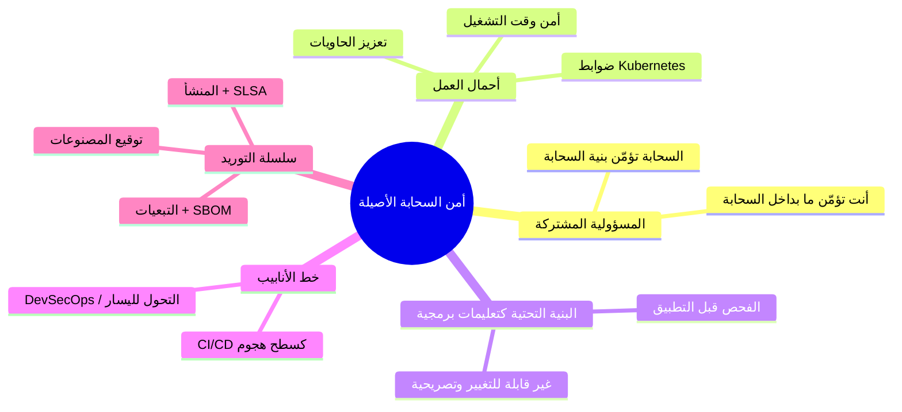

---

## الجزء الأول: نموذج المسؤولية المشتركة

الفكرة الأولى والأكثر سوء فهم في أمن السحابة: **موفر السحابة لا يؤمن تطبيقك.** إنه يؤمن `البنية التحتية` التي تعمل عليها السحابة؛ وأنت تؤمن ما `تضعه فيها`. يتغير الخط اعتمادًا على نموذج الخدمة، وتكمن الاختراقات في الارتباك حول مكانه [^1]:

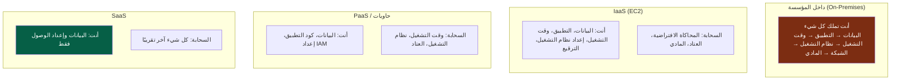

:::important[مسؤوليتك لا تصل أبداً إلى الصفر]
لاحظ الثابت في كل عمود: **أنت تملك دائمًا بياناتك وإعدادات الوصول الخاصة بك.** الغالبية العظمى من "اختراقات السحابة" ليست اختراقًا للموفر، بل هي سوء تكوين من `العميل`: حاوية S3 عامة، دور IAM مفرط الصلاحيات، قاعدة بيانات مكشوفة لـ `0.0.0.0/0`. تمنحك السحابة بدائيات قوية تكون معطلة افتراضيًا؛ وتركها معطلة هو مسؤوليتك. سوء التكوين، وليس اختراق الموفر، هو السبب الأول لكشف البيانات السحابية. [^2]
:::

---

## الجزء الثاني: تأمين حمل العمل

### الفصل الأول: أمن الحاويات - الواقع الطبقي

الحاوية ليست جهازًا افتراضيًا خفيف الوزن (VM)؛ إنها مجموعة من `العمليات` المعزولة على `نواة مضيف مشتركة`. هذه الحقيقة الوحيدة تدفع نموذج التهديد بأكمله، والدفاع متعدد الطبقات من الصورة إلى وقت التشغيل:

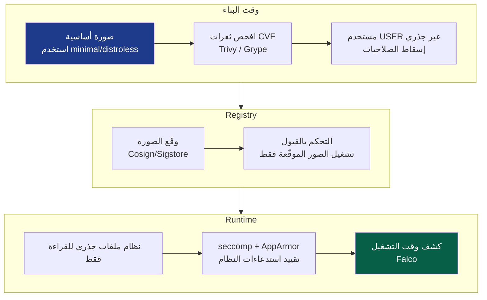

أهم ممارسات الحاويات، حسب الأولوية من حيث العائد:

*   **صور أساسية صغيرة** - صورة `distroless` أو `scratch` تحتوي على تطبيقك و`لا شيء آخر`: لا سطر أوامر (shell)، لا مدير حزم، لا `curl`. المهاجم الذي يدخل لا يملك أدوات للتمحور بها. كما أنها تقلل سطح ثغرات CVE بمقدار كبير، عدم وجود حزم نظام تشغيل يعني عدم وجود ثغرات في حزم نظام التشغيل.
*   **عدم التشغيل كمستخدم جذري (`root`) مطلقاً** - عملية حاوية تعمل كمستخدم جذري (`root`) وتهرب من الحاوية تصبح مستخدمًا جذريًا (`root`) `على المضيف`. عيّن `USER` غير جذري، أسقط جميع صلاحيات `Linux capabilities` وأضف فقط ما هو ضروري.
*   **نظام ملفات جذري للقراءة فقط** - إذا كانت الحاوية لا تستطيع الكتابة إلى نظام ملفاتها الخاص، فلن يتمكن المهاجم من إسقاط حمولة خبيثة عليها.
*   **فحص كل صورة** - استخدم `Trivy`/`Grype` في التكامل المستمر (CI)، واوقف البناء عند وجود ثغرات CVE حرجة.

:::warning[هروب الحاوية هو بيت القصيد]
نظرًا لأن الحاويات تشارك نواة المضيف، فإن **استغلال النواة أو سوء التكوين يعني سيطرة كاملة على المضيف**، ومن مضيف واحد، غالبًا ما تتم السيطرة على العنقود بأكمله. الأخطاء الجسيمة التي تجعل هذا الأمر تافهاً: التشغيل بصلاحيات `--privileged`، تحميل مقبس Docker (`/var/run/docker.sock`) في حاوية (وهذا يعني صلاحيات `root` على المضيف، مهداة)، والتشغيل بمعرف المستخدم `UID 0`. تعامل مع الحاوية ذات الامتيازات كقرار يتطلب نفس التدقيق الذي يتطلبه منح صلاحيات `sudo`. [^3]
:::

### الفصل الثاني: Kubernetes - تعزيز أمان المنسق

Kubernetes هو نظام تشغيل موزع للحاويات، وأمانه موضوع بحد ذاته. يمتد سطح الهجوم على أربع جبهات، تُحفظ كـ **4 C's لأمن السحابة الأصيلة**: السحابة (Cloud)، العنقود (Cluster)، الحاوية (Container)، التعليمات البرمجية (Code) [^4].

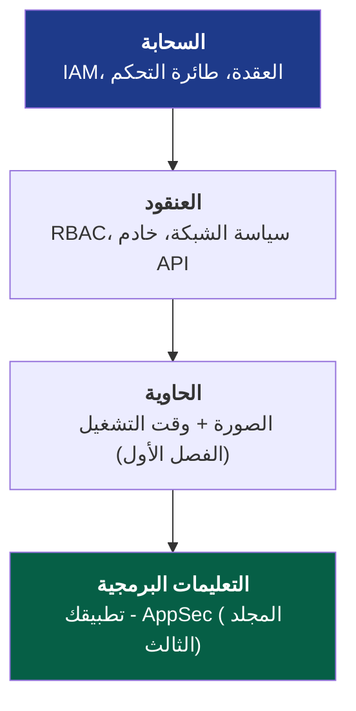

الضوابط الأساسية للعنقود، يغلق كل منها مسار هجوم محدد:

::::steps

:::step[RBAC - أقل الامتيازات لواجهة برمجة التطبيقات (API)]{subtitle="من يمكنه فعل ماذا في العنقود"}
خادم `API` الخاص بـ Kubernetes هو جوهرة التاج، فمن يتحكم فيه يتحكم في كل حمل عمل. طبق دروس أقل الامتيازات من الجزء الثاني: لا صلاحيات `cluster-admin` واسعة النطاق لحسابات الخدمة، قم بتحديد نطاق الأدوار لمساحات الأسماء (`namespaces`)، ولا تقم أبدًا بتحميل رمز حساب الخدمة الافتراضي حيث لا يلزم. بود برمز مفرط الامتيازات هو نقطة محورية تؤدي مباشرة إلى الاستيلاء على العنقود.
:::

:::step[سياسات الشبكة - الرفض الافتراضي]{subtitle="تجزئة شرق-غرب"}
بشكل افتراضي، `يمكن لكل بود التحدث إلى أي بود آخر`، بشكل مسطح وواثق، وهو بالضبط نموذج الشبكة الذي حذر منه الجزء الأول. طبق `NetworkPolicy` للرفض الافتراضي واسمح صراحة بالتدفقات المطلوبة فقط. هذه هي التجزئة الدقيقة (الجزء الأول/الثاني) المطبقة على شبكة البود: إنها تحول بودًا واحدًا مخترقًا من منصة إطلاق إلى طريق مسدود.
:::

:::step[معايير أمان البود - تقييد الخطير]{subtitle="فرض قواعد الحاويات"}
فرض معيار أمان البود `Restricted`: لا بودات متميزة، لا مشاركة لمساحة اسم المضيف، مستخدم غير جذري فقط، نظام ملفات جذري للقراءة فقط. هذا هو المكان الذي تُفرض فيه قواعد الحاويات من الفصل الأول `بواسطة` المنصة بدلاً من مجرد التوصية بها للمطورين.
:::

:::step[الأسرار - لا تستخدم base64 كـ "تشفير"]{subtitle="حماية الحساسة"}
أسرار Kubernetes (`Kubernetes Secrets`) هي فقط `مشفرة بـ base64`، وليست مشفرة، في `etcd` افتراضيًا. قم بتمكين `التشفير في حالة السكون` لـ `etcd`، والأفضل من ذلك، دمج مدير خارجي (Vault، خدمة إدارة المفاتيح السحابية (KMS) عبر مشغل CSI) بحيث لا تبقى الأسرار أبدًا في `etcd` بشكل قابل للاسترداد. أي شخص لديه وصول قراءة إلى `etcd` سيقرأ كل سر بخلاف ذلك.
:::

::::

:::tip[التحكم بالقبول هو نقطة الاختناق لسياساتك]
يمر كل كائن يدخل العنقود عبر `وحدة التحكم بالقبول`، وهو المكان المثالي لفرض `السياسة كتعليمات برمجية`. تتيح لك أدوات مثل `OPA Gatekeeper` أو `Kyverno` `رفض` أحمال العمل غير المتوافقة عند الباب: "لا صورة بدون توقيع"، "لا حاوية بدون حدود للموارد"، "لا علامات `latest`". إنها نقطة فرض السياسة (PEP) من نموذج الثقة الصفرية (Zero Trust) في الجزء الثاني، مطبقة على البوابة الأمامية للعنقود. السياسة المفروضة عند القبول لا يمكن أن ينسىها المطور. [^5]
:::

### الفصل الثالث: أمن وقت التشغيل - افترض أن البود قد تم اختراقه

كل ما سبق هو وقائي. بتطبيق عقلية `افتراض الاختراق` من الجزء الرابع على أحمال العمل: `حاوية` ستشغل في النهاية شيئًا لا ينبغي لها. `أمن وقت التشغيل` يراقب السلوك الحي ويشير إلى الشاذ، كظهور سطر أوامر داخل حاوية يجب أن تشغل عملية واحدة فقط، اتصال صادر إلى عنوان IP لم يُرَ من قبل، كتابة إلى `/etc/passwd`. تحول أدوات مثل `Falco` تدفق استدعاءات النظام للنواة إلى اكتشافات، موسعة بذلك منهجية SIEM/هندسة الكشف من الجزء الرابع إلى حمل العمل سريع الزوال.

---

## الجزء الثالث: البنية التحتية كتعليمات برمجية - تأمين المخطط

في السحابة الأصيلة، يتم `التصريح` بالبنية التحتية، وليس `تكوينها`، باستخدام `Terraform`، `CloudFormation`، `Pulumi`. هذه `هدية أمنية`: لأن البنية التحتية بأكملها عبارة عن تعليمات برمجية، يمكنك `فحصها بحثًا عن سوء التكوين قبل وجود مورد واحد.`

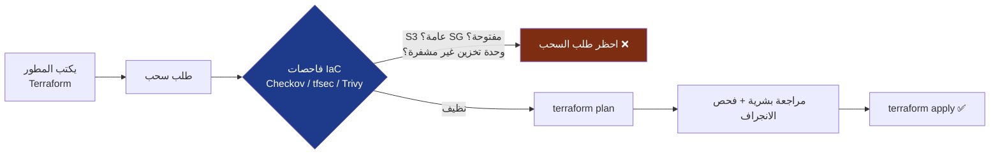

هذا هو التعبير المطلق عن `التحول لليسار` (موضوع SSDLC من الجزء الأول): سوء التكوين الذي كان سيسبب اختراقًا، مجموعة أمان مفتوحة للعالم، قاعدة بيانات غير مشفرة، حاوية عامة، يتم اكتشافه في مراجعة التعليمات البرمجية، `قبل أن يوجد في الإنتاج على الإطلاق`. تكلفة إصلاح الثغرة الأمنية تنمو بأضعاف مضاعفة كلما تأخر اكتشافها:

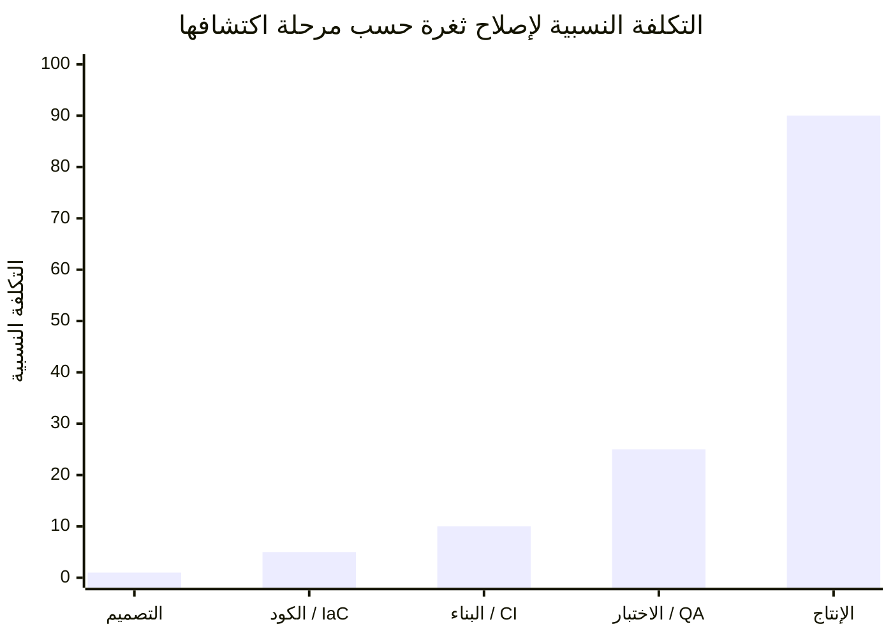

كل خطوة إلى اليمين تضاعف التكلفة، والاختراق `في الإنتاج` خارج هذا الرسم البياني تمامًا. فحص `IaC` هو كيف تدفع الاكتشاف إلى أرخص عمود ممكن.

:::note[عدم القابلية للتغيير هو خاصية أمنية]
تتيح `IaC` `البنية التحتية غير القابلة للتغيير`: لا يتم تحديث الخوادم في مكانها أبدًا، بل `تُستبدل` من صورة معروفة الجودة. هذا يحل مشكلتين بصمت. يختفي `انجراف التكوين` (التباين البطيء بين "ما يعمل" و "ما نعتقد أنه يعمل")، لأن كل عملية نشر تعيد البناء من المصدر. ويصبح `استمرار المهاجم` أصعب بكثير، فالباب الخلفي المزروع على مضيف قيد التشغيل يُمسح في المرة التالية التي يُعاد فيها نشر هذا المضيف، وقد يكون ذلك بعد ساعات. التعامل مع أحمال العمل كالمواشي لا الحيوانات الأليفة هو وضع أمني، وليس مجرد راحة تشغيلية.
:::

---

## الجزء الرابع: سلسلة التوريد - حدود العقد

إليك الحقيقة المزعجة للبرمجيات الحديثة: **ربما كتبت 5% فقط مما تشحنه.** الـ 95% الأخرى هي تبعيات مفتوحة المصدر، صور أساسية، وأدوات بناء، تعليمات برمجية من غرباء، يتم سحبها بشكل عابر، وتعمل بصلاحيات تطبيقك الكاملة. أصبحت سلسلة التوريد الآن أكثر الحدود استغلالاً في مجال الأمن، فلماذا تخترق هدفًا محصنًا عندما يمكنك اختراق شيء `يثق به`؟

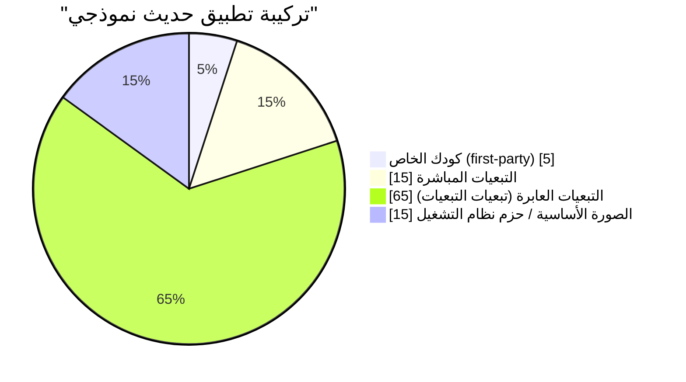

هذه الشريحة "العابرة" الضخمة هي بيت القصيد: أنت `اخترت` تبعياتك المباشرة الـ 15، لكنك ورثت المئات التي لم تسمع عنها قط، أي واحدة منها يمكن أن تنهي أمنك.

### الفصل الرابع: تشريح هجوم سلسلة التوريد

الكوارث التي حددت السنوات الأخيرة، `SolarWinds` (2020، خط أنابيب بناء مخترق حقن بابًا خلفيًا في تحديثات موقعة تم شحنها إلى 18,000 مؤسسة) و`Log4Shell` (2021، تنفيذ تعليمات برمجية عن بعد (RCE) سهل الاستغلال في مكتبة تسجيل مضمنة في `ملايين` التطبيقات) [^6]، تشترك في شكل:

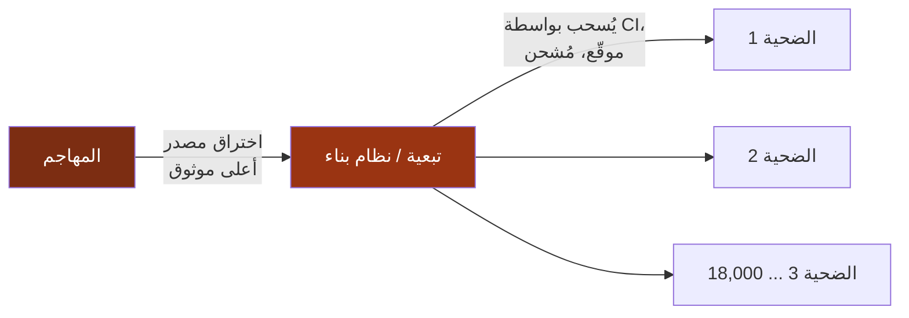

اختراق واحد، آلاف الضحايا، جميعهم فعلوا كل شيء آخر بشكل صحيح. هذا التباين هو السبب في أن أمن سلسلة التوريد أصبح أولوية للأمن القومي، ولماذا الدفاعات أدناه أصبحت الآن أساسيات، وليست تعقيدًا.

### الفصل الخامس: الدفاعات الحديثة - SBOM، التوقيع، و SLSA

ثلاث ممارسات متداخلة تجيب على أسئلة سلسلة التوريد الثلاثة: `ماذا تحتوي، هل هي ما تدعي أنها، وهل يمكنني الوثوق بكيفية بنائها`:

| الدفاع | السؤال الذي يجيب عليه | ما هو |
| --- | --- | --- |
| **قوائم مواد البرمجيات (SBOM)** | *ما الذي يوجد في برمجياتي بالفعل؟* | قائمة مواد البرمجيات، جرد قابل للقراءة آليًا لكل مكون وإصدار. عندما تظهر `Log4Shell` التالية، تبحث في قوائم SBOMs الخاصة بك وتعرف في دقائق، لا أسابيع، ما إذا كنت مكشوفًا. [^7] |
| **توقيع المصنوعات** | *هل هذه المصنوعة أصلية وغير متلاعب بها؟* | توقيع مخرجات البناء بشكل تشفيري (`Sigstore`/`Cosign`) حتى يتحقق المستهلكون من المنشأ، مطبقًا توقيعات الجزء الثالث على مصنوعات البناء الخاصة بك. |
| **مستويات SLSA** | *هل يمكنني الوثوق بالعملية التي بنتها؟* | مستويات سلسلة التوريد لمصنوعات البرمجيات (SLSA)، إطار عمل متدرج لسلامة البناء: المصدر متحقق منه، البناء معزول، المنشأ مُنشأ وموقع. [^8] |

خط أنابيب الأمن الشامل ينسج هذه الممارسات مع كل شيء في هذه السلسلة:

```mermaid
flowchart LR
    SRC["commit موقّع<br/>+ حماية الفرع"] --> DEP["فحص التبعيات<br/>+ تثبيت الإصدارات + SBOM"]
    DEP --> BUILD["بناء معزول، سريع الزوال<br/>- منشأ SLSA"]
    BUILD --> SAST["SAST + فحص الأسرار"]
    SAST --> ART["وقّع المصنوعة<br/>Cosign"]
    ART --> IMGSCAN["فحص ثغرات CVE للصورة"]
    IMGSCAN --> ADMIT["التحكم بالقبول:<br/>تحقق من التوقيع + السياسة"]
    ADMIT --> RUN["أمن وقت التشغيل<br/>Falco"]
    style BUILD fill:#1e3a8a,color:#fff
    style ADMIT fill:#065f46,color:#fff
```

:::warning[خط أنابيب CI/CD هو بحد ذاته هدف رئيسي]
يتمتع نظام البناء الخاص بك بامتيازات إلهية، حيث يمكنه قراءة كل سر، وتوقيع كل مصنوعة، والنشر إلى الإنتاج. رمز `CI` مسرب، طلب سحب خبيث يشغل تعليمات برمجية غير موثوق بها في مُشغل مميز، أو `GitHub Action` مسموم هو مسار مباشر لشحن برمجيات بها باب خلفي `بتوقيعك الصحيح عليها`. تعامل مع خط الأنابيب كبنية تحتية للإنتاج: رموز أقل امتيازات (موحدة بـ OIDC، قصيرة الأجل، حسب الجزء الثاني)، لا أسرار في السجلات، إصدارات عمل مثبتة (بواسطة `SHA`، لا علامة)، ومُشغلون معزولون وسريعو الزوال للتعليمات البرمجية غير الموثوق بها. خط الأنابيب الذي يبني دفاعاتك هو هدف لنفس السبب الذي يعتبر فيه دار سك النقود هدفًا: إنه يصنع الثقة. [^9]
:::

---

## الجزء السادس: DevSecOps - جعل الأمن مستمرًا

تتقارب جميع الأجزاء الخمسة حول تحول ثقافي واحد. النموذج القديم، فريق أمني يراجع البرمجيات في النهاية ويقول "لا"، لا يمكنه البقاء في عالم ينشر ألف مرة في اليوم. `DevSecOps` يذيب بوابة فريق الأمن ويوزع خبرته `في` خط الأنابيب، بحيث يكون الأمن مؤتمتًا، مستمرًا، ومهمة الجميع.

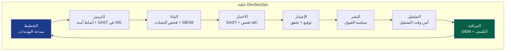

كل عقدة في تلك الحلقة هي فصل من هذه السلسلة، أصبحت الآن مؤتمتة ومضمنة: نمذجة التهديدات (الأول)، الترميز الآمن والتشفير (الثالث)، فحص التبعيات و`IaC` (الخامس)، التوقيع (الثالث/الخامس)، التحكم بالقبول وتطبيق الثقة الصفرية (الثاني)، الكشف في وقت التشغيل و`SIEM` (الرابع). يتوقف الأمن عن كونه `مرحلة` ويصبح `خاصية` لخط الأنابيب، يُفحص باستمرار، يُفرض بالتعليمات البرمجية، غير مرئي عندما ينجح وصاخب فقط عندما يفشل.

:::important[الجوهر الثقافي لكل ذلك]
`DevSecOps` هو 20% أدوات و 80% ثقافة. إيمانه الأساسي هو أن **الأمن مسؤولية مشتركة، لا حق نقض لقسم.** تصل إلى ذلك بجعل المسار الآمن هو المسار `السهل`: صور أساسية معززة ومعتمدة مسبقًا، قوالب آمنة افتراضيًا، وحدات `IaC` متوافقة جاهزة للاستخدام، وملاحظات آلية في ثوانٍ، في طلب السحب، وليس في تدقيق ربع سنوي. عندما يكون القيام بالشيء الآمن `أقل` عملًا من القيام بالشيء غير الآمن، يتوسع الأمن. عندما يكون ضريبة، يتجاوزه المطورون، في كل مرة.
:::

---

## الخلاصة: تجميع السلسلة

بدأنا، في الجزء الأول، من الطبقة المادية، كابل في جدار، إطار على سلك، وننتهي هنا، عند حاوية موجودة لتسعين ثانية داخل بنية تحتية هي بحد ذاتها مجرد نص في مستودع `git`. عبر خمسة أجزاء، تضاعفت حقيقة واحدة في كل مستوى:

> **لا يوجد تحكم واحد يؤمن النظام. الأمن هو عمق، طبقات من الضوابط المستقلة والمتداخلة، يفترض كل منها أن الضابط الذي يسبقه سيفشل في النهاية.**

عد بالنظر إلى ما أصبح عليه هذا العمق بالفعل:

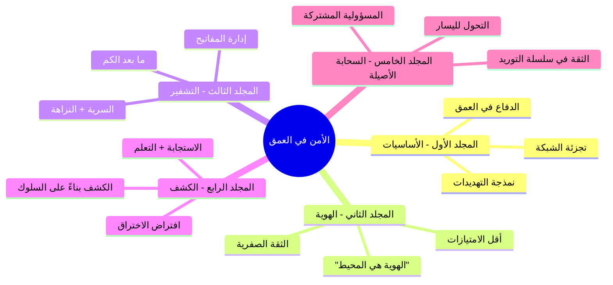

جدار الحماية يفترض أن الشبكة قد تُخترق، لذا الهوية تتحقق من كل طلب. الهوية تفترض أن بيانات الاعتماد قد تُسرق، لذا التشفير يجعل الجلسة غير قابلة للتزوير وسرية أمامية. التشفير يفترض أن نقطة النهاية لا تزال ممكنة الامتلاك، لذا الكشف يراقب السلوك الذي يفضحها. الكشف يفترض أن حمل العمل نفسه قد يُسمم، لذا سلسلة التوريد تثبت أن ما نشحنه هو ما بنيناه. لا يثق أي من هذه الضوابط بالآخرين ليكونوا مثاليين، وذلك `عدم الثقة، المصمم في البنية،` هو الفن بأكمله.

المحيط تبدد. الآلات أصبحت سريعة الزوال. التعليمات البرمجية أصبحت في معظمها من الغرباء. وخلال كل ذلك، استمر الانضباط: **طبق طبقات دفاعك، تحقق من كل شيء، افترض الاختراق، أثبت المنشأ، ولا تثق أبدًا بجدار واحد ليكون الأخير.** هذا هو الأمن المعمق. هذه هي المهمة.

شكرًا لك على استكشاف المكدس بأكمله. انطلق لبناء أشياء يصعب كسرها، ومتواضعة بما يكفي لتبقى بعد الكسر.

---

## المراجع

[^1]: [AWS - Shared Responsibility Model](https://aws.amazon.com/compliance/shared-responsibility-model/)
[^2]: [Gartner / CSA - The Egregious Eleven: Top Cloud Security Threats](https://cloudsecurityalliance.org/artifacts/top-threats-to-cloud-computing-egregious-eleven/)
[^3]: [NIST (2017) - SP 800-190: Application Container Security Guide](https://csrc.nist.gov/publications/detail/sp/800-190/final)
[^4]: [Kubernetes - Overview of Cloud Native Security (The 4C's)](https://kubernetes.io/docs/concepts/security/overview/)
[^5]: [Open Policy Agent - Gatekeeper](https://open-policy-agent.github.io/gatekeeper/website/docs/)
[^6]: [CISA - Apache Log4j Vulnerability Guidance](https://www.cisa.gov/uscert/apache-log4j-vulnerability-guidance)
[^7]: [NTIA - Software Bill of Materials (SBOM)](https://www.ntia.gov/SBOM)
[^8]: [SLSA - Supply-chain Levels for Software Artifacts](https://slsa.dev/)
[^9]: [OWASP - Top 10 CI/CD Security Risks](https://owasp.org/www-project-top-10-ci-cd-security-risks/)