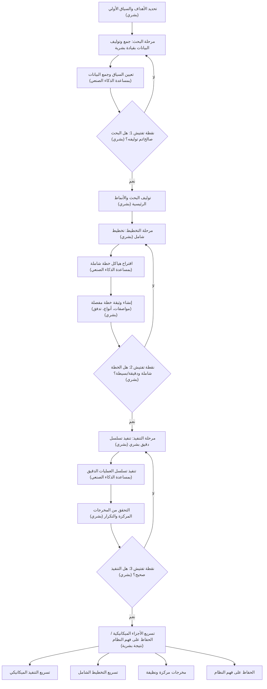

هناك ظاهرة هادئة تحدث عبر فرق الهندسة في الوقت الحالي. يقوم مطور باستخدام وكيل ذكاء اصطناعي لإنشاء ميزة معقدة. الاختبارات تمر. يتم نشر الكود. ولكن إذا طلبت من هذا المطور شرح الآليات الدقيقة لما تم شحنه للتو، فقد يواجه صعوبة.

نحن نشحن أكوادًا لا نفهمها بالكامل، وسرعة قيامنا بذلك غير مسبوقة.

المناقشات الصناعية الأخيرة — لا سيما من قادة الهندسة الذين يتعاملون مع قواعد أكواد ضخمة في شركات المؤسسات — سلطت الضوء على مفارقة صارخة في تطوير البرمجيات الحديثة. لقد حولت أدوات الذكاء الصنعي المهام التي كانت تستغرق أيامًا إلى مجرد ساعات. لكن أنظمة الإنتاج الكبيرة تفشل حتمًا، وعندما يحدث ذلك، فأنت بحاجة إلى إنسان يفهم النظام بعمق لتصحيحه.

نحن لسنا الجيل الأول الذي يواجه أزمة برمجية، لكننا الجيل الأول الذي يواجهها على نطاق إنشاء لا نهائي.

## وهم "السهولة"

لفهم لماذا تصبح قواعد الأكواد لدينا أصعب في الفهم، علينا إعادة النظر في فلسفة هندسية أساسية: الفرق بين *البساطة* و*السهولة*.

كما عرفها ريتش هيكي (مبتكر Clojure) بشكل مشهور، **البساطة** تشير إلى الهيكل. وهذا يعني أن المكون يقوم بشيء واحد ولا يتشابك مع الآخرين. **السهولة**، من ناحية أخرى، تعني القرب. وهذا يعني أن الحل متاح بسهولة في متناول يدك — مثل سحب حزمة من npm، ونسخ مقطع من Stack Overflow، أو مطالبة نموذج لغوي كبير (LLM).

البساطة تتطلب تفكيرًا متعمدًا، وتصميمًا، وفك تشابك معماري. **السهولة** تتطلب تقريبًا لا تفكير على الإطلاق.

الذكاء الصنعي هو "زر السهولة" النهائي. في واجهة الدردشة، لا يوجد احتكاك لإضافة وظائف. تطلب من الذكاء الصنعي إضافة المصادقة، ثم OAuth، ثم إصلاح خطأ جلسة. قبل فوات الأوان، أنت لا تقوم بهندسة البرمجيات؛ أنت تدير نافذة سياق منتفخة. نظرًا لأن نماذج الذكاء الصنعي حريصة على الإرضاء، فإنها ببساطة تطبق كودًا جديدًا فوق الكود القديم، وتغير المنطق لتلبية أحدث طلب لك دون أي مقاومة للقرارات المعمارية السيئة.

نحن نتبادل البساطة بالسرعة الآن، فقط لندفع الثمن بتعقيد هائل لاحقًا.

## التعقيد العرضي في عصر الذكاء الصنعي

في ورقته الأسطورية عام 1986 بعنوان *No Silver Bullet*، قسم فريد بروكس تعقيد البرمجيات إلى فئتين:
1.  **التعقيد الجوهري (Essential Complexity):** الصعوبة الأساسية في حل مشكلة العمل الفعلية.
2.  **التعقيد العرضي (Accidental Complexity):** الحلول البديلة الفوضوية، والتجريدات القديمة، والديون التقنية التي ننشئها أثناء محاولة تنفيذ الحل.

في قاعدة أكواد ضخمة وقديمة، هذان النوعان من التعقيد متشابكان بعمق. فصلهما يتطلب سياقًا تاريخيًا وحدسًا بشريًا.

أدوات إنشاء الذكاء الصنعي تكافح بشدة مع هذا. عندما يقوم نموذج لغوي كبير (LLM) بمسح مستودع، فإنه يفتقر إلى الحكم للتمييز بين قاعدة عمل أساسية وحل بديل قديم ومليء بالحلول المؤقتة. إنه يعامل كل نمط موجود كمتطلب صارم يجب الحفاظ عليه. إذا طلبت من الذكاء الصنعي إعادة هيكلة نظام قديم شديد الترابط، فإنه غالبًا ما يخرج عن السيطرة، إما بالتخلي عن المهمة أو بإعادة إنشاء الأنماط القديمة المكسورة باستخدام صيغة جديدة.

## الحل: التطوير المستند إلى المواصفات (Spec-Driven Development)

إذا كانت المشكلة الأساسية هي نقص الفهم، فإن الحل ليس في المطالبة بقوة أكبر أو انتظار نموذج أذكى. الحل هو تغيير علاقتنا بتوليد الكود بالكامل. يجب أن ننتقل من كتابة الكود إلى *تحديد المعمارية*.

هذه المنهجية — والتي يشار إليها غالبًا باسم ضغط السياق أو التطوير المستند إلى المواصفات — تجبر المهندس البشري على القيام بالعمل الشاق للتفكير قبل أن يقوم الذكاء الصنعي بالعمل الميكانيكي للكتابة. تتضمن عادةً ثلاث مراحل مميزة:

### 1. البحث الموجه
بدلاً من مطالبة الذكاء الصنعي ببدء الترميز، تقوم بتزويده بمخططات معمارية ذات صلة، ووثائق، ومقاطع أكواد مستهدفة. تطلب منه رسم تبعيات وتحديد حالات الحافة. بصفتك إنسانًا، تقوم بالتحقق من هذا التحليل وتصحيحه. المخرجات ليست أكوادًا، بل وثيقة بحث تم التحقق منها.

### 2. التخطيط عالي الدقة
باستخدام البحث، تقوم بصياغة خطة تنفيذ صارمة. يتضمن ذلك تحديد توقيعات الوظائف، وتدفقات البيانات، وحدود الخدمات. يجب أن تكون هذه الوثيقة دقيقة لدرجة أن مهندسًا مبتدئًا يمكنه تنفيذها دون اتخاذ خيارات معمارية. هذا هو المكان الذي تقوم فيه بإزالة التعقيد العرضي بنشاط.

### 3. التنفيذ المقيد
أخيرًا، تقوم بتسليم المواصفات الدقيقة والمتحقق منها إلى الذكاء الصنعي لتنفيذها. نظرًا لأن الذكاء الصنعي مقيد بشدة بمخططك، فإنه لا ينحرف إلى "دوامات التعقيد". يمكنك مراجعة الكود الذي تم إنشاؤه بسرعة لأنك ببساطة تتحقق منه مقابل خطتك الخاصة.

## مستقبل المهندس

لم يكن الجزء الأصعب في هندسة البرمجيات أبدًا كتابة الصيغة. لقد كان دائمًا معرفة *ماذا* تكتب في المقام الأول.

إذا استخدمنا الذكاء الصنعي لتجاوز مرحلة التفكير النقدي، فسوف تضمر حدسنا النظامي. سنفقد الغريزة المكتسبة بصعوبة والتي تخبرنا أن بنية معينة هشة للغاية أو مترابطة بشكل وثيق للغاية.

المهندسون الذين يزدهرون في عصر الذكاء الصنعي لن يكونوا أولئك الذين يولدون أعلى حجم من الأكواد. سيكونون أولئك الذين يحافظون على فهم هيكلي عميق لما يبنونه، والذين يمكنهم رؤية أوجه التماس المعمارية، والذين يستخدمون الذكاء الصنعي لتسريع الآليات مع حماية بساطة التصميم بشدة.

***
