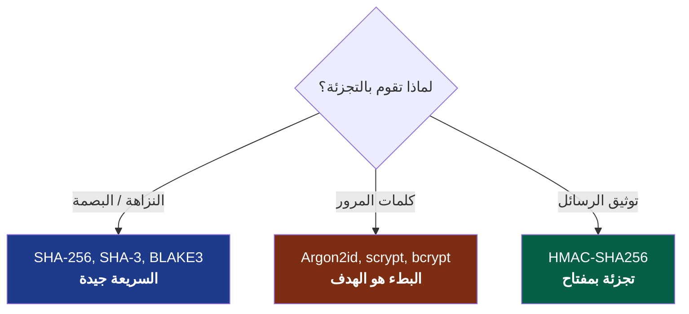
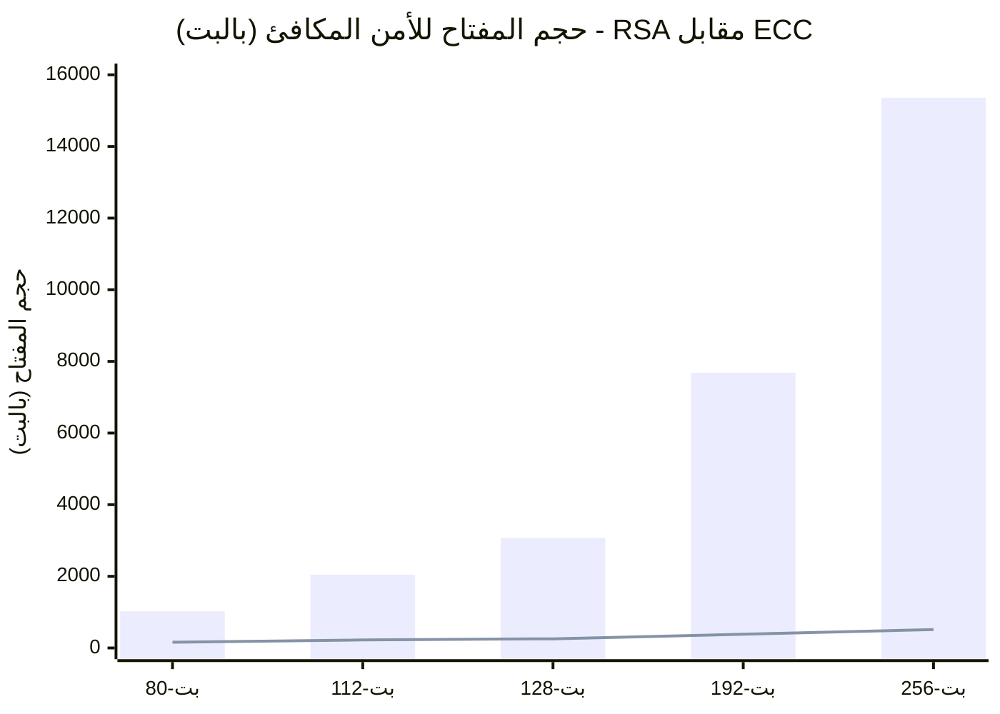
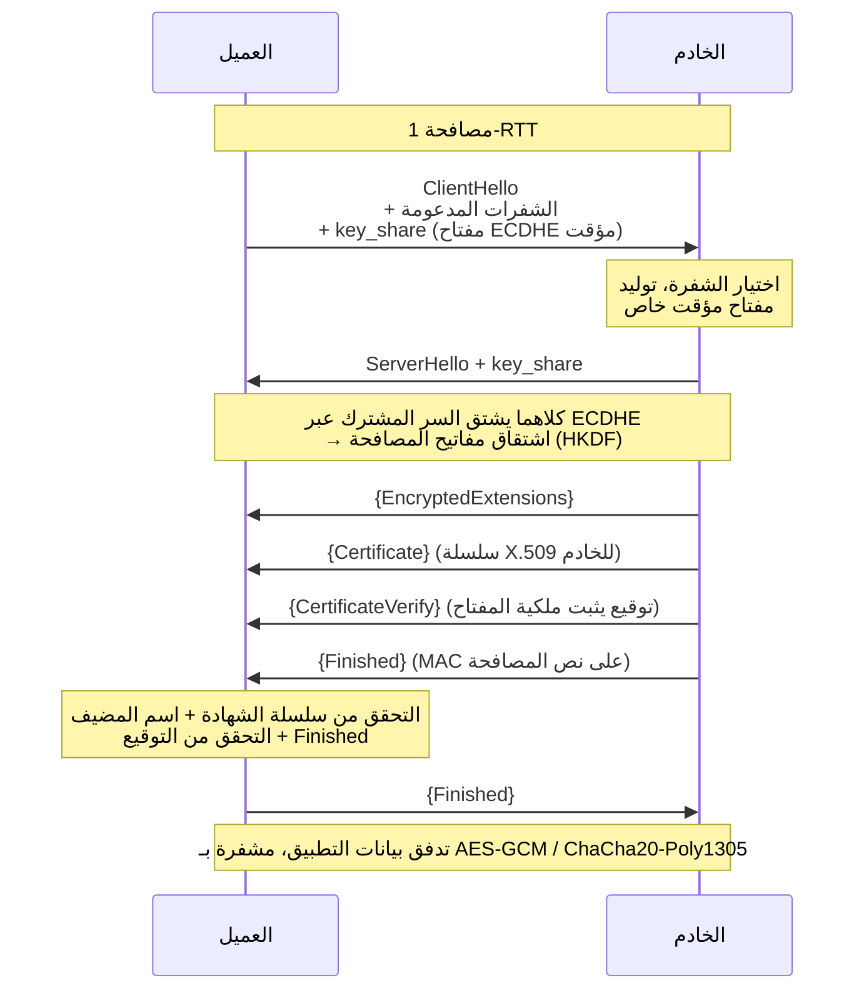
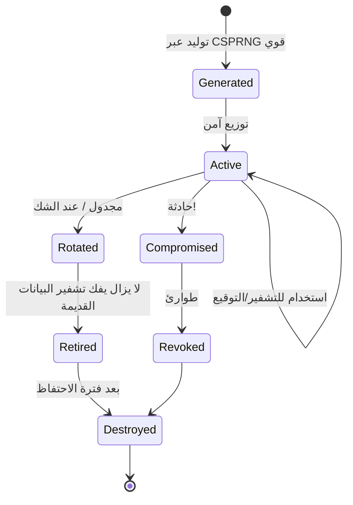
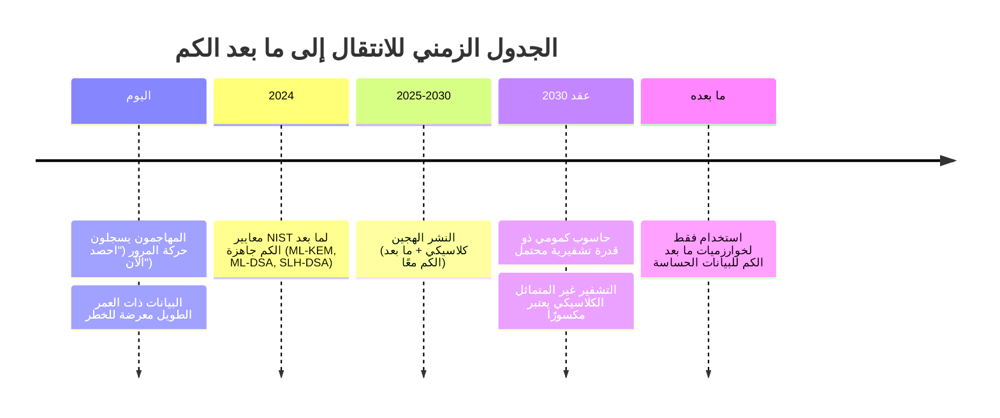
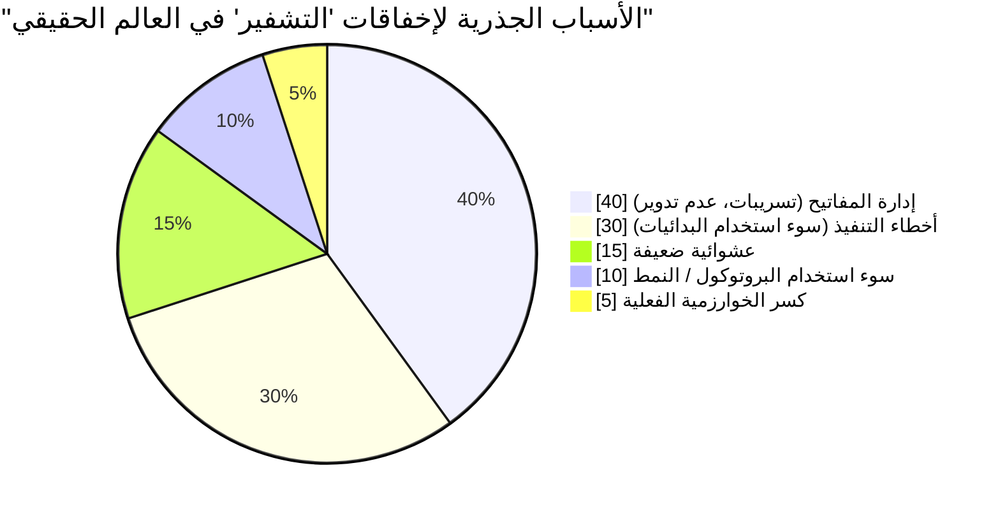

## الصندوق الذي استمررنا في إغلاقه

لقد اعتمدت هذه السلسلة مرتين حتى الآن على التشفير واكتفت بالإشارة إليه عابرًا. فالمجلد الأول (/posts/secure_systems_architecture/) نصح بـ "استخدام TLS". والمجلد الثاني (/posts/identity_and_access_in_depth/) ذكر أن "التوقيع مرتبط بالمصدر" و"استخدم التجزئة بـ Argon2id" ثم انتقل لغير ذلك. كل جملة من تلك الجمل كانت تخفي وراءها آلة معقدة وهشة في آن واحد.

هذا المجلد يفتح ذلك الصندوق.

الهدف ليس تحويلك إلى خبير في علم التعمية (Cryptographer)، فهذا المسار يتطلب سنوات من الرياضيات وخوفًا صحيًا من ذكائك الشخصي. الهدف هو جعلك **مهندس تشفير**: شخص يعرف أي بدائية (primitive) تحل أي مشكلة، ولماذا تعتبر الإعدادات الافتراضية الآمنة آمنة بالفعل، وقبل كل شيء، كيف تتعرف على اللحظة التي توشك فيها على ارتكاب خطأ كارثي.

:::important[الوصية الأولى]
**لا تبتكر نظام تشفير خاص بك. لا تقم ببناء البدائيات بنفسك.** لا الشفرة (cipher)، ولا النمط (mode)، ولا الحشو (padding)، ولا مولد الأرقام العشوائية. استخدم مكتبات عالية المستوى وموثوقة (مثل libsodium، أو Tink، أو مكتبات التشفير المدمجة في المنصة) التي تجعل الخيار الآمن هو الخيار *الافتراضي*. كل ما في هذا المجلد موجود لكي تفهم ما تفعله تلك المكتبات، لا لكي تعيد بناءها. كل فشل تشفيري كارثي في التاريخ بدأ بمهندس ظن أن هذه القاعدة لا تنطبق عليه. [^1]
:::

---

## الجزء الأول: الأهداف الثلاثة والبدائيات التي تخدمها

كل التشفير، من الناحية العملية، يخدم مزيجًا من ثلاثة أهداف:

```mermaid
mindmap
  root((أهداف التشفير))
    السرية
      "لا أحد سوى القارئ المقصود"
      الشفرات المتماثلة - AES, ChaCha20
      غير المتماثلة - RSA, ECC
    النزاهة + المصداقية
      "عدم التعديل، والتحقق من المصدر"
      MACs - HMAC
      التوقيعات - Ed25519, RSA-PSS
      AEAD يجمع بينهما
    توافر الثقة
      تبادل المفاتيح - ECDH
      البنية التحتية للمفاتيح العامة (PKI) - الشهادات
      السرية التامة (Forward secrecy)
```

هناك هدف رابع، **عدم الإنكار** (non-repudiation) (أي أنك لا تستطيع لاحقًا إنكار أنك قمت بالتوقيع)، وهذا ينتج تحديدًا عن التوقيعات الرقمية، وهو الخاصية الوحيدة التي *لا* يمكن للتشفير المتماثل تقديمها، لأن كلا الطرفين يتشاركان المفتاح، وبالتالي يمكن لأي منهما إنتاج وسم (tag) التوثيق.

### الفصل الأول: التشفير المتماثل - سريع، مشترك، ومقيد بنمط

يستخدم التشفير المتماثل **مفتاحًا مشتركًا واحدًا** لكل من التشفير وفك التشفير. إنه *سريع* (تشفير AES المدعوم بالأجهزة يعمل بسرعة جيجابايت في الثانية)، لكن لديه مشكلة صعبة واحدة: **كيف يحصل كلا الطرفين على نفس المفتاح دون أن يراه متلصص؟** (الفصل الثاني يجيب على ذلك).

الدقة التي تغرق المبتدئين تكمن في **أنماط التشغيل (modes of operation)**. فالتشفير بالكتل مثل AES يشفر كتلة ثابتة بحجم 16 بايت. ولتشفير أي شيء حقيقي، تقوم بربط الكتل ببعضها، ونمط الربط هو المكان الذي تتحدد فيه قوة الأمن أو ضعفه.

:::warning[بطريق ECB - لماذا يهم النمط]
النمط الساذج، **ECB (Electronic Codebook)**، يشفر كل كتلة بشكل مستقل. الكتل المتطابقة في النص الأصلي تنتج كتلًا متطابقة في النص المشفر. إذا قمت بتشفير صورة نقطية لبطريق لينكس بنمط ECB، فستظل *ترى البطريق* في النص المشفر، حيث تتسرب الملامح مباشرة. يدمر نمط ECB السرية في أي بيانات ذات بنية منظمة. إذا رأيت `AES/ECB` في أي كود، تعامل معه كخطأ برمجي (Bug). [^2]
:::

الحل الحديث هو **AEAD (التشفير الموثق مع بيانات مرتبطة)**، والذي يدمج السرية *والنزاهة* في بدائية واحدة بحيث لا يمكنك الحصول على إحداهما دون الأخرى:

```mermaid
graph LR
    PT[نص أصلي] --> ENC
    K[مفتاح] --> ENC
    N[الرقم العشوائي (Nonce) - فريد!] --> ENC
    AD[بيانات مرتبطة<br/>ترويسات، غير مشفرة] --> ENC
    ENC["تشفير AEAD<br/>(AES-GCM / ChaCha20-Poly1305)"] --> CT[نص مشفر]
    ENC --> TAG["وسم التوثيق<br/>(يكتشف التلاعب)"]
    style ENC fill:#065f46,color:#fff
    style N fill:#7c2d12,color:#fff
```

شفرتا AEAD اللتان يجب أن تعتمد عليهما:

| الشفرة | نقاط القوة | احذر من |
| --- | --- | --- |
| **AES-256-GCM** | تسريع عتادي في كل مكان (AES-NI)، واسع الانتشار | **إعادة استخدام Nonce كارثية**، تكرار رقم تحت نفس المفتاح يسرب مفتاح التوثيق والنص الأصلي XOR |
| **ChaCha20-Poly1305** | سريع في *البرمجيات* (ممتاز للهواتف/إنترنت الأشياء بدون AES-NI)، مصمم ليكون ثابت الزمن | نفس متطلب فرادة الـ Nonce |

:::caution[الـ Nonce ليس سراً، لكن يجب أن يكون فريداً]
الـ **Nonce** (رقم يُستخدم مرة واحدة) لا يحتاج إلى أن يكون سريًا، فهو يُرسل بوضوح. لكن تحت مفتاح معين يجب **ألا يتكرر أبدًا**. مع الـ Nonce العشوائي بطول 96 بت في GCM، تصبح تصادمات "عيد الميلاد" خطرًا حقيقيًا بعد حوالي $2^{32}$ رسالة تحت مفتاح واحد. الأنماط الآمنة: استخدم *عدادًا* (counter) للـ Nonce (مضمون الفرادة)، قم بتدوير المفاتيح قبل الوصول للحد، أو استخدم نمطًا مقاومًا لسوء استخدام Nonce مثل **AES-GCM-SIV**. [^3]
:::

### الفصل الثاني: التجزئة (Hashing) - طريق ذو اتجاه واحد

دالة التجزئة التشفيرية تقوم بتحويل مدخلات عشوائية إلى ملخص (digest) ثابت الحجم بحيث يكون من غير الممكن عمليًا (أ) عكس العملية، (ب) إيجاد مدخلين لهما نفس الملخص (**مقاومة التصادم**)، أو (ج) إيجاد مدخل يطابق ملخصًا معينًا (**مقاومة المعكوس**).

هناك ثلاثة استخدامات يخلط الناس بينها باستمرار، وهي تتطلب دوالًا *مختلفة*:



بيت القصيد هنا هو: **لنزاهة الملفات تريد أسرع دالة تجزئة آمنة؛ لكلمات المرور تريد الأبطأ.** استخدام SHA-256 لكلمات المرور هو ثغرة (حيث يمكن لوحدة معالجة الرسومات كسر المليارات في الثانية)؛ واستخدام Argon2id للتحقق من ملف هو بطء لا طائل منه. نفس المصطلح "تجزئة"، متطلبات متضادة.

تضيف دوال **MAC** مفتاحًا بحيث لا يمكن لأحد غير من يمتلك السر إنتاج أو التحقق من الوسم، هذا يعني النزاهة *و* المصداقية. استخدم **HMAC** وقم دائمًا بمقارنة الوسوم باستخدام **مقارنة ثابتة الزمن (constant-time comparison)**، لأن أي `==` تعتمد على الخروج المبكر تسرب معلومات زمنية يمكن للمهاجم استخدامها لتزوير الوسوم بايتًا تلو الآخر.

$$
\text{HMAC}(K, m) = H\big((K \oplus opad)\,\|\,H((K \oplus ipad)\,\|\,m)\big)
$$

هيكل التجزئة المزدوج ليس للزينة، بل يحمي من **هجمات تمديد الطول (length-extension attacks)** التي قد تسمح للمهاجم بإضافة بيانات إلى بنية `H(K \| m)` الساذجة.

### الفصل الثالث: التشفير غير المتماثل - حل مشكلة تبادل المفاتيح

يستخدم التشفير غير المتماثل (المفتاح العام) **زوج مفاتيح**: مفتاح عام تشاركه بحرية ومفتاح خاص تحميه بحياتك. يمكن لأي شخص التشفير بمفتاحك العام؛ ووحدك من يفك التشفير بمفتاحك الخاص. أو: توقع بمفتاحك الخاص؛ ويتحقق الجميع بمفتاحك العام.

* **RSA** - الكلاسيكي. يعتمد أمنه على صعوبة تحليل الأعداد الصحيحة الكبيرة. يعتبر الآن *ضخمًا وبطيئًا*، مفاتيح 3072-بت توفر أمن 128-بت. جيد، لكنه ثقيل.
* **تشفير المنحنيات الإهليلجية (ECC)** - يوفر نفس الأمن بمفاتيح أصغر بكثير، لأنه يعتمد على معضلة اللوغاريتم المتقطع في المنحنيات الإهليلجية. **مفتاح ECC بحجم 256-بت ≈ مفتاح RSA بحجم 3072-بت**.



الفجوة بين الأعمدة (RSA) والخط (ECC) عند مستويات الأمن العالية هي السبب في أن البروتوكولات الحديثة تعتمد افتراضيًا على المنحنيات الإهليلجية: **Ed25519** للتوقيعات، **X25519** لتبادل المفاتيح، وكلاهما سريع، صغير، ومصمم ليكون من الصعب إساءة استخدامه [^4].

:::note[التشفير غير المتماثل نادراً ما يشفر بياناتك مباشرة]
عمليات المفتاح العام بطيئة ومحدودة الحجم. من الناحية العملية، لا تقوم أبدًا بتشفير ملف باستخدام RSA. أنت تستخدم التشفير غير المتماثل **لتبادل أو تغليف مفتاح متماثل**، ثم تشفر البيانات الضخمة بمفتاح متماثل باستخدام AEAD سريع. هذا يسمى **التشفير الهجين (hybrid encryption)**، وهو ما تقوم به فعليًا بروتوكولات TLS وPGP وage وكل نظام عاقل.
:::

---

## الجزء الثاني: تبادل المفاتيح ومصافحة TLS 1.3

يمكننا الآن الإجابة على السؤال الذي عجز عنه التشفير المتماثل: كيف يتفق غريبان على سر مشترك عبر قناة يراقبها مهاجم؟

### الفصل الرابع: ديفي-هيلمان والسرية التامة (Forward Secrecy)

**ديفي-هيلمان (DH)** هو الخدعة الجميلة في قلب العملية. يخلط كلا الطرفين سرهما الخاص بقيمة الطرف الآخر العامة، وبفضل الجبر، يصلا إلى *نفس* السر المشترك، بينما لا يستطيع متلصص رأى القيمتين العامتين حساب ذلك السر.

الخاصية القاتلة هي **السرية التامة (Perfect Forward Secrecy)**. إذا استخدمت كل جلسة زوج مفاتيح DH *مؤقت* (ECDHE، حيث حرف E يعني مؤقت) يتم التخلص منه بعد الجلسة، فحتى لو سجل مهاجم كل حركاتك المشفرة اليوم *وسرق مفتاحك الخاص طويل الأمد في العام القادم*، فلا يزال غير قادر على فك تشفير الجلسات المسجلة. مفاتيح الجلسة ماتت بموت الجلسات.

:::important[لماذا أصبحت السرية التامة غير قابلة للتفاوض]
"سجل الآن، فك التشفير لاحقًا" هي استراتيجية حقيقية يتبناها المهاجمون، خاصة مع اقتراب الحواسيب الكمومية (الفصل 7). السرية التامة تعني أن النص المشفر الذي تم التقاطه اليوم لا يصبح عبئًا في اليوم الذي يتسرب فيه مفتاح خادمك. بروتوكول TLS 1.3 يجعل سرية ECDHE **إجبارية**، وتمت إزالة تبادل مفاتيح RSA الثابت القديم (الذي لا يوفر سرية تامة) تمامًا. [^5]
:::

### الفصل الخامس: مصافحة TLS 1.3، بجدية

إليك المصافحة التي كنا ننصح بـ "استخدام TLS" لأجلها. لقد قلص TLS 1.3 الرحلات ذهابًا وإيابًا من اثنتين إلى واحدة وألغى كل خيار غير آمن [^5]:



كل خطوة تكتسب مكانتها:

* **`key_share` في الرسالة الأولى** - العميل *يخمن* المجموعة ويرسل مفتاحه المؤقت فورًا، وهذا هو سر سرعة TLS 1.3.
* **`Certificate` + `CertificateVerify`** - الشهادة تربط هوية الخادم بمفتاح عام (عبر سلسلة PKI من المجلد الثاني)؛ و*التوقيع* يثبت أن الخادم يمتلك فعليًا المفتاح الخاص المطابق. الشهادة المسروقة بدون المفتاح الخاص عديمة الفائدة.
* **`Finished`** - وسم MAC على كامل نص المصافحة. إذا تلاعب رجل في المنتصف بأي رسالة سابقة (مثلاً، هجوم خفض مستوى لفرض شفرات ضعيفة)، فلن تتطابق النصوص وستفشل المصافحة.

:::tip[ما حذفه TLS 1.3 لا يقل أهمية عما أبقاه]
أزال TLS 1.3 تبادل مفاتيح RSA، وDH الثابت، وشفرات نمط CBC، وRC4، وMD5، وSHA-1، والضغط (وداعًا لثغرات CRIME/BREACH)، وإعادة التفاوض. فلسفة التصميم هي: **عدد أقل من الأزرار يعني طرقًا أقل لتهيئة نفسك بشكل خاطئ يؤدي لخرق أمني.** بروتوكول لا يحتوي على خيارات غير آمنة لا يمكن إقناعه باستخدام أحدها. عطل TLS 1.0/1.1 في كل مكان؛ فضل 1.3، واسمح بـ 1.2 فقط للعملاء القدامى.
:::

---

## الجزء الثالث: إدارة المفاتيح - حيث تلتقي النظرية بالواقع

السر القذر للتشفير التطبيقي: **الخوارزميات هي أندر نقطة ضعف. إدارة المفاتيح هي العلة.** لم يتم كسر AES-256 قط. لكن المفاتيح تُرتكب في مستودعات git، وتُسجل في ملفات log، وتُرسل عبر البريد الإلكتروني، وتُرمّز داخل الكود، ولا يتم تدويرها أبدًا. دورة الحياة هي الانضباط المطلوب:



الممارسات الأساسية:

::::steps

:::step[التوليد من مصدر عشوائي قوي]{subtitle="الميلاد"}
يجب أن تأتي المفاتيح من مصدر عشوائي **آمن تشفيريًا** (`/dev/urandom`، `getrandom()`، أو مكتبة النظام). لا تستخدم `Math.random()` أبدًا، ولا وقت النظام، ولا مولدات عشوائية "ذكية". العشوائية القابلة للتنبؤ هي السبب الجذري الأكثر شيوعًا لكسر التشفير "الذي لا يُكسر".
:::

:::step[التخزين في KMS أو HSM]{subtitle="الوصاية"}
يقوم **وحدة أمن الأجهزة (HSM)** أو **KMS** السحابي بتخزين المفتاح بحيث *لا يغادر* الحدود أبدًا كنص صريح، بل ترسل البيانات *إليه* للتوقيع أو فك التشفير. هذا يعني أن المهاجم الذي يسيطر على خادم تطبيقك لا يزال غير قادر على استخراج المفتاح الخام.
:::

:::step[استخدام تشفير الغلاف (Envelope Encryption) للتوسع]{subtitle="الهيكلة"}
شفر البيانات باستخدام **مفتاح تشفير بيانات (DEK)** لكل كائن؛ ثم شفر كل DEK باستخدام **مفتاح تشفير مفاتيح (KEK)** مركزي محفوظ في KMS. للتدوير، تقوم بإعادة تشفير الـ DEKs الصغيرة فقط، لا بيتابايتات من البيانات. هكذا تفعل جميع الشركات السحابية الكبرى التشفير أثناء التخزين.
:::

:::step[التدوير، والقدرة على التدوير *بسرعة*]{subtitle="الصيانة"}
يجب أن يكون التدوير مؤتمتًا وغير معطل للخدمة، مع وسم النص المشفر بمعرف مفتاح بحيث تتعايش المفاتيح القديمة والجديدة أثناء الانتقال. المؤسسة التي تستطيع تدوير مفتاح في دقائق تنجو من التسريب؛ أما التي تحتاج لأسبوع من العمل فهي رهينة لهيكلتها الخاصة.
:::

::::

:::warning[إخفاقات العشوائية التي صنع التاريخ]
OpenSSL في Debian عام 2008: تصحيح حسن النية عطل مصدر العشوائية، مما قلص مساحة المفاتيح إلى ~32,767 احتمال، وأصبحت كل مفاتيح SSH وTLS المولدة لمدة عامين قابلة للتخمين. عام 2010: أعادت سوني في جهاز PS3 استخدام Nonce ثابت في توقيعات ECDSA، مما سرب مفتاح التوقيع الرئيسي. النمط أبدي: **التشفير يفشل عند العشوائية وإعادة الاستخدام، لا عند الشفرة.** [^6]
:::

---

## الجزء الرابع: أفق الكم

كل بدائية غير متماثلة في هذا المجلد، من RSA إلى ECC إلى ديفي-هيلمان، تعتمد على معضلة رياضية (التحليل إلى عوامل أولية، اللوغاريتم المتقطع) يمكن لـ **حاسوب كمومي** كبير بما يكفي يشغل **خوارزمية شور (Shor's algorithm)** حلها بكفاءة. ذلك الجهاز غير موجود بعد. لكن التهديد، مع ذلك، موجود بالفعل.

### الفصل السابع: الحصاد الآن، فك التشفير لاحقًا



الانقسام غير المتماثل في التهديد الكمومي:

* **التشفير غير المتماثل (RSA, ECC, DH)** - *مكسور* بخوارزمية شور. هذه هي حالة الطوارئ.
* **التشفير المتماثل (AES) ودوال التجزئة (SHA-2/3)** - *أُضعفت* فقط بخوارزمية غروفر (Grover's algorithm)، التي تقلل مستوى الأمن للنصف. الحل بسيط: استخدم **AES-256** (الذي يحتفظ بأمن 128-بت بعد الكم) وتجزئة 384-بت فما فوق. التشفير المتماثل بخير أساسًا.

في عام 2024، أصدرت NIST أول معايير لخوارزميات ما بعد الكم [^7]:

* **ML-KEM** (Kyber) - لتغليف المفاتيح، بديل لتبادل مفاتيح ECDH.
* **ML-DSA** (Dilithium) و **SLH-DSA** (SPHINCS+) - للتوقيعات الرقمية.

:::note[الخطوة العملية اليوم: الهجين]
لا أحد ينتقل إلى خوارزميات ما بعد الكم فقط بين عشية وضحاها، فالخوارزميات الجديدة أصغر سنًا ولم تُختبر بما يكفي. الحل الصناعي هو **تبادل المفاتيح الهجين**: استخدم X25519 الكلاسيكي *و* ML-KEM معًا، وادمج السرين المشتركين، بحيث تظل الجلسة آمنة ما لم يتم كسر *كليهما*. جوجل، كلاود فلير، وآخرون ينشرون بالفعل X25519+ML-KEM افتراضيًا. إذا كنت توفر تشفيرًا لبيانات ذات عمر سري يتجاوز العقد، اسأل موردي تقنيتك عن خارطة طريقهم لما بعد الكم **الآن**. [^8]
:::

---

## الجزء الخامس: قاعة العار - كيف يكسر المهندسون التشفير الجيد

الخوارزميات سليمة. إليك كيف تموت الأنظمة الحقيقية على أي حال، دليل ميداني للأخطاء التي ستتسبب بها أو تجدها في مراجعات الكود:

| نمط مضاد | لماذا يقتلك | الحل |
| --- | --- | --- |
| **ابتكار تشفيرك الخاص** | ستخطئ في تفصيل دقيق؛ ولن يغفل المهاجمون عنه | استخدم libsodium / Tink / مكتبات المنصة |
| **نمط ECB** | يسرب بنية النص (مثل البطريق) | AEAD: AES-GCM / ChaCha20-Poly1305 |
| **إعادة استخدام Nonce** | تسريب كارثي للمفتاح أو النص تحت GCM | عدادات Nonce، أو AES-GCM-SIV |
| **عشوائية ضعيفة** | مفاتيح قابلة للتنبؤ = لا مفاتيح على الإطلاق | CSPRNG فقط، لا `Math.random()` |
| **SHA-256 لكلمات المرور** | GPU تكسر المليارات/ثانية | Argon2id / scrypt / bcrypt |
| **`==` لمقارنة MAC/الوسوم** | قنوات زمنية جانبية لتزوير الوسوم | مقارنة ثابتة الزمن |
| **عدم التحقق من الشهادات** | `verify=False` تفتح باب الرجل في المنتصف | تحقق من السلسلة + الاسم + الصلاحية |
| **غياب السرية التامة** | تسريب مفتاح واحد يفك تشفير كل التاريخ | ECDHE المؤقت (TLS 1.3) |
| **تشفير بدون توثيق** | هجمات الحشو (padding-oracle) وقلب البت | AEAD، أو تشفير-ثم-MAC |



اقرأ ذلك الرسم البياني مرة أخرى. **كسر الخوارزميات الفعلية هو الشريحة الأصغر.** خمسة وتسعون بالمائة من "إخفاقات التشفير" هي إخفاقات هندسية، سوء تعامل مع المفاتيح، سوء استخدام، عشوائية، وكلها تقع بحزم تحت *سيطرتك* وتغطيها التخصصات في هذا المجلد.

:::important[الخلاصة]
التشفير الجيد ليس في معرفة الرياضيات. بل هو في **احترام الحدود** التي تفرضها الرياضيات: Nonce فريد، مفاتيح سرية، عشوائية حقيقية، نص مشفر موثق، شهادات محققة، سرية تامة، تدوير المفاتيح. اضبط تلك الحدود باستخدام مكتبات موثوقة وستحصل على القوة الكاملة للبدائيات التي أمضى أناس أذكى منك عقودًا في تقويتها. تجاوز حدًا واحدًا، ولن تنقذك أي خوارزمية.
:::

---

## الخاتمة والطريق إلى الأمام

لقد بنينا الآن الثقة بدءًا من البدائيات: الشفرات التي تحفظ الأسرار، والتوقيعات التي تثبت الهوية، والمصافحة التي تربط كل ذلك عبر سلك عدائي، ودورة حياة المفاتيح التي تبقي الأمور نزيهة، واليقظة الكمومية التي تلقي بظلالها بالفعل.

لكن التشفير، والهوية، وجدران الشبكة كلها ضوابط *وقائية*. إنها تفترض أنك تستطيع منع المهاجم من الدخول. **المجلد الرابع** يقبل الفرضية المعاكسة، التي يستوعبها كل مدافع متمرس: *افترض الاختراق.* سننتقل إلى الواقع التشغيلي للفريق الأزرق، هندسة الكشف، إطار عمل MITRE ATT&CK، صيد التهديدات، خطوط أنابيب SIEM/SOAR، وكتيبات الاستجابة للحوادث والتحقيق الجنائي التي تنفذها عندما تفشل الوقاية، وليس إذا فشلت.

الوقاية وعد لا يمكنك الوفاء به بالكامل. الكشف هو كيف تنجو من كسر ذلك الوعد.

---

## المراجع

[^1]: [Latacora - Cryptographic Right Answers](https://www.latacora.com/blog/2018/04/03/cryptographic-right-answers/)
[^2]: [Filippo Valsorda / Wikipedia - Block cipher mode of operation (ECB penguin)](https://en.wikipedia.org/wiki/Block_cipher_mode_of_operation#Electronic_codebook_(ECB))
[^3]: [IETF - RFC 8452: AES-GCM-SIV Nonce Misuse-Resistant AEAD](https://datatracker.ietf.org/doc/html/rfc8452)
[^4]: [Bernstein, D. J. et al. - Ed25519 & Curve25519](https://ed25519.cr.yp.to/)
[^5]: [IETF - RFC 8446: The Transport Layer Security (TLS) Protocol Version 1.3](https://datatracker.ietf.org/doc/html/rfc8446)
[^6]: [Debian - DSA-1571-1 openssl predictable random number generator](https://www.debian.org/security/2008/dsa-1571)
[^7]: [NIST (2024) - Post-Quantum Cryptography Standards (FIPS 203/204/205)](https://csrc.nist.gov/projects/post-quantum-cryptography)
[^8]: [Cloudflare - The state of the post-quantum Internet](https://blog.cloudflare.com/pq-2024/)