## الفرضية التي تغير كل شيء

كانت المجلدات الثلاثة الأولى، في جوهرها، متفائلة. [المجلد الأول](/posts/secure_systems_architecture/) قام ببناء الجدران. [المجلد الثاني](/posts/identity_and_access_in_depth/) وضع حارساً عند كل باب. [المجلد الثالث](/posts/cryptography_engineering_in_depth/) جعل الرسائل بينها غير قابلة للتزوير. كل ذلك كان *وقائياً*، وكل ذلك كان قائماً على فرضية إبقاء المهاجم في الخارج.

يبدأ هذا المجلد من حيث ينتهي ذلك التفاؤل، مع الجملة التي وشمتها كل روح دفاعية خبيرة في أعماقها:

> **افترض الاختراق (Assume breach).** بالنظر إلى ما يكفي من الوقت، والميزانية، والدافع، سيتمكن المهاجم المصمم من الدخول. السؤال ليس *ما إذا* كنت ستتعرض للاختراق، بل *مدى سرعة ملاحظتك لذلك، ومدى جودة استجابتك.*

تقيس الصناعة هذا برقمين قاسيين: **MTTD** (متوسط الوقت للكشف) و **MTTR** (متوسط الوقت للاستجابة). لا يزال متوسط وقت بقاء المهاجم في الشبكة (dwell time) في عام 2024، منذ الاختراق الأولي وحتى الكشف عنه، يُقاس بـ *أيام إلى أسابيع*. خلال تلك النافذة، يتحرك المهاجم جانبياً، ويصعد صلاحياته، ويسرب البيانات. هذا المجلد يدور حول تقليص تلك النافذة.

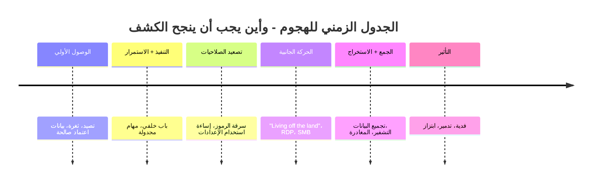

كل ساعة توفرها من وقت الكشف هي ساعة من ذلك الجدول الزمني لا يحصل عليها المهاجم. مرحباً بك في الفريق الأزرق (Blue Team).

---

## الجزء الأول: القياس عن بُعد (Telemetry) - لا يمكنك كشف ما لا يمكنك رؤيته

الكشف هو مشكلة بيانات قبل أن يكون مشكلة تحليلات ذكية. إذا لم يتم جمع الأدلة مطلقاً، فلن تتمكن أي خوارزمية من استعادتها. لذا فإن المهمة الأولى للفريق الأزرق هي **الرؤية**: تجهيز البنية التحتية لإصدار الإشارات الصحيحة.

### الفصل الأول: مصادر الحقيقة

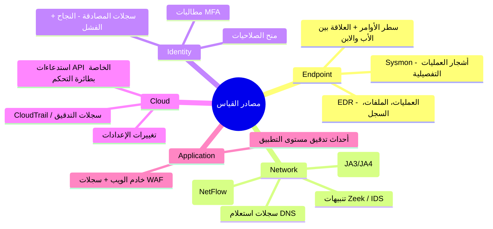

**رؤية المدافع:** ليست كل السجلات متساوية. القيمة الأكبر للبيانات هي تلك التي تلتقط *السلوك*، خاصة **أسطر أوامر العمليات مع تتبع علاقة الأب والابن** (Sysmon Event ID 1) و **أحداث المصادقة**. سجل جدار الحماية يخبرك بحدوث اتصال؛ شجرة العمليات تخبرك أن `winword.exe` قام بتشغيل `powershell.exe` الذي قام بتشغيل `cmd.exe` لتنفيذ أمر مشفر، وهي قصة، والقصة هي الكشف.

:::important[التسجيل هو مشكلة تغطية - قم برسمها]
الفشل الكلاسيكي هو *الفجوات الصامتة*: أنت تسجل 80% من أصولك والاختراق يقع في الـ 20% المتبقية. حافظ على **مصفوفة تغطية التسجيل**، (المصدر × نوع البيانات × مدة الاحتفاظ)، وتعامل مع أي فجوة على أنها ثغرة أمنية. قاعدة الكشف عديمة الفائدة إذا لم يتم استيعاب البيانات التي تحتاجها. قم بتدقيق تغطيتك بالطريقة التي تدقق بها مستويات التحديثات الأمنية.
:::

### الفصل الثاني: خط أنابيب SIEM

نظام **SIEM** (إدارة معلومات وأحداث الأمان) هو عقل التجميع: حيث يستوعب كل ما سبق، ويوحده وفق مخطط مشترك، ويربط بين المصادر، ويطلق التنبيهات. خط الأنابيب الحديث:

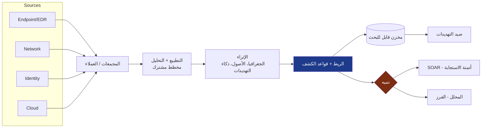

تعتبر خطوة **الإثراء (Enrichment)** هي الأكثر قيمة بصمت: عنوان IP هو مجرد ضوضاء حتى تعرف أنه عقدة خروج Tor، وأن الأصل هو وحدة تحكم النطاق (Domain Controller)، وأن المستخدم عادةً ما يسجل دخوله من قارة أخرى. الإثراء يحول البيانات إلى *سياق*، والسياق هو ما يجعل التنبيه قابلاً للتنفيذ بدلاً من تجاهله.

---

## الجزء الثاني: هندسة الكشف

شراء نظام SIEM لا يمنحك عمليات كشف أكثر مما يمنحك شراء بيانو موهبة العزف. **هندسة الكشف** هي تخصص كتابة واختبار وصيانة القواعد التي تحول القياسات إلى تنبيهات، والتعامل مع عمليات الكشف كأنها كود برمجي.

### الفصل الثالث: MITRE ATT&CK - اللغة المشتركة

**MITRE ATT&CK** هو الخريطة المشتركة للمجال: مصفوفة من **تكتيكات** المهاجم (الـ *لماذا*، مثل: الاستمرار، الحركة الجانبية) و **التقنيات** (الـ *كيف*، مثل: T1053 المهام المجدولة) التي تمت ملاحظتها في الاختراقات الحقيقية [^1]. إنه حجر رشيد الذي يسمح للفريق الأحمر، والفريق الأزرق، وذكاء التهديدات بالتحدث بنفس اللغة.

الحركة القوية للمدافع هي **رسم خرائط التغطية**، من خلال وضع قواعد الكشف الخاصة بك فوق المصفوفة لكشف النقاط العمياء:

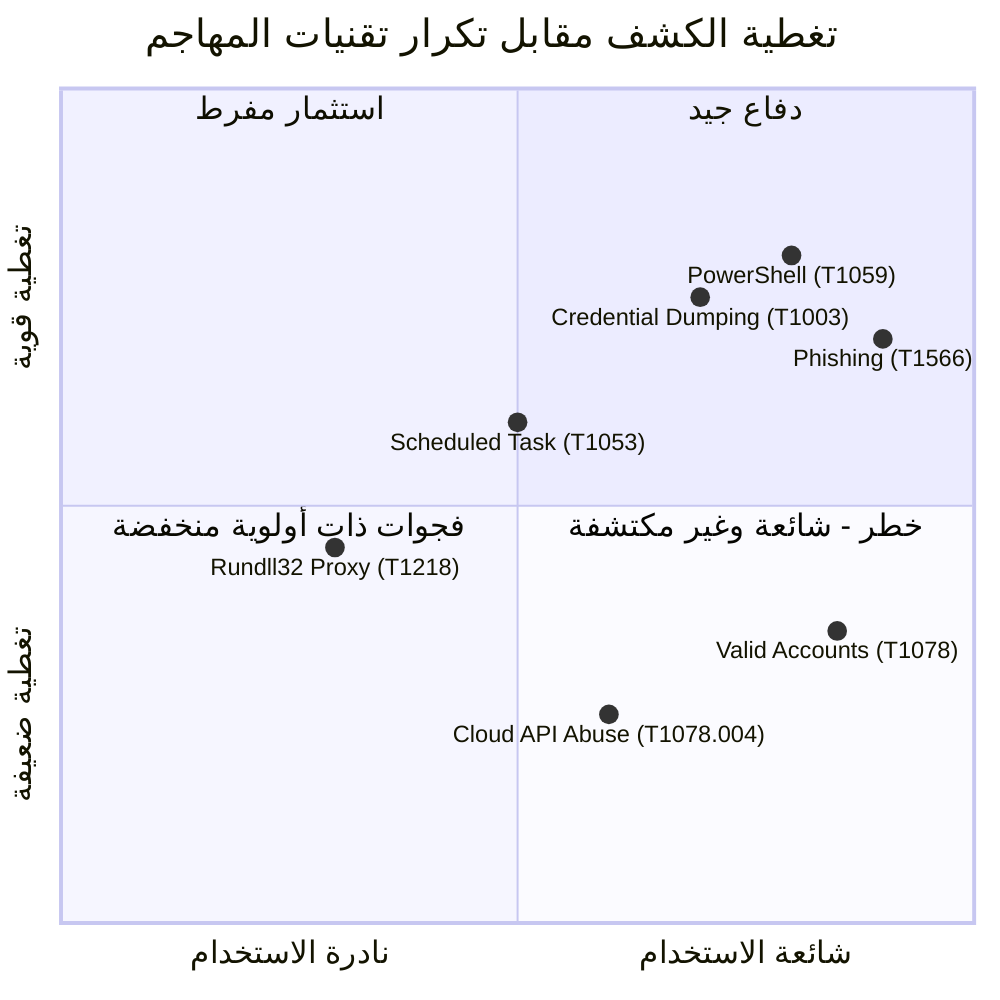

الربع الرابع، **التقنيات الشائعة ذات التغطية الضعيفة**، هو قائمة مهامك ذات الأولوية. هكذا يخصص الفريق الأزرق الصغير جهداً محدوداً: دافع عما يفعله المهاجمون بالفعل ولا تزال لا تكتشفه، قبل ملاحقة التقنيات الغريبة التي لا يستخدمها أحد ضدك.

### الفصل الرابع: هرم الألم (Pyramid of Pain)

ليست كل عمليات الكشف متساوية في *مدى إيلامها للمهاجم*. يصنف هرم الألم لديفيد بيانكو مؤشرات الهجوم بناءً على مدى تكلفة تغييرها بالنسبة للمهاجم بمجرد أن تبدأ في كشفها [^2]:

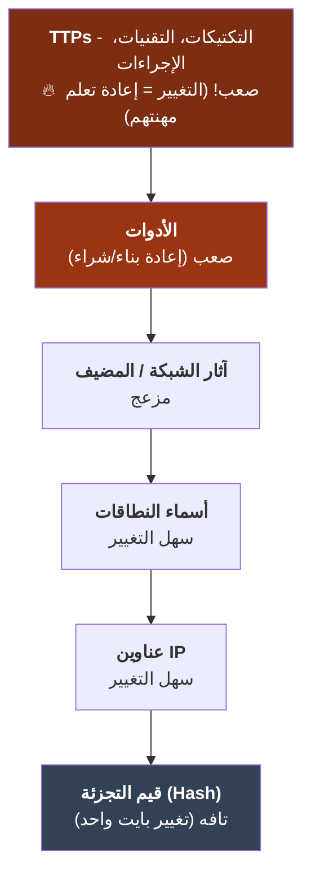

الدرس يعيد تشكيل الاستراتيجية. حظر **تجزئة (Hash)** ملف يبدو مُرضياً، لكن المهاجم يعيد تجميعه ويهزمه في ثوانٍ. اكتشاف **سلوك**، مثل "أي تطبيق Office يشغل محرك برمجي يتصل بالإنترنت"، يجبر المهاجم على التخلي عن *تقنية* كاملة. **اكتشف بناءً على السلوك، وليس فقط على المؤشرات.** كلما ارتفعت في الهرم، زادت تكلفة التهرب على المهاجم.

:::tip[الكشف ككود برمجي]
تعامل مع عمليات الكشف مثل البرمجيات: اكتبها بتنسيق محمول (قواعد **Sigma**)، خزنها في **git**، راجعها برمجياً، واختبرها ضد عينات معروفة بكونها ضارة، والأهم من ذلك، ضد النشاط الحميد لقياس التنبيهات الكاذبة. قاعدة كشف بنسبة 40% من التنبيهات الكاذبة أسوأ من عدم وجود كشف، فهي تدرب المحللين على النقر على "تجاهل". قم بترقيم النسخ، والاختبار، وإلغاء القواعد بالطريقة التي تتبعها مع أي كود إنتاجي. [^3]
:::

### الفصل الخامس: حرب الإشارة مقابل الضوضاء

التوتر الأبدي للكشف هو المقايضة بين التقاط الهجمات الحقيقية (الإيجابيات الحقيقية) وإغراق المحللين في الإنذارات الكاذبة:

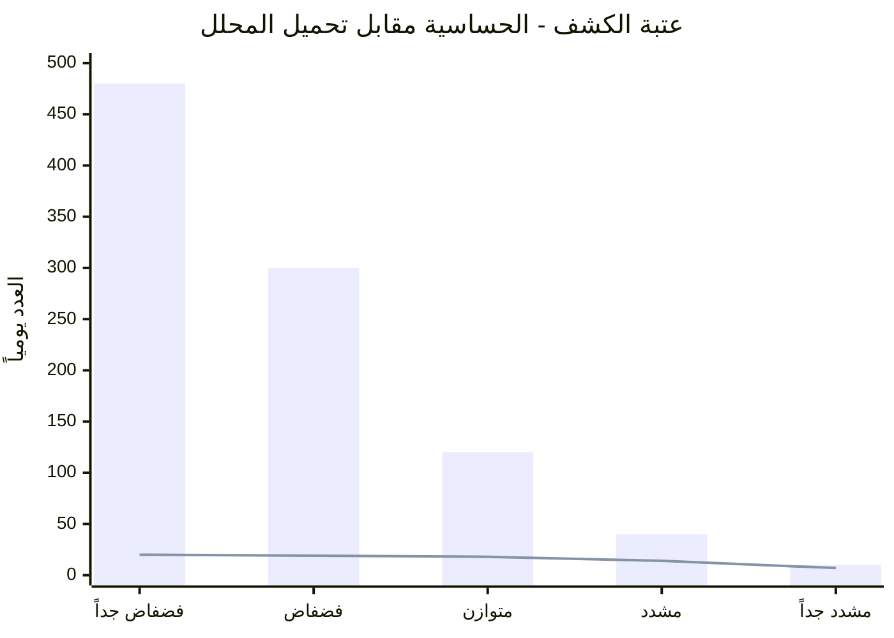

الأعمدة هي إجمالي التنبيهات؛ الخط هو الإيجابيات *الحقيقية*. إذا ضبطت النظام بفضفاضية شديدة (يساراً)، سيقوم المحللون بفرز 480 تنبيهاً للعثور على 20 منها فقط، مما يؤدي لاحتراقهم الوظيفي. إذا ضبطت النظام بتشدد (يميناً)، ستفوت الهجمات الحقيقية. **إجهاد التنبيهات هو فشل في الضبط الأمني**، وليس مجرد مشكلة موارد بشرية. الهدف ليس الحد الأقصى من التنبيهات؛ بل الحد الأقصى من *الإيجابيات الحقيقية لكل ساعة عمل للمحلل*، ولهذا السبب يوجد نظام SOAR (التالي).

---

## الجزء الثالث: مركز عمليات الأمان (SOC) - الاستجابة بسرعة الآلة

### الفصل السادس: العمليات الطبقية و SOAR

**مركز عمليات الأمان (SOC)** هو الفريق والعملية التي تعيش داخل تدفق التنبيهات. الهيكل الكلاسيكي، وأتمتته الحديثة:

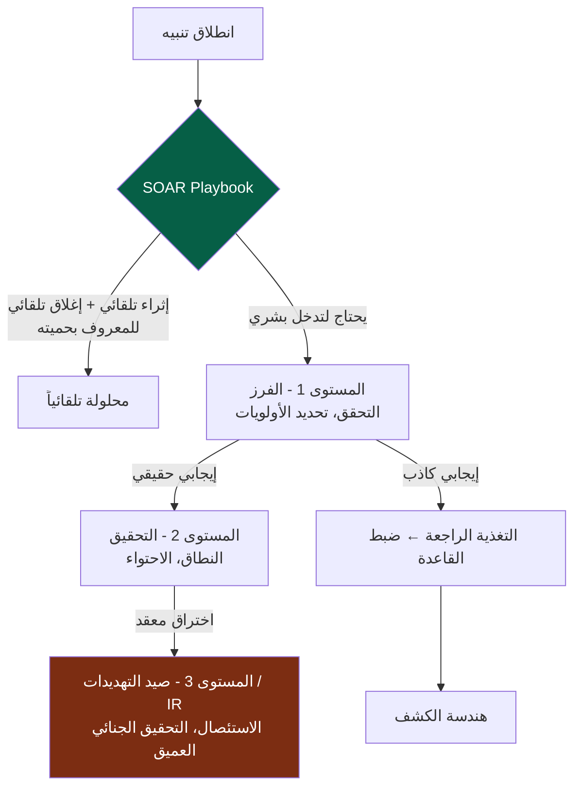

**SOAR** (التنسيق والأتمتة والاستجابة الأمنية) هو مضاعف القوة. يقوم بتشغيل *Playbooks*، وهي تسلسلات آلية تثري التنبيه، وتجمع السياق، بل وتتخذ إجراءات احتواء (عزل مضيف، تعطيل حساب، حظر IP) دون انتظار تدخل بشري. خط أنابيب SOAR المصمم جيداً يحل تلقائياً معظم الضوضاء منخفضة الجودة بحيث يقضي البشر وقتهم حيث يكون للحكم البشري قيمة حقيقية.

:::note[حلقة التغذية الراجعة هي الهدف الأساسي]
لاحظ السهم من المستوى 1 عائداً إلى هندسة الكشف. مركز SOC الناضج هو *نظام تعليمي*: كل إنذار كاذب يضبط قاعدة، وكل كشف ضائع (يتم العثور عليه لاحقاً) يصبح قاعدة جديدة. مركز SOC الذي يتفاعل فقط مع التنبيهات دون تغذية الدروس مرة أخرى إلى عمليات الكشف الخاصة به، يركض في مكانه.
:::

### الفصل السابع: صيد التهديدات - افترض أنهم في الداخل بالفعل

الكشف ينتظر انطلاق قاعدة معينة. **صيد التهديدات** هو الموقف المعاكس: البحث بشكل استباقي في القياسات عن المهاجمين الذين تسللوا عبر القواعد، بناءً على الافتراض الصريح بأنهم بالداخل بالفعل. إنه *مدفوع بفرضية*:

::::steps

:::step[صياغة فرضية]{subtitle="أين يمكن أن يختبئوا؟"}
مبنية على ذكاء التهديدات أو إطار ATT&CK: *"إذا نجح المهاجم في الاستمرار، أتوقع مهاماً مجدولة غير طبيعية تم إنشاؤها خارج ساعات العمل بواسطة حسابات غير إدارية."* الفرضية الجيدة محددة وقابلة للتفنيد.
:::

:::step[جمع وتحليل البيانات]{subtitle="اذهب وانظر"}
استعلم عن SIEM/EDR للحصول على أدلة تدعم الفرضية أو تنفيها. قم بالتمحور حول علاقات العمليات، وجهات الشبكة، وشذوذات المصادقة. ابحث عن *غياب* الطبيعي بقدر ما تبحث عن وجود الشرير.
:::

:::step[الكشف أو الصقل]{subtitle="النتائج"}
إما أن تجد شيئاً (صعّد للأمر إلى IR) أو لا تجد، كلاهما فوز. الصيد الذي لا يجد شيئاً قد *أكد* كفاءة ضابط أمني ورسم خريطة للسلوك الطبيعي.
:::

:::step[تفعيل النتيجة]{subtitle="أتمتها"}
كل ما علمك إياه الصيد يصبح *كشفاً آلياً جديداً*، بحيث لا تضطر أبداً إلى صيد نفس الشيء يدوياً مرة أخرى. يجب أن تتحول عمليات الصيد باستمرار إلى قواعد.
:::

::::

:::caution[الصيد يتطلب خطوط أساس (Baselines)]
لا يمكنك رصد *الشذوذ* دون معرفة *الطبيعي*. يعتمد الصيد الفعال على التأسيس: كيف يبدو يوم نموذجي من DNS، والمصادقة، ونشاط العمليات في *هذه* البيئة؟ يستغل المهاجمون حقيقة أن معظم المؤسسات لم تصف أبداً حالتها الطبيعية، ولهذا السبب فإن "العيش من الأرض" (استخدام أدوات مدمجة مثل PowerShell و `certutil`) فعال جداً: فهو يختبئ في حركة مرور لم تتعلم قراءتها قط.
:::

---

## الجزء الرابع: عندما تشتد الأمور - الاستجابة للحوادث

في النهاية، يصبح الكشف حقيقياً وخطيراً. الآن تنفذ عملية **الاستجابة للحوادث (Incident Response)**، والفرق بين حادث محتوى وبين اختراق ينهي الشركة هو دائماً *الاستعداد والانضباط تحت الضغط*، وليس البطولات الفردية.

### الفصل الثامن: دورة حياة NIST IR

يحدد NIST SP 800-61 الحلقة الأساسية [^4]:

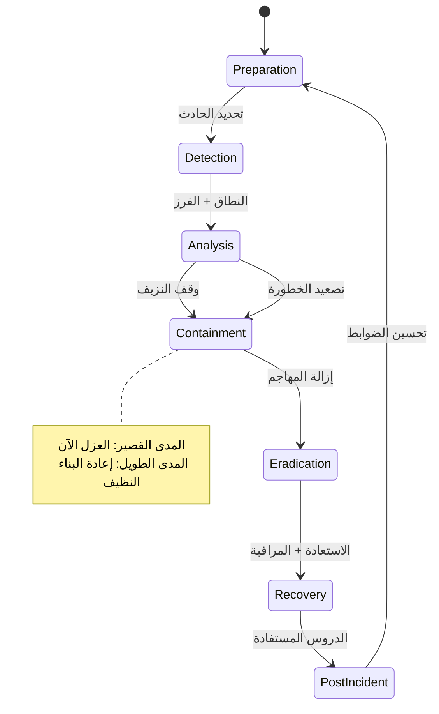

المرحلة التي يخطئ فيها المهندسون غالباً هي **الاحتواء**. هناك نمطان للفشل:

* **تنبيه المهاجم في وقت مبكر جداً** - قطع الاتصال عن مضيف واحد بينما يسيطرون على عشرة آخرين يخبرهم فقط أنك كشفتهم، فيحرقون كل شيء أو يسرعون في استخراج البيانات. في بعض الأحيان *تراقب* قبل أن *تضرب*، لجمع النطاق.
* **عدم الاحتواء بالسرعة الكافية** - الخطيئة المعاكسة، التداول بينما تخرج البيانات من المبنى.

:::warning[لا تدمر الأدلة التي ستحتاجها]
الغريزة المذعورة هي *إعادة تهيئة الجهاز الآن*. لكن المضيف المخترق الحي يحتوي على أدلة متطايرة، وعمليات تشغيل، واتصالات شبكة، وبرمجيات خبيثة في الذاكرة، تختفي بمجرد إيقاف التشغيل. حيثما أمكن، **التقط صور الذاكرة والقرص قبل الاستئصال.** ستحتاج إليها لتحديد النطاق ("ما الذي لمسه أيضاً؟")، وللالتزامات القانونية/التنظيمية، ولضمان اكتمال الاستئصال فعلياً. ترتيب التقلب مهم: الذاكرة أولاً، ثم القرص. [^5]
:::

### الفصل التاسع: التحقيقات الجنائية الرقمية - إعادة بناء الحقيقة

عندما ينتهي الحادث (أو للإجراءات القانونية)، تقوم **التحقيقات الجنائية الرقمية والاستجابة للحوادث (DFIR)** بإعادة بناء ما حدث بالضبط. المبدأ الأساسي هو **سلسلة الحيازة (Chain of Custody)** و **ترتيب التقلب**، يجب جمع الأدلة بالترتيب من الأكثر زوالاً إلى الأقل، وتوثيق كل خطوة معالجة، وإلا فهي عديمة القيمة في المحكمة وغير جديرة بالثقة لتحديد النطاق:

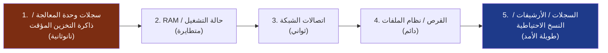

يعيد المحللون الجنائيون بناء الجدول الزمني للاختراق من بيانات نظام الملفات (MFT, `$LogFile`)، ومقالب الذاكرة (Volatility)، وسجلات أحداث Windows، وآثار مثل prefetch و shimcache، وينسجون آلاف الطوابع الزمنية في سرد متماسك حول *كيف دخلوا، وماذا فعلوا، وماذا أخذوا.*

### الفصل العاشر: ما بعد الحادث بدون لوم

المرحلة الأكثر قيمة هي تلك التي يتم الضغط للقفز عنها: **الدروس المستفادة**. القاعدة التي تجعلها تعمل هي **عدم اللوم (Blamelessness)**، حيث تستهدف التحليلات *الأنظمة والعمليات*، وليس الأفراد أبداً. اللحظة التي يصبح فيها تحليل ما بعد الحادث متعلقاً بتوزيع اللوم، يتوقف الناس عن قول الحقيقة، وتفقد المعلومات التي تحتاجها للتحسين.

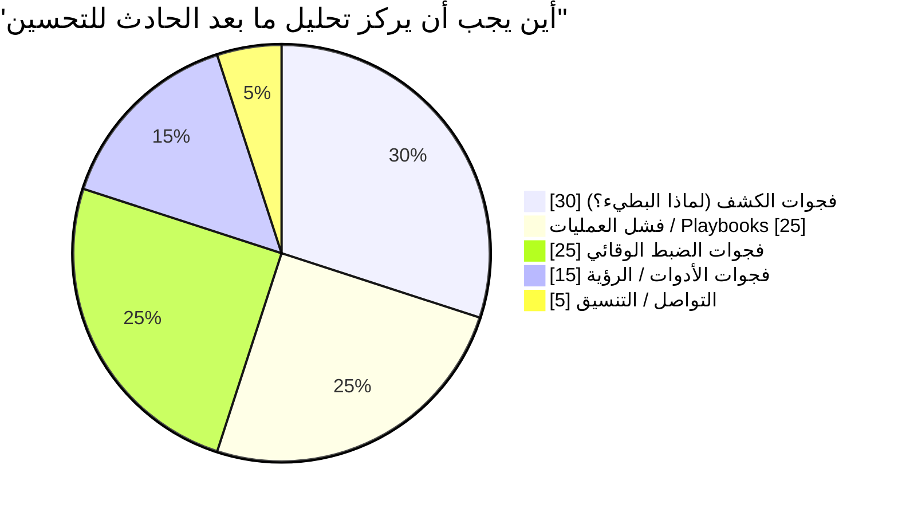

كل حادث هو رسوم دراسية باهظة الثمن. المؤسسات التي تراكم نضجها الأمني هي تلك التي *تستخلص الدرس كاملاً*: كل اختراق يغلق الفجوة التي سمحت به بشكل دائم، مما يغذي مباشرة مرحلة التحضير، وعمليات الكشف في الجزء الثاني.

---

## الجزء الخامس: ذكاء التهديدات - معرفة عدوك

تتحسن عمليات الكشف والاستجابة بشكل كبير عندما تعرف *من* المحتمل أن يستهدفك و *كيف يعمل*. **ذكاء التهديدات السيبرانية (CTI)** هو تخصص تحويل البيانات الخام حول الخصوم إلى قرارات، ويعمل على ثلاثة مستويات:

| المستوى | الجمهور | السؤال الذي يجيب عليه | مثال |
| --- | --- | --- | --- |
| **استراتيجي** | التنفيذيون / مجلس الإدارة | *من يستهدف صناعتنا ولماذا؟* | "مجموعات برامج الفدية تستهدف فوترة الرعاية الصحية" |
| **تشغيلي** | قيادة SOC | *ما هي الحملات والتقنيات النشطة الآن؟* | "هذه المجموعة تستخدم spear-phishing → Cobalt Strike → double extortion" |
| **تكتيكي** | المحللون / الأدوات | *ما هي المؤشرات المحددة التي أحظرها/أكشفها؟* | IOCs، معرفات تقنيات ATT&CK، قواعد YARA/Sigma |

الإطار الرابط هو **نموذج الماس (Diamond Model)**، كل حادث اختراق له أربعة رؤوس، والتمحور بينها يوسع فهمك:

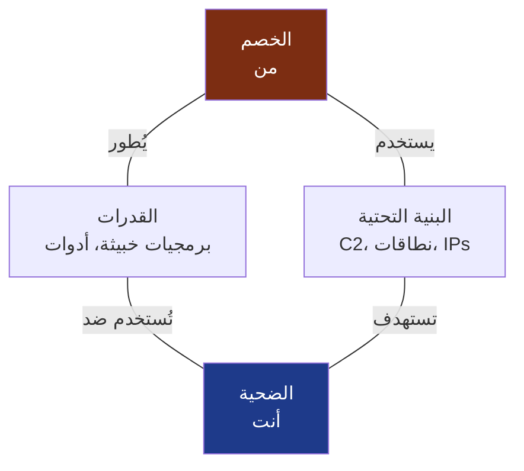

معرفة نطاق C2 واحد (البنية التحتية) تتيح لك التمحور إلى نطاقات أخرى على نفس المسجل/النمط؛ معرفة البرمجيات الخبيثة (القدرات) تتيح لك كتابة قاعدة YARA تلتقط الحملة *التالية* للخصم. ذكاء التهديدات هو كيف يتوقف الفريق الأزرق عن لعب دور الدفاع الصرف ويبدأ في التوقع.

:::important[الذكاء يجب أن يقود للعمل، وإلا فهو مجرد تفاهات]
موجز من عشرة آلاف عنوان IP ضار لا تستهلكه أي قاعدة هو ضوضاء، وليس ذكاءً. اختبار CTI هو حلقة مغلقة: هل يغير ما تكتشفه، أو تحظره، أو تصطاده، أو تعطيه الأولوية؟ قم بتغذية IOCs التكتيكية في إثراء SIEM الخاص بك، وقم بتغذية TTPs التشغيلية في خريطة تغطية ATT&CK الخاصة بك، وقم بتغذية التقييمات الاستراتيجية في قرارات المخاطر الخاصة بك. الذكاء الذي لا يصل إلى ضابط أمني هو تقرير لا يقرؤه أحد.
:::

---

## الخاتمة والطريق إلى الأمام

لقد عشنا الآن حلقة المدافع الكاملة: **الرؤية** (القياس)، **الكشف** (قواعد هندسية بناءً على السلوك)، **الاستجابة** (انضباط SOC و IR)، **التعلم** (تحليلات ما بعد الحادث بدون لوم)، و **التوقع** (ذكاء التهديدات). لقد قبلنا بفشل الوقاية، وبنينا العضلات للنجاة منه، لتقليص وقت البقاء في الشبكة من أسابيع إلى دقائق.

لكن هناك حدوداً واحدة حيث يصبح كل هذا أكثر صعوبة وسرعة في وقت واحد: عالم **السحابة الأصلية (Cloud-native)** للحاويات الزائلة، والبنية التحتية التعريفية، والبرمجيات المجمعة من آلاف التبعيات مفتوحة المصدر التي لم تكتبها بنفسك. هنا يذوب المحيط بشكل أكبر، وتعيش أحمال العمل لثوانٍ، وأخطر الاختراقات لا تدخل عبر الكود الخاص بك بل عبر *سلسلة التوريد* الخاصة بك، تبعية مسمومة، خط أنابيب بناء مخترق، رمز CI مسرب.

**المجلد الخامس**، الختام، ينهي السلسلة بأكملها بالأمن السحابي الحديث و DevSecOps: تقوية الحاويات و Kubernetes، فحص البنية التحتية ككود، تأمين خط أنابيب CI/CD، SBOMs و SLSA، والدفاع عن سلسلة توريد البرمجيات، حيث تحدث اختراقات العقد القادم بالفعل.

---

## المراجع

[^1]: [MITRE - ATT&CK Framework](https://attack.mitre.org/)
[^2]: [David Bianco (2013) - The Pyramid of Pain](https://detect-respond.blogspot.com/2013/03/the-pyramid-of-pain.html)
[^3]: [SigmaHQ - Generic Signature Format for SIEM Systems](https://github.com/SigmaHQ/sigma)
[^4]: [NIST (2012) - SP 800-61 Rev. 2: Computer Security Incident Handling Guide](https://csrc.nist.gov/publications/detail/sp/800-61/rev-2/final)
[^5]: [IETF - RFC 3227: Guidelines for Evidence Collection and Archiving](https://datatracker.ietf.org/doc/html/rfc3227)