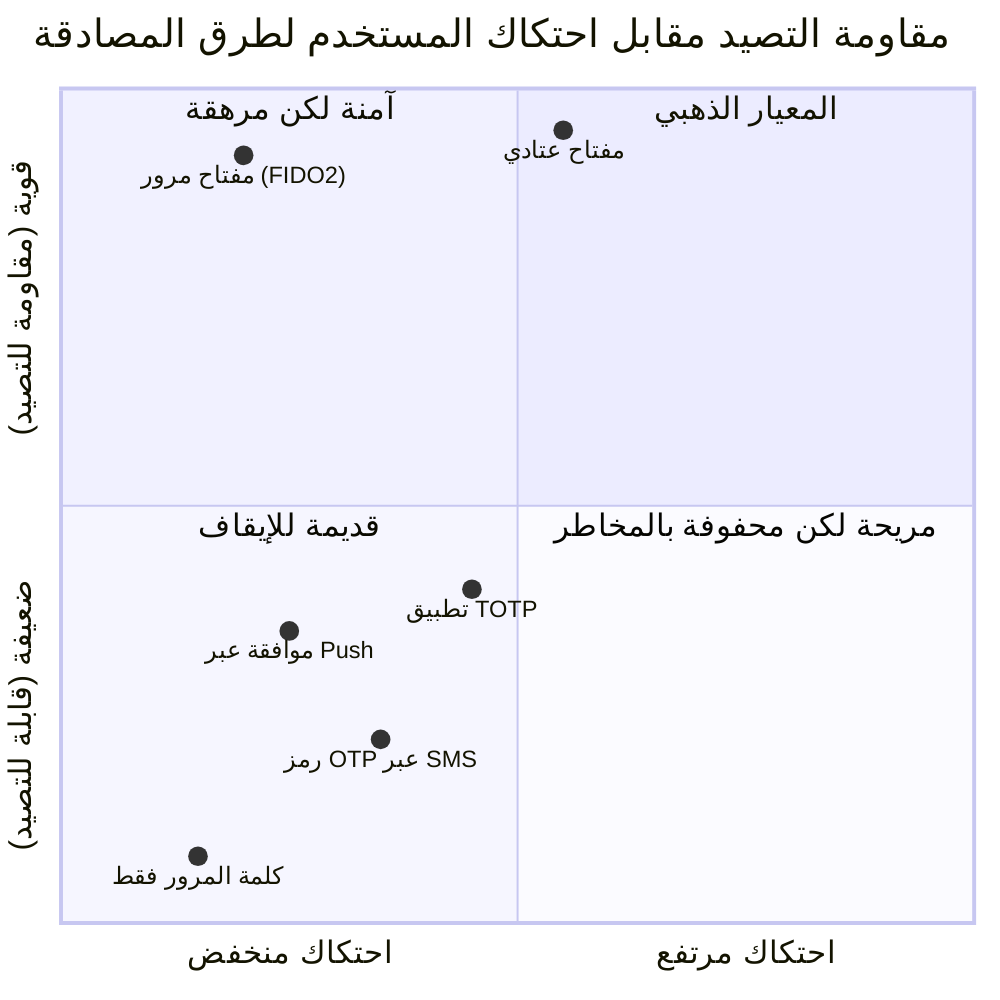
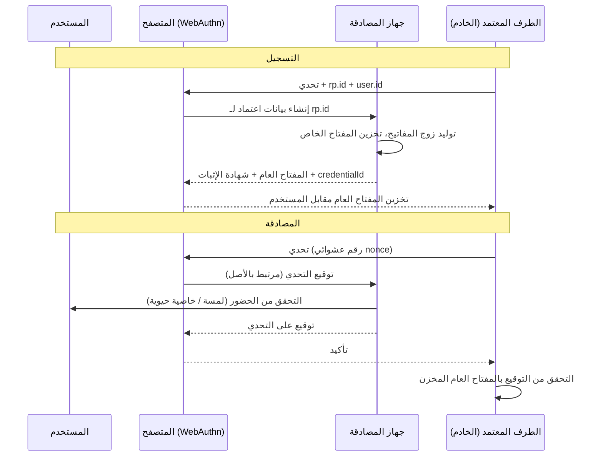
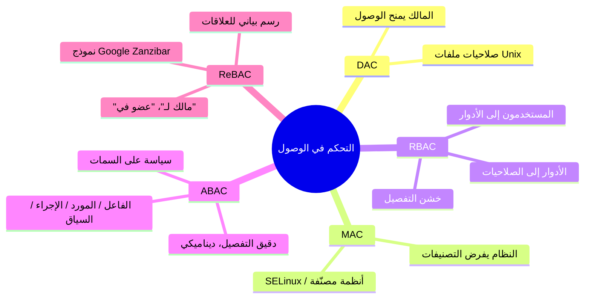
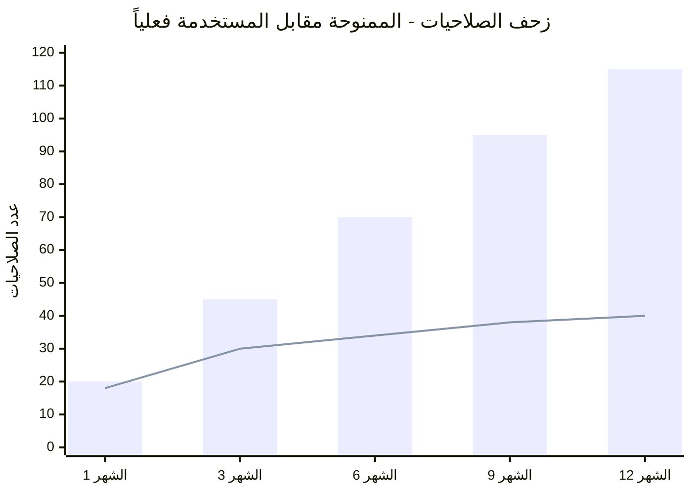
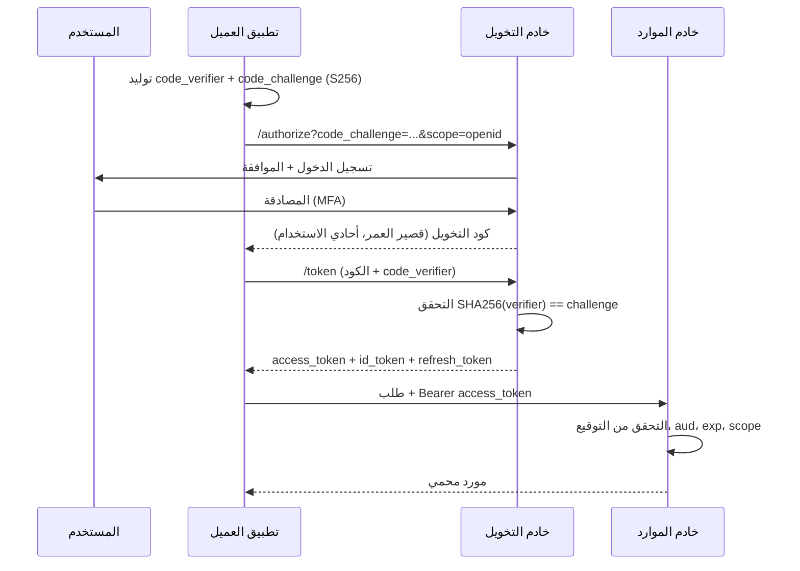
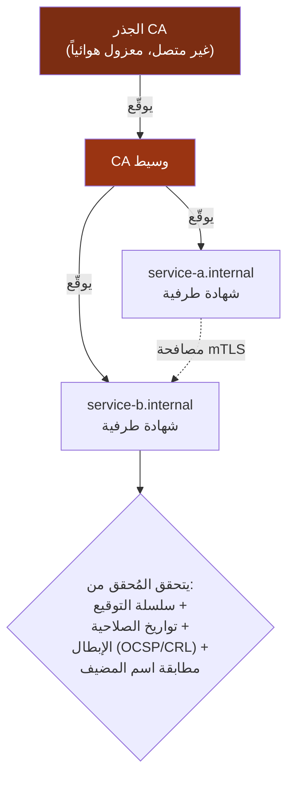
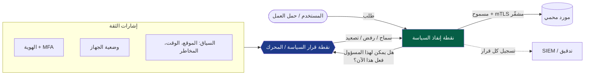
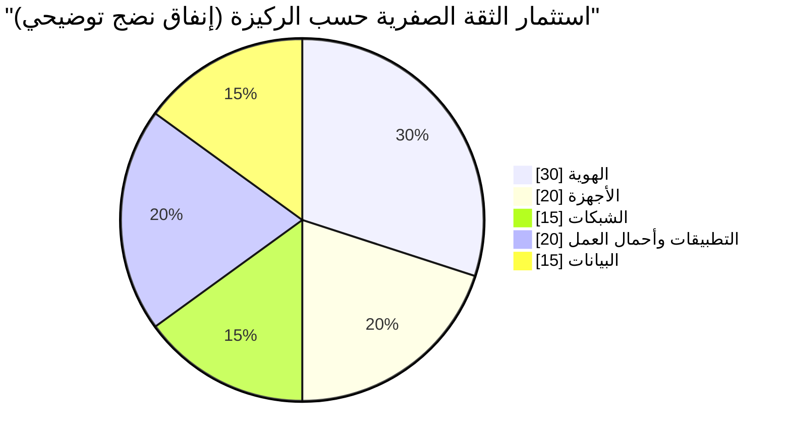

## حيث توقفنا في المجلد الأول

في [المجلد الأول](/posts/secure_systems_architecture/) استعرضنا كامل المكدس التقني، من الأسلاك النحاسية إلى الشيفرة البرمجية، من خلال أربع وجهات نظر: مهندس الشبكات، والمدافع، والمخترق، ومهندس البرمجيات. رسمنا حدودنا عند حافة الشبكة، ووزعنا مستشعرات نظام كشف التسلل (IDS) على طول الممرات، وتعاملنا مع جدار الحماية كحارس بوابة للمملكة.

ثم تلاشت تلك المملكة.

انتقلت الحواسيب المحمولة إلى المنازل. وانتقلت الخوادم إلى مراكز بيانات خارجية. وبدأت واجهات برمجة التطبيقات (APIs) في التواصل مع بعضها عبر الإنترنت العام. إن الصورة التقليدية للقلعة والخندق، حيث يعني "الداخل" *الموثوق* و"الخارج" *المعادي*، لم تعد تصف الواقع. لقد اختفى الخندق. وما تبقى هو سرب من الكيانات (Principals): أشخاص، وخدمات، وأجهزة، وأحمال عمل، كل منها يطلب القيام بشيء ما، وكل منها يحتاج إلى إثبات هويته وتحديد ما يُسمح له بالوصول إليه.

هذا هو موضوع هذا المجلد. **الهوية هي المحيط الجديد** [^1]، وكل طلب هو بمثابة عبور للحدود.

:::note[الخط الفكري لهذا المجلد]
المصادقة (Authentication) تجيب على سؤال *"من أنت؟"* بينما تجيب التخويل (Authorization) على سؤال *"ما الذي يُسمح لك بفعله؟"*. كل شيء آخر في هذا المقال، من عوامل، ورموز (Tokens)، وجلسات، ومحركات سياسات، ومواد مفاتيح، يوجد لجعل هاتين الإجابتين **جديرتين بالثقة، وقابلتين للإلغاء، وقابلتين للتدقيق** بسرعة الآلة.
:::

---

## الجزء الأول: المصادقة - إثبات من أنت

### الفصل الأول: إعادة النظر في العوامل الثلاثة

تُختصر كل مخططات المصادقة في تركيبات من ثلاثة عوامل كلاسيكية، بالإضافة إلى إضافتين حديثتين:

* **شيء تعرفه** - كلمات المرور، رموز PIN، عبارات المرور.
* **شيء تملكه** - مفتاح أمان مادي، هاتف، بطاقة ذكية.
* **شيء أنت عليه** - بصمة الإصبع، الوجه، قزحية العين.
* **مكان تتواجد فيه** - الموقع الجغرافي / سياق الشبكة (إشارة *سياقية*، وليست عاملاً صلباً).
* **شيء تفعله** - المقاييس الحيوية السلوكية: إيقاع الكتابة، ديناميكيات حركة الفأرة.

**وجهة نظر المخترق:** لكل عامل هجوم أصيل. عوامل المعرفة يتم *تصيدها* (Phishing) و*إغراقها* (Spraying). عوامل الامتلاك يتم *سرقتها* أو *تبديل شريحة الهاتف (SIM-swapped)*. عوامل الخصائص الحيوية يتم *تزييفها* (بصمة مرفوعة، وجه مطبوع) والأهم من ذلك أنها **لا يمكن تغييرها**؛ فبمجرد اختراق بصمة إصبعك، لن تستطيع استبدالها.

**وجهة نظر المدافع:** تعمل المصادقة متعددة العوامل (MFA) لأن المهاجم يجب عليه الآن اختراق عوامل من *أنواع مختلفة* في وقت واحد. لكن ليست كل أنواع MFA متساوية. هذه هي الفروق الدقيقة الأكثر أهمية التي يغفل عنها المدافعون:



الدرس المستفاد من المخطط: **رموز OTP عبر الرسائل القصيرة هي MFA، لكنها ضعيفة.** إنها تقاوم إعادة استخدام كلمة المرور ولكنها لا تقاوم وكيل تصيد في الوقت الفعلي أو تبديل شريحة الهاتف. فقط بيانات اعتماد **FIDO2 / WebAuthn**، حيث لا يغادر المفتاح الخاص جهاز المصادقة ويكون التوقيع مرتبطاً مشفراً بالأصل (Origin)، هي حقيقياً *مقاومة للتصيد* [^2].

:::warning[إرهاق المصادقة (MFA fatigue) هو هجوم حقيقي]
في عام 2022، استخدمت العديد من الاختراقات البارزة **إغراق طلبات الموافقة (push-bombing)**: حيث يمتلك المهاجم كلمة المرور بالفعل، ثم يرسل سيلًا من طلبات الموافقة للضحية حتى يقوم الأخير، بدافع الإزعاج أو الارتباك، بالضغط على "موافقة". المصادقة القائمة على الدفع (Push) بدون *مطابقة الأرقام (Number matching)* هي عيب في التصميم وليست إجراءً أمنياً. فضل استخدام مفاتيح المرور (Passkeys)، أو طبق مطابقة الأرقام مع السياق (اسم التطبيق، الموقع) في كل طلب. [^3]
:::

### الفصل الثاني: كلمات المرور التي ترفض الموت

حتى في مستقبل يعتمد على مفاتيح المرور (Passkeys)، ستظل قواعد بيانات كلمات المرور موجودة لعقد من الزمن. تخزينها بشكل صحيح أمر غير قابل للتفاوض.

القاعدة هي: **لا تقم أبداً بتخزين ما كتبه المستخدم.** قم بتخزين هاش (Hash) بطيء، ومملح (Salted)، ومكثف الذاكرة (Memory-hard).

$$
H = \text{Argon2id}(\text{password}, \text{salt}, m, t, p)
$$

حيث $m$ هي تكلفة الذاكرة (بـ KiB)، و$t$ هي تكلفة الوقت (التكرارات)، و$p$ هي التوازي. خوارزمية Argon2id هي المعيار الموصى به حالياً من قبل OWASP لأنها تقاوم كلاً من اختراق وحدات معالجة الرسوميات (عبر تكثيف الذاكرة) وهجمات القنوات الجانبية (عبر نمط وصول البيانات الهجين الخاص بها) [^4].

لماذا التجزئة (Hashing) *البطيئة* مهمة؟ يتم التعبير عنها باقتصاديات المهاجم. إذا كان المهاجم قادراً على حساب $R$ من الهاش في الثانية، فإن كسر كلمة مرور مسحوبة بشكل موحد من فضاء مفاتيح بحجم $N$ يستغرق، في المتوسط:

$$
t_{\text{crack}} = \frac{N}{2R}
$$

إن الهاش السريع مثل SHA-256 بدون ملح يعطي منصة GPU حديثة سرعة $R \approx 10^{11}$ تخمين/ثانية. بينما يمكن لـ Argon2id مضبوطة تقليل ذلك إلى $R \approx 10^{3}$. هذا الانهيار في $R$ بمقدار ثمانية مراتب هو جوهر اللعبة بالكامل.

:::tip[قائمة التحقق لتخزين كلمات المرور]

1. **استخدم التجزئة (Hash)** باستخدام Argon2id (أو scrypt / bcrypt إذا كانت Argon2 غير متاحة).
2. **استخدم الملح (Salt)** بشكل فريد لكل مستخدم (لهزيمة جداول Rainbow).
3. فكر في إضافة **فلفل (Pepper)** من جانب الخادم يتم تخزينه في HSM/KMS، منفصلاً عن قاعدة البيانات (لهزيمة المهاجم الذي يسرب قاعدة البيانات فقط).
4. **لا تضع** حداً أقصى لطول كلمة المرور أو تمنع اللصق، فكلاهما يدفع المستخدمين نحو أسرار أضعف.
5. تحقق من كلمات المرور الجديدة مقابل **قواعد بيانات الاختراقات المعروفة** (مثل واجهة k-anonymity الخاصة بـ HaveIBeenPwned) [^5].

:::

### الفصل الثالث: نهاية عصر كلمات المرور - WebAuthn ومفاتيح المرور (Passkeys)

تشكل WebAuthn (واجهة برمجة تطبيقات المتصفح) بالإضافة إلى بروتوكول CTAP معاً معيار **FIDO2**. النموذج الذهني:



السحر يكمن في سطر واحد: **التوقيع مرتبط بالأصل (`rp.id`)**. لا يمكن لموقع تصيد على `paypa1.com` أن يجعل جهاز المصادقة ينتج تأكيداً صالحاً لـ `paypal.com`، لأن المتصفح يرفض إرساله. هذا يلغي الفئة الكاملة لتصيد بيانات الاعتماد من خلال التصميم، وليس من خلال يقظة المستخدم [^2].

**مفتاح المرور (Passkey)** هو ببساطة بيانات اعتماد FIDO2 *قابلة للاكتشاف والمزامنة*، يتم نسخها احتياطياً إلى سلسلة مفاتيح سحابية (Apple، Google، Microsoft، أو مدير كلمات مرور) بحيث تظل موجودة حتى لو فقدت الجهاز. تلك المزامنة هي الاختراق المريح الذي جعل التخلي عن كلمات المرور ممكناً للمستهلكين.

---

## الجزء الثاني: التخويل - تقرير ما يُسمح لك بفعله

المصادقة هي النصف السهل. **التخويل (Authorization) هو حيث تنزف الأنظمة الحقيقية.** صنفت قائمة OWASP لأخطر 10 مخاطر أمنية *ضعف التحكم في الوصول (Broken Access Control)* كخطر الويب **رقم 1**، متجاوزاً مخاطر الحقن (Injection) وفشل التشفير مجتمعين [^6].

### الفصل الرابع: النماذج - من الأدوار إلى السمات إلى العلاقات



**RBAC (القائم على الأدوار)** هو المكان الذي تعيش فيه معظم المؤسسات: المستخدم لديه أدوار، والأدوار تجمع الصلاحيات. من السهل فهمه وتدقيقه. نمط فشله هو **انفجار الأدوار (Role explosion)**؛ فعندما يتحول "محرر لمنطقة الاتحاد الأوروبي في مشروع المالية خلال ساعات العمل" إلى دور خاص به، سيكون لديك الآلاف منها ولن يفهم أحد هذا الرسم البياني.

**ABAC (القائم على السمات)** يحل ذلك بتقييم *سياسة* بناءً على سمات وقت الطلب:

```txt
# A tiny ABAC policy (OPA / Rego style)
allow if {
    input.subject.department == input.resource.owner_department
    input.action == "read"
    input.context.time_hour >= 9
    input.context.time_hour < 18
}
```

**ReBAC (القائم على العلاقات)**، الذي اشتهر بورقة بحث **Zanzibar** من جوجل [^7] وتم توفيره كأنظمة مفتوحة المصدر مثل OpenFGA وSpiceDB، يصمم التخويل كرسم بياني: *"أليس محررة للمستند، المستند موجود في المجلد، بوب مشاهد للمجلد ← بوب يمكنه مشاهدة المستند."* وهو يتألق في عمليات التحقق من نوع "هل يمكن للمستخدم X فعل Y للكائن Z؟" التي تسيطر على منتجات SaaS التي تعتمد على المشاركة والتداخل.

:::important[فخ IDOR - جرح التخويل الأكثر شيوعاً]
**مرجع الكائن المباشر غير الآمن (IDOR)** هو ما يحدث عندما تصادق المستخدم ولكن تنسى *تخويل الكائن*. المثال الكلاسيكي:

```bash
GET /api/invoices/1043   ->  200 OK  (my invoice)
GET /api/invoices/1044   ->  200 OK  (someone else's invoice!)
```

الإصلاح هو انضباط، وليس مكتبة: **يجب تحديد نطاق كل عملية جلب كائن للمسؤول (Principal) الطالب.** لا تستخدم أبداً `SELECT * FROM invoices WHERE id = ?`؛ بل استخدم دائماً `... WHERE id = ? AND owner_id = ?`، أو ادفع عملية التحقق إلى محرك سياسات مركزي. إن IDOR هو *السبب* الذي يجعل "ضعف التحكم في الوصول" يتصدر قائمة OWASP. [^6]
:::

### الفصل الخامس: مبدأ الامتياز الأقل، كمياً

يقول مبدأ الامتياز الأقل: امنح الصلاحيات *الحد الأدنى* المطلوبة، ولأقل *وقت* ممكن. في الممارسة العملية، تتراكم الصلاحيات دائماً، ويُسمى هذا الانجراف **زحف الصلاحيات (Privilege creep)**. مقياس عقلي مفيد هو نسبة الصلاحيات *المستخدمة* إلى الصلاحيات *الممنوحة*:



الفجوة المتزايدة بين الأعمدة (الممنوحة) والخط (المستخدمة) هي **سطح الهجوم القائم**: صلاحيات يرثها المهاجم لحظة اختراقه للحساب، ولا يراقبها أحد. الإجراءات المضادة:

* **الوصول في الوقت المناسب (JIT):** امنح حقوقاً مرتفعة لفترة زمنية محددة، ثم قم بإلغائها تلقائياً.
* **مراجعات الوصول / إعادة التصديق:** حملات دورية لـ "هل ما زلت بحاجة لهذا؟".
* **إدارة الوصول المتميز (PAM):** تخزين بيانات اعتماد المسؤولين في خزائن، والتحكم في الجلسات، وتسجيل كل شيء.

---

## الجزء الثالث: الرموز، الجلسات والاتحاد

### الفصل السادس: OAuth 2.0 وOIDC، والخلط بينهما

الخطأ المعماري الأكثر شيوعاً في هذا المجال هو الخلط بين **OAuth 2.0** (التخويل - الوصول المفوض) و**OpenID Connect** (المصادقة - إثبات الهوية). OIDC هو طبقة هوية رقيقة *فوق* OAuth 2.0 [^8].

* **OAuth 2.0** يجيب على: *"هل ستسمح لهذا التطبيق بالتصرف نيابة عنك للوصول إلى المورد R؟"* ويصدر **رموز الوصول (Access tokens)**.
* **OIDC** يجيب على: *"من هذا المستخدم؟"* ويصدر **رموز الهوية (ID token)** (رمز JWT موقع يحتوي على مطالبات حول المستخدم).

التدفق الحديث والموصى به لكل شيء تقريباً، من تطبيقات الصفحة الواحدة (SPAs)، والموبايل، وتطبيقات الويب، هو **كود التخويل + PKCE**:



**لماذا PKCE (مفتاح الإثبات لتبادل الكود)؟** بدونه، يمكن للمهاجم الذي يعترض كود التخويل (عبر تطبيق ضار مسجل على نفس مخطط URI) استرداده. يربط PKCE الكود بسر (`code_verifier`) لا يعرفه إلا العميل الشرعي، لذا يصبح الكود المسروق عديم الفائدة. تجعل **OAuth 2.1** استخدام PKCE إلزامياً لجميع العملاء وتزيل تماماً أنواع المنح *الضمنية* و*كلمة المرور* الخطيرة [^9].

:::caution[توقف عن استخدام التدفق الضمني (Implicit flow)]
كان منح Implicit القديم يعيد الرموز مباشرة في جزء URL، وهو تصميم من حقبة ما قبل وجود `fetch` وCORS في المتصفحات. كانت الرموز تتسرب إلى التاريخ، والمراجع، والسجلات. إذا كان هناك درس تعليمي يطلب منك استخدام `response_type=token`، فهذا الدرس قديم بعقد من الزمن. استخدم كود التخويل + PKCE دائماً.
:::

### الفصل السابع: الجلسات مقابل الرموز - المقايضة بين الحالة (Stateful) وعدم الحالة (Stateless)

| الخاصية | جلسة الخادم (ملف تعريف ارتباط → مخزن جلسات) | رمز JWT مكتفٍ ذاتياً |
| --- | --- | --- |
| الحالة | الخادم يحتفظ بالجلسة؛ ملف الارتباط هو معرف غامض | الخادم لا يحتفظ بشيء؛ الرمز *هو* الحالة |
| الإلغاء | **فوري** - حذف صف الجلسة | **صعب** - صالح حتى تاريخ الانتهاء `exp`، يحتاج قائمة حظر |
| التوسع | يحتاج مخزن مشترك (Redis) | أفقي بسهولة |
| الحمولة | ملف ارتباط صغير | رمز أكبر مع كل طلب |
| الأفضل لـ | تطبيقات الويب الكلاسيكية، تحتاج تسجيل خروج فوري | الخدمة-إلى-الخدمة، رموز وصول قصيرة العمر |

الحل الوسط القياسي في الصناعة هو: **رموز وصول قصيرة العمر (5–15 دقيقة) + رموز تحديث (Refresh tokens) طويلة العمر.** رمز الوصول هو JWT لا تلغيه أبداً (فهو تنتهي صلاحيته بسرعة على أي حال)؛ رمز التحديث هو بيانات اعتماد قابلة للإلغاء وتدور يتم الاحتفاظ بها في جانب الخادم. إلغاء مستخدم يقطع وصوله خلال عمر رمز الوصول الواحد.

:::warning[الأخطاء القاتلة الثلاثة في JWT]

1. **`alg: none`** - تاريخياً، قبلت بعض المكتبات رمزاً *يصرح* بأنه لا يحتاج إلى توقيع. ثبت الخوارزمية المتوقعة دائماً في جانب الخادم؛ لا تثق أبداً بـ `alg` الموجود في الترويسة.
2. **الخلط بين HS256 وRS256** - يقوم مهاجم بتقديم رمز HS256 موقع بمفتاح RSA العام الخاص بك كسره HMAC. ثبت الخوارزمية.
3. **تخزين JWTs في `localStorage`** - قابلة للقراءة بواسطة أي حمولة XSS. فضل ملفات تعريف ارتباط `HttpOnly` و`Secure` و`SameSite` لجلسات المتصفح. [^10]

:::

### الفصل الثامن: الاتحاد وتسجيل الدخول الموحد (SSO)

يسمح **تسجيل الدخول الموحد (SSO)** لعملية تسجيل دخول واحدة بخدمة العديد من التطبيقات. البروتوكولان المهيمنان:

* **SAML 2.0** - يعتمد على XML، مطول، لا يزال مهيمناً في B2B للشركات والأنظمة القديمة.
* **OIDC** - يعتمد على JSON/JWT، المعيار للتطبيقات الجديدة، الموبايل، وAPIs.

قائمة اللاعبين: **مزود الهوية (IdP)** - مثل Okta، Entra ID، Keycloak، Google - يقوم بمصادقة المستخدم ويضمنه لـ **مزود الخدمة (SP)** / الطرف المعتمد. القيمة تكمن في المركزية: مكان واحد لفرض MFA، مكان واحد لتعطيل موظف مغادر، ومسار تدقيق واحد.

:::note[إلغاء التوفير (Deprovisioning) هو القاتل الصامت]
أكبر فائدة أمنية لـ SSO هي **الإلغاء المركزي والفوري للصلاحيات.** أكثر فشل واقعي شيوعاً هو الحساب المهجور، حيث يغادر الموظف، وتغلق الموارد البشرية حساب SSO، ولكن يظل حساب مسؤول محلي على خادم منسي يعمل. طابق كل مصدر هوية مقابل نظام سجلات الموارد البشرية الخاص بك. حساب لا يملكه بشر هو حساب يملكه مخترق.
:::

---

## الجزء الرابع: هوية الآلة والأسرار

البشر هم نسبة خطأ ضئيلة. في بنية سحابية حديثة، **هويات الآلات تفوق هويات البشر بـ 45 إلى 1** [^11]، كل خدمة مصغرة، ودالة (Function)، وحاوية، ومهمة تكامل مستمر (CI) تحتاج إلى المصادقة على شيء ما.

### الفصل التاسع: البنية التحتية للمفاتيح العامة (PKI) وسلسلة الثقة

تُبنى الثقة بين الآلات على **شهادات X.509** والبنية التحتية للمفاتيح العامة (PKI). تربط الشهادة مفتاحاً عاماً بهوية، موقعاً من قبل سلطة تصديق (CA) يثق بها المُحقق.



المفتاح الخاص للجذر هو جوهرة التاج، ويُحفظ **خارج الشبكة (Offline) ومعزول هوائياً (Air-gapped)**، لأن اختراقه يبطل كل ما تحته. تقوم الوسطاء (Intermediates) بالتوقيع اليومي لذا نادراً ما يخرج الجذر من الخزنة.

**mTLS (بروتوكول TLS المتبادل)** هو إجابة PKI على مصادقة الخدمة-إلى-الخدمة: *كلا* الطرفين يقدمان شهادات، بحيث تثبت الخدمة هويتها للمتصلين *و* للمستقبلين. هذا هو العمود الفقري المشفّر للثقة الصفرية بين أحمال العمل (وهو السبب وراء وجود شبكات الخدمات مثل Istio وLinkerd، فهي تقوم بأتمتة إصدار الشهادات وتدويرها عبر هويات **SPIFFE/SPIRE**) [^12].

### الفصل العاشر: إدارة الأسرار

أقدم خطيئة في البرمجيات: الأسرار المكتوبة برمجياً (Hard-coded).

```python
# The vulnerability that never dies
DB_PASSWORD = "hunter2"          # committed to git, forever in history
API_KEY = "sk_live_a1b2c3d4..."  # leaked in the client bundle
```

Git *لا ينسى أبداً*. السر الذي يُلتزم به مرة واحدة و"يُحذف" في الالتزام التالي لا يزال في التاريخ، ولا يزال يتم كشطه بواسطة البوتات التي تراقب الدفعات العامة في ثوانٍ. الانضباط المطلوب:

::::steps

:::step[لا تلتزم بالأسرار أبداً]{subtitle="الوقاية"}
استخدم خطافات ما قبل الالتزام (Pre-commit hooks) مثل (`gitleaks`, `trufflehog`) لمنع الأسرار قبل دخولها التاريخ. فرض ذلك في CI حتى لا يتمكن أحد من تجاوزه محلياً.
:::

:::step[المركزية في مدير أسرار]{subtitle="التخزين"}
استخدم HashiCorp Vault، أو AWS Secrets Manager، أو KMS السحابي. تجلب التطبيقات الأسرار في وقت التشغيل عبر هوية مصدقة، ولا تلمس الأسرار أبداً التحكم في المصدر أو ملفات البيئة المخبوزة في الصور.
:::

:::step[فضل الأسرار الديناميكية قصيرة العمر]{subtitle="التدوير"}
يمكن لـ Vault إنشاء بيانات اعتماد قاعدة بيانات صالحة لمدة ساعة واحدة، ثم إبطالها. بيانات اعتماد مسربة لمدة ساعة أقل خطورة بكثير من بيانات ثابتة صالحة لثلاث سنوات.
:::

:::step[دوره بانتظام وعند الاشتباه]{subtitle="الاستجابة"}
أتمتة التدوير. عندما *يحتمل* أن يكون السر مكشوفاً، دور أولاً وحقق ثانياً. يجب أن يكون التدوير عملية مملة، بضغطة زر واحدة، وبدون وقت تعطل، وإلا فلن يحدث أبداً.
:::

::::

:::tip[هوية حمل العمل تغلب الأسرار المخزنة]
أفضل سر هو الذي لا تخزنه أبداً. **اتحاد هوية حمل العمل (Workload identity federation)** (مثل أدوار IAM لخدمات الحساب في AWS، هوية حمل العمل في GCP، ومنفذي CI الموحدين عبر OIDC) يسمح لحمل العمل بإثبات *ماهيته* للحصول على بيانات اعتماد قصيرة العمر، بدون وجود مفتاح طويل العمر في أي مكان للسرقة. إذا كنت لا تزال تلصق مفاتيح سحابية ثابتة في CI، فهذا هو أعلى ترقية يمكنك القيام بها.
:::

---

## الجزء الخامس: التوليف - بناء هندسة الثقة الصفرية

يمكننا الآن تجميع كل شيء في النموذج الذي أضفت عليه NIST الطابع الرسمي في **SP 800-207**: **الثقة الصفرية (Zero Trust)** [^13]. افتراضها التأسيسي، والسبب في أنها تحل محل القلعة والخندق، هو جملة واحدة:

> **لا تثق أبداً، تحقق دائماً.** يُفترض أن الشبكة معادية. الموقع لا يمنح شيئاً. كل طلب مصدق، ومخول، ومشفر، بناءً على استحقاقه الخاص، في كل مرة.

تحتوي الهندسة المرجعية على **نقطة اتخاذ قرار السياسة (PDP)** التي تقيم السياسة، و**نقاط إنفاذ السياسة (PEP)** الموزعة في مسار البيانات التي تسأل PDP وتنفذ حكمها:



الأركان الخمسة التي يعالجها برنامج الثقة الصفرية الناضج (وفقاً لنموذج نضج الثقة الصفرية لـ CISA) [^14]:



لاحظ أن **الهوية تأخذ الشريحة الأكبر**، وهذا ليس صدفة. بمجرد أن الشبكة لا تمنح أي ثقة، تصبح الهوية هي طائرة التحكم الأساسية. كل شيء في هذا المجلد، من عوامل، ورموز، ومحركات سياسات، وهوية الآلة، يوجد في خدمة جعل طائرة التحكم تلك جديرة بالثقة.

:::important[الثقة الصفرية رحلة، وليست منتجاً]
لا يوجد بائع يبيع "ثقة صفرية في صندوق". إنها *هندسة* و*مبدأ تشغيلي* يُطبق تدريجياً: ابدأ بوضع MFA مقاوم للتصيد على أهم تطبيق لديك، أضف فحوصات وضع الجهاز، ثم قسّم الشبكة (Microsegment)، ثم وسع ذلك ليشمل أحمال العمل. يُقاس النضج بالتخلص من الثقة الضمنية، وليس بالدولارات المنفقة على الأجهزة.
:::

---

## الخاتمة والطريق إلى الأمام

المجلد الأول دافع عن "مكان". هذا المجلد دافع عن "كيان"، أينما كان. استبدلنا الجدار بسؤال يُطرح عند كل باب: *أثبت من أنت، وأثبت أنك مُخوّل.*

لكن كل ادعاء في هذا المجلد، كل توقيع رمز، كل مصافحة mTLS، كل كلمة مرور مجزأة، يعتمد على علم التشفير الذي عاملناه حتى الآن كصندوق سحري "يعمل ببساطة". في **المجلد الثالث**، سنفتح ذلك الصندوق. سنبني البدائيات من الصفر: التشفير المتماثل وغير المتماثل، مصافحة TLS 1.3 الحقيقية، تبادل المفاتيح والسرية الأمامية، والاضطراب القادم لتشفير ما بعد الكم، جنباً إلى جنب مع كتالوج الطرق التي يخطئ بها المهندسون في كل ذلك بشكل كارثي.

الهوية التي تعلمت للتو الوثوق بها قوية فقط بقدر قوة الرياضيات التي توقعها.

---

## المراجع

[^1]: [Microsoft (2021) - Identity is the new security perimeter](https://www.microsoft.com/en-us/security/business/security-101/what-is-identity-access-management-iam)
[^2]: [FIDO Alliance - How FIDO Works](https://fidoalliance.org/how-fido-works/)
[^3]: [CISA (2022) - Implementing Phishing-Resistant MFA](https://www.cisa.gov/sites/default/files/publications/fact-sheet-implementing-phishing-resistant-mfa-508c.pdf)
[^4]: [OWASP - Password Storage Cheat Sheet](https://cheatsheetseries.owasp.org/cheatsheets/Password_Storage_Cheat_Sheet.html)
[^5]: [Troy Hunt - Have I Been Pwned: Pwned Passwords (k-Anonymity)](https://haveibeenpwned.com/API/v3#PwnedPasswords)
[^6]: [OWASP - A01:2021 Broken Access Control](https://owasp.org/Top10/A01_2021-Broken_Access_Control/)
[^7]: [Google (2019) - Zanzibar: Google's Consistent, Global Authorization System](https://research.google/pubs/pub48190/)
[^8]: [OpenID Foundation - What is OpenID Connect](https://openid.net/developers/how-connect-works/)
[^9]: [IETF - OAuth 2.1 Authorization Framework (draft)](https://datatracker.ietf.org/doc/html/draft-ietf-oauth-v2-1)
[^10]: [OWASP - JSON Web Token Cheat Sheet](https://cheatsheetseries.owasp.org/cheatsheets/JSON_Web_Token_for_Java_Cheat_Sheet.html)
[^11]: [CyberArk (2023) - Identity Security Threat Landscape Report](https://www.cyberark.com/threat-landscape/)
[^12]: [SPIFFE - Secure Production Identity Framework For Everyone](https://spiffe.io/docs/latest/spiffe-about/overview/)
[^13]: [NIST (2020) - SP 800-207: Zero Trust Architecture](https://csrc.nist.gov/publications/detail/sp/800-207/final)
[^14]: [CISA - Zero Trust Maturity Model v2.0](https://www.cisa.gov/zero-trust-maturity-model)