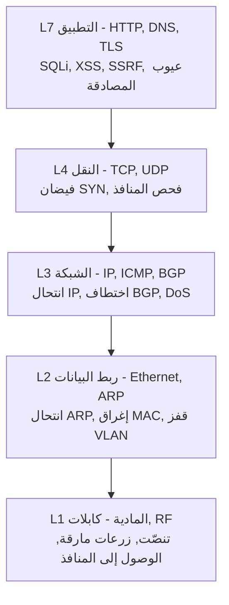
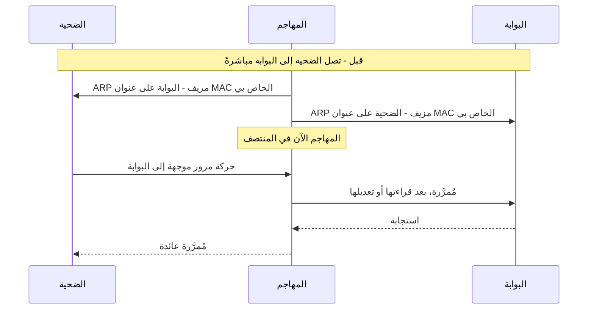
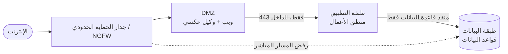
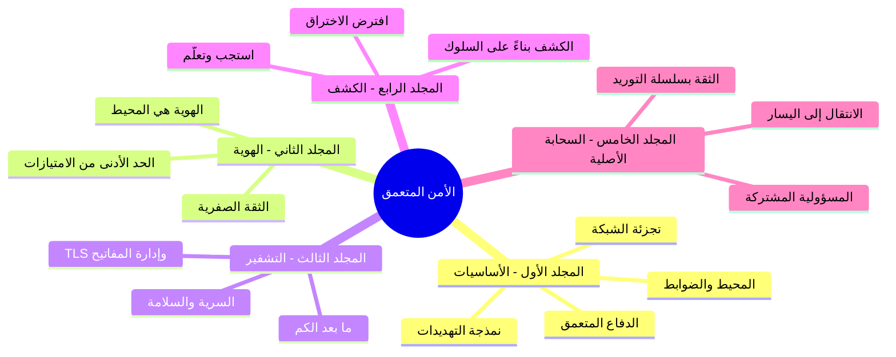
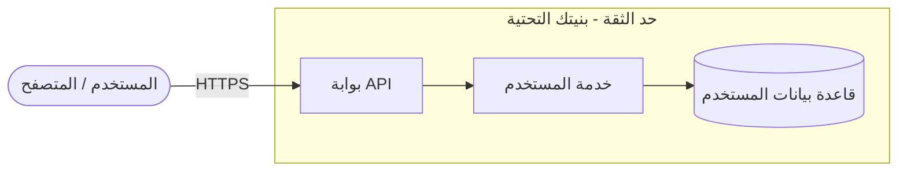
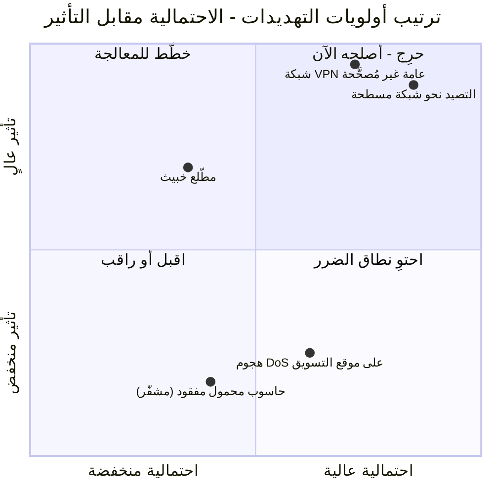
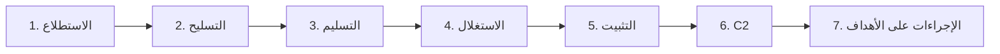
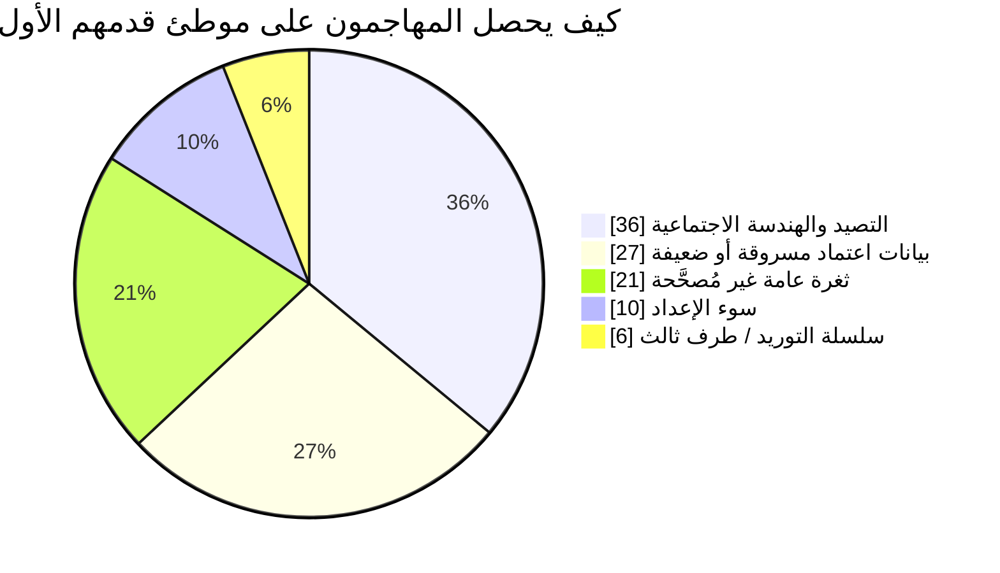
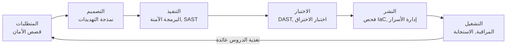
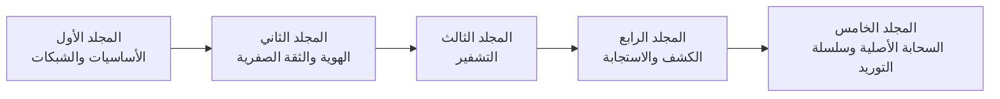

## حيث تبدأ السلسلة

هذا هو المجلد الافتتاحي لرحلة من خمسة أجزاء عبر **هندسة الأمن**. على مدى السلسلة سنسير عبر المكدس التقني بأكمله، من النحاس إلى الحاوية، وتبدو الخريطة كالتالي:

* **المجلد الأول (هذا المجلد)** - الأسس: الشبكة باعتبارها سطح هجوم، والتصميم القابل للدفاع، والدفاع المتعمق، ونمذجة التهديدات، ومنهجية المهاجم.
* **المجلد الثاني** - [الهوية، والوصول، وحدود الثقة الصفرية](/posts/identity_and_access_in_depth/): عندما يتلاشى المحيط، تصبح الهوية هي الحدود الجديدة.
* **المجلد الثالث** - [هندسة التشفير](/posts/cryptography_engineering_in_depth/): البدائيات التي تجعل أياً من ذلك جديراً بالثقة.
* **المجلد الرابع** - [الكشف، والاستجابة، واستخبارات التهديدات](/posts/detection_and_response_in_depth/): ما تفعله عندما تفشل الوقاية.
* **المجلد الخامس** - [أمن السحابة الأصلية وسلسلة التوريد](/posts/cloud_native_and_supply_chain_security_in_depth/): تأمين الزائل، وإثبات ما تشحنه.

ما يميز هذا الدليل هو منهجه. يُدرَس كل موضوع من خلال **أربعة أزواج من العيون**، لأن النظام الحقيقي يتجادل حوله أربعة أنواع من المهندسين في آنٍ واحد:

* **مهندس الشبكات** الذي يبني الأساس.
* **المدافع** الذي يجب عليه حمايته.
* **المخترق** الذي يحاول كسره.
* **مهندس البرمجيات** الذي يكتب الشيفرة التي تعمل عليه.

:::note[أطروحة السلسلة بأكملها]
لا يوجد تحكم أمني منفرد جدير بالثقة. جدران الحماية تفشل، وبيانات الاعتماد تتسرب، والشيفرة بها علل، والتبعيات تُسمَّم. الأمن إذن ليس منتجاً تشتريه بل **خاصية تهندسها**: طبقات تفترض كل منها أن الطبقة التي تسبقها قد فشلت بالفعل. يبني هذا المجلد الطبقات الخارجية والعقلية اللازمة. أما بقية السلسلة فتبني نحو الداخل.
:::

---

## الجزء الأول: الشبكة هي الأرض

يبدأ تواصل البيانات عند الشبكة، وكذلك يبدأ الهجوم. القراءة السطحية لنموذج OSI أو TCP/IP غير كافية [^1]؛ فمتخصص الأمن يقرأ كل طبقة مرتين، مرة لما *تفعله* ومرة لكيفية *تحويلها* ضده.

### الفصل الأول: المكدس من خلال عدسة أمنية

تحمل كل طبقة هجماتها الأصيلة الخاصة بها ودفاعاتها الأصيلة الخاصة بها. وكلما نزلت أكثر، كان الاختراق أكثر مادية وشمولاً.

**الطبقة الأولى - المادية.** عالم الكابلات، والألياف، والمحولات. بالنسبة للمخترق فهي الناقل النهائي *إذا كان الوصول إليها ممكناً*: تنصّت على الشبكة عبر مسار غير مشفر [^2]، أو زرع رخيص يُترك خلف جدار ناري كموطئ قدم دائم للتحكم والسيطرة، أو ببساطة حاسوب محمول يُوصَّل بمقبس نشط في بهو. جواب المدافع إجرائي ومادي - غرف مقفلة، ومنافذ معطلة، وأختام تكشف العبث - مدعوماً تقنياً بالتحكم في الوصول إلى الشبكة **IEEE 802.1X**، الذي يُجبر أي جهاز يتصل فعلياً على المصادقة قبل أن يحصل على إطار واحد قابل للاستخدام [^3].

**الطبقة الثانية - ربط البيانات.** عناوين MAC، والمحولات، و**ARP**، البروتوكول الذي يربط IP بـ MAC والذي صُمم بثقة ضمنية [^4]. وتلك الثقة هي الثغرة:

هذا هو **انتحال ARP**، وهو يمنح المهاجم موقع رجل في المنتصف (Man-in-the-Middle) على المقطع المحلي [^5]. وأبناء عمومته هم **إغراق MAC** (إفاضة جدول CAM الخاص بالمحول حتى يفشل مفتوحاً ويبث كل شيء كالمحور [^6]) و**قفز VLAN** (الهروب من شبكة VLAN الخاصة بك عبر منفذ جذع (trunk) مُكوَّن بشكل خاطئ [^7]). عُدّة المدافع هنا هي نظافة المحول: **أمان المنافذ (port security)** لتثبيت عناوين MAC لكل منفذ [^8]، و**التجسس على DHCP (DHCP snooping)** لقتل خوادم DHCP المارقة، و**الفحص الديناميكي لـ ARP (Dynamic ARP Inspection)** لإسقاط ARP المزيف مقابل جدول ربط موثوق.

**الطبقة الثالثة - الشبكة.** عناوين IP والتوجيه. **انتحال IP** يزوّر عنوان المصدر - المحرك وراء هجمات الحرمان من الخدمة المنعكسة مثل هجوم Smurf الكلاسيكي [^9] - و**اختطاف BGP** يفسد جداول توجيه الإنترنت لابتلاع حركة المرور بالجملة، وهو أداة بمستوى الدول القومية للتجسس والاعتراض الجماعي [^10]. يقوم المدافع بالتصفية: **التصفية الواردة/الصادرة (ingress/egress filtering)** وفقاً لـ BCP 38 / RFC 2827 تُسقط الحزم التي يكون عنوان IP مصدرها كذبة [^11]، وتفرض قوائم التحكم في الوصول (ACLs) من يحق له التحدث إلى من.

**الطبقة الرابعة - النقل.** **TCP** (موجه بالاتصال، بمصافحة ثلاثية) و**UDP** (أطلق وانسَ). يستنفد **فيضان SYN (SYN flood)** جدول الاتصالات شبه المفتوحة للخادم بحزم SYN مزيفة لا تكتمل أبداً [^12]؛ ويرسم **فحص المنافذ (port scanning)** بأدوات مثل `nmap` خريطة سطح الهجوم المستمع [^13]. يجيب المدافع بـ **جدران الحماية ذات الحالة (stateful firewalls)** التي لا تمرر إلا حزمة ACK لديها مصافحة مقابلة لها، و**ملفات تعريف الارتباط SYN (SYN cookies)** التي لا تخصص أي حالة حتى يثبت العميل أنه حقيقي [^14].

### الفصل الثاني: تصميم شبكة قابلة للدفاع

**الشبكة المسطحة (flat network)** - حيث يمكن لكل جهاز الوصول إلى كل جهاز آخر - هي جنة المخترق. اخترق طابعة منسية واحدة، ويمكنك السير إلى وحدة التحكم في المجال (Domain Controller). الشبكة القابلة للدفاع هي شبكة **مجزأة** [^15].

التجزئة - الشبكات الفرعية، و**شبكات VLAN**، و**منطقة منزوعة السلاح (DMZ)** متعددة الطبقات [^16] - تحوّل كل قفزة إلى نقطة اختناق مُراقَبة. إنها مبدأ الحد الأدنى من الامتيازات مُعبَّراً عنه كطوبولوجيا: لا شأن لخادم الويب بالاتصال بوحدة التحكم في المجال، لذا يمنعه جدار الحماية، ويجد خادم الويب المخترق نفسه في طريق مسدود بدلاً من طريق سريع.

يأخذ **التقسيم الدقيق (Microsegmentation)** هذا إلى نهايته المنطقية: حدود سياسة حول *كل حمل عمل*، وليس حول كل منطقة. لا يُوثَق ضمنياً بجهازين افتراضيين على نفس الشبكة الفرعية؛ يجب السماح بكل تدفق صراحةً. ذلك المبدأ - *لا تثق أبداً، تحقق دائماً* - هو بذرة **الثقة الصفرية (Zero Trust)**، وينمو ليصبح الموضوع الكامل للمجلد التالي.

:::important[التسليم الأول]
يسأل التقسيم الدقيق: *"هل ينبغي السماح لهذين الكيانين (Principals) بالتحدث؟"* - وبمجرد أن تأخذ هذا السؤال على محمل الجد، يتوقف عنوان الشبكة عن كونه إجابة كافية. تحتاج إلى التحقق من **الهوية**. وذلك بالضبط حيث يبدأ **[المجلد الثاني](/posts/identity_and_access_in_depth/)**: الهوية باعتبارها المحيط الجديد.
:::

### الفصل الثالث: حراس البوابة - جدران الحماية وأنظمة IDS/IPS

يفهم **جدار الحماية ذو الحالة (stateful firewall)** سياق الاتصال؛ ويذهب **جدار الحماية من الجيل التالي (NGFW)** أبعد من ذلك بالوعي بالتطبيق (حظر تطبيق، والسماح بآخر، وكلاهما على المنفذ 443)، ومنع التسلل المتكامل، وتدفقات استخبارات التهديدات [^17]. ويعمل **جدار حماية تطبيقات الويب (WAF)** في الطبقة السابعة لتخفيف هجمات OWASP Top 10 [^18].

:::warning[جدار WAF شبكة أمان، وليس علاجاً]
قد يحظر WAF هجوماً ساذجاً مثل `OR 1=1`، لكن التهرب من WAF هو مجال ناضج - فالترميز، والإخفاء، وحيل حالة الأحرف تتجاوز التواقيع كل يوم. الإصلاح الحقيقي للحقن يكمن في الشيفرة (الاستعلامات المعلَّمة - parameterized queries)، وليس في مرشح مثبَّت أمامها. عامِل WAF كدفاع متعمق، وليس أبداً كالدفاع الوحيد.
:::

**نظام كشف التسلل (IDS)** يراقب ويُنبّه؛ و**نظام منع التسلل (IPS)** يجلس على الخط ويحظر. كلاهما يكتشف إما بـ **التوقيع (signature)** (دقيق ضد التهديدات المعروفة، أعمى تجاه الجديدة) أو بـ **الشذوذ (anomaly)** (يمكنه اصطياد المجهول، لكنه يغرقك في الإنذارات الكاذبة) [^19]. وكلاهما يصمّ أذنيه أمام حركة المرور المشفرة ما لم تدفع مقابل فك التشفير - وهذا تمهيد لسبب اضطرار *الكشف* في نهاية المطاف إلى الانتقال من السلك إلى نقطة النهاية، وهي قصة المجلد الرابع.

---

## الجزء الثاني: الدفاع المتعمق - ولماذا هو هذه السلسلة

الدفاع المتعمق هو الإدراك بأن أي تحكم واحد *سوف* يفشل، لذا تبني طبقات تشتري كل منها وقتاً، ورؤية، وفرصة أخرى لإيقاف المهاجم [^20]. القلعة في العصور الوسطى هي التشبيه المُستهلَك لكن المثالي: خندق، وجدار، ورماة، ومعقل، وجواهر التاج، والحراس الذين يربطون كل ذلك معاً.

وهذه هي الحركة التي تنظم هذه السلسلة بأكملها: **كل طبقة من طبقات القلعة هي مجلد.**

* **الخندق والجدار الخارجي** هما محيط الشبكة والتجزئة - **هذا المجلد**.
* **الحارس عند كل باب** هو الهوية والوصول - **[المجلد الثاني](/posts/identity_and_access_in_depth/)**.
* **الرسائل المختومة** التي يثق بها الحراس هي التشفير - **[المجلد الثالث](/posts/cryptography_engineering_in_depth/)**.
* **الرماة الذين يراقبون الاختراق** هم الكشف والاستجابة - **[المجلد الرابع](/posts/detection_and_response_in_depth/)**.
* **مصدر الأحجار نفسها** هو أمن سلسلة التوريد والسحابة الأصلية - **[المجلد الخامس](/posts/cloud_native_and_supply_chain_security_in_depth/)**.

**وجهة نظر المخترق:** يرى المهاجم الطبقات كعقبات ويصطاد أضعف وصلة في كل منها. جدار حماية مثالي لا قيمة له إذا نقر موظف على رابط تصيد؛ وشيفرة خالية من العيوب لا قيمة لها على مضيف غير مُصحَّح. العمق مهم بالتحديد لأن المهاجم لا يحتاج إلا إلى *مسار واحد*، والعمق هو كيف تتأكد من أن أي فشل منفرد ليس هو ذلك المسار.

---

## الجزء الثالث: نمذجة التهديدات - التفكير كالمهاجم عن قصد

نمذجة التهديدات هي طريقة منظمة لإيجاد الوصلات الضعيفة *قبل* أن تبنيها [^21]. إنها استباقية، ورخيصة، وواحدة من أعلى الأنشطة الأمنية مردوداً التي يمكن لفريق القيام بها. والاختصار المرجعي هو **STRIDE** من Microsoft [^22].

تأمّل نقطة نهاية عادية: `PUT /api/users/{id}`. ارسم مخطط تدفق البيانات الخاص بها أولاً، مع تحديد **حد الثقة (trust boundary)** حيث تعبر البيانات من الخارج المعادي إلى بنيتك التحتية.

الآن سِر بـ STRIDE عبر كل عنصر وتدفق:

| تهديد STRIDE | السؤال الذي يُطرح على نقطة النهاية هذه | الدفاع الأساسي |
|---|---|---|
| **Spoofing** (انتحال الهوية) | هل يمكن للمستخدم A تغيير `{id}` وتعديل ملف المستخدم B؟ | مصادقة قوية (authN) + تخويل لكل كائن (authZ) |
| **Tampering** (التلاعب) | هل يمكن لهجوم رجل في المنتصف تعديل جسم الطلب أثناء النقل؟ | TLS (المجلد الثالث) |
| **Repudiation** (الإنكار) | هل يمكن للمستخدم أن ينكر أنه أجرى التغيير؟ | سجلات تدقيق موقّعة وغير قابلة للتغيير |
| **Information disclosure** (الكشف عن المعلومات) | هل تسرّب الاستجابة معلومات تعريف شخصية (PII) أو هاش كلمة مرور؟ | تقليل المخرجات، والتشفير في وضع الراحة |
| **Denial of service** (الحرمان من الخدمة) | هل يمكن لعميل واحد إغراقها وتجويع قاعدة البيانات؟ | تحديد المعدل، والحصص |
| **Elevation of privilege** (رفع الامتيازات) | هل يوجد مسار حقن إلى المسؤول؟ | استعلامات معلَّمة، والحد الأدنى من الامتيازات |

تبدأ معظم الاختراقات الواقعية بطرفَي ذلك الجدول: **انتحال الهوية (Spoofing)** (المصادقة المكسورة) و**رفع الامتيازات (Elevation of privilege)**. وأكثر ثغرات الويب شيوعاً على الإطلاق، **مرجع الكائن المباشر غير الآمن (IDOR)**، ليست سوى انتحال يرتدي عنوان URL - إذ يثق التطبيق بـ `{id}` يقدمه المستخدم دون التحقق من أن *هذا* المستخدم يجوز له لمس *ذلك* الكائن [^23].

تعداد التهديدات هو نصف المهمة فقط؛ لا يمكنك إصلاح كل شيء، لذا ترتّبها حسب **الاحتمالية × التأثير** وتنفق ميزانيتك حيث يكون حاصل ضرب الاثنين أعلى ما يكون.

وهذا هو الانضباط نفسه كحلقة قابلة للتكرار يمكنك تشغيلها في اجتماع تصميم مدته ساعة واحدة:

:::steps

:::step[فكّك النظام]{subtitle="ارسم مخطط تدفق البيانات"}
ارسم خريطة لكل عملية، ومخزن بيانات، وكيان خارجي، وتدفق. ارسم **حدود الثقة** صراحةً - فهي حيث تعبر الهجمات من غير الموثوق إلى الموثوق، وحيث ستتجمع معظم اكتشافاتك. إذا لم تستطع رسمه، فأنت لا تفهمه بما يكفي لتأمينه.
:::

:::step[عدّد التهديدات باستخدام STRIDE]{subtitle="كن منهجياً، لا بارعاً"}
سِر عبر: انتحال الهوية، والتلاعب، والإنكار، والكشف عن المعلومات، والحرمان من الخدمة، ورفع الامتيازات لكل عنصر. الغاية من الاختصار هي منعك من تخطي الفئة التي تفضّل ألا تفكر فيها.
:::

:::step[رتّب حسب الاحتمالية والتأثير]{subtitle="أنفق حيث يهم الأمر"}
ضع كل تهديد على مصفوفة المخاطر. التهديد الكارثي لكن المستحيل، والتافه لكن الدائم، كلاهما يهدر انتباهك. مَوّل الربع العلوي الأيمن أولاً.
:::

:::step[خفّف، ثم تحقّق]{subtitle="حوّل الاكتشافات إلى اختبارات"}
كل تهديد مقبول يصبح مهمة هندسية *و* حالة اختبار - اختبار تكامل للتخويل (authZ)، وفحص لتحديد المعدل، وهدف للاختبار العشوائي (fuzzing). نموذج تهديدات لا يغيّر قائمة المهام (backlog) كان مجرد مسرحية.
:::

:::

---

## الجزء الرابع: منهجية المهاجم

لكسر السلسلة يجب أن تراها أولاً. تُنمذج **سلسلة القتل السيبراني (Cyber Kill Chain)** من Lockheed Martin اختراقاً نموذجياً في سبع مراحل؛ وهدف المدافع هو كسرها في أبكر وقت ممكن، لأن تكلفة المعالجة ترتفع في كل خطوة [^24].

يمزج الاستطلاع بين **استخبارات المصادر المفتوحة (OSINT) السلبية** والفحص **النشط** (فحص المنافذ، وتعداد DNS، وعمليات مسح Shodan). ويبني التسليح والتسليم الحمولة ويشحنانها - وبأغلبية ساحقة عبر **التصيد (phishing)**، الذي لا يزال الطريق الأول للدخول:

بعد **الاستغلال** و**التثبيت**، "يتصل المهاجم بالمنزل" عبر قناة **C2** ويبدأ **الإجراءات على الأهداف**. وبعد موطئ القدم، تتحول الحرفة إلى البقاء هادئاً:

* **الحركة الجانبية (Lateral movement)** - القفز من المضيف الأول نحو جواهر التاج. في مجال Windows يعني هذا استخراج بيانات الاعتماد من الذاكرة وإعادة استخدامها، غالباً عبر **Pass-the-Hash**، دون الحاجة إلى كلمة مرور بنص عادي.
* **المثابرة (Persistence)** - النجاة من عمليات إعادة التشغيل والتصحيحات بموطئ قدم يعيد النمو.
* **العيش من الأرض (Living off the Land - LotL)** - تجنّب البرمجيات الخبيثة المخصصة تماماً؛ استخدم `PowerShell`، و`PsExec`، وأدوات أخرى موثوقة بالفعل على الجهاز، بحيث لا يبدو أي شيء في غير مكانه.

:::caution[لماذا لا يمكن للمحيط وحده أن ينتصر أبداً]
العيش من الأرض هو السبب في أن جدران المجلد الأول ضرورية لكنها غير كافية. المهاجم الذي يستخدم فقط أدوات نظام شرعية وموقّعة لا يطلق أي تواقيع ليطابقها جدار حماية أو مضاد فيروسات. اصطياده يتطلب مراقبة *السلوك* - مستند Word يُطلق PowerShell يفتح مقبس شبكة - وهذا هو اختصاص **[المجلد الرابع](/posts/detection_and_response_in_depth/)** وخريطته لسلوك المهاجم، **MITRE ATT&CK**. الوقاية تفترض أنك تستطيع إبقاءهم في الخارج. الكشف يفترض أنك لم تستطع.
:::

---

## الجزء الخامس: الأمان حسب التصميم

أرخص ثغرة هي تلك التي لم تُكتَب قط. يعني **الانتقال إلى اليسار (Shifting left)** نقل الأمان إلى وقت أبكر في دورة الحياة، حيث يكلّف الإصلاح مراجعة شيفرة بدلاً من حادثة [^25].

تحت خط الأنابيب تقبع حفنة من المبادئ التي تسبق السحابة وستعمّر بعدها - قواعد التصميم الخالدة التي صاغها Saltzer وSchroeder [^26]:

* **الحد الأدنى من الامتيازات (Least privilege)** - يحصل كل كيان على الحد الأدنى من الوصول الذي يحتاجه، ولا شيء أكثر.
* **الإعدادات الافتراضية الآمنة عند الفشل (Fail-safe defaults)** - الرفض افتراضياً؛ والمنح بالاستثناء.
* **الوساطة الكاملة (Complete mediation)** - تحقّق من كل وصول، في كل مرة، وليس المرة الأولى فقط.
* **اقتصاد الآلية (Economy of mechanism)** - أبقِ الأجزاء الحرجة أمنياً صغيرة بما يكفي لتدقيقها.
* **الدفاع المتعمق (Defense in depth)** - الخيط الناظم لهذه السلسلة بأكملها.

هذه هي الثوابت. أما *تفاصيل* كيفية تحقيقها فهي حيث تعيش بقية السلسلة، ويسلّم المجلد الأول كلاً منها عمداً بدلاً من تكراره:

* المصادقة، والتخويل، وإدارة الجلسات، والأسرار - **[المجلد الثاني](/posts/identity_and_access_in_depth/)**.
* "لا تبنِ تشفيرك الخاص أبداً"، وكيف يعمل TLS فعلياً، وكيفية إدارة المفاتيح - **[المجلد الثالث](/posts/cryptography_engineering_in_depth/)**.
* مركز عمليات الأمن (SOC)، وأنظمة SIEM/SOAR، وصيد التهديدات، ودورة حياة الاستجابة للحوادث التي تشغّلها عندما يفشل تحكم - **[المجلد الرابع](/posts/detection_and_response_in_depth/)**.
* تحصين الحاويات وKubernetes، وفحص البنية التحتية كشيفرة (IaC)، وقوائم مكونات البرامج (SBOMs)، والدفاع عن سلسلة توريد التبعيات (تذكّر **Log4Shell** [^27]) - **[المجلد الخامس](/posts/cloud_native_and_supply_chain_security_in_depth/)**.

:::tip[النموذج الذهني الذي تحمله معك]
اقرأ كل مجلد لاحق كإجابة أعمق على سؤال طُرح هنا. يسأل المجلد الأول: *"كيف نُبقي المهاجم في الخارج ونُبطئه؟"* - وكل إجابة تعترف في النهاية بحدّها الخاص، وهو السؤال الذي يفتتح به المجلد التالي. تلك السلسلة من الحدود الصادقة هي السلسلة.
:::

---

## الخاتمة والطريق إلى الأمام

بدأنا عند الطبقة المادية - كابل، ومحول، ورد ARP مزيف - وصعدنا إلى اجتماع تصميم يتجادل فيه أربعة مهندسين حول مخطط تدفق بيانات. وعلى طول الطريق بنينا الدفاعات الخارجية: شبكة مجزأة وقابلة للدفاع؛ وضوابط متعددة الطبقات تفترض كل منها فشل الأخرى؛ وطريقة قابلة للتكرار لإيجاد الوصلات الضعيفة قبل أن يجدها المهاجم؛ ونموذجاً واضح الرؤية لكيفية عمل ذلك المهاجم فعلياً.

يجب أن يكون مهندس الأنظمة الحديث متعدد المواهب - يفكّر في الحزمة ومنطق التطبيق، وقاعدة جدار الحماية وبيان الحاوية (manifest)، ويفكّر كباني، ومدافع، وكاسر في آنٍ واحد. الأمن ليس ميزة تضيفها. إنه خاصية لنظام مُهندَس، في كل طبقة، للنجاة من فشل الطبقة المجاورة له.

بنينا جدراناً في هذا المجلد. لكن ما إن تذهب الحواسيب المحمولة إلى المنازل، وتنتقل الخوادم إلى مركز بيانات شخص آخر، وتنادي واجهات برمجة التطبيقات (APIs) بعضها عبر الإنترنت المفتوح، حتى يتوقف الجدار عن وصف الواقع. "الداخل" الذي كنت تحميه يتلاشى إلى سرب من الكيانات (Principals) - أشخاص، وخدمات، وأجهزة، وأحمال عمل - كل منها يطلب القيام بشيء ما، وكل منها يحتاج إلى إثبات هويته وما يجوز له لمسه.

وذلك حيث يبدأ **[المجلد الثاني - الهوية، والوصول، وحدود الثقة الصفرية](/posts/identity_and_access_in_depth/)**. **الهوية هي المحيط الجديد**، وكل طلب هو عبور للحدود. أراك هناك.

---

## المراجع

[^1]: [Cloudflare - What is the OSI Model?](https://www.cloudflare.com/learning/ddos/glossary/open-systems-interconnection-model-osi/)
[^2]: [Krebs, B. (2012) - The Growing Threat From Tiny, Silent Network Taps](https://krebsonsecurity.com/2012/03/the-growing-threat-from-tiny-silent-network-taps/)
[^3]: [Cisco - What Is 802.1X?](https://www.cisco.com/c/en/us/products/security/what-is-802-1x.html)
[^4]: [Microsoft (2021) - Address Resolution Protocol](https://learn.microsoft.com/en-us/windows-server/administration/performance-tuning/network-subsystem/address-resolution-protocol)
[^5]: [OWASP - Address Resolution Protocol Spoofing](https://owasp.org/www-community/attacks/ARP_Spoofing)
[^6]: [Imperva - MAC Flooding](https://www.imperva.com/learn/application-security/mac-flooding/)
[^7]: [Cisco - VLAN Hopping Attack](https://www.cisco.com/c/en/us/td/docs/switches/lan/catalyst4500/12-2/15-02SG/configuration/guide/config/dhcp.html)
[^8]: [GeeksforGeeks (2023) - Port Security in Computer Networks](https://www.geeksforgeeks.org/port-security-in-computer-networks/)
[^9]: [Cloudflare - Smurf DDoS Attack](https://www.cloudflare.com/learning/ddos/smurf-ddos-attack/)
[^10]: [Cloudflare - What is BGP hijacking?](https://www.cloudflare.com/learning/security/glossary/bgp-hijacking/)
[^11]: [IETF (2000) - RFC 2827: Network Ingress Filtering](https://datatracker.ietf.org/doc/html/rfc2827)
[^12]: [Cloudflare - SYN Flood Attack](https://www.cloudflare.com/learning/ddos/syn-flood-ddos-attack/)
[^13]: [Nmap - Official Nmap Project Site](https://nmap.org/)
[^14]: [Wikipedia - SYN cookies](https://en.wikipedia.org/wiki/SYN_cookies)
[^15]: [SANS Institute (2016) - Implementing Network Segmentation](https://www.sans.org/white-papers/37232/)
[^16]: [Palo Alto Networks - What is a DMZ?](https://www.paloaltonetworks.com/cyberpedia/what-is-a-dmz)
[^17]: [Palo Alto Networks - What is a Next-Generation Firewall (NGFW)?](https://www.paloaltonetworks.com/cyberpedia/what-is-a-next-generation-firewall-ngfw)
[^18]: [OWASP - OWASP Top 10](https://owasp.org/www-project-top-ten/)
[^19]: [SANS Institute (2001) - Understanding Intrusion Detection Systems](https://www.sans.org/white-papers/27/)
[^20]: [NSA (2021) - Defense in Depth](https://www.nsa.gov/portals/75/documents/what-we-do/cybersecurity/professional-resources/csg-defense-in-depth-20210225.pdf)
[^21]: [OWASP - Threat Modeling](https://owasp.org/www-community/Threat_Modeling)
[^22]: [Microsoft (2022) - The STRIDE Threat Model](https://learn.microsoft.com/en-us/azure/security/develop/threat-modeling-tool-threats)
[^23]: [OWASP - A01:2021 Broken Access Control (IDOR)](https://owasp.org/Top10/A01_2021-Broken_Access_Control/)
[^24]: [Lockheed Martin - The Cyber Kill Chain](https://www.lockheedmartin.com/en-us/capabilities/cyber/cyber-kill-chain.html)
[^25]: [OWASP - Shift Left](https://owasp.org/www-community/Shift_Left)
[^26]: [Saltzer & Schroeder (1975) - The Protection of Information in Computer Systems](https://www.cs.virginia.edu/~evans/cs551/saltzer/)
[^27]: [CISA - Apache Log4j Vulnerability Guidance](https://www.cisa.gov/uscert/apache-log4j-vulnerability-guidance)
