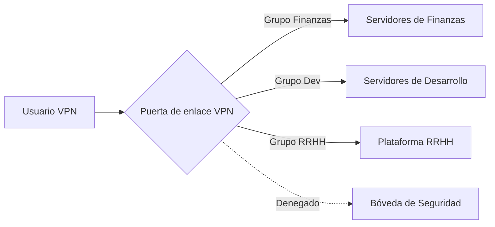

## 0.0 Resumen ejecutivo: Por qué las VPN siguen siendo importantes en un mundo de Zero Trust

En la empresa moderna, el "perímetro" se ha evaporado en gran medida. Sin embargo, la Red Privada Virtual (VPN) sigue siendo una herramienta crítica para la gestión de infraestructura, el acceso administrativo seguro y la conexión con aplicaciones heredadas. Esta guía está diseñada para un entorno de 300 usuarios, una escala donde la gestión manual se vuelve imposible, pero las soluciones para "grandes empresas" podrían ser excesivas.

Nos centramos en **WireGuard** como nuestro protocolo principal debido a su alto rendimiento, primitivas criptográficas modernas y base de código simplificada, al tiempo que reconocemos el papel de OpenVPN e IPsec para casos de uso específicos.

## 0.1 Cómo leer esta guía

Este documento construye una pila técnica progresiva. Pasamos de modelos conceptuales de alto nivel a detalles de implementación de bajo nivel y manuales operativos.

- **Secciones 1.0–3.0:** Conceptos fundamentales (El "Qué").
- **Secciones 4.0–8.0:** Arquitectura y diseño (El "Por qué").

- **Secciones 9.0–13.0:** Identidad y seguridad (El "Cómo").
- **Secciones 14.0–18.0:** Ingeniería avanzada y escalado (Lo "Difícil").

- **Apéndices:** Plantillas de configuración del mundo real y resolución de problemas.

:::tip[Perspectiva del operador]
Una VPN no es una solución de seguridad por sí sola; es una **capa de transporte** que debe estar regida por un Proveedor de Identidad (IdP) robusto y políticas de egreso estrictas. Nunca permita el enrutamiento "Any/Any" (Cualquiera/Cualquiera) dentro de su túnel.
:::

---

## 1.0 Fundamentos de la VPN: La capa superpuesta cifrada

En esencia, una VPN crea una conexión virtual punto a punto a través de una red física no confiable. En un contexto empresarial, esto implica típicamente un túnel cifrado entre un dispositivo cliente (portátil, teléfono) y una puerta de enlace central.

### 1.1 El ciclo de vida de una conexión

Cuando un usuario inicia una conexión VPN, ocurre la siguiente secuencia:

1. **Autenticación:** El cliente demuestra su identidad (a menudo mediante certificados o credenciales respaldadas por MFA).
2. **Intercambio de claves:** El cliente y el servidor negocian las claves de sesión utilizando un protocolo como Diffie-Hellman o Noise.
3. **Instanciación del túnel:** Se crea una interfaz de red virtual (p. ej., `wg0` o `tun0`) en ambos extremos.
4. **Inyección de enrutamiento:** Se actualiza la tabla de rutas del sistema para enviar rangos de IP específicos a través de la interfaz virtual.
5. **Encapsulamiento:** Los paquetes salientes se envuelven en un encabezado externo (UDP/TCP), se cifran y se envían a la puerta de enlace.
6. **Desencapsulamiento:** La puerta de enlace desenvuelve el paquete y lo reenvía al destino interno.

### 1.2 Encapsulamiento y sobrecarga (overhead)

Cada vez que envuelve un paquete en un túnel VPN, añade bytes.

- **Sobrecarga de WireGuard:** 32 bytes (encabezado IP + encabezado UDP + encabezado WireGuard).
- **Sobrecarga de OpenVPN:** 60-80 bytes (varía según el cifrado y el transporte).
Si su conexión a Internet estándar tiene un límite de 1500 bytes (MTU) y la VPN añade 32 bytes, su límite de datos real dentro del túnel es 1468. Si ignora esto, sus paquetes se "fragmentarán", lo que provocará velocidades lentas y sitios web que no cargan.

---

## 2.0 Terminología avanzada para ingenieros de redes

Para diseñar un sistema profesional, debe hablar el lenguaje del flujo de paquetes y la criptografía:

- **Capa de transporte (UDP vs. TCP):** Las VPN prefieren estrictamente UDP. El TCP sobre TCP (TCP Meltdown) causa una degradación catastrófica del rendimiento durante la pérdida de paquetes porque ambas capas intentan la retransmisión.
- **MTU (Maximum Transmission Unit):** El límite físico del tamaño de un paquete (normalmente 1500 bytes). Debido a que las VPN añaden encabezados (sobrecarga), la MTU interna debe ser menor (p. ej., 1420 para WireGuard) para evitar la fragmentación.

- **MSS Clamping:** Una técnica utilizada por los routers para interceptar los "handshakes" (apretones de manos) TCP y "ajustar" el Tamaño de Segmento Máximo para que quepa dentro de la MTU reducida de la VPN, evitando conexiones de "agujero negro" donde los encabezados caben pero las cargas útiles de datos no.
- **PFS (Perfect Forward Secrecy):** Una propiedad donde un compromiso de las claves a largo plazo no compromete las claves de sesión pasadas. Cada sesión utiliza una clave efímera única.

- **Split Tunneling (Túnel dividido):** Enrutar solo el tráfico de la empresa (p. ej., `10.0.0.0/8`) a través de la VPN mientras envía Netflix/YouTube a través del ISP local del usuario. Esencial para la conservación del ancho de banda.
- **Full Tunneling (Túnel completo/forzado):** Enrutar todo el tráfico a través de la VPN. Requerido para entornos de alto cumplimiento para garantizar que todo el tráfico web pase por los filtros corporativos de DNS y DLP (prevención de pérdida de datos).

- **CGNAT (Carrier-Grade NAT):** Cuando un ISP comparte una IP pública con muchos usuarios. Esto a menudo rompe las VPN tradicionales como IPsec, pero WireGuard lo maneja bien.
- **Perfect Forward Secrecy (PFS):** Si la clave privada a largo plazo de su servidor es robada hoy, el atacante no puede descifrar las sesiones que grabó ayer. Cada *handshake* genera una clave de sesión dinámica de un solo uso.

---

## 3.0 Análisis profundo de protocolos: WireGuard vs. El resto

Para 300 usuarios, su elección de protocolo determinará su carga de mantenimiento durante los próximos tres años.

### 3.1 WireGuard (El estándar de oro)

- **Pros:** ~4,000 líneas de código (auditable), criptografía de última generación (ChaCha20, Poly1305), *handshakes* casi instantáneos, rendimiento extremadamente alto.
- **Contras:** Sin estado por diseño (requiere gestión manual o una Capa de Coordinación como NetBird, Tailscale o Firezone para más de 300 usuarios).

- **Ideal para:** Equipos centrados en el rendimiento, usuarios móviles y entornos modernos de Linux/Cloud.

### 3.2 OpenVPN (El caballo de batalla heredado)

- **Pros:** Increíble flexibilidad, admite TCP (para evitar firewalls restrictivos), se ejecuta en casi cualquier cosa.
- **Contras:** Base de código masiva (más de 600 mil líneas), cambio de contexto lento (espacio de usuario vs. espacio de kernel), gestión compleja de certificados.

- **Ideal para:** Entornos que requieren un cumplimiento estricto basado en TLS o soporte para hardware heredado.

### 3.3 IKEv2/IPsec (La opción nativa)

- **Pros:** Alto rendimiento, soportado nativamente por Windows, iOS y macOS sin aplicaciones adicionales.
- **Contras:** Notoriamente difícil de configurar correctamente; "IPsec" tiene muchas variantes incompatibles.

- **Ideal para:** Despliegues de "cero instalaciones" donde no se pueden enviar clientes de terceros a los usuarios.

---

## 4.0 Arquitectura: Diseñando para 300 usuarios

Al escalar a 300 usuarios, ya no puede confiar en una única máquina Linux ejecutando un script de bash. Necesita una arquitectura que sobreviva a un fallo de hardware un viernes por la tarde.

### 4.1 Par de alta disponibilidad (HA)

Despliegue dos puertas de enlace VPN en una configuración Activo-Pasivo o Activo-Activo.

- **Keepalived/VRRP:** Use una IP Virtual (VIP). Si la Puerta de enlace A muere, la B toma la VIP en segundos.
- **Sincronización de estado:** Para protocolos como IPsec, es posible que necesite sincronizar estados de sesión para que los usuarios no pierdan su conexión durante una conmutación por error. (WireGuard es "silencioso" y se reconecta al instante, lo que facilita esto).

### 4.2 El modelo de "Puerta de enlace en cada continente"

Para una fuerza laboral distribuida, una sola puerta de enlace en Londres frustrará a los usuarios en Tokio.

- **IP Anycast:** Utilice un servicio Anycast basado en la nube para enrutar a los usuarios al nodo VPN saludable más cercano.
- **Geo-DNS:** Resuelva `vpn.company.com` a diferentes IPs regionales según la ubicación del usuario.

### 4.3 Escalado elástico (El camino nativo de la nube)

En AWS o Azure, coloque sus puertas de enlace VPN en un **Auto-Scaling Group**. Si el uso de CPU supera el 70%, la nube activa automáticamente una tercera puerta de enlace. Esto requiere un almacén de estado externo (como Redis) o una capa de coordinación para compartir las claves de usuario entre los nodos.

---

## 5.0 Objetivos de seguridad: Los "Cinco Pilares"

Su implementación debe demostrar que cumple con estos criterios antes de entrar en producción:

1. **Acceso basado en identidad:** Nadie entra sin una entrada válida en el IdP (p. ej., Entra ID, Okta, Google Workspace).
2. **Integridad criptográfica:** Use solo cifrados modernos. Deshabilite RSA-2048, SHA-1 y 3DES.
3. **Prevención de movimiento lateral:** Use un valor predeterminado de "Denegar todo". Los usuarios en el grupo `Marketing` no deberían poder hacer ping a la subred `Database`.
4. **Postura del endpoint:** Verifique si el dispositivo que se conecta tiene habilitado el cifrado de disco y un antivirus activo antes de permitir que se forme el túnel.
5. **Visibilidad:** Cada conexión, desconexión y *handshake* fallido debe registrarse en un sistema central SIEM (Security Information and Event Management).

---

## 6.0 Modelado de amenazas para su puerta de enlace VPN

La puerta de enlace VPN es un objetivo masivo. Si cae, el atacante está "dentro".

### 6.1 Amenazas internas (El "Administrador astuto")

- **Riesgo:** Una persona de IT crea una clave estática de "puerta trasera" para su portátil personal.
- **Mitigación:** MFA obligatorio para cada sesión. Sin excepciones. Registre todos los eventos de generación de claves y audítelos semanalmente. Use acceso "Just-In-Time" (JIT) para tareas administrativas.

### 6.2 Amenazas externas (El "Credential Stuffer")

- **Riesgo:** Los atacantes encuentran una contraseña filtrada e inician sesión como un ejecutivo.
- **Mitigación:** Vinculación al dispositivo. La VPN solo funciona si están presentes AMBOS, la contraseña Y el certificado de hardware/ID de dispositivo específico. Implemente limitación de tasa (rate limiting) en el endpoint de autenticación.

### 6.3 Amenazas de infraestructura (El "DDoS")

- **Riesgo:** La inundación UDP hace que la VPN sea inutilizable para todos.
- **Mitigación:** El mecanismo de "Cookie" de WireGuard para la protección contra DoS. Ignora los paquetes sin un MAC válido hasta que se prueba el *handshake*. Utilice un WAF (Web Application Firewall) basado en la nube para filtrar el tráfico malicioso en el borde.

---

## 7.0 Diseño de enrutamiento y subredes (Dificultad media)

El enrutamiento eficiente evita cuellos de botella de rendimiento y simplifica las reglas de seguridad.

### 7.1 Evitar colisiones de subredes

Muchos routers domésticos usan `192.168.1.0/24`. Si su red corporativa también usa ese rango, el usuario no podrá acceder a los recursos internos porque su ordenador piensa que el tráfico es "local" para su casa.

- **Estandarice en el espacio `10.x.x.x` o `172.16.x.x`.**
- **Use un segmento único para el pool de la VPN** (p. ej., `100.64.0.0/10` - rango Carrier Grade NAT) para evitar solapamientos.

### 7.2 La trampa del NAT

Si aplica NAT a todos a una sola IP cuando entran a la red, los registros de su firewall mostrarán todo el tráfico proveniente de "El servidor VPN". Pierde la capacidad de ver *qué* usuario accedió a *qué* servidor.

- **Solución:** Enrute la subred VPN directamente. Asegúrese de que los servidores internos tengan una ruta de vuelta a la puerta de enlace VPN para esas IPs.

---

## 8.0 Full Tunnel vs Split Tunnel: Un análisis contextual profundo

Esta decisión es a menudo política, no técnica.

### 8.1 El argumento a favor del Full Tunnel

- **Seguridad:** Puede forzar todo el tráfico web a través de una puerta de enlace segura (SWG). Esto evita que los usuarios visiten sitios de phishing o descarguen malware en horario laboral.
- **Privacidad:** Protege el tráfico del usuario de espionaje en redes Wi-Fi públicas (hoteles, cafeterías).

- **Cumplimiento:** Muchas industrias (finanzas, salud) requieren túneles completos para cumplir con las leyes de protección de datos.

### 8.2 El argumento a favor del Split Tunnel

- **Rendimiento:** Las llamadas de Zoom/Teams no necesitan ir a su centro de datos y volver a salir; que vayan directamente a Internet.
- **Coste:** No paga por el ancho de banda de un usuario que ve YouTube en 4K durante su pausa para el almuerzo.

- **Esfuerzo del hardware:** Su puerta de enlace VPN no tiene que procesar gigabytes de tráfico inofensivo (como Netflix).

:::caution[El punto intermedio híbrido]
La mayoría de las empresas modernas utilizan **Split Inclusion**. Incluya sus rangos CIDR internos (p. ej., `10.0.0.0/8`) y IPs de SaaS específicas, pero deje el resto del mundo al ISP local.
:::

---

## 9.0 Arquitectura de identidad: Conectando la VPN a la realidad

Para 300 usuarios, no puede gestionar usuarios locales de Linux en la puerta de enlace. Necesita un puente de identidad.

### 9.1 El bucle de identidad

1. **La aplicación cliente** solicita un inicio de sesión.
2. **La puerta de enlace** redirige al usuario a la página de inicio de sesión OIDC/SAML (Okta/Entra ID).
3. **El usuario** completa MFA (FIDO2, aplicación de autenticación).
4. **El IdP** envía un token (JWT) de vuelta a la puerta de enlace.
5. **La puerta de enlace** genera una clave de WireGuard de corta duración y la envía al cliente.

### 9.2 Estrategia de implementación de MFA

- **Evite SMS:** Es vulnerable al intercambio de SIM (SIM swapping) e interceptaciones SS7.
- **Prefiera TOTP o WebAuthn:** Si se toma en serio la seguridad, exija una llave de hardware (Yubikey) para el acceso VPN. FIDO2 es la cima de la seguridad de autenticación moderna.

---

## 10.0 Listas de control de acceso (ACLs) y microsegmentación

Una VPN no debería ser una red "plana".



### 10.1 Implementación de RBAC

- Asigne grupos de IdP a etiquetas de red.
- Si usa **WireGuard**, use una herramienta como **NetBird** o **Tailscale** para definir estas reglas a través de una interfaz web.

- Si usa **Linux/Iptables**, necesita un script dinámico que actualice las reglas cuando un usuario se conecta. Esto a menudo se llama "Política de firewall dinámica".

---

## 11.0 Monitoreo y registro: Ser el "Ojo en el cielo"

Si alguien pregunta "¿Quién accedió al servidor de respaldo a las 2 AM?", sus registros de VPN deben tener la respuesta.

### 11.1 Métricas vitales a seguir

- **Sesiones simultáneas:** ¿Estamos alcanzando nuestros límites de CPU/RAM de hardware?
- **Rendimiento de datos por usuario:** ¿Alguien está exfiltrando datos (carga inusualmente alta en relación con su función)?

- **Latencia de handshake:** ¿Está lento el servidor de autenticación?
- **Paquetes perdidos:** Indicativo de problemas de MTU o estrangulamiento del ISP.

### 11.2 Integración SIEM

Transmita sus registros a Elasticsearch, Splunk o Azure Monitor. Busque "viajes imposibles": un usuario iniciando sesión desde Nueva York y luego, 10 minutos después, desde Frankfurt. Este es un indicador principal de un token de sesión robado.

---

## 12.0 Resolviendo el dolor de cabeza de MTU/MSS (Difícil)

Esta es la causa número 1 de los tickets de soporte técnico de VPN. Un usuario se conecta, pero no puede abrir sitios web grandes ni enviar correos electrónicos.

### 12.1 La prueba del "Ping de la muerte"

Si su VPN está activa pero los datos están bloqueados, ejecute:
`ping -M do -s 1400 10.0.0.1` (en Linux) o `ping 10.0.0.1 -f -l 1400` (en Windows).
Siga reduciendo `1400` hasta que el ping sea exitoso. Esa es la MTU de su ruta.

### 12.2 La solución

- Establezca la MTU de WireGuard en `1280` (el mínimo más seguro para IPv6).
- Habilite MSS Clamping en su puerta de enlace:
    `iptables -t mangle -A FORWARD -p tcp --tcp-flags SYN,RST SYN -j TCPMSS --clamp-mss-to-pmtu`
Esto asegura que su servidor le diga al servidor remoto que reduzca sus paquetes antes de que lleguen al túnel VPN.

---

## 13.0 Alta disponibilidad y balanceo de carga (Difícil)

Para soportar 300 usuarios sin tiempo de inactividad, necesita redundancia.

### 13.1 DNS Round-Robin

La forma más simple. Apunte `vpn.company.com` a tres direcciones IP diferentes. El cliente elige una al azar. Si una falla, es posible que el usuario tenga que reconectarse 2 o 3 veces para obtener un servidor "en vivo".

### 13.2 Balanceadores de carga TCP/UDP

Utilice un balanceador de carga en la nube (como AWS NLB o Azure Load Balancer). Realiza comprobaciones de estado y solo envía tráfico a las puertas de enlace que funcionan. Nota: Esto puede ser complicado con WireGuard porque no tiene conexión (UDP). Debe usar "Persistencia de sesión" basada en la IP de origen.

---

## 14.0 Recuperación ante desastres (DR) para la VPN

¿Qué pasa si su centro de datos principal se queda sin luz?

- **Copia de seguridad en la nube:** Tenga siempre una puerta de enlace "en espera" (Cold Standby) en una región de nube diferente (p. ej., AWS vs GCP).
- **Configuración como código:** Almacene sus configuraciones VPN en Git. Si un servidor muere, debería poder levantar uno nuevo en 5 minutos usando Terraform o Ansible. La "inmutabilidad" es su mejor amiga en DR.

- **Claves de emergencia:** Guarde un juego de claves físicas de "rotura de cristal" en una caja fuerte, en caso de que el propio IdP esté caído.

---

## 15.0 Excelencia operativa: La experiencia del desarrollador

Una VPN segura que sea difícil de usar será evadida por sus ingenieros más talentosos.

- **Conexión automática:** Configure el cliente para que se active siempre que el usuario no esté en el Wi-Fi de la oficina corporativa.
- **Integración SSO:** Un clic para iniciar sesión. Sin contraseñas separadas ni archivos de clave complejos para que el usuario los gestione.

- **Actualizaciones silenciosas:** Use un MDM (Jamf, InTune) para enviar actualizaciones del cliente sin molestar al usuario.
- **Nombres de host amigables:** Asegúrese de que su DNS interno (p. ej., `jira.int.company.com`) funcione a través de la VPN para que los usuarios no tengan que recordar direcciones IP.

---

## 16.0 Cumplimiento y auditoría (La parte "aburrida" pero vital)

Si está sujeto a SOC2, HIPAA o GDPR, su VPN es un control crítico.

- **Rastro de auditoría:** Registre cada vez que un administrador cambie una ACL.
- **Terminación de sesión:** Expulse automáticamente a los usuarios después de 12 o 24 horas para forzar una reautenticación con MFA. Esto evita "túneles eternos" en portátiles robados.

- **Residencia de datos:** Si está en la UE, asegúrese de que sus puertas de enlace VPN no estén enrutando tráfico a través de nodos en jurisdicciones no conformes (como ciertos centros de datos con sede en EE. UU.).

---

## 17.0 Optimización del rendimiento a nivel de kernel

Para obtener la máxima velocidad, ajuste el kernel de Linux en sus puertas de enlace. Estos cambios permiten que el servidor maneje más de 10,000 paquetes por segundo sin esfuerzo.

```bash
# Aumentar la longitud de la cola de paquetes
sysctl -w net.core.netdev_max_backlog=5000
# Aumentar el tamaño de los búferes de recepción/envío (16MB)
sysctl -w net.core.rmem_max=16777216
sysctl -w net.core.wmem_max=16777216
# Habilitar BBR para TCP
sysctl -w net.core.default_qdisc=fq
sysctl -w net.ipv4.tcp_congestion_control=bbr
```

### 17.1 Soporte Multiqueue

Los servidores modernos tienen más de 16 núcleos de CPU. WireGuard maneja esto bien de forma predeterminada, pero asegúrese de que la tarjeta de interfaz de red (NIC) de su servidor esté configurada para distribuir las solicitudes de interrupción (IRQs) entre todos los núcleos. Verifique `/proc/interrupts` para verificar. Si todas las interrupciones llegan al Núcleo 0, su rendimiento se estancará.

---

## 18.0 Preparándose para el futuro: ZTNA y el mundo post-VPN

La industria se está moviendo hacia el Acceso a la Red Zero Trust (ZTNA).

- **Idea:** En lugar de dar a un usuario "acceso a la red", le da "acceso a la aplicación" a través de un proxy inverso.
- **Cronología:** Comience a migrar aplicaciones basadas en web a ZTNA (Cloudflare Tunnel, Zscaler, Pomerium) mientras mantiene la VPN para aplicaciones cliente pesadas y gestión de servidores. La VPN se convierte en el "Plano de Administración" mientras que ZTNA se convierte en el "Plano de Usuario".

---

## 19.0 Escenarios de resolución de problemas: Lecciones del mundo real

### Escenario A: La "videollamada lenta"

**Síntoma:** El usuario dice que Zoom funciona bien en el Wi-Fi de su casa pero se corta en la VPN.
**Diagnóstico:** El usuario está en una red de "largo alcance y alta latencia" (tubería larga y gorda). El control de congestión TCP estándar (Cubic) falla aquí porque piensa que la latencia es una señal de congestión.

**Solución:** Cambie la puerta de enlace a BBR (como se muestra en la Sección 17.0). BBR mide el ancho de banda real y maneja la latencia con mucha más gracia.

### Escenario B: La "sesión zombie"

**Síntoma:** El panel muestra que un usuario está conectado, pero el usuario dice que se desconectó hace 4 horas.
**Diagnóstico:** El Internet del cliente se cayó abruptamente (el túnel entró en un ascensor) y la puerta de enlace nunca recibió un paquete de "adiós". Debido a que UDP no tiene conexión, el servidor mantiene la sesión viva.

**Solución:** Reduzca `PersistentKeepalive` e implemente un tiempo de espera de "Detección de pares muertos" (DPD) en el lado del servidor de 10 minutos.

### Escenario C: El "sitio interno cargando para siempre"

**Síntoma:** El título de la página aparece en la pestaña del navegador, pero el contenido de la página nunca carga.
**Diagnóstico:** Desajuste de MTU. Los paquetes pequeños de *handshake* caben, pero los paquetes de datos grandes (HTML/Imágenes) están siendo descartados por un router en el medio.

**Solución:** Implemente MSS Clamping en la puerta de enlace (Sección 12.2).

---

## 20.0 Inicio rápido de CLI para Linux, Mac y Windows

### 20.1 Linux (Cliente)

```bash
# Instalar
sudo apt install wireguard
# Configurar
sudo nano /etc/wireguard/wg0.conf
# Activar
sudo wg-quick up wg0
```

### 20.2 macOS (Cliente)

Use la aplicación oficial de Mac App Store para obtener la mejor experiencia, o use Homebrew para la CLI:

```bash
brew install wireguard-tools
sudo wg-quick up ./myconfig.conf
```

### 20.3 Windows (Cliente)

Use el instalador MSI oficial desde `wireguard.com`. Instala un servicio del sistema que permite a los no administradores activar/desactivar la VPN (si se configura correctamente).

---

## Apéndice A: Configuración del servidor base WireGuard (Ubuntu 22.04)

```ini
# /etc/wireguard/wg0.conf
[Interface]
PrivateKey = <SERVER_PRIVATE_KEY>
Address = 10.0.0.1/24
ListenPort = 51820

# Forzar MTU para evitar fragmentación
MTU = 1420

# PostUp/PostDown para enrutamiento
PostUp = iptables -A FORWARD -i %i -j ACCEPT; iptables -t nat -A POSTROUTING -o eth0 -j MASQUERADE
PostDown = iptables -D FORWARD -i %i -j ACCEPT; iptables -t nat -D POSTROUTING -o eth0 -j MASQUERADE

[Peer]
# Miembro del personal 1
PublicKey = <CLIENT_PUBLIC_KEY>
AllowedIPs = 10.0.0.2/32
```

## Apéndice B: Configuración avanzada del cliente Linux

```bash
# Generar claves
wg genkey | tee privatekey | wg pubkey > publickey
# Crear configuración
sudo nano /etc/wireguard/wg0.conf
# Iniciar servicio permanentemente
sudo systemctl enable --now wg-quick@wg0
```

## Apéndice C: Lista de verificación para resolución de problemas

1. **¿No puede conectarse?** -> Compruebe si el puerto UDP 51820 está abierto en el firewall corporativo.
2. **¿Conectado pero sin Internet?** -> Compruebe que `sysctl net.ipv4.ip_forward` esté configurado en `1`.
3. **¿Rendimiento lento?** -> Reduzca la MTU a `1280`.
4. **¿Aplicaciones específicas fallando?** -> Compruebe las reglas de MSS Clamping.
5. **¿Fallos de DNS?** -> Asegúrese de que `/etc/resolv.conf` en el cliente apunte al servidor DNS interno o use la directiva `DNS = 10.0.0.1` en `wg0.conf`.

---

## Conclusión: Reflexiones finales para el arquitecto

Construir una VPN para 300 usuarios es un acto de equilibrio entre **Seguridad**, **Privacidad** y **Usabilidad**. Al elegir un protocolo moderno como WireGuard, automatizar su flujo de identidad y respetar las leyes de las redes (MTU/MSS), puede construir un sistema que sea invisible para los usuarios e impenetrable para los atacantes.

La VPN más exitosa es aquella que nadie sabe que se está ejecutando. Manténgase paranoico, mantenga los registros y siempre pruebe su conmutación por error antes de necesitarla.

---

## 21.0 Configuración criptográfica avanzada para túneles seguros

Aunque WireGuard e IPsec proporcionan una seguridad robusta desde el primer momento, los entornos empresariales a menudo requieren un endurecimiento criptográfico explícito para cumplir con los estándares regulatorios como FIPS 140-2 o las directrices NIST.

### 21.1 Selección de cifrado (La pila moderna)

En un mundo con un potencial de computación cuántica creciente, elegir los cifrados correctos es vital:

- **KEM (Mecanismos de encapsulación de claves):** Comience a investigar algoritmos poscuánticos como **Kyber** o **McEliece**. Aunque aún no son estándar en la mayoría de los clientes VPN, están alcanzando la fase de "soporte experimental" en algunas variantes de WireGuard.
- **AEAD (Cifrado autenticado con datos asociados):** Use siempre cifrados capaces de AEAD como **ChaCha20-Poly1305** o **AES-GCM**. Estos proporcionan tanto confidencialidad como integridad en una sola pasada, evitando ataques de "maleabilidad del texto cifrado".

### 21.2 El marco del protocolo Noise

WireGuard está construido sobre el **Marco del Protocolo Noise**. Este marco permite *handshakes* de "1-RTT", lo que significa que la conexión se establece en un solo viaje de ida y vuelta. Es por eso que WireGuard se siente significativamente más rápido que el *handshake* de 4 vías requerido por protocolos más antiguos.

---

## 22.0 Integración de VPN nativa en la nube (AWS, GCP, Azure)

Si sus 300 usuarios acceden principalmente a recursos en una nube pública, su arquitectura VPN debería reflejar eso.

### 22.1 AWS Transit Gateway (TGW)

En lugar de conectar a cada usuario a una puerta de enlace en una VPC, conéctelos a una **VPN de cliente de AWS** asociada con un Transit Gateway.

- **Beneficio:** El Transit Gateway actúa como un router central para todas sus VPCs. Cualquier VPC nueva que cree es accesible al instante por la VPN sin reconfigurar las puertas de enlace.
- **Seguridad:** Puede aplicar Grupos de Seguridad a las conexiones de TGW, creando un punto de control central.

### 22.2 Azure Virtual WAN

Para organizaciones fuertemente invertidas en Microsoft 365 y Azure, **Azure Virtual WAN** proporciona un modelo de conectividad global de "sucursal a la nube".

- **Punto a sitio (P2S):** Este es el término de Azure para la VPN de usuario a puerta de enlace. Admite OpenVPN e IKEv2 y se integra de forma nativa con Microsoft Entra ID (anteriormente Azure AD) para MFA.

---

## 23.0 Gestionando la latencia de la VPN: Las leyes de la física

No importa cuán rápido sea su servidor, no puede vencer la velocidad de la luz. Sin embargo, puede optimizar la "última milla" y la "milla media".

### 23.1 Reducción de la latencia de handshake

En regiones de alta latencia (p. ej., usuarios en Sudamérica conectándose a un servidor con sede en Virginia), cada viaje de ida y vuelta adicional en el *handshake* añade 500ms de tiempo de espera.

- **Solución:** Use protocolos basados en UDP (WireGuard) que requieran mínimos viajes de ida y vuelta. Evite las VPN basadas en TCP a toda costa.

### 23.2 Optimización de la "milla media"

Los grandes proveedores de la nube (AWS, Cloudflare, Google) tienen redes troncales de fibra privada que son un 30-40% más rápidas que la Internet pública.

- **Técnica:** Haga que el usuario se conecte a un punto de entrada "local" (PoP) cerca de su casa. Ese PoP luego lleva el tráfico a través de la red troncal privada del proveedor hasta su centro de datos central. Este es el secreto detrás de la velocidad de **Tailscale** (a través de sus relés DERP) y **Cloudflare Warp**.

---

## 24.0 Conclusión: La última palabra sobre la resiliencia

Al final del día, una VPN para 300 usuarios es una pieza de **infraestructura de misión crítica**. Si la VPN está caída, la empresa deja de funcionar.

1. **La redundancia es clave.** (Dos nodos son uno; un nodo es ninguno).
2. **La identidad es el perímetro.** (MFA no es opcional).
3. **El rendimiento es binario.** (Si es lento, los usuarios no lo usarán).
4. **El registro es la verdad.** (Si no está registrado, no sucedió).

Manténgase diligente, monitoree las caídas de sus paquetes y mantenga siempre sus claves privadas en privado.