## El Terreno Cambia por Última Vez

Después de cuatro volúmenes, hemos construido muros ([I](/posts/secure_systems_architecture/)), verificado cada principio en cada puerta ([II](/posts/identity_and_access_in_depth/)), hecho nuestros mensajes infalsificables ([III](/posts/cryptography_engineering_in_depth/)), y aprendido a detectar y sobrevivir a la brecha que de todas formas se abre paso ([IV](/posts/detection_and_response_in_depth/)). Cada una de esas ideas asumía algo que, en silencio, dejó de ser cierto: que existe un *server*, una *machine*, una *thing* que persiste, que tú posees y que puedes señalar.

En el mundo cloud-native, esa suposición se disuelve:

* El "servidor" es un **contenedor** que vive noventa segundos y es reemplazado por un gemelo idéntico.
* La infraestructura no está en racks; es un **archivo YAML** que un pipeline aplica.
* La aplicación no es algo que escribiste; es **tu código más dos mil dependencias** que no escribiste, ensambladas por un sistema de compilación que te costaría auditar completamente.

Este final trata sobre cómo defender *ese* mundo, donde el perímetro ha desaparecido por completo, las cargas de trabajo son "cattle not pets", y las brechas más devastadoras de la década no llegan por tu puerta principal, sino a través de tu **cadena de suministro**. Todo lo que la serie enseñó sigue aplicándose, pero las superficies a las que se aplica ahora parpadean, entrando y saliendo de la existencia miles de veces al día.

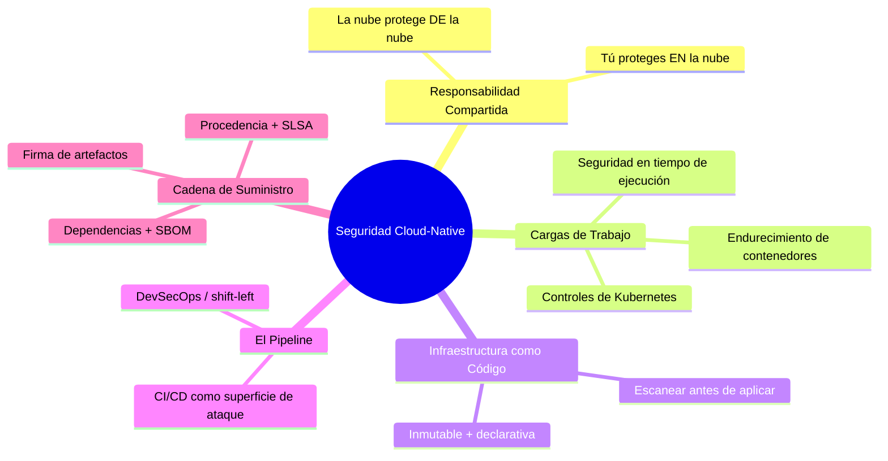

---

## Parte I: El Modelo de Responsabilidad Compartida

La primera y más incomprendida idea en seguridad en la nube: **el proveedor de la nube no protege tu aplicación.** Ellos protegen la *infraestructura* sobre la que corre la nube; tú proteges lo que *pones en* ella. La línea se mueve dependiendo del modelo de servicio, y las brechas residen en la confusión sobre dónde se sitúa [^1]:

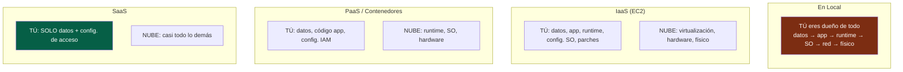

:::important[Tu responsabilidad nunca llega a cero]
Observa la constante en cada columna: **siempre eres dueño de tus datos y de tu configuración de acceso.** La abrumadora mayoría de las "brechas en la nube" no son un hackeo al proveedor, sino una *mala configuración del cliente*: un bucket S3 público, un rol IAM con demasiados permisos, una base de datos expuesta a `0.0.0.0/0`. La nube te ofrece primitivas potentes con valores predeterminados de "desactivado"; dejarlas así es tu responsabilidad. La mala configuración, no el compromiso del proveedor, es la causa número uno de la exposición de datos en la nube. [^2]
:::

---

## Parte II: Protegiendo la Carga de Trabajo

### Capítulo 1: Seguridad de Contenedores - La Realidad en Capas

Un contenedor no es una VM ligera; es un conjunto de *procesos* aislados en un **kernel de host compartido**. Ese único hecho impulsa todo su modelo de amenazas, y la defensa se organiza en capas, desde la imagen hasta el tiempo de ejecución:

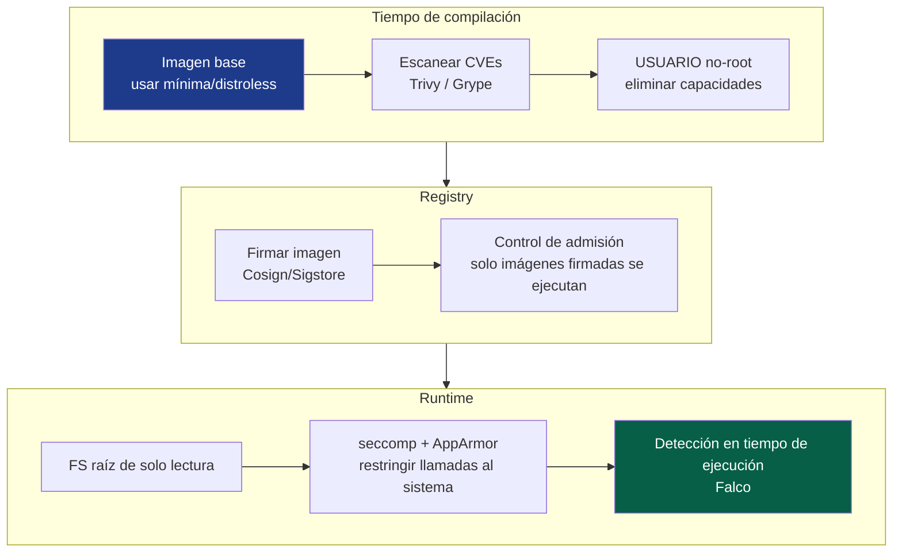

Las prácticas más influyentes en contenedores, en orden de beneficio:

*   **Imágenes base mínimas** - una imagen `distroless` o `scratch` contiene tu aplicación y *nada más*: sin shell, sin gestor de paquetes, sin `curl`. Un atacante que logre entrar no tiene herramientas para pivotar. También reduce la superficie de CVEs en un orden de magnitud; sin paquetes de SO, no hay vulnerabilidades de paquetes de SO.
*   **Nunca ejecutar como root** - un proceso de contenedor que se ejecuta como root y escapa del contenedor es root *en el host*. Establece un `USER` no-root, elimina todas las capacidades de Linux y añade solo lo necesario.
*   **Sistema de archivos raíz de solo lectura** - si el contenedor no puede escribir en su propio sistema de archivos, un atacante no puede soltar una carga útil en él.
*   **Escanear cada imagen** - `Trivy`/`Grype` en CI, bloquea la compilación en caso de CVEs críticas.

:::warning[El escape del contenedor es el quid de la cuestión]
Dado que los contenedores comparten el kernel del host, un **exploit del kernel o una mala configuración es una toma de control completa del host**, y desde un host, a menudo, de todo el clúster. Los pecados cardinales que hacen esto trivial: ejecutar `--privileged`, montar el socket de Docker (`/var/run/docker.sock`) en un contenedor (eso es root en el host, envuelto para regalo) y ejecutar como `UID 0`. Trata un contenedor privilegiado como una decisión que requiere el mismo escrutinio que otorgar `sudo`. [^3]
:::

### Capítulo 2: Kubernetes - Endureciendo el Orquestador

Kubernetes es un sistema operativo distribuido para contenedores, y su seguridad es un tema en sí mismo. La superficie de ataque abarca cuatro frentes, memorizados como las **4 C's de la Seguridad Cloud Native**: Cloud, Clúster, Contenedor, Código [^4].

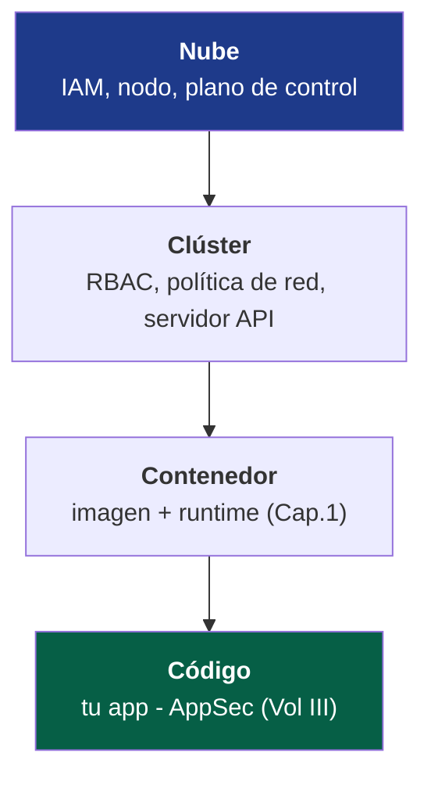

Los controles de clúster de soporte de carga, cada uno cerrando una ruta de ataque específica:

::::steps

:::step[RBAC - Privilegio mínimo para la API]{subtitle="Quién puede hacer qué en el clúster"}
El servidor API de Kubernetes es la joya de la corona; quien lo controla, controla cada carga de trabajo. Aplica las lecciones de privilegio mínimo del Volumen II: no uses `cluster-admin` con comodines para cuentas de servicio, delimita los roles a espacios de nombres y nunca montes el token de cuenta de servicio predeterminado donde no sea necesario. Un pod con un token sobre-privilegiado es un punto de pivote directo para la toma de control del clúster.
:::

:::step[Políticas de Red - denegar por defecto]{subtitle="Segmentación este-oeste"}
Por defecto, *cada pod puede hablar con cada otro pod*, una red plana y confiable, exactamente el modelo de red contra el que el Volumen I advertía. Aplica una **NetworkPolicy** de **denegación por defecto** y permite explícitamente solo los flujos requeridos. Esto es microsegmentación (Vol I/II) aplicada a la red de pods: convierte un pod comprometido de una plataforma de lanzamiento en un callejón sin salida.
:::

:::step[Estándares de Seguridad de Pods - restringir lo peligroso]{subtitle="Hacer cumplir las reglas del contenedor"}
Aplica el Estándar de Seguridad de Pods **Restringido**: no pods privilegiados, no compartir el espacio de nombres del host, solo no-root, FS raíz de solo lectura. Aquí es donde las reglas de contenedores del Capítulo 1 son *mandatorias* por la plataforma en lugar de simplemente recomendadas a los desarrolladores.
:::

:::step[Secretos - no usar base64 como "cifrado"]{subtitle="Proteger lo sensible"}
Los Secretos de Kubernetes son solo **codificados en base64**, no cifrados, en `etcd` por defecto. Habilita el **cifrado en reposo** para `etcd` y, mejor aún, integra un gestor externo (Vault, KMS en la nube vía controlador CSI) para que los secretos nunca permanezcan en `etcd` en un formato recuperable. Cualquiera con acceso de lectura a `etcd` leería todos los secretos de lo contrario.
:::

::::

:::tip[El control de admisión es tu punto de estrangulamiento de políticas]
Cada objeto que ingresa al clúster pasa por el **controlador de admisión**, el lugar ideal para aplicar políticas como código. Herramientas como **OPA Gatekeeper** o **Kyverno** te permiten *rechazar* cargas de trabajo no conformes en la entrada: "ninguna imagen sin firma", "ningún contenedor sin límites de recursos", "sin etiquetas `latest`". Es el PEP del modelo Zero Trust del Volumen II, aplicado a la puerta principal del clúster. Una política aplicada en la admisión no puede ser olvidada por un desarrollador. [^5]
:::

### Capítulo 3: Seguridad en Tiempo de Ejecución - Asume que el Pod está Comprometido

Todo lo anterior es preventivo. Aplicando la mentalidad de *asumir-brecha* del Volumen IV a las cargas de trabajo: un contenedor *eventualmente* ejecutará algo que no debería. La **seguridad en tiempo de ejecución** observa el comportamiento en vivo y señala lo anómalo, un shell que se inicia dentro de un contenedor que solo debería ejecutar un proceso, una conexión saliente a una IP nunca antes vista, una escritura en `/etc/passwd`. Herramientas como **Falco** convierten el flujo de llamadas al sistema del kernel en detecciones, extendiendo la disciplina de SIEM/ingeniería de detección del Volumen IV hasta la carga de trabajo efímera.

---

## Parte III: Infraestructura como Código - Protegiendo el Plano

En el entorno cloud-native, la infraestructura se **declara, no se configura**: Terraform, CloudFormation, Pulumi. Esto es un *regalo* de seguridad: como toda la infraestructura es código, puedes **escanearla en busca de configuraciones erróneas antes de que exista un solo recurso.**

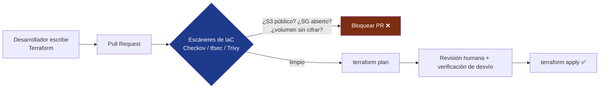

Esta es la máxima expresión de **shift-left** (el tema SSDLC del Volumen I): la mala configuración que habría causado una brecha, un grupo de seguridad abierto al mundo, una base de datos sin cifrar, un bucket público, se detecta en una revisión de código, *antes de que exista en producción*. El costo de corregir una vulnerabilidad crece por órdenes de magnitud cuanto más tarde se encuentra:

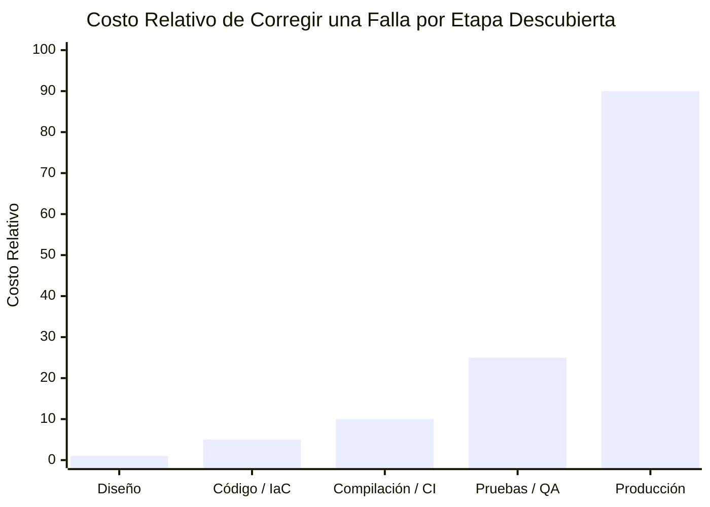

Cada paso a la derecha multiplica el costo, y una *brecha* en producción está completamente fuera de este gráfico. El escaneo de IaC es cómo se lleva la detección a la columna de menor costo posible.

:::note[La inmutabilidad es una propiedad de seguridad]
IaC permite la **infraestructura inmutable**: los servidores nunca se parchean en el sitio, se *reemplazan* a partir de una imagen conocida y buena. Esto resuelve discretamente dos problemas. La **desviación de configuración** (la lenta divergencia de "lo que se está ejecutando" de "lo que creemos que se está ejecutando") desaparece, porque cada despliegue se reconstruye desde la fuente. Y la **persistencia** del atacante se vuelve mucho más difícil; una puerta trasera plantada en un host en ejecución se borra la próxima vez que ese host se redepliega, lo que podría ser horas más tarde. "Cattle, not pets" es una postura de seguridad, no solo una conveniencia operativa.
:::

---

## Parte IV: La Cadena de Suministro - La Frontera de la Década

Aquí está la incómoda verdad del software moderno: **escribiste quizás el 5% de lo que entregas.** El otro 95% son dependencias de código abierto, imágenes base y herramientas de compilación, código de extraños, extraído de forma transitiva, ejecutándose con los privilegios completos de tu aplicación. La cadena de suministro es ahora la frontera más activamente explotada en seguridad, porque ¿por qué violar un objetivo endurecido cuando puedes comprometer algo en lo que *confía*?

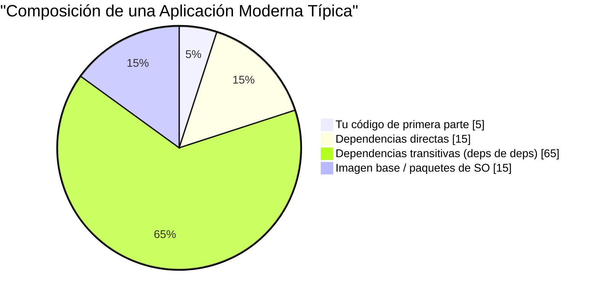

Esa gigantesca porción "transitiva" es el punto: tú *elegiste* tus 15 dependencias directas, pero heredaste cientos de las que nunca has oído hablar, cualquiera de las cuales puede poner fin a tu seguridad.

### Capítulo 4: La Anatomía de un Ataque a la Cadena de Suministro

Las catástrofes que definieron los últimos años, **SolarWinds** (2020, una cadena de compilación comprometida inyectó una puerta trasera en actualizaciones firmadas que se enviaron a 18,000 organizaciones) y **Log4Shell** (2021, un RCE trivialmente explotable en una biblioteca de registro incrustada en *millones* de aplicaciones) [^6], comparten una forma:

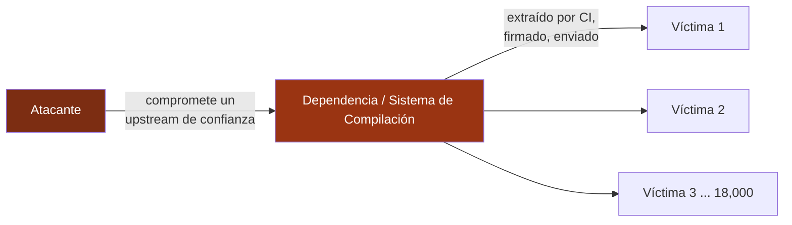

Un compromiso, miles de víctimas, todas las cuales hicieron todo lo demás bien. Esta asimetría es la razón por la que la seguridad de la cadena de suministro se convirtió en una prioridad de seguridad nacional, y por qué las defensas a continuación son ahora un estándar, no una sofisticación.

### Capítulo 5: Las Defensas Modernas - SBOM, Firma y SLSA

Tres prácticas interconectadas responden a las tres preguntas de la cadena de suministro: *qué contiene, es lo que dice ser y puedo confiar en cómo fue construido*:

| Defensa | Pregunta que responde | Qué es |
| --- | --- | --- |
| **SBOM** | *¿Qué hay realmente en mi software?* | Una Lista de Materiales de Software, un inventario legible por máquina de cada componente y versión. Cuando surja el próximo Log4Shell, revisas tus SBOMs y sabes en minutos, no semanas, si estás expuesto. [^7] |
| **Firma de artefactos** | *¿Es este artefacto genuino y no ha sido alterado?* | Firma criptográficamente las salidas de compilación (**Sigstore/Cosign**) para que los consumidores verifiquen la procedencia, aplicando las firmas del Volumen III a tus artefactos de compilación. |
| **SLSA** | *¿Puedo confiar en el proceso que lo construyó?* | Niveles de la Cadena de Suministro para Artefactos de Software, un marco graduado para la integridad de la compilación: fuente verificada, compilación aislada, procedencia generada y firmada. [^8] |

El pipeline seguro de extremo a extremo entrelaza esto con todo lo visto en esta serie:

```mermaid
flowchart LR
    SRC[Commit firmado<br/>+ protección de rama] --> DEP[Escaneo de dependencias<br/>+ fijar versiones + SBOM]
    DEP --> BUILD[Compilación aislada,<br/>efímera - procedencia SLSA]
    BUILD --> SAST[SAST + escaneo de secretos]
    SAST --> ART[Firmar artefacto<br/>Cosign]
    ART --> IMGSCAN[Escaneo CVE de imagen]
    IMGSCAN --> ADMIT[Control de admisión:<br/>verificar firma + política]
    ADMIT --> RUN[Seguridad en tiempo de ejecución<br/>Falco]
    style BUILD fill:#1e3a8a,color:#fff
    style ADMIT fill:#065f46,color:#fff
```

:::warning[El pipeline de CI/CD es en sí mismo un objetivo primordial]
Tu sistema de compilación tiene privilegios divinos: puede leer cada secreto, firmar cada artefacto y desplegar en producción. Un token de CI filtrado, una pull-request maliciosa que ejecuta código no confiable en un runner privilegiado, o una GitHub Action envenenada, es un camino directo para enviar software con puerta trasera *con tu propia firma válida*. Trata el pipeline como infraestructura de producción: tokens de mínimo privilegio (federados por OIDC, de corta duración, según el Volumen II), sin secretos en los logs, versiones de acciones fijadas (por SHA, no por etiqueta) y runners aislados y efímeros para código no confiable. El pipeline que construye tus defensas es un objetivo por la misma razón que lo es una casa de moneda: fabrica confianza. [^9]
:::

---

## Parte VI: DevSecOps - Haciendo la Seguridad Continua

Los cinco volúmenes convergen en un único cambio cultural. El modelo antiguo, un equipo de seguridad que revisaba el software al final y decía "no", no puede sobrevivir en un mundo que despliega mil veces al día. **DevSecOps** disuelve la barrera del equipo de seguridad y distribuye su experiencia *en el pipeline*, de modo que la seguridad es automatizada, continua y responsabilidad de todos.

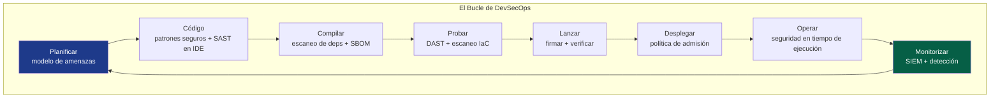

Cada nodo de ese bucle es un capítulo de esta serie, ahora automatizado e incrustado: modelado de amenazas (I), codificación segura y criptografía (III), escaneo de dependencias e IaC (V), firma (III/V), control de admisión y aplicación de Zero Trust (II), detección en tiempo de ejecución y SIEM (IV). La seguridad deja de ser una *fase* y se convierte en una *propiedad* del pipeline, verificada continuamente, aplicada por código, invisible cuando pasa y ruidosa solo cuando falla.

:::important[El núcleo cultural de todo]
DevSecOps es 20% herramientas y 80% cultura. Su creencia fundacional es que **la seguridad es una responsabilidad compartida, no el veto de un departamento.** Se llega a ello haciendo que el camino seguro sea el camino *fácil*: imágenes base endurecidas pre-aprobadas, plantillas seguras por defecto, módulos de IaC que cumplen las normas de fábrica y retroalimentación automatizada en segundos, en la pull request, no en una auditoría trimestral. Cuando hacer lo seguro es *menos* trabajo que hacer lo inseguro, la seguridad escala. Cuando es un impuesto, los desarrolladores lo evitan, siempre.
:::

---

## Conclusión: La Síntesis de la Serie

Comenzamos, en el Volumen I, en la capa física, un cable en una pared, un frame en un cable, y terminamos aquí, en un contenedor que existe durante noventa segundos dentro de una infraestructura que es, en sí misma, solo texto en un repositorio `git`. A lo largo de cinco volúmenes, una verdad se ha compuesto en cada nivel:

> **No hay un único control que asegure un sistema. La seguridad es profundidad, capas de controles independientes y superpuestos, cada uno asumiendo que el anterior fallará eventualmente.**

Mira hacia atrás a lo que se convirtió esa profundidad:

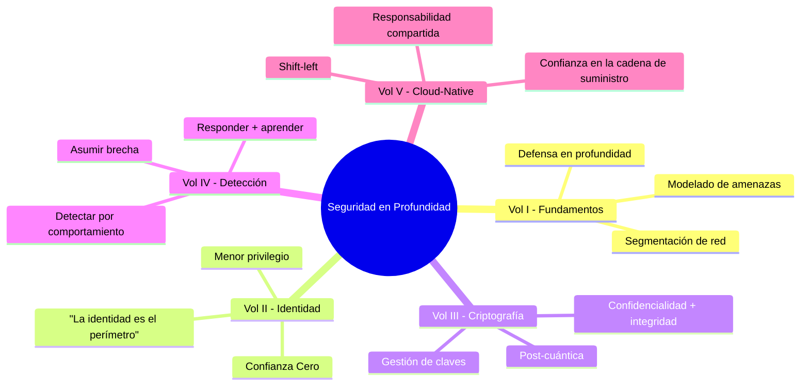

El firewall asume que la red podría ser vulnerada, por lo que la identidad verifica cada solicitud. La identidad asume que una credencial podría ser robada, por lo que la criptografía hace la sesión infalsificable y con secreto hacia adelante. La criptografía asume que un endpoint aún podría ser comprometido, por lo que la detección observa el comportamiento que lo delata. La detección asume que la carga de trabajo misma podría ser envenenada, por lo que la cadena de suministro demuestra que lo que enviamos es lo que construimos. Ninguno de estos controles confía en que los otros sean perfectos, y *esa desconfianza, ingenierizada en la arquitectura,* es todo el arte.

El perímetro se disolvió. Las máquinas se volvieron efímeras. El código se volvió mayormente de extraños. Y a través de todo esto, la disciplina se mantuvo: **capa tus defensas, verifica todo, asume la brecha, prueba la procedencia y nunca confíes en una sola pared como la última.** Eso es seguridad en profundidad. Ese es el trabajo.

Gracias por recorrer toda la pila. Ve y construye cosas que sean difíciles de romper, y lo suficientemente humildes como para sobrevivir si se rompen.

---

## Referencias

[^1]: [AWS - Modelo de Responsabilidad Compartida](https://aws.amazon.com/compliance/shared-responsibility-model/)
[^2]: [Gartner / CSA - Las Once Atrocidades: Principales Amenazas a la Seguridad en la Nube](https://cloudsecurityalliance.org/artifacts/top-threats-to-cloud-computing-egregious-eleven/)
[^3]: [NIST (2017) - SP 800-190: Guía de Seguridad de Contenedores de Aplicaciones](https://csrc.nist.gov/publications/detail/sp/800-190/final)
[^4]: [Kubernetes - Descripción General de la Seguridad Cloud Native (Las 4 C's)](https://kubernetes.io/docs/concepts/security/overview/)
[^5]: [Open Policy Agent - Gatekeeper](https://open-policy-agent.github.io/gatekeeper/website/docs/)
[^6]: [CISA - Guía de Vulnerabilidad de Apache Log4j](https://www.cisa.gov/uscert/apache-log4j-vulnerability-guidance)
[^7]: [NTIA - Lista de Materiales de Software (SBOM)](https://www.ntia.gov/SBOM)
[^8]: [SLSA - Niveles de la Cadena de Suministro para Artefactos de Software](https://slsa.dev/)
[^9]: [OWASP - Top 10 Riesgos de Seguridad de CI/CD](https://owasp.org/www-project-top-10-ci-cd-security-risks/)