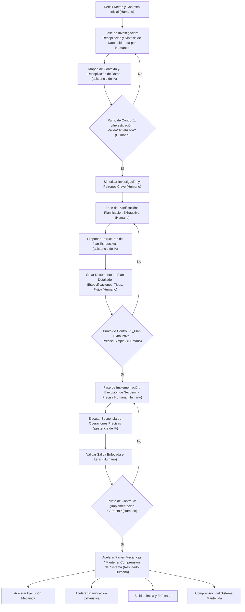

Actualmente, está ocurriendo un fenómeno silencioso en los equipos de ingeniería. Un desarrollador utiliza un agente de IA para generar una característica compleja. Las pruebas pasan. El código se implementa. Pero si le pides a ese desarrollador que explique la mecánica exacta de lo que se acaba de implementar, podría tener dificultades.

Estamos implementando código que no comprendemos completamente, y la velocidad a la que lo hacemos no tiene precedentes.

Las discusiones recientes en la industria, especialmente de líderes de ingeniería que abordan bases de código masivas en empresas, han puesto de relieve una paradoja evidente en el desarrollo de software moderno. Las herramientas de IA han convertido tareas que solían llevar días en meras horas. Pero los grandes sistemas de producción fallan inevitablemente, y cuando lo hacen, necesitas un humano que entienda profundamente el sistema para depurarlo.

No somos la primera generación en enfrentar una crisis de software, pero somos la primera en enfrentarla a una escala infinita de generación.

## La Ilusión de lo "Fácil"

Para entender por qué nuestras bases de código son cada vez más difíciles de comprender, tenemos que revisar una filosofía de ingeniería fundamental: la diferencia entre *simple* y *fácil*.

Como definió famosamente Rich Hickey (creador de Clojure), **simple** se refiere a la estructura. Significa que un componente hace una cosa y no está enredado con otros. **Fácil**, por otro lado, significa proximidad. Significa que la solución está fácilmente disponible a tu alcance, como descargar un paquete de npm, copiar un fragmento de Stack Overflow o consultar un LLM.

La simplicidad requiere reflexión, diseño y desentretejimiento arquitectónico deliberados. Lo "fácil" requiere casi nada de reflexión.

La IA es el botón definitivo de lo "fácil". En una interfaz de chat, no hay fricción para agregar funcionalidad. Le pides a una IA que agregue autenticación, luego OAuth, luego que parchee un error de sesión. En poco tiempo, no estás haciendo ingeniería de software; estás gestionando una ventana de contexto inflada. Debido a que los modelos de IA están ansiosos por complacer, simplemente superponen código nuevo sobre código antiguo, transformando la lógica para satisfacer tu última solicitud sin ninguna resistencia a malas decisiones arquitectónicas.

Cambiamos la simplicidad por la velocidad ahora, solo para pagar el precio en complejidad masiva más adelante.

## Complejidad Accidental en la Era de la IA

En su legendario artículo de 1986, *No Silver Bullet*, Fred Brooks dividió la complejidad del software en dos categorías:
1.  **Complejidad Esencial:** La dificultad fundamental de resolver el problema de negocio real.
2.  **Complejidad Accidental:** Las soluciones alternativas desordenadas, las abstracciones heredadas y la deuda técnica que creamos mientras intentamos implementar la solución.

En una base de código masiva y antigua, estos dos tipos de complejidad están profundamente entrelazados. Separarlos requiere contexto histórico e intuición humana.

Las herramientas de generación de IA luchan inmensamente con esto. Cuando un LLM escanea un repositorio, carece del juicio para diferenciar entre una regla de negocio central y una solución alternativa obsoleta y chapucera. Trata cada patrón existente como un requisito estricto a preservar. Si le pides a una IA que refactorice un sistema heredado profundamente acoplado, a menudo se saldrá de control, o bien se dará por vencida o recreará los patrones antiguos y rotos utilizando nueva sintaxis.

## La Solución: Desarrollo Basado en Especificaciones

Si el problema central es la falta de comprensión, la solución no es hacer consultas más difíciles o esperar un modelo más inteligente. La solución es cambiar por completo nuestra relación con la generación de código. Debemos pasar de escribir código a *especificar arquitectura*.

Esta metodología, a menudo denominada compresión de contexto o desarrollo basado en especificaciones, obliga al ingeniero humano a hacer el trabajo arduo de pensar antes de que la IA haga el trabajo mecánico de escribir. Típicamente implica tres fases distintas:

### 1. Investigación Guiada
En lugar de pedirle a la IA que comience a codificar, le proporcionas diagramas de arquitectura relevantes, documentación y fragmentos de código específicos. Le pides que mapee las dependencias e identifique casos extremos. Como humano, validas y corriges este análisis. El resultado no es código, sino un documento de investigación verificado.

### 2. Planificación de Alta Fidelidad
Utilizando la investigación, redactas un plan de implementación estricto. Esto incluye definir firmas de funciones, flujos de datos y límites de servicios. Este documento debe ser tan preciso que un ingeniero junior podría ejecutarlo sin tomar decisiones arquitectónicas. Aquí es donde eliminas activamente la complejidad accidental.

### 3. Implementación Restringida
Finalmente, entregas la especificación exacta y validada a la IA para que la ejecute. Debido a que la IA está fuertemente limitada por tu plano, no se adentra en "espirales de complejidad". Puedes revisar el código generado rápidamente porque simplemente lo estás verificando contra tu propio plan.

## El Futuro del Ingeniero

La parte más difícil de la ingeniería de software nunca ha sido escribir la sintaxis. Siempre ha sido saber *qué* escribir en primer lugar.

Si usamos la IA para eludir la fase de pensamiento crítico, nuestra intuición del sistema se atrofiará. Perderemos el instinto ganado con tanto esfuerzo que nos dice que una arquitectura específica es demasiado frágil o demasiado acoplada.

Los ingenieros que prosperen en la era de la IA no serán aquellos que generen el mayor volumen de código. Serán aquellos que mantengan una comprensión profunda y estructural de lo que están construyendo, que puedan ver las costuras arquitectónicas y que utilicen la IA para acelerar la mecánica mientras protegen ferozmente la simplicidad del diseño.

***