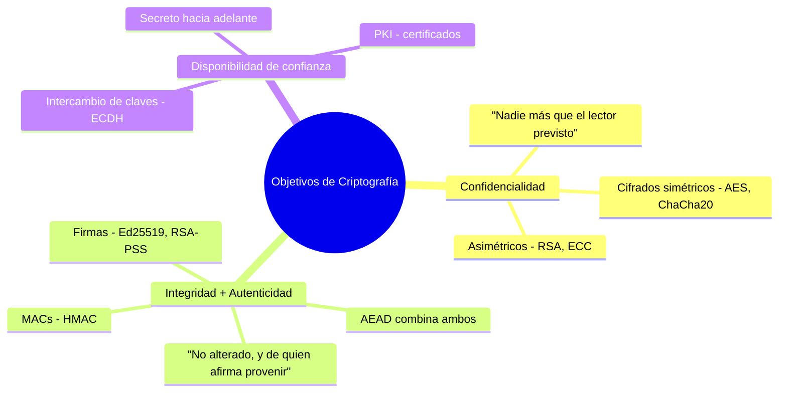
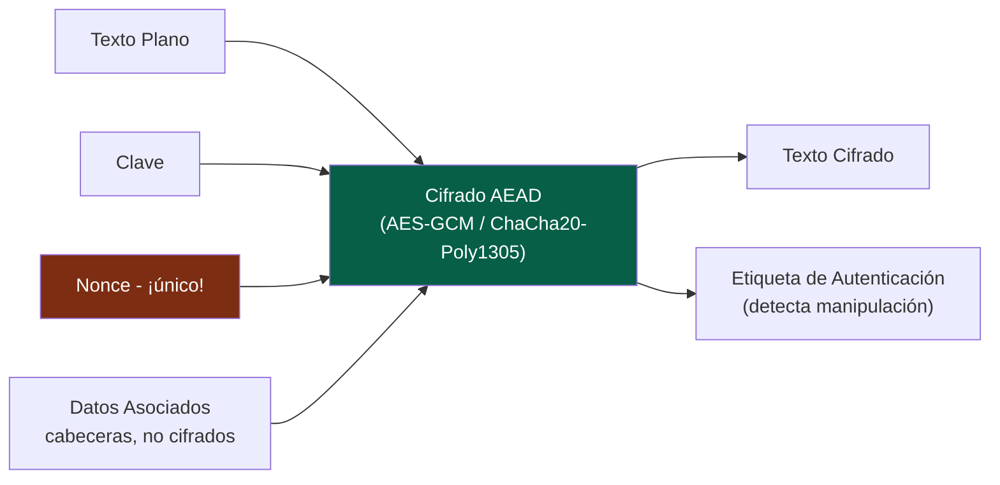
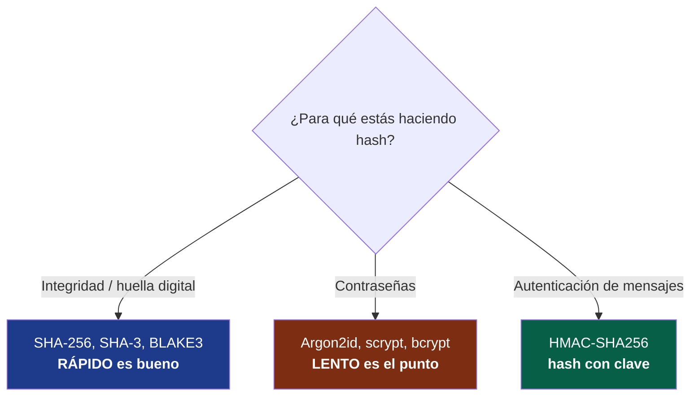
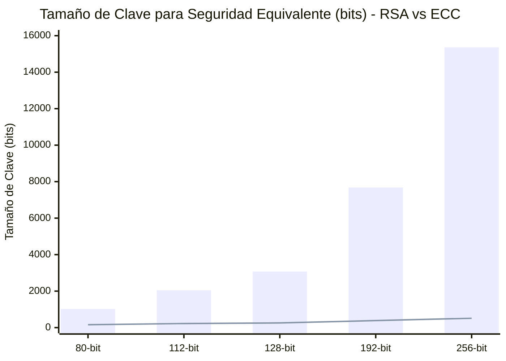
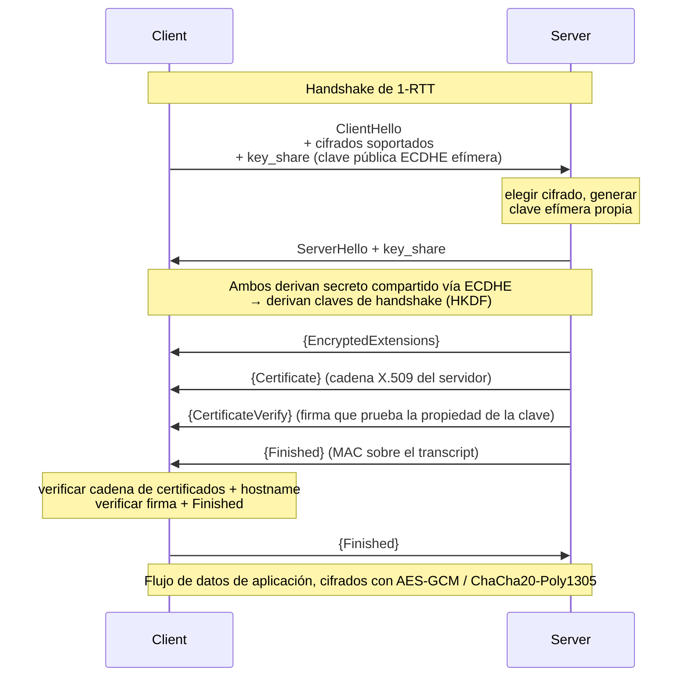
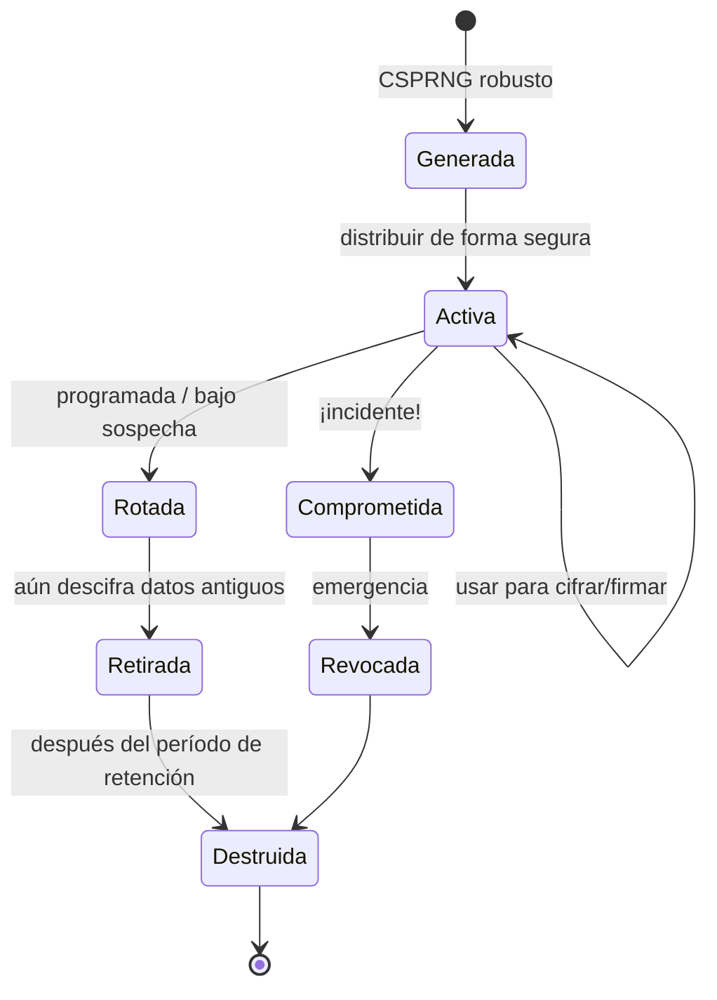
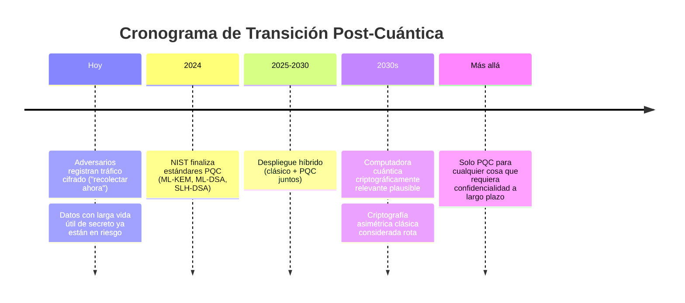
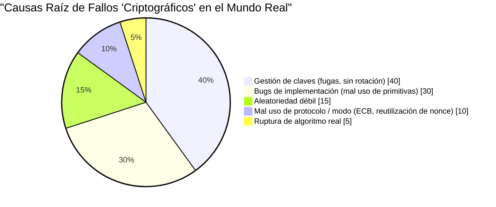

## La Caja Que Seguimos Cerrando

Dos veces ya esta serie se ha apoyado en la criptografía y ha gesticulado al respecto. [Volumen I](/posts/secure_systems_architecture/) dijo "usa TLS". [Volumen II](/posts/identity_and_access_in_depth/) dijo "la firma está ligada al origen" y "hash con Argon2id" y siguió adelante. Cada una de esas frases ocultaba una máquina de maquinaria exquisita y frágil.

Este volumen abre la caja.

El objetivo no es convertirte en un criptógrafo; ese camino atraviesa años de matemáticas y un sano temor a tu propia astucia. El objetivo es convertirte en un **ingeniero *de criptografía***: alguien que sabe qué primitiva resuelve qué problema, por qué los valores predeterminados seguros son seguros y, sobre todo, cómo reconocer el momento en que estás a punto de hacer algo catastrófico.

:::important[El Primer Mandamiento]
**No inventes tu propia criptografía. No implementes tus propias primitivas.** Ni el cifrado, ni el modo, ni el relleno, ni el generador de números aleatorios. Usa librerías de alto nivel y verificadas (libsodium, Tink, la criptografía nativa de la plataforma) que hagan de la elección segura la elección *predeterminada*. Todo en este volumen existe para que entiendas lo que hacen esas librerías, no para que las reconstruyas. Cada fallo criptográfico catastrófico en la historia comenzó con un ingeniero que pensó que esta regla no se aplicaba a él. [^1]
:::

---

## Parte I: Los Tres Objetivos y las Primitivas Que los Sirven

Toda la criptografía, en la práctica, sirve alguna combinación de tres objetivos:

Un cuarto objetivo, la **no-repudiación** (no puedes negar más tarde que lo firmaste), surge específicamente de las firmas digitales, y es la única propiedad que la criptografía simétrica *no puede* darte, porque ambas partes comparten la clave, cualquiera podría haber producido la etiqueta.

### Capítulo 1: Criptografía Simétrica - Rápida, Compartida y Modal

La criptografía simétrica usa **una clave compartida** tanto para el cifrado como para el descifrado. Es *rápida* (AES acelerado por hardware funciona a gigabytes por segundo) pero tiene un problema difícil: **¿cómo obtienen ambas partes la misma clave sin que un espía la vea?** (La Parte II responde a eso.)

La sutileza que confunde a los principiantes son los **modos de operación**. Un cifrado de bloque como AES cifra un bloque fijo de 16 bytes. Para cifrar cualquier cosa real, encadenas bloques, y el modo de encadenamiento es donde la seguridad vive o muere.

:::warning[El pingüino ECB - por qué el modo importa]
El modo ingenuo, **ECB (Electronic Codebook)**, cifra cada bloque de forma independiente. Bloques de texto plano idénticos producen bloques de texto cifrado idénticos. Cifra un mapa de bits del pingüino de Linux en ECB y aún puedes *ver el pingüino* en el texto cifrado, el contorno se filtra directamente. ECB destruye la confidencialidad de cualquier dato con estructura. Si alguna vez ves `AES/ECB` en código, trátalo como un bug. [^2]
:::

La respuesta moderna es **AEAD (Cifrado Autenticado con Datos Asociados)**, que fusiona la confidencialidad *y* la integridad en una sola primitiva para que no puedas obtener una sin la otra:

Los dos cifrados AEAD a los que deberías recurrir:

| Cifrado | Fortalezas | Cuidado con |
| --- | --- | --- |
| **AES-256-GCM** | Acelerado por hardware en todas partes (AES-NI), ubicuo | **La reutilización de nonce es catastrófica**, repetir un nonce bajo la misma clave filtra la clave de autenticación y el XOR del texto plano |
| **ChaCha20-Poly1305** | Rápido en *software* (excelente en móvil/IoT sin AES-NI), tiempo constante por diseño | Mismo requisito de unicidad de nonce |

:::caution[El nonce no es un secreto, pero debe ser único]
Un **nonce** (número-usado-una-sola-vez) no necesita ser secreto, se envía en claro. Pero bajo una clave dada, **nunca debe repetirse**. Con el nonce aleatorio de 96 bits de GCM, las colisiones del tipo 'problema del cumpleaños' se convierten en un riesgo real después de aproximadamente $2^{32}$ mensajes bajo una misma clave. Los patrones seguros: usa un nonce de *contador* (garantizado único), rota las claves mucho antes del límite, o usa un modo resistente al mal uso de nonce como **AES-GCM-SIV**. [^3]
:::

### Capítulo 2: Hashing - El Camino de Ida

Un hash criptográfico mapea una entrada arbitraria a un resumen de tamaño fijo de tal manera que es inviable (a) revertirlo, (b) encontrar dos entradas con el mismo resumen (**resistencia a colisiones**), o (c) encontrar una entrada que coincida con un resumen dado (**resistencia a preimagen**).

Tres usos que la gente confunde constantemente, y necesitan funciones *diferentes*:

Este es el quid de la cuestión: **para la integridad de archivos quieres el hash seguro más rápido; para las contraseñas quieres el más lento.** Usar SHA-256 para contraseñas es una vulnerabilidad (una GPU las rompe a miles de millones/seg); usar Argon2id para una suma de verificación de archivos es simplemente inútilmente lento. La misma palabra, "hash", requisitos opuestos.

Los **MACs** añaden una clave para que solo alguien que posea el secreto pueda producir o verificar la etiqueta; esto es integridad *y* autenticidad. Usa **HMAC** y siempre compara etiquetas con una **comparación en tiempo constante**; un `==` con salida temprana filtra información de tiempo que un atacante puede usar para falsificar etiquetas byte a byte.

$$
\text{HMAC}(K, m) = H\big((K \oplus opad)\,\|\,H((K \oplus ipad)\,\|\,m)\big)
$$

La estructura de doble hashing no es una decoración; defiende contra **ataques de extensión de longitud** que de otro modo permitirían a un atacante añadir datos a una construcción `H(K \| m)` con clave ingenua.

### Capítulo 3: Criptografía Asimétrica - Resolviendo el Problema del Intercambio de Claves

La criptografía asimétrica (de clave pública) usa un **par de claves**: una clave pública que compartes libremente y una clave privada que guardas con tu vida. Cualquiera puede cifrar con tu clave pública; solo tu clave privada descifra. O: firmas con tu clave privada; cualquiera verifica con tu clave pública.

*   **RSA** - el clásico. La seguridad se basa en la dificultad de factorizar enteros grandes. Ahora se considera *grande y lento*, claves de 3072 bits para una seguridad de 128 bits. Está bien, pero es pesado.
*   **Criptografía de Curva Elíptica (ECC)** - la misma seguridad con claves dramáticamente más pequeñas, porque se basa en el problema del logaritmo discreto de curva elíptica, que es más difícil por bit. Una **clave ECC de 256 bits ≈ una clave RSA de 3072 bits**.

El abismo entre las barras (RSA) y la línea (ECC) en niveles de alta seguridad es la razón por la que los protocolos modernos optan por las curvas elípticas: **Ed25519** para firmas, **X25519** para intercambio de claves, ambos rápidos, pequeños y diseñados para ser difíciles de usar incorrectamente [^4].

:::note[La criptografía asimétrica rara vez cifra tus datos directamente]
Las operaciones de clave pública son lentas y de tamaño limitado. En la práctica, casi nunca cifras un archivo con RSA. Usas criptografía asimétrica para **intercambiar o envolver una clave simétrica**, y luego cifras los datos masivos con AEAD rápido. Esto es **cifrado híbrido**, y es lo que TLS, PGP, age y todo sistema sensato realmente hacen.
:::

---

## Parte II: Intercambio de Claves y el Handshake de TLS 1.3

Ahora podemos responder a la pregunta que la criptografía simétrica no pudo: ¿cómo se ponen de acuerdo dos extraños sobre un secreto compartido a través de una conexión que un atacante está vigilando?

### Capítulo 4: Diffie-Hellman y el Secreto Hacia Adelante

**Diffie-Hellman (DH)** es el hermoso truco en su esencia. Ambas partes mezclan su secreto privado con el valor público de la otra y, gracias al álgebra, llegan al *mismo* secreto compartido, mientras que un espía que vio ambos valores públicos no puede computarlo.

La propiedad clave es el **Secreto Hacia Adelante (Perfecto)**. Si cada sesión usa un par de claves DH *efímero* (ECDHE, la "E" es de efímero) que se descarta después, entonces, incluso si un atacante registra todo tu tráfico cifrado hoy *y roba tu clave privada a largo plazo el año que viene*, aún no podrá descifrar las sesiones grabadas. Las claves de sesión murieron con las sesiones.

:::important[Por qué el secreto hacia adelante es innegociable ahora]
"Grabar ahora, descifrar después" es una estrategia adversaria real y financiada, especialmente con las computadoras cuánticas en el horizonte (Capítulo 7). El secreto hacia adelante significa que el texto cifrado capturado hoy no se convierte en una vulnerabilidad el día en que se filtre la clave de tu servidor. TLS 1.3 hace que el ECDHE con secreto hacia adelante sea **obligatorio**; el antiguo intercambio de claves RSA estático (sin secreto hacia adelante) se eliminó por completo. [^5]
:::

### Capítulo 5: El Handshake de TLS 1.3, de Verdad

Aquí está el handshake del que seguíamos diciendo "usa TLS", lo real. TLS 1.3 redujo los viajes de ida y vuelta de dos a uno y eliminó todas las opciones inseguras [^5]:

Cada paso tiene su razón de ser:

*   **`key_share` en el primer mensaje** - el cliente *adivina* el grupo y envía su clave efímera inmediatamente, que es como TLS 1.3 ahorra un viaje de ida y vuelta.
*   **`Certificate` + `CertificateVerify`** - el certificado vincula la identidad del servidor a una clave pública (a través de la cadena PKI del Volumen II); la *firma* demuestra que el servidor realmente posee la clave privada correspondiente. Un certificado robado sin la clave privada es inútil.
*   **`Finished`** - un MAC sobre la transcripción completa del handshake. Si un atacante man-in-the-middle manipuló *cualquier* mensaje anterior (por ejemplo, un ataque de degradación eliminando cifrados fuertes), las transcripciones no coincidirán y el handshake abortará.

:::tip[Lo que TLS 1.3 eliminó es tan importante como lo que mantuvo]
TLS 1.3 eliminó el intercambio de claves RSA, DH estático, cifrados en modo CBC, RC4, MD5, SHA-1, la compresión (adiós CRIME/BREACH) y la renegociación. La filosofía de diseño: **menos controles significan menos formas de autoconfigurarse erróneamente en una brecha.** Un protocolo sin opciones inseguras no puede ser persuadido a usar una. Deshabilita TLS 1.0/1.1 en todas partes; prefiere 1.3, permite 1.2 solo para clientes heredados.
:::

---

## Parte III: Gestión de Claves - Donde la Teoría se Encuentra con la Realidad

El secreto sucio de la criptografía aplicada: **los algoritmos casi nunca son el punto débil. La gestión de claves sí lo es.** AES-256 nunca ha sido roto. Pero las claves se confirman en git, se registran, se envían por correo electrónico, se codifican rígidamente y nunca se rotan. El ciclo de vida es la disciplina:

Las prácticas fundamentales:

::::steps

:::step[Generar desde un CSPRNG real]{subtitle="Nacimiento"}
Las claves deben provenir de una fuente aleatoria **criptográficamente segura** (`/dev/urandom`, `getrandom()`, el CSPRNG de la plataforma). Nunca `Math.random()`, nunca una semilla de marca de tiempo, nunca un PRNG "inteligente". La aleatoriedad predecible es la causa raíz más común de que la criptografía "inquebrantable" se rompa trivialmente.
:::

:::step[Almacenar en un KMS o HSM]{subtitle="Custodia"}
Un **Módulo de Seguridad de Hardware (HSM)** o un **KMS** en la nube almacena la clave de tal manera que *nunca sale* del límite en texto plano; envías datos *a* él para firmar/descifrar. Esto significa que un atacante que posea tu servidor de aplicaciones aún no puede exfiltrar la clave en bruto.
:::

:::step[Usar cifrado de sobre para escala]{subtitle="Estructura"}
Cifra datos con una **Clave de Cifrado de Datos (DEK)** por objeto; cifra cada DEK con una **Clave de Cifrado de Claves (KEK)** central almacenada en el KMS. Para rotar, vuelves a cifrar las pequeñas DEK, no petabytes de datos. Así es como cada nube principal realiza el cifrado en reposo.
:::

:::step[Rotar, y ser capaz de rotar *rápido*]{subtitle="Mantenimiento"}
La rotación debe ser automatizada y no disruptiva, etiquetar el texto cifrado con un ID de clave para que las claves antiguas y nuevas coexistan durante la transición. La organización que puede rotar una clave en minutos sobrevive a una fuga; la que necesitaría una migración de una semana es rehén de su propia arquitectura.
:::
::::

:::warning[Los fallos de aleatoriedad que hicieron historia]
2008 Debian OpenSSL: un parche bien intencionado neutralizó la fuente de entropía, reduciendo el espacio de claves a ~32,767 posibilidades, cada clave SSH y TLS generada durante dos años era predecible. 2010: la PS3 de Sony reutilizó un nonce fijo en firmas ECDSA, filtrando la clave de firma maestra. El patrón es eterno: **la criptografía falla en la aleatoriedad y la reutilización, no en el cifrado.** [^6]
:::

---

## Parte IV: El Horizonte Cuántico

Cada primitiva asimétrica en este volumen, RSA, ECC, Diffie-Hellman, se basa en un problema matemático (factorización, logaritmo discreto) que una **computadora cuántica** suficientemente grande ejecutando el **algoritmo de Shor** resolvería eficientemente. Esa máquina aún no existe. La amenaza, sin embargo, ya está aquí.

### Capítulo 7: Recolectar Ahora, Descifrar Después

La división asimétrica en la amenaza cuántica:

*   **Criptografía asimétrica (RSA, ECC, DH)** - *rota* por el algoritmo de Shor. Esta es la emergencia.
*   **Criptografía simétrica (AES) y hashes (SHA-2/3)** - solo *debilitada* por el algoritmo de Grover, que efectivamente reduce a la mitad el nivel de seguridad. La solución es trivial: usa **AES-256** (que mantiene la seguridad de 128 bits post-cuántica) y hashes de 384 bits o más. La criptografía simétrica está básicamente bien.

En 2024, NIST estandarizó los primeros algoritmos post-cuánticos [^7]:

*   **ML-KEM** (Kyber) - encapsulación de clave, el reemplazo para el intercambio de claves ECDH.
*   **ML-DSA** (Dilithium) y **SLH-DSA** (SPHINCS+) - firmas digitales.

:::note[El movimiento pragmático hoy: híbrido]
Nadie cambia a solo PQC de la noche a la mañana; los nuevos algoritmos son más recientes y menos probados en batalla. La respuesta de la industria es el **intercambio de claves híbrido**: ejecuta X25519 clásico *y* ML-KEM juntos, combinando ambos secretos compartidos, de modo que la sesión es segura a menos que *ambos* sean rotos. Chrome, Cloudflare y otros ya despliegan X25519+ML-KEM por defecto. Si adquieres criptografía con un requisito de secreto de más de una década, pregunta a tus proveedores sobre su hoja de ruta PQC **ahora**. [^8]
:::

---

## Parte V: El Salón de la Vergüenza - Cómo los Ingenieros Rompen la Buena Criptografía

Los algoritmos son sólidos. Aquí es cómo los sistemas reales mueren de todos modos, una guía de campo para los fallos que realmente causarás o encontrarás en una revisión:

| Antipatrón | Por qué te destruye | La solución |
| --- | --- | --- |
| **Implementar tu propia criptografía** | Cometerás un error sutil; los atacantes no lo pasarán por alto | Usar libsodium / Tink / criptografía de plataforma |
| **Modo ECB** | Filtra la estructura del texto plano (el pingüino) | AEAD: AES-GCM / ChaCha20-Poly1305 |
| **Reutilización de Nonce / IV** | Fuga catastrófica de clave/texto plano bajo GCM | Nonces de contador, o AES-GCM-SIV |
| **Aleatoriedad débil** | Claves predecibles = ninguna clave en absoluto | Solo CSPRNG, nunca `Math.random()` |
| **SHA-256 para contraseñas** | La GPU rompe miles de millones/seg | Argon2id / scrypt / bcrypt |
| **`==` para comparación de MAC/etiqueta** | El canal lateral de tiempo falsifica etiquetas | Comparación en tiempo constante |
| **No verificar certificados** | `verify=False` reabre la puerta del MitM | Validar cadena + hostname + caducidad |
| **Sin secreto hacia adelante** | Una fuga de clave descifra todo el historial | ECDHE efímero (TLS 1.3) |
| **Cifrar sin autenticar** | Ataques de oráculo de relleno y de inversión de bits | AEAD, o cifrar-y-luego-MAC |

Lee ese gráfico de nuevo. **Las rupturas de algoritmos reales son la porción más pequeña.** El noventa y cinco por ciento de los "fallos criptográficos" son fallos de ingeniería: manejo de claves, mal uso, aleatoriedad, todo lo cual está firmemente bajo *tu* control y cubierto por las disciplinas de este volumen.

:::important[La conclusión]
Una buena criptografía no se trata de conocer las matemáticas. Se trata de **respetar los límites** que imponen las matemáticas: nonces únicos, claves secretas, aleatoriedad real, texto cifrado autenticado, certificados verificados, secreto hacia adelante, rotación. Si respetas esos límites con librerías verificadas, heredarás toda la fuerza de las primitivas que personas más inteligentes pasaron décadas fortaleciendo. Cruza un límite, y ningún algoritmo podrá salvarte.
:::

---

## Conclusión y el Camino por Delante

Ahora hemos construido la confianza desde las primitivas: los cifrados que guardan secretos, las firmas que prueban la identidad, el handshake que los une a través de un canal hostil, el ciclo de vida de las claves que mantiene todo honesto y el ajuste de cuentas cuántico que ya proyecta su sombra.

Pero la criptografía, la identidad y los muros de red son todos controles *preventivos*. Asumen que puedes mantener al atacante fuera. **Volumen IV** acepta la premisa opuesta, la que todo defensor experimentado internaliza: *asumir una brecha.* Pasamos a la realidad operativa del equipo azul: ingeniería de detección, el marco MITRE ATT&CK, búsqueda de amenazas (threat hunting), pipelines SIEM/SOAR, y los playbooks de respuesta a incidentes y forenses que ejecutas cuando, no si, la prevención falla.

La prevención es una promesa que no puedes cumplir del todo. La detección es cómo sobrevives a incumplirla.

---

## Referencias

[^1]: [Latacora - Cryptographic Right Answers](https://www.latacora.com/blog/2018/04/03/cryptographic-right-answers/)
[^2]: [Filippo Valsorda / Wikipedia - Block cipher mode of operation (ECB penguin)](https://en.wikipedia.org/wiki/Block_cipher_mode_of_operation#Electronic_codebook_(ECB))
[^3]: [IETF - RFC 8452: AES-GCM-SIV Nonce Misuse-Resistant AEAD](https://datatracker.ietf.org/doc/html/rfc8452)
[^4]: [Bernstein, D. J. et al. - Ed25519 & Curve25519](https://ed25519.cr.yp.to/)
[^5]: [IETF - RFC 8446: The Transport Layer Security (TLS) Protocol Version 1.3](https://datatracker.ietf.org/doc/html/rfc8446)
[^6]: [Debian - DSA-1571-1 openssl predictable random number generator](https://www.debian.org/security/2008/dsa-1571)
[^7]: [NIST (2024) - Post-Quantum Cryptography Standards (FIPS 203/204/205)](https://csrc.nist.gov/projects/post-quantum-cryptography)
[^8]: [Cloudflare - The state of the post-quantum Internet](https://blog.cloudflare.com/pq-2024/)