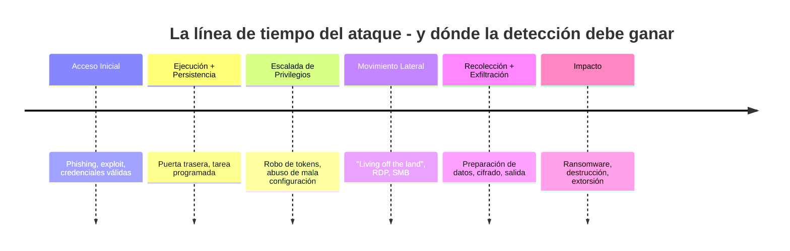
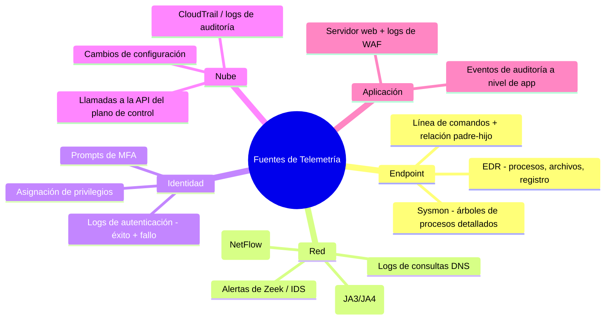
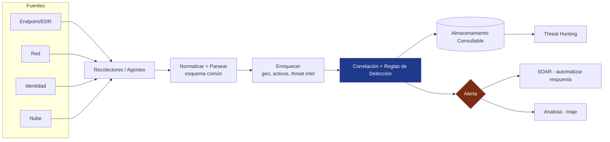
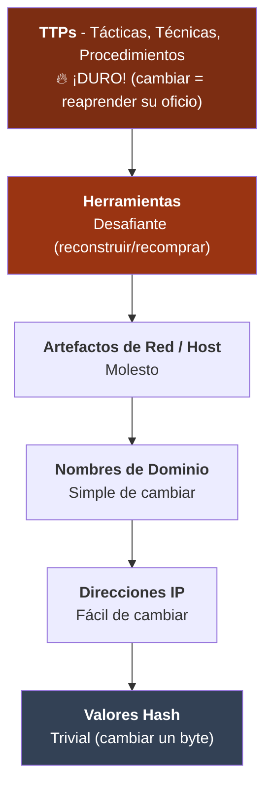
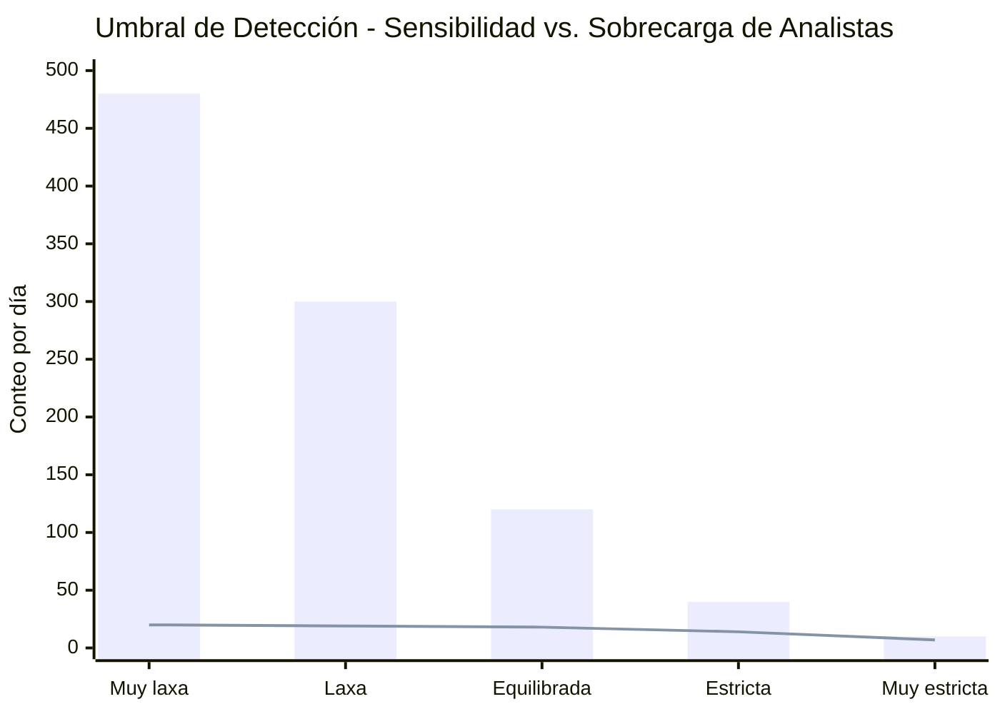
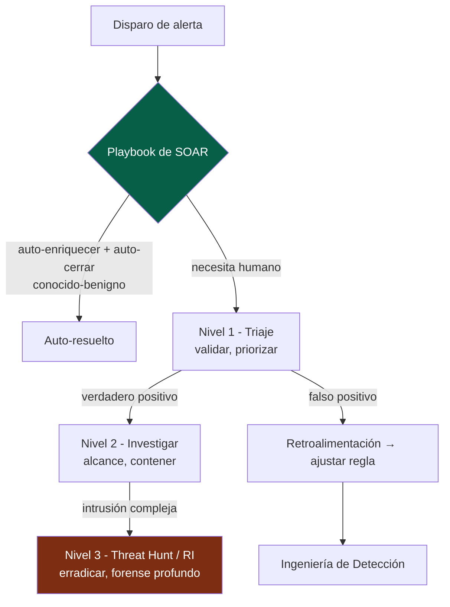
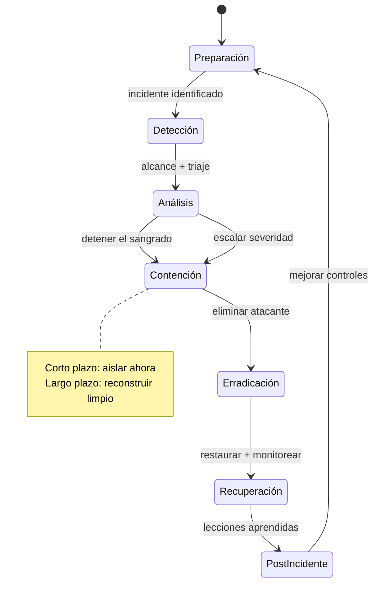
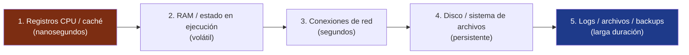
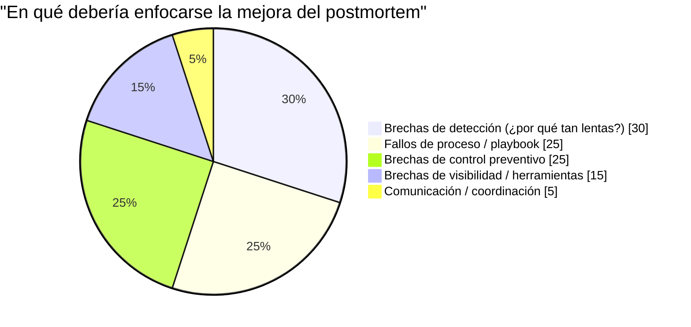
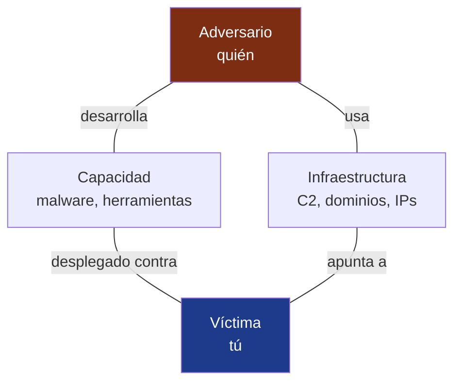

## La premisa que lo cambia todo

Los tres primeros volúmenes fueron, en esencia, optimistas. El [Volumen I](/posts/secure_systems_architecture/) construyó muros. El [Volumen II](/posts/identity_and_access_in_depth/) puso un guardia en cada puerta. El [Volumen III](/posts/cryptography_engineering_in_depth/) hizo que los mensajes entre ellos fueran infalsificables. Todo ello *preventivo*, todo basado en mantener al atacante fuera.

Este volumen comienza donde termina ese optimismo, con la frase que todo defensor experimentado lleva tatuada en el alma:

> **Asume la brecha.** Con suficiente tiempo, presupuesto y motivación, un adversario decidido entrará. La pregunta no es *si* serás comprometido, sino *qué tan rápido te das cuenta y qué tan bien respondes.*

La industria mide esto con dos números brutales: **MTTD** (Tiempo Medio de Detección) y **MTTR** (Tiempo Medio de Respuesta). El tiempo de permanencia promedio en la industria en 2024, desde el compromiso inicial hasta la detección, todavía se mide en *días o semanas*. En ese lapso, un atacante se desplaza lateralmente, escala privilegios y exfiltra datos. Este volumen trata sobre cómo colapsar ese intervalo.



Cada hora que le restas a la detección es una hora de esa línea de tiempo que el atacante no obtiene. Bienvenido al equipo azul.

---

## Parte I: Telemetría - No puedes detectar lo que no puedes ver

La detección es un problema de datos antes de ser un problema de analítica inteligente. Si la evidencia nunca se recolectó, ningún algoritmo la recuperará. Por lo tanto, el primer trabajo del equipo azul es la **visibilidad**: instrumentar el entorno para emitir las señales correctas.

### Capítulo 1: Las fuentes de la verdad



**La visión del defensor:** No todos los logs son iguales. La telemetría más valiosa es aquella que captura el *comportamiento*, especialmente las **líneas de comandos de procesos con linaje padre-hijo** (Sysmon Event ID 1) y los **eventos de autenticación**. Un log de firewall te dice que ocurrió una conexión; un árbol de procesos te dice que `winword.exe` ejecutó `powershell.exe`, el cual ejecutó `cmd.exe` lanzando un comando codificado; eso es una historia, y la historia es la detección.

:::important[El registro es un problema de cobertura - mapealo]
El fallo clásico son los *huecos silenciosos*: estás registrando el 80% de tu entorno y la brecha ocurre en el 20% restante. Mantén una **matriz de cobertura de registros** (fuente × tipo de dato × retención) y trata una brecha de cobertura como una vulnerabilidad. Una regla de detección no sirve de nada si los datos que necesita nunca fueron ingeridos. Audita tu cobertura de la misma manera que auditarías los niveles de parches.
:::

### Capítulo 2: El pipeline del SIEM

Un **SIEM** (Security Information and Event Management) es el cerebro de agregación: ingiere todo lo anterior, lo normaliza a un esquema común, correlaciona entre fuentes y levanta alertas. El pipeline moderno:



El paso de **enriquecimiento** es, discretamente, el más valioso: una dirección IP es solo ruido hasta que sabes que es un nodo de salida de Tor, que el activo es un controlador de dominio y que el usuario normalmente inicia sesión desde otro continente. El enriquecimiento convierte los datos en *contexto*, y el contexto es lo que hace que una alerta sea accionable en lugar de ignorada.

---

## Parte II: Ingeniería de Detección

Comprar un SIEM no te da detecciones, del mismo modo que comprar un piano no te da música. La **ingeniería de detección** es la disciplina de escribir, probar y mantener las reglas que convierten la telemetría en alertas, tratando las detecciones como código.

### Capítulo 3: MITRE ATT&CK - El lenguaje común

**MITRE ATT&CK** es el mapa compartido del campo: una matriz de **Tácticas** (el *porqué*, ej. Persistencia, Movimiento Lateral) y **Técnicas** (el *cómo*, ej. T1053 Tarea Programada) del adversario observadas en intrusiones reales [^1]. Es la Piedra de Rosetta que permite que el equipo rojo, el equipo azul y la inteligencia de amenazas hablen el mismo idioma.

El movimiento estratégico del defensor es el **mapeo de cobertura**, superponiendo sus reglas de detección en la matriz para exponer puntos ciegos:

```mermaid
quadrantChart
    title Cobertura de Detección vs. Frecuencia de Técnica del Adversario
    x-axis Rara vez usada --> Frecuentemente usada
    y-axis Poca cobertura --> Fuerte cobertura
    quadrant-1 Bien defendido
    quadrant-2 Sobre-invertido
    quadrant-3 Brechas de baja prioridad
    quadrant-4 PELIGRO - Común y no detectado
    Phishing (T1566): [0.9, 0.7]
    Cuentas Válidas (T1078): [0.85, 0.35]
    PowerShell (T1059): [0.8, 0.8]
    Tarea Programada (T1053): [0.5, 0.6]
    Volcado de Credenciales (T1003): [0.7, 0.75]
    Abuso de API en Nube (T1078.004): [0.6, 0.25]
    Proxy Rundll32 (T1218): [0.3, 0.45]
```

El cuadrante 4, **técnicas comunes con cobertura débil**, es tu backlog priorizado. Así es como un equipo azul pequeño asigna un esfuerzo finito: defiende lo que los atacantes hacen realmente y aún no detectas, antes de perseguir técnicas exóticas que nadie usa contra ti.

### Capítulo 4: La Pirámide del Dolor

No todas las detecciones son iguales en cuanto a *cuánto duelen al adversario*. La **Pirámide del Dolor** de David Bianco clasifica los indicadores según el costo que representan para un atacante una vez que los detectas [^2]:



La lección moldea la estrategia. Bloquear un **hash** de archivo es satisfactorio, pero el atacante lo recompila y lo vence en segundos. Detectar un **comportamiento**, como "cualquier aplicación de Office ejecutando un motor de scripting que se conecta a internet", obliga al adversario a abandonar toda una *técnica*. **Detecta comportamientos, no solo indicadores.** Mientras más arriba de la pirámide viva tu detección, más le costará a tu adversario evadirla.

:::tip[Detección-como-código]
Trata las detecciones como software: escríbelas en un formato portable (reglas **Sigma**), almacénalas en **git**, revísalas mediante code-review y *pruébalas* contra muestras maliciosas conocidas y, crucialmente, contra actividad benigna para medir los falsos positivos. Una detección con una tasa de falsos positivos del 40% es peor que no tener nada; entrena a los analistas a hacer clic en "ignorar". Versiona, prueba y retira reglas como lo harías con cualquier código en producción. [^3]
:::

### Capítulo 5: La guerra de la señal contra el ruido

La tensión eterna de la detección es el equilibrio entre atrapar ataques reales (verdaderos positivos) y ahogar a los analistas en falsas alarmas:



Las barras son el total de alertas; la línea son los *verdaderos* positivos. Si ajustas muy laxo (izquierda), los analistas hacen triaje de 480 alertas para encontrar 20 reales; se quemarán y empezarán a descartar automáticamente. Si ajustas muy estricto (derecha), te perderás ataques reales. **La fatiga por alertas es un fallo de control de seguridad**, no solo un problema de recursos humanos. El objetivo no es el máximo de alertas; es el máximo de *verdaderos positivos por hora-analista*, razón por la cual existe el SOAR (siguiente).

---

## Parte III: El SOC - Respuesta a velocidad de máquina

### Capítulo 6: Operaciones por niveles y SOAR

Un **Centro de Operaciones de Seguridad (SOC)** es el equipo y proceso que vive en el flujo de alertas. La estructura clásica y su automatización moderna:



**SOAR** (Orquestación, Automatización y Respuesta de Seguridad) es el multiplicador de fuerza. Ejecuta *playbooks*, secuencias automatizadas que enriquecen una alerta, recolectan contexto e incluso toman medidas de contención (aislar un host, deshabilitar una cuenta, bloquear una IP) sin esperar a un humano. Un pipeline de SOAR bien construido resuelve automáticamente la mayor parte del ruido de baja fidelidad, permitiendo que los humanos centren su atención donde realmente importa el criterio.

:::note[El bucle de retroalimentación es el punto clave]
Observa la flecha desde el Nivel 1 de regreso a la Ingeniería de Detección. Un SOC maduro es un *sistema de aprendizaje*: cada falso positivo ajusta una regla, cada detección fallida (encontrada después) se convierte en una nueva. Un SOC que solo reacciona a alertas sin retroalimentar sus detecciones está corriendo para quedarse en el mismo lugar.
:::

### Capítulo 7: Threat Hunting - Asume que ya están dentro

La detección espera a que una regla se dispare. El **threat hunting** es la postura opuesta: buscar proactivamente en la telemetría adversarios que se deslizaron más allá de las reglas, bajo la premisa explícita de que ya están dentro. Está *impulsado por hipótesis*:

::::steps

:::step[Formar una hipótesis]{subtitle="¿Dónde se esconderían?"}
Fundamentada en inteligencia de amenazas o ATT&CK: *"Si un atacante lograra persistencia, esperaría tareas programadas anómalas creadas fuera del horario laboral por cuentas no administrativas."* Una buena hipótesis es específica y falsable.
:::

:::step[Recolectar y analizar los datos]{subtitle="Ve a mirar"}
Consulta el SIEM/EDR en busca de evidencia a favor o en contra de la hipótesis. Pivota sobre linaje de procesos, destinos de red, anomalías de autenticación. Busca la *ausencia* de lo normal tanto como la presencia de lo maligno.
:::

:::step[Descubrir o refinar]{subtitle="Hallazgos"}
Ya sea que encuentres algo (escala a RI) o no, ambos son triunfos. Una cacería que no encuentra nada ha *validado* un control y mapeado el comportamiento normal.
:::

:::step[Operacionalizar el hallazgo]{subtitle="Automatízalo"}
Lo que la cacería te enseñó se convierte en una *nueva detección automatizada*, para que nunca tengas que volver a cazar eso manualmente. Las cacerías deben convertirse continuamente en reglas.
:::

::::

:::caution[La cacería requiere líneas base]
No puedes detectar *anomalías* sin conocer lo *normal*. El hunting efectivo depende de establecer líneas base: ¿cómo es un día típico de DNS, autenticación y actividad de procesos para *este* entorno? Los atacantes explotan el hecho de que la mayoría de las organizaciones nunca han caracterizado su propia normalidad, lo cual es la razón por la que "living off the land" (usar herramientas integradas como PowerShell y `certutil`) es tan efectivo: se esconde en tráfico que nunca aprendiste a leer.
:::

---

## Parte IV: Cuando todo suena - Respuesta a Incidentes (RI)

Eventualmente, una detección es real y severa. Ahora ejecutas el proceso de **Respuesta a Incidentes**, y la diferencia entre un incidente contenido y una brecha que acaba con la empresa es casi siempre *preparación y disciplina bajo presión*, no heroísmo.

### Capítulo 8: El ciclo de vida de RI del NIST

NIST SP 800-61 define el bucle canónico [^4]:



La fase que los ingenieros suelen hacer mal es la **Contención**. Dos modos de falla:

* **Alertar al atacante demasiado pronto**: desconectar un host mientras ellos controlan otros diez solo les avisa que los descubriste, y quemarán todo o acelerarán la exfiltración. A veces *observas* antes de *golpear*, recolectando alcance.
* **No contener lo suficientemente rápido**: el pecado opuesto, deliberar mientras los datos abandonan el edificio.

:::warning[No destruyas la evidencia que necesitarás]
El instinto de pánico es *reimaginar la caja ahora*. Pero un host comprometido en vivo contiene evidencia volátil, procesos en ejecución, conexiones de red, malware residente en memoria, que desaparece en el instante en que apagas el equipo. Donde sea factible, **captura imágenes de memoria y disco antes de la erradicación.** Las necesitarás para el alcance ("¿qué más tocaron?"), para obligaciones legales/regulatorias y para asegurar que la erradicación fue completa. El orden de volatilidad importa: primero la memoria, luego el disco. [^5]
:::

### Capítulo 9: Forense Digital - Reconstruyendo la verdad

Cuando el incidente termina (o para procedimientos legales), la **Forense Digital y Respuesta a Incidentes (DFIR)** reconstruye exactamente lo que sucedió. El principio cardinal es la **cadena de custodia** y el **orden de volatilidad**: la evidencia debe recolectarse desde lo más efímero a lo menos efímero, y cada paso debe documentarse, o no servirá de nada en un tribunal y no será confiable para determinar el alcance:



Los analistas forenses reconstruyen la línea de tiempo de intrusión a partir de metadatos del sistema de archivos (MFT, `$LogFile`), volcados de memoria (Volatility), logs de eventos de Windows y artefactos como prefetch y shimcache, tejiendo miles de marcas de tiempo en una narrativa coherente de *cómo entraron, qué hicieron y qué se llevaron.*

### Capítulo 10: El postmortem sin culpa

La fase más valiosa es la que más presión hay por saltarse: las **lecciones aprendidas**. La regla que hace que esto funcione es la **ausencia de culpa (blamelessness)**: el análisis apunta a *sistemas y procesos*, nunca a individuos. En el instante en que un postmortem se convierte en una asignación de culpas, la gente deja de decir la verdad y pierdes la información que necesitas para mejorar.



Cada incidente es una matrícula costosa. Las organizaciones que aumentan su madurez de seguridad son aquellas que *extraen la lección completa*: cada brecha cierra permanentemente la brecha que la permitió, alimentando directamente la fase de Preparación y las detecciones de la Parte II.

---

## Parte V: Inteligencia de Amenazas - Conociendo a tu adversario

La detección y respuesta se agudizan drásticamente cuando sabes *quién* es probable que te ataque y *cómo operan*. La **Inteligencia de Ciberamenazas (CTI)** es la disciplina de convertir datos crudos sobre adversarios en decisiones, y opera en tres altitudes:

| Nivel | Audiencia | Pregunta que responde | Ejemplo |
| --- | --- | --- | --- |
| **Estratégico** | Ejecutivos / junta | *¿Quién ataca a nuestra industria y por qué?* | "Los grupos de ransomware atacan cada vez más la facturación sanitaria" |
| **Operacional** | Liderazgo SOC | *¿Qué campañas y TTPs están activas ahora?* | "Este grupo usa spear-phishing → Cobalt Strike → doble extorsión" |
| **Táctico** | Analistas / herramientas | *¿Qué indicadores específicos bloqueo/detecto?* | IOCs, IDs de técnicas ATT&CK, reglas YARA/Sigma |

El marco conectivo es el **Modelo del Diamante**: cada evento de intrusión tiene cuatro vértices, y pivotar entre ellos expande tu comprensión:



Conocer un dominio C2 (Infraestructura) te permite pivotar a otros dominios en el mismo registrador/patrón; conocer el malware (Capacidad) te permite escribir una regla YARA que atrape la *próxima* campaña del adversario. CTI es cómo el equipo azul deja de jugar a la defensa pura y comienza a anticipar.

:::important[La inteligencia debe impulsar la acción, o es solo trivia]
Un feed de diez mil IPs maliciosas que ninguna regla consume es ruido, no inteligencia. La prueba de la CTI es un bucle cerrado: ¿cambia lo que detectas, bloqueas, buscas o priorizas? Alimenta los IOCs tácticos en el enriquecimiento de tu SIEM, alimenta las TTPs operativas en tu mapa de cobertura ATT&CK y alimenta las evaluaciones estratégicas en tus decisiones de riesgo. La inteligencia que no llega a un control es un informe que nadie lee.
:::

---

## Conclusión y el camino por delante

Hemos vivido el bucle completo del defensor: **ver** (telemetría), **detectar** (reglas de ingeniería sobre comportamiento), **responder** (disciplina de SOC e IR), **aprender** (postmortems sin culpa) y **anticipar** (inteligencia de amenazas). Aceptamos que la prevención falla y construimos el músculo para sobrevivir a ello, para reducir el tiempo de permanencia de semanas a minutos.

Pero hay una frontera donde todo esto se vuelve más difícil y rápido al mismo tiempo: el mundo **cloud-native** de contenedores efímeros, infraestructura declarativa y software ensamblado a partir de miles de dependencias de código abierto que nunca escribiste. Aquí el perímetro se disuelve aún más, las cargas de trabajo viven segundos y las brechas más peligrosas entran no a través de tu código sino a través de tu *cadena de suministro*, una dependencia envenenada, un pipeline de compilación comprometido, un token de CI filtrado.

El **Volumen V**, el final, trae toda la serie a casa a la seguridad moderna cloud-native y DevSecOps: endurecimiento de contenedores y Kubernetes, escaneo de infraestructura como código, asegurar el pipeline CI/CD, SBOMs y SLSA, y defender la cadena de suministro de software, donde ya están ocurriendo las brechas que definirán la próxima década.

---

## Referencias

[^1]: [MITRE - ATT&CK Framework](https://attack.mitre.org/)
[^2]: [David Bianco (2013) - The Pyramid of Pain](https://detect-respond.blogspot.com/2013/03/the-pyramid-of-pain.html)
[^3]: [SigmaHQ - Generic Signature Format for SIEM Systems](https://github.com/SigmaHQ/sigma)
[^4]: [NIST (2012) - SP 800-61 Rev. 2: Computer Security Incident Handling Guide](https://csrc.nist.gov/publications/detail/sp/800-61/rev-2/final)
[^5]: [IETF - RFC 3227: Guidelines for Evidence Collection and Archiving](https://datatracker.ietf.org/doc/html/rfc3227)