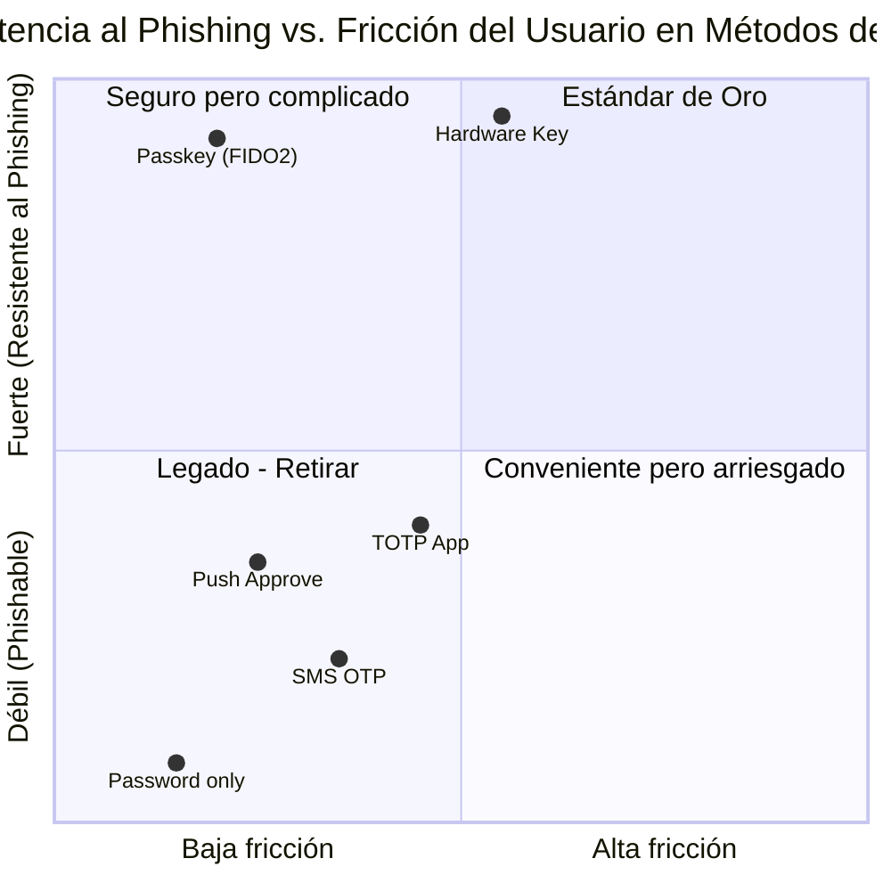
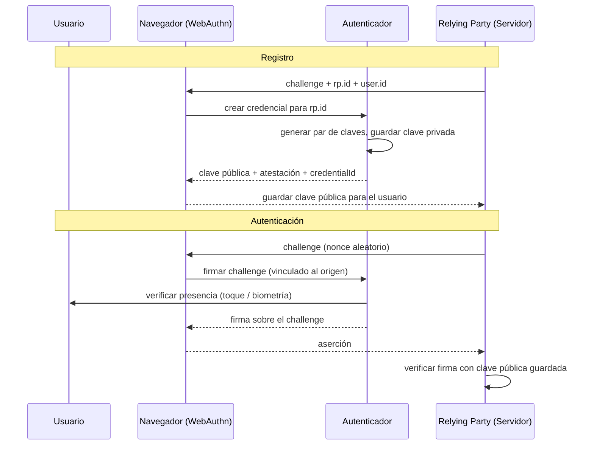
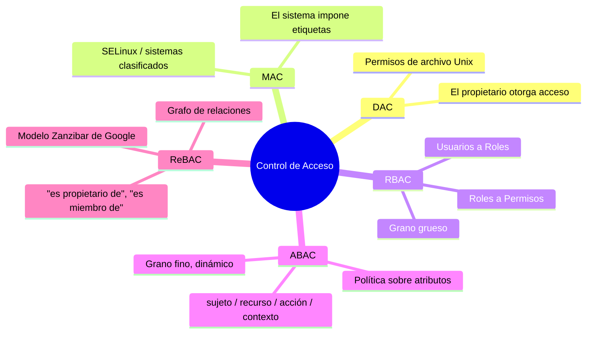
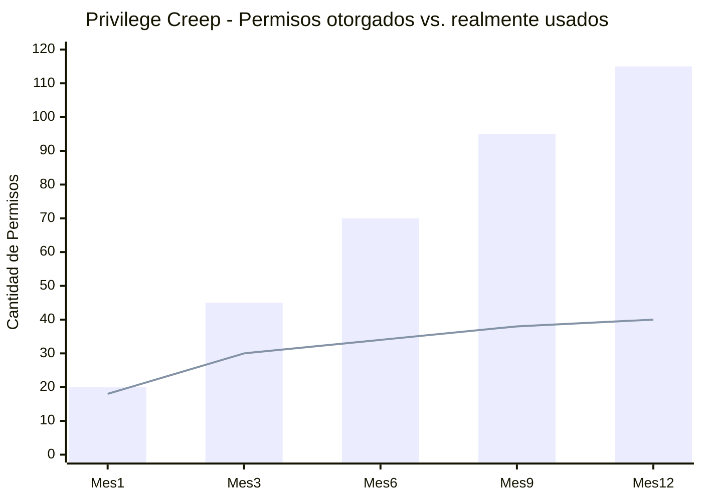
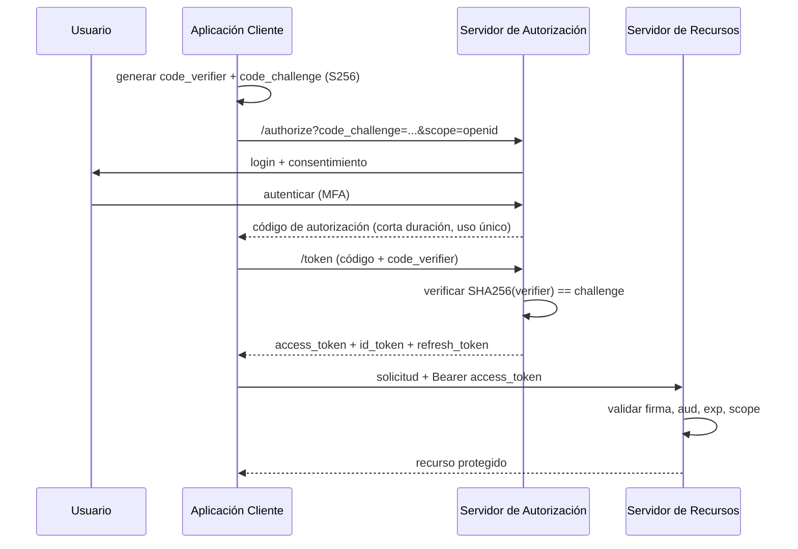
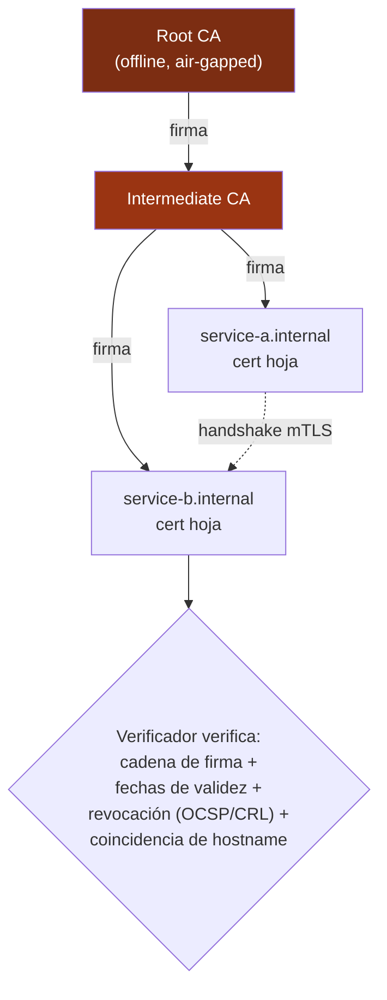
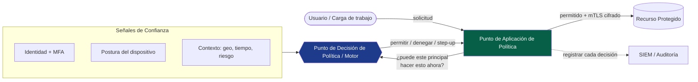
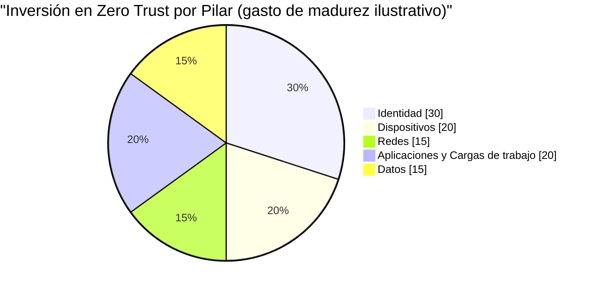

## Donde quedó el Volumen I

En el [Volumen I](/posts/secure_systems_architecture/) recorrimos todo el stack, desde el cobre hasta el código, a través de cuatro pares de ojos: el ingeniero de redes, el defensor, el hacker y el ingeniero de software. Dibujamos nuestros muros en el borde de la red, esparcimos sensores IDS a lo largo de los pasillos y tratamos al firewall como el guardián del reino.

Entonces, el reino se disolvió.

Las laptops se fueron a casa. Los servidores se movieron al centro de datos de alguien más. Las APIs comenzaron a llamar a otras APIs a través de la internet pública. La imagen ordenada de castillo y foso, donde "adentro" significaba *confiable* y "afuera" significaba *hostil*, dejó de describir la realidad. El foso ha desaparecido. Lo que queda es un enjambre de entidades (principals): personas, servicios, dispositivos y cargas de trabajo, cada una pidiendo hacer algo, cada una necesitando demostrar quién es y qué tiene permitido tocar.

Ese es el tema de este volumen. **La identidad es el nuevo perímetro** [^1], y cada solicitud es un cruce fronterizo.

:::note[El hilo conductor de este volumen]
La autenticación responde a *"¿quién eres?"* La autorización responde a *"¿qué puedes hacer?"*. Todo lo demás en este artículo (factores, tokens, sesiones, motores de políticas, material de claves) existe para hacer que esas dos respuestas sean **confiables, revocables y auditables** a velocidad de máquina.
:::

---

## Parte I: Autenticación - Demostrando quién eres

### Capítulo 1: Los tres factores, reconsiderados

Cada esquema de autenticación se reduce a combinaciones de tres factores clásicos, más dos adiciones modernas:

* **Algo que sabes** - contraseñas, PINs, frases de contraseña.
* **Algo que tienes** - una llave de hardware, un teléfono, una tarjeta inteligente.
* **Algo que eres** - huella dactilar, rostro, iris.
* **Algún lugar donde estás** - geolocalización / contexto de red (una señal *contextual*, no un factor estricto).
* **Algo que haces** - biometría del comportamiento: cadencia de escritura, dinámicas del mouse.

**La visión del hacker:** Cada factor tiene un ataque nativo. Los factores de conocimiento son *phishing* y *sprayed*. Los factores de posesión son *robados* o sujetos a *SIM-swapping*. Los factores de inherencia son *suplantados* (una huella levantada, un rostro impreso) y, fundamentalmente, **no pueden rotarse**: una vez comprometidos, solo tienes diez huellas para toda la vida.

**La visión del defensor:** La autenticación de múltiples factores (MFA) funciona porque el atacante ahora debe comprometer factores de *diferentes tipos* simultáneamente. Pero no todos los MFA son iguales. Este es el matiz más importante que los defensores pasan por alto:



La lección del gráfico: **El OTP basado en SMS es MFA, pero es un MFA débil.** Resiste la reutilización de contraseñas, pero no un proxy de phishing en tiempo real o un intercambio de SIM. Solo las credenciales **FIDO2 / WebAuthn**, donde la clave privada nunca abandona el autenticador y la firma está vinculada criptográficamente al origen, son genuinamente *resistentes al phishing* [^2].

:::warning[La fatiga de MFA es un ataque real]
En 2022, varias brechas de alto perfil utilizaron **push-bombing**: el atacante ya tiene la contraseña, luego envía spam al usuario con notificaciones de aprobación hasta que, por molestia o confusión, este presiona "Aprobar". El MFA basado en push sin *coincidencia de números* (number matching) es un defecto de diseño, no un control de seguridad. Prefiera las passkeys o fuerce la coincidencia de números junto con el contexto (nombre de la aplicación, ubicación) en cada solicitud. [^3]
:::

### Capítulo 2: Contraseñas que se niegan a morir

Incluso en un futuro de passkeys, las bases de datos de contraseñas existirán durante una década. Almacenarlas correctamente no es negociable.

La regla: **nunca almacene lo que el usuario escribió.** Almacene un hash lento, con salt y resistente a la memoria.

$$
H = \text{Argon2id}(\text{password}, \text{salt}, m, t, p)
$$

donde $m$ es el costo de memoria (KiB), $t$ es el costo de tiempo (iteraciones) y $p$ es el paralelismo. Argon2id es el estándar actual recomendado por OWASP porque resiste tanto el cracking por GPU (a través de la dureza de memoria) como los ataques de canal lateral (a través de su patrón de acceso a datos híbrido) [^4].

Por qué el hashing *lento* importa, expresado como economía del atacante. Si un atacante puede calcular $R$ hashes por segundo, romper una contraseña extraída uniformemente de un espacio de claves de tamaño $N$ toma, en promedio:

$$
t_{\text{crack}} = \frac{N}{2R}
$$

Un hash rápido como SHA-256 sin salt le da a un equipo de GPU moderno $R \approx 10^{11}$ intentos/segundo. Un Argon2id bien ajustado puede reducir eso a $R \approx 10^{3}$. Ese colapso de ocho órdenes de magnitud en $R$ es todo el juego.

:::tip[Lista de verificación para el almacenamiento de contraseñas]

1. **Hash** con Argon2id (o scrypt / bcrypt si Argon2 no está disponible).
2. **Salt** único por usuario (derrota las tablas arcoíris).
3. Considere una **pepper** (pimienta) del lado del servidor almacenada en un HSM/KMS, separada de la base de datos (derrota a un atacante que solo vuelca la DB).
4. **Nunca** limite agresivamente la longitud de la contraseña ni prohíba pegar el texto; ambas acciones empujan a los usuarios a secretos más débiles.
5. Verifique las nuevas contraseñas contra **corpus de brechas** (por ejemplo, la API de k-anonimidad de HaveIBeenPwned) [^5].

:::

### Capítulo 3: El final del camino sin contraseñas - WebAuthn y Passkeys

WebAuthn (la API del navegador) más el protocolo CTAP (del autenticador) forman **FIDO2**. El modelo mental:



La magia está en una línea: **la firma está vinculada al origen (`rp.id`)**. Un sitio de phishing en `paypa1.com` no puede hacer que el autenticador produzca una aserción válida para `paypal.com`, porque el navegador se niega a liberarla. Esto elimina toda la categoría de phishing de credenciales por construcción, no por vigilancia del usuario [^2].

Una **passkey** es simplemente una credencial FIDO2 *detectable y sincronizable*, respaldada en un llavero en la nube (Apple, Google, Microsoft o un gestor de contraseñas) para que sobreviva a la pérdida del dispositivo. Esa sincronización es el avance ergonómico que hizo que el acceso sin contraseñas fuera viable para los consumidores.

---

## Parte II: Autorización - Decidiendo lo que puedes hacer

La autenticación es la mitad fácil. **La autorización es donde los sistemas reales sangran.** El Top 10 de OWASP ha clasificado el *Control de Acceso Roto* como el **n.º 1** de riesgo web, por encima de la inyección y los fallos criptográficos combinados [^6].

### Capítulo 4: Los modelos - De roles a atributos y relaciones



**RBAC (basado en roles)** es donde viven la mayoría de las organizaciones: un usuario tiene roles, los roles agrupan permisos. Es fácil de razonar y auditar. Su modo de fallo es la **explosión de roles**, cuando "editor para la región UE en el proyecto de finanzas durante el horario laboral" se convierte en su propio rol; terminas con miles de ellos y nadie entiende el grafo.

**ABAC (basado en atributos)** resuelve eso evaluando una *política* sobre atributos en el momento de la solicitud:

```txt
# Una pequeña política ABAC (estilo OPA / Rego)
allow if {
    input.subject.department == input.resource.owner_department
    input.action == "read"
    input.context.time_hour >= 9
    input.context.time_hour < 18
}
```

**ReBAC (basado en relaciones)**, popularizado por el paper de **Zanzibar** de Google [^7] y sistemas de código abierto como OpenFGA y SpiceDB, modela la autorización como un grafo: *"Alice es editora de un Doc, Doc está en una Carpeta, Bob es visualizador de la Carpeta → Bob puede ver el Doc"*. Destaca en las verificaciones de "¿puede el usuario X hacer Y al objeto Z?" que dominan los productos SaaS con uso compartido y anidamiento.

:::important[La trampa del IDOR - la herida más común de la autorización]
Una **Referencia Directa a Objeto Insegura (IDOR)** es lo que sucede cuando autenticas al usuario pero olvidas *autorizar el objeto*. El clásico:

```bash
GET /api/invoices/1043   ->  200 OK  (mi factura)
GET /api/invoices/1044   ->  200 OK  (¡la factura de alguien más!)
```

La solución es una disciplina, no una biblioteca: **cada recuperación de objeto debe estar restringida al principal solicitante.** Nunca uses `SELECT * FROM invoices WHERE id = ?`; siempre haz `... WHERE id = ? AND owner_id = ?`, o traslada la verificación a un motor de políticas central. IDOR es *la* razón por la que el Control de Acceso Roto encabeza la lista de OWASP. [^6]
:::

### Capítulo 5: El principio de menor privilegio, cuantificado

El menor privilegio dice: otorgue los permisos *mínimos* necesarios, por el tiempo *mínimo*. En la práctica, los derechos solo se acumulan; esta deriva se llama **privilege creep** (deslizamiento de privilegios). Una métrica mental útil es la proporción de permisos *usados* frente a permisos *otorgados*:



La brecha creciente entre las barras (otorgados) y la línea (usados) es su **superficie de ataque permanente**: privilegios que un atacante hereda en el momento en que compromete la cuenta y que nadie está vigilando. Las contramedidas:

* **Acceso Just-in-Time (JIT):** otorgue derechos elevados por un periodo limitado, luego revoque automáticamente.
* **Revisiones de acceso / recertificación:** campañas periódicas de "¿todavía necesitas esto?".
* **Gestión de Accesos Privilegiados (PAM):** almacene credenciales de administrador, sesiones de broker, registre todo.

---

## Parte III: Tokens, sesiones y federación

### Capítulo 6: OAuth 2.0, OIDC y la confusión entre ellos

El error arquitectónico más común en este espacio es confundir **OAuth 2.0** (autoriz*ación* - acceso delegado) con **OpenID Connect** (autentic*ación* - probar identidad). OIDC es una capa de identidad delgada *sobre* OAuth 2.0 [^8].

* **OAuth 2.0** responde: *"¿Dejarás que esta aplicación actúe en tu nombre para acceder al recurso R?"*. Emite **tokens de acceso**.
* **OIDC** responde: *"¿Quién es este usuario?"*. Emite un **ID token** (un JWT firmado con reclamos sobre el usuario).

El flujo moderno y recomendado para prácticamente todo (SPAs, móviles y aplicaciones web por igual) es **Authorization Code + PKCE**:



**¿Por qué PKCE (Proof Key for Code Exchange)?** Sin él, un atacante que intercepte el código de autorización (por ejemplo, a través de una aplicación maliciosa registrada en el mismo esquema URI) podría canjearlo. PKCE vincula el código a un secreto (`code_verifier`) que solo el cliente legítimo conoce, por lo que un código robado es inútil. **OAuth 2.1** hace que PKCE sea obligatorio para todos los clientes y elimina los peligrosos tipos de concesión *implícita* y de *contraseña* por completo [^9].

:::caution[Deje de usar el flujo implícito]
La concesión implícita heredada devolvía los tokens directamente en el fragmento de la URL, un diseño de una era antes de que los navegadores tuvieran `fetch` y CORS. Los tokens se filtraban en el historial, referenciadores y registros. Si un tutorial le dice que use `response_type=token`, el tutorial tiene una década de antigüedad. Código de Autorización + PKCE, siempre.
:::

### Capítulo 7: Sesiones vs. Tokens - El compromiso estado/sin-estado

| Propiedad | Sesión de Servidor (cookie → almacén de sesiones) | JWT autocontenido |
| --- | --- | --- |
| Estado | El servidor mantiene la sesión; la cookie es un ID opaco | El servidor no guarda nada; el token *es* el estado |
| Revocación | **Instantánea** - eliminar la fila de sesión | **Difícil** - válido hasta `exp`, necesita una lista negra |
| Escalabilidad | Necesita almacén compartido (Redis) | Horizontalmente trivial |
| Carga útil | Cookie pequeña | Token más grande en cada solicitud |
| Mejor para | Aplicaciones web clásicas, requieren cierre de sesión instantáneo | Servicio a servicio, tokens de acceso de corta duración |

El compromiso estándar de la industria: **tokens de acceso de corta duración (5–15 min) + tokens de refresco de larga duración.** El token de acceso es un JWT que nunca revoca (de todos modos expira rápido); el token de refresco es una credencial revocable y rotativa que se mantiene del lado del servidor. Revocar a un usuario lo desconecta dentro de la vida útil de un token de acceso.

:::warning[Los tres peligros de los JWT]

1. **`alg: none`** - históricamente, algunas bibliotecas aceptaban un token que *declaraba* que no necesitaba firma. Siempre fije el algoritmo esperado del lado del servidor; nunca confíe en el `alg` del encabezado.
2. **Confusión HS256 vs RS256** - un atacante envía un token HS256 firmado con su clave pública RSA como secreto HMAC. Fije el algoritmo.
3. **Guardar JWTs en `localStorage`** - legible por cualquier carga útil XSS. Prefiera cookies `HttpOnly`, `Secure`, `SameSite` para sesiones de navegador. [^10]

:::

### Capítulo 8: Federación y SSO

El **Inicio de Sesión Único (SSO)** permite que un solo login sirva a muchas aplicaciones. Los dos protocolos dominantes:

* **SAML 2.0** - Basado en XML, verboso, sigue siendo dominante en B2B empresarial y sistemas heredados.
* **OIDC** - Basado en JSON/JWT, el predeterminado para nuevas aplicaciones, móviles y APIs.

La lista de jugadores: un **Proveedor de Identidad (IdP)** - Okta, Entra ID, Keycloak, Google - autentica al usuario y lo avala ante un **Proveedor de Servicios (SP)** / Relying Party. El valor es la centralización: un solo lugar para imponer MFA, un solo lugar para desactivar a un empleado que se va, un solo registro de auditoría.

:::note[La desaprovisionación es el asesino silencioso]
El mayor beneficio de seguridad del SSO es la **baja de acceso instantánea y centralizada.** El fallo más común en el mundo real es la cuenta huérfana: un empleado se va, RR. HH. cierra la cuenta de SSO, pero una cuenta de administrador local en algún servidor olvidado sobrevive. Reconcilie cada fuente de identidad contra su sistema de registro de RR. HH. Una cuenta que ningún humano posee es una cuenta que posee un atacante.
:::

---

## Parte IV: Identidad de máquina y secretos

Los humanos son un error de redondeo. En una infraestructura de nube moderna, **las identidades de máquina superan a las humanas en 45 a 1** [^11]; cada microservicio, función, contenedor y trabajo de CI necesita autenticarse ante algo.

### Capítulo 9: PKI y la cadena de confianza

La confianza máquina a máquina se construye sobre **certificados X.509** e Infraestructura de Clave Pública (PKI). Un certificado vincula una clave pública a una identidad, firmada por una Autoridad de Certificación (CA) en la que confía el verificador.



La clave privada de la raíz es la joya de la corona, mantenida **offline y aislada físicamente**, porque su compromiso invalida todo lo que está debajo de ella. Los intermedios hacen la firma diaria para que la raíz rara vez salga de la bóveda.

**mTLS (TLS mutuo)** es la respuesta de PKI a la autenticación de servicio a servicio: *ambos* lados presentan certificados, por lo que un servicio demuestra su identidad a los llamadores *y* a los llamados. Esta es la columna vertebral criptográfica de Zero Trust entre cargas de trabajo (y la razón por la que existen service meshes como Istio y Linkerd, que automatizan la emisión y rotación de certificados mediante identidades **SPIFFE/SPIRE**) [^12].

### Capítulo 10: Gestión de secretos

El pecado más antiguo del software: el secreto codificado a fuego (hard-coded).

```python
# La vulnerabilidad que nunca muere
DB_PASSWORD = "hunter2"          # comprometido en git, para siempre en el historial
API_KEY = "sk_live_a1b2c3d4..."  # filtrado en el bundle del cliente
```

Git *nunca olvida*. Un secreto comprometido una vez y "eliminado" en el siguiente commit sigue en el historial, y sigue siendo extraído por bots que observan los pushes públicos en segundos. Las disciplinas:

::::steps

:::step[Nunca confirmar secretos]{subtitle="Prevención"}
Use hooks de pre-commit (`gitleaks`, `trufflehog`) para bloquear secretos antes de que entren al historial. Impóngalo en CI para que nadie pueda omitirlo localmente.
:::

:::step[Centralizar en un gestor de secretos]{subtitle="Almacenamiento"}
HashiCorp Vault, AWS Secrets Manager o KMS en la nube. Las aplicaciones obtienen secretos en tiempo de ejecución a través de una identidad autenticada; los secretos nunca tocan el control de código fuente ni los archivos de entorno incrustados en las imágenes.
:::

:::step[Preferir secretos dinámicos de corta duración]{subtitle="Rotación"}
Vault puede generar una credencial de base de datos válida por una hora y luego revocarla. Una credencial de una hora filtrada es mucho menos peligrosa que una estática que ha sido válida durante tres años.
:::

:::step[Rotar según un cronograma y por sospecha]{subtitle="Respuesta"}
Automatice la rotación. Cuando un secreto *podría* estar expuesto, rote primero e investigue después. La rotación debe ser una operación aburrida, de un solo clic y sin tiempo de inactividad, o nunca sucederá.
:::

::::

:::tip[La identidad de carga de trabajo supera a los secretos almacenados]
El mejor secreto es el que nunca almacenas. La **federación de identidad de carga de trabajo** (Roles de IAM de AWS para Service Accounts, Identidad de carga de trabajo de GCP, runners de CI federados por OIDC) permite que una carga de trabajo pruebe *lo que es* para obtener credenciales de corta duración, sin ninguna clave de larga duración sentada en cualquier lugar para ser robada. Si todavía está pegando claves de nube estáticas en CI, esta es su actualización de mayor impacto.
:::

---

## Parte V: Síntesis - Construyendo una arquitectura Zero Trust

Ahora podemos ensamblar todo en el modelo que NIST formalizó en **SP 800-207**: **Zero Trust** [^13]. Su supuesto fundamental, y la razón por la que reemplaza al castillo y el foso, es una sola frase:

> **Nunca confíe, siempre verifique.** Se asume que la red es hostil. La ubicación no otorga nada. Cada solicitud es autenticada, autorizada y cifrada, por sus propios méritos, cada vez.

La arquitectura de referencia tiene un **Punto de Decisión de Política (PDP)** que evalúa la política, y **Puntos de Aplicación de Política (PEP)** dispersos en la ruta de datos que preguntan al PDP y hacen cumplir su veredicto:



Los cinco pilares que aborda un programa Zero Trust maduro (según el Modelo de Madurez Zero Trust de CISA) [^14]:



Observe que la **Identidad toma la porción más grande**, eso no es un accidente. Una vez que la red no confiere confianza, la identidad se convierte en el plano de control principal. Todo en este volumen (factores, tokens, motores de políticas, identidad de máquina) está al servicio de hacer que ese plano de control sea confiable.

:::important[Zero Trust es un viaje, no un producto]
Ningún proveedor vende "Zero Trust en una caja". Es una *arquitectura* y un *principio operativo* aplicado de forma incremental: comience poniendo MFA resistente al phishing en su aplicación más crítica, agregue verificaciones de postura del dispositivo, luego microsegmente y luego extienda a las cargas de trabajo. La madurez se mide en la confianza implícita eliminada, no en los dólares gastados en dispositivos.
:::

---

## Conclusión y el camino por delante

El Volumen I defendió un lugar. Este volumen defendió a un *principal*, donde sea que se encuentre. Reemplazamos el muro con una pregunta hecha en cada puerta: *demuestra quién eres y demuestra que puedes.*

Pero cada afirmación en este volumen, cada firma de token, cada handshake mTLS, cada contraseña hasheada, descansa sobre una criptografía que hasta ahora hemos tratado como una caja mágica que "simplemente funciona". En el **Volumen III**, abrimos esa caja. Construiremos las primitivas desde cero: cifrados simétricos y asimétricos, el handshake real de TLS 1.3, intercambio de claves y secreto hacia adelante (forward secrecy), y la interrupción inminente de la criptografía post-cuántica, junto con el catálogo de formas en que los ingenieros se equivocan catastróficamente en todo ello.

La identidad en la que acaba de aprender a confiar es tan fuerte como las matemáticas que la firman.

---

## Referencias

[^1]: [Microsoft (2021) - Identity is the new security perimeter](https://www.microsoft.com/en-us/security/business/security-101/what-is-identity-access-management-iam)
[^2]: [FIDO Alliance - How FIDO Works](https://fidoalliance.org/how-fido-works/)
[^3]: [CISA (2022) - Implementing Phishing-Resistant MFA](https://www.cisa.gov/sites/default/files/publications/fact-sheet-implementing-phishing-resistant-mfa-508c.pdf)
[^4]: [OWASP - Password Storage Cheat Sheet](https://cheatsheetseries.owasp.org/cheatsheets/Password_Storage_Cheat_Sheet.html)
[^5]: [Troy Hunt - Have I Been Pwned: Pwned Passwords (k-Anonymity)](https://haveibeenpwned.com/API/v3#PwnedPasswords)
[^6]: [OWASP - A01:2021 Broken Access Control](https://owasp.org/Top10/A01_2021-Broken_Access_Control/)
[^7]: [Google (2019) - Zanzibar: Google's Consistent, Global Authorization System](https://research.google/pubs/pub48190/)
[^8]: [OpenID Foundation - What is OpenID Connect](https://openid.net/developers/how-connect-works/)
[^9]: [IETF - OAuth 2.1 Authorization Framework (draft)](https://datatracker.ietf.org/doc/html/draft-ietf-oauth-v2-1)
[^10]: [OWASP - JSON Web Token Cheat Sheet](https://cheatsheetseries.owasp.org/cheatsheets/JSON_Web_Token_for_Java_Cheat_Sheet.html)
[^11]: [CyberArk (2023) - Identity Security Threat Landscape Report](https://www.cyberark.com/threat-landscape/)
[^12]: [SPIFFE - Secure Production Identity Framework For Everyone](https://spiffe.io/docs/latest/spiffe-about/overview/)
[^13]: [NIST (2020) - SP 800-207: Zero Trust Architecture](https://csrc.nist.gov/publications/detail/sp/800-207/final)
[^14]: [CISA - Zero Trust Maturity Model v2.0](https://www.cisa.gov/zero-trust-maturity-model)