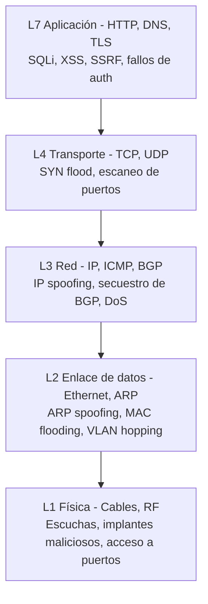
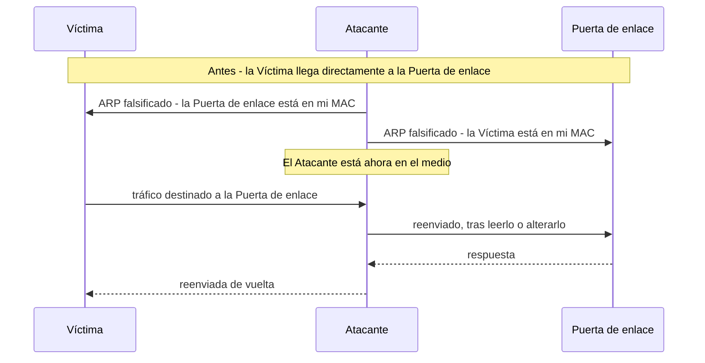
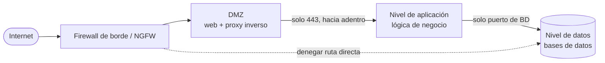
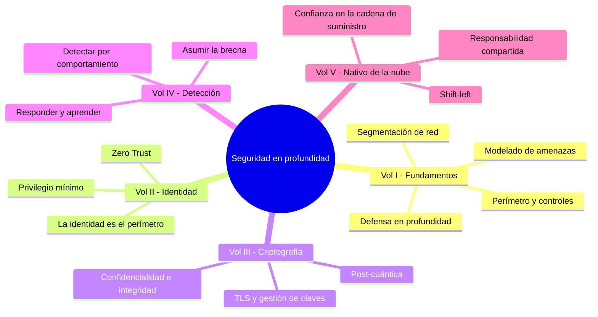
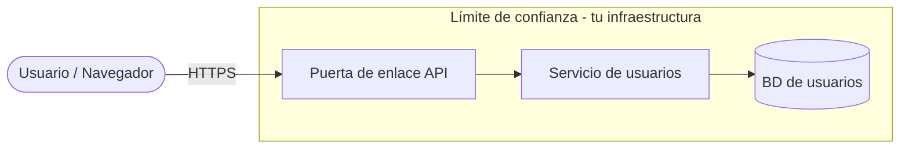
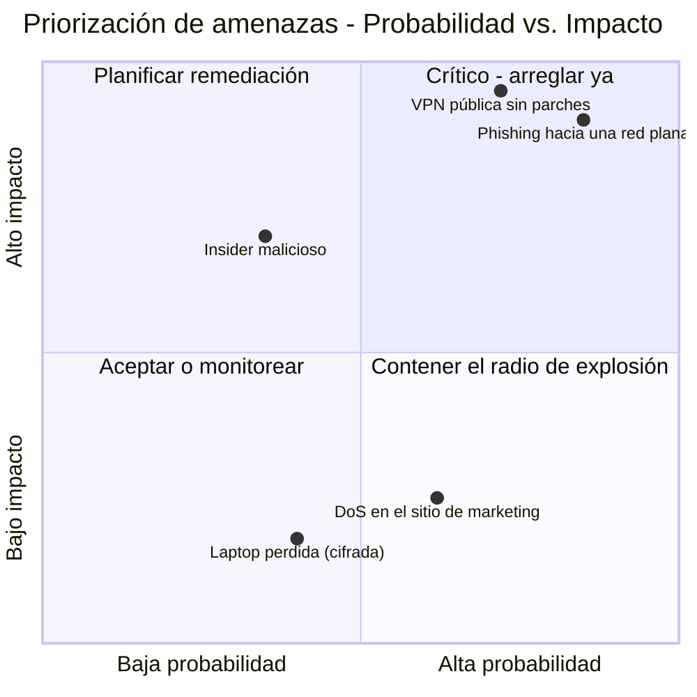
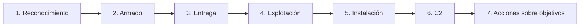
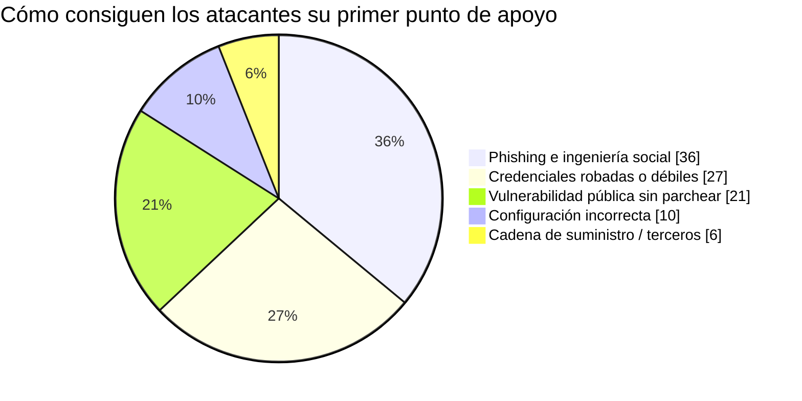
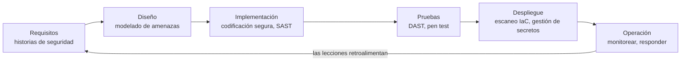
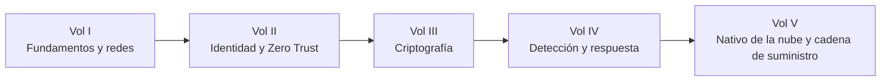

## Donde comienza la serie

Este es el volumen inaugural de un recorrido de cinco partes por la **Arquitectura de Seguridad**. A lo largo de la serie recorreremos todo el stack, desde el cobre hasta el contenedor, y el mapa se ve así:

* **Volumen I (este)** - los fundamentos: la red como superficie de ataque, el diseño defendible, la defensa en profundidad, el modelado de amenazas y el método del atacante.
* **Volumen II** - [Identidad, acceso y la frontera de Zero Trust](/posts/identity_and_access_in_depth/): cuando el perímetro se disuelve, la identidad se convierte en el nuevo límite.
* **Volumen III** - [Ingeniería de la criptografía](/posts/cryptography_engineering_in_depth/): las primitivas que hacen que todo lo demás sea confiable.
* **Volumen IV** - [Detección, respuesta e inteligencia de amenazas](/posts/detection_and_response_in_depth/): qué haces cuando la prevención falla.
* **Volumen V** - [Seguridad nativa de la nube y de la cadena de suministro](/posts/cloud_native_and_supply_chain_security_in_depth/): asegurar lo efímero y probar lo que despliegas.

Lo que hace diferente a esta guía es su método. Cada tema se examina a través de **cuatro pares de ojos**, porque un sistema real es debatido por cuatro tipos de ingeniero a la vez:

* El **ingeniero de redes** que construye los cimientos.
* El **defensor** que tiene que protegerlos.
* El **hacker** que intenta romperlos.
* El **ingeniero de software** que escribe el código que se ejecuta sobre ellos.

:::note[La tesis de toda la serie]
Ningún control por sí solo es confiable. Los firewalls fallan, las credenciales se filtran, el código tiene errores y las dependencias se envenenan. La seguridad, por lo tanto, no es un producto que compras sino una **propiedad que diseñas**: capas que asumen, cada una, que la anterior ya ha fallado. Este volumen construye las capas más externas y la mentalidad. El resto de la serie construye hacia adentro.
:::

---

## Parte I: La red es el territorio

La comunicación de datos comienza en la red, y el ataque también. Una lectura superficial del modelo OSI o TCP/IP no basta [^1]; un profesional de la seguridad lee cada capa dos veces, una por lo que *hace* y otra por cómo puede ser *utilizada en su contra*.

### Capítulo 1: El stack a través de una lente de seguridad

Cada capa acarrea sus propios ataques nativos y sus propias defensas nativas. Cuanto más abajo vas, más físico y absoluto es el compromiso.

**Capa 1 - Física.** El mundo de los cables, la fibra y los conmutadores. Para el hacker es el vector definitivo *si es alcanzable*: un tap de red sobre un tramo sin cifrar [^2], un implante barato dejado detrás de un firewall como punto de apoyo persistente de comando y control, o simplemente una laptop conectada a un conector activo en un vestíbulo. La respuesta del defensor es procedimental y física - salas cerradas, puertos deshabilitados, sellos a prueba de manipulaciones - respaldada técnicamente por el control de acceso a la red **IEEE 802.1X**, que obliga a cualquier dispositivo que se conecte físicamente a autenticarse antes de recibir una sola trama utilizable [^3].

**Capa 2 - Enlace de datos.** Direcciones MAC, conmutadores y **ARP**, el protocolo que asigna IP a MAC y que fue diseñado con confianza implícita [^4]. Esa confianza es la vulnerabilidad:

Eso es **ARP spoofing**, y le entrega al atacante una posición de Man-in-the-Middle en el segmento local [^5]. Sus primos son el **MAC flooding** (desbordar la tabla CAM del conmutador hasta que falle en abierto y transmita todo como un concentrador [^6]) y el **VLAN hopping** (escapar de tu VLAN a través de un puerto troncal mal configurado [^7]). El arsenal del defensor aquí es la higiene del conmutador: **seguridad de puerto** para fijar MACs por puerto [^8], **DHCP snooping** para eliminar servidores DHCP no autorizados, e **inspección dinámica de ARP** para descartar ARP falsificado frente a una tabla de vinculación confiable.

**Capa 3 - Red.** Direcciones IP y enrutamiento. El **IP spoofing** falsifica una dirección de origen - el motor detrás del DoS reflejado, como el clásico ataque Smurf [^9] - y el **secuestro de BGP** corrompe las tablas de enrutamiento de internet para engullir tráfico al por mayor, una herramienta de nivel estado-nación para espionaje e interceptación masiva [^10]. El defensor filtra: el **filtrado de entrada/salida** según BCP 38 / RFC 2827 descarta paquetes cuya IP de origen es una mentira [^11], y las ACL imponen quién puede hablar con quién.

**Capa 4 - Transporte.** **TCP** (orientado a la conexión, protocolo de enlace de tres vías) y **UDP** (disparar y olvidar). El **SYN flood** agota la tabla de conexiones entreabiertas de un servidor con SYNs falsificados que nunca se completan [^12]; el **escaneo de puertos** con herramientas como `nmap` mapea la superficie de ataque en escucha [^13]. El defensor responde con **firewalls con estado** que solo dejan pasar un ACK para el que tienen un protocolo de enlace, y **cookies SYN** que no asignan estado hasta que el cliente demuestra ser real [^14].

### Capítulo 2: Diseñar una red defendible

Una **red plana** - donde cada dispositivo puede alcanzar a todos los demás - es el paraíso del hacker. Compromete una impresora olvidada y podrás caminar hasta el controlador de dominio. Una red defendible es una red **segmentada** [^15].

La segmentación - subredes, **VLANs** y una **DMZ** por niveles [^16] - convierte cada salto en un punto de estrangulamiento monitoreado. Es el privilegio mínimo expresado como topología: el servidor web no tiene por qué marcar al controlador de dominio, así que el firewall lo prohíbe, y un servidor web comprometido se encuentra en un callejón sin salida en lugar de en una autopista.

La **microsegmentación** lleva esto a su fin lógico: un límite de política alrededor de *cada carga de trabajo*, no de cada zona. Dos máquinas virtuales en la misma subred no son confiables de forma implícita; cada flujo debe permitirse explícitamente. Ese principio - *nunca confiar, siempre verificar* - es la semilla de **Zero Trust**, y crece hasta convertirse en el tema completo del próximo volumen.

:::important[El primer relevo]
La microsegmentación pregunta *"¿debería permitirse que estos dos principales se comuniquen?"* - y una vez que te tomas esa pregunta en serio, la dirección de red deja de ser una respuesta suficientemente buena. Necesitas verificar la **identidad**. Ahí es exactamente donde retoma el **[Volumen II](/posts/identity_and_access_in_depth/)**: la identidad como el nuevo perímetro.
:::

### Capítulo 3: Los guardianes - firewalls e IDS/IPS

Un **firewall con estado** entiende el contexto de la conexión; un **firewall de próxima generación (NGFW)** va más allá con conciencia de aplicación (bloquear una app, permitir otra, ambas en el puerto 443), prevención de intrusiones integrada y fuentes de inteligencia de amenazas [^17]. Un **firewall de aplicaciones web (WAF)** opera en la Capa 7 para mitigar los ataques del OWASP Top 10 [^18].

:::warning[Un WAF es una red de seguridad, no una cura]
Un WAF puede bloquear un ingenuo `OR 1=1`, pero la evasión de WAF es una disciplina madura - la codificación, la ofuscación y los trucos de mayúsculas eluden las firmas todos los días. La solución real para la inyección vive en el código (consultas parametrizadas), no en un filtro atornillado por delante. Trata al WAF como defensa en profundidad, nunca como la defensa.
:::

El **IDS** observa y alerta; el **IPS** se sitúa en línea y bloquea. Ambos detectan por **firma** (precisos contra amenazas conocidas, ciegos ante las nuevas) o por **anomalía** (pueden atrapar lo desconocido, te ahogan en falsos positivos) [^19]. Y ambos quedan sordos frente al tráfico cifrado a menos que pagues por el descifrado - un anticipo de por qué la *detección* finalmente tiene que salir del cable y trasladarse al endpoint, la historia del Volumen IV.

---

## Parte II: Defensa en profundidad - y por qué es esta serie

La defensa en profundidad es el reconocimiento de que cualquier control *fallará*, así que construyes capas que cada una compra tiempo, visibilidad y otra oportunidad de detener al atacante [^20]. El castillo medieval es la analogía cansada pero perfecta: foso, muralla, arqueros, torreón, joyas de la corona y los guardias que lo mantienen todo unido.

Aquí está la jugada que organiza toda esta serie: **cada capa del castillo es un volumen.**

* El **foso y la muralla exterior** son el perímetro de red y la segmentación - **este volumen**.
* El **guardia en cada puerta** es la identidad y el acceso - **[Volumen II](/posts/identity_and_access_in_depth/)**.
* Los **mensajes sellados** en los que confían los guardias son la criptografía - **[Volumen III](/posts/cryptography_engineering_in_depth/)**.
* Los **arqueros que vigilan la brecha** son la detección y respuesta - **[Volumen IV](/posts/detection_and_response_in_depth/)**.
* La **procedencia de las piedras mismas** es la seguridad de la cadena de suministro y nativa de la nube - **[Volumen V](/posts/cloud_native_and_supply_chain_security_in_depth/)**.

**La visión del hacker:** un atacante ve las capas como obstáculos y busca la costura más débil de cada una. Un firewall perfecto no vale nada si un empleado hace clic en un enlace de phishing; un código impecable no vale nada en un host sin parches. La profundidad importa precisamente porque el atacante solo necesita *una* ruta, y la profundidad es cómo te aseguras de que ningún fallo individual sea esa ruta.

---

## Parte III: Modelado de amenazas - pensar como un atacante a propósito

El modelado de amenazas es una forma estructurada de encontrar las costuras débiles *antes* de construirlas [^21]. Es proactivo, barato y una de las actividades de seguridad de mayor apalancamiento que un equipo puede realizar. El mnemotécnico canónico es el **STRIDE** de Microsoft [^22].

Considera un endpoint mundano: `PUT /api/users/{id}`. Dibuja primero su diagrama de flujo de datos, marcando el **límite de confianza** donde los datos cruzan desde el exterior hostil hacia tu infraestructura.

Ahora recorre STRIDE por cada elemento y flujo:

| Amenaza STRIDE | La pregunta que hacerle a este endpoint | Defensa principal |
|---|---|---|
| **S**poofing (Suplantación) | ¿Puede el usuario A cambiar `{id}` y editar el perfil del usuario B? | authN fuerte + authZ por objeto |
| **T**ampering (Manipulación) | ¿Puede un MitM alterar el cuerpo en tránsito? | TLS (Volumen III) |
| **R**epudiation (Repudio) | ¿Puede un usuario negar que hizo el cambio? | Registros de auditoría firmados e inmutables |
| **I**nformation disclosure (Divulgación de información) | ¿La respuesta filtra PII o un hash de contraseña? | Minimizar la salida, cifrar en reposo |
| **D**enial of service (Denegación de servicio) | ¿Puede un cliente inundarlo y agotar la BD? | Limitación de tasa, cuotas |
| **E**levation of privilege (Elevación de privilegios) | ¿Hay una ruta de inyección hacia admin? | Consultas parametrizadas, privilegio mínimo |

La mayoría de las brechas del mundo real comienzan en los dos extremos de esa tabla: **Suplantación** (autenticación rota) y **Elevación de privilegios**. El fallo web más común de todos, una **referencia directa a objetos insegura (IDOR)**, no es más que Suplantación disfrazada de URL - la app confía en un `{id}` proporcionado por el usuario sin comprobar que *este* usuario pueda tocar *ese* objeto [^23].

Enumerar amenazas es solo la mitad del trabajo; no puedes arreglarlo todo, así que las clasificas por **probabilidad × impacto** y gastas tu presupuesto donde el producto de ambas es más alto.

Aquí está la misma disciplina como un bucle repetible que puedes ejecutar en una reunión de diseño de una hora:

:::steps

:::step[Descompón el sistema]{subtitle="Dibuja el diagrama de flujo de datos"}
Mapea cada proceso, almacén de datos, entidad externa y flujo. Dibuja los **límites de confianza** explícitamente - son donde los ataques cruzan de lo no confiable a lo confiable, y donde se agruparán la mayoría de tus hallazgos. Si no puedes dibujarlo, no lo entiendes lo suficientemente bien como para asegurarlo.
:::

:::step[Enumera amenazas con STRIDE]{subtitle="Sé sistemático, no ingenioso"}
Recorre Suplantación, Manipulación, Repudio, Divulgación de información, Denegación de servicio y Elevación de privilegios por cada elemento. El sentido de un mnemotécnico es impedir que te saltes la categoría en la que preferirías no pensar.
:::

:::step[Clasifica por probabilidad e impacto]{subtitle="Gasta donde importa"}
Ubica cada amenaza en la matriz de riesgo. Una amenaza catastrófica pero imposible y una trivial pero constante desperdician tu atención por igual. Financia primero el cuadrante superior derecho.
:::

:::step[Mitiga, luego verifica]{subtitle="Convierte los hallazgos en pruebas"}
Cada amenaza aceptada se convierte en una tarea de ingeniería *y* en un caso de prueba - una prueba de integración de authZ, una comprobación de límite de tasa, un objetivo de fuzzing. Un modelo de amenazas que no cambia el backlog fue teatro.
:::

:::

---

## Parte IV: El método del atacante

Para romper la cadena primero debes verla. La **Cyber Kill Chain** de Lockheed Martin modela una intrusión típica como siete etapas; el objetivo del defensor es romperla lo *más temprano* posible, porque el costo de remediación sube en cada paso [^24].

El reconocimiento mezcla **OSINT pasivo** con sondeo **activo** (escaneos de puertos, enumeración de DNS, barridos de Shodan). El armado y la entrega construyen y envían la carga útil - abrumadoramente por **phishing**, todavía la vía de entrada número uno:

Tras la **explotación** y la **instalación**, el atacante "llama a casa" por un canal **C2** y comienza las **acciones sobre objetivos**. Después del punto de apoyo, la técnica se desplaza hacia mantenerse en silencio:

* **Movimiento lateral** - saltar del primer host hacia las joyas de la corona. En un dominio Windows esto significa volcar credenciales de la memoria y reutilizarlas, a menudo mediante **Pass-the-Hash**, sin necesidad de contraseña en texto plano.
* **Persistencia** - sobrevivir a reinicios y parches con un punto de apoyo que vuelve a crecer.
* **Living off the Land (LotL)** - evitar por completo el malware personalizado; usar `PowerShell`, `PsExec` y otras herramientas ya confiables en la máquina, de modo que nada parezca fuera de lugar.

:::caution[Por qué el perímetro por sí solo nunca puede ganar]
LotL es la razón por la que los muros del Volumen I son necesarios pero no suficientes. Un atacante que usa solo herramientas de sistema legítimas y firmadas no arroja ninguna firma que un firewall o antivirus pueda coincidir. Atraparlo requiere observar el *comportamiento* - un documento de Word que genera PowerShell que abre un socket de red - que es el dominio del **[Volumen IV](/posts/detection_and_response_in_depth/)** y su mapa del comportamiento del atacante, **MITRE ATT&CK**. La prevención asume que puedes mantenerlos afuera. La detección asume que no pudiste.
:::

---

## Parte V: Seguridad por diseño

La vulnerabilidad más barata es la que nunca se escribió. **Desplazarse a la izquierda (shift left)** significa mover la seguridad más temprano en el ciclo de vida, donde una corrección cuesta una revisión de código en lugar de un incidente [^25].

Bajo el pipeline se asienta un puñado de principios que preceden a la nube y le sobrevivirán - las reglas de diseño atemporales articuladas por Saltzer y Schroeder [^26]:

* **Privilegio mínimo** - cada principal recibe el mínimo acceso que necesita, y nada más.
* **Valores predeterminados a prueba de fallos** - denegar por defecto; conceder por excepción.
* **Mediación completa** - comprobar cada acceso, cada vez, no solo el primero.
* **Economía de mecanismo** - mantener las partes críticas para la seguridad lo bastante pequeñas para auditarlas.
* **Defensa en profundidad** - el hilo conductor de toda esta serie.

Estas son las constantes. Los *detalles* de cómo los satisfaces son donde vive el resto de la serie, y el Volumen I deliberadamente entrega cada uno en lugar de duplicarlo:

* Autenticación, autorización, gestión de sesiones y secretos - **[Volumen II](/posts/identity_and_access_in_depth/)**.
* "Nunca inventes tu propia criptografía", cómo funciona TLS realmente y cómo gestionar claves - **[Volumen III](/posts/cryptography_engineering_in_depth/)**.
* El SOC, SIEM/SOAR, la caza de amenazas y el ciclo de vida de respuesta a incidentes que ejecutas cuando un control falla - **[Volumen IV](/posts/detection_and_response_in_depth/)**.
* Endurecimiento de contenedores y Kubernetes, escaneo de IaC, SBOMs y defensa de la cadena de suministro de dependencias (recuerda **Log4Shell** [^27]) - **[Volumen V](/posts/cloud_native_and_supply_chain_security_in_depth/)**.

:::tip[El modelo mental a llevar contigo]
Lee cada volumen posterior como una respuesta más profunda a una pregunta planteada aquí. El Volumen I pregunta *"¿cómo mantenemos al atacante afuera y lo ralentizamos?"* - y cada respuesta acaba admitiendo su propio límite, que es la pregunta con la que abre el siguiente volumen. Esa cadena de límites honestos es la serie.
:::

---

## Conclusión y el camino por delante

Empezamos en la capa física - un cable, un conmutador, una respuesta ARP falsificada - y ascendimos hasta una reunión de diseño donde cuatro ingenieros discuten sobre un diagrama de flujo de datos. En el camino construimos las defensas exteriores: una red segmentada y defendible; controles en capas que asumen el fallo mutuo; una forma repetible de encontrar costuras débiles antes de que lo haga un atacante; y un modelo lúcido de cómo opera realmente ese atacante.

El ingeniero de sistemas moderno debe ser un erudito - razonando sobre el paquete y la lógica de la aplicación, la regla del firewall y el manifiesto del contenedor, pensando como constructor, defensor y rompedor a la vez. La seguridad no es una función que añades. Es una propiedad de un sistema diseñado, en cada capa, para sobrevivir al fallo de la capa contigua.

En este volumen construimos muros. Pero en el momento en que las laptops se van a casa, los servidores se mudan al centro de datos de otro y las APIs llaman a APIs a través de la internet abierta, el muro deja de describir la realidad. El "adentro" que protegías se disuelve en un enjambre de principales - personas, servicios, dispositivos, cargas de trabajo - cada uno pidiendo hacer algo, cada uno necesitando demostrar quién es y qué puede tocar.

Ahí es donde comienza el **[Volumen II - Identidad, acceso y la frontera de Zero Trust](/posts/identity_and_access_in_depth/)**. **La identidad es el nuevo perímetro**, y cada solicitud es un cruce fronterizo. Nos vemos allí.

---

## Referencias

[^1]: [Cloudflare - What is the OSI Model?](https://www.cloudflare.com/learning/ddos/glossary/open-systems-interconnection-model-osi/)
[^2]: [Krebs, B. (2012) - The Growing Threat From Tiny, Silent Network Taps](https://krebsonsecurity.com/2012/03/the-growing-threat-from-tiny-silent-network-taps/)
[^3]: [Cisco - What Is 802.1X?](https://www.cisco.com/c/en/us/products/security/what-is-802-1x.html)
[^4]: [Microsoft (2021) - Address Resolution Protocol](https://learn.microsoft.com/en-us/windows-server/administration/performance-tuning/network-subsystem/address-resolution-protocol)
[^5]: [OWASP - Address Resolution Protocol Spoofing](https://owasp.org/www-community/attacks/ARP_Spoofing)
[^6]: [Imperva - MAC Flooding](https://www.imperva.com/learn/application-security/mac-flooding/)
[^7]: [Cisco - VLAN Hopping Attack](https://www.cisco.com/c/en/us/td/docs/switches/lan/catalyst4500/12-2/15-02SG/configuration/guide/config/dhcp.html)
[^8]: [GeeksforGeeks (2023) - Port Security in Computer Networks](https://www.geeksforgeeks.org/port-security-in-computer-networks/)
[^9]: [Cloudflare - Smurf DDoS Attack](https://www.cloudflare.com/learning/ddos/smurf-ddos-attack/)
[^10]: [Cloudflare - What is BGP hijacking?](https://www.cloudflare.com/learning/security/glossary/bgp-hijacking/)
[^11]: [IETF (2000) - RFC 2827: Network Ingress Filtering](https://datatracker.ietf.org/doc/html/rfc2827)
[^12]: [Cloudflare - SYN Flood Attack](https://www.cloudflare.com/learning/ddos/syn-flood-ddos-attack/)
[^13]: [Nmap - Official Nmap Project Site](https://nmap.org/)
[^14]: [Wikipedia - SYN cookies](https://en.wikipedia.org/wiki/SYN_cookies)
[^15]: [SANS Institute (2016) - Implementing Network Segmentation](https://www.sans.org/white-papers/37232/)
[^16]: [Palo Alto Networks - What is a DMZ?](https://www.paloaltonetworks.com/cyberpedia/what-is-a-dmz)
[^17]: [Palo Alto Networks - What is a Next-Generation Firewall (NGFW)?](https://www.paloaltonetworks.com/cyberpedia/what-is-a-next-generation-firewall-ngfw)
[^18]: [OWASP - OWASP Top 10](https://owasp.org/www-project-top-ten/)
[^19]: [SANS Institute (2001) - Understanding Intrusion Detection Systems](https://www.sans.org/white-papers/27/)
[^20]: [NSA (2021) - Defense in Depth](https://www.nsa.gov/portals/75/documents/what-we-do/cybersecurity/professional-resources/csg-defense-in-depth-20210225.pdf)
[^21]: [OWASP - Threat Modeling](https://owasp.org/www-community/Threat_Modeling)
[^22]: [Microsoft (2022) - The STRIDE Threat Model](https://learn.microsoft.com/en-us/azure/security/develop/threat-modeling-tool-threats)
[^23]: [OWASP - A01:2021 Broken Access Control (IDOR)](https://owasp.org/Top10/A01_2021-Broken_Access_Control/)
[^24]: [Lockheed Martin - The Cyber Kill Chain](https://www.lockheedmartin.com/en-us/capabilities/cyber/cyber-kill-chain.html)
[^25]: [OWASP - Shift Left](https://owasp.org/www-community/Shift_Left)
[^26]: [Saltzer & Schroeder (1975) - The Protection of Information in Computer Systems](https://www.cs.virginia.edu/~evans/cs551/saltzer/)
[^27]: [CISA - Apache Log4j Vulnerability Guidance](https://www.cisa.gov/uscert/apache-log4j-vulnerability-guidance)
</content>
</invoke>
