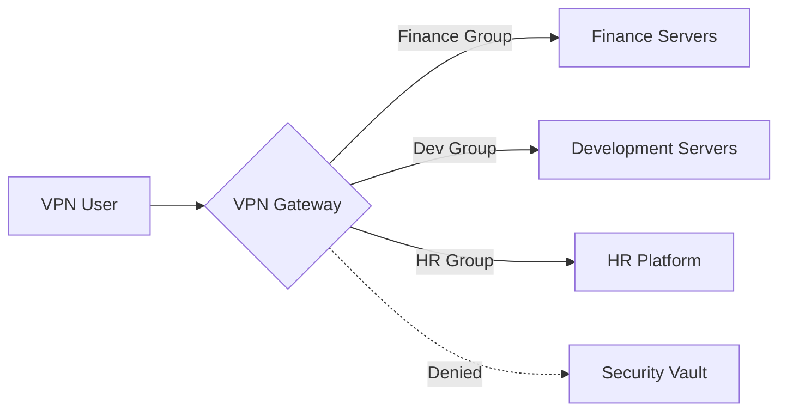

## 0.0 エグゼクティブサマリー: ゼロトラスト時代においてもVPNが依然として重要である理由

現代のエンタープライズにおいて、「境界線」はほぼ消滅しました。しかし、仮想プライベートネットワーク（VPN）は、インフラ管理、安全な管理者アクセス、およびレガシーアプリケーションの橋渡しのために依然として重要なツールです。このガイドは、手動管理が不可能になる一方で、「大規模エンタープライズ」ソリューションが過剰になる可能性のある、300ユーザー環境向けに設計されています。

当社は、高性能、最新の暗号プリミティブ、および簡素化されたコードベースを理由に、**WireGuard** を主要なプロトコルとして重点的に扱いますが、特定のユースケースにおけるOpenVPNとIPsecの役割も認識しています。

## 0.1 本ガイドの読み方

このドキュメントは、段階的な技術スタックを構築しています。高レベルの概念モデルから、低レベルの実装詳細および運用ランブックへと進みます。

- **セクション 1.0～3.0:** 基本概念（「何」）。
- **セクション 4.0～8.0:** アーキテクチャと設計（「なぜ」）。

- **セクション 9.0～13.0:** IDとセキュリティ（「どのように」）。
- **セクション 14.0～18.0:** 高度なエンジニアリングとスケーリング（「困難な点」）。

- **付録:** 実世界の構成テンプレートとトラブルシューティング。

:::tip[運用担当者の視点]
VPNはそれ自体がセキュリティソリューションではありません。それは、堅牢なIDプロバイダー（IdP）と厳格なイングレス/エグレスポリシーによって管理されるべき**トランスポート層**です。トンネル内で「Any/Any」ルーティングを許可してはなりません。
:::

---

## 1.0 VPNの基本: 暗号化されたオーバーレイ

VPNの核心は、信頼できない物理ネットワークを介して仮想のポイントツーポイント接続を作成することです。エンタープライズコンテキストでは、これは通常、クライアントデバイス（ラップトップ、電話）と中央ゲートウェイ間の暗号化されたトンネルを伴います。

### 1.1 接続のライフサイクル

ユーザーがVPN接続を開始すると、以下のシーケンスが発生します。

1. **認証:** クライアントが自身のIDを証明します（多くの場合、証明書またはMFAで保護された認証情報を使用）。
2. **鍵交換:** クライアントとサーバーがDiffie-HellmanやNoiseなどのプロトコルを使用してセッション鍵をネゴシエートします。
3. **トンネルのインスタンス化:** 仮想ネットワークインターフェース（例: `wg0` または `tun0`）が両端に作成されます。
4. **ルーティングの注入:** システムのルーティングテーブルが更新され、特定のIP範囲が仮想インターフェースを介して送信されるようになります。
5. **カプセル化:** 送信パケットは外部ヘッダー（UDP/TCP）でラップされ、暗号化されてゲートウェイに送信されます。
6. **非カプセル化:** ゲートウェイはパケットをアンラップし、内部の宛先に転送します。

### 1.2 カプセル化とオーバーヘッド

VPNトンネルでパケットをラップするたびに、バイトが追加されます。

- **WireGuardのオーバーヘッド:** 32バイト（IPヘッダー + UDPヘッダー + WireGuardヘッダー）。
- **OpenVPNのオーバーヘッド:** 60～80バイト（暗号とトランスポートによって異なる）。
標準のインターネット接続が1500バイト（MTU）の制限を持ち、VPNが32バイトを追加する場合、トンネル内の実際のデータ制限は1468バイトです。これを無視すると、パケットが「フラグメント化」され、速度の低下やウェブサイトの破損につながります。

---

## 2.0 ネットワークエンジニア向け専門用語

プロフェッショナルなシステムを設計するには、パケットフローと暗号化の言語を話す必要があります。

- **トランスポート層（UDP vs. TCP）:** VPNは厳密にUDPを推奨します。TCP-over-TCP（TCPメルトダウン）は、パケット損失時に両方の層が再送信を試みるため、壊滅的なパフォーマンス低下を引き起こします。
- **MTU（Maximum Transmission Unit）:** パケットサイズの物理的な制限（通常1500バイト）。VPNはヘッダー（オーバーヘッド）を追加するため、内部MTUは断片化を避けるために低くする必要があります（例: WireGuardの場合1420）。

- **MSS Clamping:** ルーターがTCPハンドシェイクを傍受し、VPNの縮小されたMTUに適合するように最大セグメントサイズを「クランプ」する技術。これにより、ヘッダーは適合するがデータペイロードは適合しない「ブラックホール」接続を防ぎます。
- **PFS（Perfect Forward Secrecy、前方秘匿性）:** 長期鍵の漏洩が過去のセッション鍵を危険にさらさないという特性。すべてのセッションは一意の一時鍵を使用します。

- **スプリットトンネリング:** 企業トラフィック（例: `10.0.0.0/8`）のみをVPN経由でルーティングし、Netflix/YouTubeはユーザーのローカルISP経由で送信する方式。帯域幅の節約に不可欠です。
- **フルトンネリング（フォーストンネリング）:** すべてのトラフィックをVPN経由でルーティングする方式。すべてのウェブトラフィックが企業DNSおよびDLP（データ損失防止）フィルターを通過することを保証するために、高コンプライアンス環境で必要とされます。

- **CGNAT（Carrier-Grade NAT）:** ISPが1つのパブリックIPを多数のユーザーと共有する状況。これはIPsecのような従来のVPNをしばしば機能不全にしますが、WireGuardでは適切に処理されます。
- **Perfect Forward Secrecy（PFS、前方秘匿性）:** 仮にサーバーの長期秘密鍵が今日盗まれたとしても、攻撃者は昨日記録したセッションを復号できないこと。すべてのハンドシェイクで動的かつ使い捨てのセッション鍵が生成されます。

---

## 3.0 プロトコルの詳細: WireGuard vs. その他の世界

300ユーザーの場合、プロトコル選択が今後3年間のメンテナンスオーバーヘッドを決定します。

### 3.1 WireGuard（ゴールドスタンダード）

- **メリット:** 約4,000行のコード（監査可能）、最先端の暗号（ChaCha20、Poly1305）、ほぼ瞬時のハンドシェイク、極めて高いスループット。
- **デメリット:** 設計上ステートレス（300以上のユーザーの場合、手動管理またはNetBird、Tailscale、Firezoneのような連携レイヤーが必要）。

- **理想的な用途:** パフォーマンス重視のチーム、モバイルユーザー、最新のLinux/クラウド環境。

### 3.2 OpenVPN（レガシーの主力）

- **メリット:** 驚くべき柔軟性、TCPをサポート（制限の厳しいファイアウォールをバイパスするため）、ほぼあらゆる環境で動作。
- **デメリット:** 膨大なコードベース（60万行以上）、遅いコンテキストスイッチング（ユーザー空間 vs. カーネル空間）、複雑な証明書管理。

- **理想的な用途:** 厳格なTLSベースのコンプライアンスまたはレガシーハードウェアサポートが必要な環境。

### 3.3 IKEv2/IPsec（ネイティブな選択肢）

- **メリット:** 高性能、追加アプリなしでWindows、iOS、macOSにネイティブサポート。
- **デメリット:** 正しく設定するのが非常に難しい。「IPsec」には多くの互換性のないバリアントが存在。

- **理想的な用途:** サードパーティクライアントをユーザーにプッシュできない「ゼロインストール」展開。

---

## 4.0 アーキテクチャ: 300ユーザー向け設計

300ユーザー規模にスケールする場合、単一のLinuxボックスでbashスクリプトを実行するだけではもはや十分ではありません。金曜日の午後のハードウェア障害にも耐えうるアーキテクチャが必要です。

### 4.1 高可用性（HA）ペア

アクティブ/パッシブまたはアクティブ/アクティブ構成で2台のVPNゲートウェイを展開します。

- **Keepalived/VRRP:** 仮想IP（VIP）を使用します。ゲートウェイAがダウンした場合、ゲートウェイBが数秒以内にVIPを引き継ぎます。
- **ステート同期:** IPsecのようなプロトコルの場合、フェイルオーバー中にユーザーが接続を失わないようにセッション状態を同期する必要があるかもしれません。（WireGuardは「サイレント」で瞬時に再接続するため、これはより簡単です）。

### 4.2 「すべての大陸にゲートウェイ」モデル

分散された従業員の場合、ロンドンにある単一のゲートウェイでは東京のユーザーは不満を感じるでしょう。

- **Anycast IP:** クラウドベースのAnycastサービスを使用して、ユーザーを最も近い正常なVPNノードにルーティングします。
- **Geo-DNS:** ユーザーの場所に基づいて `vpn.company.com` を異なる地域IPに解決します。

### 4.3 エラスティック・スケーリング（クラウドネイティブな方法）

AWSやAzureでは、VPNゲートウェイを**オートスケーリンググループ**に配置します。CPU使用率が70%を超えると、クラウドは自動的に3番目のゲートウェイを起動します。これには、ノード間でユーザーキーを共有するための外部ステートストア（Redisなど）または連携レイヤーが必要です。

---

## 5.0 セキュリティ目標: 「5つの柱」

実装は、稼働開始前に以下の基準を満たしていることを証明する必要があります。

1. **IDファーストアクセス:** IdP（例: Entra ID、Okta、Google Workspace）に有効なエントリがなければ誰も入場できません。
2. **暗号学的完全性:** 最新の暗号のみを使用します。RSA-2048、SHA-1、3DESは無効にします。
3. **横方向の移動の防止:** デフォルトは「すべて拒否」を使用します。`Marketing` グループのユーザーが `Database` サブネットにpingできないようにします。
4. **エンドポイントの姿勢:** 接続するデバイスがディスク暗号化を有効にしており、VPNトンネルが確立される前にアクティブなウイルス対策ソフトがあることを確認します。
5. **可視性:** すべての接続、切断、および失敗したハンドシェイクは、中央のSIEM（Security Information and Event Management）システムにログとして記録される必要があります。

---

## 6.0 VPNゲートウェイの脅威モデリング

VPNゲートウェイは巨大なターゲットです。もしそれが陥落すれば、攻撃者は「内部」に侵入したことになります。

### 6.1 内部脅威（「こっそり管理者」）

- **リスク:** IT担当者が個人のラップトップ用に「バックドア」の静的キーを作成する。
- **緩和策:** すべてのセッションにMFAを義務付けます。例外はありません。すべてのキー生成イベントをログに記録し、毎週監査します。管理者タスクには「ジャストインタイム」（JIT）アクセスを使用します。

### 6.2 外部脅威（「クレデンシャルスタッファー」）

- **リスク:** 攻撃者が漏洩したパスワードを発見し、副社長としてログインする。
- **緩和策:** デバイスバインディング。VPNは、パスワードと特定のハードウェア証明書/デバイスIDの両方が存在する場合にのみ機能します。認証エンドポイントにレート制限を実装します。

### 6.3 インフラ脅威（「DDoS」）

- **リスク:** UDPフラッディングにより、すべての人がVPNを使用できなくなる。
- **緩和策:** DoS保護のためのWireGuardの「Cookie」メカニズム。ハンドシェイクが証明されるまで、有効なMACのないパケットは無視します。悪意のあるトラフィックをエッジでフィルタリングするために、クラウドベースのWAF（Web Application Firewall）を使用します。

---

## 7.0 ルーティングとサブネット設計（中難度）

効率的なルーティングは、パフォーマンスのボトルネックを防ぎ、セキュリティルールを簡素化します。

### 7.1 サブネットの衝突を避ける

多くのホームルーターは `192.168.1.0/24` を使用します。企業ネットワークもその範囲を使用している場合、ユーザーのコンピューターはトラフィックが自宅の「ローカル」であると認識するため、内部リソースに到達できません。

- **`10.x.x.x` または `172.16.x.x` 空間に統一します。**
- **VPNプールには一意のセグメントを使用します**（例: `100.64.0.0/10` - キャリアグレードNAT範囲）ことで、重複を避けます。

### 7.2 NATの罠

ユーザーがネットワークに入るときに全員を単一のIPにNATすると、ファイアウォールのログにはすべてのトラフィックが「VPNサーバー」から来ているように表示されます。これにより、*どの*ユーザーが*どの*サーバーにアクセスしたかを確認する能力が失われます。

- **解決策:** VPNサブネットを直接ルーティングします。内部サーバーがそれらのIPに対してVPNゲートウェイへのルートを持っていることを確認します。

---

## 8.0 フルトンネル vs スプリットトンネル: 深い文脈分析

この決定は、技術的なものよりも政治的なものであることが多いです。

### 8.1 フルトンネルの利点

- **セキュリティ:** すべてのウェブトラフィックをセキュアなゲートウェイ（SWG）経由で強制できます。これにより、ユーザーがフィッシングサイトにアクセスしたり、会社の勤務時間中にマルウェアをダウンロードしたりするのを防ぎます。
- **プライバシー:** 公共Wi-Fi（ホテル、カフェ）での盗聴からユーザーのトラフィックを保護します。

- **コンプライアンス:** 多くの業界（金融、医療）では、データ保護法に準拠するためにフルトンネリングが必須です。

### 8.2 スプリットトンネルの利点

- **パフォーマンス:** Zoom/Teamsの通話はデータセンターを経由して戻る必要はありません。直接インターネットに接続させます。
- **コスト:** ユーザーがランチ休憩中に4K YouTubeを視聴する帯域幅の料金を支払う必要はありません。

- **ハードウェア負荷:** VPNゲートウェイは、Netflixのような無害な数ギガバイトのトラフィックを処理する必要がありません。

:::caution[ハイブリッドな中間点]
ほとんどの現代の企業は**スプリットインクルージョン**を使用しています。内部CIDR範囲（例: `10.0.0.0/8`）と特定のSaaS IPを含め、残りのインターネットトラフィックはローカルISPに任せます。
:::

---

## 9.0 IDアーキテクチャ: VPNを現実に接続する

300ユーザーの場合、ゲートウェイ上のローカルLinuxユーザーを管理することはできません。IDブリッジが必要です。

### 9.1 IDループ

1. **クライアントアプリケーション**がログインを要求します。
2. **ゲートウェイ**がユーザーをOIDC/SAMLログインページ（Okta/Entra ID）にリダイレクトします。
3. **ユーザー**がMFA（FIDO2、認証アプリ）を完了します。
4. **IdP**がトークン（JWT）をゲートウェイに返送します。
5. **ゲートウェイ**が短寿命のWireGuardキーを生成し、クライアントにプッシュします。

### 9.2 MFA実装戦略

- **SMSを避ける:** SIMスワップやSS7傍受に対して脆弱です。
- **TOTPまたはWebAuthnを優先する:** セキュリティを真剣に考えるなら、VPNアクセスにはハードウェアキー（Yubikey）を必須とします。FIDO2は現代の認証セキュリティの頂点です。

---

## 10.0 アクセス制御リスト（ACL）とマイクロセグメンテーション

VPNは「フラット」なネットワークであるべきではありません。



### 10.1 RBACの実装

- IdPグループをネットワークタグにマッピングします。
- **WireGuard**を使用している場合は、**NetBird**や**Tailscale**のようなツールを使用して、Web UI経由でこれらのルールを定義します。

- **Linux/Iptables**を使用している場合は、ユーザーが接続したときにルールを更新する動的スクリプトが必要です。これはしばしば「動的ファイアウォールポリシー」と呼ばれます。

---

## 11.0 監視とログ: 「空の目」になる

「午前2時にバックアップサーバーにアクセスしたのは誰か？」と尋ねられたとき、VPNログは答えを持っている必要があります。

### 11.1 追跡すべき重要なメトリクス

- **同時セッション数:** ハードウェアのCPU/RAM制限に達していますか？
- **ユーザーあたりのデータスループット:** 誰かがデータ漏洩を行っていませんか（その役割に比べて異常に高いアップロード量）？

- **ハンドシェイクのレイテンシー:** 認証サーバーは遅いですか？
- **破棄されたパケット:** MTUの問題またはISPのスロットリングを示します。

### 11.2 SIEM統合

ログをElasticsearch、Splunk、またはAzure Monitorにストリーミングします。「不可能な移動」を探します。たとえば、ニューヨークからログインしたユーザーが10分後にフランクフルトからログインするといったものです。これはセッション盗難の主要な指標です。

---

## 12.0 MTU/MSSの問題解決（難）

これはVPNヘルプデスクのチケットの主な原因です。ユーザーは接続できますが、大きなウェブサイトを開いたり、メールを送信したりできません。

### 12.1 「Ping of Death」テスト

VPNは接続されているがデータが動かない場合、以下を実行します。
`ping -M do -s 1400 10.0.0.1` （Linuxの場合）または `ping 10.0.0.1 -f -l 1400` （Windowsの場合）。
`1400` を減らし続け、pingが成功するまで続けます。それがパスMTUです。

### 12.2 解決策

- WireGuardのMTUを `1280` （IPv6の最も安全な最小値）に設定します。
- ゲートウェイでMSS Clampingを有効にします。
    `iptables -t mangle -A FORWARD -p tcp --tcp-flags SYN,RST SYN -j TCPMSS --clamp-mss-to-pmtu`
これにより、サーバーはリモートサーバーに、VPNトンネルに到達する前にパケットを縮小するよう指示します。

---

## 13.0 高可用性と負荷分散（難）

ダウンタイムなしで300ユーザーをサポートするには、冗長性が必要です。

### 13.1 ラウンドロビンDNS

最も単純な形式です。`vpn.company.com` を3つの異なるIPアドレスにポイントします。クライアントはランダムに1つを選択します。1つが失敗した場合、ユーザーは「ライブ」サーバーに到達するために2〜3回再接続する必要があるかもしれません。

### 13.2 TCP/UDPロードバランサー

クラウドロードバランサー（AWS NLBやAzure Load Balancerなど）を使用します。ヘルスチェックを実行し、機能しているゲートウェイにのみトラフィックを送信します。注意: WireGuardはコネクションレス（UDP）であるため、これはトリッキーな場合があります。送信元IPに基づいた「セッションスティッキー」を使用する必要があります。

---

## 14.0 VPNの災害復旧（DR）

プライマリデータセンターがダウンした場合、どうなりますか？

- **クラウドバックアップ:** 常に異なるクラウドリージョン（例: AWS vs GCP）に「コールドスタンバイ」ゲートウェイを用意します。
- **コードとしての設定:** VPN設定をGitに保存します。サーバーがダウンした場合、TerraformやAnsibleを使用して5分で新しいサーバーを起動できるはずです。「不変性」はDRにおける最良の友人です。

- **緊急キー:** IdP自体がダウンした場合に備えて、物理的な「ガラス割り」キーセットを金庫に保管します。

---

## 15.0 運用エクセレンス: 開発者体験

使いにくいセキュアなVPNは、最も才能あるエンジニアによって迂回されるでしょう。

- **自動接続:** ユーザーが社内オフィスWi-Fiに接続していないときはいつでもクライアントを自動的にオンにするように設定します。
- **SSO統合:** ワンクリックでログイン。ユーザーが管理する別途のパスワードや複雑なキーファイルはありません。

- **サイレントアップデート:** MDM（Jamf、InTune）を使用して、ユーザーを煩わせることなくクライアントアップデートをプッシュします。
- **分かりやすいホスト名:** 内部DNS（例: `jira.int.company.com`）がVPN経由で機能するようにし、ユーザーがIPアドレスを覚える必要がないようにします。

---

## 16.0 コンプライアンスと監査（「退屈」だが不可欠な部分）

SOC2、HIPAA、またはGDPRの対象である場合、VPNは重要な制御機能です。

- **監査証跡:** 管理者がACLを変更するたびにログを記録します。
- **セッション終了:** 盗難されたラップトップでの「永遠のトンネル」を防ぐため、12時間または24時間後にユーザーを自動的にログオフさせ、MFAによる再認証を強制します。

- **データレジデンシー:** EUにいる場合、VPNゲートウェイが非準拠の管轄区域（特定の米国ベースのデータセンターなど）にあるノードを経由してトラフィックをルーティングしていないことを確認します。

---

## 17.0 カーネルレベルでのパフォーマンス最適化

最高の速度を得るには、ゲートウェイ上のLinuxカーネルを調整します。これらの変更により、サーバーは秒間10,000パケット以上を軽々と処理できます。

```bash
# Increase packet queue lengths
sysctl -w net.core.netdev_max_backlog=5000
# Increase receive/send buffer sizes (16MB)
sysctl -w net.core.rmem_max=16777216
sysctl -w net.core.wmem_max=16777216
# Enable BBR (Bottleneck Bandwidth and Round-trip propagation time) for TCP
sysctl -w net.core.default_qdisc=fq
sysctl -w net.ipv4.tcp_congestion_control=bbr
```

### 17.1 マルチキューサポート

現代のサーバーは16個以上のCPUコアを持っています。WireGuardはデフォルトでこれをうまく処理しますが、サーバーのNIC（ネットワークインターフェースカード）がすべてのコアに割り込み要求（IRQ）を分散するように構成されていることを確認してください。`/proc/interrupts` をチェックして確認します。すべての割り込みがCore 0に集中している場合、パフォーマンスは頭打ちになります。

---

## 18.0 将来への対応: ZTNAとポストVPNの世界

業界はゼロトラストネットワークアクセス（ZTNA）へと移行しています。

- **アイデア:** ユーザーに「ネットワークアクセス」を与えるのではなく、リバースプロキシを介して「アプリケーションアクセス」を与えます。
- **タイムライン:** WebベースのアプリケーションをZTNA（Cloudflare Tunnel、Zscaler、Pomerium）に移行し始め、シッククライアントアプリケーションやサーバー管理のためにVPNを維持します。VPNは「管理プレーン」となり、ZTNAは「ユーザープレーン」となります。

---

## 19.0 トラブルシューティングシナリオ: 実世界の教訓

### シナリオ A: 「遅いビデオ通話」

**症状:** ユーザーは、自宅のWi-FiではZoomが正常に動作するが、VPNでは途切れると報告。
**診断:** ユーザーは「長くて太いパイプ」（高レイテンシー、高帯域幅）を使用しています。標準のTCP輻輳制御（Cubic）は、レイテンシーを輻輳の兆候と誤解するため、ここでは失敗します。

**解決策:** ゲートウェイをBBRに切り替えます（セクション17.0を参照）。BBRは実際の帯域幅を測定し、レイテンシーをはるかにより適切に処理します。

### シナリオ B: 「ゾンビセッション」

**症状:** ダッシュボードにはユーザーが接続中と表示されているが、ユーザーは4時間前に切断したと言う。
**診断:** クライアントのインターネット接続が突然切断され（エレベーター内のトンネルなど）、ゲートウェイが「さようなら」パケットを受信しなかったためです。UDPはコネクションレスであるため、サーバーはセッションをアクティブなまま維持します。

**解決策:** `PersistentKeepalive` を減らし、サーバー側で10分の「デッドピア検出」（DPD）タイムアウトを実装します。

### シナリオ C: 「内部サイトがいつまでも読み込まれない」

**症状:** ブラウザのタブにはページタイトルが表示されるが、ページコンテンツはいつまでも読み込まれない。
**診断:** MTUの不一致。小さなハンドシェイクパケットは適合するが、大きなデータパケット（HTML/画像）は途中のルーターによって破棄されています。

**解決策:** ゲートウェイでMSS Clampingを実装します（セクション12.2）。

---

## 20.0 Linux、Mac、Windows CLIクイックスタート

### 20.1 Linux（クライアント）

```bash
# Install
sudo apt install wireguard
# Config
sudo nano /etc/wireguard/wg0.conf
# Up
sudo wg-quick up wg0
```

### 20.2 macOS（クライアント）

最高の体験を得るには公式のMac App Storeアプリを使用するか、CLIにはHomebrewを使用します。

```bash
brew install wireguard-tools
sudo wg-quick up ./myconfig.conf
```

### 20.3 Windows（クライアント）

`wireguard.com` から公式のMSIインストーラーを使用します。これにより、非管理者ユーザーがVPNをオン/オフに切り替えることを可能にするシステムサービスがインストールされます（正しく構成されている場合）。

---

## Appendix A: WireGuard基本サーバー構成（Ubuntu 22.04）

```ini
# /etc/wireguard/wg0.conf
[Interface]
PrivateKey = <SERVER_PRIVATE_KEY>
Address = 10.0.0.1/24
ListenPort = 51820

# Force MTU to avoid fragmentation
MTU = 1420

# PostUp/PostDown for routing
PostUp = iptables -A FORWARD -i %i -j ACCEPT; iptables -t nat -A POSTROUTING -o eth0 -j MASQUERADE
PostDown = iptables -D FORWARD -i %i -j ACCEPT; iptables -t nat -D POSTROUTING -o eth0 -j MASQUERADE

[Peer]
# Staff Member 1
PublicKey = <CLIENT_PUBLIC_KEY>
AllowedIPs = 10.0.0.2/32
```

## Appendix B: Linuxクライアントの詳細設定

```bash
# Generate keys
wg genkey | tee privatekey | wg pubkey > publickey
# Create config
sudo nano /etc/wireguard/wg0.conf
# Start service permanently
sudo systemctl enable --now wg-quick@wg0
```

## Appendix C: トラブルシューティングチェックリスト

1. **接続できない？** -> 企業ファイアウォールでUDPポート51820が開いているか確認します。
2. **接続はされているがインターネットに接続できない？** -> `sysctl net.ipv4.ip_forward` が `1` に設定されているか確認します。
3. **パフォーマンスが遅い？** -> MTUを `1280` に下げます。
4. **特定のアプリが動作しない？** -> MSS Clampingルールを確認します。
5. **DNS障害？** -> クライアントの `/etc/resolv.conf` が内部DNSサーバーを指しているか、または `wg0.conf` 内の `DNS = 10.0.0.1` ディレクティブを使用していることを確認します。

---

## Conclusion: アーキテクトへの最終的な考察

300ユーザー向けのVPNを構築することは、**セキュリティ**、**プライバシー**、**ユーザビリティ**の間のバランスを取る行為です。WireGuardのような最新のプロトコルを選択し、IDフローを自動化し、ネットワークの法則（MTU/MSS）を尊重することで、ユーザーには見えず、攻撃者には侵入不可能なシステムを構築できます。

最も成功したVPNとは、誰もその稼働に気づかないVPNです。常に用心し、ログを記録し、フェイルオーバーが必要になる前に必ずテストしてください。

---

## 21.0 セキュアなトンネルのための高度な暗号構成

WireGuardとIPsecは堅牢なセキュリティをすぐに利用できる形で提供しますが、エンタープライズ環境では、FIPS 140-2やNISTガイドラインのような規制基準を満たすために、明示的な暗号化の強化が必要になることがよくあります。

### 21.1 暗号スイートの選択（モダンスタック）

量子計算の可能性が高まる世界では、適切な暗号を選択することが不可欠です。

- **KEM（鍵カプセル化メカニズム）:** **Kyber**や**McEliece**のようなポスト量子アルゴリズムの調査を開始してください。これらはまだほとんどのVPNクライアントで標準ではありませんが、一部のWireGuardフォークで「実験的サポート」段階に達しています。
- **AEAD（認証付き暗号化）:** 常に**ChaCha20-Poly1305**や**AES-GCM**のようなAEAD対応の暗号を使用してください。これらは単一のパスで機密性と整合性の両方を提供し、「暗号文改ざん」攻撃を防ぎます。

### 21.2 Noise Protocol Framework

WireGuardは**Noise Protocol Framework**に基づいて構築されています。このフレームワークは「1-RTT」ハンドシェイクを可能にし、単一のラウンドトリップで接続が確立されます。これが、WireGuardが古いプロトコルが必要とする「4ウェイハンドシェイク」よりも著しく速く感じる理由です。

---

## 22.0 クラウドネイティブVPN統合（AWS、GCP、Azure）

300人のユーザーが主にパブリッククラウドのリソースにアクセスしている場合、VPNアーキテクチャはそれを反映しているべきです。

### 22.1 AWS Transit Gateway (TGW)

各ユーザーをVPC内のゲートウェイに接続するのではなく、Transit Gatewayに関連付けられた**AWS Client VPN**に接続します。

- **利点:** Transit GatewayはすべてのVPCの中央ルーターとして機能します。新しく作成するVPCは、ゲートウェイを再設定することなくVPNからすぐにアクセスできます。
- **セキュリティ:** TGWアタッチメントにセキュリティグループを適用でき、一元的な制御ポイントを作成できます。

### 22.2 Azure Virtual WAN

Microsoft 365とAzureに深く投資している組織にとって、**Azure Virtual WAN**はグローバルな「ブランチツークラウド」接続モデルを提供します。

- **Point-to-Site (P2S):** これは、AzureにおけるユーザーからゲートウェイへのVPNを指す用語です。OpenVPNとIKEv2をサポートし、MFAのためにMicrosoft Entra ID（旧Azure AD）とネイティブに統合されます。

---

## 23.0 VPNレイテンシーの管理: 物理法則

サーバーがどれほど高速であっても、光速を超えることはできません。しかし、「ラストマイル」と「ミドルマイル」を最適化することは可能です。

### 23.1 ハンドシェイクレイテンシーの削減

高レイテンシーの地域（例: 南米のユーザーがバージニア州ベースのサーバーに接続する場合）では、ハンドシェイクの余分なラウンドトリップごとに500msの待機時間が追加されます。

- **解決策:** 最小限のラウンドトリップで済むUDPベースのプロトコル（WireGuard）を使用します。TCPベースのVPNは、いかなるコストを払っても避けてください。

### 23.2 「ミドルマイル」の最適化

大規模なクラウドプロバイダー（AWS、Cloudflare、Google）は、公共インターネットよりも30〜40%高速なプライベート光ファイバーバックボーンを持っています。

- **テクニック:** ユーザーを自宅近くの「ローカル」エントリーポイント（PoP）に接続させます。そのPoPは、プロバイダーのプライベートバックボーンを介して中央のデータセンターにトラフィックを運びます。これは**Tailscale**（DERPリレー経由）および**Cloudflare Warp**の速度の秘密です。

---

## 24.0 結論: 回復力に関する最後の言葉

結局のところ、300ユーザー向けのVPNは**ミッションクリティカルなインフラストラクチャ**の一部です。VPNがダウンすれば、会社は機能停止します。

1. **冗長性が最優先です。** （2つのノードは1つであり、1つのノードはゼロです）。
2. **IDが境界線です。** （MFAは任意ではありません）。
3. **パフォーマンスは二進法です。** （遅ければ、ユーザーは使いません）。
4. **ログが真実です。** （ログがなければ、それは起こらなかったことになります）。

常に警戒を怠らず、パケットのドロップを監視し、プライベートキーは常に非公開に保ってください。
