## 地盤が最後のひと揺れをする

4巻を終え、私たちは壁を築き（[I](/posts/secure_systems_architecture/)）、あらゆるドアの全てのプリンシパルを検証し（[II](/posts/identity_and_access_in_depth/))、メッセージを偽造不可能なものにし（[III](/posts/cryptography_engineering_in_depth/))、それでもすり抜けた侵入を検知し、生き残る方法を学んだ（[IV](/posts/detection_and_response_in_depth/)）。これら全てのアイデアは、静かに真実でなくなったある前提に基づいていた。それは、あなたが所有し、指し示すことができる、「サーバー」、「マシン」、「モノ」が存在するという前提だ。

クラウドネイティブの世界では、その前提は溶解する。

* 「サーバー」とは、90秒しか存在せず、全く同じ双子に置き換えられる**コンテナ**である。
* インフラストラクチャはラックに組まれるのではなく、パイプラインが適用する**YAMLファイル**である。
* アプリケーションは、あなたが書いたものではなく、あなたが完全に監査するのが難しいビルドシステムによって組み立てられた、あなたが書かなかった**2000個の依存関係とあなたのコード**である。

この最終巻は、*その*世界を守るためのものだ。そこでは、ペリメータは完全に失われ、ワークロードはペットではなく家畜であり、この10年間で最も壊滅的な侵害は、あなたの玄関からではなく、あなたの**サプライチェーン**からやってくる。シリーズで学んだ全ては依然として適用されるが、それが適用されるサーフェスは、1日に数千回も現れては消えている。

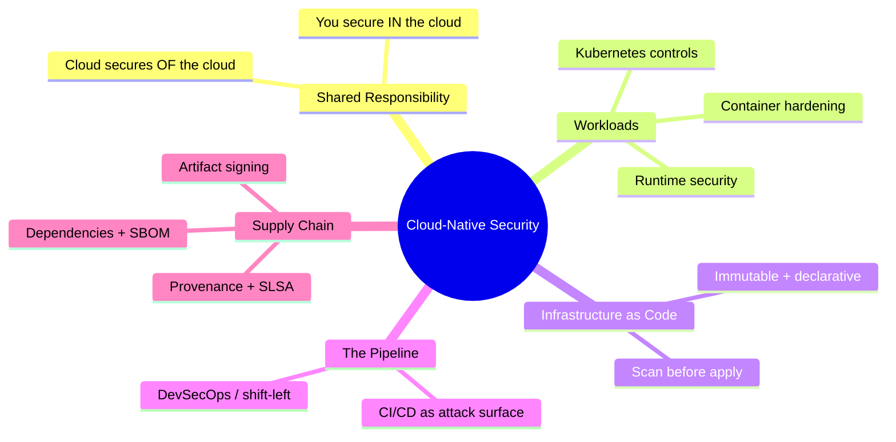

---

## 第I部：共有責任モデル

クラウドセキュリティにおける最初で、最も誤解されている概念：**クラウドプロバイダーはあなたのアプリケーションを保護しない。** 彼らはクラウドが実行される*インフラストラクチャ*を保護するのであり、あなたはそれに*入れるもの*を保護する。サービスモデルによってその境界線は移動し、どこにその境界線があるかの混乱の中に侵害は存在する[^1]。

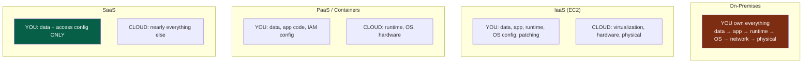

:::important[あなたの責任は決してゼロにならない]
全ての列に共通する点に注目してください：**あなたは常にあなたのデータとアクセス設定を所有しています。** 「クラウド侵害」の圧倒的多数は、プロバイダーがハッキングされたのではなく、*顧客*の設定ミスです：公開S3バケット、過度に許可されたIAMロール、`0.0.0.0/0`に公開されたデータベース。クラウドは強力なデフォルトオフのプリミティブを提供しますが、それらをオフのままにするのはあなた次第です。プロバイダーの侵害ではなく、設定ミスがクラウドデータ漏洩の第一原因です。[^2]
:::

---

## 第II部：ワークロードの保護

### 第1章：コンテナセキュリティ - 層化された現実

コンテナは軽量VMではなく、*共有ホストカーネル*上の分離された*プロセスのセット*です。その単一の事実は、その脅威モデル全体を推進し、防御はイメージからランタイムまで層化されています。

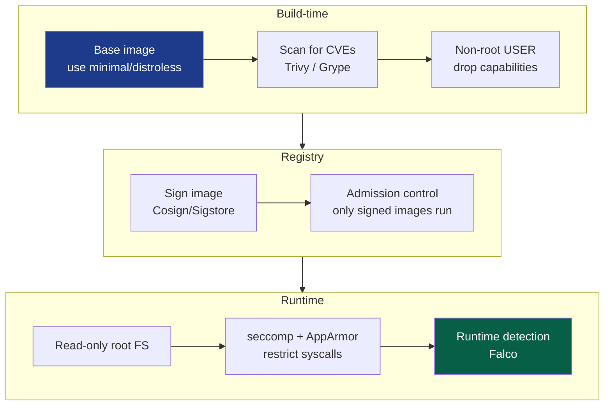

最も効果的なコンテナプラクティス（費用対効果順）：

* **最小限のベースイメージ** - `distroless`またはscratchイメージは、あなたのアプリと*それ以外は何もない*ものを含みます：シェルも、パッケージマネージャーも、`curl`もありません。内部に到達した攻撃者は、ピボットするためのツールを持ちません。また、CVEサーフェスを1桁削減します。OSパッケージがないということは、OSパッケージの脆弱性もないということです。
* **root権限で実行しない** - root権限で実行されているコンテナプロセスがコンテナからエスケープした場合、それは*ホスト上の*root権限になります。非root `USER`を設定し、全てのLinuxケーパビリティをドロップし、必要なものだけを戻します。
* **読み取り専用のルートファイルシステム** - コンテナが自身のファイルシステムに書き込めない場合、攻撃者はそこにペイロードをドロップできません。
* **全てのイメージをスキャンする** - CIでの`Trivy`/`Grype`、クリティカルなCVEに対してビルドをブロックします。

:::warning[コンテナエスケープは全てを決定する]
コンテナはホストカーネルを共有するため、**カーネルエクスプロイトまたは設定ミスは、ホスト全体の乗っ取り**であり、1つのホストから、しばしばクラスタ全体に影響します。これを容易にする代表的な罪：`--privileged`での実行、Dockerソケット(`'/var/run/docker.sock'`)をコンテナにマウントすること（それはホスト上のroot権限を、プレゼント包装で渡すようなもの）、そしてUID 0での実行。特権コンテナは、`sudo`権限の付与と同じくらいの吟味を必要とする決定として扱ってください。[^3]
:::

### 第2章：Kubernetes - オーケストレータのハードニング

Kubernetesはコンテナのための分散オペレーティングシステムであり、そのセキュリティはそれ自体が主題です。攻撃サーフェスは4つの前面にまたがり、「クラウドネイティブセキュリティの**4つのC**」として記憶されます：Cloud, Cluster, Container, Code[^4]。

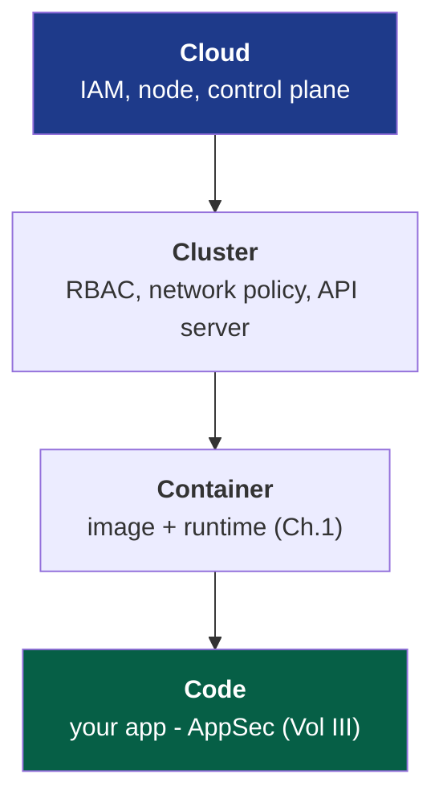

耐荷重となるクラスタコントロール（それぞれの攻撃パスを閉じるもの）：

::::steps

:::step[RBAC - APIに対する最小権限]{subtitle="誰がクラスタに対して何ができるか"}
Kubernetes APIサーバーはクラウンジュエルであり、それを制御する者は全てのワークロードを制御します。第II巻の最小権限の教訓を適用してください：サービスアカウントに対するワイルドカード`cluster-admin`は使用しない、ロールを名前空間にスコープする、そしてデフォルトのサービスアカウントトークンを必要としない場所にマウントしない。過度に特権化されたトークンを持つPodは、クラスタ乗っ取りへの直接のピボットポイントとなります。
:::

:::step[ネットワークポリシー - デフォルト拒否]{subtitle="東西セグメンテーション"}
デフォルトでは、*全てのPodが他の全てのPodと通信できます*。フラットで、信頼された、まさに第I巻が警告したネットワークモデルです。**デフォルト拒否**のNetworkPolicyを適用し、必要なフローのみを明示的に許可します。これはPodネットワークに適用されたマイクロセグメンテーション（Vol I/II）です：侵害されたPodを、発射台から行き止まりに変えます。
:::

:::step[Podセキュリティ標準 - 危険なものを制限]{subtitle="コンテナルールを強制する"}
**Restricted** Pod Security Standardを強制します：特権Podなし、ホスト名前空間共有なし、非rootのみ、読み取り専用ルートFS。これは、第1章のコンテナルールが、開発者に推奨されるだけでなく、プラットフォームによって*必須*とされる場所です。
:::

:::step[Secrets - "暗号化"としてBase64を使用しない]{subtitle="機密情報を保護する"}
Kubernetes Secretsはデフォルトでetcdに*Base64エンコード*されているだけで、暗号化されていません。etcdの**保存時の暗号化**を有効にするか、さらに、外部マネージャー（Vault、CSIドライバー経由のクラウドKMS）と統合して、Secretsが決してetcdに復旧可能な形で格納されないようにします。そうでなければ、etcdの読み取りアクセス権を持つ者は全てのSecretを読み取ることができます。
:::

::::

:::tip[Admission Controlはあなたのポリシーのチョークポイント]
クラスタに入る全てのオブジェクトは、ポリシーをコードとして強制するのに理想的な場所である**Admission Controller**を通過します。**OPA Gatekeeper**や**Kyverno**のようなツールは、非準拠のワークロードをドアで*拒否*することを可能にします：「署名のないイメージはない」、「リソース制限のないコンテナはない」、「`latest`タグはない」。これは第II巻のゼロトラストモデルのPEPであり、クラスタの正面玄関に適用されます。Admission時に強制されたポリシーは、開発者によって忘れられることはありません。[^5]
:::

### 第3章：ランタイムセキュリティ - Podが侵害されたと仮定する

これまでの全ては予防策です。第IV巻の*侵害を前提とする*考え方をワークロードに適用します：コンテナは、最終的には不正なものを実行することになるでしょう。**ランタイムセキュリティ**はライブの動作を監視し、異常をフラグ付けします。単一のプロセスしか実行しないはずのコンテナ内でシェルが起動する、これまで見たことのないIPへのアウトバウンド接続、`/etc/passwd`への書き込み。**Falco**のようなツールは、カーネルのシステムコールストリームを検知に変換し、第IV巻のSIEM/検知エンジニアリングの規律をエフェメラルなワークロードまで拡張します。

---

## 第III部：インフラストラクチャ・アズ・コード - 設計図の保護

クラウドネイティブでは、インフラストラクチャは*設定*されるのではなく、*宣言*されます。Terraform、CloudFormation、Pulumi。これはセキュリティ上の*贈り物*です：インフラストラクチャ全体がコードであるため、*リソースが1つも存在しないうちに、設定ミスをスキャンできます*。

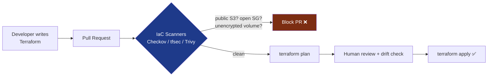

これは**シフトレフト**（第I巻のSSDLCテーマ）の究極の表現です：侵害を引き起こしたであろう設定ミス、世界に開かれたセキュリティグループ、暗号化されていないデータベース、公開バケットが、コードレビューで、*本番環境に存在する前に*捕捉されます。脆弱性を修正するコストは、発見されるのが遅いほど指数関数的に増大します。

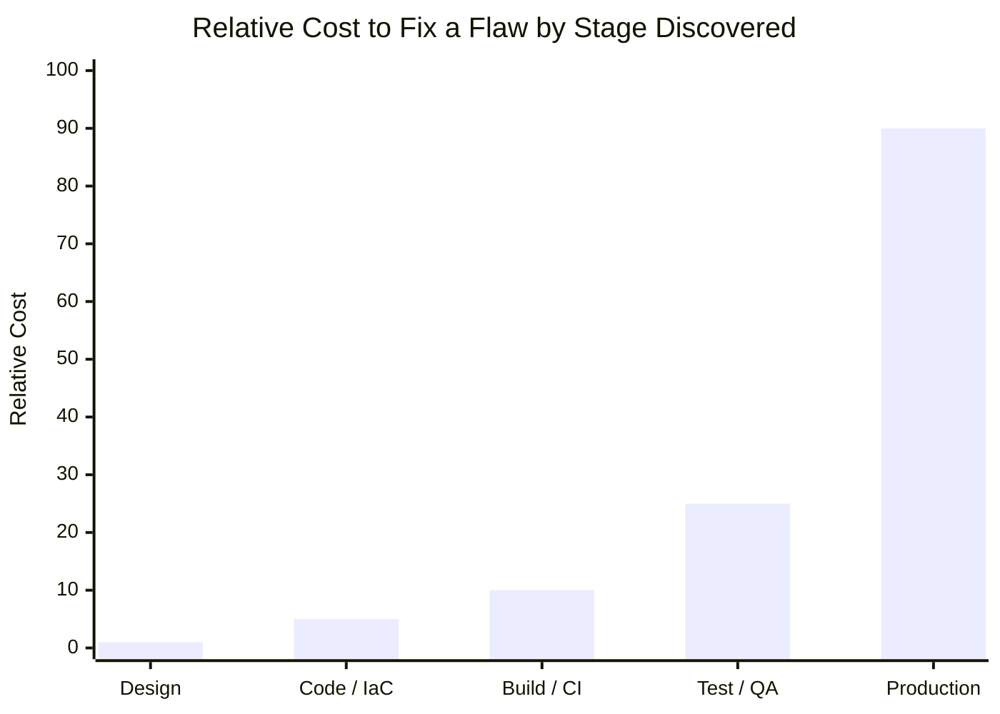

右へ進むごとにコストは数倍になり、本番環境での*侵害*はこのチャートの外にあります。IaCスキャンは、検出を可能な限り安価な列に押し付ける方法です。

:::note[イミュータビリティはセキュリティプロパティです]
IaCは**イミュータブルインフラストラクチャ**を可能にします：サーバーはインプレースでパッチ適用されるのではなく、既知の良いイメージから*置き換え*られます。これは静かに2つの問題を解決します。**設定ドリフト**（「実行中のもの」と「実行中だと考えているもの」のゆっくりとした乖離）は、デプロイごとにソースから再構築されるため、消滅します。そして攻撃者の**永続化**ははるかに困難になります。実行中のホストに仕掛けられたバックドアは、そのホストが再デプロイされるときに消去されます。これは数時間後かもしれません。家畜、ペットではない、は単なる運用上の利便性ではなく、セキュリティポスチャです。
:::

---

## 第IV部：サプライチェーン - 今世紀のフロンティア

現代のソフトウェアにおける不快な真実：**あなたが出荷するものの5%しか書いていない。** 残りの95%はオープンソースの依存関係、ベースイメージ、ビルドツールであり、見知らぬ人からのコードで、推移的にプルされ、あなたのアプリケーションの完全な権限で実行されています。サプライチェーンは現在、最も活発に悪用されているセキュリティのフロンティアです。なぜなら、ハードニングされたターゲットを侵害するよりも、*それが信頼しているもの*を侵害する方が簡単だからです。

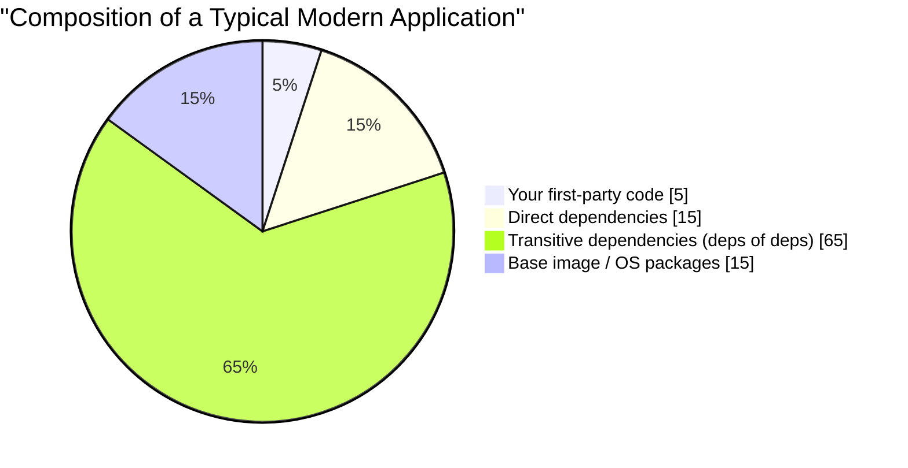

あの巨大な「推移的」なスライスがポイントです：あなたは直接の15個の依存関係を*選択*しましたが、聞いたこともない数百個の依存関係を継承しました。そのうちのどれか一つがあなたのセキュリティを終わらせる可能性があります。

### 第5章：サプライチェーン攻撃の解剖

近年を定義した大惨事、**SolarWinds**（2020年、侵害されたビルドパイプラインが署名付きアップデートにバックドアを注入し、18,000組織に配布）と**Log4Shell**（2021年、*数百万*ものアプリケーションに埋め込まれたロギングライブラリにおける、容易に悪用可能なRCE）[^6]は、共通の形状を共有しています。

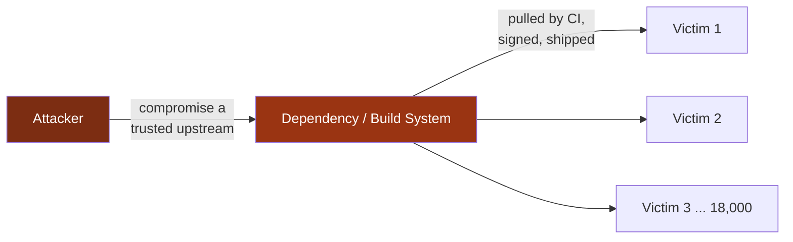

1回の侵害で、数千もの被害者が出ます。彼らは皆、他の全てを正しく行っていました。この非対称性が、サプライチェーンセキュリティが国家安全保障の優先事項となり、以下の防御策が今や必須となっている理由です。

### 第6章：現代の防御策 - SBOM、署名、そしてSLSA

3つの相互に関連するプラクティスが、3つのサプライチェーンの質問に答えます：*それは何を含んでいるか、それは主張通りのものであるか、そしてそれがどのように構築されたかを信頼できるか*。

| Defense | Question it answers | What it is |
| --- | --- | --- |
| **SBOM** | *私のソフトウェアには実際に何が含まれていますか？* | Software Bill of Materials（ソフトウェア部品表）、すべてのコンポーネントとバージョンの機械可読インベントリ。次のLog4Shellが発生したとき、SBOMをgrepすれば、数週間ではなく数分で、あなたが露呈しているかどうかを知ることができます。[^7] |
| **Artifact signing** | *このアーティファクトは本物であり、改ざんされていないか？* | ビルド出力（**Sigstore/Cosign**）を暗号学的に署名し、消費者がプロビナンスを検証できるようにします。第III巻の署名をビルドアーティファクトに適用します。 |
| **SLSA** | *それを構築したプロセスを信頼できますか？* | Supply-chain Levels for Software Artifacts（ソフトウェアアーティファクトのためのサプライチェーンレベル）、ビルド整合性に対する段階的なフレームワーク：ソース検証済み、ビルド分離済み、プロビナンス生成・署名済み。[^8] |

エンドツーエンドのセキュアパイプラインは、これらすべてをシリーズのすべてと連携させます。

```mermaid
flowchart LR
    SRC[Signed commit<br/>+ branch protection] --> DEP[Dependency scan<br/>+ pin versions + SBOM]
    DEP --> BUILD[Isolated, ephemeral<br/>build - SLSA provenance]
    BUILD --> SAST[SAST + secret scan]
    SAST --> ART[Sign artifact<br/>Cosign]
    ART --> IMGSCAN[Image CVE scan]
    IMGSCAN --> ADMIT[Admission control:<br/>verify signature + policy]
    ADMIT --> RUN[Runtime security<br/>Falco]
    style BUILD fill:#1e3a8a,color:#fff
    style ADMIT fill:#065f46,color:#fff
```

:::warning[CI/CDパイプライン自体が主要なターゲットです]
あなたのビルドシステムは神のような権限を持っており、全てのシークレットを読み取り、全てのアーティファクトに署名し、本番環境にデプロイできます。漏洩したCIトークン、特権ランナーで信頼されていないコードを実行する悪意のあるプルリクエスト、または汚染されたGitHub Actionは、*あなた自身の有効な署名が付いた*バックドア付きソフトウェアを出荷する直接のパスです。パイプラインを本番環境のインフラストラクチャとして扱ってください：最小権限トークン（OIDCフェデレート、短命、第II巻）、ログにシークレットなし、ピン留めされたアクションバージョン（SHAごと、タグではない）、そして信頼されていないコードのための分離されたエフェメラルランナー。あなたの防御を構築するパイプラインは、造幣局が信頼を製造するのと同じ理由でターゲットとなります。[^9]
:::

---

## 第VI部：DevSecOps - セキュリティを継続的にする

5巻全てが、単一の文化変革に収束します。古いモデル、つまり最後にソフトウェアをレビューして「ノー」と言ったセキュリティチームは、1日に1000回デプロイする世界を生き残れません。**DevSecOps**はセキュリティチームのゲートを溶解させ、その専門知識をパイプラインに*分散*させ、セキュリティを自動化、継続的、そして全員の仕事にします。

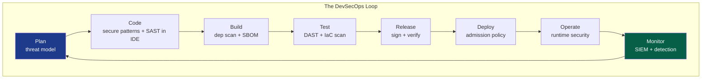

そのループの各ノードは、このシリーズの各章であり、現在は自動化され埋め込まれています：脅威モデリング（I）、セキュアコーディングと暗号（III）、依存関係とIaCスキャン（V）、署名（III/V）、Admission Controlとゼロトラスト強制（II）、ランタイム検知とSIEM（IV）。セキュリティは*フェーズ*ではなくなり、パイプラインの*プロパティ*となり、継続的にチェックされ、コードによって強制され、パスするときは不可視で、失敗したときだけ大声で通知されます。

:::important[全ての中核となる文化]
DevSecOpsは20%のツールと80%の文化です。その創設理念は、**セキュリティは部門の拒否権ではなく、共有責任である**ということです。安全なパスを*簡単な*パスにすることで到達します：事前承認されたハードニングされたベースイメージ、デフォルトで安全なテンプレート、すぐに準拠できるIaCモジュール、そして秒単位の自動フィードバック（プルリクエスト内、四半期ごとの監査ではなく）。安全なことをすることが*より少ない*仕事であるとき、セキュリティはスケールします。それが税金であるとき、開発者はそれを回避するルートを見つけます、毎回。
:::

---

## 結論：シリーズの統合

第I巻では、物理レイヤー、壁のケーブル、ワイヤーのフレームから始まり、ここでは、90秒しか存在しないコンテナ、そしてそれ自体がgitリポジトリのテキストに過ぎないインフラストラクチャへと至ります。5巻を通して、一つの真実があらゆるレベルで積み重なりました。

> **システムを保護する単一のコントロールは存在しない。セキュリティは深さであり、独立した、重なり合うコントロールの層であり、それぞれが先行するものが最終的に失敗することを前提としている。**

その深さが実際に何になったかを見てみましょう。

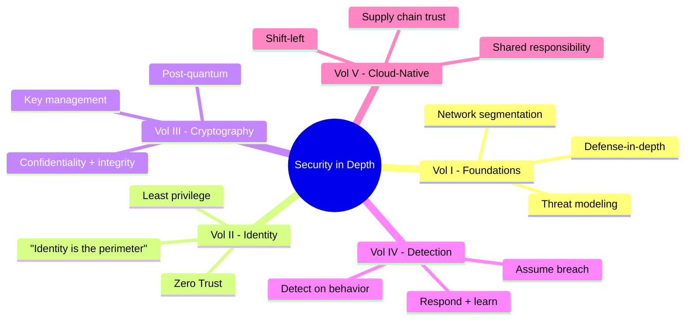

ファイアウォールはネットワークが侵害される可能性があると仮定するため、IDは各リクエストを検証します。IDは、認証情報が盗まれる可能性があると仮定するため、暗号はセッションを偽造不可能でフォワードシークレットにします。暗号は、エンドポイントがまだ乗っ取られている可能性があると仮定するため、検知はその振る舞いを観察してそれを暴露します。検知は、ワークロード自体が汚染されている可能性があると仮定するため、サプライチェーンは私たちが出荷するものが私たちが構築したものであることを証明します。これらのコントロールのどれも、他のものが完璧であると信頼していません。そして、*アーキテクチャに組み込まれたその不信*こそが、芸術全体です。

ペリメータは溶解しました。マシンはエフェメラルになりました。コードはほとんど見知らぬ人たちのものでした。そして、その全てを通して、規律は保たれました：**防御を層化し、全てを検証し、侵害を仮定し、プロビナンスを証明し、そして単一の壁を最後の壁だと決して信じないこと。** それがセキュリティの深さです。それが仕事です。

スタック全体を歩いてくれてありがとう。壊れにくいもの、そして壊されたときに生き残るには十分謙虚なものを構築してください。

---

## References

[^1]: [AWS - Shared Responsibility Model](https://aws.amazon.com/compliance/shared-responsibility-model/)
[^2]: [Gartner / CSA - The Egregious Eleven: Top Cloud Security Threats](https://cloudsecurityalliance.org/artifacts/top-threats-to-cloud-computing-egregious-eleven/)
[^3]: [NIST (2017) - SP 800-190: Application Container Security Guide](https://csrc.nist.gov/publications/detail/sp/800-190/final)
[^4]: [Kubernetes - Overview of Cloud Native Security (The 4C's)](https://kubernetes.io/docs/concepts/security/overview/)
[^5]: [Open Policy Agent - Gatekeeper](https://open-policy-agent.github.io/gatekeeper/website/docs/)
[^6]: [CISA - Apache Log4j Vulnerability Guidance](https://www.cisa.gov/uscert/apache-log4j-vulnerability-guidance)
[^7]: [NTIA - Software Bill of Materials (SBOM)](https://www.ntia.gov/SBOM)
[^8]: [SLSA - Supply-chain Levels for Software Artifacts](https://slsa.dev/)
[^9]: [OWASP - Top 10 CI/CD Security Risks](https://owasp.org/www-project-top-10-ci-cd-security-risks/)