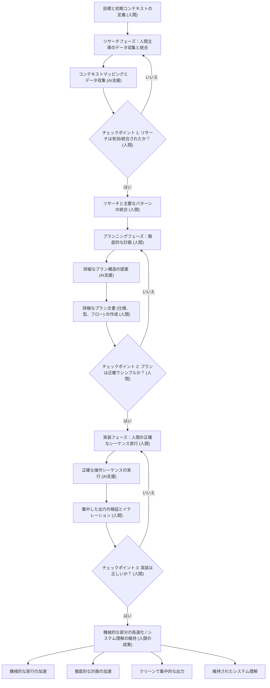

現在、エンジニアリングチーム全体で静かな現象が起きています。開発者がAIエージェントを使用して複雑な機能を生成します。テストはパスし、コードはデプロイされます。しかし、その開発者に、出荷されたばかりのものの正確な仕組みを説明するように尋ねても、苦労するかもしれません。

私たちは完全に理解していないコードを出荷しており、その速度は前例のないものです。

最近の業界での議論、特にエンタープライズ企業の大規模なコードベースに取り組むエンジニアリングリーダーからの声は、現代のソフトウェア開発における明白なパラドックスを浮き彫りにしています。AIツールは、かつて数日かかっていたタスクをわずか数時間に短縮しました。しかし、大規模な本番システムは必然的に失敗し、その際に、システムを深く理解している人間がデバッグする必要があります。

ソフトウェアの危機に直面するのは、私たちが最初の世代ではありませんが、無限の生成スケールでそれに直面するのは、私たちが最初の世代です。

## 「簡単」という幻想

コードベースの理解が困難になっている理由を理解するには、基本的なエンジニアリング哲学、つまり *シンプル* と *イージー* の違いを再訪する必要があります。

Rich Hickey（Clojureの作成者）が定義したように、**シンプル**とは構造を指します。それは、コンポーネントが1つのことを行い、他のコンポーネントと絡み合っていないことを意味します。一方、**イージー**とは近接性を意味します。それは、ソリューションがすぐに利用できることを意味します。npmからパッケージをプルしたり、Stack Overflowからスニペットをコピーしたり、LLMにプロンプトしたりするようなものです。

シンプルさには、意図的な思考、設計、そしてアーキテクチャの絡み合いの解除が必要です。「イージー」はほとんど思考を必要としません。

AIは究極の「イージー」ボタンです。チャットインターフェースでは、機能追加の際の摩擦がゼロです。AIに認証を追加するように依頼し、次にOAuthを追加するように依頼し、セッションバグをパッチするように依頼します。すぐに、あなたはソフトウェアエンジニアリングを行っているのではなく、肥大化したコンテキストウィンドウを管理していることになります。AIモデルは喜んで応じるため、最新のプロンプトを満たすために新しいコードを古いコードの上に単純に積み重ね、悪いアーキテクチャ上の決定に抵抗することなくロジックを変化させます。

私たちは今、スピードのためにシンプルさを犠牲にし、後で莫大な複雑性でその代償を支払うことになります。

## AI時代の偶発的な複雑性

1986年の伝説的な論文「No Silver Bullet」で、Fred Brooksはソフトウェアの複雑性を2つのカテゴリに分けました。
1.  **本質的な複雑性:** 実際のビジネス問題を解決することの根本的な難しさ。
2.  **偶発的な複雑性:** 解決策を実装しようとする際に作成する、乱雑な回避策、レガシー抽象化、および技術的負債。

大規模で老朽化したコードベースでは、これら2種類の複雑性は深く絡み合っています。それらを分離するには、履歴コンテキストと人間の直感が必要です。

AI生成ツールはこれに非常に苦労します。LLMがリポジトリをスキャンするとき、コアビジネスルールと時代遅れのハッキーな回避策の違いを見分ける判断力を欠いています。既存のすべてのパターンを維持されるべき厳格な要件として扱います。AIに深く結合したレガシーシステムをリファクタリングするように依頼すると、しばしば制御不能になり、ギブアップするか、新しい構文を使用して古い壊れたパターンを再作成します。

## ソリューション：仕様駆動開発

根本的な問題が理解の欠如である場合、解決策はよりハードにプロンプトするか、よりスマートなモデルを待つことではありません。解決策は、コード生成との関係を完全に変えることです。私たちはコードを書くことから*アーキテクチャを仕様化する*ことに移行しなければなりません。

この方法論（コンテキスト圧縮または仕様駆動開発とも呼ばれます）は、AIがタイピングという機械的な作業を行う前に、人間が思考という大変な作業を行うことを強制します。通常、3つの異なるフェーズが含まれます。

### 1. ガイド付きリサーチ
AIにコーディングを開始させる代わりに、関連するアーキテクチャ図、ドキュメント、およびターゲットとするコードスニペットをAIに渡します。依存関係のマッピングとエッジケースの特定をAIに依頼します。人間として、この分析を検証し、修正します。出力はコードではなく、検証済みのリサーチドキュメントになります。

### 2. 高忠実度プランニング
リサーチを使用して、厳密な実装プランを作成します。これには、関数シグネチャ、データフロー、およびサービス境界の定義が含まれます。このドキュメントは、ジュニアエンジニアがアーキテクチャ上の決定を下すことなく実行できるほど正確であるべきです。ここで、偶発的な複雑性を積極的に排除します。

### 3. 制約された実装
最後に、正確に検証された仕様をAIに渡して実行させます。AIはあなたのブループリントによって厳しく制約されているため、「複雑性のスパイラル」に迷い込むことはありません。生成されたコードは、あなた自身のプランに対して検証するだけなので、迅速にレビューできます。

## エンジニアの未来

ソフトウェアエンジニアリングの最も難しい部分は、決して構文をタイプすることではありませんでした。それは常に、まず*何を*タイプすべきかを知ることでした。

AIを使用してクリティカルシンキングのフェーズをバイパスすると、システム直感が萎縮します。特定のアーキテクチャがもろすぎたり、緊密に結合しすぎていることを示す、苦労して獲得した本能を失います。

AI時代に成功するエンジニアは、最も大量のコードを生成するエンジニアではありません。彼らは、構築しているものを深く構造的に理解し、アーキテクチャの接合部を見ることができ、AIをメカニクスを加速するために使用しながら、設計のシンプルさを断固として保護するエンジニアになります。

***
