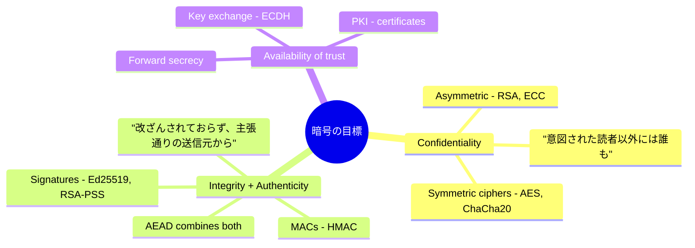
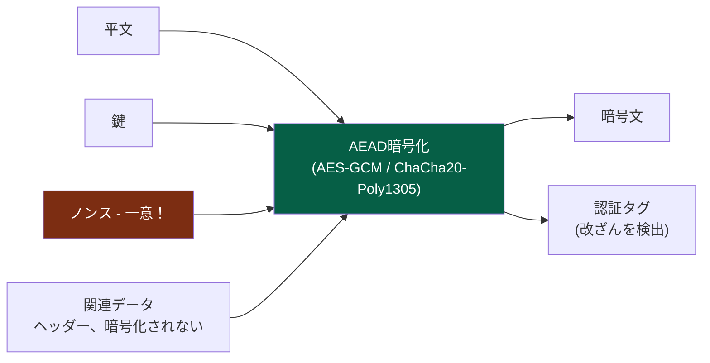
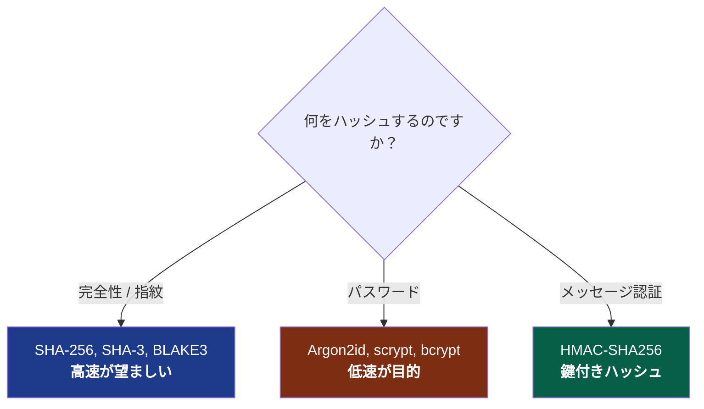
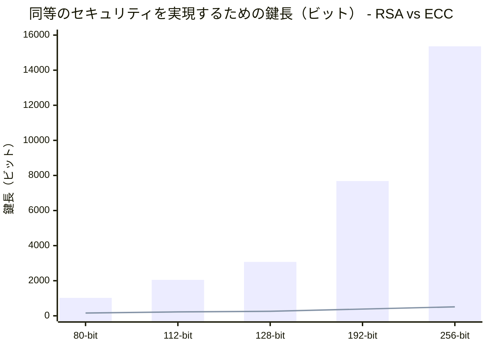
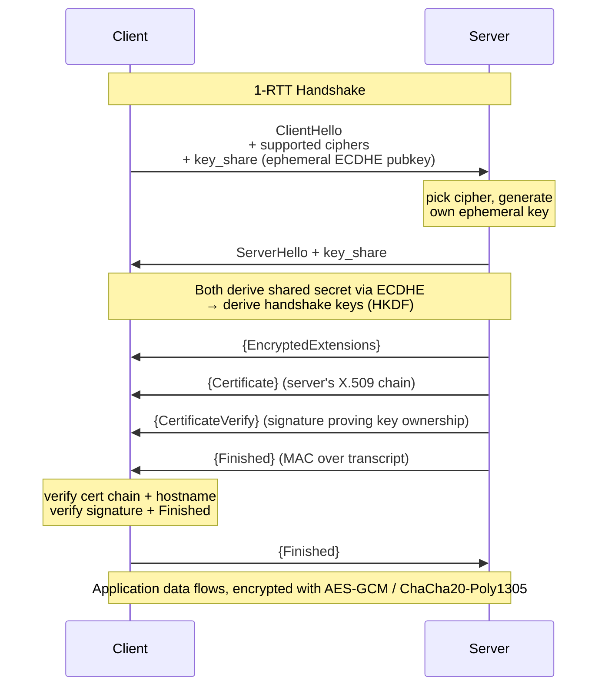
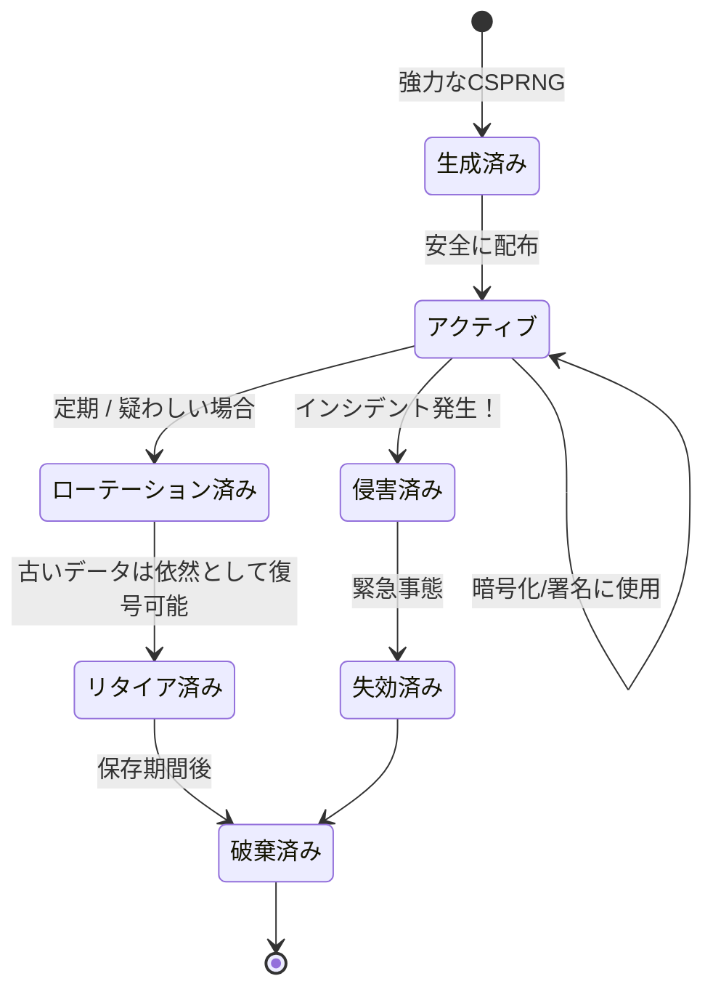
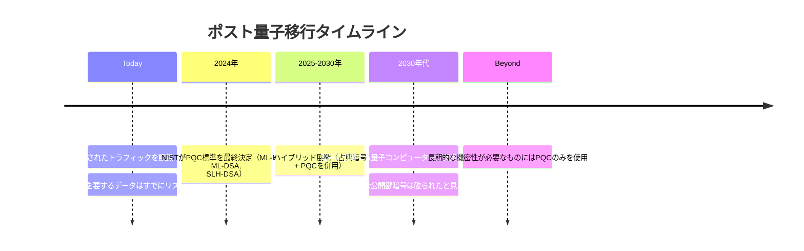
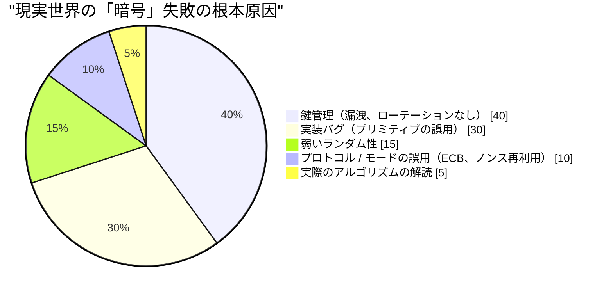

## 閉じ続けてきた箱

このシリーズでは、これまで2回にわたって暗号学に触れ、その詳細をうやむやにしてきました。[第1巻](/posts/secure_systems_architecture/)では「TLSを使え」と言い、[第2巻](/posts/identity_and_access_in_depth/)では「署名は送信元に紐付けられている」とか「Argon2idでハッシュせよ」と言って、それ以上は踏み込みませんでした。これらのどの文も、精巧で脆い機械仕掛けの塊を隠していました。

本巻ではその箱を開きます。

目標はあなたを暗号学者にすることではありません。その道は数年にわたる数学の学習と、自らの賢さを健全に恐れる気持ちを必要とします。目標はあなたを**暗号*エンジニア***にすることです。つまり、どのプリミティブがどの問題を解決するか、安全なデフォルトがなぜ安全なのか、そして何よりも、壊滅的な過ちを犯しそうになっている瞬間をどう認識するかを知っている人材です。

:::important[第一の戒め]
**独自の暗号を考案してはなりません。独自のプリミティブを実装してはなりません。** 暗号そのものであれ、モードであれ、パディングであれ、乱数生成器であれ。吟味された高レベルのライブラリ（libsodium、Tink、プラットフォームのネイティブ暗号）を使用し、安全な選択を*デフォルト*にしてください。本巻のすべては、あなたがそれらのライブラリが何をしているかを理解するために存在するのであって、あなたがそれらを再構築するためではありません。歴史上の壊滅的な暗号の失敗はすべて、このルールが自分には当てはまらないと考えたエンジニアから始まりました。 [^1]
:::

---

## パートI：3つの目標とそれを実現するプリミティブ

実際には、すべての暗号学は3つの目標のいずれかの組み合わせに役立ちます。

第4の目標である**否認防止**（後で署名したことを否定できないこと）は、特にデジタル署名から派生するものであり、共通鍵暗号が提供*できない*唯一の特性です。両当事者が鍵を共有しているため、どちらでもタグを生成できた可能性があるからです。

### 第1章：共通鍵暗号 - 高速、共有、モード

共通鍵暗号は、暗号化と復号の両方に**一つの共有鍵**を使用します。これは*高速*ですが（ハードウェア高速化されたAESは毎秒ギガバイトで動作します）、一つの難しい問題があります。**盗聴者に知られることなく、どうやって両当事者が同じ鍵を持つのか？**（パートIIでこれに答えます）。

初心者を陥れる微妙な点は、**運用モード**です。AESのようなブロック暗号は、固定された16バイトのブロックを暗号化します。実際に何かを暗号化するには、ブロックを連結する必要があり、その連結モードがセキュリティの生死を分けます。

:::warning[ECBペンギン - なぜモードが重要なのか]
ナイーブなモードである**ECB (Electronic Codebook)**は、各ブロックを独立して暗号化します。同一の平文ブロックは同一の暗号文ブロックを生成します。LinuxのペンギンのビットマップをECBで暗号化すると、暗号文の中から*ペンギン*を見ることができ、その輪郭がそのまま漏洩してしまいます。ECBは構造を持つあらゆるデータの機密性を破壊します。コードで`AES/ECB`を見たら、バグとして扱うべきです。 [^2]
:::

現代の答えは**AEAD (Authenticated Encryption with Associated Data)**です。これは機密性*と*完全性を一つのプリミティブに融合させるため、どちらか一方だけを得ることはできません。

採用すべき2つのAEAD暗号は以下の通りです。

| 暗号 | 利点 | 注意点 |
| --- | --- | --- |
| **AES-256-GCM** | どこでもハードウェア高速化（AES-NI）、普遍的 | **ノンスの再利用は壊滅的**。同じ鍵でノンスを繰り返すと、認証鍵と平文XORが漏洩する |
| **ChaCha20-Poly1305** | *ソフトウェア*で高速（AES-NIがないモバイル/IoTに最適）、設計上は定数時間 | ノンスの一意性要件は同じ |

:::caution[ノンスは秘密ではないが、一意でなければならない]
**ノンス**（number-used-once、一度だけ使用される数値）は秘密である必要はなく、平文で送信されます。しかし、特定の鍵の下では**決して繰り返してはなりません**。GCMの96ビットランダムノンスでは、一つの鍵で約$2^{32}$メッセージを送信した後には、誕生日攻撃による衝突が現実的なリスクとなります。安全なパターンは、*カウンター*ノンス（一意性が保証されている）を使用するか、制限に達するかなり前に鍵をローテーションするか、あるいは**AES-GCM-SIV**のようなノンス誤用耐性モードを使用することです。 [^3]
:::

### 第2章：ハッシュ - 一方通行の道

暗号学的ハッシュは、任意の入力を固定サイズのダイジェストにマッピングします。これにより、(a) 逆算すること、(b) 同じダイジェストを持つ2つの入力を見つけること（**衝突耐性**）、または (c) 特定のダイジェストに一致する入力を見つけること（**原像計算困難性**）が実行不可能になります。

人々が常に混同する3つの用途があり、それぞれ*異なる*関数が必要です。

ここが肝心です。**ファイルの完全性には最速で安全なハッシュが必要であり、パスワードには最も遅いハッシュが必要です。** パスワードにSHA-256を使用するのは脆弱性です（GPUは毎秒数十億回クラックします）。ファイルのチェックサムにArgon2idを使用するのは意味もなく遅いだけです。同じ「ハッシュ」という言葉でも、要件は正反対なのです。

**MAC**は鍵を追加することで、秘密を持つ者だけがタグを生成または検証できるようにします。これは完全性*と*認証性を提供します。**HMAC**を使用し、常に**定数時間比較**でタグを比較してください。早期終了する`==`はタイミング情報を漏洩させ、攻撃者がバイトごとにタグを偽造するために使用できます。

$$
\text{HMAC}(K, m) = H\big((K \oplus opad)\,\|\,H((K \oplus ipad)\,\|\,m)\big)
$$

この二重ハッシュ構造は飾りではありません。これは、ナイーブに鍵付けされた`H(K \| m)`構造では可能になる**長さ拡張攻撃**から防御するものです。

### 第3章：公開鍵暗号 - 鍵交換の問題を解決する

非対称（公開鍵）暗号は**鍵ペア**を使用します。これは自由に共有する公開鍵と、命をかけて守る秘密鍵からなります。誰でもあなたの公開鍵で暗号化できますが、あなたの秘密鍵だけが復号できます。あるいは：あなたは秘密鍵で署名し、誰でもあなたの公開鍵で検証できます。

*   **RSA** - 古典的なもの。セキュリティは大きな整数の素因数分解の困難性に依拠します。現在では*大きく、遅い*と見なされており、128ビットセキュリティのために3072ビット鍵を使用します。良いですが、重いです。
*   **楕円曲線暗号 (ECC)** - ビットあたりの困難性が高い楕円曲線離散対数問題に依拠しているため、劇的に小さい鍵で同等のセキュリティを提供します。**256ビットのECC鍵は、約3072ビットのRSA鍵に相当します。**

高いセキュリティレベルにおける棒（RSA）と線（ECC）の間の大きな隔たりこそが、現代のプロトコルが楕円曲線にデフォルトで対応する理由です。署名には**Ed25519**、鍵交換には**X25519**が使われます。どちらも高速で小さく、誤用されにくいように設計されています [^4]。

:::note[公開鍵暗号はデータを直接暗号化することはほとんどない]
公開鍵操作は遅く、サイズに制限があります。実際には、ファイルをRSAで直接暗号化することはほとんどありません。公開鍵暗号は**共通鍵を交換またはラップする**ために使用され、その後、大量のデータは高速なAEADで暗号化されます。これが**ハイブリッド暗号化**であり、TLS、PGP、age、そしてあらゆる健全なシステムが実際に行っていることです。
:::

---

## パートII：鍵交換とTLS 1.3ハンドシェイク

これで、共通鍵暗号では答えられなかった質問に答えられます。つまり、攻撃者が傍受している回線上で、2人の見知らぬ人間が共有秘密にどのように合意するのか？

### 第4章：Diffie-Hellmanと前方秘匿性

**Diffie-Hellman (DH)**は、その核心にある美しいトリックです。両当事者は自身の秘密鍵と相手の公開値を混ぜ合わせ、代数の法則のおかげで、*同じ*共有秘密に到達します。一方、両方の公開値を見た盗聴者にはそれを計算することはできません。

決定的な特性は**（完全）前方秘匿性**です。各セッションがセッション後に破棄される*エフェメラル*DH鍵ペア（ECDHE、末尾の「E」はEphemeralのE）を使用する場合、攻撃者が今日あなたの暗号化されたトラフィックをすべて記録し、*来年あなたの長期秘密鍵を盗んだとしても*、記録されたセッションを解読することはできません。セッション鍵はセッションとともに消滅したからです。

:::important[なぜ前方秘匿性が今や譲れないものなのか]
「今記録し、後で解読する」は、実際に資金提供を受けている敵対者の戦略です。特に量子コンピューターが目前に迫っている今（第7章）。前方秘匿性は、今日傍受された暗号文が、サーバー鍵が漏洩した日に負債とならないことを意味します。TLS 1.3は前方秘匿性の高いECDHEを**必須**とし、古い静的RSA鍵交換（前方秘匿性なし）は完全に削除されました。 [^5]
:::

### 第5章：TLS 1.3ハンドシェイク、その実態

私たちが「TLSを使え」と言い続けてきたハンドシェイク、その実態がここにあります。TLS 1.3はラウンドトリップ回数を2回から1回に削減し、すべての安全でないオプションを削除しました [^5]。

どのステップにも意味があります。

*   **最初のメッセージ内の`key_share`** - クライアントはグループを*推測し*、そのエフェメラル鍵をすぐに送信します。これがTLS 1.3がラウンドトリップを削減する方法です。
*   **`Certificate` + `CertificateVerify`** - 証明書はサーバーのIDを公開鍵に紐づけます（第2巻のPKIチェーンを介して）。*署名*は、サーバーが実際に一致する秘密鍵を保持していることを証明します。秘密鍵のない盗まれた証明書は役に立ちません。
*   **`Finished`** - ハンドシェイクのトランスクリプト全体に対するMACです。中間者攻撃者が*いずれか*の先行メッセージを改ざんした場合（例：強力な暗号を削除するダウングレード攻撃）、トランスクリプトが一致せず、ハンドシェイクは中断されます。

:::tip[TLS 1.3が削除したものと維持したもの、どちらも重要]
TLS 1.3は、RSA鍵交換、静的DH、CBCモード暗号、RC4、MD5、SHA-1、圧縮（CRIME/BREACHよ、さようなら）、および再ネゴシエーションを削除しました。設計哲学は**設定項目が少ないということは、誤設定によって侵害を引き起こす方法が少ない**ということです。安全でないオプションを持たないプロトコルは、安全でない状態に誘導されることはありません。TLS 1.0/1.1はどこでも無効にし、1.3を推奨し、レガシーなクライアントのためにのみ1.2を許可してください。
:::

---

## パートIII：鍵管理 - 理論と現実の接点

応用暗号学の汚い秘密：**アルゴリズムが弱点になることはほとんどない。鍵管理こそが弱点だ。** AES-256はこれまで破られたことがありません。しかし、鍵はgitにコミットされ、ログに記録され、メールで送られ、ハードコードされ、そして決してローテーションされない。ライフサイクルこそが規律です。

重要な実践事項：

::::steps

:::step[真のCSPRNGから生成する]{subtitle="生成"}
鍵は**暗号論的に安全な**乱数源（`/dev/urandom`、`getrandom()`、プラットフォームのCSPRNG）から生成されなければなりません。`Math.random()`は決して使わない、タイムスタンプをシードにしない、「巧妙な」PRNGも使わない。予測可能なランダム性は、「破れない」とされた暗号が簡単に破られる最も一般的な根本原因です。
:::

:::step[KMSまたはHSMに保管する]{subtitle="保管"}
**ハードウェアセキュリティモジュール (HSM)**またはクラウド**KMS**は、鍵を*平文で境界線を越えない*ように保管します。署名/復号のためにデータをKMS/HSMに*送信する*形になります。これにより、アプリケーションサーバーを所有した攻撃者でも、生の鍵を外部に持ち出すことはできません。
:::

:::step[規模に合わせてエンベロープ暗号化を使用する]{subtitle="構造"}
オブジェクトごとの**データ暗号化鍵 (DEK)**でデータを暗号化し、各DEKをKMSで管理される中央の**鍵暗号化鍵 (KEK)**で暗号化します。ローテーションするには、ペタバイトのデータではなく、小さなDEKを再暗号化します。これが主要なクラウドサービスがすべて行っている保存時の暗号化です。
:::

:::step[鍵をローテーションし、*高速*にローテーションできるようにする]{subtitle="保守"}
ローテーションは自動化され、中断のないものでなければなりません。暗号文に鍵IDを付与し、移行中に古い鍵と新しい鍵が共存できるようにします。鍵を数分でローテーションできる組織は漏洩から生き残れますが、1週間の移行が必要な組織は、自身のアーキテクチャの人質となります。
:::

::::

:::warning[歴史に残るランダム性の失敗]
2008年のDebian OpenSSLのケース：善意のパッチがエントロピー源を無効化し、鍵空間を約32,767の可能性に減らしました。その結果、2年間で生成されたすべてのSSHおよびTLS鍵が推測可能になりました。2010年：SonyのPS3はECDSA署名で固定ノンスを再利用し、マスター署名鍵を漏洩させました。このパターンは永遠です。**暗号はランダム性と再利用の点で失敗し、暗号自体で失敗するわけではありません。** [^6]
:::

---

## パートIV：量子コンピューティングの地平

本巻で扱われるすべての公開鍵プリミティブ、RSA、ECC、Diffie-Hellmanは、十分に大きな**量子コンピューター**が**Shorのアルゴリズム**を実行すれば効率的に解ける数学的問題（素因数分解、離散対数）に依拠しています。そのマシンはまだ存在しません。しかし、脅威はすでにそこにあります。

### 第7章：今収集し、後で解読する

量子脅威における公開鍵暗号の区分：

*   **公開鍵暗号 (RSA, ECC, DH)** - Shorのアルゴリズムによって*破られる*。これが緊急事態です。
*   **共通鍵暗号 (AES) およびハッシュ (SHA-2/3)** - Groverのアルゴリズムによって*弱体化する*だけです。これにより、セキュリティレベルが実質的に半分になります。解決策は簡単です。**AES-256**を使用し（ポスト量子時代でも128ビットのセキュリティを維持します）、384ビット以上のハッシュを使用すれば問題ありません。共通鍵暗号は基本的に問題ありません。

2024年にNISTは最初のポスト量子アルゴリズムを標準化しました [^7]：

*   **ML-KEM** (Kyber) - 鍵カプセル化、ECDH鍵交換の代替です。
*   **ML-DSA** (Dilithium) および **SLH-DSA** (SPHINCS+) - デジタル署名です。

:::note[今日の現実的な動き：ハイブリッド]
一夜にしてPQCのみに移行することはないでしょう。新しいアルゴリズムは新しく、まだ実戦での検証が十分ではありません。業界の答えは**ハイブリッド鍵交換**です。古典的なX25519*と*ML-KEMを一緒に実行し、両方の共有秘密を組み合わせることで、*両方*が破られない限りセッションは安全になります。Chrome、CloudflareなどはすでにX25519+ML-KEMをデフォルトで展開しています。10年以上の秘匿期間を要する暗号を調達する場合は、**今すぐ**ベンダーにPQCのロードマップについて尋ねてください。 [^8]
:::

---

## パートV：恥の殿堂 - エンジニアはいかにして優れた暗号を破壊するか

アルゴリズムは健全です。しかし、実際のシステムがどのようにして崩壊するか、つまりあなたが実際に引き起こす、あるいはレビューで見つけるであろう失敗への実践ガイドを以下に示します。

| アンチパターン | なぜ致命的か | 解決策 |
| --- | --- | --- |
| **独自の暗号を実装する** | 微妙な詳細を間違える可能性があり、攻撃者はそれを見逃さない | libsodium / Tink / プラットフォームの暗号を使用する |
| **ECBモード** | 平文の構造を漏洩させる（ペンギン） | AEAD: AES-GCM / ChaCha20-Poly1305 |
| **ノンス / IVの再利用** | GCM下での鍵/平文の壊滅的な漏洩 | カウンターノンス、またはAES-GCM-SIV |
| **弱いランダム性** | 予測可能な鍵 = 鍵がないも同然 | CSPRNGのみ、`Math.random()`は絶対に使用しない |
| **パスワードにSHA-256を使用する** | GPUが毎秒数十億回クラックする | Argon2id / scrypt / bcrypt |
| **MAC/タグ比較に`==`を使用する** | タイミングサイドチャネルがタグを偽造する | 定数時間比較 |
| **証明書を検証しない** | `verify=False`はMitMの扉を再び開ける | チェーン + ホスト名 + 有効期限を検証する |
| **前方秘匿性がない** | 一つの鍵が漏洩すると、すべての履歴が解読される | エフェメラルECDHE (TLS 1.3) |
| **認証せずに暗号化する** | パディングオラクル攻撃およびビット反転攻撃 | AEAD、またはencrypt-then-MAC |

もう一度このチャートを読んでください。**実際のアルゴリズムの解読は最も小さな部分です。** 「暗号の失敗」の95%は、エンジニアリングの失敗、鍵の扱い、誤用、ランダム性であり、これらはすべて*あなたの*管理下にあり、本書で扱われる規律によってカバーされています。

:::important[要点]
優れた暗号学は、数学を知ることではありません。それは、数学が課す**境界線を尊重する**ことです。一意のノンス、秘密鍵、真のランダム性、認証された暗号文、検証済み証明書、前方秘匿性、ローテーション。吟味されたライブラリを使ってそれらの境界線を正しく守れば、賢い人々が何十年もかけて強化してきたプリミティブの全力を継承できます。境界線を越えれば、どんなアルゴリズムもあなたを救うことはできません。
:::

---

## 結論と今後の展望

私たちは今、プリミティブから信頼を築き上げてきました。秘密を守る暗号、身元を証明する署名、敵対的な回線上でそれらを結びつけるハンドシェイク、すべてを誠実に保つ鍵のライフサイクル、そしてすでに影を落とす量子コンピューティングの計算です。

しかし、暗号、ID、ネットワークウォールはすべて*予防的*コントロールです。これらは攻撃者を締め出せると仮定しています。**第4巻**では、その逆の前提、つまり経験豊富なすべての防御者が内面化している前提を受け入れます：*侵害を前提とする*。私たちは、ブルーチームの運用上の現実、検知エンジニアリング、MITRE ATT&CKフレームワーク、脅威ハンティング、SIEM/SOARパイプライン、そして予防が失敗したときに（失敗しない場合ではなく）実行するインシデント対応およびフォレンジックプレイブックへと移行します。

予防は完全に守れない約束です。検知は、その約束が破られたときに生き残る方法です。

---

## 参考文献

[^1]: [Latacora - Cryptographic Right Answers](https://www.latacora.com/blog/2018/04/03/cryptographic-right-answers/)
[^2]: [Filippo Valsorda / Wikipedia - Block cipher mode of operation (ECB penguin)](https://en.wikipedia.org/wiki/Block_cipher_mode_of_operation#Electronic_codebook_(ECB))
[^3]: [IETF - RFC 8452: AES-GCM-SIV Nonce Misuse-Resistant AEAD](https://datatracker.ietf.org/doc/html/rfc8452)
[^4]: [Bernstein, D. J. et al. - Ed25519 & Curve25519](https://ed25519.cr.yp.to/)
[^5]: [IETF - RFC 8446: The Transport Layer Security (TLS) Protocol Version 1.3](https://datatracker.ietf.org/doc/html/rfc8446)
[^6]: [Debian - DSA-1571-1 openssl predictable random number generator](https://www.debian.org/security/2008/dsa-1571)
[^7]: [NIST (2024) - Post-Quantum Cryptography Standards (FIPS 203/204/205)](https://csrc.nist.gov/projects/post-quantum-cryptography)
[^8]: [Cloudflare - The state of the post-quantum Internet](https://blog.cloudflare.com/pq-2024/)