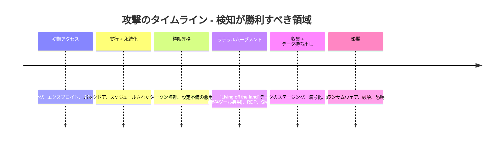
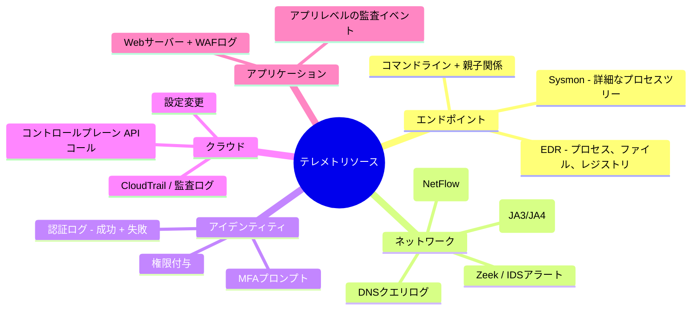
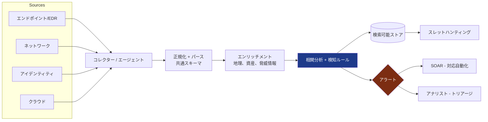
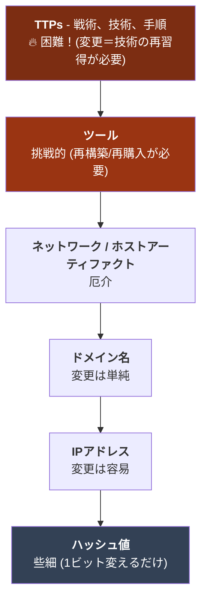
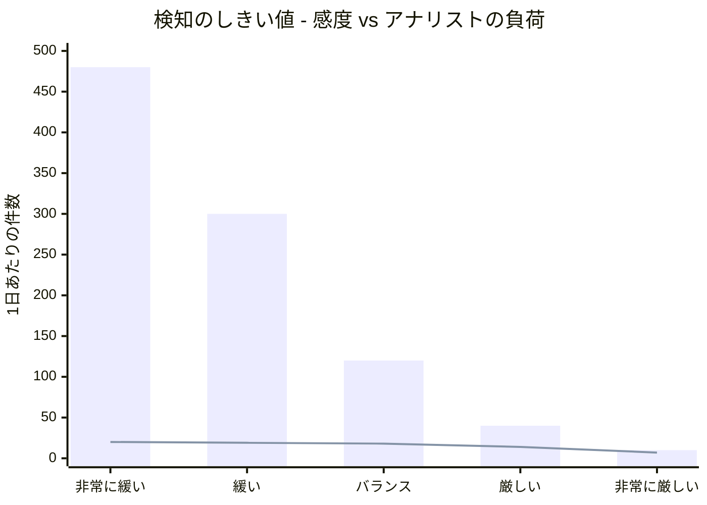
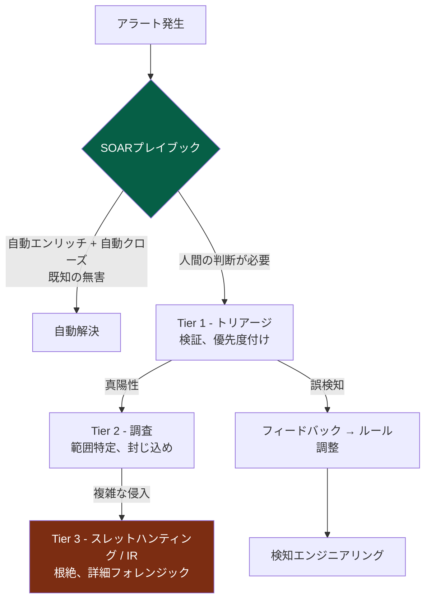
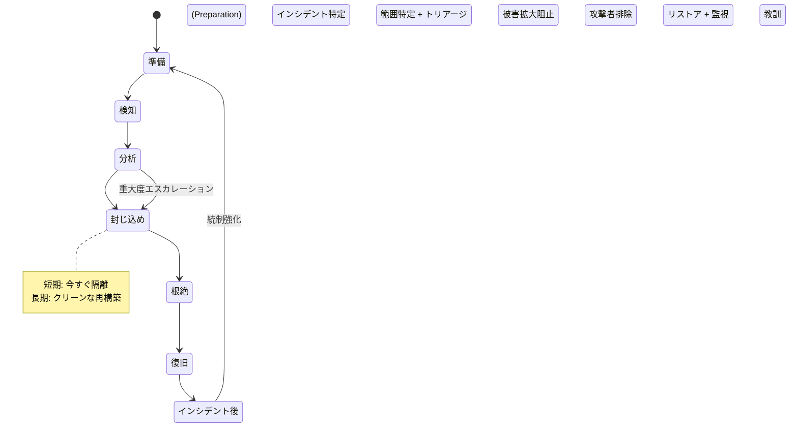
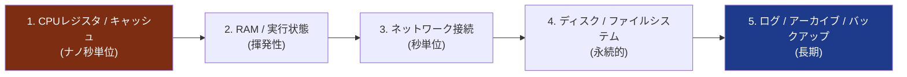
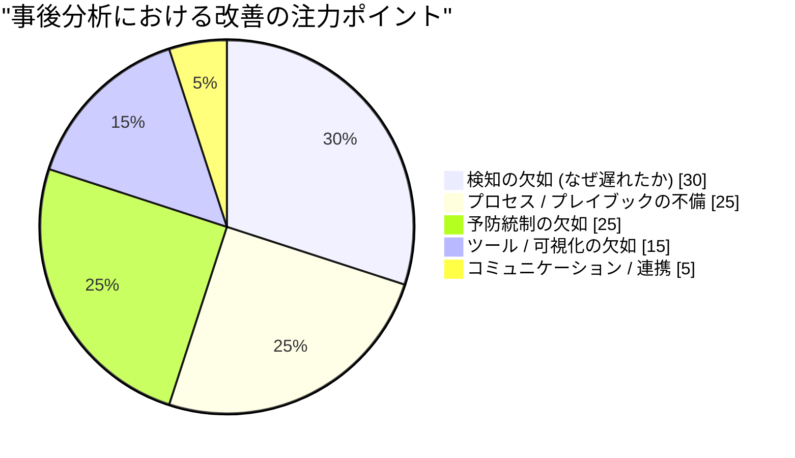
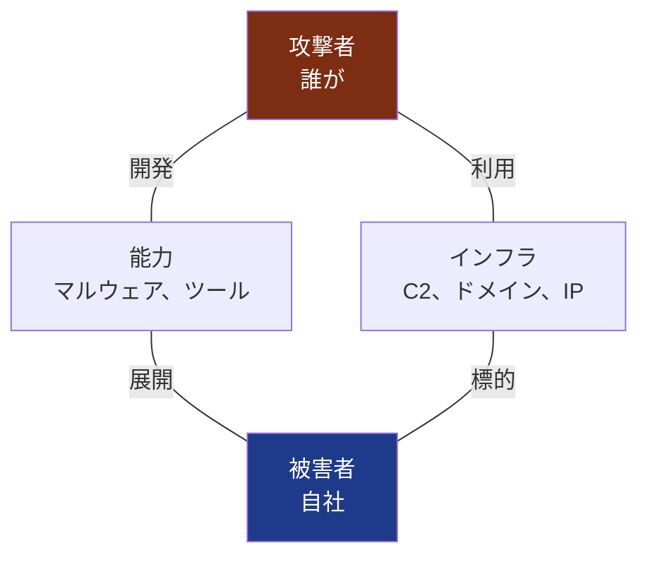

## 全てを変える前提

シリーズ最初の3巻は、本質的に楽観的なものでした。[第1巻](/posts/secure_systems_architecture/)では壁を築き、[第2巻](/posts/identity_and_access_in_depth/)ではあらゆる扉に門番を配置し、[第3巻](/posts/cryptography_engineering_in_depth/)ではその間の通信を改ざん不可能なものにしました。これらはすべて「予防」であり、攻撃者を侵入させないことを前提としています。

本巻は、その楽観が終わるところから始まります。熟練の防御担当者なら誰もが心に刻んでいる一文です。

> **侵害を前提とせよ (Assume breach)。** 十分な時間、予算、動機があれば、執拗な攻撃者は必ず侵入してくる。問うべきは「侵入されるかどうか」ではなく、**「どれだけ早く気づき、どれだけうまく対応できるか」**である。

業界では、これを2つの過酷な指標で測定します。**MTTD**（平均検知時間）と**MTTR**（平均対応時間）です。2024年時点での平均潜伏期間（初期侵害から検知まで）は、依然として「数日から数週間」とされています。その期間中に、攻撃者はラテラルムーブメント（横展開）を行い、権限昇格し、データを持ち出します。本巻の目的は、この時間枠を極限まで縮めることにあります。



検知を1時間早めるごとに、攻撃者はタイムライン上で1時間を失うことになります。ブルーチームの世界へようこそ。

---

## パート I: テレメトリ - 見えないものは検知できない

検知とは、巧妙な分析以前の「データ」の問題です。証拠が収集されていなければ、どんなアルゴリズムでも復元できません。そのため、ブルーチームの最初の仕事は**可視化（Visibility）**です。適切なシグナルを発信するようにインフラを計測することです。

### 第1章: 真実のソース



**防御側の視点:** すべてのログが同等ではありません。最も価値のあるテレメトリとは、*振る舞い*を捉えるものです。特に**親プロセスと子プロセスの親子関係を含むプロセスコマンドライン**（Sysmon Event ID 1）と**認証イベント**が重要です。ファイアウォールログは接続があったことを示しますが、プロセスツリーは `winword.exe` が `powershell.exe` を起動し、それが `cmd.exe` を介して難読化コマンドを実行したという「物語」を語ります。検知において重要なのはこの物語なのです。

:::important[ログ収集はカバレッジの問題 - マッピングせよ]
よくある失敗は「見えない穴」です。組織の80%をログ監視していても、侵害が残りの20%で発生すれば意味がありません。ソース × データ型 × 保持期間で構成される**ログカバレッジマトリックス**を維持し、欠落を脆弱性と見なしてください。必要なデータが取り込まれていなければ、検知ルールに価値はありません。パッチ適用状況を監査するように、ログの網羅性を監査しましょう。
:::

### 第2章: SIEMパイプライン

**SIEM**（Security Information and Event Management）は集約の頭脳です。上記すべてのソースを取り込み、共通スキーマに正規化し、ソース間で相関分析を行い、アラートを生成します。現代的なパイプラインは以下の通りです。



**エンリッチメント（補完）**ステップこそが、実は最も価値のある部分です。IPアドレスは、Tor出口ノードであること、対象がドメインコントローラーであること、普段とは異なる大陸からのアクセスであることを知って初めて意味を持ちます。エンリッチメントはデータを「コンテキスト（文脈）」に変え、そのコンテキストこそがアラートを無視できないものにします。

---

## パート II: 検知エンジニアリング

ピアノを買っても音楽が奏でられないのと同様に、SIEMを買っただけでは検知は実現しません。**検知エンジニアリング**は、テレメトリをアラートに変えるルールを作成、テスト、維持する規律であり、検知を「コード」として扱います。

### 第3章: MITRE ATT&CK - 共通言語

**MITRE ATT&CK**は、この分野の共通地図です。現実の侵入事例で観測された攻撃者の**戦術（Tactics）**（「なぜ」行うか。例: 永続化、ラテラルムーブメント）と**技術（Techniques）**（「どう」行うか。例: T1053 スケジュールされたタスク）の行列です[^1]。これはレッドチーム、ブルーチーム、脅威インテリジェンスが同じ言語で話すためのロゼッタストーンとなります。

防御側にとって強力な一手は、検知ルールをマトリックスに重ね合わせ、死角を暴く**カバレッジマッピング**です。

```mermaid
quadrantChart
    title 検知カバレッジ vs 攻撃手法の頻度
    x-axis 低頻度 --> 高頻度
    y-axis カバレッジ不足 --> 強固なカバレッジ
    quadrant-1 良好な防御
    quadrant-2 過剰投資
    quadrant-3 優先度低
    quadrant-4 危険 - 頻出かつ未検知
    フィッシング (T1566): [0.9, 0.7]
    正当なアカウント (T1078): [0.85, 0.35]
    PowerShell (T1059): [0.8, 0.8]
    スケジュールされたタスク (T1053): [0.5, 0.6]
    認証情報ダンプ (T1003): [0.7, 0.75]
    クラウドAPI悪用 (T1078.004): [0.6, 0.25]
    Rundll32プロキシ (T1218): [0.3, 0.45]
```

第4象限、すなわち「頻出するがカバレッジが弱い手法」が優先すべきバックログです。リソースの限られたブルーチームにおいて、誰も使わないようなエキゾチックな攻撃を追う前に、実際に攻撃者が行い、かつ自社で検知できていない手法を防御することこそが、効率的な努力の分配です。

### 第4章: Pyramid of Pain（痛みのピラミッド）

すべての検知が、攻撃者にとって同じ「痛み」を与えるわけではありません。David Biancoの**Pyramid of Pain**は、一度検知されると攻撃者にとって変更コストが高くなる順に指標をランク付けしています[^2]。



この教訓は戦略を塗り替えます。ファイルの**ハッシュ**をブロックするのは満足感がありますが、攻撃者は再コンパイルして数秒で回避します。「Officeアプリがスクリプトエンジンを起動し、インターネットへ通信する」といった**振る舞い**を検知すれば、攻撃者は手法そのものを放棄せざるを得ません。**指標だけでなく、振る舞いを検知せよ。** 検知ポイントがピラミッドの上層にあるほど、攻撃者の回避コストは高くなります。

:::tip[Detection-as-code（コードとしての検知）]
検知をソフトウェアのように扱ってください。ポータブルなフォーマット（**Sigma**ルール）で記述し、**git**で管理し、コードレビューを行い、悪意のあるサンプルや重要な正常アクティビティに対してテストを行い、誤検知率を測定します。誤検知率が40%もある検知ルールは、検知なしよりも悪質です。アナリストが「無視」ボタンを押す癖をつけてしまうからです。実運用コードと同じようにバージョン管理し、テストし、退役させてください[^3]。
:::

### 第5章: シグナル対ノイズの戦い

検知における永遠の課題は、実際の攻撃（真陽性）を捉えることと、アナリストを誤報（偽陽性）の海に溺れさせないことのトレードオフです。



棒グラフはアラート総数、折れ線は「真陽性」です。設定が緩すぎれば（左）、アナリストは480件ものアラートを処理して20件の真陽性を探すことになり、疲弊して機械的に無視するようになります。厳しすぎれば（右）、実際の攻撃を見逃します。**アラート疲れ（Alert fatigue）は単なる人事問題ではなく、セキュリティ統制の失敗です。** 目標はアラートの最大化ではなく、アナリスト1時間あたりの「真陽性」の最大化であり、そのためにSOAR（後述）が存在します。

---

## パート III: SOC - マシンスピードでの対応

### 第6章: 階層化運用とSOAR

**SOC**（Security Operations Center）は、アラートストリームの中で生きるチームでありプロセスです。伝統的な階層構造と、その現代的な自動化は以下の通りです。



**SOAR**（Security Orchestration, Automation and Response）は戦力の倍増ツールです。アラートのエンリッチメント、コンテキスト収集、さらには（ホストの隔離、アカウント無効化、IPブロックといった）封じ込めアクションを人間を待たずに実行する「プレイブック」を自動化します。適切に構築されたSOARパイプラインは、低精度のノイズの大半を自動解決し、人間が判断を要する重要な作業に集中できるようにします。

:::note[フィードバックループこそが本質]
Tier 1から検知エンジニアリングへの矢印に注目してください。成熟したSOCは「学習システム」です。すべての誤検知はルールを調整し、見逃された検知は新たなルールを生みます。検知にフィードバックを与えずアラートに反応するだけのSOCは、その場に留まるために全力で走っているのと同じです。
:::

### 第7章: スレットハンティング - 既に侵入されている前提で

検知はルールが発動するのを待つものです。**スレットハンティング**は逆のアプローチであり、ルールをすり抜けた攻撃者が既に内部にいると仮定し、能動的にテレメトリを検索します。これは「仮説駆動型」です。

::::steps

:::step[仮説を立てる]{subtitle="どこに隠れているか？"}
脅威インテリジェンスやATT&CKに基づく。「攻撃者が永続化に成功したなら、業務時間外に一般ユーザー権限で作成された異常なスケジュールタスクがあるはずだ」。良い仮説は具体的かつ反証可能です。
:::

:::step[データを収集・分析する]{subtitle="探しに行く"}
SIEM/EDRをクエリし、仮説を裏付ける証拠を探します。プロセス階層、ネットワーク先、認証異常を追跡します。悪の存在だけでなく、正常であるはずの事象の「不在」も探します。
:::

:::step[発見、または精査する]{subtitle="知見を得る"}
何かを見つければIRにエスカレートし、見つからなくてもそれは成果です。何も見つからないハンティングは、統制を「検証」し、正常な振る舞いをマッピングしたことになります。
:::

:::step[知見を運用化する]{subtitle="自動化する"}
ハンティングで得た教訓を「新しい自動検知ルール」に変換します。二度と同じことを手作業で探す必要がないようにします。ハンティングは常にルールへと進化させるべきです。
:::

::::

:::caution[ハンティングにはベースラインが必要]
「異常」を見つけるには「正常」を知らなければなりません。効果的なハンティングはベースライン構築に依存します。この環境におけるDNS、認証、プロセスアクティビティの典型的な一日とはどのようなものでしょうか？ 多くの組織が自分たちの「正常」を定義していないことを攻撃者は悪用しています。PowerShellや`certutil`のような組み込みツールを悪用する手法が有効なのは、組織が読み解くことを学んでいないトラフィックに紛れ込むからです。
:::

---

## パート IV: インシデントレスポンス

最終的に、検知が現実のものとなり、深刻化します。ここから**インシデントレスポンス（IR）**のプロセスを実行します。封じ込められたインシデントと会社を破滅させる侵害を分けるのは、往々にして英雄的行為ではなく、プレッシャーの下での「準備と規律」です。

### 第8章: NIST IRライフサイクル

NIST SP 800-61はカノンとなるループを定義しています[^4]。



技術者が最もよく失敗するのは**封じ込め**のフェーズです。2つの失敗パターンがあります。

* **攻撃者に時期尚早に察知される** - 1つのホストを隔離したことで攻撃者に気づかれ、すべてを破壊されるか、データ持ち出しを加速させる。時に、ストライクの前に攻撃を「監視」し、範囲を把握する必要があります。
* **封じ込めが遅すぎる** - データが流出している間に熟慮してしまうという逆の罪です。

:::warning[必要な証拠を破壊するな]
パニックになると「今すぐボックスを再イメージ化（初期化）しよう」と考えがちですが、侵害されたホストにはメモリ内のマルウェアやネットワーク接続、実行中のプロセスなど、電源を切った瞬間に消失する揮発性証拠が含まれています。可能な限り、**根絶前にメモリとディスクのイメージをキャプチャしてください。** 範囲特定（「他に何に触れたか？」）、法的・規制上の義務、そして根絶が本当に完了したかを確認するために必要になります。揮発性の順序が重要です：メモリが先、ディスクが後です[^5]。
:::

### 第9章: デジタルフォレンジック - 真実の再構築

インシデントが収束した後（または法的手続きのため）、**DFIR**（Digital Forensics and Incident Response）が何が起きたかを正確に再構築します。基本原則は**証拠保全の連鎖（Chain of custody）**と**揮発性の順序**です。証拠は最も儚いものから順に収集されなければならず、すべての手順が文書化されていなければ、法廷で価値を失い、範囲特定においても信頼できません。



フォレンジックアナリストは、ファイルシステムメタデータ（MFT, `$LogFile`）、メモリダンプ（Volatility）、Windowsイベントログ、prefetchやshimcacheなどのアーティファクトから侵入タイムラインを再構築し、何千ものタイムスタンプを繋ぎ合わせて、「どうやって入り、何を成し、何を持ち去ったか」という首尾一貫した物語を解き明かします。

### 第10章: 非難なき事後分析（Blameless Postmortem）

最も価値があり、時間的圧力で省略されがちなのが「教訓」です。これを機能させるルールが**非難なき（Blameless）**姿勢であり、分析の対象は「システムとプロセス」であり、決して「個人」ではありません。事後分析が責任追及になった瞬間、人は真実を語らなくなり、改善に必要な情報を失います。



すべてのインシデントは高価な授業料です。セキュリティ成熟度を高め続ける組織とは、その教訓を「完全に引き出す」組織のことです。各侵害が、それを許した欠陥を永久に閉ざす役割を果たし、直接的に「準備」フェーズへ、そしてパートIIの検知へと還元されていきます。

---

## パート V: 脅威インテリジェンス - 敵を知る

誰が自社を狙う可能性があり、彼らがどのように動くかを知ることで、検知と対応は劇的に鋭さを増します。**Cyber Threat Intelligence (CTI)** は、攻撃者に関する生のデータを意思決定へと変換する規律であり、3つの高度で運用されます。

| レベル | 対象 | 回答する問い | 例 |
| --- | --- | --- | --- |
| **戦略的** | 経営層 / 取締役 | *誰が業界を狙い、その目的は？* | 「ランサムウェア集団が医療請求を狙い始めている」 |
| **運用的** | SOCリーダー | *今、どのキャンペーンが活発か？* | 「このグループはスピアフィッシング → Cobalt Strike → 二重脅迫を使う」 |
| **戦術的** | アナリスト / ツール | *どの指標をブロック/検知すべきか？* | IOC、ATT&CK技術ID、YARA/Sigmaルール |

これらを繋ぐフレームワークが**ダイアモンドモデル**です。すべての侵入イベントには4つの頂点があり、それらを行き来することで理解が深まります。



1つのC2ドメイン（インフラ）を知れば、同じレジストラ/パターンを持つ他のドメインを特定でき、マルウェア（能力）を知れば、攻撃者の「次の」キャンペーンを捕まえるYARAルールを書けます。CTIは、ブルーチームが防御に徹するのではなく、先回りをするためのものです。

:::important[インテリジェンスは行動を伴わなければ単なるトリビア]
ルールに組み込まれていない1万件の悪性IPリストは、インテリジェンスではなくノイズです。CTIの試金石は閉じたループの中にあります。その情報は、検知、ブロック、ハンティング、または優先順位付けの内容を変えましたか？ 戦術的IOCはSIEMのエンリッチメントに、運用的TTPはATT&CKマップに、戦略的評価はリスク判断に反映させましょう。統制に届かないインテリジェンスは、誰にも読まれないレポートに過ぎません。
:::

---

## 結論と今後の展望

私たちは今、防御側の完全なループを体現しました。**見る**（テレメトリ）、**検知する**（振る舞いの検知ルール）、**対応する**（SOCとIRの規律）、**学ぶ**（非難なき事後分析）、そして**予見する**（脅威インテリジェンス）。予防が失敗することを前提とし、生存するための筋肉を鍛え、潜伏期間を週単位から分単位へと縮めるのです。

しかし、すべてが同時に高速化・複雑化するフロンティアがあります。それは、一時的なコンテナ、宣言型インフラ、そして作成した覚えのない数千ものオープンソース依存関係で組み立てられたソフトウェアからなる**クラウドネイティブ**な世界です。ここでは境界線がさらに溶け、ワークロードは秒単位で消滅し、最も危険な侵害はコードからではなく、「サプライチェーン」から発生します。汚染された依存関係、侵害されたビルドパイプライン、漏洩したCIトークンなどです。

**第5巻**（最終巻）では、このシリーズをクラウドネイティブとDevSecOpsのセキュリティへと繋げます。コンテナとKubernetesの強化、IaCスキャン、CI/CDパイプラインの保護、SBOMとSLSA、そして次の10年を決める侵害の主戦場である「ソフトウェアサプライチェーン」の防御について解説します。

---

## 参考文献

[^1]: [MITRE - ATT&CK Framework](https://attack.mitre.org/)
[^2]: [David Bianco (2013) - The Pyramid of Pain](https://detect-respond.blogspot.com/2013/03/the-pyramid-of-pain.html)
[^3]: [SigmaHQ - Generic Signature Format for SIEM Systems](https://github.com/SigmaHQ/sigma)
[^4]: [NIST (2012) - SP 800-61 Rev. 2: Computer Security Incident Handling Guide](https://csrc.nist.gov/publications/detail/sp/800-61/rev-2/final)
[^5]: [IETF - RFC 3227: Guidelines for Evidence Collection and Archiving](https://datatracker.ietf.org/doc/html/rfc3227)