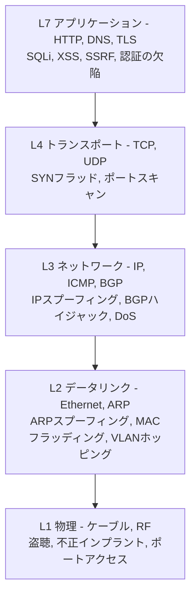
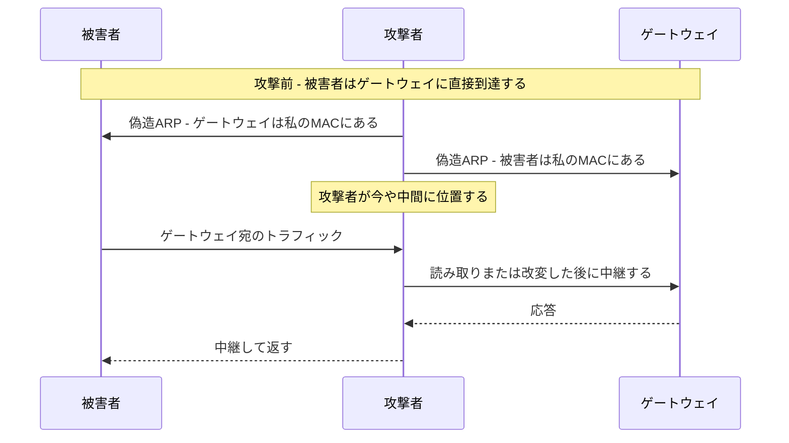
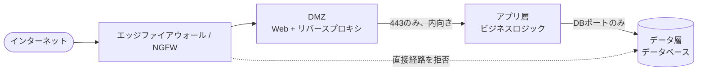
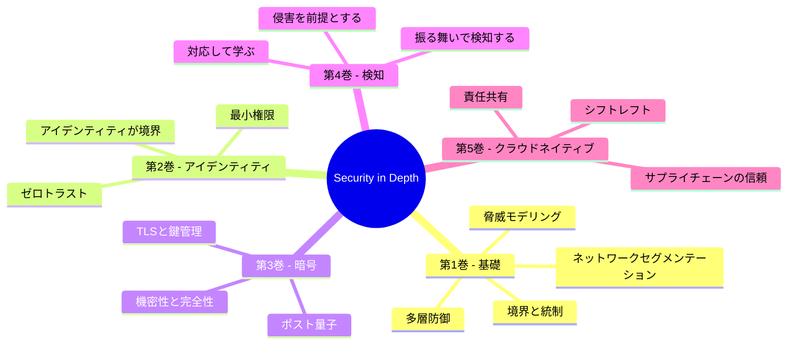
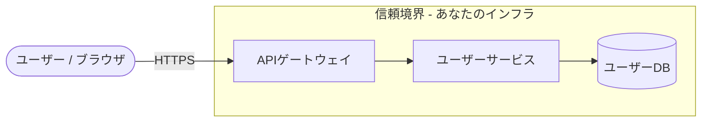
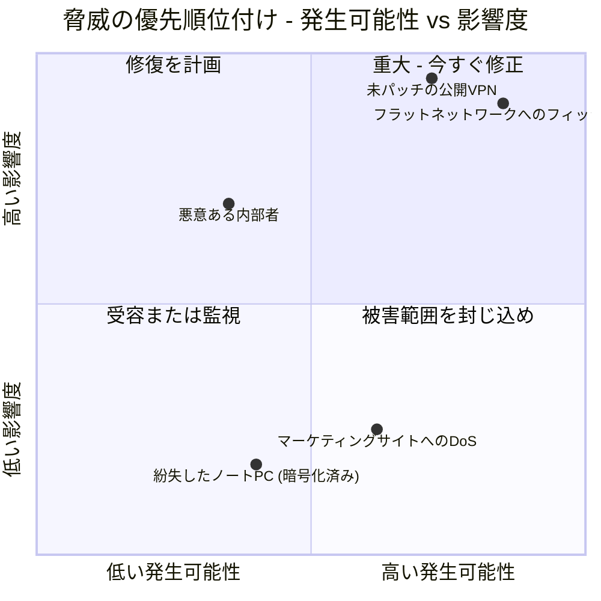
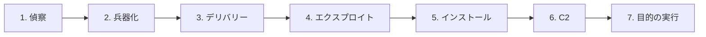
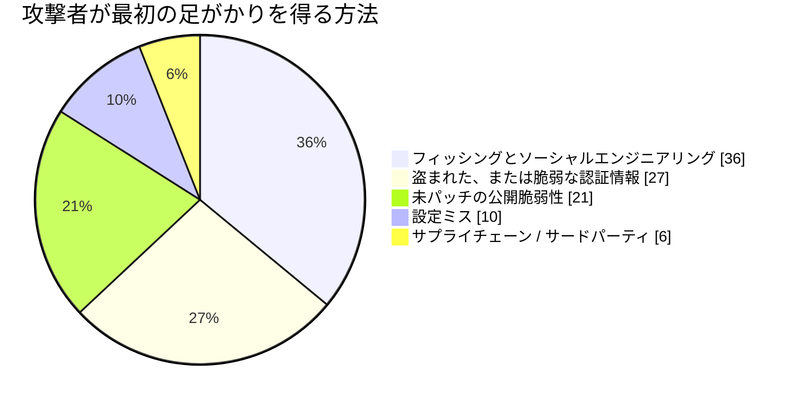
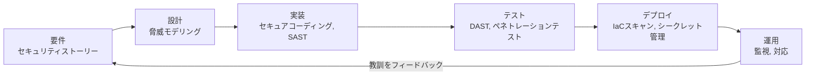
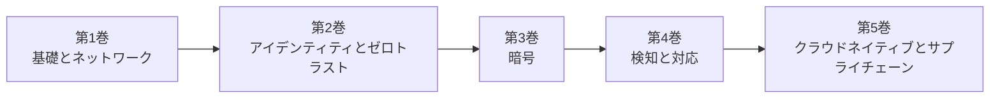

## シリーズの出発点

これは、**セキュリティアーキテクチャ**を巡る全5巻の旅の幕開けとなる巻です。本シリーズを通じて、私たちは銅線からコンテナに至るまでスタック全体を歩いていきます。その地図はこのようになっています。

* **第1巻（本巻）** - 基礎。攻撃対象領域としてのネットワーク、防御可能な設計、多層防御、脅威モデリング、そして攻撃者の手法。
* **第2巻** - [アイデンティティ、アクセス、そしてゼロトラストの最前線](/posts/identity_and_access_in_depth/)。境界が溶けたとき、アイデンティティが新たな境界となる。
* **第3巻** - [暗号エンジニアリング](/posts/cryptography_engineering_in_depth/)。すべてを信頼に足るものにするプリミティブ。
* **第4巻** - [検知、対応、そして脅威インテリジェンス](/posts/detection_and_response_in_depth/)。予防が失敗したときに何をするか。
* **第5巻** - [クラウドネイティブとサプライチェーンのセキュリティ](/posts/cloud_native_and_supply_chain_security_in_depth/)。儚いものを守り、出荷したものを証明する。

このガイドを他と分けるのはその方法論です。あらゆるトピックを**4組の目**を通して検証します。なぜなら、現実のシステムは4種類のエンジニアによって同時に議論されるからです。

* 基盤を築く**ネットワークエンジニア**。
* それを守らねばならない**防御担当者**。
* それを破ろうとする**ハッカー**。
* その上で動くコードを書く**ソフトウェアエンジニア**。

:::note[本シリーズ全体のテーゼ]
単一の統制で信頼に足るものは存在しません。ファイアウォールは破られ、認証情報は漏洩し、コードにはバグがあり、依存関係は汚染されます。したがってセキュリティとは購入する製品ではなく、**エンジニアリングする性質**です。各レイヤーは、その手前のレイヤーが既に失敗していることを前提とします。本巻は最も外側のレイヤーと、その思考様式を築きます。シリーズの残りは内側へと築いていきます。
:::

---

## パート I: ネットワークこそが領土である

データ通信はネットワークから始まり、攻撃もまたそこから始まります。OSIやTCP/IPモデルの表面的な理解では不十分です[^1]。セキュリティの専門家は各レイヤーを二度読みます。一度目はそれが*何をするか*のために、二度目はそれがどう*転用されうるか*のために。

### 第1章: セキュリティのレンズを通して見たスタック

すべてのレイヤーは、それ固有の攻撃とそれ固有の防御を抱えています。下へ行くほど、侵害はより物理的で絶対的なものになります。

**レイヤー1 - 物理層。** ケーブル、光ファイバー、スイッチの世界です。ハッカーにとっては、*到達可能でありさえすれば*究極のベクトルとなります。暗号化されていない配線への物理タップ[^2]、永続的なコマンドアンドコントロールの足場としてファイアウォールの背後に残された安価なインプラント、あるいは単にロビーの生きたジャックに差し込まれたノートPCなどです。防御担当者の答えは手続き的かつ物理的なもの、すなわち施錠された部屋、無効化されたポート、改ざん検知シールであり、それを技術的に支えるのが**IEEE 802.1X**ネットワークアクセス制御です。これは物理的に接続してくるあらゆるデバイスに、使用可能なフレームを一つでも受け取る前に認証を強制します[^3]。

**レイヤー2 - データリンク層。** MACアドレス、スイッチ、そして**ARP**。ARPはIPをMACに対応づけるプロトコルであり、暗黙の信頼を前提に設計されました[^4]。その信頼こそが脆弱性です。

これが**ARPスプーフィング**であり、攻撃者にローカルセグメント上での中間者（Man-in-the-Middle）の位置を与えます[^5]。その親戚が**MACフラッディング**（スイッチのCAMテーブルを溢れさせてフェイルオープンさせ、ハブのようにすべてをブロードキャストさせる[^6]）と、**VLANホッピング**（誤設定されたトランクポートを通じて自分のVLANから抜け出す[^7]）です。ここでの防御担当者のツールキットはスイッチの衛生管理です。ポートごとにMACを固定する**ポートセキュリティ**[^8]、不正なDHCPサーバーを排除する**DHCPスヌーピング**、そして信頼済みバインディングテーブルに照らして偽造ARPを破棄する**ダイナミックARPインスペクション**です。

**レイヤー3 - ネットワーク層。** IPアドレスとルーティング。**IPスプーフィング**は送信元アドレスを偽造し、古典的なSmurf攻撃のような反射型DoSの原動力となります[^9]。そして**BGPハイジャック**はインターネットのルーティングテーブルを破壊し、トラフィックを丸ごと呑み込みます。これは諜報と大規模傍受のための国家レベルのツールです[^10]。防御担当者はフィルタリングします。BCP 38 / RFC 2827に基づく**入力・出力フィルタリング**は送信元IPが嘘であるパケットを破棄し[^11]、ACLは誰が誰と通信してよいかを強制します。

**レイヤー4 - トランスポート層。** **TCP**（コネクション指向、3ウェイハンドシェイク）と**UDP**（撃ちっぱなし）。**SYNフラッド**は決して完了しない偽装SYNでサーバーのハーフオープン接続テーブルを枯渇させます[^12]。`nmap`のようなツールを用いた**ポートスキャン**は待ち受けている攻撃対象領域を地図化します[^13]。防御担当者はこれに、ハンドシェイクの実績があるACKしか通さない**ステートフルファイアウォール**と、クライアントが本物だと証明するまで状態を一切割り当てない**SYNクッキー**で応じます[^14]。

### 第2章: 防御可能なネットワークを設計する

**フラットネットワーク**、すなわちあらゆるデバイスが他のあらゆるデバイスに到達できるネットワークは、ハッカーの楽園です。忘れ去られたプリンター1台を侵害すれば、そこからドメインコントローラーまで歩いていけます。防御可能なネットワークとは**セグメント化された**ネットワークです[^15]。

セグメンテーション、すなわちサブネット、**VLAN**、そして階層型**DMZ**[^16]は、すべてのホップを監視されたチョークポイントに変えます。これはトポロジーとして表現された最小権限です。Webサーバーがドメインコントローラーに接続する用事はないため、ファイアウォールがそれを禁じ、侵害されたWebサーバーは高速道路の上ではなく袋小路に迷い込むことになります。

**マイクロセグメンテーション**はこれを論理的な極限まで推し進めます。すなわち各ゾーンではなく*各ワークロード*の周囲にポリシー境界を設けます。同じサブネット上の2つのVMは暗黙的に信頼されず、あらゆるフローが明示的に許可されなければなりません。その原則、*決して信頼せず、常に検証する*こそが**ゼロトラスト**の種であり、それは次巻の主題そのものへと育っていきます。

:::important[最初の引き継ぎ]
マイクロセグメンテーションは*「この2つのプリンシパルは通信を許可されるべきか？」*を問います。そしてその問いを真剣に受け止めた瞬間、ネットワークアドレスはもはや十分な答えではなくなります。あなたは**アイデンティティ**を検証する必要があります。まさにそこから**[第2巻](/posts/identity_and_access_in_depth/)**が始まります。新たな境界としてのアイデンティティです。
:::

### 第3章: 門番たち - ファイアウォールとIDS/IPS

**ステートフルファイアウォール**は接続のコンテキストを理解します。**次世代ファイアウォール（NGFW）**はさらに踏み込み、アプリケーション認識（あるアプリをブロックし別のアプリを許可する、両方ともポート443上でも）、統合された侵入防御、そして脅威インテリジェンスフィードを備えます[^17]。**Webアプリケーションファイアウォール（WAF）**はレイヤー7で動作し、OWASP Top 10の攻撃を鈍らせます[^18]。

:::warning[WAFはセーフティネットであり、治療薬ではない]
WAFは素朴な `OR 1=1` をブロックするかもしれませんが、WAF回避は成熟した技芸です。エンコーディング、難読化、大文字小文字のトリックがシグネチャを日々すり抜けています。インジェクションの真の修正はコードの中（パラメータ化クエリ）に存在するのであって、その前面に取り付けたフィルターの中にあるのではありません。WAFは多層防御の一つとして扱い、決してそれ自体を防御そのものとして扱ってはなりません。
:::

**IDS**は監視して警告し、**IPS**はインラインに位置してブロックします。両者は**シグネチャ**（既知の脅威に対して正確だが、新規のものには盲目）または**アノマリ**（未知を捉えうるが、誤検知の海に溺れさせる）によって検知します[^19]。そして両者とも、復号にコストを払わない限り暗号化トラフィックに対しては聞こえなくなります。これは、*検知*がやがてワイヤーから離れてエンドポイント上へ移らねばならない理由の伏線であり、第4巻の物語です。

---

## パート II: 多層防御 - そしてなぜそれが本シリーズなのか

多層防御とは、いかなる単一の統制も*必ず*失敗するという認識であり、だからこそ各レイヤーが時間、可視性、そして攻撃者を止めるもう一度の機会を稼ぐような層を築きます[^20]。中世の城が使い古されてはいるが完璧な例えです。堀、壁、射手、天守、王冠の宝石、そしてそれらを結びつける衛兵たち。

本シリーズ全体を組み立てる一手はこれです。**城の各レイヤーが一つの巻である。**

* **堀と外壁**はネットワーク境界とセグメンテーション、**本巻**です。
* **すべての扉の衛兵**はアイデンティティとアクセス、**[第2巻](/posts/identity_and_access_in_depth/)**です。
* **衛兵が信頼する封印された伝令**は暗号、**[第3巻](/posts/cryptography_engineering_in_depth/)**です。
* **侵入を見張る射手**は検知と対応、**[第4巻](/posts/detection_and_response_in_depth/)**です。
* **石そのものの出所**はサプライチェーンとクラウドネイティブのセキュリティ、**[第5巻](/posts/cloud_native_and_supply_chain_security_in_depth/)**です。

**ハッカーの視点:** 攻撃者はレイヤーを障害物として見て、それぞれの中で最も弱い継ぎ目を探します。従業員がフィッシングリンクをクリックすれば完璧なファイアウォールも無価値であり、パッチ未適用のホスト上では非の打ちどころのないコードも無価値です。深さが重要なのは、まさに攻撃者が必要とするのはただ*一つ*の経路だけだからであり、深さとはいかなる単一の失敗もその経路とならないことを確かにする方法です。

---

## パート III: 脅威モデリング - 意図的に攻撃者のように考える

脅威モデリングは、弱い継ぎ目を*構築する前に*見つけるための構造化された方法です[^21]。これは能動的で、安価で、チームが行える最もレバレッジの高いセキュリティ活動の一つです。定番の語呂合わせがMicrosoftの**STRIDE**です[^22]。

ありふれたエンドポイントを考えてみましょう。`PUT /api/users/{id}`。まずそのデータフロー図を描き、データが敵対的な外部からあなたのインフラへと越境する**信頼境界**を印付けます。

さて、STRIDEをすべての要素とフローに沿って歩かせてみましょう。

| STRIDEの脅威 | このエンドポイントに問うべき質問 | 主要な防御策 |
|---|---|---|
| **S**poofing（なりすまし） | ユーザーAが `{id}` を変更してユーザーBのプロフィールを編集できるか？ | 強力な認証 + オブジェクト単位の認可 |
| **T**ampering（改ざん） | 中間者が転送中のボディを改変できるか？ | TLS（第3巻） |
| **R**epudiation（否認） | ユーザーが変更を行ったことを否定できるか？ | 署名付きで改変不能な監査ログ |
| **I**nformation disclosure（情報漏洩） | 応答がPIIやパスワードハッシュを漏らすか？ | 出力の最小化、保存時の暗号化 |
| **D**enial of service（サービス拒否） | 1つのクライアントが大量リクエストでDBを枯渇させられるか？ | レート制限、クォータ |
| **E**levation of privilege（権限昇格） | 管理者へのインジェクション経路があるか？ | パラメータ化クエリ、最小権限 |

現実の侵害のほとんどは、この表の両端から始まります。**なりすまし**（壊れた認証）と**権限昇格**です。最も一般的なWebの欠陥である**安全でない直接オブジェクト参照（IDOR）**は、URLをまとったなりすましに過ぎません。アプリが*このユーザー*が*そのオブジェクト*に触れてよいかを確認せず、ユーザー提供の `{id}` を信頼してしまうのです[^23]。

脅威を列挙するのは仕事の半分に過ぎません。すべてを修正することはできないので、**発生可能性 × 影響度**でランク付けし、その積が最も高いところに予算を投じます。

同じ規律を、1時間の設計会議で回せる反復可能なループとして表すとこうなります。

:::steps

:::step[システムを分解する]{subtitle="データフロー図を描く"}
すべてのプロセス、データストア、外部エンティティ、フローを地図化します。**信頼境界**を明示的に描いてください。それらは攻撃が信頼できない側から信頼できる側へ越境する場所であり、あなたの発見のほとんどが集中する場所です。描けないのなら、それを守れるほど十分に理解できていないということです。
:::

:::step[STRIDEで脅威を列挙する]{subtitle="賢さではなく、体系性を"}
なりすまし、改ざん、否認、情報漏洩、サービス拒否、権限昇格を各要素に沿って歩かせます。語呂合わせの意義は、あなたが考えたくないカテゴリーを飛ばさせないことにあります。
:::

:::step[発生可能性と影響度でランク付けする]{subtitle="重要なところに投じる"}
各脅威をリスクマトリックス上にプロットします。破滅的だが不可能な脅威と、些細だが絶え間ない脅威は、どちらもあなたの注意を浪費します。まず右上の象限に資金を投じてください。
:::

:::step[緩和し、それから検証する]{subtitle="発見をテストに変える"}
受容したすべての脅威はエンジニアリングタスク*であり、かつ*テストケースになります。認可の統合テスト、レート制限のチェック、ファジングの対象などです。バックログを変えなかった脅威モデルは、ただの見世物でした。
:::

:::

---

## パート IV: 攻撃者の手法

連鎖を断ち切るには、まずそれを見なければなりません。Lockheed Martinの**サイバーキルチェーン**は典型的な侵入を7つの段階としてモデル化します。防御担当者の目標はそれを*できるだけ早く*断ち切ることです。なぜなら修復コストはあらゆるステップで登っていくからです[^24]。

偵察は**受動的なOSINT**と**能動的な**探査（ポートスキャン、DNS列挙、Shodanによる掃射）を組み合わせます。兵器化とデリバリーはペイロードを作り上げて送り込みます。圧倒的に多いのは**フィッシング**であり、依然として第一の侵入経路です。

**エクスプロイト**と**インストール**の後、攻撃者は**C2**チャネル越しに「本国へコールホーム」し、**目的の実行**を始めます。足場を得た後、その技芸は静かに潜むことへと移ります。

* **ラテラルムーブメント** - 最初のホストから王冠の宝石へと跳んでいく。Windowsドメインでは、これはメモリから認証情報をダンプして再利用することを意味し、しばしば**Pass-the-Hash**を介して行われ、平文パスワードを一切必要としません。
* **永続化** - 再起動やパッチを生き延び、再生する足場を持つ。
* **Living off the Land（LotL）** - カスタムマルウェアを一切避け、`PowerShell`、`PsExec`、その他ボックス上で既に信頼されているツールを使うことで、何も場違いに見えないようにする。

:::caution[境界防御だけでは決して勝てない理由]
LotLこそ、第1巻の壁が必要ではあるが十分ではない理由です。正規で署名済みのシステムツールだけを使う攻撃者は、ファイアウォールやアンチウイルスが照合できるシグネチャを一切残しません。彼らを捕らえるには*振る舞い*を見張る必要があります。Word文書がPowerShellを生成し、それがネットワークソケットを開く、といった具合に。これは**[第4巻](/posts/detection_and_response_in_depth/)**と、攻撃者の振る舞いの地図である**MITRE ATT&CK**の領分です。予防は彼らを締め出せることを前提とし、検知は締め出せなかったことを前提とします。
:::

---

## パート V: セキュアバイデザイン

最も安価な脆弱性とは、決して書かれなかったものです。**シフトレフト**とは、セキュリティをライフサイクルのより早い段階へ、すなわち修正がインシデントではなくコードレビューで済む段階へと移すことを意味します[^25]。

このパイプラインの下には、クラウドに先立って存在し、クラウドより長生きするであろう一握りの原則が横たわっています。SaltzerとSchroederが明文化した時代を超える設計則です[^26]。

* **最小権限** - すべてのプリンシパルは必要最小限のアクセスだけを得て、それ以上は得ない。
* **フェイルセーフなデフォルト** - デフォルトで拒否し、例外として許可する。
* **完全な仲介** - 最初だけでなく、毎回すべてのアクセスをチェックする。
* **機構の経済性** - セキュリティ上重要な部分を、監査できるほど小さく保つ。
* **多層防御** - 本シリーズ全体を貫く一本の筋。

これらが定数です。それらをどう満たすかの*具体*こそがシリーズの残りが生きる場所であり、第1巻は意図的に、それぞれを複製するのではなく引き継いでいきます。

* 認証、認可、セッション管理、そしてシークレット - **[第2巻](/posts/identity_and_access_in_depth/)**。
* 「自前の暗号を作るな」、TLSが実際にどう動くか、そして鍵をどう管理するか - **[第3巻](/posts/cryptography_engineering_in_depth/)**。
* SOC、SIEM/SOAR、スレットハンティング、そして統制が失敗したときに回すインシデントレスポンスのライフサイクル - **[第4巻](/posts/detection_and_response_in_depth/)**。
* コンテナとKubernetesの堅牢化、IaCスキャン、SBOM、そして依存関係のサプライチェーンの防御（**Log4Shell**[^27]を思い出してください） - **[第5巻](/posts/cloud_native_and_supply_chain_security_in_depth/)**。

:::tip[持ち運ぶべきメンタルモデル]
後続のすべての巻を、ここで提起された問いへのより深い答えとして読んでください。第1巻は*「どうやって攻撃者を締め出し、その速度を落とすか？」*を問います。そして各答えはやがて自らの限界を認め、それが次巻が切り出す問いとなります。その正直な限界の連鎖こそが本シリーズです。
:::

---

## 結論と今後の展望

私たちは物理層から始めました。1本のケーブル、1台のスイッチ、1つの偽造されたARP応答から。そして4人のエンジニアがデータフロー図を巡って議論する設計会議まで登ってきました。その道すがら、私たちは外側の防御を築きました。セグメント化された防御可能なネットワーク、互いの失敗を前提とする層状の統制、攻撃者より先に弱い継ぎ目を見つける反復可能な方法、そしてその攻撃者が実際にどう動くかの曇りなきモデルです。

現代のシステムエンジニアは博学者でなければなりません。パケットとアプリケーションロジック、ファイアウォールルールとコンテナマニフェストについて推論し、構築者、防御者、破壊者として同時に考えられなければなりません。セキュリティは付け加える機能ではありません。それは、あらゆるレイヤーにおいて、隣のレイヤーの失敗を生き延びるようにエンジニアリングされたシステムの性質です。

本巻で私たちは壁を築きました。しかしノートPCが家に帰り、サーバーが他人のデータセンターへ移り、APIが開かれたインターネット越しに他のAPIを呼び出した瞬間、その壁は現実を描写しなくなります。あなたが守っていた「内側」は、プリンシパルの群れ、すなわち人、サービス、デバイス、ワークロードへと溶けていきます。そのそれぞれが何かを行おうとし、そのそれぞれが自分が誰であり何に触れてよいかを証明する必要があります。

そこから**[第2巻 - アイデンティティ、アクセス、そしてゼロトラストの最前線](/posts/identity_and_access_in_depth/)**が始まります。**アイデンティティが新たな境界**であり、あらゆるリクエストは越境です。それではまた、次巻で。

---

## 参考資料

[^1]: [Cloudflare - What is the OSI Model?](https://www.cloudflare.com/learning/ddos/glossary/open-systems-interconnection-model-osi/)
[^2]: [Krebs, B. (2012) - The Growing Threat From Tiny, Silent Network Taps](https://krebsonsecurity.com/2012/03/the-growing-threat-from-tiny-silent-network-taps/)
[^3]: [Cisco - What Is 802.1X?](https://www.cisco.com/c/en/us/products/security/what-is-802-1x.html)
[^4]: [Microsoft (2021) - Address Resolution Protocol](https://learn.microsoft.com/en-us/windows-server/administration/performance-tuning/network-subsystem/address-resolution-protocol)
[^5]: [OWASP - Address Resolution Protocol Spoofing](https://owasp.org/www-community/attacks/ARP_Spoofing)
[^6]: [Imperva - MAC Flooding](https://www.imperva.com/learn/application-security/mac-flooding/)
[^7]: [Cisco - VLAN Hopping Attack](https://www.cisco.com/c/en/us/td/docs/switches/lan/catalyst4500/12-2/15-02SG/configuration/guide/config/dhcp.html)
[^8]: [GeeksforGeeks (2023) - Port Security in Computer Networks](https://www.geeksforgeeks.org/port-security-in-computer-networks/)
[^9]: [Cloudflare - Smurf DDoS Attack](https://www.cloudflare.com/learning/ddos/smurf-ddos-attack/)
[^10]: [Cloudflare - What is BGP hijacking?](https://www.cloudflare.com/learning/security/glossary/bgp-hijacking/)
[^11]: [IETF (2000) - RFC 2827: Network Ingress Filtering](https://datatracker.ietf.org/doc/html/rfc2827)
[^12]: [Cloudflare - SYN Flood Attack](https://www.cloudflare.com/learning/ddos/syn-flood-ddos-attack/)
[^13]: [Nmap - Official Nmap Project Site](https://nmap.org/)
[^14]: [Wikipedia - SYN cookies](https://en.wikipedia.org/wiki/SYN_cookies)
[^15]: [SANS Institute (2016) - Implementing Network Segmentation](https://www.sans.org/white-papers/37232/)
[^16]: [Palo Alto Networks - What is a DMZ?](https://www.paloaltonetworks.com/cyberpedia/what-is-a-dmz)
[^17]: [Palo Alto Networks - What is a Next-Generation Firewall (NGFW)?](https://www.paloaltonetworks.com/cyberpedia/what-is-a-next-generation-firewall-ngfw)
[^18]: [OWASP - OWASP Top 10](https://owasp.org/www-project-top-ten/)
[^19]: [SANS Institute (2001) - Understanding Intrusion Detection Systems](https://www.sans.org/white-papers/27/)
[^20]: [NSA (2021) - Defense in Depth](https://www.nsa.gov/portals/75/documents/what-we-do/cybersecurity/professional-resources/csg-defense-in-depth-20210225.pdf)
[^21]: [OWASP - Threat Modeling](https://owasp.org/www-community/Threat_Modeling)
[^22]: [Microsoft (2022) - The STRIDE Threat Model](https://learn.microsoft.com/en-us/azure/security/develop/threat-modeling-tool-threats)
[^23]: [OWASP - A01:2021 Broken Access Control (IDOR)](https://owasp.org/Top10/A01_2021-Broken_Access_Control/)
[^24]: [Lockheed Martin - The Cyber Kill Chain](https://www.lockheedmartin.com/en-us/capabilities/cyber/cyber-kill-chain.html)
[^25]: [OWASP - Shift Left](https://owasp.org/www-community/Shift_Left)
[^26]: [Saltzer & Schroeder (1975) - The Protection of Information in Computer Systems](https://www.cs.virginia.edu/~evans/cs551/saltzer/)
[^27]: [CISA - Apache Log4j Vulnerability Guidance](https://www.cisa.gov/uscert/apache-log4j-vulnerability-guidance)
