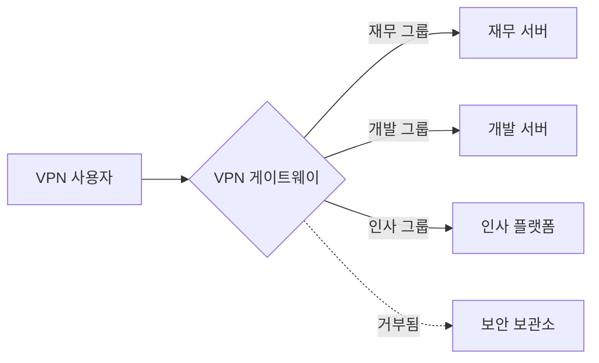

## 0.0 요약: 제로 트러스트 시대에도 VPN이 중요한 이유

현대 기업 환경에서 "경계(perimeter)"는 사실상 사라졌습니다. 그러나 가상 사설망(VPN)은 인프라 관리, 보안 관리자 액세스, 레거시 애플리케이션 연결을 위한 핵심 도구로 여전히 남아 있습니다. 이 가이드는 수동 관리가 불가능해지지만 "대규모 엔터프라이즈" 솔루션은 과도할 수 있는 300인 규모의 환경을 위해 설계되었습니다.

우리는 높은 성능, 현대적인 암호화 기본 요소, 간소화된 코드베이스를 갖춘 **WireGuard**를 기본 프로토콜로 집중적으로 다루며, 특정 사용 사례에 대한 OpenVPN 및 IPsec의 역할도 함께 고려합니다.

## 0.1 이 가이드를 읽는 방법

본 문서는 점진적인 기술 스택을 구축하는 과정을 담고 있습니다. 상위 수준의 개념 모델에서 시작하여 세부적인 구현 및 운영 매뉴얼로 나아갑니다.

- **1.0–3.0절:** 기초 개념 (무엇인가)
- **4.0–8.0절:** 아키텍처 및 설계 (왜 필요한가)

- **9.0–13.0절:** ID 및 보안 (어떻게 하는가)
- **14.0–18.0절:** 고급 엔지니어링 및 확장 (어려운 점)

- **부록:** 실무용 구성 템플릿 및 문제 해결 방안

:::tip[운영자 관점]
VPN 그 자체는 보안 솔루션이 아닙니다. VPN은 강력한 ID 공급자(IdP)와 엄격한 송신(egress) 정책에 의해 제어되어야 하는 **전송 계층(transport layer)**일 뿐입니다. 터널 내에서 "Any/Any" 라우팅을 절대 허용하지 마십시오.
:::

---

## 1.0 VPN의 기초: 암호화된 오버레이

VPN은 본질적으로 신뢰할 수 없는 물리적 네트워크를 통해 가상의 지점 간(point-to-point) 연결을 생성합니다. 엔터프라이즈 환경에서 이는 일반적으로 클라이언트 장치(노트북, 휴대폰)와 중앙 게이트웨이 간의 암호화된 터널을 의미합니다.

### 1.1 연결 수명 주기

사용자가 VPN 연결을 시작하면 다음 순서가 진행됩니다.

1. **인증:** 클라이언트가 자신의 신원을 증명합니다(주로 인증서 또는 MFA 기반 자격 증명 사용).
2. **키 교환:** 클라이언트와 서버가 Diffie-Hellman 또는 Noise와 같은 프로토콜을 사용하여 세션 키를 협상합니다.
3. **터널 인스턴스화:** 양쪽 끝에 가상 네트워크 인터페이스(예: `wg0` 또는 `tun0`)가 생성됩니다.
4. **라우팅 주입:** 특정 IP 대역을 가상 인터페이스로 보내도록 시스템 라우팅 테이블이 업데이트됩니다.
5. **캡슐화:** 나가는 패킷은 외부 헤더(UDP/TCP)로 감싸지고 암호화된 후 게이트웨이로 전송됩니다.
6. **역캡슐화:** 게이트웨이가 패킷의 포장을 풀고 내부 목적지로 전달합니다.

### 1.2 캡슐화 및 오버헤드

VPN 터널에 패킷을 담을 때마다 바이트가 추가됩니다.

- **WireGuard 오버헤드:** 32바이트 (IP 헤더 + UDP 헤더 + WireGuard 헤더)
- **OpenVPN 오버헤드:** 60-80바이트 (암호 및 전송 방식에 따라 상이)
표준 인터넷 연결의 MTU(최대 전송 단위)가 1500바이트인데 VPN이 32바이트를 추가한다면, 터널 내부의 실제 데이터 한계는 1468바이트가 됩니다. 이를 무시하면 패킷이 "파편화(fragmentation)"되어 속도가 느려지고 웹사이트 접속 오류가 발생합니다.

---

## 2.0 네트워크 엔지니어를 위한 핵심 용어

전문적인 시스템을 설계하려면 패킷 흐름과 암호화에 대한 전문 용어를 이해해야 합니다.

- **전송 계층 (UDP vs TCP):** VPN은 UDP를 강력히 선호합니다. TCP-over-TCP(TCP 멜트다운)는 패킷 손실 시 양쪽 계층에서 재전송을 시도하므로 성능이 치명적으로 저하됩니다.
- **MTU (Maximum Transmission Unit):** 패킷 크기의 물리적 제한(일반적으로 1500바이트). VPN은 헤더를 추가하므로, 파편화를 방지하기 위해 내부 MTU를 더 낮게(예: WireGuard는 1420) 설정해야 합니다.

- **MSS 클램핑:** 라우터가 TCP 핸드쉐이크를 가로채어 MSS(최대 세그먼트 크기)를 VPN의 줄어든 MTU에 맞게 조절하여, 데이터는 안 들어가는데 헤더만 맞는 "블랙홀" 연결을 방지하는 기술입니다.
- **PFS (Perfect Forward Secrecy, 완벽한 전방향 비밀성):** 장기 키가 노출되어도 과거 세션 키는 보호되는 속성입니다. 모든 세션은 고유한 일시적 키를 사용합니다.

- **스플릿 터널링:** 회사 트래픽(예: `10.0.0.0/8`)만 VPN으로 라우팅하고, 넷플릭스/유튜브는 사용자의 로컬 ISP를 통해 전송합니다. 대역폭 절약에 필수적입니다.
- **풀 터널링 (강제 터널링):** 모든 트래픽을 VPN으로 라우팅합니다. 높은 규정 준수가 요구되는 환경에서 모든 웹 트래픽이 기업 DNS 및 DLP(데이터 유출 방지) 필터를 통과하도록 보장할 때 필요합니다.

- **CGNAT (통신사급 NAT):** ISP가 여러 사용자에게 하나의 공인 IP를 공유하는 방식입니다. 기존의 IPsec 같은 VPN을 자주 차단하지만, WireGuard는 이를 잘 처리합니다.

---

## 3.0 프로토콜 심층 분석: WireGuard vs 기타 프로토콜

300명 규모라면 프로토콜 선택이 향후 3년간의 유지보수 비용을 결정합니다.

### 3.1 WireGuard (골드 스탠다드)

- **장점:** 약 4,000줄의 코드로 감사 가능, 최첨단 암호화(ChaCha20, Poly1305), 즉각적인 핸드쉐이크, 매우 높은 처리량.
- **단점:** 상태 비저장(stateless) 설계 (300명 이상 사용 시 NetBird, Tailscale, Firezone 같은 조정 계층 필요).
- **적합한 경우:** 성능 중심 팀, 모바일 사용자, 현대적인 Linux/클라우드 환경.

### 3.2 OpenVPN (전통적인 강자)

- **장점:** 엄청난 유연성, TCP 지원(제한적인 방화벽 우회), 거의 모든 환경에서 실행 가능.
- **단점:** 거대한 코드베이스(60만 줄 이상), 느린 컨텍스트 스위칭(사용자 공간과 커널 공간 사이), 복잡한 인증서 관리.
- **적합한 경우:** 엄격한 TLS 기반 규정 준수나 레거시 하드웨어 지원이 필요한 환경.

### 3.3 IKEv2/IPsec (기본 선택)

- **장점:** 고성능, Windows, iOS, macOS에서 별도 앱 없이 기본 지원.
- **단점:** 올바르게 구성하기가 매우 어려움; 호환되지 않는 변종이 너무 많음.
- **적합한 경우:** 사용자에게 타사 클라이언트를 설치할 수 없는 "Zero-Install" 환경.

---

## 4.0 아키텍처: 300명 규모 설계

300명 규모가 되면 셸 스크립트를 실행하는 단일 Linux 서버에 의존할 수 없습니다. 금요일 오후의 하드웨어 장애를 견딜 수 있는 아키텍처가 필요합니다.

### 4.1 고가용성(HA) 페어

Active-Passive 또는 Active-Active 구성으로 두 개의 VPN 게이트웨이를 배포합니다.

- **Keepalived/VRRP:** 가상 IP(VIP)를 사용합니다. 게이트웨이 A가 죽으면 수 초 내에 게이트웨이 B가 VIP를 넘겨받습니다.
- **상태 동기화:** IPsec 같은 프로토콜은 장애 조치 시 연결이 끊기지 않도록 세션 상태 동기화가 필요합니다. (WireGuard는 "조용하게" 즉시 재연결되므로 이 과정이 훨씬 쉽습니다.)

### 4.2 "대륙별 게이트웨이" 모델

분산된 인력의 경우, 런던에만 게이트웨이가 있으면 도쿄의 사용자는 불만을 느낍니다.

- **Anycast IP:** 클라우드 기반 Anycast 서비스를 사용하여 사용자를 가장 가까운 정상 상태의 VPN 노드로 라우팅합니다.
- **Geo-DNS:** 사용자 위치에 따라 `vpn.company.com`을 다른 지역 IP로 해석합니다.

### 4.3 탄력적 확장 (클라우드 네이티브 방식)

AWS나 Azure에서는 VPN 게이트웨이를 **Auto-Scaling Group**에 배치합니다. CPU 사용량이 70%를 넘으면 클라우드가 자동으로 세 번째 게이트웨이를 가동합니다. 이를 위해서는 노드 간 사용자 키를 공유할 외부 상태 저장소(예: Redis)나 조정 계층이 필요합니다.

---

## 5.0 보안 목표: "5대 원칙"

도입 전 다음 기준을 충족해야 합니다.

1. **ID 우선 액세스:** IdP(예: Entra ID, Okta, Google Workspace)에 유효한 계정이 없으면 진입 불가.
2. **암호화 무결성:** 현대적인 암호만 사용. RSA-2048, SHA-1, 3DES 비활성화.
3. **측면 이동 방지:** 기본적으로 모든 접근 거부. `마케팅` 그룹 사용자가 `데이터베이스` 서브넷에 ping을 보낼 수 없어야 함.
4. **엔드포인트 상태:** 연결 시 디스크 암호화 여부, 안티바이러스 실행 여부를 확인.
5. **가시성:** 모든 연결, 연결 해제, 핸드쉐이크 실패는 중앙 SIEM 시스템에 기록.

---

## 6.0 VPN 게이트웨이 위협 모델링

VPN 게이트웨이는 거대한 공격 대상입니다. 게이트웨이가 뚫리면 공격자는 이미 "내부"에 있는 것과 같습니다.

### 6.1 내부 위협 ("교활한 관리자")

- **위험:** IT 담당자가 개인 노트북을 위해 "백도어" 정적 키를 생성.
- **완화:** 모든 세션에 MFA 필수 적용. 예외 없음. 키 생성 이벤트를 모두 기록하고 매주 감사. 관리자 작업에는 "Just-In-Time"(JIT) 액세스 사용.

### 6.2 외부 위협 ("자격 증명 도용")

- **위험:** 공격자가 유출된 비밀번호로 임원 계정에 로그인.
- **완화:** 기기 바인딩. 비밀번호와 특정 하드웨어 인증서/기기 ID가 모두 있어야 VPN 연결 가능. 인증 엔드포인트에 속도 제한(Rate Limiting) 구현.

### 6.3 인프라 위협 ("DDoS")

- **위험:** UDP 플러딩으로 VPN 사용 불가능 상태 유도.
- **완화:** WireGuard의 DoS 방지를 위한 "쿠키" 메커니즘 활용. 핸드쉐이크가 증명될 때까지 유효한 MAC이 없는 패킷을 무시함. 클라우드 기반 WAF(웹 애플리케이션 방화벽)를 사용하여 엣지에서 악성 트래픽 필터링.

---

## 7.0 라우팅 및 서브넷 설계

효율적인 라우팅은 성능 병목을 방지하고 보안 규칙을 간소화합니다.

### 7.1 서브넷 충돌 방지

많은 가정용 라우터는 `192.168.1.0/24`를 사용합니다. 기업 네트워크가 동일 대역을 사용하면 사용자의 컴퓨터가 해당 트래픽을 "로컬"로 간주하여 내부 자원에 접근할 수 없습니다.

- **`10.x.x.x` 또는 `172.16.x.x` 대역 사용 표준화.**
- **VPN 풀을 위한 고유 세그먼트 사용** (예: `100.64.0.0/10` - 통신사급 NAT 대역)하여 중복 방지.

### 7.2 NAT 함정

네트워크 진입 시 모든 사용자를 단일 IP로 NAT하면 방화벽 로그에 모든 트래픽이 "VPN 서버"에서 오는 것으로 기록됩니다. *어떤* 사용자가 *어떤* 서버에 접속했는지 확인할 수 없습니다.

- **해결책:** VPN 서브넷을 직접 라우팅하십시오. 내부 서버가 해당 IP들에 대해 VPN 게이트웨이로 돌아가는 경로를 가지고 있는지 확인하십시오.

---

## 8.0 풀 터널 vs 스플릿 터널: 맥락적 분석

이 결정은 기술적인 것보다 정치적인 결정일 때가 많습니다.

### 8.1 풀 터널이 필요한 이유

- **보안:** 모든 웹 트래픽을 보안 게이트웨이(SWG)를 통과하도록 강제하여 악성 사이트 접속이나 멀웨어 다운로드를 방지할 수 있습니다.
- **프라이버시:** 공용 와이파이(호텔, 카페)에서 사용자의 트래픽을 도청으로부터 보호합니다.
- **규정 준수:** 금융, 보건 등 많은 산업군에서 데이터 보호법 준수를 위해 풀 터널링을 요구합니다.

### 8.2 스플릿 터널이 필요한 이유

- **성능:** Zoom/Teams 통화는 데이터 센터를 거칠 필요가 없습니다. 바로 인터넷으로 연결하십시오.
- **비용:** 점심 시간에 4K 유튜브를 보는 직원의 대역폭 비용을 지불하지 않아도 됩니다.
- **하드웨어 부하:** VPN 게이트웨이가 불필요한 트래픽(넷플릭스 등)을 처리할 필요가 없습니다.

:::caution[하이브리드 중간 지점]
대부분의 현대 기업은 **Split Inclusion**을 사용합니다. 내부 CIDR 대역(예: `10.0.0.0/8`)과 특정 SaaS IP만 포함하고, 나머지는 로컬 ISP가 처리하게 하십시오.
:::

---

## 9.0 ID 아키텍처: VPN과 현실의 연결

300명 규모에서는 게이트웨이의 로컬 Linux 사용자 계정을 관리할 수 없습니다. ID 브리지가 필요합니다.

### 9.1 ID 루프

1. **클라이언트 애플리케이션**이 로그인을 요청합니다.
2. **게이트웨이**가 사용자를 OIDC/SAML 로그인 페이지(Okta/Entra ID)로 리디렉션합니다.
3. **사용자**가 MFA(FIDO2, 인증기 앱)를 완료합니다.
4. **IdP**가 토큰(JWT)을 게이트웨이로 보냅니다.
5. **게이트웨이**가 단기 WireGuard 키를 생성하여 클라이언트로 푸시합니다.

### 9.2 MFA 구현 전략

- **SMS 피하기:** SIM 스와핑 및 SS7 가로채기에 취약합니다.
- **TOTP 또는 WebAuthn 선호:** 보안이 중요하다면 VPN 접속을 위해 하드웨어 키(Yubikey)를 요구하십시오. FIDO2는 현대 인증 보안의 정점입니다.

---

## 10.0 액세스 제어 목록(ACL) 및 마이크로 세그멘테이션

VPN 네트워크를 "평면적(flat)"으로 두지 마십시오.



### 10.1 RBAC 구현

- IdP 그룹을 네트워크 태그에 매핑합니다.
- **WireGuard**를 사용 중이라면 **NetBird**나 **Tailscale** 같은 도구를 사용하여 웹 UI에서 규칙을 정의하십시오.
- **Linux/Iptables**를 사용 중이라면, 사용자가 연결할 때 규칙을 업데이트하는 동적 스크립트가 필요합니다. 이를 "동적 방화벽 정책"이라고 합니다.

---

## 11.0 모니터링 및 로깅: 하늘의 눈

"오전 2시에 백업 서버에 누가 접근했는가?"라는 질문에 VPN 로그가 답을 줄 수 있어야 합니다.

### 11.1 추적해야 할 주요 지표

- **동시 세션:** 하드웨어 CPU/RAM 한계에 도달했는가?
- **사용자별 데이터 처리량:** 누군가 데이터를 유출하고 있는가(직무 대비 비정상적으로 높은 업로드량)?
- **핸드쉐이크 지연:** 인증 서버가 느린가?
- **패킷 손실:** MTU 문제나 ISP의 제한 가능성.

### 11.2 SIEM 통합

로그를 Elasticsearch, Splunk, Azure Monitor로 스트리밍하십시오. "불가능한 이동(impossible travel)"을 확인하십시오. 뉴욕에서 로그인한 사용자가 10분 뒤 프랑크푸르트에서 로그인한다면, 세션 토큰 탈취의 주요 징후입니다.

---

## 12.0 MTU/MSS 문제 해결 (고급)

이는 VPN 헬프데스크 티켓의 1위 원인입니다. 연결은 되는데 웹사이트가 안 열리거나 이메일 발송이 안 되는 경우입니다.

### 12.1 "Ping of Death" 테스트

VPN은 켜져 있는데 데이터가 안 흐른다면 실행해 보십시오:
`ping -M do -s 1400 10.0.0.1` (Linux) 또는 `ping 10.0.0.1 -f -l 1400` (Windows).
성공할 때까지 `1400` 값을 낮추십시오. 그 값이 경로 MTU입니다.

### 12.2 해결책

- WireGuard MTU를 `1280`으로 설정(IPv6를 위한 가장 안전한 최소값).
- 게이트웨이에서 MSS 클램핑 활성화:
    `iptables -t mangle -A FORWARD -p tcp --tcp-flags SYN,RST SYN -j TCPMSS --clamp-mss-to-pmtu`
이것은 서버가 원격 서버에게 VPN 터널에 도달하기 전부터 패킷을 줄이도록 지시합니다.

---

## 13.0 고가용성 및 로드 밸런싱

300명을 무중단으로 지원하려면 중복성이 필요합니다.

### 13.1 라운드 로빈 DNS

가장 간단한 형태입니다. `vpn.company.com`을 3개의 다른 IP로 지정하십시오. 클라이언트는 무작위로 하나를 선택합니다. 하나가 실패하면 사용자는 "살아있는" 서버를 찾기 위해 2-3번 재연결해야 할 수 있습니다.

### 13.2 TCP/UDP 로드 밸런서

클라우드 로드 밸런서(AWS NLB 또는 Azure Load Balancer)를 사용하십시오. 상태 확인을 수행하여 정상 게이트웨이로만 트래픽을 보냅니다. 단, WireGuard는 비연결성(UDP)이므로 소스 IP 기반의 "세션 고정(Session Stickiness)"을 사용해야 합니다.

---

## 14.0 VPN을 위한 재해 복구(DR)

주 데이터 센터가 마비되면 어떻게 될까요?

- **클라우드 백업:** 다른 클라우드 리전(예: AWS vs GCP)에 "Cold Standby" 게이트웨이를 항상 준비하십시오.
- **코드로 구성 관리:** VPN 구성을 Git에 저장하십시오. 서버가 죽으면 Terraform이나 Ansible을 사용하여 5분 안에 새 서버를 올릴 수 있어야 합니다. 재해 복구에서는 "불변성(Immutability)"이 최고의 친구입니다.
- **비상 키:** IdP 자체 장애에 대비해 물리적 "비상용(Glass Break)" 키 세트를 금고에 보관하십시오.

---

## 15.0 운영 우수성: 개발자 경험

보안이 뛰어나도 쓰기 어려운 VPN은 가장 유능한 엔지니어들에 의해 우회될 것입니다.

- **자동 연결:** 회사 사무실 와이파이가 아닐 경우 항상 켜지도록 구성.
- **SSO 통합:** 클릭 한 번으로 로그인. 사용자가 복잡한 비밀번호나 키 파일을 관리할 필요가 없도록 구성.
- **자동 업데이트:** MDM(Jamf, InTune)을 사용하여 사용자가 신경 쓰지 않도록 클라이언트 업데이트 푸시.
- **사용자 친화적 호스트 이름:** 내부 DNS(예: `jira.int.company.com`)가 VPN을 통해 작동하여 IP 주소를 기억하지 않아도 되도록 설정.

---

## 16.0 규정 준수 및 감사

SOC2, HIPAA, GDPR 대상이라면 VPN은 핵심 통제 수단입니다.

- **감사 추적:** 관리자가 ACL을 변경할 때마다 기록.
- **세션 종료:** 12~24시간 후 사용자를 자동으로 강제 로그아웃시켜 MFA 재인증을 유도. 노트북 도난 시 "영구적인 터널"을 방지합니다.
- **데이터 상주:** EU에 있다면 VPN 게이트웨이가 규정을 준수하지 않는 지역(일부 미국 데이터 센터 등)을 통해 트래픽을 라우팅하지 않도록 보장하십시오.

---

## 17.0 커널 수준의 성능 최적화

최대 속도를 위해 게이트웨이의 Linux 커널을 조정하십시오. 서버가 초당 10,000개 이상의 패킷을 부담 없이 처리할 수 있게 합니다.

```bash
# 패킷 큐 길이 증가
sysctl -w net.core.netdev_max_backlog=5000
# 수신/송신 버퍼 크기 증가 (16MB)
sysctl -w net.core.rmem_max=16777216
sysctl -w net.core.wmem_max=16777216
# TCP를 위한 BBR 활성화
sysctl -w net.core.default_qdisc=fq
sysctl -w net.ipv4.tcp_congestion_control=bbr
```

### 17.1 멀티큐 지원

최신 서버는 16개 이상의 CPU 코어를 가집니다. WireGuard는 기본적으로 이를 잘 처리하지만, 서버의 NIC(네트워크 인터페이스 카드)가 인터럽트 요청(IRQ)을 모든 코어에 분산하도록 구성되어 있는지 확인하십시오. `/proc/interrupts`를 확인하십시오. 만약 모든 인터럽트가 Core 0에 집중되어 있다면 성능은 정체됩니다.

---

## 18.0 미래 대비: ZTNA와 포스트 VPN 시대

산업계는 제로 트러스트 네트워크 액세스(ZTNA)로 이동하고 있습니다.

- **개념:** 사용자에게 "네트워크 접근"을 주는 대신, 리버스 프록시를 통해 "애플리케이션 접근"을 제공합니다.
- **타임라인:** VPN은 두꺼운 클라이언트 앱과 서버 관리를 위해 남겨두고, 웹 기반 앱은 ZTNA(Cloudflare Tunnel, Zscaler, Pomerium)로 전환하십시오. VPN은 "관리 평면"이 되고 ZTNA는 "사용자 평면"이 됩니다.

---

## 19.0 실무 문제 해결 시나리오

### 시나리오 A: "느린 화상 회화"
**증상:** 사용자가 일반 와이파이에서는 Zoom이 잘 되는데 VPN에서는 끊김.
**진단:** "Long Fat Pipe"(고지연, 고대역폭) 환경. 표준 TCP 혼잡 제어(Cubic)가 지연을 혼잡 신호로 오해하여 속도를 낮춤.
**해결:** 게이트웨이를 BBR로 변경(17.0절 참조). BBR은 실제 대역폭을 측정하여 지연을 훨씬 우아하게 처리합니다.

### 시나리오 B: "좀비 세션"
**증상:** 대시보드에는 사용자가 연결된 것으로 나오지만, 사용자는 4시간 전에 연결을 해제했다고 함.
**진단:** 클라이언트 인터넷이 갑자기 끊겼고(엘리베이터 진입 등), 게이트웨이가 "종료" 패킷을 못 받음. UDP는 비연결성이므로 서버가 세션을 계속 유지함.
**해결:** `PersistentKeepalive`를 줄이고 서버 측 "Dead Peer Detection"(DPD) 타임아웃을 10분으로 설정.

### 시나리오 C: "내부 사이트 무한 로딩"
**증상:** 브라우저 탭에 페이지 제목은 나오는데 콘텐츠는 안 나옴.
**진단:** MTU 불일치. 작은 핸드쉐이크 패킷은 통과하지만 큰 데이터 패킷(HTML/이미지)이 중간 라우터에서 차단됨.
**해결:** 게이트웨이에서 MSS 클램핑 규칙 적용(12.2절).

---

## 20.0 Linux, Mac, Windows CLI 퀵스타트

### 20.1 Linux (클라이언트)
```bash
sudo apt install wireguard
sudo nano /etc/wireguard/wg0.conf
sudo wg-quick up wg0
```

### 20.2 macOS (클라이언트)
Mac App Store 앱을 사용하거나 Homebrew 사용:
```bash
brew install wireguard-tools
sudo wg-quick up ./myconfig.conf
```

### 20.3 Windows (클라이언트)
`wireguard.com`에서 공식 MSI 설치 프로그램을 사용하십시오. 비관리자도 VPN을 켜고 끌 수 있는 시스템 서비스를 설치합니다.

---

## 부록 A: WireGuard 베이스 서버 구성 (Ubuntu 22.04)

```ini
[Interface]
PrivateKey = <SERVER_PRIVATE_KEY>
Address = 10.0.0.1/24
ListenPort = 51820
MTU = 1420

PostUp = iptables -A FORWARD -i %i -j ACCEPT; iptables -t nat -A POSTROUTING -o eth0 -j MASQUERADE
PostDown = iptables -D FORWARD -i %i -j ACCEPT; iptables -t nat -D POSTROUTING -o eth0 -j MASQUERADE

[Peer]
PublicKey = <CLIENT_PUBLIC_KEY>
AllowedIPs = 10.0.0.2/32
```

---

## 결론: 아키텍트를 위한 마지막 생각

300명을 위한 VPN 구축은 **보안**, **프라이버시**, **사용성** 사이의 균형 잡기입니다. WireGuard 같은 현대적 프로토콜 선택, ID 흐름 자동화, 네트워킹 법칙(MTU/MSS) 준수를 통해 사용자에게는 투명하고 공격자에게는 난공불락인 시스템을 만들 수 있습니다.

가장 성공적인 VPN은 아무도 돌아가는지 모르는 VPN입니다. 계속 경계하고, 기록을 남기고, 필요할 때가 오기 전에 장애 조치를 테스트하십시오.

---

## 21.0 보안 터널을 위한 고급 암호화 설정

WireGuard와 IPsec은 즉시 사용 가능한 강력한 보안을 제공하지만, 기업 환경은 FIPS 140-2나 NIST 가이드라인 같은 규정 준수를 위해 명시적인 암호화 강화를 요구할 때가 있습니다.

### 21.1 암호 스위트 선택 (현대적 스택)
- **KEM:** **Kyber**나 **McEliece** 같은 양자 내성 알고리즘을 조사하십시오.
- **AEAD:** **ChaCha20-Poly1305** 또는 **AES-GCM** 같은 AEAD 지원 암호를 항상 사용하십시오.

### 21.2 Noise 프로토콜 프레임워크
WireGuard는 **Noise 프로토콜 프레임워크** 기반입니다. 1번의 왕복(1-RTT)으로 연결을 완료하여 구형 프로토콜보다 훨씬 빠릅니다.

---

## 22.0 클라우드 네이티브 VPN 통합 (AWS, GCP, Azure)

### 22.1 AWS Transit Gateway (TGW)
모든 사용자를 VPC의 게이트웨이에 연결하는 대신, Transit Gateway와 연결된 **AWS Client VPN**을 사용하십시오.

### 22.2 Azure Virtual WAN
Microsoft 365와 Azure에 투자한 조직이라면 **Azure Virtual WAN**이 전 세계적인 "브랜치-투-클라우드" 연결 모델을 제공합니다.

---

## 23.0 VPN 지연 시간 관리: 물리학의 법칙

물리학적 한계를 극복할 수는 없지만 "마지막 구간"과 "중간 구간"은 최적화할 수 있습니다.

### 23.1 핸드쉐이크 지연 시간 감소
지연이 높은 지역에서는 TCP 기반 VPN을 절대 피하십시오.

### 23.2 "중간 구간" 최적화
대형 클라우드 공급자(AWS, Cloudflare, Google)는 공용 인터넷보다 30-40% 빠른 전용 광섬유 백본을 가집니다. 사용자를 근처의 PoP(접점)에 먼저 연결한 뒤, 공급자의 전용 백본으로 데이터 센터까지 보내는 방식이 **Tailscale**이나 **Cloudflare Warp** 속도의 비밀입니다.

---

## 24.0 결론: 복원력에 대한 마지막 한마디

VPN은 **미션 크리티컬 인프라**입니다. VPN이 다운되면 회사는 멈춥니다.

1. **중복성이 왕이다.**
2. **ID가 경계다 (MFA 필수).**
3. **성능은 이진법이다 (느리면 안 쓴다).**
4. **로깅이 진실이다.**

성실하게 관리하고, 패킷 손실을 모니터링하고, 프라이빗 키를 안전하게 보관하십시오.