## 마지막으로 다시 한번 지반이 이동합니다

네 권의 볼륨을 거치면서 우리는 벽을 쌓고 ([I](/posts/secure_systems_architecture/)), 모든 문에서 모든 원칙을 검증했으며 ([II](/posts/identity_and_access_in_depth/)), 메시지를 위조 불가능하게 만들었고 ([III](/posts/cryptography_engineering_in_depth/)), 결국 침입하는 침해를 탐지하고 생존하는 법을 배웠습니다 ([IV](/posts/detection_and_response_in_depth/)). 이 모든 아이디어는 조용히 사실이 아니게 된 가정을 깔고 있었습니다: *서버*, *머신*, 즉 지속되고, 당신이 소유하며, 가리킬 수 있는 *무언가*가 존재한다는 가정입니다.

클라우드 네이티브 세상에서, 그 가정은 사라집니다:

*   "서버"는 90초 동안만 존재하다가 동일한 복제품으로 교체되는 **컨테이너**입니다.
*   인프라는 랙에 장착되지 않습니다; 파이프라인이 적용하는 **YAML 파일**입니다.
*   애플리케이션은 당신이 직접 작성한 것이 아닙니다; 그것은 **당신의 코드에 당신이 작성하지 않은 2천 개의 종속성이 더해진 것**이며, 당신이 완전히 감사하기 어려울 빌드 시스템에 의해 조립됩니다.

이 마지막 편은 *그러한* 세상을 방어하는 것에 관한 것입니다. 경계가 완전히 사라지고, 워크로드는 애완동물이 아닌 가축이며, 지난 10년간 가장 파괴적인 침해는 정문이 아니라 **공급망**을 통해 발생합니다. 이 시리즈에서 배운 모든 것은 여전히 적용되지만, 그것이 적용되는 표면은 이제 하루에 수천 번 깜빡이며 존재했다 사라집니다.

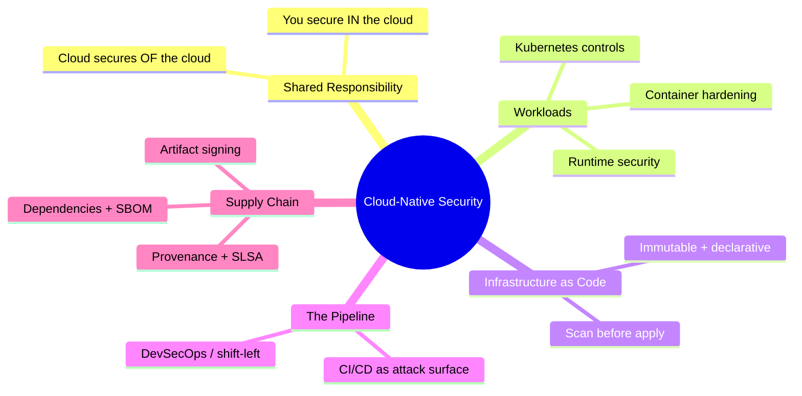

---

## 파트 I: 공유 책임 모델

클라우드 보안에서 가장 첫 번째이자 가장 오해받는 아이디어: **클라우드 공급자는 당신의 애플리케이션을 보호하지 않습니다.** 그들은 클라우드가 실행되는 *인프라*를 보호하고, 당신은 당신이 그 안에 *넣는 것*을 보호합니다. 이 경계는 서비스 모델에 따라 이동하며, 침해는 이 경계가 어디에 있는지에 대한 혼란 속에서 발생합니다 [^1]:

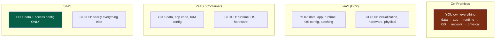

:::important[당신의 책임은 결코 0이 되지 않습니다]
모든 열에서 변함없는 것을 주목하십시오: **당신은 항상 당신의 데이터와 접근 제어 구성을 소유합니다.** 압도적인 대다수의 "클라우드 침해"는 공급자가 해킹당한 것이 아니라, *고객*의 잘못된 구성 때문입니다: 공개 S3 버킷, 과도한 권한을 가진 IAM 역할, `0.0.0.0/0`에 노출된 데이터베이스 등입니다. 클라우드는 강력하지만 기본적으로 꺼져 있는 원시적인 기능을 제공하며, 그것들을 꺼진 채로 두는 것은 당신의 책임입니다. 공급자 침해가 아닌, 잘못된 구성이 클라우드 데이터 노출의 가장 큰 원인입니다. [^2]
:::

---

## 파트 II: 워크로드 보호

### 챕터 1: 컨테이너 보안 - 계층화된 현실

컨테이너는 경량 VM이 아닙니다; 그것은 **공유 호스트 커널** 위에 있는 격리된 *프로세스* 집합입니다. 이 단 하나의 사실이 전체 위협 모델을 이끌며, 방어는 이미지부터 런타임까지 계층화됩니다:

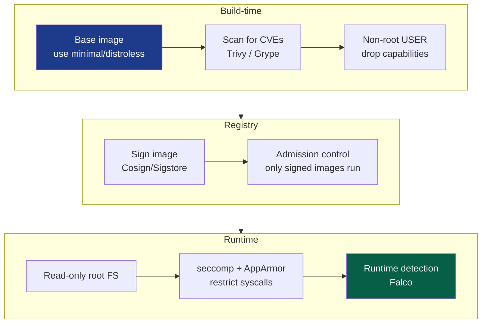

가장 효과적인 컨테이너 실천 사항들을 투자 대비 효과 순서대로 나열하면 다음과 같습니다:

*   **최소 베이스 이미지** - `distroless` 또는 scratch 이미지는 당신의 앱과 *그 외 아무것도* 포함하지 않습니다: 셸, 패키지 관리자, `curl`도 없습니다. 공격자가 침투하더라도 사용할 도구가 없습니다. 이는 또한 CVE 표면을 10배 줄여주며, OS 패키지가 없으면 OS 패키지 취약점도 없습니다.
*   **루트로 실행하지 마십시오** - 루트로 실행되는 컨테이너 프로세스가 컨테이너를 탈출하면 *호스트에서도* 루트가 됩니다. 비루트 `USER`를 설정하고, 모든 Linux 기능을 제거하며 필요한 것만 다시 추가하십시오.
*   **읽기 전용 루트 파일 시스템** - 컨테이너가 자체 파일 시스템에 쓸 수 없다면, 공격자는 페이로드를 드롭할 수 없습니다.
*   **모든 이미지 스캔** - CI에서 `Trivy`/`Grype`를 사용하여 심각한 CVE가 발견되면 빌드를 차단합니다.

:::warning[컨테이너 탈출이 모든 것의 핵심입니다]
컨테이너는 호스트 커널을 공유하기 때문에, **커널 익스플로잇 또는 잘못된 구성은 호스트 전체를 장악하는 것으로 이어지며**, 하나의 호스트에서 종종 전체 클러스터로 확산될 수 있습니다. 이를 쉽게 만드는 치명적인 죄악은 다음과 같습니다: `--privileged`로 실행하는 것, Docker 소켓(`/var/run/docker.sock`)을 컨테이너에 마운트하는 것 (이는 호스트의 루트 권한을 선물 포장하는 것과 같습니다), 그리고 UID 0으로 실행하는 것입니다. 권한 있는 컨테이너는 `sudo`를 배포하는 것과 동일한 정밀 조사가 필요한 결정으로 간주하십시오. [^3]
:::

### 챕터 2: Kubernetes - 오케스트레이터 강화

Kubernetes는 컨테이너를 위한 분산 운영 체제이며, 그 보안은 그 자체로 하나의 주제입니다. 공격 표면은 **클라우드 네이티브 보안의 4C**로 기억되는 네 가지 전선에 걸쳐 있습니다: Cloud, Cluster, Container, Code [^4].

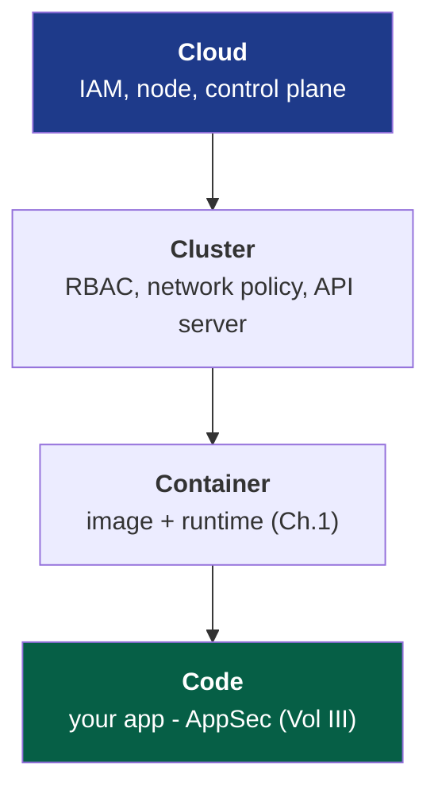

클러스터의 핵심 제어 기능은 각각 특정 공격 경로를 차단합니다:

::::steps

:::step[RBAC - API를 위한 최소 권한]{subtitle="누가 클러스터에 무엇을 할 수 있는가"}
Kubernetes API 서버는 핵심 보물이며, 이를 제어하는 사람은 모든 워크로드를 제어합니다. 볼륨 II의 최소 권한 원칙을 적용하십시오: 서비스 계정에 와일드카드 `cluster-admin`을 부여하지 말고, 역할을 네임스페이스로 제한하며, 필요하지 않은 곳에는 기본 서비스 계정 토큰을 마운트하지 마십시오. 과도한 권한을 가진 토큰을 가진 파드는 클러스터 탈취의 직접적인 피벗 포인트가 될 수 있습니다.
:::

:::step[네트워크 정책 - 기본 거부]{subtitle="동서 트래픽 세분화"}
기본적으로, *모든 파드는 다른 모든 파드와 통신할 수 있습니다*. 평탄하고 신뢰하며, 볼륨 I에서 경고했던 네트워크 모델과 정확히 같습니다. **기본 거부(default-deny)** 네트워크 정책을 적용하고 필요한 흐름만 명시적으로 허용하십시오. 이는 파드 네트워크에 적용된 마이크로 세분화(볼륨 I/II)입니다: 이는 단일 손상된 파드를 발사대에서 막다른 길로 바꿉니다.
:::

:::step[파드 보안 표준 - 위험한 것 제한]{subtitle="컨테이너 규칙 적용"}
**Restricted** 파드 보안 표준을 적용하십시오: 특권 파드 없음, 호스트 네임스페이스 공유 없음, 비루트만 허용, 읽기 전용 루트 FS. 이것은 챕터 1의 컨테이너 규칙이 개발자에게 단순히 권장되는 것이 아니라 플랫폼에 의해 *의무화*되는 지점입니다.
:::

:::step[시크릿 - base64를 "암호화"로 사용하지 마십시오]{subtitle="민감한 정보 보호"}
Kubernetes 시크릿은 기본적으로 etcd에서 암호화되지 않고 **base64로 인코딩**만 됩니다. etcd에 대한 **저장 중 암호화**를 활성화하고, 더 나아가 외부 관리자(Vault, CSI 드라이버를 통한 클라우드 KMS)와 통합하여 시크릿이 복구 가능한 형태로 etcd에 저장되지 않도록 하십시오. 그렇지 않으면 etcd 읽기 권한이 있는 사람은 모든 시크릿을 읽을 수 있습니다.
:::

:::tip[어드미션 컨트롤은 정책의 병목 지점입니다]
클러스터에 들어오는 모든 오브젝트는 **어드미션 컨트롤러**를 통과하며, 이는 코드로 정책을 적용하기에 이상적인 장소입니다. **OPA Gatekeeper** 또는 **Kyverno**와 같은 도구를 사용하면 규정을 준수하지 않는 워크로드를 입구에서 *거부*할 수 있습니다: "서명 없는 이미지는 허용하지 않음", "리소스 제한 없는 컨테이너는 허용하지 않음", " `latest` 태그는 허용하지 않음". 이것은 볼륨 II의 제로 트러스트 모델에서 PEP가 클러스터의 정문에 적용되는 것과 같습니다. 어드미션 단계에서 적용되는 정책은 개발자가 잊을 수 없습니다. [^5]
:::

### 챕터 3: 런타임 보안 - 파드가 손상되었다고 가정

지금까지의 모든 내용은 예방적인 조치입니다. 볼륨 IV의 *침해 가정(assume-breach)* 사고방식을 워크로드에 적용하면: 컨테이너는 *결국* 실행해서는 안 되는 것을 실행하게 될 것입니다. **런타임 보안**은 실시간 동작을 감시하고 비정상적인 것을 감지합니다. 예를 들어, 하나의 프로세스만 실행되어야 하는 컨테이너 내에서 셸이 생성되거나, 이전에 본 적 없는 IP로 외부 연결이 시도되거나, `/etc/passwd`에 쓰기 작업이 발생하는 경우 등입니다. **Falco**와 같은 도구는 커널의 시스템 호출 스트림을 탐지로 전환하여, 볼륨 IV의 SIEM/탐지 엔지니어링 원칙을 일시적인 워크로드까지 확장합니다.

---

## 파트 III: 코드형 인프라 - 설계도 보호

클라우드 네이티브 환경에서는 인프라가 Terraform, CloudFormation, Pulumi와 같이 **구성되는 것이 아니라 선언됩니다**. 이는 보안의 *선물*입니다: 전체 인프라가 코드이기 때문에, **단일 리소스가 생성되기 전에 잘못된 구성을 스캔할 수 있습니다.**

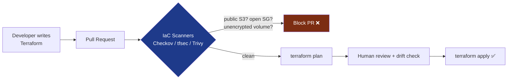

이것은 **시프트 레프트(shift-left)** (볼륨 I의 SSDLC 주제)의 궁극적인 표현입니다: 세상에 공개된 보안 그룹, 암호화되지 않은 데이터베이스, 공개 버킷과 같이 침해를 유발할 수 있는 잘못된 구성이 프로덕션에 *존재하기 전에*, 코드 리뷰 단계에서 발견됩니다. 취약점을 발견하는 시기가 늦어질수록 수정 비용은 기하급수적으로 증가합니다:

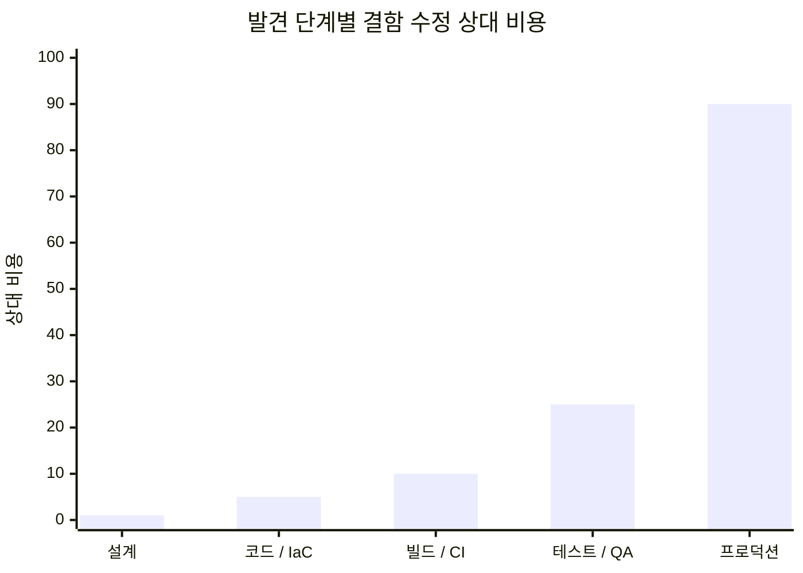

오른쪽으로 한 단계 이동할 때마다 비용이 몇 배로 증가하며, 프로덕션에서의 *침해*는 이 차트 범위 밖의 비용을 초래합니다. IaC 스캐닝은 탐지를 가능한 가장 저렴한 단계로 밀어붙이는 방법입니다.

:::note[불변성은 보안 속성입니다]
IaC는 **불변 인프라**를 가능하게 합니다: 서버는 제자리에서 패치되지 않고, 알려진 양호한 이미지로부터 *교체*됩니다. 이것은 두 가지 문제를 조용히 해결합니다. **구성 드리프트** ("실행 중인 것"과 "우리가 실행 중이라고 생각하는 것"의 느린 불일치)가 사라집니다. 모든 배포는 소스로부터 다시 빌드되기 때문입니다. 그리고 공격자의 **지속성**이 훨씬 어려워집니다. 실행 중인 호스트에 심어진 백도어는 해당 호스트가 다시 배포되는 다음 번에 지워지며, 이는 몇 시간 후일 수 있습니다. 애완동물이 아닌 가축(Cattle, not pets)은 운영상의 편의뿐만 아니라 보안 자세이기도 합니다.
:::

---

## 파트 IV: 공급망 - 10년의 최전선

현대 소프트웨어의 불편한 진실은 다음과 같습니다: **당신은 당신이 출하하는 것의 약 5%를 작성했습니다.** 나머지 95%는 오픈소스 종속성, 기본 이미지, 빌드 도구, 즉 낯선 사람들의 코드이며, 전이적으로 가져와져 당신의 애플리케이션의 완전한 권한으로 실행됩니다. 공급망은 이제 보안에서 가장 활발하게 악용되는 최전선입니다. 왜 강화된 대상을 침해하려 합니까? *그것이 신뢰하는* 것을 손상시킬 수 있는데 말입니다.

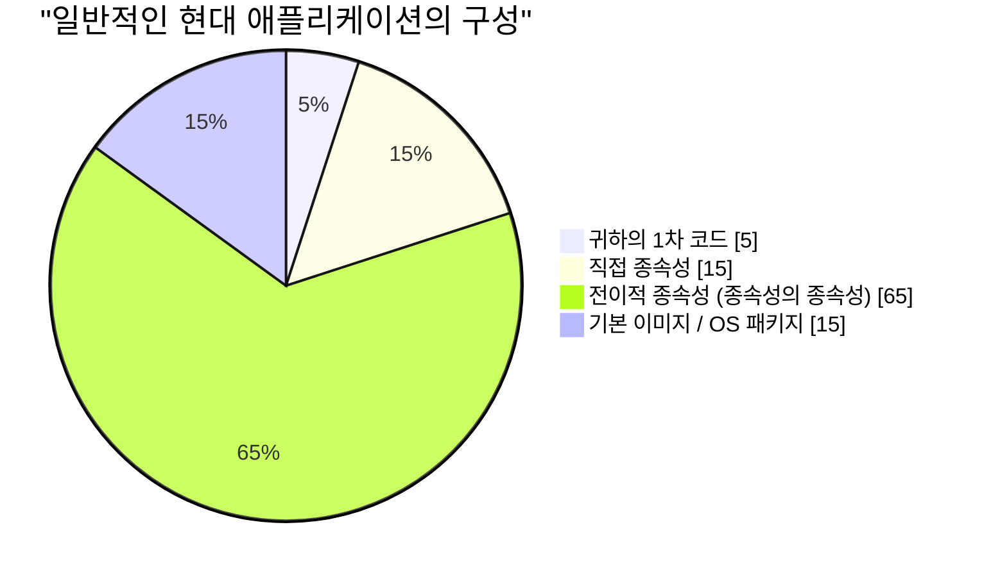

저 거대한 "전이적" 부분이 핵심입니다: 당신은 당신의 직접적인 종속성 15개를 *선택했지만*, 당신은 들어본 적 없는 수백 개의 종속성을 물려받았고, 그 중 단 하나라도 당신의 보안을 끝장낼 수 있습니다.

### 챕터 4: 공급망 공격의 해부학

최근 몇 년을 정의한 재앙들, **SolarWinds** (2020년, 손상된 빌드 파이프라인이 18,000개 조직에 배포된 서명된 업데이트에 백도어를 주입)와 **Log4Shell** (2021년, *수백만* 개의 애플리케이션에 내장된 로깅 라이브러리의 사소하게 악용 가능한 RCE) [^6]은 다음과 같은 공통된 형태를 공유합니다:

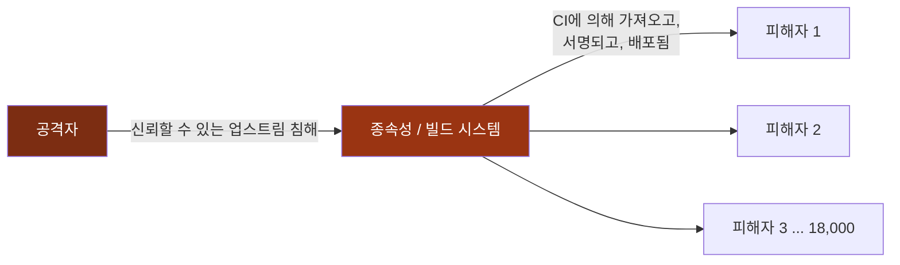

하나의 침해로 수천 명의 피해자가 발생했으며, 이들 모두는 다른 모든 것을 올바르게 수행했습니다. 이러한 비대칭성 때문에 공급망 보안은 국가 안보 우선순위가 되었고, 아래의 방어책들은 정교함이 아니라 이제는 기본적인 필수 사항이 되었습니다.

### 5장: 현대적 방어 - SBOM, 서명, SLSA

세 가지 상호 연결된 관행은 세 가지 공급망 질문에 답합니다: *무엇이 들어 있는지, 주장하는 것이 맞는지, 그리고 어떻게 구축되었는지 신뢰할 수 있는지*:

| 방어책 | 답변하는 질문 | 내용 |
| --- | --- | --- |
| **SBOM** | *내 소프트웨어에 실제로 무엇이 들어있나요?* | 소프트웨어 구성 요소 목록(Software Bill of Materials)으로, 모든 구성 요소와 버전을 기계가 읽을 수 있는 형태로 보여줍니다. 다음 Log4Shell과 같은 취약점이 발생하면 SBOM을 검색하여 노출 여부를 몇 분 만에 파악할 수 있으며, 몇 주가 걸릴 필요가 없습니다. [^7] |
| **아티팩트 서명** | *이 아티팩트가 원본이며 변조되지 않았습니까?* | 빌드 결과물에 암호학적으로 서명하여 (**Sigstore/Cosign**) 소비자가 출처를 검증할 수 있도록 하며, 이는 볼륨 III의 서명 개념을 빌드 아티팩트에 적용하는 것입니다. |
| **SLSA** | *빌드 프로세스를 신뢰할 수 있습니까?* | 소프트웨어 아티팩트 공급망 수준(Supply-chain Levels for Software Artifacts)으로, 빌드 무결성을 위한 등급 프레임워크입니다: 소스 검증, 빌드 격리, 출처 생성 및 서명. [^8] |

종단 간 보안 파이프라인은 이 시리즈의 모든 내용을 이러한 요소들과 결합하여 구성합니다:

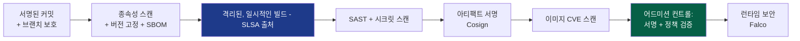

:::warning[CI/CD 파이프라인 그 자체가 주요 공격 대상입니다]
당신의 빌드 시스템은 신과 같은 권한을 가지고 있습니다. 모든 시크릿을 읽고, 모든 아티팩트에 서명하며, 프로덕션에 배포할 수 있습니다. 유출된 CI 토큰, 권한 있는 러너에서 신뢰할 수 없는 코드를 실행하는 악성 풀 리퀘스트, 또는 오염된 GitHub 액션은 **자신의 유효한 서명과 함께** 백도어 소프트웨어를 배포하는 직접적인 경로가 됩니다. 파이프라인을 프로덕션 인프라처럼 다루십시오: 최소 권한 토큰(볼륨 II에 따른 OIDC 연동, 단기 수명), 로그에 시크릿 없음, 고정된 액션 버전(태그가 아닌 SHA로), 그리고 신뢰할 수 없는 코드를 위한 격리되고 일시적인 러너를 사용하십시오. 당신의 방어 시스템을 구축하는 파이프라인은 신뢰를 만들어내기 때문에 조폐소와 같은 이유로 공격 대상이 됩니다. [^9]
:::

---

## 파트 VI: DevSecOps - 보안을 지속적으로 만들기

다섯 권의 볼륨 모두 하나의 문화적 변화에 집중합니다. 끝에 가서 소프트웨어를 검토하고 "안돼"라고 말하던 구형 보안 팀 모델은 하루에 수천 번 배포되는 세상에서 살아남을 수 없습니다. **DevSecOps**는 보안 팀의 게이트를 해체하고 그 전문성을 파이프라인 *안으로* 분산시켜, 보안이 자동화되고, 지속적이며, 모두의 업무가 되도록 합니다.

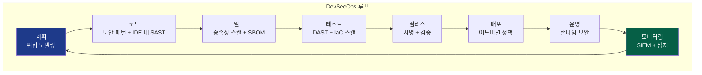

이 루프의 각 노드는 이 시리즈의 한 챕터이며, 이제 자동화되고 내장되어 있습니다: 위협 모델링(I), 보안 코딩 및 암호화(III), 종속성 및 IaC 스캐닝(V), 서명(III/V), 어드미션 컨트롤 및 제로 트러스트 적용(II), 런타임 탐지 및 SIEM(IV). 보안은 더 이상 *단계*가 아니라 파이프라인의 *속성*이 되며, 지속적으로 검사되고, 코드로 적용되며, 통과할 때는 보이지 않고 실패할 때만 큰 소리를 냅니다.

:::important[모든 것의 문화적 핵심]
DevSecOps는 20%의 도구와 80%의 문화입니다. 그 근본적인 믿음은 **보안이 부서의 거부권이 아니라 공유된 책임이라는 것**입니다. 이를 달성하는 방법은 안전한 경로를 *쉬운* 경로로 만드는 것입니다: 미리 승인된 강화된 기본 이미지, 기본적으로 안전한 템플릿, 즉시 규정을 준수하는 IaC 모듈, 그리고 분기별 감사가 아닌 풀 리퀘스트에서 몇 초 안에 자동화된 피드백을 제공하는 것입니다. 안전한 일을 하는 것이 안전하지 않은 일을 하는 것보다 *덜* 힘들 때, 보안은 확장됩니다. 그것이 부담이 될 때, 개발자들은 매번 그것을 우회할 방법을 찾을 것입니다.
:::

---

## 결론: 시리즈의 종합

우리는 볼륨 I에서 물리 계층, 즉 벽 속의 케이블, 와이어 위의 프레임에서 시작하여, 깃(git) 저장소의 텍스트에 불과한 인프라 내부에서 90초 동안 존재하는 컨테이너에 이르렀습니다. 다섯 권의 볼륨을 거치면서, 모든 수준에서 하나의 진실이 쌓였습니다:

> **시스템을 안전하게 지키는 단일한 제어는 없습니다. 보안은 깊이이며, 독립적이고 중첩된 제어 계층으로 이루어져 있으며, 각 계층은 그 앞에 있는 계층이 결국 실패할 것이라고 가정합니다.**

그 깊이가 실제로 무엇이 되었는지 되돌아보십시오:

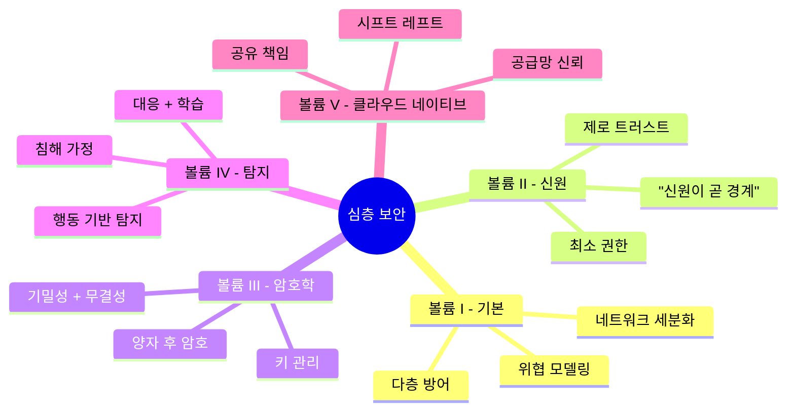

방화벽은 네트워크가 침해될 수 있다고 가정하므로, 신원 인증이 모든 요청을 검증합니다. 신원 인증은 자격 증명이 도난당할 수 있다고 가정하므로, 암호화가 세션을 위조 불가능하고 전방향 안전하게 만듭니다. 암호화는 엔드포인트가 여전히 소유될 수 있다고 가정하므로, 탐지가 그것을 배신하는 행동을 감시합니다. 탐지는 워크로드 자체가 오염될 수 있다고 가정하므로, 공급망이 우리가 배포하는 것이 우리가 구축한 것임을 증명합니다. 이러한 제어 중 단 하나도 다른 제어가 완벽할 것이라고 신뢰하지 않으며, *아키텍처에 내재된 그 불신*이야말로 모든 기술의 핵심입니다.

경계는 해체되었습니다. 머신은 일시적이 되었습니다. 코드는 대부분 낯선 사람의 것이 되었습니다. 그리고 이 모든 것을 통해 원칙은 유지되었습니다: **방어선을 계층화하고, 모든 것을 검증하고, 침해를 가정하고, 출처를 증명하며, 단 하나의 벽도 마지막 벽이라고 결코 신뢰하지 마십시오.** 그것이 심층 보안입니다. 그것이 우리의 일입니다.

전체 스택을 함께 걸어주셔서 감사합니다. 부서지기 어렵고, 부서진 후에도 살아남을 만큼 겸손한 것들을 구축하십시오.

---

## 참조

[^1]: [AWS - 공유 책임 모델](https://aws.amazon.com/compliance/shared-responsibility-model/)
[^2]: [Gartner / CSA - 가장 심각한 11가지: 클라우드 보안 주요 위협](https://cloudsecurityalliance.org/artifacts/top-threats-to-cloud-computing-egregious-eleven/)
[^3]: [NIST (2017) - SP 800-190: 애플리케이션 컨테이너 보안 가이드](https://csrc.nist.gov/publications/detail/sp/800-190/final)
[^4]: [Kubernetes - 클라우드 네이티브 보안 개요 (4C)](https://kubernetes.io/docs/concepts/security/overview/)
[^5]: [Open Policy Agent - Gatekeeper](https://open-policy-agent.github.io/gatekeeper/website/docs/)
[^6]: [CISA - Apache Log4j 취약점 가이드](https://www.cisa.gov/uscert/apache-log4j-vulnerability-guidance)
[^7]: [NTIA - 소프트웨어 구성 요소 목록 (SBOM)](https://www.ntia.gov/SBOM)
[^8]: [SLSA - 소프트웨어 아티팩트 공급망 수준](https://slsa.dev/)
[^9]: [OWASP - CI/CD 보안 위험 상위 10가지](https://owasp.org/www-project-top-10-ci-cd-security-risks/)