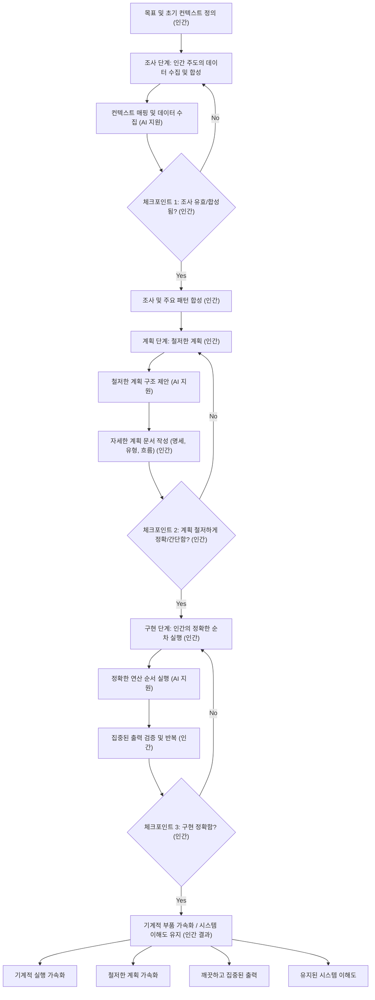

지금 엔지니어링 팀 전반에 걸쳐 조용한 현상이 일어나고 있습니다. 개발자가 AI 에이전트를 사용하여 복잡한 기능을 생성합니다. 테스트는 통과합니다. 코드는 배포됩니다. 하지만 그 개발자에게 방금 배포된 내용의 정확한 메커니즘을 설명해달라고 요청하면 어려움을 겪을 수 있습니다.

우리는 완전히 이해하지 못하는 코드를 배포하고 있으며, 그 속도는 전례가 없습니다.

최근 업계 논의, 특히 엔터프라이즈 기업의 방대한 코드베이스를 다루는 엔지니어링 리더들의 논의는 현대 소프트웨어 개발의 명백한 역설을 강조했습니다. AI 도구는 며칠이 걸리던 작업을 몇 시간 만에 완료했습니다. 하지만 대규모 프로덕션 시스템은 결국 실패하게 되며, 그렇게 되면 시스템을 깊이 이해하는 인간이 디버깅해야 합니다.

우리가 소프트웨어 위기에 직면한 첫 번째 세대는 아니지만, 무한한 생성 규모로 이에 직면한 첫 번째 세대입니다.

## "쉬운" 것의 환상

코드베이스가 이해하기 어려워지는 이유를 이해하려면 근본적인 엔지니어링 철학, 즉 *단순함(simple)*과 *쉬움(easy)*의 차이를 다시 살펴봐야 합니다.

Rich Hickey(Clojure 제작자)가 유명하게 정의했듯이, **단순함**은 구조를 의미합니다. 이는 구성 요소가 하나의 작업을 수행하며 다른 구성 요소와 얽혀 있지 않음을 의미합니다. 반면에 **쉬움**은 근접성을 의미합니다. 이는 npm에서 패키지를 가져오거나, Stack Overflow에서 스니펫을 복사하거나, LLM에 프롬프트를 보내는 것처럼 솔루션을 손쉽게 사용할 수 있음을 의미합니다.

단순함은 신중한 생각, 설계, 아키텍처의 분리를 요구합니다. "쉬움"은 거의 아무런 생각 없이 이루어집니다.

AI는 궁극적인 "쉬운" 버튼입니다. 채팅 인터페이스에서는 기능을 추가하는 데 마찰이 전혀 없습니다. AI에게 인증을 추가하고, OAuth를 추가하고, 세션 버그를 패치하라고 요청합니다. 곧, 여러분은 소프트웨어 엔지니어링을 하는 것이 아니라 거대한 컨텍스트 창을 관리하게 됩니다. AI 모델은 기꺼이 만족시키려 하기 때문에, 나쁜 아키텍처 결정에 대한 저항 없이 단순히 새 코드를 기존 코드 위에 덧씌워 여러분의 최신 프롬프트를 만족시키기 위해 로직을 변형합니다.

우리는 지금 속도를 위해 단순함을 거래하고, 나중에 막대한 복잡성으로 그 대가를 치르게 됩니다.

## AI 시대의 우발적 복잡성

Fred Brooks의 전설적인 1986년 논문 "No Silver Bullet"에서 그는 소프트웨어 복잡성을 두 가지 범주로 나누었습니다.
1.  **본질적 복잡성:** 실제 비즈니스 문제를 해결하는 근본적인 어려움.
2.  **우발적 복잡성:** 솔루션을 구현하려고 노력하는 과정에서 우리가 만드는 지저분한 임시방편, 레거시 추상화, 기술 부채.

거대하고 오래된 코드베이스에서 이 두 가지 유형의 복잡성은 깊이 얽혀 있습니다. 이를 분리하려면 역사적 맥락과 인간의 직관이 필요합니다.

AI 생성 도구는 이 점에서 매우 어려움을 겪습니다. LLM이 저장소를 스캔할 때, 핵심 비즈니스 규칙과 오래되고 엉성한 임시방편을 구별하는 판단력이 부족합니다. 모든 기존 패턴을 보존해야 하는 엄격한 요구 사항으로 취급합니다. AI에게 깊이 결합된 레거시 시스템을 리팩토링하라고 요청하면, 종종 통제 불능 상태에 빠지거나, 포기하거나, 새 구문을 사용하여 오래되고 잘못된 패턴을 재현합니다.

## 해결책: 명세 기반 개발

핵심 문제가 이해력 부족이라면, 해결책은 더 열심히 프롬프트를 보내거나 더 똑똑한 모델을 기다리는 것이 아닙니다. 해결책은 코드 생성과의 관계를 완전히 바꾸는 것입니다. 우리는 코드를 작성하는 것에서 **아키텍처를 명세하는 것**으로 전환해야 합니다.

이 방법론(종종 컨텍스트 압축 또는 명세 기반 개발이라고도 함)은 AI가 기계적인 타이핑 작업을 수행하기 전에 인간 엔지니어가 어려운 사고 작업을 하도록 강제합니다. 일반적으로 세 가지 별도 단계가 포함됩니다.

### 1. 안내된 조사
AI에게 코딩을 시작하라고 요청하는 대신, 관련 아키텍처 다이어그램, 문서 및 대상 코드 조각을 제공합니다. AI에게 의존성을 매핑하고 엣지 케이스를 식별하도록 요청합니다. 인간으로서 이 분석을 검증하고 수정합니다. 출력은 코드가 아니라 검증된 조사 문서입니다.

### 2. 고품질 계획
조사를 사용하여 엄격한 구현 계획을 초안으로 작성합니다. 여기에는 함수 서명, 데이터 흐름 및 서비스 경계 정의가 포함됩니다. 이 문서는 주니어 엔지니어가 아키텍처 결정을 내리지 않고도 실행할 수 있을 만큼 정확해야 합니다. 이것이 우발적 복잡성을 적극적으로 제거하는 부분입니다.

### 3. 제한된 구현
마지막으로, 정확하고 검증된 사양을 AI에게 전달하여 실행하도록 합니다. AI는 여러분의 청사진에 의해 엄격하게 제약되기 때문에 "복잡성 소용돌이"로 빠져들지 않습니다. 여러분의 계획에 맞춰 단순히 검증하는 것이므로 생성된 코드를 빠르게 검토할 수 있습니다.

## 엔지니어의 미래

소프트웨어 엔지니어링에서 가장 어려운 부분은 구문을 입력하는 것이 아니었습니다. 항상 먼저 *무엇을* 입력해야 하는지를 아는 것이었습니다.

AI를 사용하여 비판적 사고 단계를 우회하면 시스템 직관이 퇴화할 것입니다. 특정 아키텍처가 너무 취약하거나 너무 긴밀하게 결합되어 있다는 것을 알려주는 어렵게 얻은 본능을 잃게 될 것입니다.

AI 시대에 성공할 엔지니어는 가장 많은 양의 코드를 생성하는 사람이 아닐 것입니다. 그들은 자신이 구축하는 것에 대한 깊고 구조적인 이해를 유지하고, 아키텍처의 이음새를 볼 수 있으며, AI를 사용하여 기계적인 부분을 가속화하면서도 디자인의 단순성을 맹렬하게 보호하는 사람일 것입니다.

***