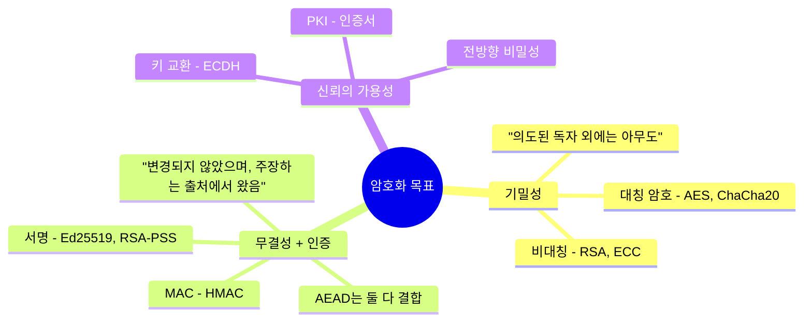
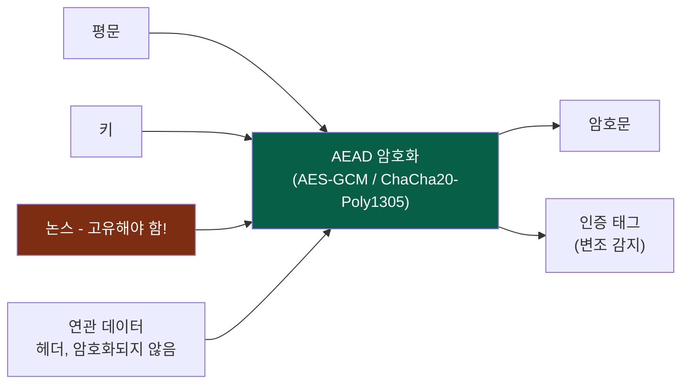
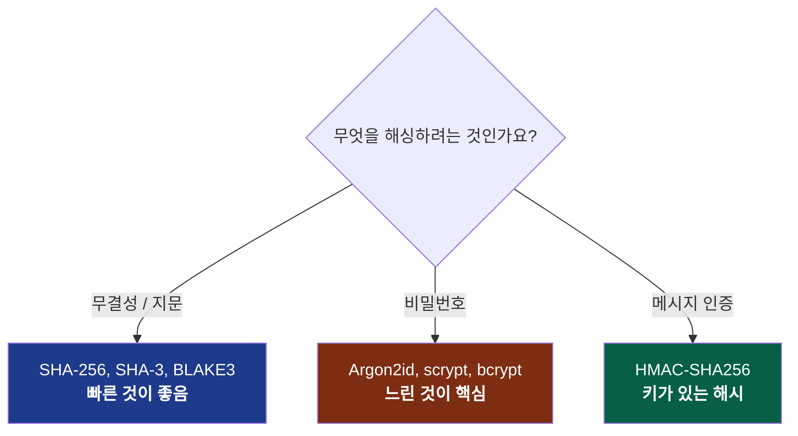
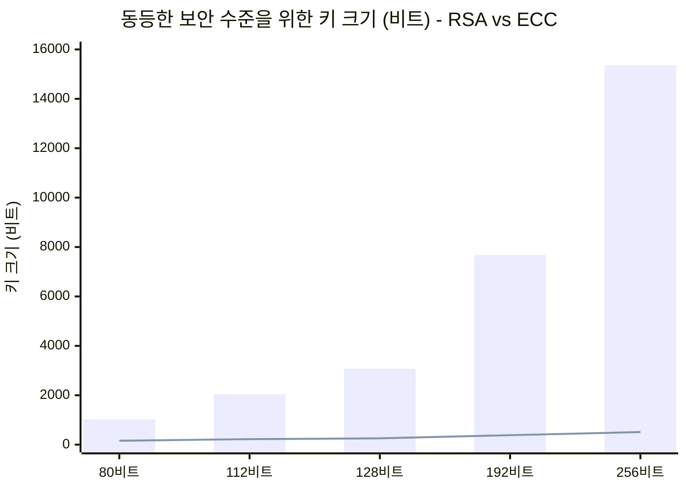
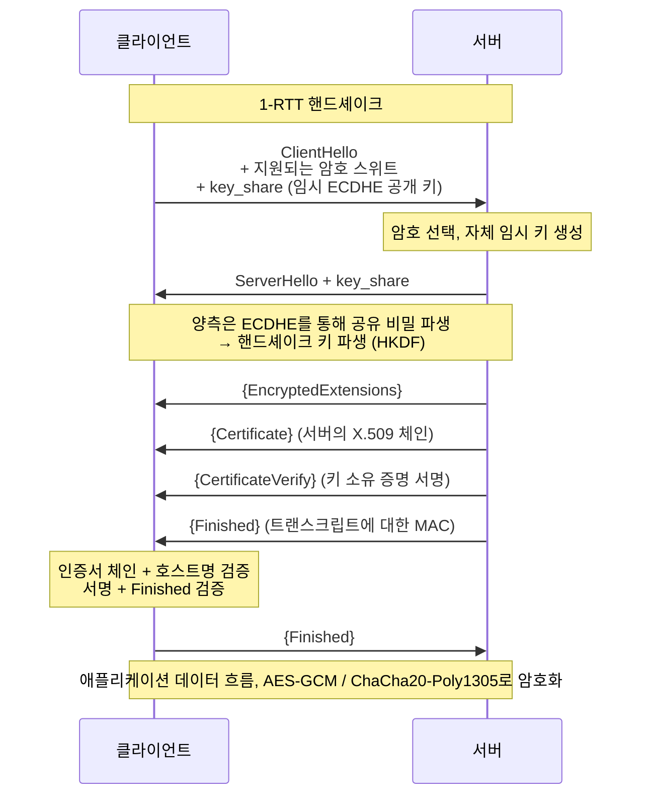
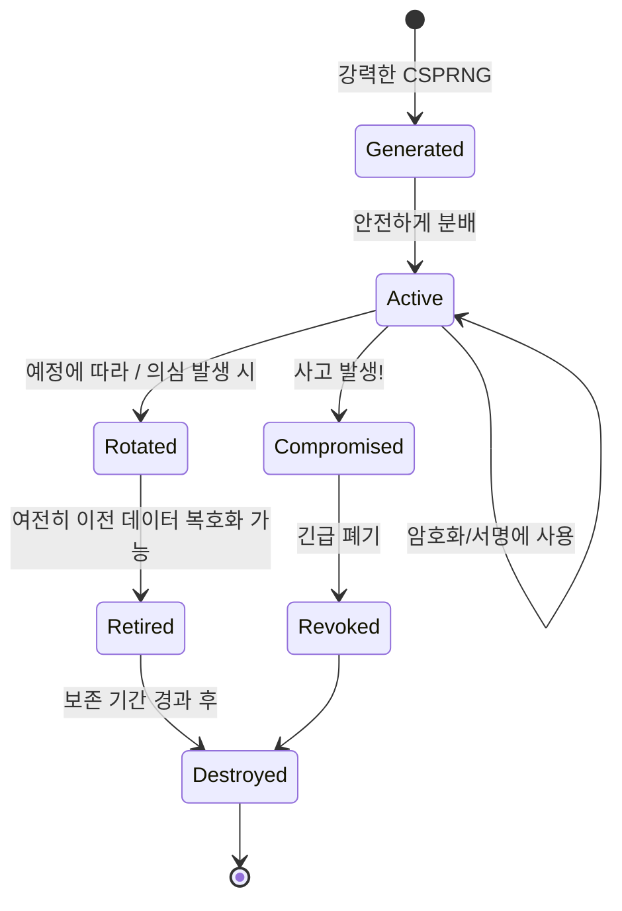
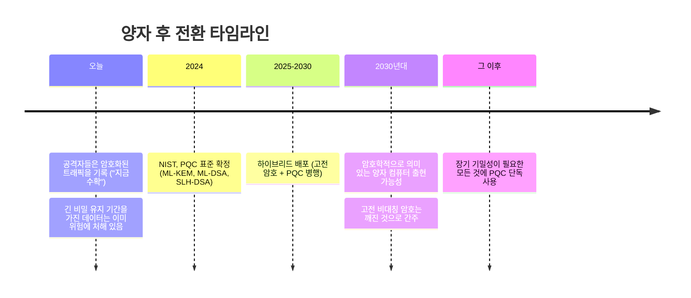
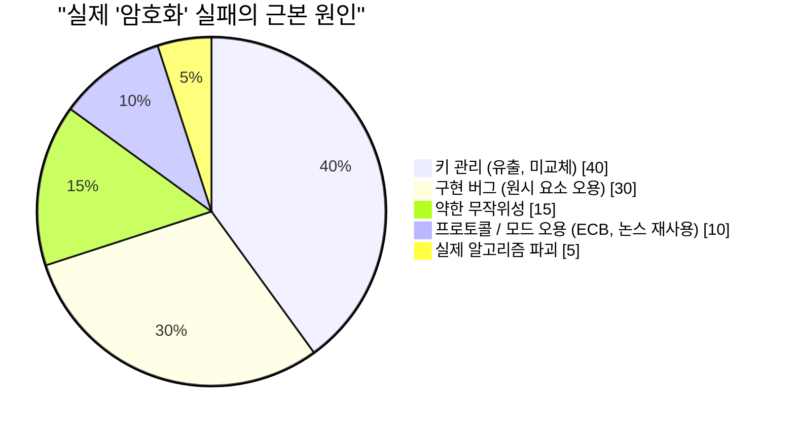

## 우리가 계속 닫아두었던 상자

이 시리즈는 지금까지 두 번이나 암호화에 의존하며 추상적으로 설명했습니다. [볼륨 I](/posts/secure_systems_architecture/)에서는 "TLS를 사용하라"고 했고, [볼륨 II](/posts/identity_and_access_in_depth/)에서는 "서명은 출처에 바인딩된다" 그리고 "Argon2id로 해시하라"고 말한 후 넘어갔습니다. 이 모든 문장 뒤에는 정교하고 섬세한 기계가 숨어 있었습니다.

이 볼륨에서는 그 상자를 엽니다.

목표는 여러분을 암호학자로 만드는 것이 아닙니다. 그 길은 수년간의 수학 공부와 자신의 영리함에 대한 건강한 두려움을 통해야 합니다. 목표는 여러분을 **암호학 *엔지니어***로 만드는 것입니다. 즉, 어떤 원시 요소(primitive)가 어떤 문제를 해결하는지, 왜 안전한 기본값이 안전한지, 그리고 무엇보다도 언제 치명적인 실수를 저지를지 알아차리는 방법을 아는 사람으로 만드는 것입니다.

:::important[첫 번째 계명]
**자신만의 암호화를 만들지 마십시오. 자신만의 원시 요소를 구현하지 마십시오.** 암호, 모드, 패딩, 난수 생성기 그 어떤 것도 직접 만들지 마십시오. 안전한 선택이 *기본* 선택이 되도록 검증된 고수준 라이브러리(libsodium, Tink, 플랫폼의 기본 암호화)를 사용하십시오. 이 볼륨의 모든 내용은 여러분이 그러한 라이브러리가 무엇을 하는지 이해하도록 돕기 위한 것이지, 직접 다시 만들라는 것이 아닙니다. 역사상 모든 치명적인 암호화 실패는 이 규칙이 자신에게는 해당되지 않는다고 생각한 엔지니어로부터 시작되었습니다. [^1]
:::

---

## 파트 I: 세 가지 목표와 이를 달성하는 원시 요소

실용적인 관점에서 모든 암호화는 다음 세 가지 목표 중 일부 조합을 달성합니다.

네 번째 목표인 **부인 방지** (나중에 서명했음을 부인할 수 없음)는 특히 디지털 서명에서 비롯되는 것이며, 대칭 암호가 제공할 수 *없는* 유일한 속성입니다. 왜냐하면 양 당사자가 키를 공유하므로 어느 쪽이든 태그를 생성할 수 있기 때문입니다.

### 챕터 1: 대칭 암호화 - 빠르고, 공유되며, 모드를 사용

대칭 암호화는 암호화와 복호화 모두에 **하나의 공유 키**를 사용합니다. 이는 *빠르지만* (하드웨어 가속 AES는 초당 기가바이트 속도로 실행됩니다) 한 가지 어려운 문제가 있습니다: **도청자가 보지 못하게 양 당사자가 어떻게 같은 키를 얻을 수 있을까요?** (파트 II에서 이에 답합니다.)

초보자를 좌절시키는 미묘한 차이는 **운용 모드(modes of operation)**입니다. AES와 같은 블록 암호는 고정된 16바이트 블록 하나를 암호화합니다. 실제 데이터를 암호화하려면 블록을 연결해야 하며, 이 연결 모드가 보안의 성패를 좌우합니다.

:::warning[ECB 펭귄 - 모드가 중요한 이유]
순진한 모드인 **ECB (전자 코드북)**는 각 블록을 독립적으로 암호화합니다. 동일한 평문 블록은 동일한 암호문 블록을 생성합니다. 리눅스 펭귄 비트맵을 ECB로 암호화하면 암호문에서 여전히 *펭귄을 볼 수 있습니다*. 윤곽선이 그대로 노출됩니다. ECB는 구조화된 데이터의 기밀성을 파괴합니다. 코드에서 `AES/ECB`를 발견하면 버그로 간주해야 합니다. [^2]
:::

현대적인 해결책은 **AEAD (Associated Data를 사용한 인증된 암호화)**입니다. 이는 기밀성 *과* 무결성을 하나의 원시 요소로 융합하여, 하나 없이는 다른 하나를 얻을 수 없게 합니다.

여러분이 사용해야 할 두 가지 AEAD 암호:

| 암호 | 강점 | 주의사항 |
| --- | --- | --- |
| **AES-256-GCM** | 모든 곳에서 하드웨어 가속(AES-NI), 널리 사용됨 | **논스 재사용은 치명적**, 동일 키에서 논스를 반복하면 인증 키와 평문 XOR가 유출됨 |
| **ChaCha20-Poly1305** | *소프트웨어*에서 빠름 (AES-NI 없는 모바일/IoT에 적합), 설계상 상수 시간 | 동일한 논스 고유성 요구사항 |

:::caution[논스는 비밀이 아니지만, 고유해야 합니다]
**논스** (number-used-once, 한 번만 사용되는 숫자)는 비밀일 필요가 없으며, 평문으로 전송됩니다. 그러나 특정 키 아래에서는 **절대 반복되어서는 안 됩니다**. GCM의 96비트 랜덤 논스를 사용할 경우, 하나의 키로 약 $2^{32}$개의 메시지 이후에는 생일 공격 경계 충돌이 실제 위험이 됩니다. 안전한 패턴: *카운터* 논스 사용(고유성 보장), 한계에 도달하기 훨씬 전에 키 교체, 또는 **AES-GCM-SIV**와 같은 논스 오용 방지 모드 사용. [^3]
:::

### 챕터 2: 해싱 - 일방통행 길

암호학적 해시는 임의의 입력을 고정 크기의 다이제스트로 매핑하며, 다음이 불가능하도록 설계됩니다: (a) 역변환, (b) 동일한 다이제스트를 갖는 두 입력 찾기 (**충돌 저항성**), (c) 주어진 다이제스트와 일치하는 입력 찾기 (**역상 저항성**).

사람들이 지속적으로 혼동하는 세 가지 용도이며, *다른* 함수가 필요합니다:

이것이 핵심입니다: **파일 무결성을 위해서는 가장 빠른 보안 해시를 원하고, 비밀번호를 위해서는 가장 느린 해시를 원합니다.** 비밀번호에 SHA-256을 사용하는 것은 취약점입니다 (GPU가 초당 수십억 개를 크랙); 파일 체크섬에 Argon2id를 사용하는 것은 단순히 불필요하게 느립니다. 같은 단어 "해시"이지만, 요구사항은 정반대입니다.

**MAC**은 키를 추가하여 비밀을 가진 사람만이 태그를 생성하거나 검증할 수 있도록 합니다. 이는 무결성 *및* 인증입니다. **HMAC**을 사용하고 항상 **상수 시간 비교**로 태그를 비교하십시오. 조기 종료하는 `==`는 공격자가 태그를 바이트 단위로 위조하는 데 사용할 수 있는 타이밍 정보를 유출합니다.

$$
\text{HMAC}(K, m) = H\big((K \oplus opad)\,\|\,H((K \oplus ipad)\,\|\,m)\big)
$$

이 이중 해싱 구조는 장식이 아니라, 그렇지 않으면 공격자가 순진하게 키를 적용한 `H(K \| m)` 구성에 데이터를 추가할 수 있게 만드는 **길이 확장 공격**을 방어합니다.

### 챕터 3: 비대칭 암호화 - 키 교환 문제 해결

비대칭(공개 키) 암호화는 **키 쌍**을 사용합니다: 자유롭게 공유하는 공개 키와 목숨을 걸고 보호하는 개인 키. 누구든지 여러분의 공개 키로 암호화할 수 있으며, 오직 여러분의 개인 키만이 복호화할 수 있습니다. 또는: 여러분은 개인 키로 서명하고, 누구든지 여러분의 공개 키로 검증할 수 있습니다.

*   **RSA** - 고전적인 방식. 보안은 큰 정수를 소인수분해하는 어려움에 기반합니다. 현재는 *크고 느리다*고 간주되며, 128비트 보안을 위해 3072비트 키를 사용합니다. 괜찮지만 부담스럽습니다.
*   **타원 곡선 암호화 (ECC)** - 비트당 더 어려운 타원 곡선 이산 로그 문제에 기반하기 때문에 훨씬 작은 키로 동일한 보안을 제공합니다. **256비트 ECC 키는 ≈ 3072비트 RSA 키**와 같습니다.

높은 보안 수준에서 막대 (RSA)와 선 (ECC) 사이의 큰 격차는 현대 프로토콜이 타원 곡선을 기본으로 사용하는 이유입니다: 서명에는 **Ed25519**, 키 교환에는 **X25519**를 사용하며, 둘 다 빠르고 작으며 오용하기 어렵게 설계되었습니다 [^4].

:::note[비대칭 암호화는 데이터를 직접 암호화하는 경우가 거의 없습니다]
공개 키 연산은 느리고 크기 제한이 있습니다. 실제로는 RSA로 파일을 직접 암호화하는 경우는 거의 없습니다. 비대칭 암호화를 사용하여 **대칭 키를 교환하거나 래핑한** 다음, 빠른 AEAD로 대량 데이터를 암호화합니다. 이것이 **하이브리드 암호화**이며, TLS, PGP, age 및 모든 합리적인 시스템이 실제로 수행하는 방식입니다.
:::

---

## 파트 II: 키 교환 및 TLS 1.3 핸드셰이크

이제 우리는 대칭 암호가 해결할 수 없었던 질문에 답할 수 있습니다: 공격자가 감시하는 연결을 통해 두 낯선 사람이 어떻게 공유 비밀에 합의할 수 있을까요?

### 챕터 4: 디피-헬만 및 전방향 비밀성

**디피-헬만 (DH)**은 이 모든 것의 핵심에 있는 아름다운 기법입니다. 양 당사자는 자신의 개인 비밀과 상대방의 공개 값을 혼합하고, 대수학 덕분에 *동일한* 공유 비밀에 도달합니다. 반면 두 공개 값을 모두 본 도청자는 이를 계산할 수 없습니다.

핵심적인 속성은 **(완벽한) 전방향 비밀성**입니다. 각 세션이 사용 후 폐기되는 *임시* DH 키 쌍 (ECDHE, 여기서 "E"는 임시를 의미)을 사용한다면, 공격자가 오늘 모든 암호화된 트래픽을 기록하고 *내년에 장기 개인 키를 훔친다 해도*, 기록된 세션을 복호화할 수 없습니다. 세션 키는 세션과 함께 소멸되기 때문입니다.

:::important[이제 전방향 비밀성을 타협할 수 없는 이유]
"지금 기록하고 나중에 복호화"는 실제적이고 자금 지원을 받는 공격자의 전략이며, 특히 양자 컴퓨터의 등장을 앞두고 있습니다 (챕터 7). 전방향 비밀성은 오늘날 캡처된 암호문이 서버 키가 유출되는 날 부채가 되지 않음을 의미합니다. TLS 1.3은 전방향 비밀성을 제공하는 ECDHE를 **필수**로 만들었으며, (전방향 비밀성이 없는) 이전의 정적 RSA 키 교환은 완전히 제거되었습니다. [^5]
:::

### 챕터 5: TLS 1.3 핸드셰이크, 실제 동작 방식

우리가 "TLS를 사용하라"고 계속 말했던 실제 핸드셰이크가 여기 있습니다. TLS 1.3은 왕복 횟수를 두 번에서 한 번으로 줄였고 모든 불안정한 옵션을 제거했습니다 [^5]:

모든 단계가 제자리를 차지하는 이유:

*   **`key_share`가 첫 메시지에 포함** - 클라이언트가 그룹을 *추측*하고 임시 키를 즉시 전송하며, 이것이 TLS 1.3이 왕복 시간을 절약하는 방법입니다.
*   **`Certificate` + `CertificateVerify`** - 인증서는 서버의 신원을 공개 키에 바인딩합니다 (볼륨 II의 PKI 체인을 통해); *서명*은 서버가 실제로 일치하는 개인 키를 소유하고 있음을 증명합니다. 개인 키 없는 도난된 인증서는 쓸모없습니다.
*   **`Finished`** - 전체 핸드셰이크 트랜스크립트에 대한 MAC. 만약 중간자 공격자가 *이전 메시지*를 변조했다면 (예: 강력한 암호화를 제거하는 다운그레이드 공격), 트랜스크립트가 일치하지 않아 핸드셰이크가 중단됩니다.

:::tip[TLS 1.3이 삭제한 것은 유지한 것만큼 중요합니다]
TLS 1.3은 RSA 키 교환, 정적 DH, CBC 모드 암호, RC4, MD5, SHA-1, 압축 (CRIME/BREACH 안녕), 그리고 재협상을 제거했습니다. 설계 철학: **조작할 수 있는 스위치가 적으면 침해를 유발하는 잘못된 설정의 가능성도 적다.** 안전하지 않은 옵션이 없는 프로토콜은 취약하게 조작될 수 없습니다. 모든 곳에서 TLS 1.0/1.1을 비활성화하고, 1.3을 선호하며, 레거시 클라이언트에 한해 1.2를 허용하십시오.
:::

---

## 파트 III: 키 관리 - 이론과 현실이 만나는 곳

응용 암호학의 불편한 진실: **알고리즘은 거의 약점이 아닙니다. 키 관리가 약점입니다.** AES-256은 한 번도 깨진 적이 없습니다. 하지만 키는 Git에 커밋되고, 로깅되고, 이메일로 전송되고, 하드코딩되며, 절대 교체되지 않습니다. 키의 수명 주기가 곧 규율입니다:

핵심적인 실천 사항:

::::steps

:::step[실제 CSPRNG에서 생성]{subtitle="탄생"}
키는 **암호학적으로 안전한** 난수 출처 (`/dev/urandom`, `getrandom()`, 플랫폼 CSPRNG)에서 생성되어야 합니다. `Math.random()`을 사용하지 말고, 타임스탬프를 시드로 사용하지 말며, "영리한" PRNG도 사용하지 마십시오. 예측 가능한 무작위성은 "깰 수 없는" 암호가 사소하게 깨지는 가장 흔한 근본 원인입니다.
:::

:::step[KMS 또는 HSM에 저장]{subtitle="보관"}
**하드웨어 보안 모듈 (HSM)** 또는 클라우드 **KMS**는 키가 평문으로 경계를 *절대 벗어나지 않도록* 저장하며, 서명/복호화를 위해 데이터를 *그곳으로* 보냅니다. 이는 공격자가 애플리케이션 서버를 소유하더라도 원시 키를 유출할 수 없음을 의미합니다.
:::

:::step[확장성을 위해 봉투 암호화 사용]{subtitle="구조"}
객체별 **데이터 암호화 키 (DEK)**로 데이터를 암호화하고, 각 DEK를 KMS에 보관된 중앙 **키 암호화 키 (KEK)**로 암호화합니다. 키를 교체하려면 페타바이트의 데이터가 아닌 작은 DEK만 재암호화하면 됩니다. 이것이 모든 주요 클라우드가 저장 데이터 암호화를 수행하는 방식입니다.
:::

:::step[키 교체, 그리고 *빠른* 교체 능력]{subtitle="유지보수"}
키 교체는 자동화되고 중단 없이 이루어져야 하며, 이전 키와 새 키가 전환 기간 동안 공존할 수 있도록 암호문에 키 ID를 태그해야 합니다. 몇 분 만에 키를 교체할 수 있는 조직은 유출 사고에서 살아남지만, 일주일이 걸리는 마이그레이션이 필요한 조직은 자체 아키텍처에 의해 인질로 잡히게 됩니다.
:::

::::

:::warning[역사적인 무작위성 실패 사례]
2008년 데비안 OpenSSL: 선의의 패치가 엔트로피 소스를 무력화하여 키 공간을 약 32,767가지 가능성으로 줄였고, 2년 동안 생성된 모든 SSH 및 TLS 키를 추측할 수 있었습니다. 2010년: 소니 PS3는 ECDSA 서명에서 고정된 논스를 재사용하여 마스터 서명 키를 유출했습니다. 이 패턴은 영원합니다: **암호화는 암호 자체에서가 아니라 무작위성과 재사용에서 실패합니다.** [^6]
:::

---

## 파트 IV: 양자 시대의 지평

이 볼륨의 모든 비대칭 원시 요소인 RSA, ECC, 디피-헬만은 충분히 큰 **양자 컴퓨터**가 **쇼어 알고리즘**을 실행하여 효율적으로 해결할 수 있는 수학적 문제(소인수분해, 이산 로그)에 기반합니다. 그러한 기계는 아직 존재하지 않습니다. 하지만 위협은 이미 여기에 있습니다.

### 챕터 7: 지금 수확하고, 나중에 복호화하라

양자 위협에서의 비대칭 분류:

*   **비대칭 암호화 (RSA, ECC, DH)** - 쇼어 알고리즘에 의해 *깨짐*. 이것이 긴급 상황입니다.
*   **대칭 암호화 (AES) 및 해시 (SHA-2/3)** - 그로버 알고리즘에 의해 *약화될 뿐*, 이는 사실상 보안 수준을 절반으로 줄입니다. 해결책은 간단합니다: **AES-256** (양자 후에도 128비트 보안 유지) 및 384비트 이상 해시를 사용하십시오. 대칭 암호화는 기본적으로 안전합니다.

2024년, NIST는 최초의 양자 후 알고리즘을 표준화했습니다 [^7]:

*   **ML-KEM** (Kyber) - 키 캡슐화, ECDH 키 교환의 대체제.
*   **ML-DSA** (Dilithium) 및 **SLH-DSA** (SPHINCS+) - 디지털 서명.

:::note[오늘날의 실용적인 접근법: 하이브리드]
아무도 하루아침에 PQC 단독으로 전환하지 않습니다. 새로운 알고리즘은 더 젊고 덜 검증되었습니다. 업계의 해답은 **하이브리드 키 교환**입니다: 고전적인 X25519 *와* ML-KEM을 함께 실행하여 두 공유 비밀을 모두 결합함으로써, *둘 다* 깨지지 않는 한 세션이 안전하도록 합니다. Chrome, Cloudflare 등은 이미 기본적으로 X25519+ML-KEM을 배포하고 있습니다. 10년 이상 기밀성이 요구되는 암호화를 조달한다면, **지금** 공급업체에 PQC 로드맵에 대해 문의하십시오. [^8]
:::

---

## 파트 V: 오명의 전당 - 엔지니어들이 좋은 암호화를 망가뜨리는 방법

알고리즘은 견고합니다. 하지만 실제 시스템이 어떻게 망가지는지, 여러분이 실제로 유발하거나 검토 중에 발견할 실패 사례에 대한 실용 안내서가 여기에 있습니다:

| 안티패턴 | 왜 치명적인가 | 해결책 |
| --- | --- | --- |
| **자신만의 암호화 개발** | 미묘한 세부 사항을 잘못 이해할 것이고; 공격자는 이를 놓치지 않을 것 | libsodium / Tink / 플랫폼 암호화 사용 |
| **ECB 모드** | 평문 구조를 노출 (펭귄 사례) | AEAD: AES-GCM / ChaCha20-Poly1305 |
| **논스 / IV 재사용** | GCM에서 치명적인 키/평문 유출 | 카운터 논스, 또는 AES-GCM-SIV |
| **약한 무작위성** | 예측 가능한 키 = 키가 없는 것과 같음 | CSPRNG만 사용, `Math.random()` 절대 금지 |
| **비밀번호에 SHA-256 사용** | GPU가 초당 수십억 개 크랙 | Argon2id / scrypt / bcrypt |
| **MAC/태그 비교에 `==` 사용** | 타이밍 사이드 채널이 태그 위조에 사용됨 | 상수 시간 비교 |
| **인증서 미검증** | `verify=False`가 MitM 문을 다시 열어줌 | 체인 + 호스트명 + 만료 검증 |
| **전방향 비밀성 없음** | 하나의 키 유출로 모든 기록 복호화 가능 | 임시 ECDHE (TLS 1.3) |
| **인증 없이 암호화** | 패딩 오라클 및 비트 플리핑 공격 | AEAD, 또는 암호화 후 MAC |

저 차트를 다시 읽어보십시오. **실제 알고리즘 파괴는 가장 작은 부분입니다.** "암호화 실패"의 95%는 엔지니어링 실패, 키 처리, 오용, 무작위성과 관련된 것이며, 이 모든 것은 *여러분*의 통제하에 있으며 이 볼륨의 규율에 의해 다루어집니다.

:::important[핵심 요점]
좋은 암호화는 수학을 아는 것에 관한 것이 아닙니다. 그것은 수학이 부과하는 **경계를 존중하는 것**에 관한 것입니다: 고유한 논스, 비밀 키, 실제 무작위성, 인증된 암호문, 검증된 인증서, 전방향 비밀성, 키 교체. 검증된 라이브러리로 이러한 경계를 제대로 지킨다면, 더 똑똑한 사람들이 수십 년간 강화한 원시 요소의 모든 강점을 물려받을 수 있습니다. 경계를 넘어서면 어떤 알고리즘도 당신을 구할 수 없습니다.
:::

---

## 결론 및 앞으로의 방향

이제 우리는 원시 요소로부터 신뢰를 구축했습니다: 비밀을 지키는 암호, 신원을 증명하는 서명, 적대적인 연결을 통해 이들을 묶어주는 핸드셰이크, 모든 것을 정직하게 유지하는 키 수명 주기, 그리고 이미 그림자를 드리우고 있는 양자 계산까지.

그러나 암호화, 신원, 네트워크 방화벽은 모두 *예방적* 통제입니다. 이것들은 공격자를 막아낼 수 있다고 가정합니다. **볼륨 IV**는 그 반대 전제, 즉 모든 노련한 방어자가 내면화하는 전제를 받아들입니다: *침해를 가정하라.* 우리는 블루 팀의 운영 현실, 탐지 엔지니어링, MITRE ATT&CK 프레임워크, 위협 헌팅, SIEM/SOAR 파이프라인, 그리고 예방이 실패할 경우, '언제'가 아니라 '만약'에 대비해 실행하는 사고 대응 및 포렌식 플레이북으로 넘어갑니다.

예방은 완전히 지킬 수 없는 약속입니다. 탐지는 그 약속을 깨뜨렸을 때 살아남는 방법입니다.

---

## 참고 자료

[^1]: [Latacora - Cryptographic Right Answers](https://www.latacora.com/blog/2018/04/03/cryptographic-right-answers/)
[^2]: [Filippo Valsorda / Wikipedia - Block cipher mode of operation (ECB penguin)](https://en.wikipedia.org/wiki/Block_cipher_mode_of_operation#Electronic_codebook_(ECB))
[^3]: [IETF - RFC 8452: AES-GCM-SIV Nonce Misuse-Resistant AEAD](https://datatracker.ietf.org/doc/html/rfc8452)
[^4]: [Bernstein, D. J. et al. - Ed25519 & Curve25519](https://ed25519.cr.yp.to/)
[^5]: [IETF - RFC 8446: The Transport Layer Security (TLS) Protocol Version 1.3](https://datatracker.ietf.org/doc/html/rfc8446)
[^6]: [Debian - DSA-1571-1 openssl predictable random number generator](https://www.debian.org/security/2008/dsa-1571)
[^7]: [NIST (2024) - Post-Quantum Cryptography Standards (FIPS 203/204/205)](https://csrc.nist.gov/projects/post-quantum-cryptography)
[^8]: [Cloudflare - The state of the post-quantum Internet](https://blog.cloudflare.com/pq-2024/)