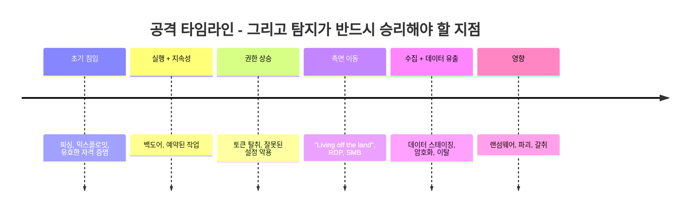
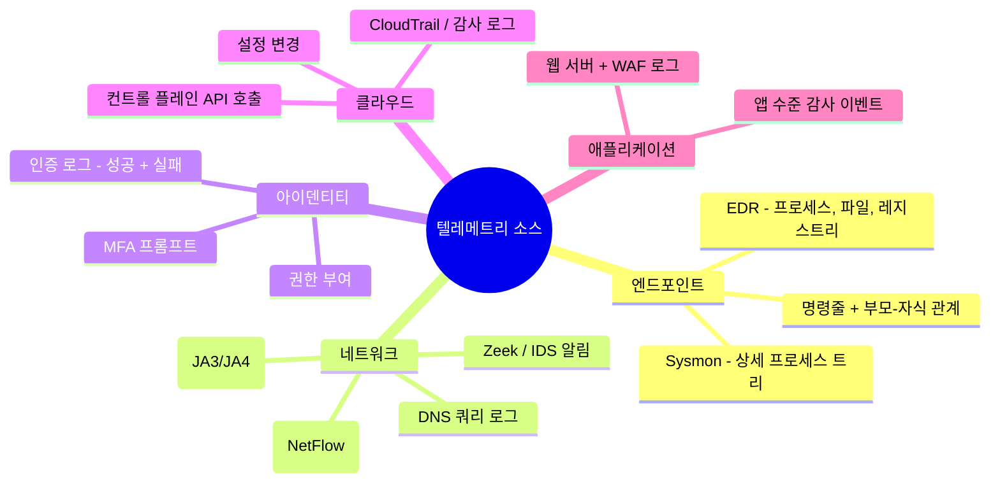
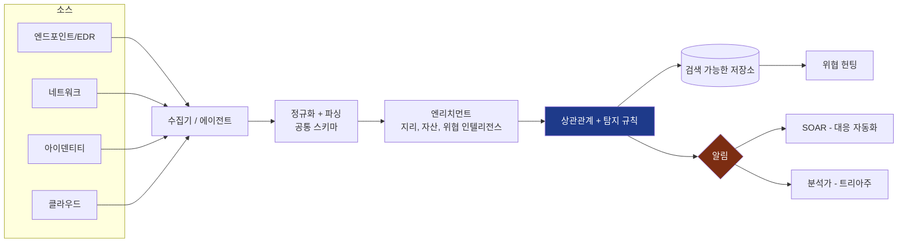
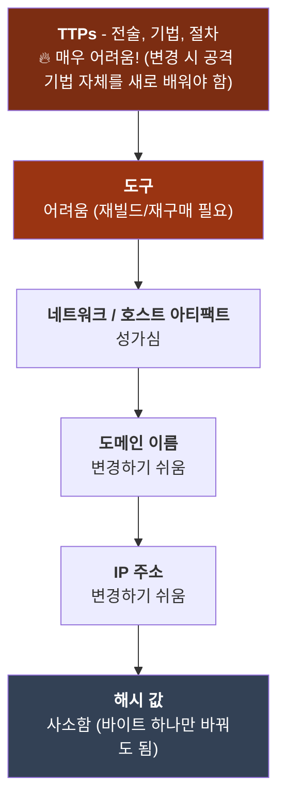
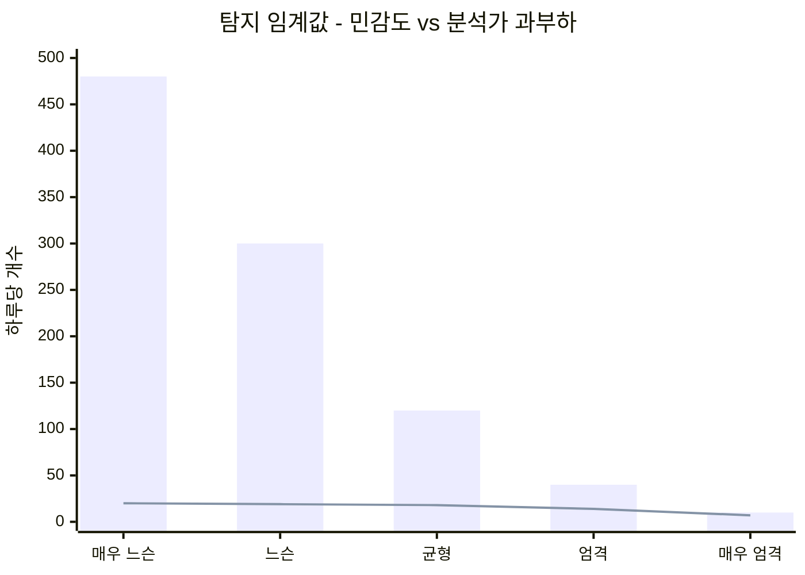
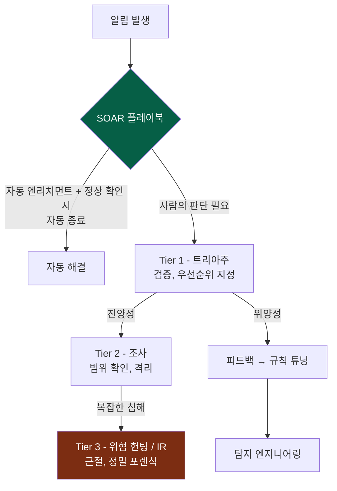
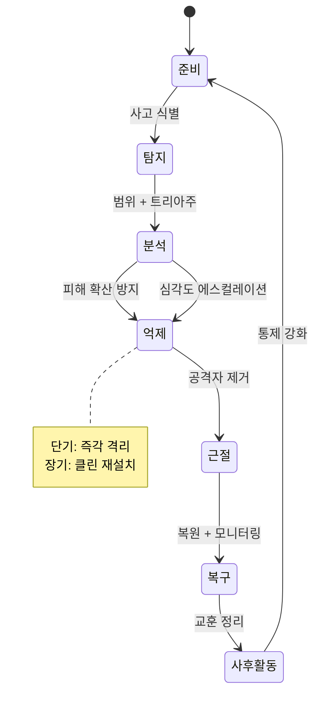
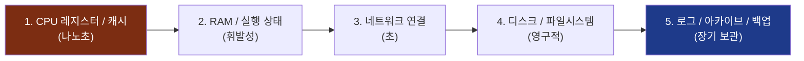
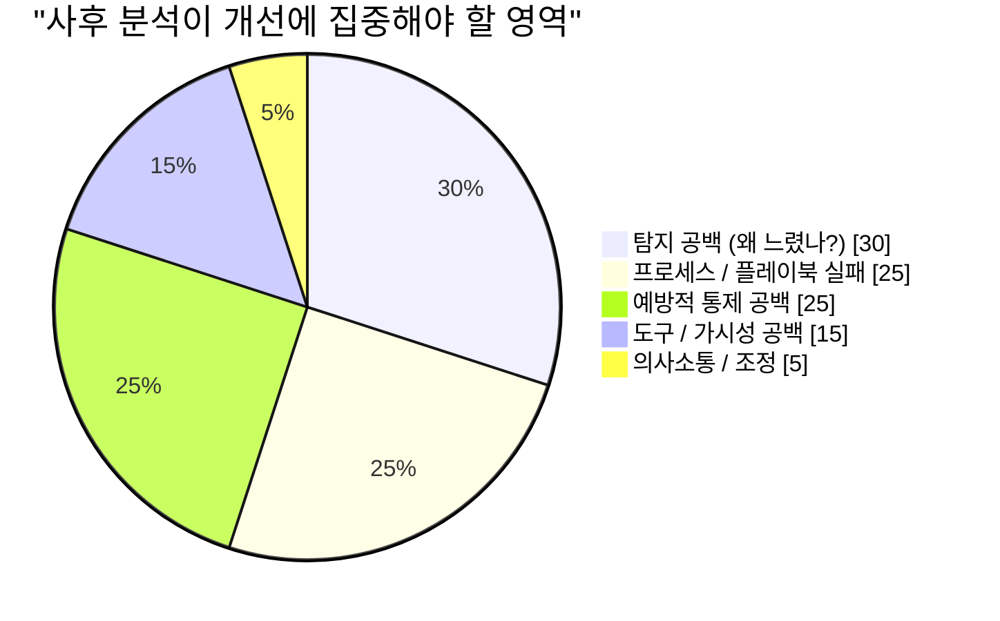
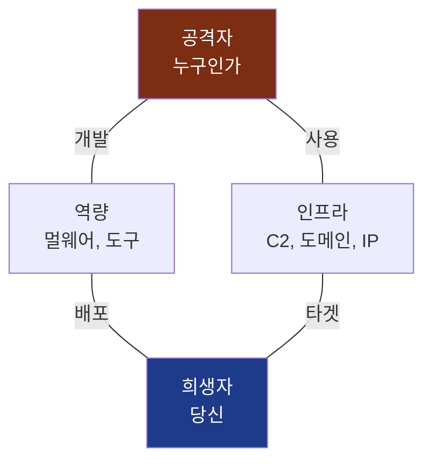

## 모든 것을 바꾸는 전제

앞선 세 권의 내용은 본질적으로 낙관적이었습니다. [1권](/posts/secure_systems_architecture/)은 벽을 세웠고, [2권](/posts/identity_and_access_in_depth/)은 모든 문에 경비원을 배치했으며, [3권](/posts/cryptography_engineering_in_depth/)은 그들 사이의 메시지를 위조 불가능하게 만들었습니다. 이 모든 것은 *예방적*이었으며, 공격자를 외부로 차단하는 것을 전제로 했습니다.

이번 권은 그 낙관론이 끝나는 지점에서 시작합니다. 모든 노련한 방어자가 가슴에 새기고 있는 바로 그 문장과 함께 말입니다.

> **침해를 가정하십시오(Assume breach).** 충분한 시간과 예산, 동기가 주어진다면 결의에 찬 공격자는 결국 침입합니다. 문제는 당신이 *침해당할 것인가*가 아니라, *얼마나 빨리 알아차리고 얼마나 잘 대응하는가*입니다.

업계는 이를 두 가지 냉혹한 수치로 측정합니다. **MTTD**(평균 탐지 시간)와 **MTTR**(평균 대응 시간)입니다. 최초 침해부터 탐지까지 걸리는 2024년 업계 평균 체류 시간(Dwell time)은 여전히 *수일에서 수주* 단위로 측정됩니다. 그 기간 동안 공격자는 측면 이동(Lateral movement)을 수행하고, 권한을 상승시키며, 데이터를 탈취합니다. 이번 권은 그 시간 간격을 줄이는 방법에 관한 것입니다.



탐지에서 줄이는 매 시간은 공격자가 가질 수 없는 타임라인의 일부가 됩니다. 블루 팀에 오신 것을 환영합니다.

---

## 파트 I: 텔레메트리 - 볼 수 없으면 탐지할 수 없다

탐지는 교묘한 분석 기술의 문제이기 이전에 데이터의 문제입니다. 증거가 수집되지 않았다면 그 어떤 알고리즘도 이를 복구할 수 없습니다. 따라서 블루 팀의 첫 번째 임무는 **가시성(Visibility)**입니다. 올바른 신호를 방출하도록 자산을 계측(Instrumentation)하는 것입니다.

### 1장: 진실의 원천



**방어자의 관점:** 모든 로그가 동일하게 중요하지는 않습니다. 가장 가치 있는 텔레메트리는 *행위*를 포착하는 종류이며, 특히 **부모-자식 관계를 포함한 프로세스 명령줄**(Sysmon Event ID 1)과 **인증 이벤트**가 중요합니다. 방화벽 로그는 연결이 발생했다는 사실을 알려주지만, 프로세스 트리는 `winword.exe`가 `powershell.exe`를 생성하고 다시 `cmd.exe`를 생성하여 인코딩된 명령을 실행했다는 '이야기'를 들려줍니다. 그리고 그 이야기가 바로 탐지의 핵심입니다.

:::important[로깅은 커버리지 문제입니다 - 매핑하십시오]
전형적인 실패 사례는 *침묵의 공백(Silent gaps)*입니다. 전체의 80%를 로깅하고 있지만 침해는 나머지 20%에서 발생하는 경우입니다. 소스 × 데이터 유형 × 보존 기간을 포함하는 **로깅 커버리지 매트릭스**를 유지하고, 공백을 곧 취약점으로 간주하십시오. 필요한 데이터가 수집되지 않았다면 탐지 규칙은 무용지물입니다. 패치 수준을 감사하듯 로깅 커버리지를 감사하십시오.
:::

### 2장: SIEM 파이프라인

**SIEM**(보안 정보 및 이벤트 관리)은 집계의 두뇌입니다. 위에서 언급한 모든 소스를 수집하고, 공통 스키마로 정규화하며, 소스 간 상관관계를 분석하고, 경고를 발생시킵니다. 현대적인 파이프라인은 다음과 같습니다:



**엔리치먼트(Enrichment)** 단계는 가장 가치 있는 작업입니다. IP 주소는 그 자체로는 노이즈에 불과하지만, 해당 IP가 Tor 출구 노드이며, 대상 자산이 도메인 컨트롤러이고, 해당 사용자가 평소와 다른 대륙에서 로그인했다는 정보를 알게 되는 순간 맥락(Context)이 형성됩니다. 엔리치먼트는 데이터를 *맥락*으로 바꾸며, 이 맥락이야말로 알림을 무시할 수 없는 행동 가능한(Actionable) 것으로 만듭니다.

---

## 파트 II: 탐지 엔지니어링

SIEM을 구매한다고 해서 피아노를 샀을 때 음악이 자동으로 연주되지 않는 것과 마찬가지로 탐지가 저절로 만들어지지는 않습니다. **탐지 엔지니어링**은 텔레메트리를 알림으로 변환하는 규칙을 작성, 테스트, 유지 관리하는 규율이며, 탐지 로직을 '코드'로 취급합니다.

### 3장: MITRE ATT&CK - 공통 언어

**MITRE ATT&CK**은 이 분야의 공유 지도입니다. 실제 침해 사고에서 관찰된 공격자의 **전술(Tactics)**(이유, 예: 지속성, 측면 이동)과 **기법(Techniques)**(방법, 예: T1053 예약된 작업)을 매트릭스로 정리한 것입니다 [^1]. 이는 레드 팀, 블루 팀, 위협 인텔리전스 팀이 동일한 언어로 소통할 수 있게 하는 로제타 스톤입니다.

방어자의 강력한 수단은 **커버리지 매핑**입니다. 자신의 탐지 규칙을 매트릭스 위에 오버레이하여 사각지대를 찾아내는 것입니다:

```mermaid
quadrantChart
    title 탐지 커버리지 vs 공격 기법 빈도
    x-axis 드물게 사용 --> 자주 사용
    y-axis 취약한 커버리지 --> 강력한 커버리지
    quadrant-1 잘 방어됨
    quadrant-2 과잉 투자
    quadrant-3 낮은 우선순위 공백
    quadrant-4 위험 - 흔하지만 탐지되지 않음
    피싱 (T1566): [0.9, 0.7]
    유효한 계정 (T1078): [0.85, 0.35]
    PowerShell (T1059): [0.8, 0.8]
    예약된 작업 (T1053): [0.5, 0.6]
    자격 증명 덤핑 (T1003): [0.7, 0.75]
    클라우드 API 악용 (T1078.004): [0.6, 0.25]
    Rundll32 프록시 (T1218): [0.3, 0.45]
```

4사분면, 즉 **흔히 사용되지만 커버리지가 약한 기법**이 우선순위 백로그가 되어야 합니다. 이것이 제한된 자원을 가진 작은 블루 팀이 노력할 곳입니다. 아무도 사용하지 않는 이국적인 기법을 쫓기 전에, 공격자가 실제로 수행하고 아직 우리가 포착하지 못하는 기법들을 방어하십시오.

### 4장: 고통의 피라미드 (Pyramid of Pain)

모든 탐지가 *공격자에게 얼마나 큰 고통을 주는지*에 따라 그 가치가 달라집니다. 데이비드 비앙코(David Bianco)의 **고통의 피라미드**는 지표를 공격자가 수정하기 어려운 정도에 따라 순위를 매깁니다 [^2]:



이 교훈은 전략을 재구성합니다. 파일 **해시**를 차단하면 만족스럽지만, 공격자는 즉시 재컴파일하여 몇 초 만에 이를 무력화합니다. 반면 "인터넷으로 연결을 시도하는 스크립팅 엔진을 생성하는 모든 오피스 앱"과 같은 **행위(Behavior)**를 탐지하면 공격자가 *기법 전체*를 포기하게 만듭니다. **지표뿐만 아니라 행위를 탐지하십시오.** 피라미드 상단에 가까운 탐지를 구축할수록 공격자가 이를 회피하는 데 더 많은 비용이 듭니다.

:::tip[탐지형 코드(Detection-as-code)]
탐지를 소프트웨어처럼 취급하십시오. 휴대 가능한 형식(**Sigma** 규칙)으로 작성하고, **git**에 저장하며, 코드 리뷰를 거치고, 악성 샘플 및 중요한 정상 활동과 대조하여 **테스트**하십시오(오탐율 측정). 오탐율이 40%인 탐지는 없는 것보다 나쁩니다. 분석가가 '무시' 버튼을 습관적으로 누르게 만들기 때문입니다. 프로덕션 코드와 마찬가지로 버전을 관리하고 테스트하고 폐기하십시오. [^3]
:::

### 5장: 신호와 노이즈의 전쟁

탐지의 영원한 긴장은 실제 공격을 잡아내는 것(진양성)과 분석가를 오탐으로 익사시키는 것 사이의 균형입니다:



막대는 전체 알림 수이고, 선은 *진양성(True Positive)*입니다. 너무 느슨하게(왼쪽) 설정하면 분석가는 20개의 실제 위협을 찾기 위해 480개의 알림을 처리해야 하며, 결국 번아웃되어 기계적으로 처리하게 됩니다. 너무 엄격하게(오른쪽) 설정하면 실제 공격을 놓칩니다. **알림 피로(Alert fatigue)는 단순한 인사 문제가 아니라 보안 통제 실패입니다.** 목표는 최대 알림 개수가 아니라 분석가 1인당 시간 대비 최대 *진양성*입니다. 이것이 바로 SOAR가 존재하는 이유입니다.

---

## 파트 III: SOC - 기계 속도로 대응하기

### 6장: 계층화된 운영과 SOAR

**SOC(보안 관제 센터)**는 알림 스트림 안에서 살아가는 팀이자 프로세스입니다. 전통적인 구조와 그 현대적인 자동화는 다음과 같습니다:



**SOAR**(보안 오케스트레이션, 자동화 및 대응)는 전력 증강 요소입니다. 플레이북을 실행하여 알림을 엔리치하고, 맥락을 수집하며, 심지어 인간의 개입 없이 즉각적인 대응(호스트 격리, 계정 비활성화, IP 차단)을 수행합니다. 잘 구축된 SOAR 파이프라인은 대부분의 저충실도(Low-fidelity) 노이즈를 자동으로 해결하여 인간이 판단력이 필요한 곳에 집중할 수 있게 합니다.

:::note[피드백 루프가 핵심입니다]
Tier 1에서 탐지 엔지니어링으로 향하는 화살표에 주목하십시오. 성숙한 SOC는 *학습하는 시스템*입니다. 모든 오탐은 규칙을 튜닝하고, 놓친 모든 탐지는 새로운 규칙이 됩니다. 알림에 대응하기만 하고 탐지 로직에 교훈을 피드백하지 않는 SOC는 제자리걸음을 하는 것과 같습니다.
:::

### 7장: 위협 헌팅 - 이미 침입했다고 가정하십시오

탐지는 규칙이 실행되기를 기다립니다. **위협 헌팅**은 정반대의 자세입니다. 규칙을 빠져나온 공격자가 이미 내부에 있다고 가정하고 텔레메트리를 선제적으로 검색하는 것입니다. 이는 *가설 주도형*입니다:

::::steps

:::step[가설 수립]{subtitle="어디에 숨어 있을까?"}
위협 인텔리전스나 ATT&CK에 근거합니다: *"공격자가 지속성을 확보했다면, 비관리자 계정이 업무 시간 외에 생성한 비정상적인 예약 작업이 있을 것이다."* 좋은 가설은 구체적이며 반증 가능해야 합니다.
:::

:::step[데이터 수집 및 분석]{subtitle="찾아보기"}
가설을 증명하거나 반증하기 위해 SIEM/EDR을 쿼리하십시오. 프로세스 계보, 네트워크 목적지, 인증 이상 징후를 중심으로 검토하십시오. 악의적인 요소의 존재뿐만 아니라 *정상적인 활동의 부재*를 찾는 것도 중요합니다.
:::

:::step[발견 혹은 개선]{subtitle="결과"}
무언가를 찾았다면 IR(사고 대응)로 에스컬레이션하고, 찾지 못했더라도 승리입니다. 아무것도 찾지 못한 헌팅은 방어 통제를 *검증*하고 정상적인 행위 패턴을 매핑한 것이기 때문입니다.
:::

:::step[발견 사항 운영화]{subtitle="자동화"}
헌팅을 통해 배운 내용은 *새로운 자동화 탐지*가 되어야 합니다. 그래야 다시는 동일한 일을 수작업으로 헌팅할 필요가 없습니다. 헌팅은 끊임없이 새로운 탐지 규칙으로 변환되어야 합니다.
:::

::::

:::caution[헌팅에는 베이스라인이 필요합니다]
*정상*을 모르면 *비정상*을 식별할 수 없습니다. 효과적인 헌팅은 베이스라인에 달려 있습니다. 이 환경에서 DNS, 인증, 프로세스 활동의 일반적인 하루는 어떤 모습인가요? 대부분의 조직이 자신의 정상적인 상태를 정의한 적이 없다는 사실을 공격자는 악용합니다. PowerShell이나 `certutil` 같은 내장 도구를 사용하는 "Living off the land" 기법이 효과적인 이유입니다. 당신이 읽는 법을 배우지 않은 통신 속에 숨어들기 때문입니다.
:::

---

## 파트 IV: 사고 발생 시 - 사고 대응 (IR)

결국 탐지가 심각한 실제 상황으로 판명되면, 이제 **사고 대응(Incident Response)** 프로세스를 실행합니다. 통제된 사고와 기업을 위협하는 침해 사고 사이의 차이는 대개 영웅적인 행동이 아니라 *압박 속에서의 준비와 규율*에서 옵니다.

### 8장: NIST IR 라이프사이클

NIST SP 800-61은 정형화된 루프를 정의합니다 [^4]:



엔지니어가 가장 자주 실수하는 단계는 **억제(Containment)**입니다. 두 가지 실패 유형이 있습니다:

* **너무 일찍 공격자에게 경고하기** - 공격자가 다른 10개의 호스트를 점유하고 있는 상황에서 하나만 차단하면, 우리가 눈치챘음을 알리는 꼴이 됩니다. 공격자는 모든 것을 파괴하거나 데이터 유출을 가속화할 것입니다. 때로는 *타격*하기 전에 *관찰*하며 범위를 파악하는 것이 필요합니다.
* **충분히 빠르게 억제하지 못하기** - 반대되는 실수로, 데이터가 빠져나가는 동안 신중하게 생각만 하는 경우입니다.

:::warning[필요한 증거를 파괴하지 마십시오]
당황하면 *지금 즉시 박스를 재이미징*하고 싶은 충동이 듭니다. 하지만 침해된 호스트에는 메모리 상주형 악성코드, 실행 중인 프로세스, 네트워크 연결 등 전원을 끄는 순간 사라지는 휘발성 증거가 담겨 있습니다. 가능하다면 **근절하기 전에 메모리와 디스크 이미지를 캡처하십시오.** 이들은 범위 확인("또 무엇을 건드렸는가?"), 법적/규제 의무 준수, 그리고 근절이 완전히 이루어졌는지 확인하는 데 필요합니다. 휘발성 순서가 중요합니다: 메모리 먼저, 그다음 디스크입니다. [^5]
:::

### 9장: 디지털 포렌식 - 진실 재구성

사고가 종료되었을 때(또는 법적 절차를 위해), **디지털 포렌식 및 사고 대응(DFIR)**은 정확히 무슨 일이 일어났는지 재구성합니다. 핵심 원칙은 **증거 보존 체인(Chain of custody)**과 **휘발성 순서(Order of volatility)**입니다. 증거는 가장 휘발성이 높은 것부터 낮은 순으로 수집되어야 하며, 모든 취급 단계가 기록되어야 합니다. 그렇지 않으면 법정에서 가치가 없거나 조사 범위를 신뢰할 수 없게 됩니다:



포렌식 분석가는 파일시스템 메타데이터(MFT, `$LogFile`), 메모리 덤프(Volatility), 윈도우 이벤트 로그, 프리페치 및 shimcache와 같은 아티팩트를 통해 수천 개의 타임스탬프를 엮어 *어떻게 들어왔고, 무엇을 했으며, 무엇을 가져갔는지*에 대한 일관된 이야기를 재구성합니다.

### 10장: 비난 없는 사후 분석(Blameless Postmortem)

가장 가치 있는 단계는 시간 압박 때문에 건너뛰기 쉬운 **교훈 정리**입니다. 이를 가능하게 하는 원칙은 **비난하지 않는 것**입니다. 분석은 개인을 타겟으로 하지 않고 *시스템과 프로세스*를 대상으로 해야 합니다. 사후 분석이 누군가를 탓하는 것으로 변질되는 순간, 사람들은 진실을 말하기를 멈추고 개선에 필요한 정보를 잃게 됩니다.



모든 사고는 비싼 수업료입니다. 보안 성숙도를 높이는 조직은 *교훈을 완전히 추출*하는 조직입니다. 각 침해는 그 원인이 된 공백을 영구적으로 닫고, 파트 II의 탐지 규칙으로 피드백되어야 합니다.

---

## 파트 V: 위협 인텔리전스 - 공격자 파악하기

누가 당신을 타겟으로 삼을 가능성이 높고 *어떻게 작동하는지* 알면 탐지와 대응은 극적으로 날카로워집니다. **사이버 위협 인텔리전스(CTI)**는 공격자에 대한 원시 데이터를 의사결정으로 바꾸는 규율이며, 세 가지 높이에서 작동합니다:

| 수준 | 대상 | 해결 질문 | 예시 |
| --- | --- | --- | --- |
| **전략적** | 경영진 / 이사회 | *누가 우리 산업을 타겟으로 하며, 왜?* | "랜섬웨어 그룹이 의료 청구 시스템을 집중 타겟팅함" |
| **운영적** | SOC 리더십 | *현재 활발한 캠페인과 TTP는?* | "해당 그룹은 스피어 피싱 → Cobalt Strike → 이중 협박 사용" |
| **전술적** | 분석가 / 도구 | *어떤 특정 지표를 차단/탐지할까?* | IOC, ATT&CK 기법 ID, YARA/Sigma 규칙 |

이를 연결하는 프레임워크는 **다이아몬드 모델**입니다. 모든 침해 이벤트는 네 개의 정점을 가지며, 이들 사이를 피벗(Pivot)하면 이해도가 확장됩니다:



하나의 C2 도메인(인프라)을 알면 동일한 등록자/패턴을 가진 다른 도메인으로 피벗할 수 있고, 멀웨어(역량)를 알면 공격자의 *다음* 캠페인을 잡는 YARA 규칙을 작성할 수 있습니다. CTI는 블루 팀이 수동적인 방어에서 벗어나 예측을 시작하게 만드는 열쇠입니다.

:::important[인텔리전스는 행동을 이끌어야 합니다, 그렇지 않으면 단순 정보일 뿐입니다]
아무런 규칙도 소비하지 않는 1만 개의 악성 IP 목록은 인텔리전스가 아니라 노이즈입니다. CTI의 시험은 폐쇄 루프에 있습니다: 탐지, 차단, 헌팅, 혹은 우선순위 설정 방식을 바꾸는가? 전술적 IOC를 SIEM 엔리치먼트로, 운영적 TTP를 ATT&CK 커버리지 매트릭스로, 전략적 평가를 위험 의사결정으로 전달하십시오. 통제(Control)에 도달하지 않는 인텔리전스는 아무도 읽지 않는 보고서일 뿐입니다.
:::

---

## 결론 및 향후 전망

우리는 이제 방어자의 전체 루프를 살펴보았습니다: **보기**(텔레메트리), **탐지**(행위 기반 엔지니어링 규칙), **대응**(SOC 및 IR 규율), **학습**(비난 없는 사후 분석), 그리고 **예측**(위협 인텔리전스). 예방은 실패한다는 것을 인정하고, 그 상황에서 생존하며 체류 시간을 수주에서 분 단위로 줄일 수 있는 근육을 길러왔습니다.

하지만 이 모든 것이 한꺼번에 더 어렵고 빠르게 변하는 영역이 있습니다. 바로 일회성 컨테이너, 선언적 인프라, 그리고 우리가 직접 작성하지 않은 수천 개의 오픈 소스 의존성으로 조립된 소프트웨어로 구성된 **클라우드 네이티브** 세상입니다. 여기서는 경계가 더욱 허물어지고, 워크로드는 몇 초 만에 사라지며, 가장 위험한 침해는 당신의 코드가 아니라 *공급망*, 오염된 의존성, 손상된 빌드 파이프라인, 유출된 CI 토큰을 통해 들어옵니다.

시리즈의 결말인 **5권**에서는 현대 클라우드 네이티브 및 DevSecOps 보안으로 시리즈를 마무리할 것입니다: 컨테이너 및 Kubernetes 강화, 인프라 코드(IaC) 스캔, CI/CD 파이프라인 보안, SBOM 및 SLSA, 그리고 차세대 보안의 핵심인 소프트웨어 공급망 보호까지, 이미 우리가 직면하고 있는 다음 10년의 정의적인 침해 사고들에 대해 다룹니다.

---

## 참고 문헌

[^1]: [MITRE - ATT&CK Framework](https://attack.mitre.org/)
[^2]: [David Bianco (2013) - The Pyramid of Pain](https://detect-respond.blogspot.com/2013/03/the-pyramid-of-pain.html)
[^3]: [SigmaHQ - Generic Signature Format for SIEM Systems](https://github.com/SigmaHQ/sigma)
[^4]: [NIST (2012) - SP 800-61 Rev. 2: Computer Security Incident Handling Guide](https://csrc.nist.gov/publications/detail/sp/800-61/rev-2/final)
[^5]: [IETF - RFC 3227: Guidelines for Evidence Collection and Archiving](https://datatracker.ietf.org/doc/html/rfc3227)