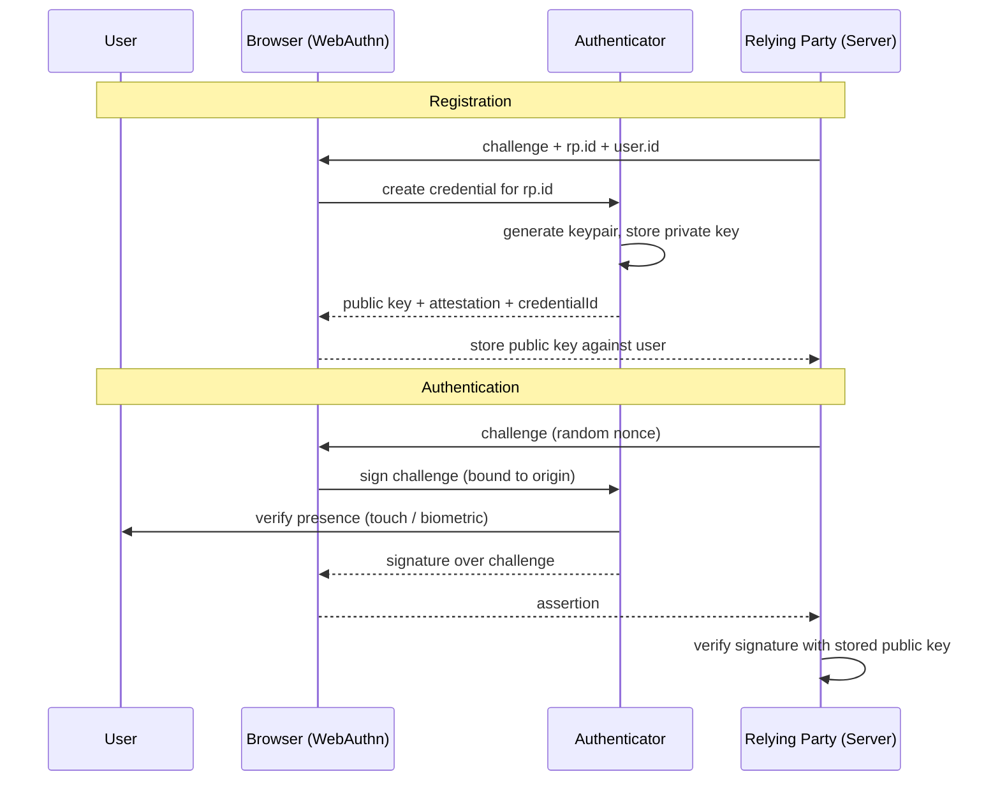
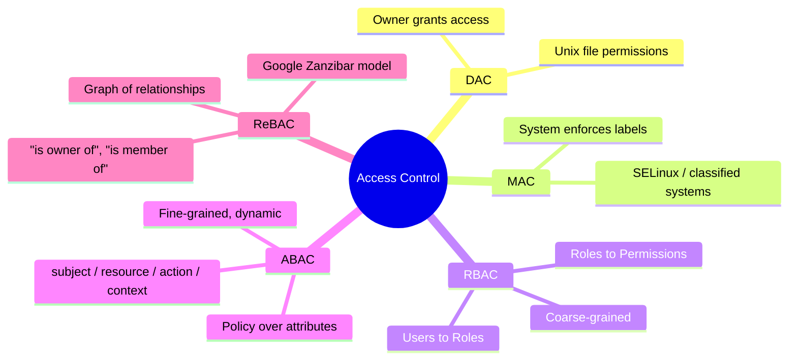
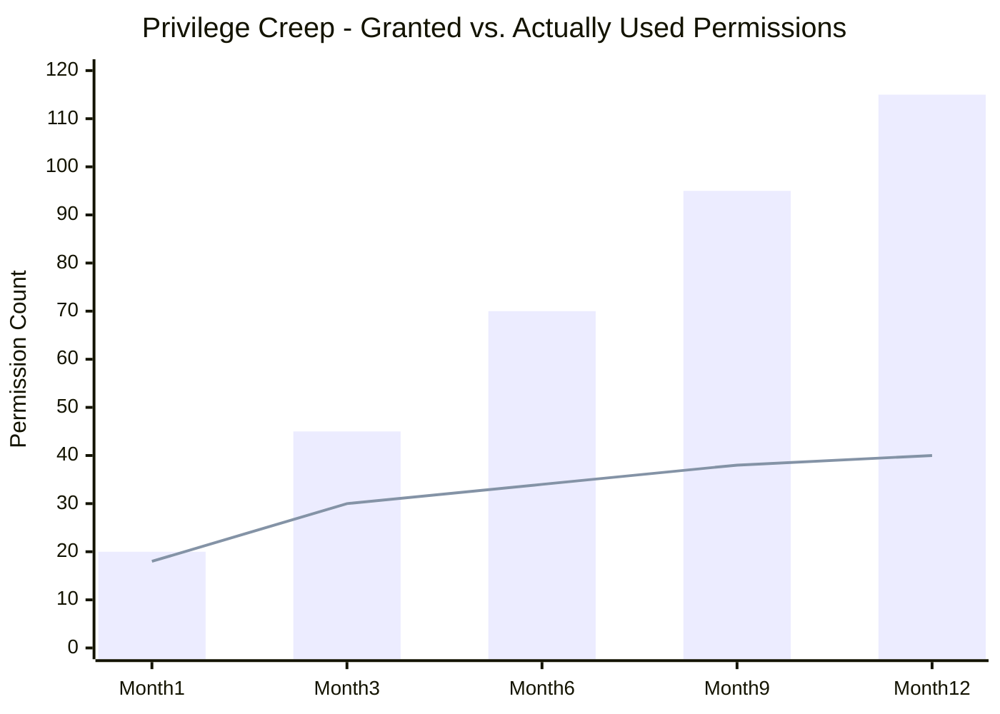
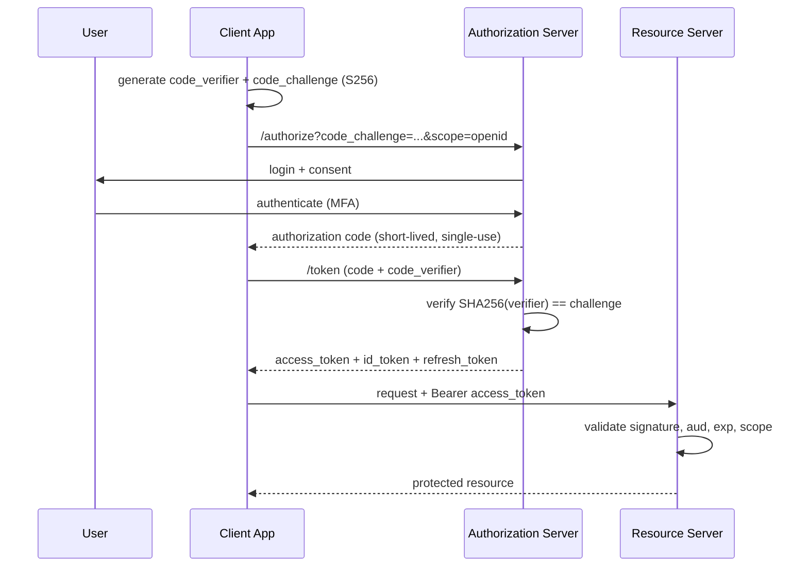
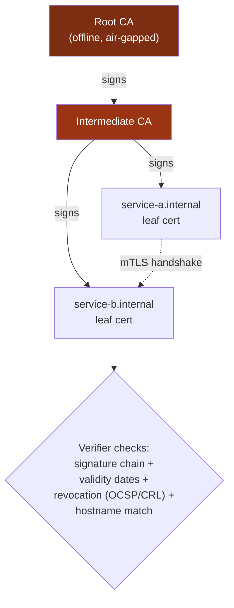
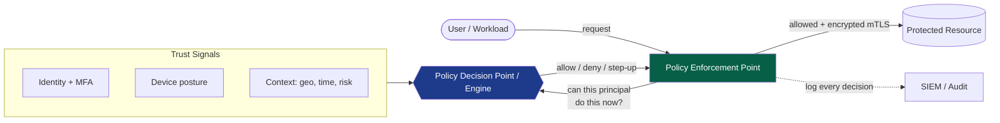
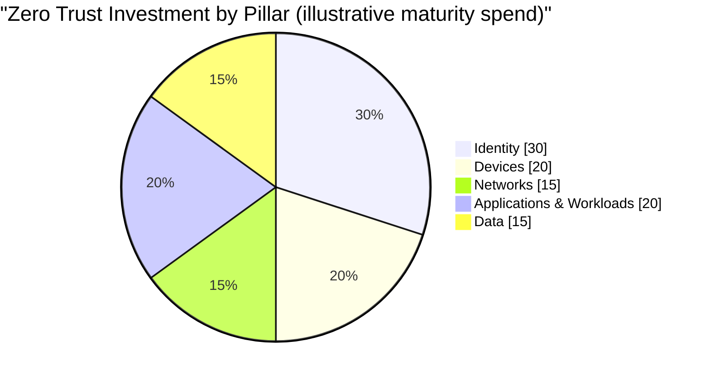

## 1권에서 이어지는 내용

[1권](/posts/secure_systems_architecture/)에서는 구리선에서 코드에 이르기까지 전체 스택을 네트워크 엔지니어, 방어자, 해커, 소프트웨어 엔지니어라는 네 가지 시각으로 살펴보았습니다. 우리는 네트워크 경계에 벽을 쌓고, 복도 곳곳에 IDS 센서를 배치했으며, 방화벽을 성문의 파수꾼으로 취급했습니다.

그런데 그 영역(Realm)이 해체되었습니다.

노트북은 집으로 향했고, 서버는 남의 데이터 센터로 이동했습니다. API는 공용 인터넷을 가로질러 다른 API를 호출하기 시작했습니다. "내부"는 *신뢰할 수 있음*을 의미하고 "외부"는 *적대적*임을 의미하던 깔끔한 성과 해자(Castle-and-moat) 모델은 더 이상 현실을 설명하지 못하게 되었습니다. 해자는 사라졌습니다. 남은 것은 사람, 서비스, 디바이스, 워크로드와 같은 주체(Principal)들의 집합뿐입니다. 각 주체는 무언가를 수행하고자 하며, 자신이 누구인지 그리고 무엇을 만질 수 있는지를 증명해야 합니다.

이것이 이번 권의 주제입니다. **ID는 새로운 경계**이며 [^1], 모든 요청은 국경을 넘는 과정과 같습니다.

:::note[이번 권의 핵심 관통 메시지]
인증은 *"당신은 누구입니까?"*에 답하고, 인가(Authorization)는 *"당신은 무엇을 할 수 있습니까?"*에 답합니다. 이 글에 나오는 다른 모든 개념(요소, 토큰, 세션, 정책 엔진, 키 자료 등)은 이 두 가지 질문에 대한 답을 **신뢰할 수 있고, 철회 가능하며, 감사 가능하도록** 기계적인 속도로 처리하기 위해 존재합니다.
:::

---

## 1부: 인증 - 당신이 누구인지 증명하기

### 1장: 세 가지 요소에 대한 재고

모든 인증 체계는 세 가지 고전적 요소와 두 가지 현대적 추가 요소를 결합한 형태입니다.

* **지식 기반(Something you know)** - 비밀번호, PIN, 암호 문구.
* **소유 기반(Something you have)** - 하드웨어 키, 휴대폰, 스마트 카드.
* **생체 기반(Something you are)** - 지문, 얼굴, 홍채.
* **위치 기반(Somewhere you are)** - 지리적 위치 / 네트워크 컨텍스트 (강력한 요소가 아닌 *컨텍스트* 신호).
* **행동 기반(Something you do)** - 행동 생체 인식: 타이핑 속도, 마우스 움직임 역학.

**해커의 관점:** 각 요소에는 고유한 공격 방식이 있습니다. 지식 기반은 *피싱*과 *크리덴셜 스프레이* 공격을 받습니다. 소유 기반은 *도난*되거나 *SIM 스왑*됩니다. 생체 기반은 *스푸핑*(위조 지문, 인쇄된 얼굴)되며, 결정적으로 **교체(Rotation)가 불가능**합니다. 한번 유출되면 평생 열 개의 지문만 사용할 수밖에 없습니다.

**방어자의 관점:** 다중 요소 인증(MFA)이 효과적인 이유는 공격자가 *서로 다른 종류의* 요소를 동시에 탈취해야 하기 때문입니다. 하지만 모든 MFA가 동일한 것은 아닙니다. 방어자가 놓치는 가장 중요한 뉘앙스는 다음과 같습니다.

```mermaid
quadrantChart
    title Phishing Resistance vs. User Friction of Auth Methods
    x-axis Low Friction --> High Friction
    y-axis Weak (Phishable) --> Strong (Phish-Resistant)
    quadrant-1 Gold Standard
    quadrant-2 Secure but Clunky
    quadrant-3 Legacy - Retire
    quadrant-4 Convenient but Risky
    Password only: [0.15, 0.08]
    SMS OTP: [0.35, 0.22]
    TOTP App: [0.45, 0.40]
    Push Approve: [0.25, 0.35]
    Passkey (FIDO2): [0.20, 0.92]
    Hardware Key: [0.55, 0.95]
```

차트가 주는 교훈: **SMS 기반 OTP는 MFA이지만, 취약한 MFA입니다.** 비밀번호 재사용은 막을 수 있지만, 실시간 피싱 프록시나 SIM 스왑은 막지 못합니다. 개인 키가 인증 기기를 절대 떠나지 않고 서명이 암호학적으로 기원(Origin)에 묶여 있는 **FIDO2 / WebAuthn** 자격 증명만이 진정으로 *피싱 저항성*을 가집니다 [^2].

:::warning[MFA 피로 공격은 실제 위협입니다]
2022년 여러 대규모 침해 사고에서 **푸시 폭탄(Push-bombing)**이 사용되었습니다. 공격자는 이미 비밀번호를 탈취한 상태에서 피해자가 짜증이나 혼란으로 인해 "승인"을 누를 때까지 승인 프롬프트를 계속 보냅니다. *숫자 일치(Number matching)*가 없는 푸시 기반 MFA는 보안 제어가 아니라 설계 결함입니다. 패스키(Passkey)를 선호하거나, 모든 프롬프트에 숫자 일치 및 컨텍스트(앱 이름, 위치) 확인을 강제하십시오. [^3]
:::

### 2장: 사라지지 않는 비밀번호

패스키의 미래가 도래하더라도 비밀번호 데이터베이스는 향후 10년간 존재할 것입니다. 이를 올바르게 저장하는 것은 협상의 여지가 없습니다.

규칙: **사용자가 입력한 것을 그대로 저장하지 마십시오.** 느리고, 솔트(Salt)가 포함된, 메모리 집약적인 해시를 저장하십시오.

$$
H = \text{Argon2id}(\text{password}, \text{salt}, m, t, p)
$$

여기서 $m$은 메모리 비용(KiB), $t$는 시간 비용(반복 횟수), $p$는 병렬 처리 수입니다. Argon2id는 메모리 집약성을 통해 GPU 크래킹을 방어하고, 하이브리드 데이터 액세스 패턴을 통해 사이드 채널 공격을 방어하므로 현재 OWASP에서 권장하는 기본값입니다 [^4].

왜 *느린* 해싱이 중요한지 공격자 경제학의 관점에서 설명하겠습니다. 공격자가 초당 $R$개의 해시를 계산할 수 있다면, 크기 $N$의 키 공간에서 비밀번호를 무작위로 추출하여 크래킹하는 데 평균적으로 걸리는 시간은 다음과 같습니다.

$$
t_{\text{crack}} = \frac{N}{2R}
$$

솔트가 없는 SHA-256과 같은 빠른 해시는 최신 GPU 장비로 초당 $R \approx 10^{11}$번의 추측이 가능합니다. 잘 튜닝된 Argon2id는 이를 $R \approx 10^{3}$ 수준으로 떨어뜨릴 수 있습니다. 이 8단계의 차이가 보안의 핵심입니다.

:::tip[비밀번호 저장 체크리스트]

1. Argon2id로 **해싱**하십시오(사용 불가 시 scrypt/bcrypt 사용).
2. 사용자별로 고유한 **솔트**를 사용하십시오(레인보우 테이블 방어).
3. 데이터베이스와 분리된 HSM/KMS에 저장되는 서버 측 **페퍼(Pepper)** 도입을 고려하십시오(DB 덤프 시 방어).
4. 비밀번호 길이를 지나치게 제한하거나 붙여넣기를 금지하지 마십시오. 둘 다 사용자들을 더 약한 비밀번호로 몰아넣습니다.
5. **유출된 데이터베이스(Breach corpora)**와 새로운 비밀번호를 대조하십시오(예: HaveIBeenPwned의 k-익명성 API) [^5].

:::

### 3장: 비밀번호 없는 시대의 종말 - WebAuthn 및 패스키

WebAuthn(브라우저 API)과 CTAP(인증 기기 프로토콜)는 함께 **FIDO2**를 형성합니다. 멘탈 모델은 다음과 같습니다:



마법은 한 줄에 있습니다: **서명은 기원(`rp.id`)에 고정되어 있습니다.** `paypa1.com` 같은 피싱 사이트는 브라우저가 승인하지 않기 때문에 `paypal.com`에 대한 유효한 서명을 생성할 수 없습니다. 이는 사용자의 경계심에 의존하지 않고 설계 단계에서부터 모든 자격 증명 피싱을 차단합니다 [^2].

**패스키**는 단순히 클라우드 키체인(Apple, Google, Microsoft 또는 비밀번호 관리자)에 동기화되는 *발견 가능(Discoverable)*한 FIDO2 자격 증명입니다. 동기화는 소비자들이 비밀번호 없이 인증을 사용할 수 있게 만든 인간공학적 돌파구입니다.

---

## 2부: 인가 - 무엇을 할 수 있는지 결정하기

인증은 쉬운 절반에 불과합니다. **인가가 바로 실제 시스템이 뚫리는 지점입니다.** OWASP Top 10은 *손상된 접근 제어(Broken Access Control)*를 인젝션이나 암호화 실패를 제치고 **#1** 웹 보안 위험으로 선정했습니다 [^6].

### 4장: 모델 - 역할에서 속성, 그리고 관계로



**RBAC(역할 기반)**은 대부분의 조직이 사용하는 방식입니다. 사용자는 역할을 가지고, 역할은 권한을 묶습니다. 이해와 감사가 쉽지만, "업무 시간 중 재무 프로젝트를 담당하는 EU 지역 편집자"와 같이 역할이 폭발적으로 늘어나면 누구도 전체 구조를 이해할 수 없게 됩니다.

**ABAC(속성 기반)**은 요청 시점에 속성을 기반으로 *정책*을 평가하여 이를 해결합니다:

```txt
# 간단한 ABAC 정책 (OPA / Rego 스타일)
allow if {
    input.subject.department == input.resource.owner_department
    input.action == "read"
    input.context.time_hour >= 9
    input.context.time_hour < 18
}
```

구글의 **Zanzibar** 논문 [^7]으로 유명해지고 OpenFGA, SpiceDB 등으로 오픈 소스화된 **ReBAC(관계 기반)**은 인가를 그래프로 모델링합니다: *"앨리스는 문서의 편집자다, 문서는 폴더 안에 있다, 밥은 폴더의 뷰어다 → 밥은 문서를 볼 수 있다."* 이는 공유 및 중첩 구조를 가진 SaaS 제품에서 흔히 발생하는 "사용자 X가 객체 Z에 대해 Y를 할 수 있는가?"를 체크하는 데 최적입니다.

:::important[IDOR 함정 - 인가에서 가장 흔한 상처]
**안전하지 않은 직접 객체 참조(IDOR, Insecure Direct Object Reference)**는 사용자를 인증했지만 *객체에 대한 인가를 확인하는 것을 잊었을 때* 발생합니다. 전형적인 사례:

```bash
GET /api/invoices/1043   ->  200 OK  (내 인보이스)
GET /api/invoices/1044   ->  200 OK  (남의 인보이스!)
```

해결책은 라이브러리가 아닌 훈련입니다: **모든 객체 조회는 요청 주체의 범위 내에서 이루어져야 합니다.** `SELECT * FROM invoices WHERE id = ?`는 절대 안 됩니다. 항상 `... WHERE id = ? AND owner_id = ?`를 사용하거나, 중앙 정책 엔진에서 확인을 수행하십시오. IDOR가 Broken Access Control이 OWASP 1위를 차지하는 이유 그 자체입니다 [^6].
:::

### 5장: 최소 권한 원칙의 정량화

최소 권한은 필요한 최소한의 권한을, 최소한의 시간 동안만 부여한다는 원칙입니다. 실제로는 권한이 계속 누적되며, 이를 **권한 크리프(Privilege Creep)**라고 합니다. 유용한 멘탈 메트릭은 *부여된 권한* 대비 *실제 사용된 권한*의 비율입니다:



막대(부여)와 선(사용) 사이의 격차는 **상시 공격 표면(Standing attack surface)**입니다. 계정이 탈취되는 순간 공격자가 상속받게 되며 아무도 모니터링하지 않는 권한입니다. 대응책:

* **JIT(Just-in-Time) 액세스:** 특정 시간 동안만 상승된 권한을 부여하고 자동으로 철회합니다.
* **액세스 검토 / 재인증:** 정기적으로 "이 권한이 아직 필요한가?" 캠페인을 수행합니다.
* **PAM(Privileged Access Management):** 관리자 자격 증명을 금고에 보관하고, 세션을 중계하며, 모든 행위를 기록합니다.

---

## 3부: 토큰, 세션 및 연합

### 6장: OAuth 2.0, OIDC 그리고 그 사이의 혼란

이 분야에서 가장 흔한 설계 오류는 **OAuth 2.0**(인가 - 위임된 액세스)과 **OpenID Connect**(인증 - ID 증명)를 혼동하는 것입니다. OIDC는 OAuth 2.0 *위에* 얹힌 얇은 ID 계층입니다 [^8].

* **OAuth 2.0**은 *"이 앱이 당신을 대신하여 자원 R에 액세스하도록 허용하시겠습니까?"*에 답하며 **액세스 토큰**을 발행합니다.
* **OIDC**는 *"이 사용자는 누구입니까?"*에 답하며 **ID 토큰**(사용자에 대한 클레임이 포함된 서명된 JWT)을 발행합니다.

SPA, 모바일, 웹 앱 모두를 위한 현대적인 권장 흐름은 **Authorization Code + PKCE**입니다:



**왜 PKCE(Proof Key for Code Exchange)인가?** 이것이 없다면, 인증 코드를 가로챈 공격자(같은 URI 스킴에 등록된 악성 앱 등)가 코드를 사용할 수 있습니다. PKCE는 정당한 클라이언트만 아는 비밀값(`code_verifier`)에 코드를 묶어두어, 도난당한 코드를 무용지물로 만듭니다. **OAuth 2.1**은 모든 클라이언트에 PKCE를 강제하고 위험한 *Implicit* 및 *Password* 그랜트 타입을 완전히 제거합니다 [^9].

:::caution[Implicit 흐름 사용 중단]
레거시 Implicit 그랜트는 브라우저에 `fetch`와 CORS가 없던 시절의 설계로, URL 프래그먼트에 토큰을 직접 반환했습니다. 토큰이 히스토리, 리퍼러, 로그로 유출되었습니다. 만약 튜토리얼에서 `response_type=token`을 사용하라 한다면 그 튜토리얼은 10년 전 방식입니다. 항상 Authorization Code + PKCE를 사용하십시오.
:::

### 7장: 세션 대 토큰 - 상태 유지/비상태 유지 트레이드오프

| 속성 | 서버 세션 (쿠키 → 세션 저장소) | 자체 포함 JWT |
| --- | --- | --- |
| 상태 | 서버가 세션 보유; 쿠키는 불투명 ID | 서버는 무상태; 토큰 *자체가* 상태 |
| 철회 | **즉시** - 세션 행 삭제 | **어려움** - `exp`까지 유효, 블랙리스트 필요 |
| 확장성 | 공유 저장소(Redis) 필요 | 수평 확장이 매우 쉬움 |
| 페이로드 | 작은 쿠키 | 모든 요청마다 큰 토큰 전송 |
| 적합한 경우 | 즉시 로그아웃이 필요한 클래식 웹 앱 | 서비스 간 통신, 단기 액세스 토큰 |

업계 표준 타협안: **단기 액세스 토큰(5~15분) + 장기 리프레시 토큰.** 액세스 토큰은 철회하지 않는 JWT(어차피 빨리 만료됨)로 두고, 리프레시 토큰은 서버 측에서 관리하며 철회 및 교체가 가능하게 합니다. 사용자를 차단해야 할 때는 액세스 토큰 만료 시간 내에 차단 처리가 완료됩니다.

:::warning[세 가지 JWT 함정]

1. **`alg: none`** - 과거 일부 라이브러리는 서명이 필요 없다고 *선언한* 토큰을 받아들였습니다. 서버 측에서 예상되는 알고리즘을 항상 고정(Pinning)하십시오. 헤더의 `alg`를 절대 신뢰하지 마십시오.
2. **HS256과 RS256 혼동** - 공격자가 공개 RSA 키를 HMAC 비밀 키로 사용하여 HS256 토큰을 서명할 수 있습니다. 알고리즘을 고정하십시오.
3. **`localStorage`에 JWT 저장** - XSS 페이로드로 쉽게 읽힙니다. 브라우저 세션에는 `HttpOnly`, `Secure`, `SameSite` 쿠키를 선호하십시오 [^10].

:::

### 8장: 연합(Federation) 및 SSO

**SSO(Single Sign-On)**를 통해 하나의 로그인으로 여러 애플리케이션을 사용할 수 있습니다. 두 가지 지배적인 프로토콜:

* **SAML 2.0** - XML 기반, 장황함, 기업 B2B 및 레거시 시스템에서 여전히 지배적.
* **OIDC** - JSON/JWT 기반, 새로운 애플리케이션, 모바일 및 API의 기본.

등장인물: **IdP(Identity Provider)**(Okta, Entra ID, Keycloak, Google 등)가 사용자를 인증하고 **SP(Service Provider)** / Relying Party에게 그 신원을 보증합니다. 가치는 중앙 집중화에 있습니다: MFA 강제, 퇴사자 계정 비활성화, 하나의 감사 로그.

:::note[프로비저닝 해제(Deprovisioning)가 가장 중요합니다]
SSO의 가장 큰 보안 이점은 **즉각적인 중앙 집중식 오프보딩**입니다. 가장 흔한 현실적인 실패는 방치된 계정입니다. 직원이 퇴사하고 인사팀이 SSO 계정을 닫았지만, 어딘가 잊혀진 서버의 로컬 관리자 계정은 살아있는 경우입니다. 모든 ID 소스를 인사 시스템과 대조하십시오. 사람이 소유하지 않은 계정은 공격자가 소유한 계정입니다.
:::

---

## 4부: 기계 ID 및 시크릿

인간은 전체의 일부일 뿐입니다. 현대 클라우드 환경에서는 **기계 ID가 인간 ID보다 45배 더 많습니다** [^11]. 모든 마이크로서비스, 함수, 컨테이너, CI 작업은 무언가에 인증해야 합니다.

### 9장: PKI와 신뢰의 사슬

기계 간 신뢰는 **X.509 인증서**와 PKI(Public Key Infrastructure)를 기반으로 합니다. 인증서는 공개 키를 ID에 묶고, 검증자가 신뢰하는 CA(인증 기관)의 서명을 받습니다.



루트의 개인 키는 가장 귀중한 자산으로, 탈취 시 모든 하위 신뢰가 깨지므로 **오프라인 및 에어갭(air-gapped)** 상태로 유지합니다. 중간 인증서(Intermediate)가 일상적인 서명을 수행하여 루트는 거의 사용되지 않습니다.

**mTLS(상호 TLS)**는 서비스 간 인증을 위한 PKI의 해답입니다: *양쪽 모두* 인증서를 제시하므로 서비스는 호출자와 피호출자 모두에게 자신의 ID를 증명합니다. 이것이 워크로드 간 제로 트러스트의 암호학적 근간입니다(Istio, Linkerd와 같은 서비스 메시가 **SPIFFE/SPIRE** ID를 통해 인증서 발행 및 교체를 자동화하는 이유입니다) [^12].

### 10장: 시크릿 관리

소프트웨어의 가장 오래된 죄악: 하드코딩된 시크릿.

```python
# 절대 사라지지 않는 취약점
DB_PASSWORD = "hunter2"          # 깃에 커밋되어 히스토리에 영원히 남음
API_KEY = "sk_live_a1b2c3d4..."  # 클라이언트 번들에 노출됨
```

Git은 *절대 잊지 않습니다*. 한 번 커밋되고 다음 커밋에서 "삭제"된 시크릿은 히스토리에 남아 있으며, 공개 푸시를 감시하는 봇들에 의해 초 단위로 긁어갑니다. 실천 지침:

::::steps

:::step[절대 시크릿을 커밋하지 마세요]{subtitle="예방"}
커밋 전 훅(`gitleaks`, `trufflehog`)을 사용하여 시크릿이 히스토리에 입력되기 전에 차단하십시오. CI에서 강제하여 로컬에서 우회할 수 없게 하십시오.
:::

:::step[시크릿 관리자에 중앙 집중화]{subtitle="저장"}
HashiCorp Vault, AWS Secrets Manager 또는 클라우드 KMS를 사용하십시오. 애플리케이션은 인증된 ID를 통해 런타임에 시크릿을 가져오며, 소스 제어나 이미지에 포함된 환경 파일에는 시크릿이 절대 포함되지 않아야 합니다.
:::

:::step[동적, 단기 시크릿을 선호하세요]{subtitle="교체"}
Vault는 한 시간 동안만 유효한 DB 자격 증명을 생성하고 만료 시 철회할 수 있습니다. 한 시간짜리 자격 증명 유출은 3년간 유효한 정적 자격 증명보다 훨씬 덜 위험합니다.
:::

:::step[일정 및 의심 시 교체하세요]{subtitle="대응"}
교체를 자동화하십시오. 시크릿이 노출되었을 *가능성*이 있다면 먼저 교체하고 나중에 조사하십시오. 교체는 지루하고, 클릭 한 번으로 무중단 작업이 되어야 합니다. 그렇지 않으면 절대 일어나지 않습니다.
:::

::::

:::tip[저장된 시크릿보다 워크로드 ID가 우월합니다]
가장 좋은 시크릿은 저장하지 않는 시크릿입니다. **워크로드 ID 연합**(AWS IAM 역할, GCP 워크로드 ID, OIDC 연합 CI 러너)을 사용하면 워크로드는 탈취될 키 없이도 자신의 정체성을 증명하여 단기 자격 증명을 얻을 수 있습니다. 여전히 정적 클라우드 키를 CI에 붙여넣고 있다면, 이것이 가장 강력한 업그레이드입니다.
:::

---

## 5부: 종합 - 제로 트러스트 아키텍처 구축

이제 NIST가 **SP 800-207**에서 정립한 모델인 **제로 트러스트**로 모든 것을 모아보겠습니다 [^13]. 이 모델이 성과 해자 모델을 대체하는 근본적인 가정은 단 한 문장입니다:

> **절대 신뢰하지 말고, 항상 검증하십시오.** 네트워크는 적대적이라고 가정합니다. 위치는 아무런 권한을 부여하지 않습니다. 모든 요청은 매번 그 자체로 인증되고, 인가되며, 암호화됩니다.

이 참조 아키텍처에는 정책을 평가하는 **PDP(Policy Decision Point)**와 데이터 경로 곳곳에 배치되어 PDP에 묻고 판결을 강제하는 **PEP(Policy Enforcement Point)**가 있습니다:



성숙한 제로 트러스트 프로그램이 다루는 5가지 기둥(CISA 제로 트러스트 성숙도 모델 기준) [^14]:



**ID가 가장 큰 비중을 차지하는 것**은 우연이 아닙니다. 네트워크가 신뢰를 제공하지 못하게 되면, ID가 1차적인 제어 평면이 됩니다. 이 글에서 다룬 모든 것(요소, 토큰, 정책 엔진, 기계 ID 등)은 그 제어 평면을 신뢰할 수 있게 만드는 데 기여합니다.

:::important[제로 트러스트는 제품이 아닌 여정입니다]
어떤 벤더도 "제로 트러스트 박스"를 판매하지 않습니다. 이는 점진적으로 적용되는 *아키텍처*이자 *운영 원칙*입니다. 가장 중요한 앱에 피싱 저항성 MFA를 적용하는 것부터 시작해 디바이스 상태 체크를 추가하고, 마이크로세그멘테이션을 수행한 뒤 워크로드로 확장하십시오. 성숙도는 장비 구매 비용이 아니라, 암묵적인 신뢰를 얼마나 제거했느냐로 측정됩니다.
:::

---

## 결론 및 향후 계획

1권에서는 물리적인 장소를 방어했습니다. 이번 권에서는 어디에 있든 상관없이 *주체(Principal)*를 방어했습니다. 우리는 벽을 모든 문마다 던지는 질문으로 대체했습니다: *당신이 누구인지 증명하고, 무엇을 할 수 있는지 증명하라.*

하지만 이 글의 모든 주장, 토큰 서명, mTLS 핸드쉐이크, 해시된 비밀번호는 지금까지 "그냥 작동하는" 마법의 상자로 취급해 온 암호학에 기반합니다. **3권**에서는 그 상자를 열어보겠습니다. 대칭 및 비대칭 암호, 실제 TLS 1.3 핸드쉐이크, 키 교환 및 포워드 시크릿, 양자 암호화에 대한 위협, 그리고 엔지니어가 이를 재앙적으로 잘못 구현하는 수많은 방법까지 바닥부터 primitives를 쌓아 올릴 것입니다.

방금 신뢰하는 법을 배운 그 ID는, 그것에 서명하는 수학만큼만 강력합니다.

---

## 참고 문헌

[^1]: [Microsoft (2021) - Identity is the new security perimeter](https://www.microsoft.com/en-us/security/business/security-101/what-is-identity-access-management-iam)
[^2]: [FIDO Alliance - How FIDO Works](https://fidoalliance.org/how-fido-works/)
[^3]: [CISA (2022) - Implementing Phishing-Resistant MFA](https://www.cisa.gov/sites/default/files/publications/fact-sheet-implementing-phishing-resistant-mfa-508c.pdf)
[^4]: [OWASP - Password Storage Cheat Sheet](https://cheatsheetseries.owasp.org/cheatsheets/Password_Storage_Cheat_Sheet.html)
[^5]: [Troy Hunt - Have I Been Pwned: Pwned Passwords (k-Anonymity)](https://haveibeenpwned.com/API/v3#PwnedPasswords)
[^6]: [OWASP - A01:2021 Broken Access Control](https://owasp.org/Top10/A01_2021-Broken_Access_Control/)
[^7]: [Google (2019) - Zanzibar: Google's Consistent, Global Authorization System](https://research.google/pubs/pub48190/)
[^8]: [OpenID Foundation - What is OpenID Connect](https://openid.net/developers/how-connect-works/)
[^9]: [IETF - OAuth 2.1 Authorization Framework (draft)](https://datatracker.ietf.org/doc/html/draft-ietf-oauth-v2-1)
[^10]: [OWASP - JSON Web Token Cheat Sheet](https://cheatsheetseries.owasp.org/cheatsheets/JSON_Web_Token_for_Java_Cheat_Sheet.html)
[^11]: [CyberArk (2023) - Identity Security Threat Landscape Report](https://www.cyberark.com/threat-landscape/)
[^12]: [SPIFFE - Secure Production Identity Framework For Everyone](https://spiffe.io/docs/latest/spiffe-about/overview/)
[^13]: [NIST (2020) - SP 800-207: Zero Trust Architecture](https://csrc.nist.gov/publications/detail/sp/800-207/final)
[^14]: [CISA - Zero Trust Maturity Model v2.0](https://www.cisa.gov/zero-trust-maturity-model)