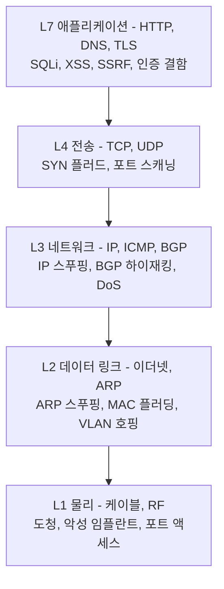
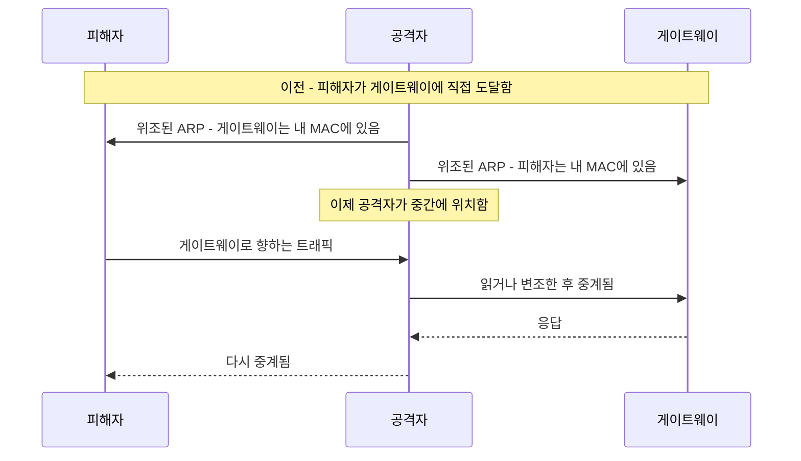
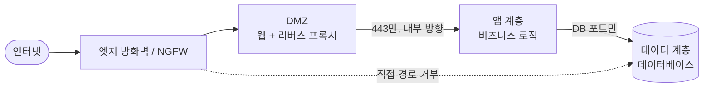
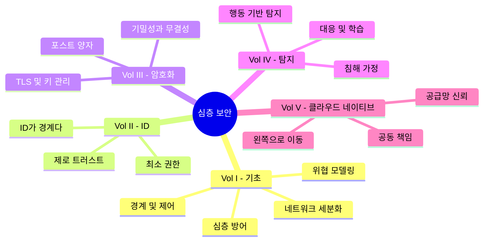
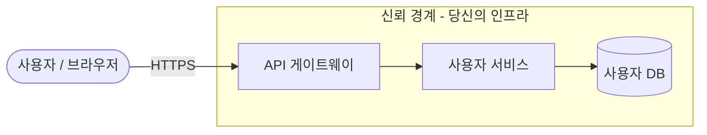
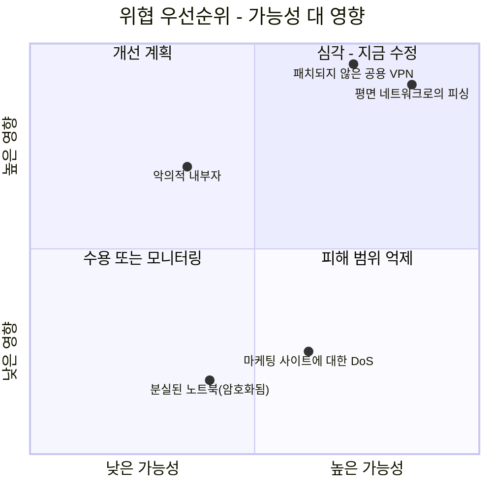
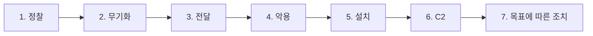
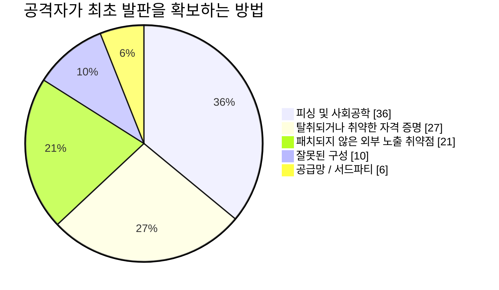
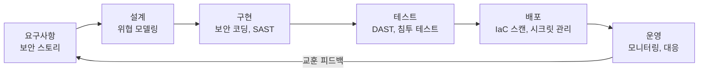
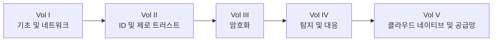

## 시리즈가 시작되는 곳

이 글은 **보안 아키텍처(Security Architecture)**를 다루는 다섯 권짜리 여정의 첫 번째 권입니다. 이 시리즈에서 우리는 구리선에서 컨테이너에 이르기까지 전체 스택을 훑어볼 것이며, 그 지도는 다음과 같습니다:

* **1권(이 글)** - 기초: 공격 표면으로서의 네트워크, 방어 가능한 설계, 심층 방어, 위협 모델링, 그리고 공격자의 방법론.
* **2권** - [ID, 액세스 및 제로 트러스트의 최전선](/posts/identity_and_access_in_depth/): 경계가 사라질 때, ID가 새로운 경계가 됩니다.
* **3권** - [암호화 엔지니어링](/posts/cryptography_engineering_in_depth/): 그 모든 것을 신뢰할 수 있게 만드는 기본 요소(Primitive)들.
* **4권** - [탐지, 대응 및 위협 인텔리전스](/posts/detection_and_response_in_depth/): 예방이 실패했을 때 해야 할 일.
* **5권** - [클라우드 네이티브 및 공급망 보안](/posts/cloud_native_and_supply_chain_security_in_depth/): 일시적인 것을 보호하고, 배포하는 것을 증명하기.

이 가이드가 다른 점은 그 방법론에 있습니다. 모든 주제는 **네 쌍의 눈**을 통해 검토됩니다. 실제 시스템은 언제나 네 종류의 엔지니어가 동시에 논쟁을 벌이는 대상이기 때문입니다:

* 기초를 구축하는 **네트워크 엔지니어**.
* 그것을 보호해야 하는 **방어자**.
* 그것을 깨뜨리려는 **해커**.
* 그 위에서 실행되는 코드를 작성하는 **소프트웨어 엔지니어**.

:::note[시리즈 전체의 핵심 논지]
어떤 단일 제어도 신뢰할 수 없습니다. 방화벽은 실패하고, 자격 증명은 유출되며, 코드에는 버그가 있고, 종속성은 오염됩니다. 따라서 보안은 구매하는 제품이 아니라 **엔지니어링하는 속성(Property)**입니다. 각 계층은 그 앞의 계층이 이미 실패했다고 가정합니다. 이번 권은 가장 바깥쪽 계층과 그 사고방식을 구축합니다. 시리즈의 나머지는 안쪽으로 파고듭니다.
:::

---

## 1부: 네트워크가 곧 영토다

데이터 통신은 네트워크에서 시작되며, 공격도 마찬가지입니다. OSI나 TCP/IP 모델을 피상적으로 읽는 것으로는 충분하지 않습니다 [^1]. 보안 전문가는 각 계층을 두 번 읽습니다. 한 번은 그 계층이 *무엇을 하는지*, 또 한 번은 그것이 어떻게 *역이용될 수 있는지*를 위해서.

### 1장: 보안 렌즈를 통해 본 스택

모든 계층은 고유한 공격과 고유한 방어를 지닙니다. 아래로 내려갈수록 침해는 더 물리적이고 절대적입니다.

**계층 1 - 물리.** 케이블, 광섬유, 스위치의 세계입니다. 해커에게 이 계층은 *접근만 가능하다면* 궁극의 벡터입니다. 암호화되지 않은 회선에 설치한 네트워크 탭 [^2], 지속적인 명령 및 제어(C2) 발판으로 방화벽 뒤에 남겨둔 값싼 임플란트, 혹은 단순히 로비의 살아있는 잭에 꽂은 노트북 등입니다. 방어자의 답은 절차적이고 물리적입니다. 잠긴 방, 비활성화된 포트, 변조 방지 봉인 등이며, 기술적으로는 **IEEE 802.1X** 네트워크 액세스 제어가 이를 뒷받침합니다. 이는 물리적으로 연결되는 모든 장치가 단 하나의 사용 가능한 프레임을 얻기 전에 인증을 강제합니다 [^3].

**계층 2 - 데이터 링크.** MAC 주소, 스위치, 그리고 IP를 MAC에 매핑하며 암묵적 신뢰를 전제로 설계된 프로토콜인 **ARP** [^4]. 바로 그 신뢰가 취약점입니다:

이것이 **ARP 스푸핑**이며, 공격자에게 로컬 세그먼트에서의 중간자(Man-in-the-Middle) 위치를 넘겨줍니다 [^5]. 그 사촌 격 공격으로는 **MAC 플러딩**(스위치의 CAM 테이블이 페일오픈되어 허브처럼 모든 것을 브로드캐스트할 때까지 넘치게 만드는 것 [^6])과 **VLAN 호핑**(잘못 구성된 트렁크 포트를 통해 자신의 VLAN을 탈출하는 것 [^7])이 있습니다. 여기서 방어자의 도구는 스위치 위생입니다: 포트별로 MAC을 고정하는 **포트 보안** [^8], 불량 DHCP 서버를 차단하는 **DHCP 스누핑**, 그리고 신뢰할 수 있는 바인딩 테이블에 대해 위조된 ARP를 폐기하는 **동적 ARP 검사(Dynamic ARP Inspection)**.

**계층 3 - 네트워크.** IP 주소와 라우팅. **IP 스푸핑**은 소스 주소를 위조하며, 고전적인 스머프 공격 같은 반사형 DoS의 엔진입니다 [^9]. **BGP 하이재킹**은 인터넷의 라우팅 테이블을 오염시켜 트래픽을 통째로 삼키는, 첩보와 대규모 감청을 위한 국가 수준의 도구입니다 [^10]. 방어자는 필터링합니다: BCP 38 / RFC 2827에 따른 **인그레스/이그레스 필터링**은 소스 IP가 거짓인 패킷을 폐기하며 [^11], ACL은 누가 누구와 통신할 수 있는지를 강제합니다.

**계층 4 - 전송.** **TCP**(연결 지향, 3방향 핸드셰이크)와 **UDP**(fire-and-forget). **SYN 플러드**는 결코 완료되지 않는 위조된 SYN으로 서버의 반쯤 열린 연결 테이블을 고갈시키며 [^12], `nmap` 같은 도구를 이용한 **포트 스캐닝**은 수신 대기 중인 공격 표면을 지도화합니다 [^13]. 방어자는 핸드셰이크가 확인된 ACK만 통과시키는 **상태 저장 방화벽**과, 클라이언트가 실재함을 증명하기 전까지 상태를 할당하지 않는 **SYN 쿠키**로 대응합니다 [^14].

### 2장: 방어 가능한 네트워크 설계

모든 장치가 다른 모든 장치에 도달할 수 있는 **평면 네트워크(Flat network)**는 해커의 천국입니다. 잊혀진 프린터 하나만 손상시키면 도메인 컨트롤러까지 걸어갈 수 있습니다. 방어 가능한 네트워크는 **세분화된(Segmented)** 네트워크입니다 [^15].

세분화(서브넷, **VLAN**, 계층형 **DMZ** [^16])는 모든 홉을 모니터링되는 초크 포인트로 바꿉니다. 이는 토폴로지로 표현된 최소 권한입니다. 웹 서버가 도메인 컨트롤러에 연결할 이유가 없으므로 방화벽이 이를 금지하고, 손상된 웹 서버는 고속도로가 아닌 막다른 골목에 갇히게 됩니다.

**마이크로세그멘테이션(Microsegmentation)**은 이를 논리적 극단으로 밀어붙입니다. 각 존이 아니라 *각 워크로드* 주위에 정책 경계를 두는 것입니다. 동일 서브넷의 두 VM은 암묵적으로 신뢰되지 않으며, 모든 흐름은 명시적으로 허용되어야 합니다. 이 원칙, 즉 *절대 신뢰하지 말고 항상 확인하라*는 **제로 트러스트(Zero Trust)**의 씨앗이며, 다음 권 전체의 주제로 자라납니다.

:::important[첫 번째 인계]
마이크로세그멘테이션은 *"이 두 주체가 통신하도록 허용해야 하는가?"*를 묻습니다. 그리고 이 질문을 진지하게 받아들이는 순간, 네트워크 주소는 더 이상 충분한 답이 되지 못합니다. 여러분은 **ID**를 검증해야 합니다. 바로 그 지점에서 **[2권](/posts/identity_and_access_in_depth/)**이 이어집니다: 새로운 경계로서의 ID.
:::

### 3장: 문지기들 - 방화벽과 IDS/IPS

**상태 저장 방화벽**은 연결의 컨텍스트를 이해합니다. **차세대 방화벽(NGFW)**은 애플리케이션 인식(포트 443에서 한 앱은 차단하고 다른 앱은 허용), 통합 침입 방지, 위협 인텔리전스 피드로 한 걸음 더 나아갑니다 [^17]. **웹 애플리케이션 방화벽(WAF)**은 계층 7에서 작동하여 OWASP Top 10 공격을 무디게 만듭니다 [^18].

:::warning[WAF는 안전망일 뿐 치료제가 아닙니다]
WAF는 순진한 `OR 1=1`은 차단할 수 있지만, WAF 우회는 성숙한 분야입니다. 인코딩, 난독화, 대소문자 트릭이 매일 서명을 우회합니다. 인젝션에 대한 진짜 해결책은 앞단에 덧붙인 필터가 아니라 코드(매개변수화된 쿼리)에 있습니다. WAF는 심층 방어로 취급하되, 결코 유일한 방어로 여기지 마십시오.
:::

**IDS**는 관찰하고 경고합니다. **IPS**는 인라인으로 앉아 차단합니다. 둘 다 **서명 기반**(알려진 위협에는 정밀하지만 새로운 위협에는 무력함) 또는 **이상 기반**(미지의 것을 잡을 수 있지만 오탐에 파묻힘)으로 탐지합니다 [^19]. 그리고 둘 다 복호화 비용을 지불하지 않는 한 암호화된 트래픽 앞에서는 귀머거리가 됩니다. 이는 결국 *탐지*가 회선에서 벗어나 엔드포인트로 옮겨가야 하는 이유를 예고하며, 이것이 4권의 이야기입니다.

---

## 2부: 심층 방어 - 그리고 이것이 왜 이 시리즈인가

심층 방어는 어떤 단일 제어라도 *반드시* 실패한다는 인식이며, 따라서 각각이 시간과 가시성, 그리고 공격자를 막을 또 한 번의 기회를 벌어주는 계층들을 구축하는 것입니다 [^20]. 진부하지만 완벽한 비유는 중세의 성입니다. 해자, 성벽, 궁수, 성채, 왕관의 보석, 그리고 이 모두를 묶어주는 경비병들.

이 시리즈 전체를 조직하는 핵심 착상이 여기 있습니다: **성의 각 계층이 곧 한 권이다.**

* **해자와 외벽**은 네트워크 경계와 세분화입니다 - **이번 권**.
* **모든 문 앞의 경비병**은 ID와 액세스입니다 - **[2권](/posts/identity_and_access_in_depth/)**.
* **경비병이 신뢰하는 봉인된 전언**은 암호화입니다 - **[3권](/posts/cryptography_engineering_in_depth/)**.
* **침입을 감시하는 궁수**는 탐지와 대응입니다 - **[4권](/posts/detection_and_response_in_depth/)**.
* **성돌 자체의 출처**는 공급망 및 클라우드 네이티브 보안입니다 - **[5권](/posts/cloud_native_and_supply_chain_security_in_depth/)**.

**해커의 관점:** 공격자는 이 계층들을 장애물로 보고 각 계층에서 가장 약한 이음새를 찾습니다. 직원이 피싱 링크를 클릭하면 완벽한 방화벽도 무용지물이고, 패치되지 않은 호스트 위에서는 흠 없는 코드도 무용지물입니다. 깊이가 중요한 이유는 정확히 공격자가 단 *하나*의 경로만 필요로 하기 때문이며, 깊이는 그 어떤 단일 실패도 그 경로가 되지 않도록 보장하는 방법이기 때문입니다.

---

## 3부: 위협 모델링 - 의도적으로 공격자처럼 생각하기

위협 모델링은 약한 이음새를 만들기 *전에* 찾아내는 구조화된 방법입니다 [^21]. 사전 예방적이고, 저렴하며, 팀이 할 수 있는 가장 레버리지가 큰 보안 활동 중 하나입니다. 정석적인 니모닉은 Microsoft의 **STRIDE**입니다 [^22].

평범한 엔드포인트 하나를 생각해 봅시다: `PUT /api/users/{id}`. 먼저 데이터 흐름 다이어그램을 그리고, 데이터가 적대적인 외부에서 여러분의 인프라로 넘어오는 **신뢰 경계(Trust boundary)**를 표시하십시오.

이제 모든 요소와 흐름에 대해 STRIDE를 훑어봅시다:

| STRIDE 위협 | 이 엔드포인트에 던질 질문 | 주요 방어책 |
|---|---|---|
| **S**poofing (스푸핑) | 사용자 A가 `{id}`를 변경해 사용자 B의 프로필을 편집할 수 있는가? | 강력한 인증(authN) + 객체별 인가(authZ) |
| **T**ampering (변조) | MitM이 전송 중 본문을 변조할 수 있는가? | TLS (3권) |
| **R**epudiation (부인) | 사용자가 변경 사실을 부인할 수 있는가? | 서명되고 불변인 감사 로그 |
| **I**nformation disclosure (정보 노출) | 응답이 PII나 비밀번호 해시를 유출하는가? | 출력 최소화, 저장 시 암호화 |
| **D**enial of service (서비스 거부) | 한 클라이언트가 폭주시켜 DB를 고갈시킬 수 있는가? | 속도 제한, 쿼터 |
| **E**levation of privilege (권한 상승) | 관리자로 가는 인젝션 경로가 있는가? | 매개변수화된 쿼리, 최소 권한 |

실제 침해의 대부분은 그 표의 양 끝, 즉 **스푸핑**(손상된 인증)과 **권한 상승**에서 시작됩니다. 가장 흔한 단일 웹 결함인 **안전하지 않은 직접 객체 참조(IDOR)**는 URL을 뒤집어쓴 스푸핑일 뿐입니다. 앱이 *이* 사용자가 *저* 객체를 만질 수 있는지 확인하지 않고 사용자가 제공한 `{id}`를 신뢰하는 것입니다 [^23].

위협을 열거하는 것은 절반의 일에 불과합니다. 모든 것을 고칠 수는 없으므로, **가능성 × 영향**으로 순위를 매기고 그 곱이 가장 큰 곳에 예산을 씁니다.

다음은 한 시간짜리 설계 회의에서 반복 실행할 수 있는 루프로 정리한 동일한 방법론입니다:

:::steps

:::step[시스템 분해]{subtitle="데이터 흐름 다이어그램 그리기"}
모든 프로세스, 데이터 저장소, 외부 엔터티, 흐름을 지도화하십시오. **신뢰 경계**를 명시적으로 그리십시오. 그곳이 공격이 신뢰할 수 없는 영역에서 신뢰할 수 있는 영역으로 넘어오는 지점이자, 발견 사항 대부분이 몰리는 곳입니다. 그릴 수 없다면, 보호할 만큼 충분히 이해하지 못한 것입니다.
:::

:::step[STRIDE로 위협 열거]{subtitle="영리함보다 체계성"}
스푸핑, 변조, 부인, 정보 노출, 서비스 거부, 권한 상승을 각 요소에 대해 훑어보십시오. 니모닉의 요점은 여러분이 생각하기 싫은 범주를 건너뛰지 못하게 막는 것입니다.
:::

:::step[가능성과 영향으로 순위 매기기]{subtitle="중요한 곳에 투자하기"}
각 위협을 위험 매트릭스에 표시하십시오. 치명적이지만 불가능한 위협과 사소하지만 상시적인 위협은 둘 다 주의를 낭비합니다. 우상단 사분면부터 자금을 투입하십시오.
:::

:::step[완화한 뒤 검증]{subtitle="발견 사항을 테스트로 전환"}
수용된 모든 위협은 엔지니어링 작업 *이자* 테스트 케이스가 됩니다. 인가 통합 테스트, 속도 제한 검사, 퍼징 대상 등입니다. 백로그를 바꾸지 못하는 위협 모델은 연극에 불과했습니다.
:::

:::

---

## 4부: 공격자의 방법론

사슬을 끊으려면 먼저 그것을 봐야 합니다. Lockheed Martin의 **사이버 킬 체인(Cyber Kill Chain)**은 전형적인 침입을 일곱 단계로 모델링합니다. 방어자의 목표는 이를 가능한 한 *일찍* 끊는 것인데, 복구 비용이 매 단계마다 치솟기 때문입니다 [^24].

정찰은 **수동적 OSINT**와 **능동적** 탐지(포트 스캔, DNS 열거, Shodan 스윕)를 결합합니다. 무기화와 전달은 페이로드를 만들어 배송하는데, 압도적으로 **피싱**을 통하며 이는 여전히 가장 흔한 침투 경로입니다:

**악용**과 **설치** 이후, 공격자는 **C2** 채널을 통해 "콜홈"하고 **목표에 따른 조치**를 시작합니다. 발판 확보 이후에는 은밀함을 유지하는 쪽으로 기술이 옮겨갑니다:

* **측면 이동(Lateral movement)** - 최초 호스트에서 왕관의 보석을 향해 건너뜁니다. Windows 도메인에서는 메모리에서 자격 증명을 덤프해 재사용하는 것을 의미하며, 흔히 평문 비밀번호가 필요 없는 **Pass-the-Hash**를 통해 이루어집니다.
* **지속성(Persistence)** - 재부팅과 패치에도 살아남아 다시 자라나는 발판을 유지합니다.
* **랜드 오프 더 랜드(Living off the Land, LotL)** - 맞춤형 악성코드를 아예 피하고, 이미 그 머신에서 신뢰받는 `PowerShell`, `PsExec` 등의 도구를 사용해 아무것도 이상하게 보이지 않게 합니다.

:::caution[경계 방어만으로는 결코 이길 수 없는 이유]
LotL은 1권의 벽들이 필요하지만 충분하지는 않은 이유입니다. 합법적이고 서명된 시스템 도구만 사용하는 공격자는 방화벽이나 백신이 일치시킬 서명을 남기지 않습니다. 그들을 잡으려면 *행동*을 관찰해야 합니다. PowerShell을 생성하고 네트워크 소켓을 여는 Word 문서 같은 것 말입니다. 이것이 **[4권](/posts/detection_and_response_in_depth/)**과 그 공격자 행동 지도인 **MITRE ATT&CK**의 영역입니다. 예방은 그들을 막을 수 있다고 가정합니다. 탐지는 막지 못했다고 가정합니다.
:::

---

## 5부: 시큐어 바이 디자인

가장 저렴한 취약점은 아예 작성되지 않은 취약점입니다. **왼쪽으로 이동(Shifting left)**은 보안을 수명주기의 더 앞으로 옮겨, 수정 비용이 사고가 아니라 코드 리뷰에서 발생하도록 하는 것입니다 [^25].

이 파이프라인 아래에는 클라우드보다 앞서 존재했고 그보다 오래 살아남을 몇 가지 원칙, 즉 Saltzer와 Schroeder가 정식화한 시대를 초월한 설계 규칙들이 자리합니다 [^26]:

* **최소 권한(Least privilege)** - 모든 주체는 필요한 최소한의 액세스만 얻으며, 그 이상은 없습니다.
* **안전 실패 기본값(Fail-safe defaults)** - 기본적으로 거부하고, 예외적으로 허용합니다.
* **완전한 중재(Complete mediation)** - 첫 번째만이 아니라 매번, 모든 액세스를 확인합니다.
* **메커니즘의 경제성(Economy of mechanism)** - 보안에 중요한 부분을 감사 가능할 만큼 작게 유지합니다.
* **심층 방어(Defense in depth)** - 이 시리즈 전체를 관통하는 주제.

이것들은 상수입니다. 이를 *어떻게* 충족하는지에 대한 *구체적인 내용*이 바로 시리즈의 나머지가 사는 곳이며, 1권은 이를 복제하기보다 의도적으로 각각을 인계합니다:

* 인증, 인가, 세션 관리, 시크릿 - **[2권](/posts/identity_and_access_in_depth/)**.
* "자신만의 암호를 직접 만들지 마라", TLS가 실제로 작동하는 방식, 그리고 키 관리법 - **[3권](/posts/cryptography_engineering_in_depth/)**.
* SOC, SIEM/SOAR, 위협 헌팅, 그리고 제어가 실패했을 때 실행하는 사고 대응 수명주기 - **[4권](/posts/detection_and_response_in_depth/)**.
* 컨테이너 및 Kubernetes 하드닝, IaC 스캔, SBOM, 그리고 종속성 공급망 방어(**Log4Shell** [^27]을 기억하십시오) - **[5권](/posts/cloud_native_and_supply_chain_security_in_depth/)**.

:::tip[앞으로 가져갈 멘탈 모델]
이후의 모든 권을 여기서 제기된 질문에 대한 더 깊은 답으로 읽으십시오. 1권은 *"어떻게 공격자를 막고 속도를 늦출 것인가?"*를 묻습니다. 그리고 각 답은 결국 자신의 한계를 인정하는데, 그것이 바로 다음 권이 여는 질문입니다. 그 정직한 한계의 사슬이 곧 이 시리즈입니다.
:::

---

## 결론 및 앞으로의 여정

우리는 물리 계층, 즉 케이블 한 가닥, 스위치 하나, 위조된 ARP 응답에서 출발해, 네 명의 엔지니어가 데이터 흐름 다이어그램을 놓고 논쟁하는 설계 회의까지 올라왔습니다. 그 과정에서 우리는 외곽 방어를 구축했습니다. 세분화된 방어 가능한 네트워크, 서로의 실패를 가정하는 계층화된 제어, 공격자보다 먼저 약한 이음새를 찾는 반복 가능한 방법, 그리고 그 공격자가 실제로 어떻게 활동하는지에 대한 명료한 모델 말입니다.

현대의 시스템 엔지니어는 박식가여야 합니다. 패킷과 애플리케이션 로직, 방화벽 규칙과 컨테이너 매니페스트를 함께 추론하며, 빌더이자 방어자이자 파괴자로서 동시에 사고해야 합니다. 보안은 여러분이 추가하는 기능이 아닙니다. 그것은 모든 계층에서 옆 계층의 실패를 견디도록 엔지니어링된 시스템의 속성입니다.

이번 권에서 우리는 벽을 쌓았습니다. 하지만 노트북이 집으로 향하고, 서버가 남의 데이터 센터로 이동하며, API가 열린 인터넷을 가로질러 다른 API를 호출하는 순간, 그 벽은 더 이상 현실을 설명하지 못합니다. 여러분이 보호하던 "내부"는 주체들의 무리, 즉 사람, 서비스, 디바이스, 워크로드로 해체됩니다. 각자가 무언가를 하려 하고, 각자가 자신이 누구이며 무엇을 만질 수 있는지를 증명해야 합니다.

바로 그 지점에서 **[2권 - ID, 액세스 및 제로 트러스트의 최전선](/posts/identity_and_access_in_depth/)**이 시작됩니다. **ID는 새로운 경계**이며, 모든 요청은 국경을 넘는 과정입니다. 거기서 뵙겠습니다.

---

## 참고자료

[^1]: [Cloudflare - What is the OSI Model?](https://www.cloudflare.com/learning/ddos/glossary/open-systems-interconnection-model-osi/)
[^2]: [Krebs, B. (2012) - The Growing Threat From Tiny, Silent Network Taps](https://krebsonsecurity.com/2012/03/the-growing-threat-from-tiny-silent-network-taps/)
[^3]: [Cisco - What Is 802.1X?](https://www.cisco.com/c/en/us/products/security/what-is-802-1x.html)
[^4]: [Microsoft (2021) - Address Resolution Protocol](https://learn.microsoft.com/en-us/windows-server/administration/performance-tuning/network-subsystem/address-resolution-protocol)
[^5]: [OWASP - Address Resolution Protocol Spoofing](https://owasp.org/www-community/attacks/ARP_Spoofing)
[^6]: [Imperva - MAC Flooding](https://www.imperva.com/learn/application-security/mac-flooding/)
[^7]: [Cisco - VLAN Hopping Attack](https://www.cisco.com/c/en/us/td/docs/switches/lan/catalyst4500/12-2/15-02SG/configuration/guide/config/dhcp.html)
[^8]: [GeeksforGeeks (2023) - Port Security in Computer Networks](https://www.geeksforgeeks.org/port-security-in-computer-networks/)
[^9]: [Cloudflare - Smurf DDoS Attack](https://www.cloudflare.com/learning/ddos/smurf-ddos-attack/)
[^10]: [Cloudflare - What is BGP hijacking?](https://www.cloudflare.com/learning/security/glossary/bgp-hijacking/)
[^11]: [IETF (2000) - RFC 2827: Network Ingress Filtering](https://datatracker.ietf.org/doc/html/rfc2827)
[^12]: [Cloudflare - SYN Flood Attack](https://www.cloudflare.com/learning/ddos/syn-flood-ddos-attack/)
[^13]: [Nmap - Official Nmap Project Site](https://nmap.org/)
[^14]: [Wikipedia - SYN cookies](https://en.wikipedia.org/wiki/SYN_cookies)
[^15]: [SANS Institute (2016) - Implementing Network Segmentation](https://www.sans.org/white-papers/37232/)
[^16]: [Palo Alto Networks - What is a DMZ?](https://www.paloaltonetworks.com/cyberpedia/what-is-a-dmz)
[^17]: [Palo Alto Networks - What is a Next-Generation Firewall (NGFW)?](https://www.paloaltonetworks.com/cyberpedia/what-is-a-next-generation-firewall-ngfw)
[^18]: [OWASP - OWASP Top 10](https://owasp.org/www-project-top-ten/)
[^19]: [SANS Institute (2001) - Understanding Intrusion Detection Systems](https://www.sans.org/white-papers/27/)
[^20]: [NSA (2021) - Defense in Depth](https://www.nsa.gov/portals/75/documents/what-we-do/cybersecurity/professional-resources/csg-defense-in-depth-20210225.pdf)
[^21]: [OWASP - Threat Modeling](https://owasp.org/www-community/Threat_Modeling)
[^22]: [Microsoft (2022) - The STRIDE Threat Model](https://learn.microsoft.com/en-us/azure/security/develop/threat-modeling-tool-threats)
[^23]: [OWASP - A01:2021 Broken Access Control (IDOR)](https://owasp.org/Top10/A01_2021-Broken_Access_Control/)
[^24]: [Lockheed Martin - The Cyber Kill Chain](https://www.lockheedmartin.com/en-us/capabilities/cyber/cyber-kill-chain.html)
[^25]: [OWASP - Shift Left](https://owasp.org/www-community/Shift_Left)
[^26]: [Saltzer & Schroeder (1975) - The Protection of Information in Computer Systems](https://www.cs.virginia.edu/~evans/cs551/saltzer/)
[^27]: [CISA - Apache Log4j Vulnerability Guidance](https://www.cisa.gov/uscert/apache-log4j-vulnerability-guidance)
</content>
</invoke>
