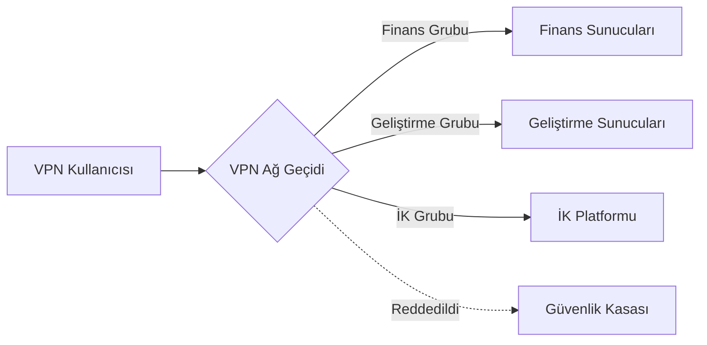

## 0.0 Yönetici Özeti: Sıfır Güven Dünyasında VPN'ler Neden Hala Önemli?

Modern işletmelerde "çevre" (perimeter) büyük ölçüde buharlaşmıştır. Bununla birlikte Sanal Özel Ağ (VPN), altyapı yönetimi, güvenli idari erişim ve eski (legacy) uygulamaların birbirine bağlanması için kritik bir araç olmaya devam etmektedir. Bu rehber, manuel yönetimin imkansız hale geldiği, ancak "dev ölçekli kurumsal" çözümlerin gereğinden fazla olabileceği 300 kullanıcılı bir ortam için tasarlanmıştır.

Yüksek performans, modern kriptografik ilkeler ve basitleştirilmiş kod tabanı nedeniyle birincil protokol olarak **WireGuard**'a odaklanıyoruz; aynı zamanda OpenVPN ve IPsec'in belirli kullanım durumlarındaki rolünü de kabul ediyoruz.

## 0.1 Bu Rehber Nasıl Okunmalı?

Bu doküman, aşamalı bir teknik yığın oluşturmaktadır. Üst düzey kavramsal modellerden, düşük seviyeli uygulama detaylarına ve operasyonel el kitaplarına doğru ilerliyoruz.

- **Bölüm 1.0–3.0:** Temel kavramlar ("Ne?").
- **Bölüm 4.0–8.0:** Mimari ve Tasarım ("Neden?").

- **Bölüm 9.0–13.0:** Kimlik ve Güvenlik ("Nasıl?").
- **Bölüm 14.0–18.0:** İleri Mühendislik ve Ölçeklendirme ("Zor Olan").

- **Ekler:** Gerçek dünya yapılandırma şablonları ve sorun giderme.

:::tip[Operatör Bakış Açısı]
VPN tek başına bir güvenlik çözümü değildir; güçlü bir Kimlik Sağlayıcısı (IdP) ve katı çıkış (egress) politikaları ile yönetilmesi gereken bir **taşıma katmanıdır**. Tüneliniz içinde "Any/Any" (her yerden her yere) yönlendirmeye asla izin vermeyin.
:::

---

## 1.0 VPN Temelleri: Şifreli Katman

Özünde VPN, güvenilmeyen bir fiziksel ağ üzerinden sanal bir noktadan noktaya bağlantı oluşturur. Kurumsal bağlamda bu, genellikle bir istemci cihaz (dizüstü bilgisayar, telefon) ile merkezi bir ağ geçidi arasında şifreli bir tünel kurulmasını içerir.

### 1.1 Bağlantının Yaşam Döngüsü

Bir kullanıcı VPN bağlantısı başlattığında şu sıra gerçekleşir:

1. **Kimlik Doğrulama:** İstemci kimliğini kanıtlar (genellikle sertifikalar veya MFA destekli kimlik bilgileri ile).
2. **Anahtar Değişimi:** İstemci ve sunucu, Diffie-Hellman veya Noise gibi bir protokol kullanarak oturum anahtarlarını müzakere eder.
3. **Tünel Kurulumu:** Her iki uçta sanal bir ağ arabirimi (örn. `wg0` veya `tun0`) oluşturulur.
4. **Yönlendirme Enjeksiyonu:** Sistem yönlendirme tablosu, belirli IP aralıklarını sanal arabirim üzerinden gönderecek şekilde güncellenir.
5. **Kapsülleme (Encapsulation):** Giden paketler dış bir başlık (UDP/TCP) ile sarılır, şifrelenir ve ağ geçidine gönderilir.
6. **Kapsül Çözme (Decapsulation):** Ağ geçidi paketi açar ve dahili hedefe iletir.

### 1.2 Kapsülleme ve Yük (Overhead)

Bir paketi her VPN tüneline sardığınızda, üzerine bayt eklersiniz.

- **WireGuard Yükü:** 32 bayt (IP başlığı + UDP başlığı + WireGuard başlığı).
- **OpenVPN Yükü:** 60-80 bayt (şifreleme ve taşımaya göre değişir).
Standart internet bağlantınızın 1500 baytlık (MTU) bir sınırı varsa ve VPN 32 bayt ekliyorsa, tünel içindeki gerçek veri sınırınız 1468'dir. Bunu görmezden gelirseniz, paketleriniz "parçalanacak" (fragmented) ve bu da yavaş hızlara ve bozuk web sitelerine yol açacaktır.

---

## 2.0 Ağ Mühendisleri İçin Teknik Terminoloji

Profesyonel bir sistem tasarlamak için paket akışı ve kriptografi dilini konuşmalısınız:

- **Taşıma Katmanı (UDP vs. TCP):** VPN'ler kesinlikle UDP'yi tercih eder. TCP-over-TCP (TCP Meltdown), paket kaybı sırasında her iki katman da yeniden iletim yapmaya çalıştığından felaket düzeyinde performans düşüşüne neden olur.
- **MTU (Maximum Transmission Unit):** Bir paket boyutunun fiziksel sınırı (genellikle 1500 bayt). VPN'ler başlık eklediği için (yük), parçalanmayı önlemek amacıyla dahili MTU daha düşük (örn. WireGuard için 1420) olmalıdır.

- **MSS Clamping:** Yönlendiricilerin TCP el sıkışmalarını yakalamak ve Maksimum Segment Boyutunu VPN'in azaltılmış MTU'suna sığacak şekilde "sıkıştırmak" için kullandığı bir teknik; başlıkların sığdığı ancak veri yüklerinin sığmadığı "kara delik" bağlantılarını önler.
- **PFS (Perfect Forward Secrecy):** Uzun vadeli anahtarların ele geçirilmesinin geçmiş oturum anahtarlarını tehlikeye atmadığı bir özellik. Her oturum benzersiz bir geçici anahtar kullanır.

- **Split Tunneling:** Sadece şirket trafiğini (örn. `10.0.0.0/8`) VPN üzerinden yönlendirirken, Netflix/YouTube trafiğini kullanıcının yerel ISS'si üzerinden göndermek. Bant genişliğini korumak için gereklidir.
- **Full Tunneling (Force Tunneling):** Tüm trafiği VPN üzerinden yönlendirmek. Tüm web trafiğinin kurumsal DNS ve DLP (Veri Kaybı Önleme) filtrelerinden geçmesini sağlamak için yüksek uyumluluk gerektiren ortamlarda gereklidir.

- **CGNAT (Carrier-Grade NAT):** Bir ISS'nin birçok kullanıcıyla tek bir genel IP paylaşması. Bu durum genellikle IPsec gibi geleneksel VPN'leri bozar ancak WireGuard tarafından iyi yönetilir.
- **PFS (Tekrar):** Sunucunuzun uzun vadeli özel anahtarı bugün çalınırsa, saldırgan dün kaydettiği oturumları şifresini çözemez. Her el sıkışma, dinamik ve tek kullanımlık bir oturum anahtarı üretir.

---

## 3.0 Protokol Derinlemesine İnceleme: WireGuard vs. Diğerleri

300 kullanıcı için protokol seçiminiz, önümüzdeki üç yıl boyunca bakım yükünüzü belirler.

### 3.1 WireGuard (Altın Standart)

- **Artıları:** ~4.000 satır kod (denetlenebilir), en son kriptografi (ChaCha20, Poly1305), neredeyse anlık el sıkışmalar, son derece yüksek verim.
- **Eksileri:** Tasarım gereği durumsuzdur (300+ kullanıcı için manuel yönetim veya NetBird, Tailscale veya Firezone gibi bir Koordinasyon Katmanı gerektirir).

- **Şunlar için idealdir:** Performans odaklı ekipler, mobil kullanıcılar ve modern Linux/Bulut ortamları.

### 3.2 OpenVPN (Eski İş Atı)

- **Artıları:** İnanılmaz esneklik, TCP desteği (kısıtlayıcı güvenlik duvarlarını aşmak için), hemen hemen her şeyde çalışır.
- **Eksileri:** Devasa kod tabanı (600 bin+ satır), yavaş bağlam değiştirme (User-space vs Kernel-space), karmaşık sertifika yönetimi.

- **Şunlar için idealdir:** Katı TLS tabanlı uyumluluk veya eski donanım desteği gerektiren ortamlar.

### 3.3 IKEv2/IPsec (Yerel Seçim)

- **Artıları:** Yüksek performans, Windows, iOS ve macOS tarafından ekstra uygulamalar olmadan yerel olarak desteklenir.
- **Eksileri:** Doğru şekilde yapılandırılması son derece zordur; "IPsec"in birçok uyumsuz varyantı vardır.

- **Şunlar için idealdir:** Kullanıcılara üçüncü taraf istemciler yükletemediğiniz "Kurulumsuz" dağıtımlar.

---

## 4.0 Mimari: 300 Kullanıcı İçin Tasarım

300 kullanıcıya ölçeklenirken, artık bir bash betiği çalıştıran tek bir Linux sunucusuna güvenemezsiniz. Cuma öğleden sonra yaşanacak bir donanım arızasından sağ çıkabilecek bir mimariye ihtiyacınız var.

### 4.1 Yüksek Erişilebilirlik (HA) Çifti

Aktif-Pasif veya Aktif-Aktif yapılandırmada iki VPN ağ geçidi konuşlandırın.

- **Keepalived/VRRP:** Bir Sanal IP (VIP) kullanın. Ağ Geçidi A ölürse, Ağ Geçidi B saniyeler içinde VIP'yi devralır.
- **Durum Senkronizasyonu:** IPsec gibi protokoller için, kullanıcıların bir başarısızlık sırasında bağlantılarını koparmaması için oturum durumlarını senkronize etmeniz gerekebilir. (WireGuard "sessizdir" ve anında yeniden bağlanır, bu da işi kolaylaştırır).

### 4.2 "Her Kıtada Bir Ağ Geçidi" Modeli

Dağıtık bir iş gücü için, Londra'daki tek bir ağ geçidi Tokyo'daki kullanıcıları hüsrana uğratacaktır.

- **Anycast IP:** Kullanıcıları en yakın sağlıklı VPN düğümüne yönlendirmek için bulut tabanlı bir Anycast hizmeti kullanın.
- **Geo-DNS:** `vpn.sirket.com` adresini, kullanıcının konumuna göre farklı bölgesel IP'lere çözümleyin.

### 4.3 Elastik Ölçeklendirme (Bulut Yerlisi Yöntem)

AWS veya Azure'da, VPN ağ geçitlerinizi bir **Otomatik Ölçeklendirme Grubuna (Auto-Scaling Group)** yerleştirin. CPU kullanımı %70'i aşarsa, bulut otomatik olarak üçüncü bir ağ geçidi oluşturur. Bu, kullanıcı anahtarlarını düğümler arasında paylaşmak için harici bir durum deposu (Redis gibi) veya bir koordinasyon katmanı gerektirir.

---

## 5.0 Güvenlik Hedefleri: "Beş Sütun"

Uygulamanız canlıya geçmeden önce bu kriterleri karşıladığını kanıtlamalıdır:

1. **Kimlik Odaklı Erişim:** IdP'de (örn. Entra ID, Okta, Google Workspace) geçerli bir girişi olmayan kimse giremez.
2. **Kriptografik Bütünlük:** Sadece modern şifreleme yöntemlerini kullanın. RSA-2048, SHA-1 ve 3DES'i devre dışı bırakın.
3. **Yanal Hareketin Önlenmesi:** Varsayılan olarak "Hepsini Reddet" kullanın. `Pazarlama` grubundaki kullanıcılar `Veritabanı` alt ağına ping atamamalıdır.
4. **Uç Nokta Durumu:** Tünelin oluşmasına izin vermeden önce bağlanan cihazda Disk Şifrelemenin etkin olup olmadığını ve aktif bir Antivirüsün çalışıp çalışmadığını kontrol edin.
5. **Görünürlük:** Her bağlantı, bağlantı kesilmesi ve başarısız el sıkışma merkezi bir SIEM (Güvenlik Bilgisi ve Olay Yönetimi) sistemine kaydedilmelidir.

---

## 6.0 VPN Ağ Geçidiniz İçin Tehdit Modellemesi

VPN ağ geçidi devasa bir hedeftir. Eğer düşerse, saldırgan "içeridedir".

### 6.1 İç Tehditler ("Sinsi Yönetici")

- **Risk:** Bir BT çalışanı kişisel dizüstü bilgisayarı için bir "arka kapı" statik anahtarı oluşturur.
- **Azaltma:** Her oturum için zorunlu MFA. İstisnasız. Tüm anahtar oluşturma olaylarını kaydedin ve haftalık olarak denetleyin. Yönetici görevleri için "Tam Zamanında" (JIT) erişim kullanın.

### 6.2 Dış Tehditler ("Kimlik Bilgisi Doldurucu")

- **Risk:** Saldırganlar sızdırılmış bir şifre bulur ve bir başkan yardımcısı olarak giriş yapar.
- **Azaltma:** Cihaz bağlama. VPN yalnızca hem şifre hem de belirli donanım sertifikası/cihaz kimliği mevcutsa çalışır. Kimlik doğrulama uç noktasında Hız Sınırlaması (Rate Limiting) uygulayın.

### 6.3 Altyapı Tehditleri ("DDoS")

- **Risk:** UDP seli, VPN'i herkes için kullanılamaz hale getirir.
- **Azaltma:** DoS koruması için WireGuard'ın "Çerez" mekanizması. Bir el sıkışma kanıtlanana kadar geçerli bir MAC'i olmayan paketleri görmezden gelir. Kötü niyetli trafiği sınırda filtrelemek için bulut tabanlı bir WAF (Web Uygulama Güvenlik Duvarı) kullanın.

---

## 7.0 Yönlendirme ve Alt Ağ Tasarımı (Orta Zorluk)

Verimli yönlendirme, performans darboğazlarını önler ve güvenlik kurallarını basitleştirir.

### 7.1 Alt Ağ Çakışmalarından Kaçınma

Birçok ev yönlendiricisi `192.168.1.0/24` kullanır. Kurumsal ağınız da bu aralığı kullanıyorsa, kullanıcı kendi bilgisayarı trafiği evine "yerel" sandığı için dahili kaynaklara ulaşamayacaktır.

- **`10.x.x.x` veya `172.16.x.x` alanını standartlaştırın.**
- **VPN havuzu için benzersiz bir segment kullanın** (örn. `100.64.0.0/10` - Carrier Grade NAT aralığı), çakışmaları önlemek için.

### 7.2 NAT Tuzağı

Herkes ağa girdiğinde onları tek bir IP'ye NAT'larsanız, güvenlik duvarı günlükleriniz tüm trafiğin "VPN Sunucusundan" geldiğini gösterecektir. Hangi kullanıcının hangi sunucuya eriştiğini görme yeteneğinizi kaybedersiniz.

- **Çözüm:** VPN alt ağını doğrudan yönlendirin. Dahili sunucuların bu IP'ler için VPN ağ geçidine giden bir rotaya sahip olduğundan emin olun.

---

## 8.0 Full Tunnel vs Split Tunnel: Derin Bağlamsal Analiz

Bu karar genellikle teknik değil, politiktir.

### 8.1 Full Tunnel İçin Nedenler

- **Güvenlik:** Tüm web trafiğini güvenli bir ağ geçidinden (SWG) geçmeye zorlayabilirsiniz. Bu, kullanıcıların kimlik avı sitelerini ziyaret etmesini veya mesai saatlerinde kötü amaçlı yazılım indirmesini önler.
- **Gizlilik:** Kullanıcının trafiğini halka açık Wi-Fi'lerde (oteller, kafeler) gözetlenmekten korur.

- **Uyumluluk:** Birçok sektör (Finans, Sağlık), veri koruma yasalarına uyumlu olmak için tam tünelleme gerektirir.

### 8.2 Split Tunnel İçin Nedenler

- **Performans:** Zoom/Teams görüşmelerinin veri merkezine gidip geri gelmesine gerek yoktur; doğrudan internete gitmelerine izin verin.
- **Maliyet:** Öğle yemeği molasında 4K YouTube izleyen bir kullanıcının bant genişliği için ödeme yapmazsınız.

- **Donanım Zorlanması:** VPN ağ geçidiniz, zararsız trafiğin (Netflix gibi) gigabaytlarını işlemek zorunda kalmaz.

:::caution[Hibrit Orta Yol]
Modern işletmelerin çoğu **Split Inclusion (Bölünmüş Dahil Etme)** kullanır. Dahili CIDR aralıklarınızı (örn. `10.0.0.0/8`) ve belirli SaaS IP'lerini dahil edin, ancak dünyanın geri kalanını yerel ISS'ye bırakın.
:::

---

## 9.0 Kimlik Mimarisi: VPN'i Gerçekliğe Bağlamak

300 kullanıcı için ağ geçidindeki yerel Linux kullanıcılarını yönetemezsiniz. Bir kimlik köprüsüne ihtiyacınız var.

### 9.1 Kimlik Döngüsü

1. **İstemci Uygulaması** giriş ister.
2. **Ağ Geçidi**, kullanıcıyı OIDC/SAML giriş sayfasına (Okta/Entra ID) yönlendirir.
3. **Kullanıcı** MFA'yı (FIDO2, Authenticator Uygulaması) tamamlar.
4. **IdP**, Ağ Geçidine bir jeton (JWT) gönderir.
5. **Ağ Geçidi**, kısa ömürlü bir WireGuard anahtarı oluşturur ve istemciye iter.

### 9.2 MFA Uygulama Stratejisi

- **SMS'ten Kaçının:** SIM değiştirme ve SS7 müdahalelerine karşı savunmasızdır.
- **TOTP veya WebAuthn'ı Tercih Edin:** Güvenlik konusunda ciddiyseniz, VPN erişimi için bir donanım anahtarı (Yubikey) zorunlu tutun. FIDO2, modern kimlik doğrulama güvenliğinin zirvesidir.

---

## 10.0 Erişim Kontrol Listeleri (ACL'ler) ve Mikro Segmentasyon

VPN "düz" bir ağ olmamalıdır.



### 10.1 RBAC Uygulaması

- IdP gruplarını ağ etiketleriyle eşleyin.
- **WireGuard** kullanıyorsanız, bu kuralları bir web arayüzü ile tanımlamak için **NetBird** veya **Tailscale** gibi bir araç kullanın.

- **Linux/Iptables** kullanıyorsanız, bir kullanıcı bağlandığında kuralları güncelleyen dinamik bir betiğe ihtiyacınız vardır. Buna genellikle "Dinamik Güvenlik Duvarı Politikası" denir.

---

## 11.0 İzleme ve Günlüğe Kaydetme: "Gökyüzündeki Göz" Olmak

Birisi "Sabah 2'de yedekleme sunucusuna kim erişti?" diye sorarsa, VPN günlüklerinizde cevap olmalıdır.

### 11.1 Takip Edilmesi Gereken Hayati Metrikler

- **Eşzamanlı Oturumlar:** Donanım CPU/RAM sınırlarımıza ulaşıyor muyuz?
- **Kullanıcı Başına Veri Verimi:** Birisi veri mi kaçırıyor (rolüne göre alışılmadık derecede yüksek yükleme)?

- **El Sıkışma Gecikmesi:** Kimlik doğrulama sunucusu yavaş mı?
- **Düşen Paketler:** MTU sorunlarının veya ISS hız sınırlamasının göstergesi.

### 11.2 SIEM Entegrasyonu

Günlüklerinizi Elasticsearch, Splunk veya Azure Monitor'e aktarın. "İmkansız seyahat" araması yapın—bir kullanıcı New York'tan giriş yapıyor ve 10 dakika sonra Frankfurt'tan. Bu, çalınmış bir oturum jetonunun birincil göstergesidir.

---

## 12.0 MTU/MSS Baş Ağrısını Çözmek (Zor)

Bu, VPN yardım masası biletlerinin 1 numaralı nedenidir. Kullanıcı bağlanır ancak büyük web sitelerini açamaz veya e-posta gönderemez.

### 12.1 "Ping of Death" Testi

VPN'iniz açıksa ancak veriler takılıyorsa şunu çalıştırın:
`ping -M do -s 1400 10.0.0.1` (Linux'ta) veya `ping 10.0.0.1 -f -l 1400` (Windows'ta).
Ping başarılı olana kadar `1400` değerini düşürmeye devam edin. Bu, yol MTU'nuzdur.

### 12.2 Çözüm

- WireGuard MTU'sunu `1280` olarak ayarlayın (IPv6 için en güvenli minimum).
- Ağ geçidinizde MSS Clamping'i etkinleştirin:
    `iptables -t mangle -A FORWARD -p tcp --tcp-flags SYN,RST SYN -j TCPMSS --clamp-mss-to-pmtu`
Bu, sunucunuzun uzak sunucuya, paketler VPN tüneline ulaşmadan önce paketlerini küçültmesini söylemesini sağlar.

---

## 13.0 Yüksek Erişilebilirlik ve Yük Dengeleme (Zor)

300 kullanıcıyı kesinti yaşamadan desteklemek için yedekliliğe ihtiyacınız var.

### 13.1 Round-Robin DNS

En basit biçim. `vpn.sirket.com` adresini üç farklı IP adresine işaret edin. İstemci rastgele birini seçer. Biri başarısız olursa, kullanıcı "canlı" bir sunucuya ulaşmak için 2-3 kez yeniden bağlanmak zorunda kalabilir.

### 13.2 TCP/UDP Yük Dengeleyiciler

Bulut yük dengeleyici (AWS NLB veya Azure Load Balancer gibi) kullanın. Sağlık kontrolleri yapar ve trafiği yalnızca çalışan ağ geçitlerine gönderir. Not: Bu, bağlantısız (UDP) olduğu için WireGuard ile yanıltıcı olabilir. Kaynak IP'ye dayalı "Oturum Yapışkanlığı" (Session Stickiness) kullanmalısınız.

---

## 14.0 VPN İçin Felaket Kurtarma (DR)

Birincil veri merkeziniz kararırsa ne olur?

- **Bulut Yedekleme:** Farklı bir bulut bölgesinde her zaman bir "Soğuk Bekleme" (Cold Standby) ağ geçidiniz olsun (örn. AWS vs GCP).
- **Kod Olarak Yapılandırma:** VPN yapılandırmalarınızı Git'te saklayın. Bir sunucu ölürse, Terraform veya Ansible kullanarak 5 dakika içinde yenisini oluşturabilmelisiniz. "Değişmezlik" (Immutability) DR'da en iyi arkadaşınızdır.

- **Acil Durum Anahtarları:** IdP'nin kendisi kapalıysa diye kasada fiziksel "Camı Kır" anahtarları bulundurun.

---

## 15.0 Operasyonel Mükemmellik: Geliştirici Deneyimi

Kullanımı zor olan güvenli bir VPN, en yetenekli mühendisleriniz tarafından baypas edilecektir.

- **Otomatik Bağlan:** İstemciyi, kullanıcı şirket içi Wi-Fi'de olmadığında açılacak şekilde yapılandırın.
- **SSO Entegrasyonu:** Giriş yapmak için tek tık. Kullanıcının yönetmesi gereken ayrı şifreler veya karmaşık anahtar dosyaları yok.

- **Sessiz Güncellemeler:** İstemci güncellemelerini kullanıcıyı rahatsız etmeden göndermek için bir MDM (Jamf, InTune) kullanın.
- **Dostu Ana Bilgisayar Adları:** Dahili DNS'inizin (örn. `jira.int.sirket.com`) VPN üzerinden çalıştığından emin olun, böylece kullanıcılar IP adreslerini hatırlamak zorunda kalmazlar.

---

## 16.0 Uyumluluk ve Denetim ("Sıkıcı" Ama Hayati Kısım)

SOC2, HIPAA veya GDPR'ye tabiyse, VPN'iniz kritik bir kontroldür.

- **Denetim İzi:** Bir yönetici her ACL değiştirdiğinde günlük tutun.
- **Oturum Sonlandırma:** MFA ile yeniden kimlik doğrulamayı zorunlu kılmak için kullanıcıları 12 veya 24 saat sonra otomatik olarak atın. Bu, çalınan dizüstü bilgisayarlarda "Sonsuz Tünelleri" önler.

- **Veri Yerleşimi:** AB'deyseniz, VPN ağ geçitlerinizin trafiği uyumlu olmayan yargı bölgelerindeki (bazı ABD tabanlı veri merkezleri gibi) düğümler üzerinden yönlendirmediğinden emin olun.

---

## 17.0 Çekirdek Seviyesinde Performans Optimizasyonu

Maksimum hız için ağ geçitlerinizdeki Linux çekirdeğine ince ayar yapın. Bu değişiklikler, sunucunun saniyede 10.000'den fazla paketi yorulmadan işlemesini sağlar.

```bash
# Paket kuyruğu uzunluklarını artırın
sysctl -w net.core.netdev_max_backlog=5000
# Alma/gönderme arabellek boyutlarını artırın (16MB)
sysctl -w net.core.rmem_max=16777216
sysctl -w net.core.wmem_max=16777216
# TCP için BBR'yi etkinleştirin
sysctl -w net.core.default_qdisc=fq
sysctl -w net.ipv4.tcp_congestion_control=bbr
```

### 17.1 Çoklu Kuyruk (Multiqueue) Desteği

Modern sunucular 16+ CPU çekirdeğine sahiptir. WireGuard bunu varsayılan olarak iyi yönetir, ancak sunucunuzun NIC'sinin (Ağ Arabirim Kartı) kesme isteklerini (IRQ'lar) tüm çekirdeklere dağıtacak şekilde yapılandırıldığından emin olun. Doğrulamak için `/proc/interrupts` dosyasını kontrol edin. Tüm kesmeler Çekirdek 0'a vuruyorsa, performansınız duraksayacaktır.

---

## 18.0 Geleceğe Hazırlık: ZTNA ve VPN Sonrası Dünya

Sektör Sıfır Güven Ağ Erişimine (ZTNA) doğru ilerliyor.

- **Fikir:** Bir kullanıcıya "ağ erişimi" vermek yerine, ters vekil sunucu (reverse proxy) aracılığıyla "uygulama erişimi" verirsiniz.
- **Zaman Çizelgesi:** VPN'i kalın istemcili uygulamalar ve sunucu yönetimi için tutarken, web tabanlı uygulamaları ZTNA'ya (Cloudflare Tunnel, Zscaler, Pomerium) taşımaya başlayın. VPN "Yönetici Düzlemi" olurken, ZTNA "Kullanıcı Düzlemi" haline gelir.

---

## 19.0 Sorun Giderme Senaryoları: Gerçek Dünya Dersleri

### Senaryo A: "Yavaş Görüntülü Arama"

**Belirti:** Kullanıcı Zoom'un ev Wi-Fi'sinde iyi çalıştığını ancak VPN'de takıldığını söylüyor.
**Teşhis:** Kullanıcı bir "Uzun Şişman Boru" (yüksek gecikme, yüksek bant genişliği) üzerindedir. Standart TCP tıkanıklık kontrolü (Cubic) burada başarısız olur çünkü gecikmenin tıkanıklığın bir işareti olduğunu düşünür.

**Çözüm:** Ağ geçidini BBR'ye geçirin (Bölüm 17.0'da gösterildiği gibi). BBR gerçek bant genişliğini ölçer ve gecikmeyi çok daha zarif bir şekilde yönetir.

### Senaryo B: "Zombi Oturumu"

**Belirti:** Kontrol paneli kullanıcının bağlı olduğunu gösteriyor, ancak kullanıcı 4 saat önce bağlantıyı kestiğini söylüyor.
**Teşhis:** İstemcinin interneti aniden kesildi (asansöre giren tünel) ve ağ geçidi hiçbir zaman bir "güle güle" paketi almadı. UDP bağlantısız olduğu için sunucu oturumu canlı tutar.

**Çözüm:** `PersistentKeepalive` değerini düşürün ve 10 dakikalık bir sunucu taraflı "Ölü Eş Tespiti" (DPD) zaman aşımı uygulayın.

### Senaryo C: "Dahili Site Sonsuza Kadar Yükleniyor"

**Belirti:** Sayfa başlığı tarayıcı sekmesinde görünüyor, ancak sayfa içeriği asla yüklenmiyor.
**Teşhis:** MTU uyuşmazlığı. Küçük el sıkışma paketleri sığıyor, ancak büyük veri paketleri (HTML/Görseller) arada bir yönlendirici tarafından düşürülüyor.

**Çözüm:** Ağ geçidinde MSS Clamping uygulayın (Bölüm 12.2).

---

## 20.0 Linux, Mac ve Windows CLI Hızlı Başlangıç

### 20.1 Linux (İstemci)

```bash
# Kurulum
sudo apt install wireguard
# Yapılandırma
sudo nano /etc/wireguard/wg0.conf
# Başlatma
sudo wg-quick up wg0
```

### 20.2 macOS (İstemci)

En iyi deneyim için resmi Mac App Store uygulamasını kullanın veya CLI için Homebrew'u tercih edin:

```bash
brew install wireguard-tools
sudo wg-quick up ./myconfig.conf
```

### 20.3 Windows (İstemci)

`wireguard.com` adresinden resmi MSI yükleyicisini kullanın. Yönetici olmayanların VPN'i açıp kapatmasına izin veren (doğru yapılandırılmışsa) bir sistem hizmeti kurar.

---

## Ek A: WireGuard Temel Sunucu Yapılandırması (Ubuntu 22.04)

```ini
# /etc/wireguard/wg0.conf
[Interface]
PrivateKey = <SUNUCU_OZEL_ANAHTARI>
Address = 10.0.0.1/24
ListenPort = 51820

# Parçalanmayı önlemek için MTU zorla
MTU = 1420

# Yönlendirme için PostUp/PostDown
PostUp = iptables -A FORWARD -i %i -j ACCEPT; iptables -t nat -A POSTROUTING -o eth0 -j MASQUERADE
PostDown = iptables -D FORWARD -i %i -j ACCEPT; iptables -t nat -D POSTROUTING -o eth0 -j MASQUERADE

[Peer]
# Personel 1
PublicKey = <ISTEMCI_PUBLIC_ANAHTARI>
AllowedIPs = 10.0.0.2/32
```

## Ek B: Gelişmiş Linux İstemci Kurulumu

```bash
# Anahtarları oluştur
wg genkey | tee privatekey | wg pubkey > publickey
# Yapılandırmayı oluştur
sudo nano /etc/wireguard/wg0.conf
# Hizmeti kalıcı olarak başlat
sudo systemctl enable --now wg-quick@wg0
```

## Ek C: Sorun Giderme Kontrol Listesi

1. **Bağlanamıyor mu?** -> Kurumsal güvenlik duvarında UDP 51820 portunun açık olup olmadığını kontrol edin.
2. **Bağlı ancak İnternet yok mu?** -> `sysctl net.ipv4.ip_forward` değerinin `1` olduğundan emin olun.
3. **Düşük performans mı?** -> MTU'yu `1280`'e düşürün.
4. **Belirli uygulamalar çalışmıyor mu?** -> MSS Clamping kurallarını kontrol edin.
5. **DNS hataları mı?** -> İstemcideki `/etc/resolv.conf` dosyasının dahili DNS sunucusunu işaret ettiğinden emin olun veya `wg0.conf` içinde `DNS = 10.0.0.1` yönergesini kullanın.

---

## Sonuç: Mimar İçin Son Düşünceler

300 kullanıcı için bir VPN oluşturmak; **Güvenlik**, **Gizlilik** ve **Kullanılabilirlik** arasında bir denge sanatıdır. WireGuard gibi modern bir protokol seçerek, kimlik akışınızı otomatikleştirerek ve ağ yasalarına (MTU/MSS) saygı göstererek, hem kullanıcılar için görünmez hem de saldırganlar için geçilmez bir sistem inşa edebilirsiniz.

En başarılı VPN, kimsenin çalıştığını bilmediği VPN'dir. Paranoyak kalın, günlüğe kaydedin ve yük devretme sisteminizi ihtiyaç duymadan önce mutlaka test edin.

---

## 21.0 Güvenli Tüneller İçin Gelişmiş Kriptografik Yapılandırma

WireGuard ve IPsec kutudan çıktığı haliyle güçlü güvenlik sağlasa da, kurumsal ortamlar genellikle FIPS 140-2 veya NIST yönergeleri gibi düzenleyici standartları karşılamak için açık kriptografik sertleştirme gerektirir.

### 21.1 Şifreleme Paketi Seçimi (Modern Yığın)

Artan kuantum hesaplama potansiyeli dünyasında, doğru şifreleme yöntemlerini seçmek hayati önem taşır:

- **KEM (Anahtar Kapsülleme Mekanizmaları):** **Kyber** veya **McEliece** gibi kuantum sonrası algoritmaları araştırmaya başlayın. Henüz çoğu VPN istemcisinde standart olmasa da, bazı WireGuard çatallarında "deneysel destek" aşamasına ulaşıyorlar.
- **AEAD (İlişkili Veri ile Kimlik Doğrulamalı Şifreleme):** Her zaman **ChaCha20-Poly1305** veya **AES-GCM** gibi AEAD özellikli şifreleme yöntemlerini kullanın. Bunlar, tek bir geçişte hem gizlilik hem de bütünlük sağlar ve "Şifreli Metin Değiştirilebilirlik" (Ciphertext Malleability) saldırılarını önler.

### 21.2 Noise Protokol Çerçevesi

WireGuard, **Noise Protokol Çerçevesi** üzerine inşa edilmiştir. Bu çerçeve "1-RTT" el sıkışmalarına izin verir, yani bağlantı tek bir gidiş-dönüşte kurulur. WireGuard'ın eski protokollerin gerektirdiği "4 yönlü el sıkışmadan" önemli ölçüde daha hızlı hissettirmesinin nedeni budur.

---

## 22.0 Bulut Yerlisi VPN Entegrasyonu (AWS, GCP, Azure)

300 kullanıcınız öncelikle bir genel buluttaki kaynaklara erişiyorsa, VPN mimariniz bunu yansıtmalıdır.

### 22.1 AWS Transit Gateway (TGW)

Her kullanıcıyı bir VPC içindeki bir ağ geçidine bağlamak yerine, onları bir Transit Gateway ile ilişkili bir **AWS İstemci VPN**'ine bağlayın.

- **Avantaj:** Transit Gateway, tüm VPC'leriniz için merkezi bir yönlendirici görevi görür. Oluşturduğunuz herhangi bir yeni VPC, ağ geçitlerini yeniden yapılandırmadan VPN tarafından anında erişilebilir hale gelir.
- **Güvenlik:** TGW bağlantılarına Güvenlik Grupları uygulayarak merkezi bir kontrol noktası oluşturabilirsiniz.

### 22.2 Azure Virtual WAN

Microsoft 365 ve Azure'a yoğun yatırım yapan kuruluşlar için **Azure Virtual WAN**, küresel bir "şubeden buluta" bağlantı modeli sağlar.

- **Point-to-Site (P2S):** Bu, kullanıcıdan ağ geçidine VPN için kullanılan Azure terimidir. OpenVPN ve IKEv2'yi destekler ve MFA için Microsoft Entra ID (eski adıyla Azure AD) ile yerel olarak entegre olur.

---

## 23.0 VPN Gecikmesini Yönetmek: Fizik Yasaları

Sunucunuz ne kadar hızlı olursa olsun, ışık hızını geçemezsiniz. Ancak "son mil" ve "orta mil"i optimize edebilirsiniz.

### 23.1 El Sıkışma Gecikmesini Azaltma

Yüksek gecikmeli bölgelerde (örn. Güney Amerika'daki kullanıcıların Virginia tabanlı bir sunucuya bağlanması), el sıkışmadaki her ekstra gidiş-dönüş 500ms bekleme süresi ekler.

- **Çözüm:** Minimum gidiş-dönüş gerektiren UDP tabanlı protokoller (WireGuard) kullanın. TCP tabanlı VPN'lerden ne pahasına olursa olsun kaçının.

### 23.2 "Orta Mil" Optimizasyonu

Büyük bulut sağlayıcıları (AWS, Cloudflare, Google), halka açık internetten %30-40 daha hızlı olan özel fiber omurgalara sahiptir.

- **Teknik:** Kullanıcının evinin yakınındaki "yerel" bir giriş noktasına (PoP) bağlanmasını sağlayın. Bu PoP daha sonra trafiği sağlayıcının özel omurgası üzerinden merkezi veri merkezinize taşır. **Tailscale**'in (DERP aktarıcıları aracılığıyla) ve **Cloudflare Warp**'ın hızının arkasındaki sır budur.

---

## 24.0 Sonuç: Direnç Üzerine Son Söz

Günün sonunda, 300 kullanıcı için bir VPN **Kritik Görev Altyapısı**nın bir parçasıdır. VPN kapalıysa, şirket çalışmayı durdurur.

1. **Yedeklilik kraldır.** (İki düğüm birdir; tek düğüm hiçtir).
2. **Kimlik çevredir.** (MFA isteğe bağlı değildir).
3. **Performans ikilidir.** (Yavaşsa, kullanıcılar kullanmayacaktır).
4. **Günlük tutmak gerçektir.** (Günlüğe kaydedilmemişse, olmamıştır).

Dikkatli olun, paket düşüşlerinizi izleyin ve özel anahtarlarınızı her zaman gizli tutun.