## Zemin Son Bir Kez Değişiyor

Dört cilt boyunca duvarlar inşa ettik ([I](/posts/secure_systems_architecture/)), her kapıdaki her ilkeyi doğruladık ([II](/posts/identity_and_access_in_depth/)), mesajlarımızı değiştirilemez hale getirdik ([III](/posts/cryptography_engineering_in_depth/)) ve yine de sızmayı tespit edip hayatta kalmayı öğrendik ([IV](/posts/detection_and_response_in_depth/)). Tüm bu fikirler, sessizce geçerliliğini yitiren bir şeyi varsayıyordu: *bir sunucu*, *bir makine*, *kalıcı bir nesne* var ve sizin kontrolünüzde olup üzerine işaret edebileceğiniz bir şey.

Bulut-yerel dünyada bu varsayım çözülür:

* "Sunucu", doksan saniye yaşayan ve yerine birebir aynısı olan bir ikizinin geçtiği bir **kapsayıcıdır**.
* Altyapı raf sistemine kurulu değil; bir işlem hattının uyguladığı bir **YAML dosyasıdır**.
* Uygulama, sizin yazdığınız bir şey değil; denetlemekte zorlanacağınız bir derleme sistemi tarafından bir araya getirilen, sizin yazmadığınız **sizin kodunuz artı iki bin bağımlılıktır**.

Bu final, *o* dünyayı savunmakla ilgili. Çevre tamamen ortadan kalkmış, iş yükleri evcil hayvanlar değil çiftlik hayvanları gibi yönetiliyor ve on yılın en yıkıcı ihlalleri sizin ön kapınızdan değil, **tedarik zincirinizden** geliyor. Serinin öğrettiği her şey hala geçerli, ancak uygulandığı yüzeyler artık günde binlerce kez yanıp sönüyor.

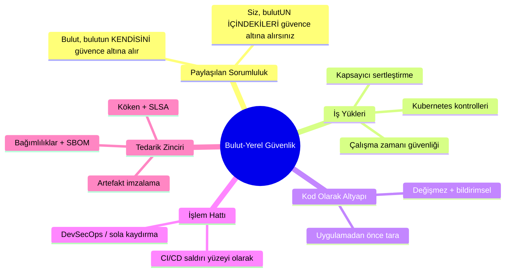

---

## Bölüm I: Paylaşılan Sorumluluk Modeli

Bulut güvenliğindeki ilk ve en çok yanlış anlaşılan fikir: **bulut sağlayıcısı uygulamanızı güvence altına almaz.** Onlar, bulutun çalıştığı *altyapıyı* güvence altına alırlar; siz de *içine koyduğunuzu* güvence altına alırsınız. Satır, hizmet modeline bağlı olarak değişir ve ihlaller nerede oturduğu konusundaki kafa karışıklığında yaşar [^1]:

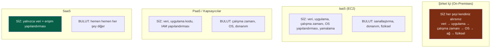

:::important[Sorumluluğunuz asla sıfıra inmez]
Her sütundaki sabit şeye dikkat edin: **siz her zaman verilerinizi ve erişim yapılandırmanızı kendiniz alırsınız.** "Bulut ihlallerinin" ezici çoğunluğu, sağlayıcının hacklenmesi değil, bir *müşterinin* yanlış yapılandırmasıdır: herkese açık bir S3 kovası, aşırı yetkili bir IAM rolü, `0.0.0.0/0` adresine maruz kalmış bir veritabanı. Bulut, size güçlü varsayılan kapalı ilkel öğeler sunar; bunları kapalı tutmak size bağlıdır. Sağlayıcıdan kaynaklanan bir ihlal değil, yanlış yapılandırma, bulut verilerinin ifşa edilmesinin bir numaralı nedenidir. [^2]
:::

---

## Bölüm II: İş Yükünü Güvence Altına Almak

### Bölüm 1: Kapsayıcı Güvenliği - Katmanlı Gerçeklik

Bir kapsayıcı hafif bir sanal makine değildir; **paylaşımlı bir ana makine çekirdeği üzerinde izole edilmiş bir grup *süreçtir***. Bu tek gerçek, tüm tehdit modelini belirler ve savunma, imajdan çalışma zamanına kadar katmanlıdır:

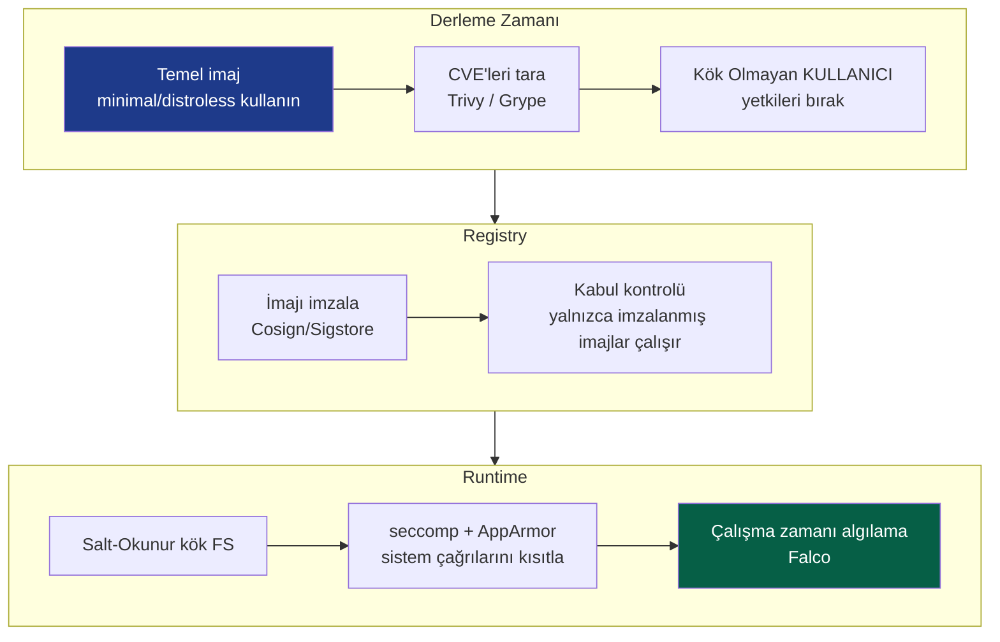

En yüksek kaldıraç etkili kapsayıcı uygulamaları, sağlanan fayda sırasına göre:

*   **Minimal temel imajlar** - `distroless` veya scratch imajı, uygulamanızı ve *başka hiçbir şeyi* içermez: kabuk yok, paket yöneticisi yok, `curl` yok. İçeri giren bir saldırganın ilerlemek için hiçbir aracı olmaz. Ayrıca CVE yüzeyini on kat azaltır, işletim sistemi paketleri olmaması işletim sistemi paket güvenlik açıklarının olmaması anlamına gelir.
*   **Asla kök olarak çalıştırmayın** - kök olarak çalışan ve kapsayıcıdan kaçan bir kapsayıcı işlemi, *ana makinede* kök olur. Kök olmayan bir `USER` ayarlayın, tüm Linux yetkilerini bırakın ve yalnızca gerekenleri geri ekleyin.
*   **Salt-okunur kök dosya sistemi** - kapsayıcı kendi dosya sistemine yazamazsa, bir saldırgan ona bir yük bırakamaz.
*   **Her imajı tarayın** - CI içinde `Trivy`/`Grype`, kritik CVE'lere karşı derlemeyi engelleyin.

:::warning[Kapsayıcıdan kaçış tüm oyunun kendisidir]
Kapsayıcılar ana makine çekirdeğini paylaştığı için, **çekirdek açığı veya yanlış yapılandırma tam bir ana makine ele geçirmesidir** ve bir ana makineden, genellikle tüm küme. Bunu önemsiz hale getiren ana günahlar şunlardır: `--privileged` çalıştırmak, Docker soketini (`/var/run/docker.sock`) bir kapsayıcıya bağlamak (bu ana makinede köktür, paketi hediye edilmiş gibi), ve UID 0 olarak çalıştırmak. Ayrıcalıklı bir kapsayıcıyı, `sudo` dağıtmakla aynı incelemeyi gerektiren bir karar olarak ele alın. [^3]
:::

### Bölüm 2: Kubernetes - Orchestrator'ı Sertleştirmek

Kubernetes, kapsayıcılar için dağıtık bir işletim sistemidir ve güvenliği başlı başına bir konudur. Saldırı yüzeyi dört cepheye yayılır, Bulut Yerel Güvenliğin **4 C'si** olarak ezberlenir: Cloud, Cluster, Container, Code [^4].

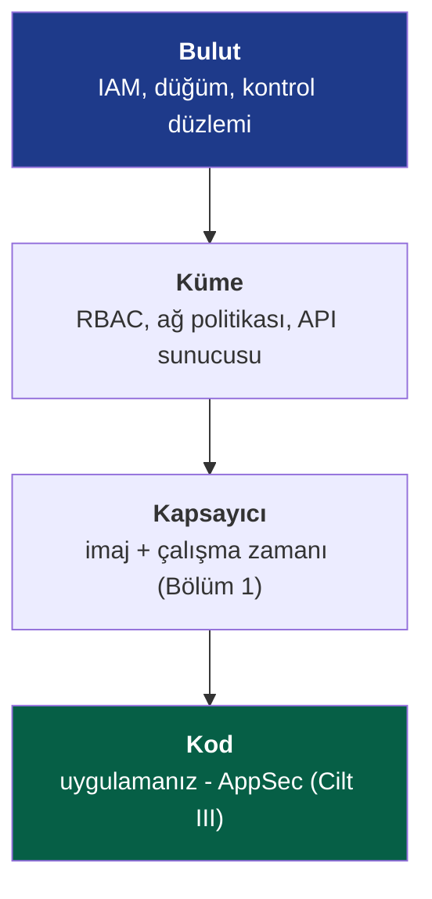

Yük taşıyan küme kontrolleri, her biri belirli bir saldırı yolunu kapatır:

::::steps

:::step[RBAC - API için en az ayrıcalık]{subtitle="Kim kümeye ne yapabilir"}
Kubernetes API sunucusu taç mücevheridir, onu kim kontrol ederse tüm iş yüklerini kontrol eder. Cilt II'nin en az ayrıcalık derslerini uygulayın: servis hesapları için `cluster-admin` joker karakteri kullanmayın, rolleri ad alanlarına göre kapsamlandırın ve varsayılan servis hesabı belirtecini ihtiyaç duyulmadığı yerde bağlamayın. Ayrıcalıklı bir belirtece sahip bir pod, küme ele geçirmesine giden bir pivot noktasıdır.
:::

:::step[Ağ Politikaları - varsayılan olarak reddet]{subtitle="Doğu-batı segmentasyonu"}
Varsayılan olarak, *her pod diğer her pod ile konuşabilir*, düz, güvenilir, tam da Cilt I'in uyardığı ağ modeli. Bir **varsayılan-reddetme** Ağ Politikası uygulayın ve yalnızca gerekli akışlara açıkça izin verin. Bu, pod ağındaki mikro segmentasyondur (Cilt I/II): tek bir ele geçirilmiş podu bir fırlatma rampasından bir çıkmaz sokağa dönüştürür.
:::

:::step[Pod Güvenlik Standartları - tehlikelileri kısıtla]{subtitle="Kapsayıcı kurallarını zorla"}
**Kısıtlı** Pod Güvenlik Standardını zorlayın: ayrıcalıklı pod yok, ana makine ad alanı paylaşımı yok, yalnızca kök olmayan, salt-okunur kök FS. Kapsayıcı kurallarının geliştiricilere yalnızca önerilmek yerine platform tarafından *zorunlu kılındığı* yer burasıdır.
:::

:::step[Sırlar - "şifreleme" olarak base64 kullanmayın]{subtitle="Hassas olanı koru"}
Kubernetes Sırları varsayılan olarak yalnızca **base64 ile kodlanmıştır**, etcd'de şifrelenmez. Etcd için **dinlenirken şifrelemeyi** etkinleştirin ve daha iyisi, harici bir yöneticiyi (Vault, CSI sürücüsü aracılığıyla bulut KMS) entegre edin, böylece sırlar kurtarılabilir bir şekilde asla etcd'de oturmaz. Aksi takdirde etcd okuma erişimi olan herkes tüm sırları okur.
:::

::::

:::tip[Kabul kontrolü sizin politika geçiş noktanızdır]
Küme içine giren her nesne, **kabul denetleyicisinden** geçer, politika olarak kodu zorlamak için ideal yer. **OPA Gatekeeper** veya **Kyverno** gibi araçlar, uyumsuz iş yüklerini kapıdan *reddetmenize* olanak tanır: "imzası olmayan imaj yok", "kaynak limitleri olmayan kapsayıcı yok", "`latest` etiketleri yok." Bu, Cilt II'nin Sıfır Güven modeli'ndeki PEP'in, kümenin ön kapısına uygulanmasıdır. Kabulde zorlanan politika, bir geliştirici tarafından unutulamaz. [^5]
:::

### Bölüm 3: Çalışma Zamanı Güvenliği - Pod'un Ele Geçirildiğini Varsaymak

Şimdiye kadarki her şey önleyici. Cilt IV'ün *ihlal varsayımı* zihniyetini iş yüklerine uygulamak: bir kapsayıcı sonuçta yapmaması gereken bir şeyi çalıştıracaktır. **Çalışma zamanı güvenliği**, canlı davranışı izler ve aykırı olanı işaretler: yalnızca tek bir işlem çalıştırması gereken bir kapsayıcı içinde bir kabuk belirir, daha önce hiç görülmemiş bir IP'ye dışa dönük bir bağlantı, `/etc/passwd`'ye bir yazma. **Falco** gibi araçlar, çekirdek sistem çağrısı akışını algılamalara dönüştürür, Cilt IV'ün SIEM/tespit mühendisliği disiplinini geçici iş yüküne kadar genişletir.

---

## Bölüm III: Kod Olarak Altyapı - Taslağı Güvence Altına Almak

Bulut-yerel dünyada altyapı, **bildirilmiş, yapılandırılmış değil**, Terraform, CloudFormation, Pulumi'dir. Bu bir güvenlik *hediyesidir*: çünkü tüm altyapı koddur, bu nedenle **bir kaynak oluşmadan önce onu yanlış yapılandırmalar için tarayabilirsiniz.**

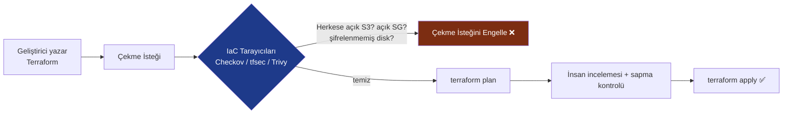

Bu, **sola kaydırma** (Cilt I'in SSDLC teması) ifadesinin doruk noktasıdır: ihlale neden olacak yanlış yapılandırma, dünyaya açık bir güvenlik grubu, şifrelenmemiş bir veritabanı, herkese açık bir kovası, bir kod incelemesinde yakalanır, *daha üretim ortamına hiç oluşmadan*. Bir güvenlik açığını gidermenin maliyeti, bulunduğu aşamanın sonraki aşamasına göre kat kat artar:

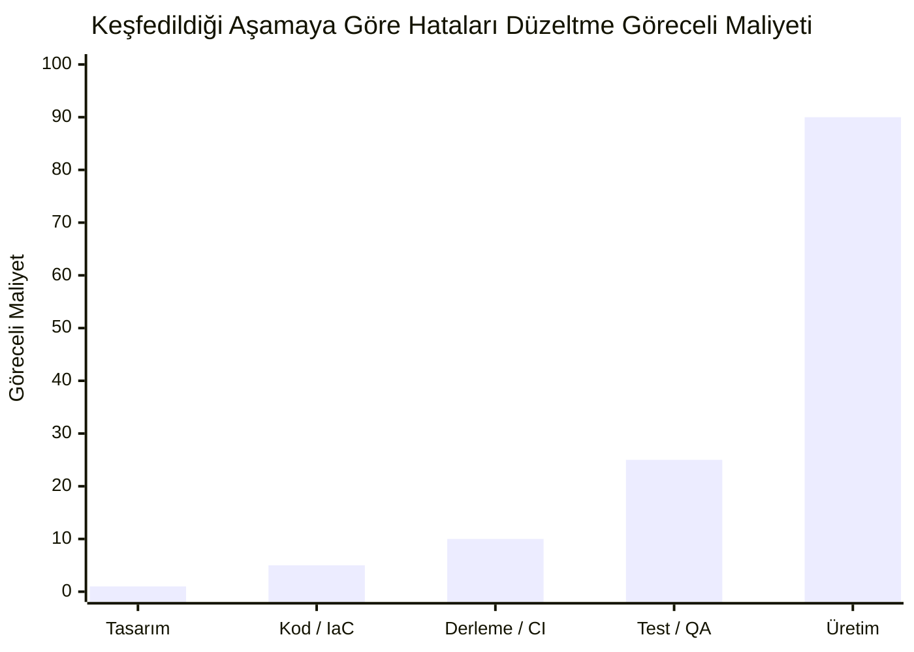

Sağa doğru her adım maliyeti çarpar ve üretimde bir *ihlal* bu çizginin tamamen dışındadır. IaC taraması, algılamayı mümkün olan en ucuz sütuna itmenin yoludur.

:::note[Değişmezlik bir güvenlik özelliğidir]
IaC, **değişmez altyapıyı** mümkün kılar: sunucular asla yerinde yamalanmaz, iyi bilinen bir imajdan *değiştirilirler*. Bu sessizce iki sorunu ortadan kaldırır. **Yapılandırma sapması** ("çalışan şey" ile "çalıştığını düşündüğümüz şey" arasındaki yavaş sapma) kaybolur, çünkü her dağıtım kaynaktan yeniden oluşturulur. Ve saldırgan **kalıcılığı** çok daha zor hale gelir, çalışan bir ana makinede yerleştirilmiş bir arka kapı, o ana makine yeniden dağıtıldığında, ki bu saatler sonra olabilir, silinir. Evcil hayvanlar değil, çiftlik hayvanları bir operasyonel kolaylık değil, bir güvenlik duruşudur.
:::

---

## Bölüm IV: Tedarik Zinciri - On Yılın Sınırı

Modern yazılımların rahatsız edici gerçeği şudur: **gönderdiğinizin belki de %5'ini siz yazdınız.** Diğer %95'i açık kaynak bağımlılıkları, temel imajlar ve derleme araçlarıdır; yabancıların kodu, geçişli olarak çekilmiş, sizin uygulamanızın tam ayrıcalıklarıyla çalışıyor. Tedarik zinciri, artık güvenlik alanında en aktif kullanılan sınırdır, çünkü neden sertleştirilmiş bir hedefi ihlal edesiniz ki, *güvendiği* bir şeyi ele geçirebilecekken?

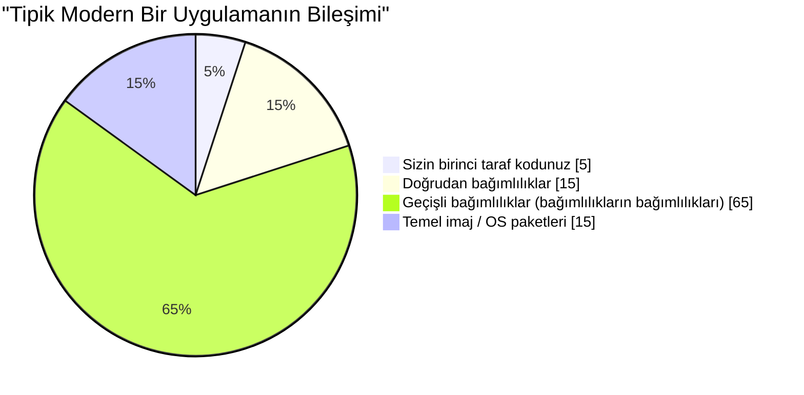

O devasa "geçişli" dilim kilit noktasıdır: siz doğrudan 15 bağımlılığınızı *seçtiniz*, ancak hiç duymadığınız yüzlercesini miras aldınız ve bunlardan herhangi biri güvenliğinizi sona erdirebilir.

### Bölüm 4: Tedarik Zinciri Saldırısının Anatomisi

Son yıllara damgasını vuran felaketler, **SolarWinds** (2020, ele geçirilmiş bir derleme işlem hattı, 18.000 kuruluşa gönderilen imzalanmış güncellemelere bir arka kapı enjekte etti) ve **Log4Shell** (2021, *milyonlarca* uygulamaya yerleştirilmiş bir günlük kütüphanesinde kolayca sömürülebilir bir RCE) [^6], bir şekle sahiptir:

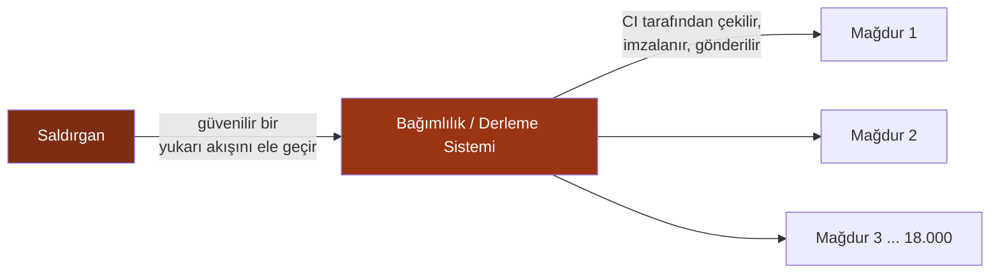

Tek bir ele geçirme, binlerce mağdur, hepsi diğer her şeyi doğru yapmış. Bu asimetri, tedarik zinciri güvenliğinin neden ulusal güvenlik önceliği haline geldiğini ve aşağıdaki savunmaların neden artık karmaşıklık değil, temel gereksinimler olduğunu açıklamaktadır.

### Bölüm 5: Modern Savunmalar - SBOM, İmzalama ve SLSA

Üç iç içe geçmiş uygulama, üç tedarik zinciri sorusunu yanıtlar: *neden içeride, iddia ettiği gibi mi ve nasıl inşa edildiğine güvenebilir miyim*:

| Savunma | Cevapladığı Soru | Nedir |
|---|---|---|
| **SBOM** | *Yazılımımda gerçekten ne var?* | Yazılım Malzeme Faturası, her bileşenin ve sürümün makine tarafından okunabilir bir envanteridir. Bir sonraki Log4Shell düştüğünde, SBOM'larınızda arama yapar ve maruz kalıp kalmadığınızı dakikalar içinde, haftalar değil, öğrenirsiniz. [^7] |
| **Artefakt imzalama** | *Bu artefakt orijinal ve bozulmamış mı?* | Derleme çıktılarını (kriptografik olarak) imzalayın (**Sigstore/Cosign**), böylece tüketiciler Cilt III'ün imzalarını derleme artefaktlarınıza uygulayarak kökenini doğrular. |
| **SLSA** | *Onu inşa eden sürece güvenebilir miyim?* | Yazılım Artefaktları İçin Tedarik Zinciri Seviyeleri, derleme bütünlüğü için dereceli bir çerçeve: kaynak doğrulanmış, derleme izole edilmiş, köken üretilmiş ve imzalanmış. [^8] |

Uçtan uca güvenli işlem hattı, bunları bu serideki her şeyle birleştirir:

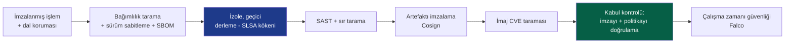

:::warning[CI/CD işlem hattı kendi başına ana hedeftir]
Derleme sisteminiz ilahi ayrıcalıklara sahiptir, her sırrı okuyabilir, her artefaktı imzalayabilir ve üretime dağıtabilir. Sızdırılmış bir CI belirteci, ayrıcalıklı bir çalıştırıcıda güvenilmeyen kodu çalıştıran kötü niyetli bir çekme isteği veya zehirlenmiş bir GitHub Eylemi, *kendi geçerli imzanızla* arka kapılı yazılım göndermeye giden doğrudan bir yoldur. İşlem hattını üretim altyapısı olarak ele alın: en az ayrıcalıklı belirteçler (OIDC ile federasyonlu, kısa ömürlü, Cilt II'ye göre), günlüklerde sır yok, sabitlenmiş eylem sürümleri (SHA yerine, etiket değil) ve güvenilmeyen kod için izole, geçici çalıştırıcılar. Savunmalarınızı derleyen işlem hattı, bir matbaanın neden güven ürettiğiyle aynı nedenle bir hedeftir. [^9]
:::

---

## Bölüm VI: DevSecOps - Güvenliği Sürekli Hale Getirmek

Tüm beş cilt tek bir kültürel değişime odaklanıyor. Eski model, yazılımı en sonda inceleyen ve "hayır" diyen bir güvenlik ekibi, günde bini aşkın dağıtım yapan bir dünyada hayatta kalamaz. **DevSecOps**, güvenlik ekibinin kapısını dağıtır ve uzmanlığını *işlem hattına* yayar, böylece güvenlik otomatikleştirilmiş, sürekli ve herkesin işi olur.

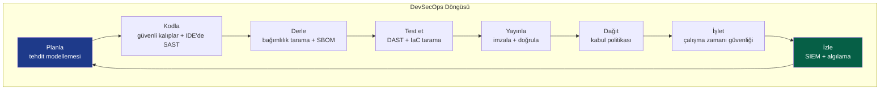

Bu döngüdeki her düğüm bu serinin bir bölümüdür, artık otomatikleştirilmiş ve yerleşik: tehdit modellemesi (I), güvenli kodlama ve kriptografi (III), bağımlılık ve IaC taraması (V), imzalama (III/V), kabul kontrolü ve Sıfır Güven uygulaması (II), çalışma zamanı algılama ve SIEM (IV). Güvenlik bir *aşama* olmaktan çıkar ve işlem hattının bir *özelliği* haline gelir, sürekli kontrol edilir, kodla zorlanır, geçtiğinde görünmez ve yalnızca başarısız olduğunda ses çıkarır.

:::important[Hepsinin kültürel özü]
DevSecOps %20 araçlar ve %80 kültürdür. Kurucu inancı, **güvenliğin departman onayına karşı bir sorumluluk olduğudur.** Güvenli yolu *kolay* yol haline getirerek oraya ulaşırsınız: önceden onaylanmış sertleştirilmiş temel imajlar, varsayılan olarak güvenli şablonlar, kutudan çıktığı gibi uyumlu IaC modülleri ve saniyeler içinde, çekme isteğinde, üç aylık bir denetimde değil, otomatik geri bildirim. Güvenli olanı yapmak, güvensiz olanı yapmaktan *daha az* iş olduğunda, güvenlik ölçeklenir. Bir vergi olduğunda, geliştiriciler her zaman etrafından dolaşır.
:::

---

## Sonuç: Serinin Sentezi

Cilt I'de fiziksel katmanda, duvardaki bir kablo, bir tel üzerindeki bir çerçeve ile başladık ve burada, bir ana bilgisayarın içindeki doksan saniye süren geçici bir kapsayıcıya, ki bu altyapının kendisi yalnızca bir git deposundaki metinden ibarettir, son veriyoruz. Beş cilt boyunca bir gerçek her seviyede arttı:

> **Bir sistemi güvence altına alan tek bir kontrol yoktur. Güvenlik derindir, bağımsız, örtüşen kontroller katmanlarıdır, her biri önündekinin nihayetinde başarısız olacağını varsayar.**

Bu derinliğin aslında ne hale geldiğine bir göz atın:

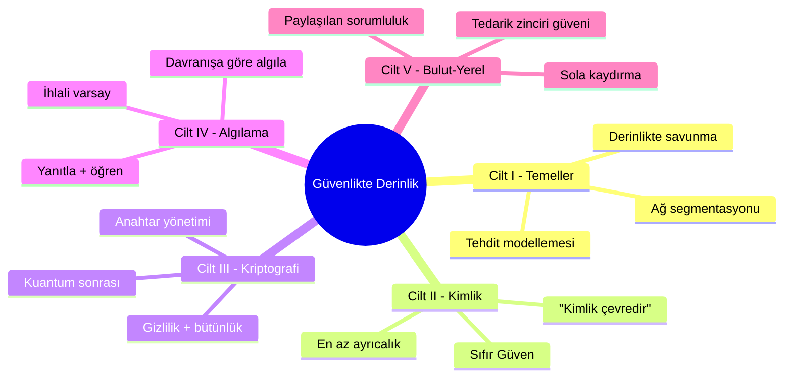

Güvenlik duvarı, ağın ele geçirilebileceğini varsayar, bu yüzden kimlik her isteği doğrular. Kimlik, bir kimlik bilgisinin çalınabileceğini varsayar, bu yüzden kriptografi oturumu değiştirilemez ve ileriye dönük olarak gizli hale getirir. Kriptografi, bir uç noktanın hala sahip olunabileceğini varsayar, bu yüzden algılama onu ele veren davranışı izler. Algılama, iş yükünün kendisinin zehirlenebileceğini varsayar, bu yüzden tedarik zinciri gönderdiğimizin inşa ettiğimiz olduğunu kanıtlar. Bu kontrollerin hiçbiri diğerlerinin mükemmel olduğunu güvenmez ve *mimaride bu güvensizliğin mühendisliği* tüm sanattır.

Çevre dağıldı. Makineler geçici hale geldi. Kod çoğunlukla yabancılardan oluştu. Ve tüm bunların ortasında disiplin sürdü: **savunmalarınızı katmanlayın, her şeyi doğrulayın, ihlali varsayın, kökeni kanıtlayın ve son duvar olacağına asla tek bir duvara güvenmeyin.** Bu, derinlikte güvenliktir. Bu iştir.

Tüm yığın boyunca yürüdüğünüz için teşekkürler. Kırılması zor ve kırılmaya karşı yeterince alçakgönüllü şeyler inşa edin.

---

## Kaynaklar

[^1]: [AWS - Paylaşılan Sorumluluk Modeli](https://aws.amazon.com/compliance/shared-responsibility-model/)
[^2]: [Gartner / CSA - The Egregious Eleven: Top Cloud Security Threats](https://cloudsecurityalliance.org/artifacts/top-threats-to-cloud-computing-egregious-eleven/)
[^3]: [NIST (2017) - SP 800-190: Application Container Security Guide](https://csrc.nist.gov/publications/detail/sp/800-190/final)
[^4]: [Kubernetes - Bulut Yerel Güvenliğe Genel Bakış (4 C'ler)](https://kubernetes.io/docs/concepts/security/overview/)
[^5]: [Open Policy Agent - Gatekeeper](https://open-policy-agent.github.io/gatekeeper/website/docs/)
[^6]: [CISA - Apache Log4j Güvenlik Açığı Kılavuzu](https://www.cisa.gov/uscert/apache-log4j-vulnerability-guidance)
[^7]: [NTIA - Yazılım Malzeme Faturası (SBOM)](https://www.ntia.gov/SBOM)
[^8]: [SLSA - Yazılım Artefaktları İçin Tedarik Zinciri Seviyeleri](https://slsa.dev/)
[^9]: [OWASP - CI/CD Güvenlik Riskleri İlk 10'u](https://owasp.org/www-project-top-10-ci-cd-security-risks/)