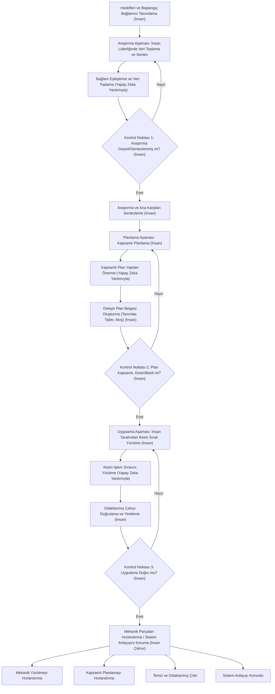

Mühendislik ekiplerinde şu anda sessiz bir fenomen yaşanıyor. Bir geliştirici, karmaşık bir özelliği oluşturmak için bir yapay zeka ajanı kullanıyor. Testler geçiyor. Kod dağıtılıyor. Ancak o geliştiriciye dağıtılan şeyin tam mekanizmasını açıklamasını sorarsanız, zorlanabilir.

Tam olarak anlamadığımız kodları dağıtıyoruz ve bunu yapma hızı benzeri görülmemiş düzeyde.

Son zamanlarda sektördeki tartışmalar—özellikle büyük kurumsal şirketlerde devasa kod tabanlarıyla uğraşan mühendislik liderlerinden gelenler—modern yazılım geliştirme sürecindeki bariz bir paradoksu vurguladı. Yapay zeka araçları, günler süren görevleri saatlere indirdi. Ancak büyük üretim sistemleri kaçınılmaz olarak başarısız oluyor ve bu olduğunda, onu hata ayıklamak için sistemi derinlemesine anlayan bir insana ihtiyaç duyuyorsunuz.

Bir yazılım kriziyle yüzleşen ilk nesil biz değiliz, ancak onu sonsuz bir üretim ölçeğinde yüzleşen ilk nesil biziz.

## "Kolay"ın İllüzyonu

Kod tabanlarımızın neden anlaşılmasının zorlaştığını anlamak için temel bir mühendislik felsefesini yeniden gözden geçirmemiz gerekiyor: *basit* ve *kolay* arasındaki fark.

Rich Hickey (Clojure'un yaratıcısı) tarafından ünlü bir şekilde tanımlandığı gibi, **basit** yapıya atıfta bulunur. Bir bileşenin bir şey yaptığını ve diğerleriyle karışmadığını ifade eder. **Kolay** ise yakınlığa atıfta bulunur. Çözümün parmaklarınızın ucunda olması anlamına gelir — tıpkı npm'den bir paket çekmek, Stack Overflow'dan bir kod parçacığı kopyalamak veya bir LLM'ye istem vermek gibi.

Basitlik, bilinçli düşünce, tasarım ve mimari ayrıştırmayı gerektirir. "Kolay" ise neredeyse hiç düşünme gerektirmez.

Yapay zeka, nihai "kolay" düğmesidir. Bir sohbet arayüzünde işlevsellik eklemek için sıfır sürtünme vardır. Bir yapay zekadan kimlik doğrulama, ardından OAuth eklemesini ve ardından bir oturum hatasını düzeltmesini istersiniz. Kısa süre sonra yazılım mühendisliği yapmıyorsunuz; şişirilmiş bir bağlam penceresini yönetiyorsunuz. Yapay zeka modelleri memnun etmeye istekli olduğu için, kötü mimari kararlara karşı herhangi bir direnç göstermeden en son isteğinizi karşılamak için mantığı dönüştürerek eski kodun üzerine yeni kod katarlar.

Şimdi hız için basitlikten ödün veriyoruz, yalnızca daha sonra devasa karmaşıklıkla bunun bedelini ödüyoruz.

## Yapay Zeka Çağında Kazara Oluşan Karmaşıklık

Fred Brooks'un 1986 tarihli efsanevi makalesi *No Silver Bullet*'ta, yazılım karmaşıklığını iki kategoriye ayırdı:
1.  **Temel Karmaşıklık:** Gerçek iş problemini çözmenin temel zorluğu.
2.  **Kazara Oluşan Karmaşıklık:** Çözümü uygulamaya çalışırken yarattığımız karmaşık geçici çözümler, eski soyutlamalar ve teknik borçlar.

Büyük, yaşlanan bir kod tabanında, bu iki karmaşıklık türü derinden iç içedir. Bunları ayırmak tarihsel bağlam ve insan sezgisi gerektirir.

Yapay zeka oluşturma araçları bununla büyük ölçüde mücadele eder. Bir LLM bir depoyu taradığında, çekirdek bir iş kuralı ile güncelliğini yitirmiş, hileli bir geçici çözüm arasındaki farkı söyleyecek yargıya sahip değildir. Mevcut her deseni korunması gereken kesin bir gereksinim olarak ele alır. Bir yapay zekadan derinlemesine bağlı eski bir sistemi yeniden düzenlemesini isterseniz, genellikle kontrolden çıkar, ya pes eder ya da eski, bozuk desenleri yeni sözdizimi kullanarak yeniden oluşturur.

## Çözüm: Tanıma Dayalı Geliştirme

Temel sorun anlama eksikliği ise, çözüm daha zor istemler vermek veya daha akıllı bir model beklemek değildir. Çözüm, kod üretimiyle olan ilişkimizi tamamen değiştirmektir. Kod yazmaktan *mimari belirlemeye* geçmeliyiz.

Bağlam sıkıştırma veya tanıma dayalı geliştirme olarak da adlandırılan bu metodoloji, yapay zekanın mekanik yazma işini yapmadan önce insanın zorlu düşünme işini yapmasını zorlar. Genellikle üç ayrı aşamayı içerir:

### 1. Yönlendirilmiş Araştırma
Yapay zekadan kod yazmaya başlamasını istemek yerine, ona ilgili mimari diyagramları, belgeleri ve hedeflenmiş kod parçacıklarını beslersiniz. Bağımlılıkları haritalamasını ve uç durumları belirlemesini istersiniz. İnsan olarak, bu analizi doğrulayıp düzeltirsiniz. Çıktı kod değil, doğrulanmış bir araştırma belgesidir.

### 2. Yüksek Doğrulukta Planlama
Araştırmayı kullanarak katı bir uygulama planı taslağı oluşturursunuz. Bu, işlev imzalarını, veri akışlarını ve hizmet sınırlarını tanımlamayı içerir. Bu belge, genç bir geliştiricinin mimari seçimler yapmadan uygulayabileceği kadar kesin olmalıdır. Burası, kazara oluşan karmaşıklığı aktif olarak ortadan kaldırdığınız yerdir.

### 3. Kısıtlanmış Uygulama
Son olarak, kesin, doğrulanmış tanımı uygulamak için yapay zekaya verirsiniz. Yapay zeka sizin planınız tarafından güçlü bir şekilde kısıtlandığı için, "karmaşıklık spirallerine" girmez. Oluşturulan kodu hızlı bir şekilde inceleyebilirsiniz çünkü onu kendi planınıza karşı doğruluyorsunuzdur.

## Mühendisin Geleceği

Yazılım mühendisliğinin en zor kısmı asla sözdizimini yazmak olmamıştır. Her zaman önce *ne* yazılacağını bilmek olmuştur.

Yapay zekayı kritik düşünme aşamasını atlamak için kullanırsak, sistem sezgimiz körelecektir. Belirli bir mimarinin çok kırılgan veya çok sıkı bağlı olduğunu söyleyen zor kazanılmış içgüdümüzü kaybedeceğiz.

Yapay zeka çağında başarılı olacak mühendisler, en yüksek hacimde kod üretenler olmayacaktır. Onlar, inşa ettikleri şeyin derin, yapısal anlayışını sürdüren, mimari dikişleri görebilen ve yapay zekayı mekanikleri hızlandırmak için kullanırken tasarımın basitliğini şiddetle koruyanlar olacaktır.

***
