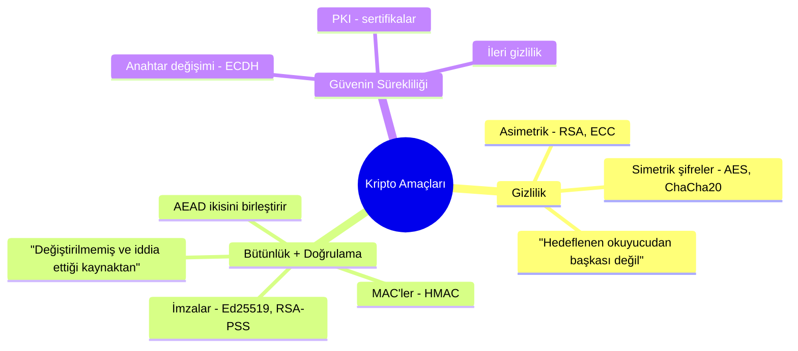
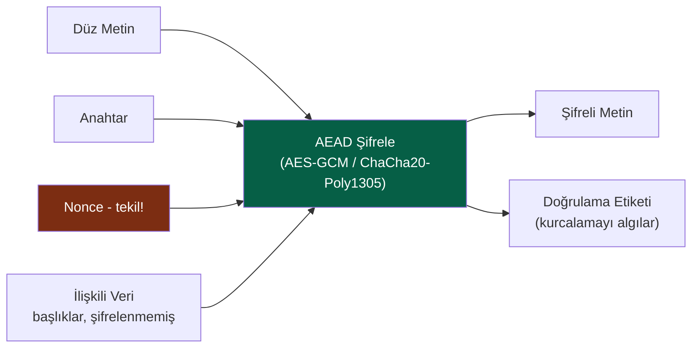
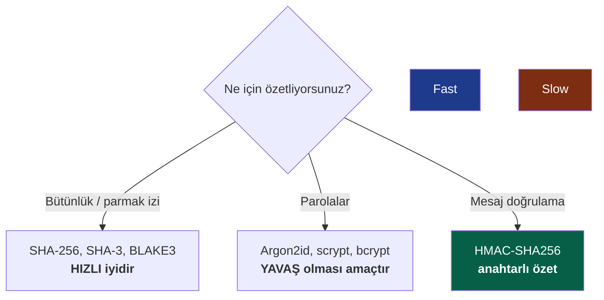
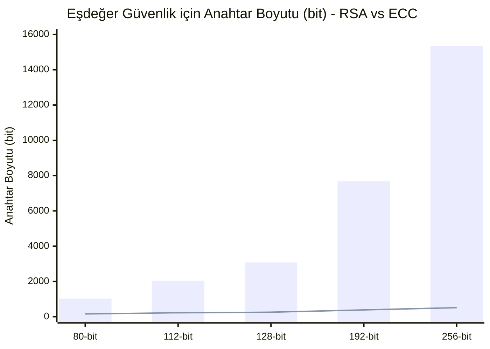
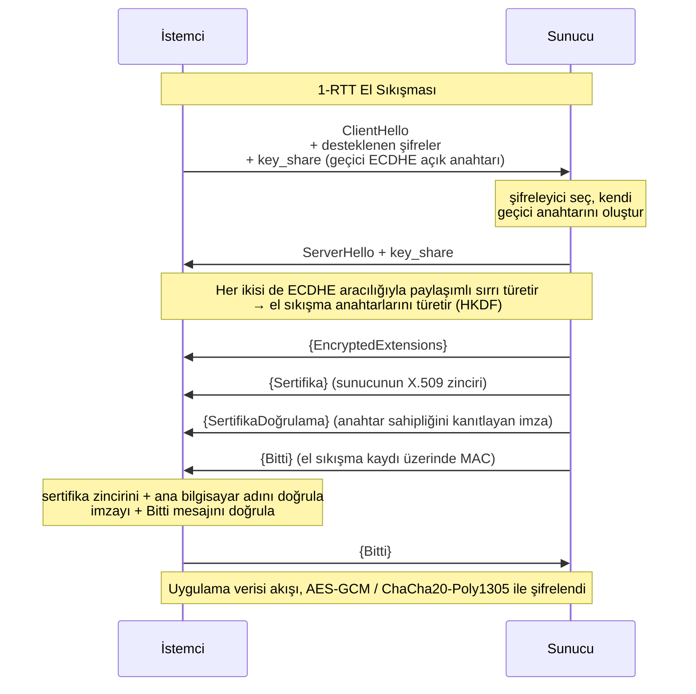
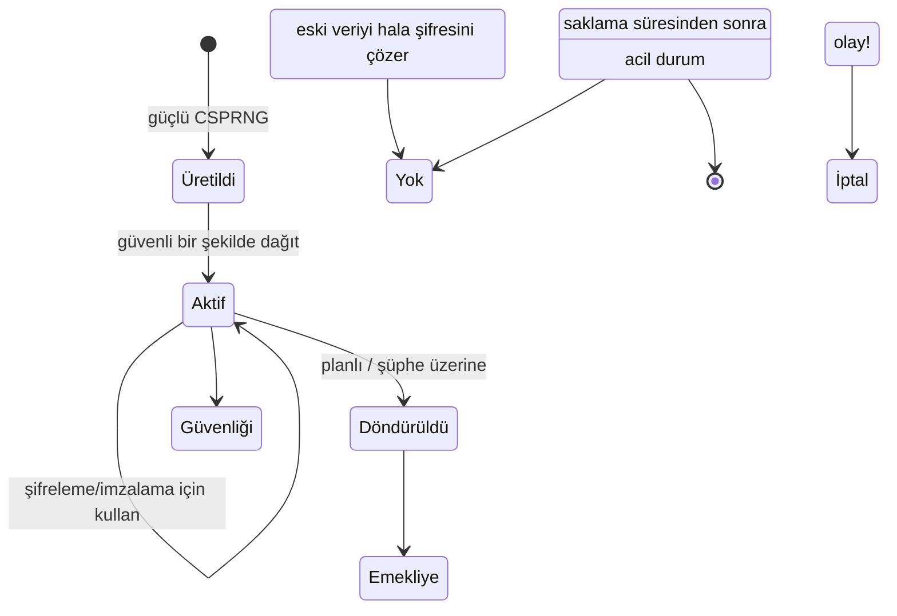
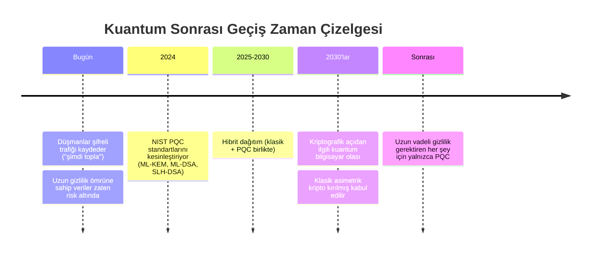
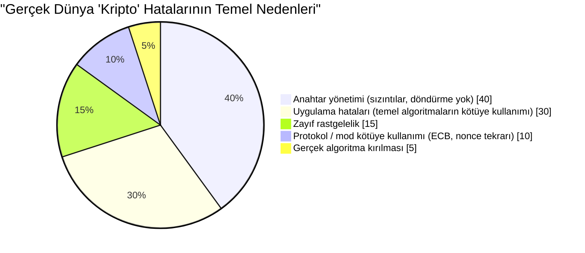

## Sürekli Kapalı Tuttuğumuz Kutu

Bu seri şimdiye dek iki kez kriptografiye yaslandı ve geçiştirdi. [Cilt I](/posts/secure_systems_architecture/) "TLS kullanın" demişti. [Cilt II](/posts/identity_and_access_in_depth/) "imza kaynağa bağlıdır" ve "Argon2id ile özetle" demiş ve geçmişti. Bu cümlelerin her biri, incelikli, narin bir mekanizmayı gizliyordu.

Bu cilt, kutuyu açıyor.

Amaç sizi bir kriptograf yapmak değil; bu yol yıllarca süren matematik ve kendi zekanızdan duyulan sağlıklı bir korkuyla doludur. Amaç sizi bir **kriptografi *mühendisi*** yapmak: hangi temel algoritmanın hangi sorunu çözdüğünü, güvenli varsayılanların neden güvenli olduğunu ve her şeyden önce, felaketle sonuçlanacak bir şey yapmak üzere olduğunuz anı nasıl tanıyacağınızı bilen biri.

:::important[İlk Emir]
**Kendi kriptografinizi icat etmeyin. Kendi temel algoritmalarınızı uygulamayın.** Şifreleyiciyi, modu, dolguyu, rastgele sayı üretecini değil. Güvenli seçimi *varsayılan* seçim haline getiren, doğrulanmış, yüksek seviyeli kütüphaneler (libsodium, Tink, platformun yerel kripto araçları) kullanın. Bu ciltteki her şey, bu kütüphanelerin ne yaptığını anlamanız için var, onları yeniden inşa etmeniz için değil. Tarihteki her felaketle sonuçlanan kripto hatası, bu kuralın kendileri için geçerli olmadığını düşünen bir mühendis ile başladı. [^1]
:::

---

## Bölüm I: Üç Amaç ve Bu Amaçlara Hizmet Eden Temel Algoritmalar

Kriptografinin tamamı, pratikte, üç amacın bir kombinasyonuna hizmet eder:

Dördüncü bir amaç olan **inkar edilemezlik** (daha sonra imzaladığınızı inkar edemezsiniz), özellikle dijital imzalardan ortaya çıkar ve simetrik kriptonun size *veremeyeceği* tek özelliktir, çünkü anahtarı her iki taraf da paylaşır, etiketi ikisi de üretmiş olabilir.

### Bölüm 1: Simetrik Kriptografi - Hızlı, Paylaşımlı ve Modlu

Simetrik kripto, hem şifreleme hem de şifre çözme için **tek bir paylaşımlı anahtar** kullanır. Bu *hızlıdır* (donanım hızlandırmalı AES saniyede gigabaytlarca hızla çalışır) ancak zor bir sorunu vardır: **her iki taraf da aynı anahtarı bir dinleyici görmeden nasıl elde eder?** (Bölüm II bunu yanıtlar.)

Yeni başlayanları zora sokan incelik, **çalışma modları**dır. AES gibi bir blok şifreleyici, tek bir sabit 16 baytlık bloğu şifreler. Gerçek bir şeyi şifrelemek için blokları zincirlersiniz ve güvenlik, zincirleme modunda yaşar veya ölür.

:::warning[ECB pengueni - mod neden önemlidir]
Naif mod olan **ECB (Elektronik Kod Defteri)**, her bloğu bağımsız olarak şifreler. Aynı düz metin blokları, aynı şifreli metin bloklarını üretir. Linux pengueninin bir bitmap'ini ECB ile şifreleyin ve şifreli metinde *pengueni hala görebilirsiniz*, dış hat doğrudan sızar. ECB, yapıya sahip herhangi bir verinin gizliliğini yok eder. Kodda `AES/ECB` görürseniz, bunu bir hata olarak kabul edin. [^2]
:::

Modern çözüm, gizlilik *ve* bütünlüğü tek bir temel algoritmada birleştiren **AEAD (İlişkili Verilerle Doğrulanmış Şifreleme)**'dir, böylece birini diğeri olmadan elde edemezsiniz:

Başvurmanız gereken iki AEAD şifreleyici:

| Şifreleyici | Güçlü Yönler | Dikkat Edilmesi Gerekenler |
| --- | --- | --- |
| **AES-256-GCM** | Her yerde donanım hızlandırmalı (AES-NI), yaygın | **Nonce tekrarı felaketle sonuçlanır**, aynı anahtar altında bir nonce'u tekrarlamak doğrulama anahtarını ve düz metin XOR'unu sızdırır |
| **ChaCha20-Poly1305** | *Yazılımda* hızlı (AES-NI olmayan mobil/IoT cihazlarda harika), tasarımsal olarak sabit zamanlı | Aynı nonce-tekilliği gereksinimi |

:::caution[Nonce bir sır değildir, ancak tekil olmalıdır]
Bir **nonce** (bir kez kullanılan sayı) sır olmak zorunda değildir, açık metin olarak gönderilir. Ancak belirli bir anahtar altında **asla tekrarlanmamalıdır**. GCM'nin 96 bitlik rastgele nonce'u ile, aynı anahtar altında yaklaşık $2^{32}$ mesajdan sonra doğum günü sınırı çakışmaları gerçek bir risk haline gelir. Güvenli kalıplar: bir *sayaç* nonce'u kullanın (tekilliği garantilidir), anahtarları sınırdan çok önce döndürün veya **AES-GCM-SIV** gibi nonce-kötüye kullanıma dirençli bir mod kullanın. [^3]
:::

### Bölüm 2: Özetleme (Hashing) - Tek Yönlü Cadde

Kriptografik bir özet, rastgele girdiyi sabit boyutlu bir özetlemeye dönüştürür, öyle ki (a) tersine çevirmek, (b) aynı özetlemeye sahip iki girdi bulmak (**çarpışma direnci**) veya (c) belirli bir özetlemeye uyan bir girdi bulmak (**ön görüntü direnci**) imkansızdır.

İnsanların sürekli karıştırdığı üç kullanım ve bunlar için *farklı* işlevlere ihtiyaç vardır:

Can alıcı nokta burası: **dosya bütünlüğü için en hızlı güvenli özeti istersiniz; parolalar için en yavaşı.** Parolalar için SHA-256 kullanmak bir güvenlik açığıdır (bir GPU saniyede milyarlarca parola kırar); bir dosya sağlama toplamı için Argon2id kullanmak ise anlamsızca yavaştır. Aynı kelime, "özet", zıt gereksinimler.

**MAC'ler** bir anahtar ekler, böylece sırrı elinde tutan kişi etiketi üretebilir veya doğrulayabilir; bu, bütünlük *ve* doğrulamadır. **HMAC** kullanın ve etiketleri her zaman **sabit zamanlı bir karşılaştırma** ile karşılaştırın; erken çıkışlı bir `==` ifadesi, bir saldırganın etiketleri bayt bayt taklit etmek için kullanabileceği zamanlama bilgilerini sızdırır.

$$
\text{HMAC}(K, m) = H\big((K \oplus opad)\,\|\,H((K \oplus ipad)\,\|\,m)\big)
$$

Çift özetleme yapısı bir süsleme değildir; aksi takdirde bir saldırganın basitçe anahtarlanmış bir `H(K \| m)` yapısına veri eklemesine izin verecek **uzunluk-genişletme saldırılarına** karşı savunma yapar.

### Bölüm 3: Asimetrik Kriptografi - Anahtar Değişimi Sorununu Çözmek

Asimetrik (açık anahtarlı) kripto, **anahtar çifti** kullanır: serbestçe paylaştığınız bir açık anahtar ve hayatınızla koruduğunuz bir özel anahtar. Herkes açık anahtarınızla şifreleyebilir; yalnızca özel anahtarınız şifreyi çözebilir. Veya: özel anahtarınızla imzalarsınız; herkes açık anahtarınızla doğrular.

*   **RSA** - klasik. Güvenliği, büyük tam sayıları çarpanlarına ayırmanın zorluğuna dayanır. Şimdi *büyük ve yavaş* olarak kabul edilir, 128 bit güvenlik için 3072 bit anahtarlar. İyi, ama ağır.
*   **Eliptik Eğri Kriptografisi (ECC)** - aynı güvenlik seviyesini önemli ölçüde daha küçük anahtarlarla sunar, çünkü bit başına daha zor olan eliptik eğri ayrık logaritma problemine dayanır. **256 bitlik bir ECC anahtarı ≈ 3072 bitlik bir RSA anahtarıdır**.

Yüksek güvenlik seviyelerinde çubuklar (RSA) ve çizgi (ECC) arasındaki uçurum, modern protokollerin eliptik eğrilere varsayılan olarak yönelmesinin nedenidir: imzalar için **Ed25519**, anahtar değişimi için **X25519**, her ikisi de hızlı, küçük ve kötüye kullanımı zor olacak şekilde tasarlanmıştır [^4].

:::note[Asimetrik kripto verilerinizi nadiren doğrudan şifreler]
Açık anahtar işlemleri yavaş ve boyut sınırlıdır. Pratikte neredeyse hiçbir zaman bir dosyayı RSA ile şifrelemezsiniz. Asimetrik kriptoyu **simetrik bir anahtarı değiş tokuş etmek veya sarmak** için kullanır, ardından toplu veriyi hızlı AEAD ile şifrelersiniz. Bu, **hibrit şifreleme**dir ve TLS, PGP, age ve her mantıklı sistemin fiilen yaptığı şey budur.
:::

---

## Bölüm II: Anahtar Değişimi ve TLS 1.3 El Sıkışması

Şimdi simetrik kriptonun yapamadığı soruyu yanıtlayabiliriz: bir saldırganın izlediği bir hat üzerinden iki yabancı, ortak bir sır üzerinde nasıl anlaşır?

### Bölüm 4: Diffie-Hellman ve İleri Gizlilik

**Diffie-Hellman (DH)**, bunun kalbindeki güzel hiledir. Her iki taraf da kendi özel sırrını diğerinin açık değeriyle karıştırır ve cebir sayesinde *aynı* paylaşımlı sırra ulaşır; her iki açık değeri de gören bir dinleyici ise bunu hesaplayamaz.

Can alıcı özellik **(Mükemmel) İleri Gizlilik**'tir. Her oturum, daha sonra atılan *geçici* bir DH anahtar çifti (ECDHE, "E" geçici demektir) kullanıyorsa, bir saldırgan bugün tüm şifrelenmiş trafiğinizi kaydetse *ve gelecek yıl uzun vadeli özel anahtarınızı çalsa bile*, kaydedilen oturumları yine de çözemez. Oturum anahtarları, oturumlarla birlikte öldü.

:::important[İleri gizlilik neden artık müzakere edilemez]
"`Şimdi kaydet, sonra çöz`" gerçek, finanse edilmiş bir düşman stratejisidir, özellikle kuantum bilgisayarlar ufukta belirmişken (Bölüm 7). İleri gizlilik, sunucu anahtarınızın sızdırıldığı gün, bugünkü ele geçirilmiş şifreli metnin bir yükümlülük haline gelmemesi anlamına gelir. TLS 1.3, ileri gizliliği olan ECDHE'yi **zorunlu** kılar; eski statik-RSA anahtar değişimi (ileri gizlilik yoktu) tamamen kaldırılmıştır. [^5]
:::

### Bölüm 5: Gerçek TLS 1.3 El Sıkışması

İşte "TLS kullanın" deyip durduğumuz el sıkışması, gerçeği. TLS 1.3, gidiş dönüşleri ikiden bire indirdi ve her türlü güvenli olmayan seçeneği kaldırdı [^5]:

Her adım yerini hak eder:

*   **İlk mesajdaki `key_share`** - istemci grubu *tahmin eder* ve geçici anahtarını hemen gönderir; TLS 1.3 böylece bir gidiş dönüşü kurtarır.
*   **`Sertifika` + `SertifikaDoğrulama`** - sertifika, sunucunun kimliğini bir açık anahtara bağlar (Cilt II'deki PKI zinciri aracılığıyla); *imza* ise sunucunun eşleşen özel anahtarı gerçekten tuttuğunu kanıtlar. Özel anahtarı olmayan çalınmış bir sertifika işe yaramaz.
*   **`Bitti`** - tüm el sıkışma kaydı üzerinde bir MAC. Eğer bir aradaki adam saldırganı *herhangi bir* önceki mesajla (örneğin, güçlü şifreleyicileri kaldıran bir sürüm düşürme saldırısı) oynadıysa, kayıtlar eşleşmeyecek ve el sıkışması iptal edilecektir.

:::tip[TLS 1.3'ün sildikleri, korudukları kadar önemlidir]
TLS 1.3, RSA anahtar değişimini, statik DH'yi, CBC modlu şifreleyicileri, RC4'ü, MD5'i, SHA-1'i, sıkıştırmayı (güle güle CRIME/BREACH) ve yeniden müzakereyi kaldırdı. Tasarım felsefesi: **daha az ayar, kendinizi bir ihlale yanlış yapılandırmak için daha az yol demektir.** Güvenli olmayan seçenekleri olmayan bir protokol, güvenli olmayana ikna edilemez. TLS 1.0/1.1'i her yerde devre dışı bırakın; 1.3'ü tercih edin, 1.2'ye yalnızca eski istemciler için izin verin.
:::

---

## Bölüm III: Anahtar Yönetimi - Teori Gerçeklikle Buluştuğunda

Uygulamalı kriptografinin kirli sırrı: **algoritmalar neredeyse hiçbir zaman zayıf nokta değildir. Anahtar yönetimidir.** AES-256 hiçbir zaman kırılmamıştır. Ancak anahtarlar git'e işlenir, loglanır, e-postayla gönderilir, sabit kodlanır ve asla döndürülmez. Yaşam döngüsü, disiplindir:

Temel uygulamalar:

::::steps

:::step[Gerçek bir CSPRNG'den Üret]{subtitle="Doğum"}
Anahtarlar, **kriptografik olarak güvenli** bir rastgele kaynaktan (`/dev/urandom`, `getrandom()`, platform CSPRNG) gelmelidir. Asla `Math.random()`, asla bir zaman damgası tohumu, asla "akıllı" bir PRNG kullanmayın. Tahmin edilebilir rastgelelik, "kırılamaz" kriptonun basitçe kırılmasının en yaygın tek temel nedenidir.
:::

:::step[Bir KMS veya HSM'de Sakla]{subtitle="Muhafaza"}
Bir **Donanım Güvenlik Modülü (HSM)** veya bulut **KMS**, anahtarı *hiçbir zaman* açık metin olarak sınırın dışına çıkmayacak şekilde saklar; veriyi imzalama/şifre çözme için *ona* gönderirsiniz. Bu, uygulama sunucunuza sahip olan bir saldırganın ham anahtarı yine de dışarı sızdıramayacağı anlamına gelir.
:::

:::step[Ölçek için zarf şifrelemesi kullanın]{subtitle="Yapı"}
Veriyi nesne başına bir **Veri Şifreleme Anahtarı (DEK)** ile şifreleyin; her DEK'i KMS'de tutulan merkezi bir **Anahtar Şifreleme Anahtarı (KEK)** ile şifreleyin. Döndürmek için, petabaytlarca veri yerine küçük DEK'leri yeniden şifrelersiniz. Her büyük bulut, bekleyen veriyi bu şekilde şifreler.
:::

:::step[Döndürün ve *hızlı* döndürebilin]{subtitle="Bakım"}
Döndürme otomatik ve kesintiye yol açmayacak şekilde olmalı, şifreli metin bir anahtar kimliği ile etiketlenmelidir, böylece geçiş sırasında eski ve yeni anahtarlar bir arada bulunabilir. Bir anahtarı dakikalar içinde döndürebilen organizasyon bir sızıntıdan kurtulur; haftalar süren bir geçişe ihtiyaç duyan ise kendi mimarisinin rehinesi olur.
:::

::::

:::warning[Tarihe geçen rastgelelik hataları]
2008 Debian OpenSSL: iyi niyetli bir yama, entropi kaynağını etkisiz hale getirerek anahtar alanını ~32.767 olasılığa düşürdü, iki yıl boyunca üretilen her SSH ve TLS anahtarı tahmin edilebilirdi. 2010: Sony'nin PS3'ü ECDSA imzalarında sabit bir nonce'u yeniden kullandı ve ana imzalama anahtarını sızdırdı. Kalıp ebedidir: **kriptografi, şifreleyici değil, rastgelelik ve yeniden kullanım noktalarında başarısız olur.** [^6]
:::

---

## Bölüm IV: Kuantum Ufku

Bu ciltteki her asimetrik temel algoritma; RSA, ECC, Diffie-Hellman, yeterince büyük bir **kuantum bilgisayar**'ın **Shor algoritmasını** çalıştırarak verimli bir şekilde çözebileceği bir matematik problemine (çarpanlara ayırma, ayrık logaritma) dayanır. Bu makine henüz mevcut değil. Ancak tehdit şimdiden burada.

### Bölüm 7: Şimdi Topla, Sonra Şifreyi Çöz

Kuantum tehdidindeki asimetrik ayrım:

*   **Asimetrik kripto (RSA, ECC, DH)** - Shor algoritması tarafından *kırılır*. Bu bir acil durumdur.
*   **Simetrik kripto (AES) ve özetler (SHA-2/3)** - yalnızca güvenlik seviyesini yarıya indiren Grover algoritması tarafından *zayıflatılır*. Çözüm basittir: **AES-256** (kuantum sonrası 128 bit güvenliği korur) ve 384 bit+ özetler kullanın. Simetrik kripto temelde iyidir.

2024'te NIST, ilk kuantum sonrası algoritmaları standartlaştırdı [^7]:

*   **ML-KEM** (Kyber) - anahtar kapsüllemesi, ECDH anahtar değişiminin yerine geçer.
*   **ML-DSA** (Dilithium) ve **SLH-DSA** (SPHINCS+) - dijital imzalar.

:::note[Bugün için pragmatik adım: hibrit]
Hiç kimse bir gecede yalnızca PQC'ye geçmez, yeni algoritmalar daha genç ve daha az denenmiştir. Sektörün cevabı **hibrit anahtar değişimi**dir: klasik X25519 *ve* ML-KEM'i birlikte çalıştırarak her iki paylaşımlı sırrı birleştirin, böylece oturum *her ikisi de* kırılmadıkça güvenli olur. Chrome, Cloudflare ve diğerleri zaten varsayılan olarak X25519+ML-KEM'i kullanır. On yıldan fazla gizlilik gerektiren kripto temin ediyorsanız, satıcılarınıza PQC yol haritalarını **şimdi** sorun. [^8]
:::

---

## Bölüm V: Utanç Salonu - Mühendisler İyi Kriptoyu Nasıl Bozar?

Algoritmalar sağlamdır. Gerçek sistemler yine de nasıl ölür, işte aslında neden olacağınız veya incelemede bulacağınız hatalara dair bir saha rehberi:

| Anti-kalıp | Neden sizi öldürür | Çözüm |
| --- | --- | --- |
| **Kendi kriptonuzu yazmak** | İnce bir detayı yanlış yapacaksınız; saldırganlar bunu kaçırmayacak | libsodium / Tink / platform kriptosunu kullanın |
| **ECB modu** | Düz metin yapısını sızdırır (penguen) | AEAD: AES-GCM / ChaCha20-Poly1305 |
| **Nonce / IV tekrarı** | GCM altında felaketle sonuçlanan anahtar/düz metin sızıntısı | Sayaç nonce'ları veya AES-GCM-SIV |
| **Zayıf rastgelelik** | Tahmin edilebilir anahtarlar = hiç anahtar yok demektir | Yalnızca CSPRNG, asla `Math.random()` değil |
| **Parolalar için SHA-256** | GPU saniyede milyarlarca kırar | Argon2id / scrypt / bcrypt |
| **MAC/etiket karşılaştırması için `==`** | Zamanlama yan kanalı etiketleri taklit eder | Sabit zamanlı karşılaştırma |
| **Sertifikaları doğrulamamak** | `verify=False` MitM kapısını yeniden açar | Zinciri + ana bilgisayar adını + sona erme tarihini doğrula |
| **İleri gizlilik yok** | Bir anahtar sızıntısı tüm geçmişi çözer | Geçici ECDHE (TLS 1.3) |
| **Doğrulamadan şifrele** | Dolgu-oracle ve bit-çevirme saldırıları | AEAD veya şifrele-sonra-MAC |

Bu grafiği tekrar okuyun. **Gerçek algoritma kırılmaları en küçük dilimi oluşturur.** "Kripto hatalarının" yüzde doksan beşi, mühendislik hataları, anahtar işleme, kötüye kullanım, rastgelelik gibi, tamamı *sizin* kontrolünüzde olan ve bu ciltteki disiplinler tarafından kapsanan hatalardır.

:::important[Önemli Çıkarım]
İyi kriptografi, matematiği bilmekle ilgili değildir. Matematiğin dayattığı **sınırları gözetmekle** ilgilidir: tekil nonce'lar, gizli anahtarlar, gerçek rastgelelik, doğrulanmış şifreli metin, doğrulanmış sertifikalar, ileri gizlilik, döndürme. Bu sınırları doğrulanmış kütüphanelerle doğru bir şekilde belirlerseniz, daha akıllı insanların onlarca yıl sertleştirdiği temel algoritmaların tüm gücünü miras alırsınız. Bir sınırı aşarsanız, hiçbir algoritma sizi kurtaramaz.
:::

---

## Sonuç ve İlerideki Yol

Artık güveni temel algoritmalarından yukarı doğru inşa ettik: sırları saklayan şifreleyiciler, kimliği kanıtlayan imzalar, düşmanca bir hat üzerinden onları bir araya getiren el sıkışması, her şeyi dürüst tutan anahtar yaşam döngüsü ve şimdiden gölgesini düşüren kuantum hesaplaşması.

Ancak kriptografi, kimlik ve ağ duvarları hep *önleyici* kontrollerdir. Saldırganı dışarıda tutabileceğinizi varsayarlar. **Cilt IV**, her tecrübeli savunucunun benimsediği karşıt önermeyi kabul eder: *ihlali varsayımı.* Mavi takımın operasyonel gerçekliğine, tespit mühendisliğine, MITRE ATT&CK çerçevesine, tehdit avcılığına, SIEM/SOAR boru hatlarına ve önlemenin başarısız olması durumunda (olursa değil, olduğu zaman) çalıştırdığınız olay müdahale ve adli tıp kılavuzlarına geçiyoruz.

Önleme, tamamen tutamayacağınız bir sözdür. Tespit, bunu bozduğunuzda nasıl hayatta kalacağınızdır.

---

## Referanslar

[^1]: [Latacora - Cryptographic Right Answers](https://www.latacora.com/blog/2018/04/03/cryptographic-right-answers/)
[^2]: [Filippo Valsorda / Wikipedia - Block cipher mode of operation (ECB penguin)](https://en.wikipedia.org/wiki/Block_cipher_mode_of_operation#Electronic_codebook_(ECB))
[^3]: [IETF - RFC 8452: AES-GCM-SIV Nonce Misuse-Resistant AEAD](https://datatracker.ietf.org/doc/html/rfc8452)
[^4]: [Bernstein, D. J. et al. - Ed25519 & Curve25519](https://ed25519.cr.yp.to/)
[^5]: [IETF - RFC 8446: The Transport Layer Security (TLS) Protocol Version 1.3](https://datatracker.ietf.org/doc/html/rfc8446)
[^6]: [Debian - DSA-1571-1 openssl predictable random number generator](https://www.debian.org/security/2008/dsa-1571)
[^7]: [NIST (2024) - Post-Quantum Cryptography Standards (FIPS 203/204/205)](https://csrc.nist.gov/projects/post-quantum-cryptography)
[^8]: [Cloudflare - The state of the post-quantum Internet](https://blog.cloudflare.com/pq-2024/)