## Her Şeyi Değiştiren Varsayım

İlk üç cilt, özünde iyimserdi. [Cilt I](/posts/secure_systems_architecture/) duvarlar ördü. [Cilt II](/posts/identity_and_access_in_depth/) her kapıya bir nöbetçi dikti. [Cilt III](/posts/cryptography_engineering_in_depth/) aralarındaki mesajları taklit edilemez kıldı. Bunların hepsi *önleyiciydi* ve hepsi saldırganı dışarıda tutma önermesine dayanıyordu.

Bu cilt, o iyimserliğin bittiği yerde, her deneyimli savunmacının ruhuna kazınmış olan o cümleyle başlıyor:

> **İhlali varsayın.** Yeterli zaman, bütçe ve motivasyon verildiğinde, kararlı bir saldırgan içeri girer. Soru, saldırıya uğrayıp uğramayacağınız değil, *ne kadar hızlı fark edeceğiniz ve ne kadar iyi yanıt vereceğinizdir.*

Endüstri bunu iki acımasız rakamla ölçer: **MTTD** (Ortalama Tespit Süresi) ve **MTTR** (Ortalama Müdahale Süresi). İlk sızmadan tespite kadar olan 2024 endüstri ortalaması, hala *günler ile haftalar* arasında ölçülmektedir. Bu zaman aralığında saldırgan yanal hareket eder, ayrıcalıklarını yükseltir ve veri sızdırır. Bu cilt, bu süreyi kısaltmak üzerinedir.

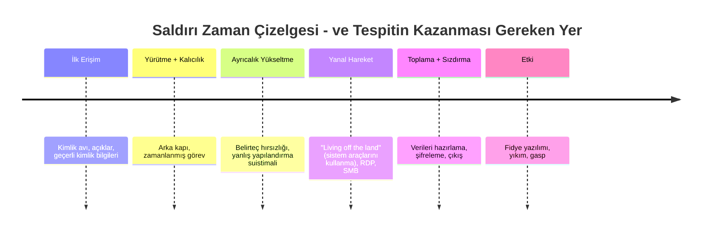

Tespit süresinden kıstığınız her saat, saldırganın o zaman çizelgesinde kazanamadığı bir saattir. Mavi takıma hoş geldiniz.

---

## Bölüm I: Telemetri - Göremediğinizi Tespit Edemezsiniz

Tespit, akıllı analitiklerden önce bir veri problemidir. Eğer kanıtlar hiç toplanmadıysa, hiçbir algoritma onları geri getiremez. Bu yüzden mavi takımın ilk işi **görünürlüktür**: altyapıyı doğru sinyalleri yayacak şekilde donatmak.

### Bölüm 1: Hakikat Kaynakları

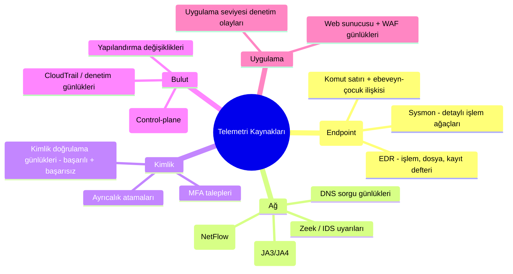

**Savunmacının Bakış Açısı:** Tüm günlükler eşit değildir. En değerli telemetri, *davranışı* yakalayan türdür; özellikle **ebeveyn-çocuk ilişkisi içeren işlem komut satırları** (Sysmon Olay Kimliği 1) ve **kimlik doğrulama olayları**. Bir güvenlik duvarı günlüğü size bir bağlantının gerçekleştiğini söyler; bir işlem ağacı ise size `winword.exe`'nin `powershell.exe`'yi, onun da `cmd.exe`'yi çalıştırarak kodlanmış bir komut yürüttüğünü söyler; bu bir hikayedir ve hikaye, tespittir.

:::important[Günlüğe kaydetme bir kapsam problemidir - haritalandırın]
Klasik hata *sessiz boşluklardır*: altyapınızın %80'ini günlüğe kaydedersiniz ve ihlal kalan %20'lik kısımda gerçekleşir. Bir **günlükleme kapsamı matrisi** (kaynak × veri tipi × saklama süresi) tutun ve boşlukları bir güvenlik açığı olarak değerlendirin. İhtiyacı olan veri hiç alınmadıysa, bir tespit kuralı değersizdir. Kapsamınızı, yama seviyelerini denetlediğiniz gibi denetleyin.
:::

### Bölüm 2: SIEM Hattı

Bir **SIEM** (Güvenlik Bilgi ve Olay Yönetimi), kümelenme beynidir: yukarıdaki her şeyi alır, ortak bir şemaya göre normalleştirir, kaynaklar arasında ilişkilendirir ve uyarılar üretir. Modern hat:

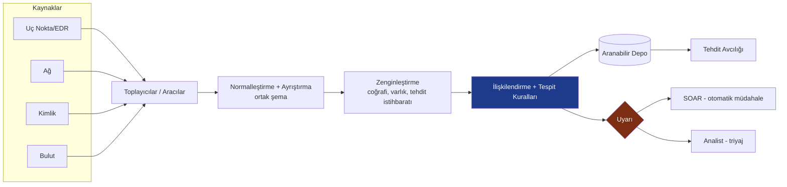

**Zenginleştirme** adımı, sessizce en değerli olanıdır: bir IP adresi, Tor çıkış düğümü olduğunu, varlığın bir etki alanı denetleyicisi (domain controller) olduğunu ve kullanıcının normalde başka bir kıtadan giriş yaptığını bilene kadar gürültüdür. Zenginleştirme veriyi *bağlama* dönüştürür ve bağlam, bir uyarıyı yok sayılabilir olmaktan çıkarıp harekete geçirilebilir kılar.

---

## Bölüm II: Tespit Mühendisliği

Bir SIEM satın almak, size bir piyano satın almanın müzik vermesi gibi, tespit sağlamaz. **Tespit mühendisliği**, telemetriyi uyarılara dönüştüren kuralları yazma, test etme ve sürdürme disiplinidir; tespitleri kod gibi ele alır.

### Bölüm 3: MITRE ATT&CK - Ortak Dil

**MITRE ATT&CK**, alanın paylaşılan haritasıdır: gerçek sızmalarda gözlemlenen saldırgan **Taktiklerinin** (neden, örn. Kalıcılık, Yanal Hareket) ve **Tekniklerinin** (nasıl, örn. T1053 Zamanlanmış Görev) matrisidir [^1]. Bu, kırmızı takımın, mavi takımın ve tehdit istihbaratının aynı dili konuşmasını sağlayan bir Rosetta Taşı'dır.

Savunmacının güç hamlesi, kör noktaları ortaya çıkarmak için tespit kurallarınızı matrisin üzerine bindiren **kapsam eşlemedir**:

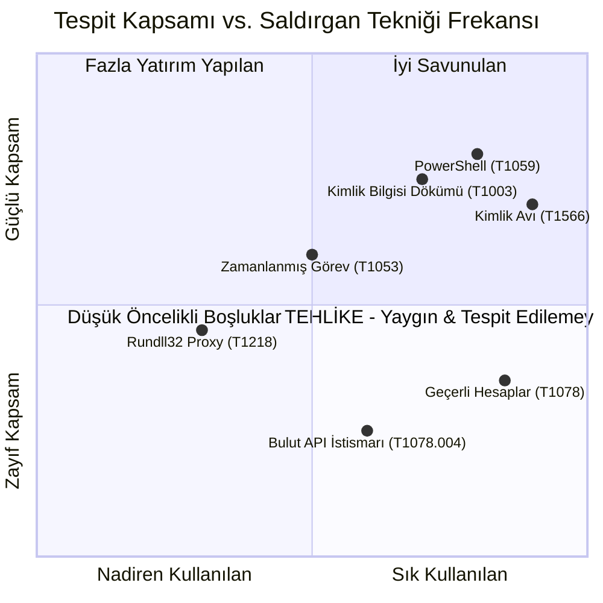

4. çeyrek, **zayıf kapsama sahip yaygın teknikler**, önceliklendirilmiş iş listenizdir. Küçük bir mavi takım sınırlı çabasını böyle dağıtır: egzotik tekniklerin peşinden koşmadan önce, saldırganların fiilen yaptığı ve sizin henüz yakalayamadığınız şeyleri savunun.

### Bölüm 4: Acı Piramidi

Tüm tespitler, *saldırgana ne kadar acı verdiği* konusunda eşit değildir. David Bianco'nun **Acı Piramidi**, göstergeleri, tespit ettiğinizde bir saldırganın bunları değiştirmesinin ne kadar maliyetli olduğuna göre sıralar [^2]:

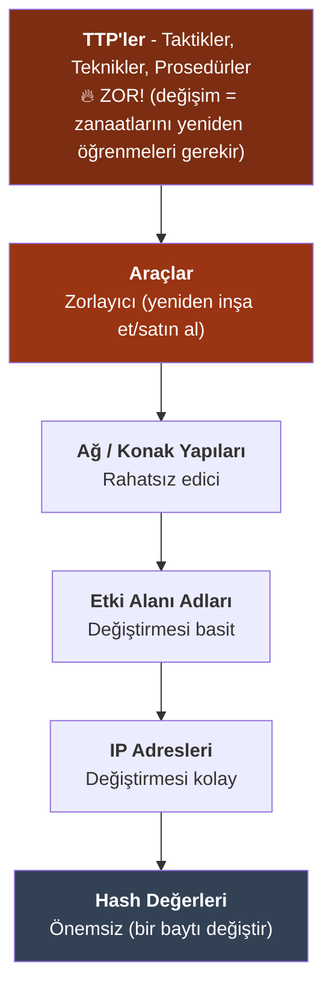

Bu ders stratejiyi yeniden şekillendirir. Bir dosya **hash** değerini engellemek tatmin edici hissettirir ancak saldırgan onu saniyeler içinde yeniden derler ve engeli aşar. "İnternete ulaşan bir betik motoru başlatan herhangi bir Office uygulaması" gibi bir **davranışı** tespit etmek, saldırganı tüm bir *tekniği* terk etmeye zorlar. **Sadece göstergeler üzerinde değil, davranış üzerinde tespit yapın.** Tespitiniz piramitte ne kadar yukarıdaysa, saldırganın kaçması o kadar maliyetli olur.

:::tip[Kod olarak tespit]
Tespitleri yazılım gibi ele alın: onları taşınabilir bir formatta (**Sigma** kuralları) yazın, **git** içinde saklayın, kod incelemesinden geçirin ve yanlış pozitifleri ölçmek için hem bilinen zararlı örnekler hem de (kritik olarak) iyi huylu aktiviteler üzerinde *test edin*. %40 yanlış pozitif oranına sahip bir tespit, tespitsizlikten daha kötüdür; analistleri "yoksay" butonuna tıklamaya şartlandırır. Kuralları, herhangi bir üretim kodunda yapacağınız gibi sürümleyin, test edin ve emekli edin. [^3]
:::

### Bölüm 5: Sinyal-Gürültü Savaşı

Tespitin sonsuz gerilimi, gerçek saldırıları yakalamak (gerçek pozitifler) ile analistleri yanlış alarmlara boğmak arasındaki dengedir:

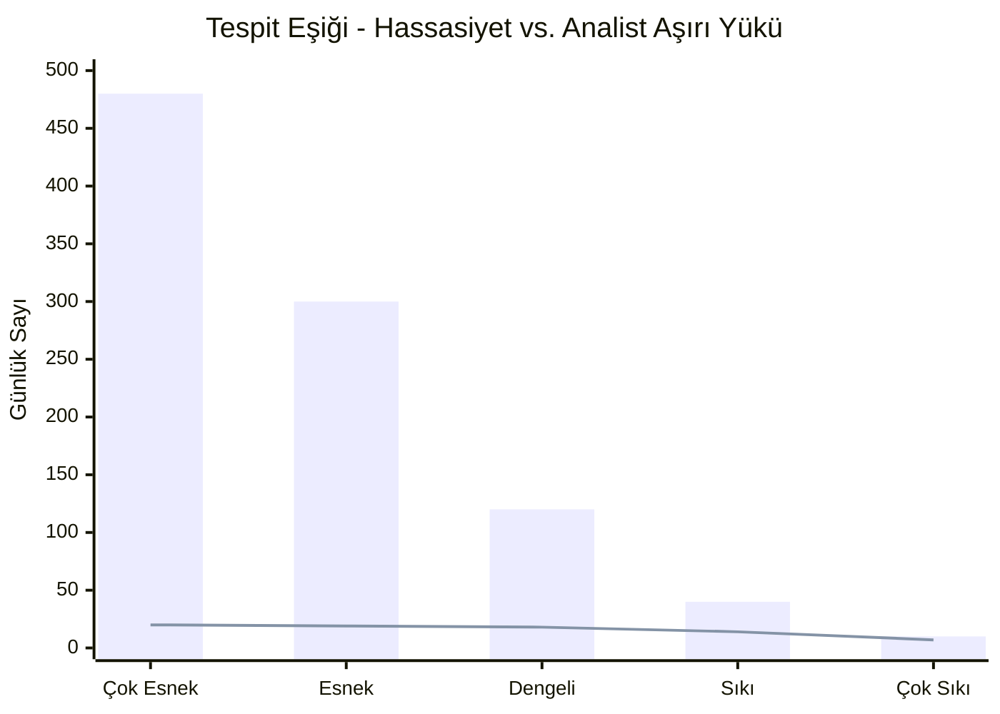

Çubuklar toplam uyarıları; çizgi ise *gerçek* pozitifleri gösterir. Çok esnek ayarlarsanız (sol), analistler 20 gerçek uyarıyı bulmak için 480 uyarıyı triyajdan geçirir, tükenirler ve "otomatik onaylamaya" başlarlar. Çok sıkı ayarlarsanız (sağ) gerçek saldırıları kaçırırsınız. **Uyarı yorgunluğu sadece bir İK problemi değil, bir güvenlik kontrolü başarısızlığıdır.** Amaç maksimum uyarı değil, *analist saati başına maksimum gerçek pozitif* almaktır; SOAR'ın (sonraki bölüm) var olma sebebi budur.

---

## Bölüm III: SOC - Makine Hızında Müdahale

### Bölüm 6: Kademeli Operasyonlar ve SOAR

Bir **Güvenlik Operasyonları Merkezi (SOC)**, uyarı akışında yaşayan ekip ve süreçtir. Klasik yapı ve modern otomasyonu:

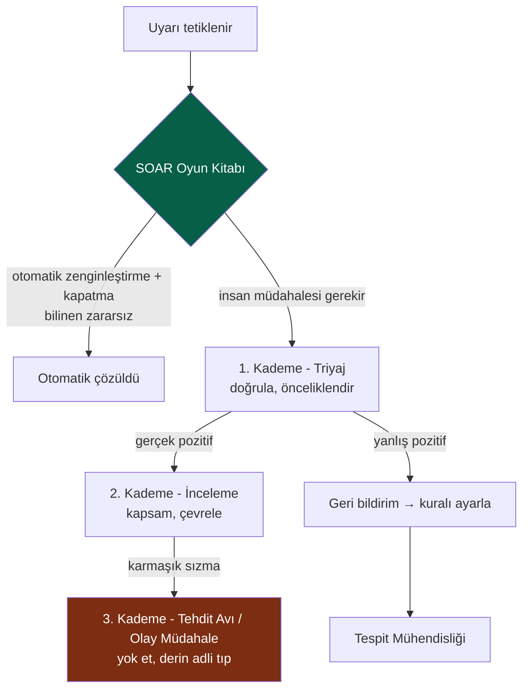

**SOAR** (Güvenlik Düzenleme, Otomasyon ve Müdahale), güç çarpanıdır. Bir uyarıyı zenginleştiren, bağlam toplayan ve hatta (bir ana bilgisayarı izole etmek, bir hesabı devre dışı bırakmak, bir IP'yi engellemek gibi) insanı beklemeden sınırlayıcı eylemler alan *oyun kitaplarını* çalıştırır. İyi oluşturulmuş bir SOAR hattı, düşük kaliteli gürültünün büyük kısmını otomatik olarak çözer, böylece insanlar dikkatlerini gerçekten muhakeme gerektiren yerlere verebilirler.

:::note[Geri bildirim döngüsü meselenin kendisidir]
1. Kademe'den Tespit Mühendisliği'ne giden oka dikkat edin. Olgun bir SOC, bir *öğrenme sistemidir*: her yanlış pozitif bir kuralı ayarlar, her kaçırılan tespit (sonradan bulunan) yeni bir kurala dönüşür. Sadece uyarılara tepki veren, ancak dersleri tespitlerine geri beslemeyen bir SOC, olduğu yerde koşuyordur.
:::

### Bölüm 7: Tehdit Avcılığı - İçeride Olduklarını Varsayın

Tespit, bir kuralın tetiklenmesini bekler. **Tehdit avcılığı** ise tam tersi bir duruştur: kuralları aşan saldırganları, içeride oldukları varsayımıyla proaktif olarak telemetride aramak. *Hipotez odaklıdır*:

::::steps

:::step[Bir hipotez oluşturun]{subtitle="Nereye saklanırlardı?"}
Tehdit istihbaratına veya ATT&CK'e dayalı: *"Eğer bir saldırgan kalıcılık sağladıysa, çalışma saatleri dışında yönetici olmayan hesaplar tarafından oluşturulan anormal zamanlanmış görevler beklerdim."* İyi bir hipotez spesifik ve yanlışlanabilirdir.
:::

:::step[Veriyi toplayın ve analiz edin]{subtitle="Arayın"}
SIEM/EDR'de hipotezi destekleyen veya çürüten kanıtları sorgulayın. İşlem ağacı, ağ hedefleri, kimlik doğrulama anomalileri üzerinde dönün. Kötülüğün varlığı kadar, normalin *yokluğunu* da arayın.
:::

:::step[Ortaya çıkarın veya iyileştirin]{subtitle="Bulgular"}
Ya bir şey bulursunuz (olay müdahaleye yükseltin) ya da bulamazsınız; her ikisi de kazançtır. Hiçbir şey bulamayan bir av, bir kontrolü *doğrulamış* ve normal davranışı haritalandırmıştır.
:::

:::step[Bulguyu operasyonelleştirin]{subtitle="Otomatize edin"}
Avın size öğrettiği her şey *yeni bir otomatik tespite* dönüşmelidir, böylece aynı şeyi bir daha asla elle aramak zorunda kalmazsınız. Avlar sürekli olarak kurallara dönüşmelidir.
:::

::::

:::caution[Avcılık temel hatlar gerektirir]
*Normali* bilmeden *anormali* tespit edemezsiniz. Etkili avcılık, temel hatlar oluşturmaya bağlıdır; *bu* ortam için tipik bir DNS, kimlik doğrulama ve işlem aktivitesi günü nasıl görünür? Saldırganlar, çoğu kurumun kendi normalini asla karakterize etmemiş olmasından yararlanır; "living off the land" (PowerShell ve `certutil` gibi yerleşik araçları kullanma) yönteminin bu kadar etkili olmasının sebebi budur: okumayı hiç öğrenmediğiniz trafiğin içine gizlenir.
:::

---

## Bölüm IV: İşler Ciddileştiğinde - Olay Müdahale

Er ya da geç bir tespit gerçek ve ciddi olur. Artık **Olay Müdahale** sürecini yürütürsünüz; sınırlı bir olay ile şirketi bitiren bir ihlal arasındaki fark, genellikle kahramanlık değil, *hazırlık ve baskı altında disiplindir*.

### Bölüm 8: NIST Olay Müdahale Yaşam Döngüsü

NIST SP 800-61, kanonik döngüyü tanımlar [^4]:

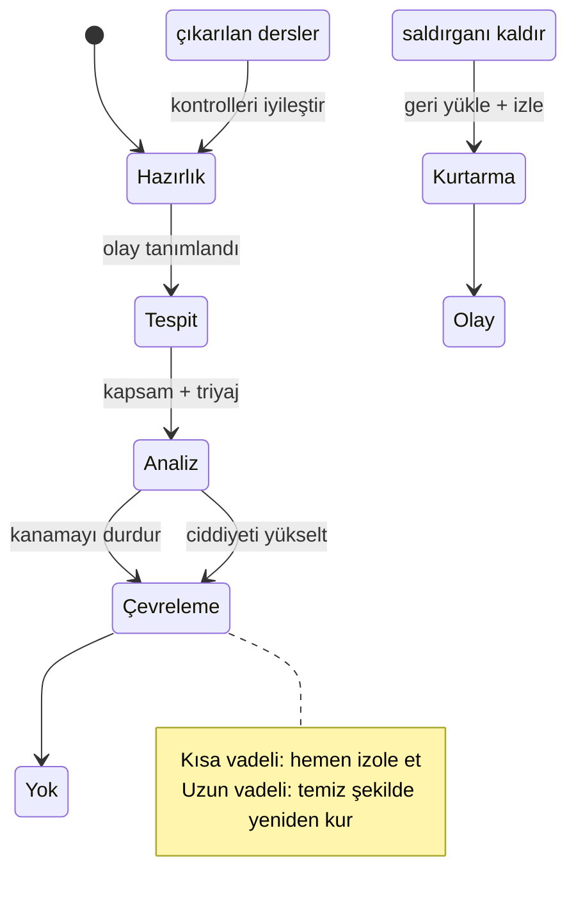

Mühendislerin en çok yanlış yaptığı aşama **Çevreleme**'dir. İki hata modu:

* **Saldırganı çok erken uyarmak** - onlar diğer on bilgisayarı tutarken bir bilgisayarın fişini çekmek, sadece onlara fark edildiğinizi söyler; onlar da her şeyi yakar veya veri sızdırmayı hızlandırırlar. Bazen siz *vuruş yapmadan önce izlersiniz*, kapsamı toplarsınız.
* **Yeterince hızlı çevrelememek** - tam tersi günah; veriler binadan çıkarken düşünmek.

:::warning[İhtiyacınız olacak kanıtları yok etmeyin]
Panik içgüdüsü *kutuyu hemen yeniden imgelemektir*. Ancak canlı, saldırıya uğramış bir konak; çalışan işlemler, ağ bağlantıları, bellekte yerleşik kötü amaçlı yazılımlar gibi, kapattığınız anda yok olan uçucu kanıtları tutar. Mümkün olduğunda, **yok etmeden önce bellek ve disk imajlarını yakalayın.** Bunlara kapsam belirleme ("başka nelere dokundular?"), yasal/düzenleyici yükümlülükler ve yok etme işleminin gerçekten tamamlandığından emin olmak için ihtiyacınız olacak. Uçuculuk sırası önemlidir: önce bellek, sonra disk. [^5]
:::

### Bölüm 9: Dijital Adli Tıp - Hakikati Yeniden İnşa Etmek

Olay bittiğinde (veya yasal işlemler için), **Dijital Adli Tıp ve Olay Müdahale (DFIR)** tam olarak ne olduğunu yeniden inşa eder. Temel ilke **kanıt zinciri** ve **uçuculuk sırasıdır**; kanıtlar en geçiciden en kalıcıya doğru sırayla toplanmalı ve her işlem adımı belgelenmelidir, aksi takdirde mahkemede değersizdir ve kapsam belirleme için güvenilmezdir:

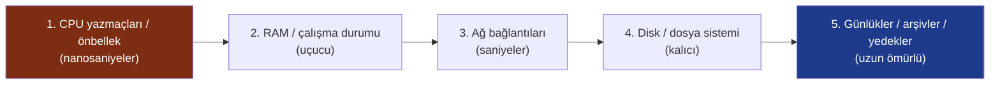

Adli analistler, sızma zaman çizelgesini dosya sistemi meta verilerinden (MFT, `$LogFile`), bellek dökümlerinden (Volatility), Windows olay günlüklerinden ve önyükleme (prefetch) ve shimcache gibi yapılardan yeniden inşa ederler; binlerce zaman damgasını *nasıl girdikleri, ne yaptıkları ve ne aldıklarına* dair tutarlı bir anlatı haline getirirler.

### Bölüm 10: Suçsuz Olay Sonrası Analiz

En değerli aşama, zaman baskısı nedeniyle atlanması en muhtemel olanıdır: **çıkarılan dersler**. Bunun çalışmasını sağlayan kural **suçsuzluktur**; analiz bireyleri değil, *sistemleri ve süreçleri* hedefler. Bir analiz suçlu arama işine dönüştüğü anda insanlar gerçeği söylemeyi bırakır ve iyileştirmek için ihtiyacınız olan bilgiyi kaybedersiniz.

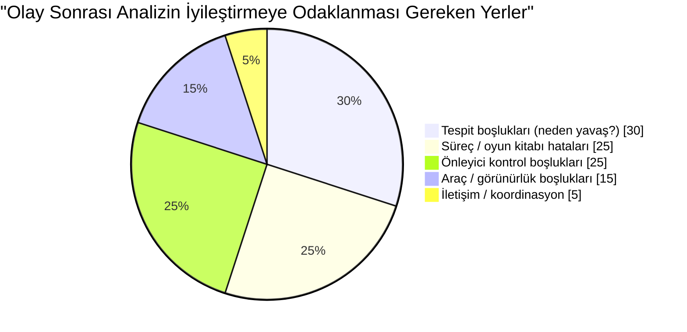

Her olay pahalı bir öğrenimdir. Güvenlik olgunluğunu artıran kurumlar, *dersi tam çıkaranlardır*: her ihlal, ona izin veren boşluğu kalıcı olarak kapatır, doğrudan Hazırlık aşamasına ve Bölüm II'deki tespitlere geri beslenir.

---

## Bölüm V: Tehdit İstihbaratı - Saldırganınızı Tanımak

Sizi kimin hedefleme ihtimalinin yüksek olduğunu ve *nasıl çalıştıklarını* bildiğinizde, tespit ve müdahale önemli ölçüde keskinleşir. **Siber Tehdit İstihbaratı (CTI)**, saldırganlar hakkındaki ham verileri kararlara dönüştürme disiplinidir ve üç irtifada çalışır:

| Seviye | Hedef Kitle | Cevapladığı Soru | Örnek |
| --- | --- | --- | --- |
| **Stratejik** | Yöneticiler / kurul | *Endüstrimizi kim hedefliyor ve neden?* | "Fidye yazılımı grupları giderek artan şekilde sağlık faturalandırmasını hedefliyor" |
| **Operasyonel** | SOC liderliği | *Şu anda hangi kampanyalar ve TTP'ler aktif?* | "Bu grup spear-phishing → Cobalt Strike → çifte gasp kullanıyor" |
| **Taktiksel** | Analistler / araçlar | *Hangi spesifik göstergeleri engellemeli/tespit etmeliyim?* | IOC'ler, ATT&CK teknik kimlikleri, YARA/Sigma kuralları |

Bağlayıcı çerçeve **Elmas Modeli**'dir; her sızma olayının dört köşesi vardır ve bunlar arasında dönmek anlayışınızı genişletir:

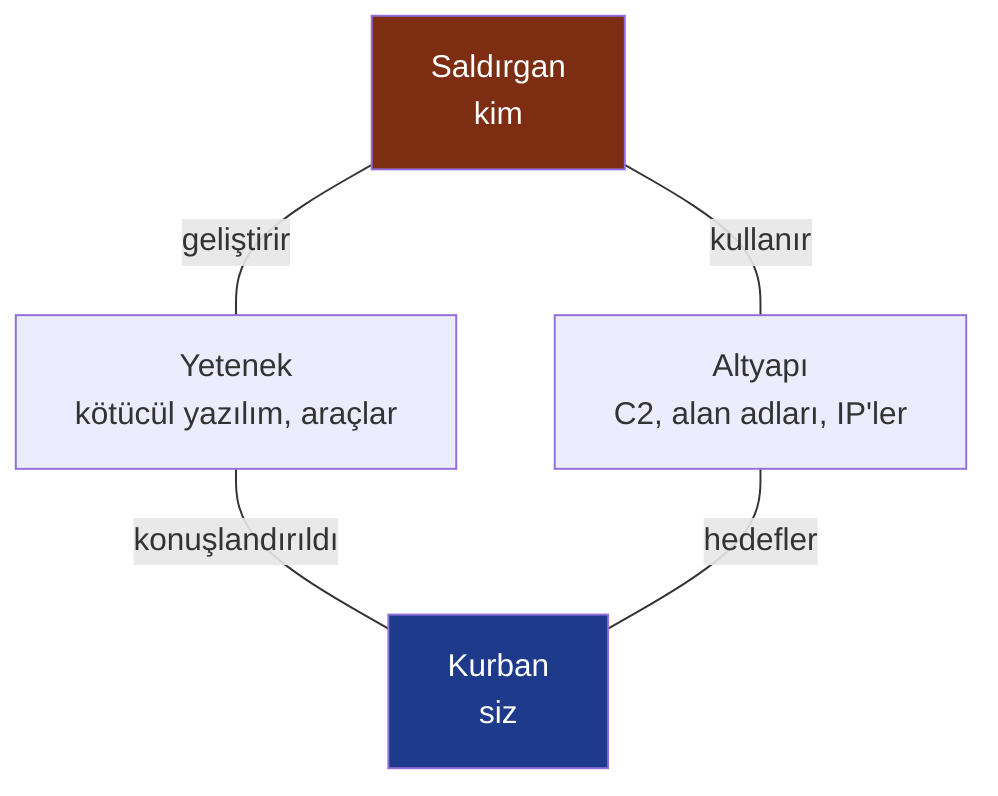

Bir C2 alan adını (Altyapı) bilmek, aynı kayıt kuruluşu/modelindeki diğer alan adlarına dönmenizi sağlar; kötücül yazılımı (Yetenek) bilmek, saldırganın *bir sonraki* kampanyasını yakalayan bir YARA kuralı yazmanızı sağlar. CTI, mavi takımın saf savunma oynamayı bırakıp tahmin etmeye başlamasını sağlayan şeydir.

:::important[İstihbarat eyleme dönüşmelidir, aksi takdirde önemsizdir]
Hiçbir kuralın tüketmediği on binlerce zararlı IP'den oluşan bir akış, istihbarat değil gürültüdür. CTI'nın testi kapalı bir döngüdür: tespit ettiklerinizi, engellediklerinizi, avlandıklarınızı veya önceliklendirdiklerinizi değiştiriyor mu? Taktiksel IOC'leri SIEM zenginleştirmenize besleyin, operasyonel TTP'leri ATT&CK kapsam haritanıza besleyin ve stratejik değerlendirmeleri risk kararlarınıza besleyin. Bir kontrole ulaşmayan istihbarat, kimsenin okumadığı bir rapordur.
:::

---

## Sonuç ve İlerideki Yol

Artık savunmacının tam döngüsünü yaşadık: **gör** (telemetri), **tespit et** (davranış üzerine mühendislik kuralları), **müdahale et** (SOC ve IR disiplini), **öğren** (suçsuz olay sonrası analiz) ve **tahmin et** (tehdit istihbaratı). Önlemenin başarısız olduğunu kabul ettik ve hayatta kalacak kasları oluşturarak kalış süresini haftalardan dakikalara indirdik.

Ancak tüm bunların aynı anda daha zor ve hızlı hale geldiği bir sınır var: uçucu konteynerler, bildirimsel altyapı ve hiç yazmadığınız binlerce açık kaynaklı bağımlılıktan oluşan yazılımların yer aldığı **bulut yerli** dünya. Burada çevre daha da çözülür, iş yükleri saniyelerce yaşar ve en tehlikeli ihlaller kodunuzdan değil *tedarik zincirinizden*, zehirli bir bağımlılıktan, saldırıya uğramış bir derleme hattından (build pipeline) veya sızdırılmış bir CI belirtecinden girer.

Final olan **Cilt V**, tüm seriyi modern bulut yerli ve DevSecOps güvenliğine taşıyor: konteyner ve Kubernetes sertleştirme, kod olarak altyapı (IaC) taraması, CI/CD hattını güvenceye alma, SBOM'lar ve SLSA ile önümüzdeki on yılın belirleyici ihlallerinin halihazırda gerçekleştiği yazılım tedarik zincirini savunma.

---

## Referanslar

[^1]: [MITRE - ATT&CK Framework](https://attack.mitre.org/)
[^2]: [David Bianco (2013) - The Pyramid of Pain](https://detect-respond.blogspot.com/2013/03/the-pyramid-of-pain.html)
[^3]: [SigmaHQ - Generic Signature Format for SIEM Systems](https://github.com/SigmaHQ/sigma)
[^4]: [NIST (2012) - SP 800-61 Rev. 2: Computer Security Incident Handling Guide](https://csrc.nist.gov/publications/detail/sp/800-61/rev-2/final)
[^5]: [IETF - RFC 3227: Guidelines for Evidence Collection and Archiving](https://datatracker.ietf.org/doc/html/rfc3227)