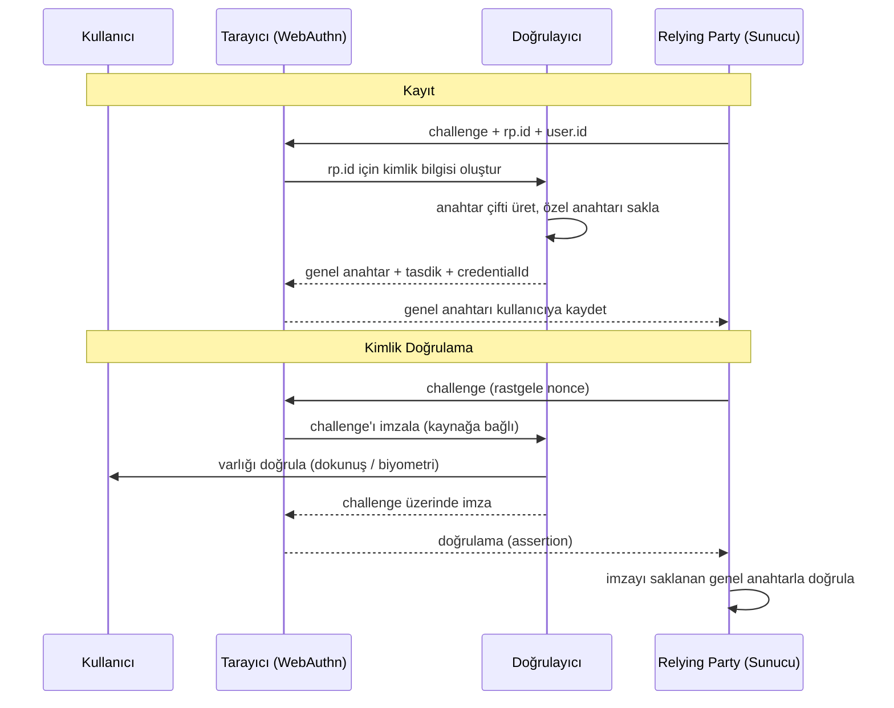
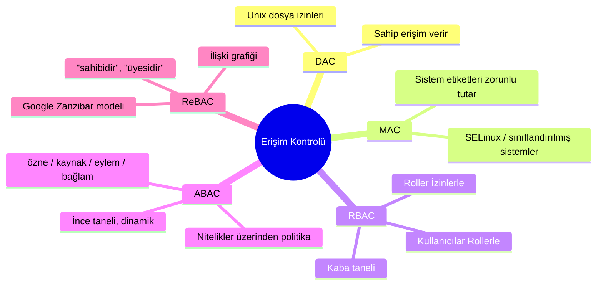
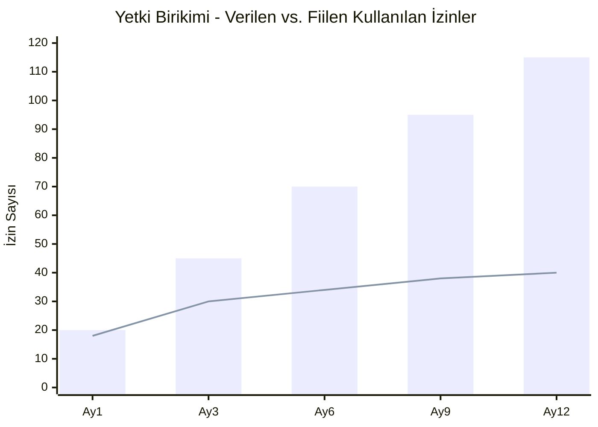
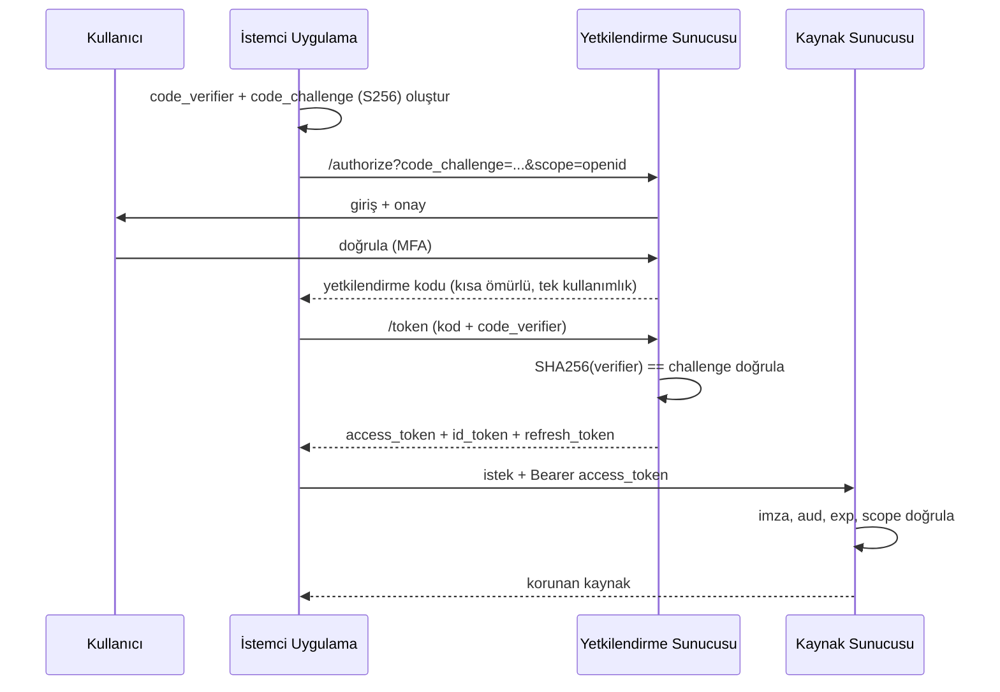
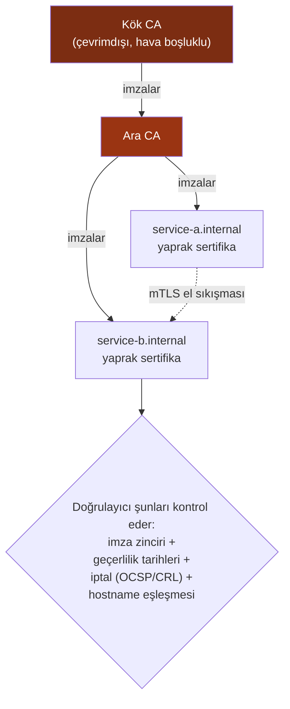
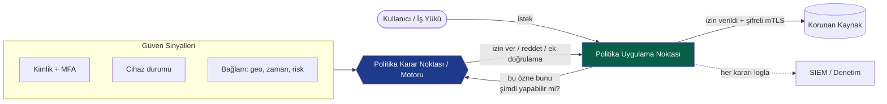
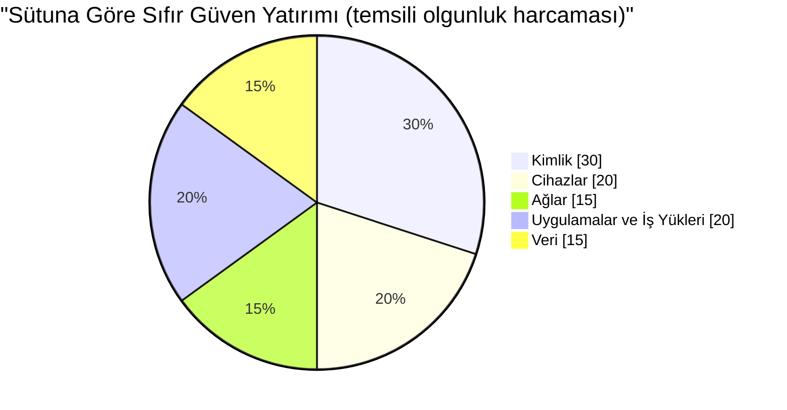

## I. Cilt Nerede Kalmıştı?

[I. Cilt'te](/posts/secure_systems_architecture/) bakır kablolardan koda kadar tüm yığını; Ağ Mühendisi, Savunmacı, Hacker ve Yazılım Mühendisi olmak üzere dört farklı bakış açısıyla incelemiştik. Duvarlarımızı ağın uç noktasına çekmiş, koridorlara IDS sensörleri yerleştirmiş ve güvenlik duvarını krallığın kapı bekçisi olarak görmüştük.

Sonra krallık çözüldü.

Dizüstü bilgisayarlar evlere gitti. Sunucular başkasının veri merkezine taşındı. API'lar, halka açık internet üzerinden başka API'ları çağırmaya başladı. "İçerisi"nin *güvenilir*, "dışarısı"nın *düşman* olduğu o düzenli kale ve hendek resmi, gerçeği tanımlamayı bıraktı. Hendek artık yok. Geriye kalan ise insanların, hizmetlerin, cihazların ve iş yüklerinin oluşturduğu bir küme; hepsi bir şeyler yapmayı talep ediyor, hepsi kim olduğunu ve neye dokunma yetkisi olduğunu kanıtlamaya ihtiyaç duyuyor.

Bu cildin konusu budur. **Kimlik yeni çevre birimidir** [^1] ve her istek bir sınır geçişidir.

:::note[Bu cildin ana fikri]
Kimlik doğrulama *"kimsin?"* sorusunu yanıtlar. Yetkilendirme *"ne yapabilirsin?"* sorusunu yanıtlar. Bu makaledeki diğer her şey (faktörler, belirteçler, oturumlar, politika motorları, anahtar materyalleri), bu iki cevabı makine hızında **güvenilir, iptal edilebilir ve denetlenebilir** kılmak için mevcuttur.
:::

---

## Bölüm I: Kimlik Doğrulama - Kim Olduğunuzu Kanıtlama

### Bölüm 1: Üç Faktörün Yeniden Değerlendirilmesi

Her kimlik doğrulama şeması, üç klasik faktörün ve iki modern eklemenin kombinasyonuna indirgenir:

* **Bildiğiniz bir şey** - parolalar, PIN kodları, parolalar (passphrases).
* **Sahip olduğunuz bir şey** - bir donanım anahtarı, telefon, akıllı kart.
* **Olduğunuz bir şey** - parmak izi, yüz, iris.
* **Bulunduğunuz yer** - coğrafi konum / ağ bağlamı (*bağlamsal* bir sinyal, katı bir faktör değil).
* **Yaptığınız bir şey** - davranışsal biyometri: yazma ritmi, fare dinamikleri.

**Hacker'ın Bakış Açısı:** Her faktörün kendine özgü bir saldırısı vardır. Bilgi faktörleri *phishing* (oltalama) ile ele geçirilir ve *sprayed* edilir. Sahiplik faktörleri *çalınır* veya *SIM-swap* (SIM takası) yöntemine maruz kalır. Kalıtım faktörleri *sahtedir* (kopyalanmış parmak izi, basılı yüz) ve en önemlisi **değiştirilemezler**; bir kez ele geçirildiğinde, ömrünüz boyunca kullanabileceğiniz on parmak iziniz kalır.

**Savunmacının Bakış Açısı:** Çok Faktörlü Kimlik Doğrulama (MFA) işe yarar çünkü saldırganın artık *farklı türdeki* faktörleri aynı anda ele geçirmesi gerekir. Ancak her MFA eşit değildir. Bu, savunmacıların gözden kaçırdığı en önemli nüanstır:

```mermaid
quadrantChart
    title Kimlik Doğrulama Yöntemlerinin Oltalama Direnci ve Kullanıcı Zorluğu
    x-axis Düşük Zorluk --> Yüksek Zorluk
    y-axis Zayıf (Oltalanabilir) --> Güçlü (Oltalanamaz)
    quadrant-1 Altın Standart
    quadrant-2 Güvenli ama Hantal
    quadrant-3 Eski - Kullanımdan Kaldır
    quadrant-4 Kullanışlı ama Riskli
    Password only: [0.15, 0.08]
    SMS OTP: [0.35, 0.22]
    TOTP App: [0.45, 0.40]
    Push Approve: [0.25, 0.35]
    Passkey (FIDO2): [0.20, 0.92]
    Hardware Key: [0.55, 0.95]
```

Grafikten çıkarılacak ders: **SMS tabanlı OTP bir MFA'dır, ancak zayıf bir MFA'dır.** Parola tekrar kullanımına karşı dirençlidir ancak gerçek zamanlı bir oltalama proxy'sine veya SIM takasına karşı değildir. Yalnızca özel anahtarın doğrulayıcıdan asla ayrılmadığı ve imzanın kriptografik olarak kaynağa bağlandığı **FIDO2 / WebAuthn** kimlik bilgileri gerçekten *oltalama direncine* sahiptir [^2].

:::warning[MFA yorgunluğu gerçek bir saldırıdır]
2022'de birçok yüksek profilli ihlalde **push-bombing** (push bildirimi bombardımanı) kullanıldı: saldırganın zaten parolası vardır ve kurbanı, can sıkıntısından veya kafa karışıklığından "Onayla" tuşuna basana kadar onay bildirimleriyle spam'ler. *Sayı eşleştirme* (number matching) özelliği olmayan push tabanlı MFA bir güvenlik kontrolü değil, bir tasarım kusurudur. Passkey'leri tercih edin veya her bildirimde sayı eşleştirme ile birlikte bağlam (uygulama adı, konum) zorunluluğu getirin. [^3]
:::

### Bölüm 2: Ölmeyi Reddeden Parolalar

Passkey (parolasız) geleceğinde bile, parola veritabanları bir on yıl daha var olmaya devam edecek. Onları doğru şekilde depolamak tartışmaya kapalı bir konudur.

Kural: **kullanıcının yazdığı şeyi asla saklamayın.** Yavaş, tuzlanmış (salted), bellek yoğun (memory-hard) bir hash saklayın.

$$
H = \text{Argon2id}(\text{password}, \text{salt}, m, t, p)
$$

Burada $m$ bellek maliyeti (KiB), $t$ zaman maliyeti (yinelemeler) ve $p$ paralelliktir. Argon2id, hem GPU kırılmasına (bellek sertliği sayesinde) hem de yan kanal saldırılarına (hibrit veri erişim düzeni sayesinde) dirençli olduğu için günümüzde OWASP tarafından önerilen varsayılandır [^4].

*Yavaş* hash işleminin önemi, saldırgan ekonomisi açısından ifade edilebilir. Eğer bir saldırgan saniyede $R$ adet hash hesaplayabiliyorsa, $N$ büyüklüğündeki bir anahtar uzayından rastgele seçilen bir parolayı kırmak, ortalama olarak şu kadar sürer:

$$
t_{\text{crack}} = \frac{N}{2R}
$$

Tuzlanmamış SHA-256 gibi hızlı bir hash, modern bir GPU sistemine saniyede $R \approx 10^{11}$ tahmin imkanı verir. Optimize edilmiş bir Argon2id ise bunu $R \approx 10^{3}$ seviyesine düşürebilir. $R$ değerindeki bu sekiz basamaklı düşüş, oyunun tüm kuralıdır.

:::tip[Parola depolama kontrol listesi]

1. **Hash** işlemi için Argon2id (veya Argon2 yoksa scrypt / bcrypt) kullanın.
2. Her kullanıcı için benzersiz bir **tuz** (salt) ekleyin (rainbow table saldırılarını engeller).
3. Veritabanından ayrı olarak bir HSM/KMS içinde saklanan sunucu tarafında bir **biber** (pepper) kullanmayı düşünün (yalnızca veritabanını ele geçiren saldırganı engeller).
4. Parola uzunluğunu agresif bir şekilde sınırlamayın veya yapıştırmayı yasaklamayın; her ikisi de kullanıcıları daha zayıf parolalar kullanmaya iter.
5. Yeni parolaları **bilinen sızıntı veritabanlarıyla** (örneğin, HaveIBeenPwned'in k-anonymity API'si) karşılaştırın [^5].

:::

### Bölüm 3: Parolasız Dönem - WebAuthn ve Passkey

WebAuthn (tarayıcı API'si) ve CTAP (doğrulayıcı protokolü) birlikte **FIDO2**'yi oluşturur. Zihinsel model:



Sihir tek bir satırda: **imza kaynağa (`rp.id`) bağlıdır**. `paypa1.com` adresindeki bir oltalama sitesi, tarayıcı bunu serbest bırakmayı reddettiği için doğrulayıcıya `paypal.com` için geçerli bir doğrulama ürettiremez. Bu, kimlik bilgisi oltalama kategorisini kullanıcı uyanıklığına değil, tasarım gereği ortadan kaldırır [^2].

**Passkey**, cihaz kaybına karşı korunması için bir bulut anahtarlığında (Apple, Google, Microsoft veya bir parola yöneticisi) yedeklenen, *keşfedilebilir ve senkronize edilebilir* bir FIDO2 kimlik bilgisidir. Bu senkronizasyon, parolasız yöntemi tüketiciler için uygulanabilir kılan ergonomik bir atılımdır.

---

## Bölüm II: Yetkilendirme - Ne Yapabileceğinize Karar Verme

Kimlik doğrulama işin kolay kısmıdır. **Gerçek sistemler yetkilendirmede kan kaybeder.** OWASP Top 10, *Bozuk Erişim Kontrolü*'nü (Broken Access Control) enjeksiyon ve kripto hatalarının toplamından daha büyük bir **#1** web riski olarak sıralamıştır [^6].

### Bölüm 4: Modeller - Rollerden Niteliklere ve İlişkilere



**RBAC (Rol Tabanlı)** çoğu organizasyonun yaşadığı yerdir: bir kullanıcının rolleri vardır, roller izinleri bir araya getirir. Üzerinde düşünmek ve denetlemek kolaydır. Başarısızlık modu **rol patlamasıdır**; "finans projesindeki AB bölgesinde mesai saatleri içinde düzenleyici" gibi bir tanım kendi başına bir rol haline geldiğinde, elinizde binlerce rol olur ve kimse bu grafiği anlamaz.

**ABAC (Nitelik Tabanlı)**, istek anında nitelikler üzerinden bir *politika* değerlendirerek bunu çözer:

```txt
# Küçük bir ABAC politikası (OPA / Rego stili)
allow if {
    input.subject.department == input.resource.owner_department
    input.action == "read"
    input.context.time_hour >= 9
    input.context.time_hour < 18
}
```

Google'ın **Zanzibar** makalesiyle [^7] popülerleşen ve OpenFGA, SpiceDB gibi sistemlerle açık kaynak haline getirilen **ReBAC (İlişki Tabanlı)**, yetkilendirmeyi bir grafik olarak modeller: *"Alice, Doc'un düzenleyicisidir, Doc Klasör içindedir, Bob Klasör'ün görüntüleyicisidir → Bob Doc'u görüntüleyebilir."* Paylaşım ve iç içe geçme özelliklerine sahip SaaS ürünlerinde hakim olan "X kullanıcısı Z nesnesine Y eylemini yapabilir mi?" kontrolleri için mükemmeldir.

:::important[IDOR tuzağı - yetkilendirmenin en yaygın yarası]
**Güvensiz Doğrudan Nesne Referansı (IDOR)**, kullanıcıyı doğruladığınız ancak *nesneyi yetkilendirmeyi* unuttuğunuzda gerçekleşir. Klasik örnek:

```bash
GET /api/invoices/1043   ->  200 OK  (faturam)
GET /api/invoices/1044   ->  200 OK  (başkasının faturası!)
```

Çözüm bir kütüphane değil, disiplindir: **her nesne çekme işlemi, istekte bulunan özne ile sınırlandırılmalıdır.** Asla `SELECT * FROM invoices WHERE id = ?` kullanmayın; her zaman `... WHERE id = ? AND owner_id = ?` kullanın veya kontrolü merkezi bir politika motoruna itin. IDOR, Bozuk Erişim Kontrolü'nün OWASP listesinde zirvede olmasının *yegane* nedenidir. [^6]
:::

### Bölüm 5: En Az Yetki Prensibi, Nicel Olarak

En az yetki ilkesi şöyle der: gereken *minimum* izinleri, *minimum* süre için verin. Uygulamada, yetkiler her zaman birikir; bu sapmaya **yetki birikimi** (privilege creep) denir. Kullanışlı bir zihinsel metrik, *kullanılan* izinlerin *verilen* izinlere oranıdır:



Çubuklar (verilen) ile çizgi (kullanılan) arasındaki genişleyen boşluk, **aktif saldırı yüzeyinizdir**: saldırganın hesabı ele geçirdiği anda devraldığı ve kimsenin izlemediği ayrıcalıklar. Karşı önlemler:

* **Tam Zamanında (JIT) erişim:** yükseltilmiş hakları sınırlı bir süre için verin, ardından otomatik olarak iptal edin.
* **Erişim incelemeleri / yeniden sertifikalandırma:** periyodik "buna hala ihtiyacın var mı?" kampanyaları.
* **Ayrıcalıklı Erişim Yönetimi (PAM):** yönetici kimlik bilgilerini kasaya alın, oturumlara aracılık edin, her şeyi kaydedin.

---

## Bölüm III: Belirteçler, Oturumlar ve Federasyon

### Bölüm 6: OAuth 2.0, OIDC ve Aralarındaki Karışıklık

Bu alandaki en yaygın mimari hata, **OAuth 2.0**'ı (yetkilendirme - devredilmiş erişim) **OpenID Connect** (kimlik doğrulama - kimliği kanıtlama) ile karıştırmaktır. OIDC, OAuth 2.0'ın *üzerinde* ince bir kimlik katmanıdır [^8].

* **OAuth 2.0** şuna yanıt verir: *"Bu uygulamanın R kaynağına erişmek için senin adına hareket etmesine izin veriyor musun?"* **Erişim belirteçleri** (access tokens) yayınlar.
* **OIDC** şuna yanıt verir: *"Bu kullanıcı kimdir?"* **Kimlik belirteci** (ID token - kullanıcı hakkında talepler içeren imzalı bir JWT) yayınlar.

SPA'lar, mobil ve web uygulamaları dahil neredeyse her şey için modern, önerilen akış **Authorization Code + PKCE**'dir:



**Neden PKCE (Proof Key for Code Exchange)?** PKCE olmasaydı, yetkilendirme kodunu ele geçiren bir saldırgan (aynı URI şemasında kayıtlı kötü niyetli bir uygulama aracılığıyla) kodu kullanabilirdi. PKCE, kodu yalnızca meşru istemcinin bildiği bir sırra (`code_verifier`) bağlar, böylece çalınan bir kod işe yaramaz hale gelir. **OAuth 2.1**, tüm istemciler için PKCE'yi zorunlu kılar ve tehlikeli *implicit* ve *password* grant türlerini tamamen kaldırır [^9].

:::caution[Implicit akışını kullanmayı bırakın]
Eski Implicit akışı, belirteçleri doğrudan URL parçasında döndürürdü; bu, tarayıcıların `fetch` ve CORS'tan önceki bir dönemden kalma tasarımdı. Belirteçler geçmişe, referanslara ve loglara sızardı. Eğer bir eğitim size `response_type=token` kullanmanızı söylüyorsa, o eğitim on yıl eskidir. Her zaman Authorization Code + PKCE kullanın.
:::

### Bölüm 7: Oturumlar ve Belirteçler - Durumlu/Durumsuz Takası

| Özellik | Sunucu Oturumu (çerez → oturum deposu) | Kendi Kendine Yeten JWT |
| --- | --- | --- |
| Durum | Sunucu oturumu tutar; çerez bir opak ID'dir | Sunucu hiçbir şey tutmaz; belirteç *durumun kendisidir* |
| İptal | **Anlık** - oturum satırını sil | **Zor** - `exp` tarihine kadar geçerli, kara liste gerekir |
| Ölçekleme | Paylaşımlı depo (Redis) gerekir | Yatay olarak kolayca ölçeklenir |
| Yük | Küçük çerez | Her istekte daha büyük belirteç |
| En İyisi | Klasik web uygulamaları, anlık çıkış ihtiyacı | Hizmetten hizmete (S2S), kısa ömürlü erişim belirteçleri |

Endüstri standardı uzlaşma: **kısa ömürlü erişim belirteçleri (5–15 dk) + uzun ömürlü yenileme belirteçleri.** Erişim belirteci, asla iptal etmediğiniz (zaten hızlıca süresi dolan) bir JWT'dir; yenileme belirteci ise sunucu tarafında tutulan, iptal edilebilir, rotasyona giren bir kimlik bilgisidir. Bir kullanıcıyı sistemden atmak, bir erişim belirteci ömrü süresinde gerçekleşir.

:::warning[JWT'nin üç tehlikesi]

1. **`alg: none`** - tarihsel olarak, bazı kütüphaneler imza gerektirmediğini *beyan eden* bir belirteci kabul ediyordu. Beklenen algoritmayı her zaman sunucu tarafında sabitleyin; başlığın `alg` değerine asla güvenmeyin.
2. **HS256 vs RS256 karışıklığı** - bir saldırgan, genel RSA anahtarınızı HMAC sırrı olarak kullanarak imzalanmış bir HS256 belirteci gönderir. Algoritmayı sabitleyin.
3. **JWT'leri `localStorage` içinde saklamak** - herhangi bir XSS yükü tarafından okunabilir. Tarayıcı oturumları için `HttpOnly`, `Secure`, `SameSite` çerezlerini tercih edin. [^10]

:::

### Bölüm 8: Federasyon ve SSO

**Tek Oturum Açma (SSO)**, tek bir girişin birçok uygulamaya hizmet etmesini sağlar. İki baskın protokol:

* **SAML 2.0** - XML tabanlı, ayrıntılı, kurumsal B2B ve eski sistemlerde hala baskın.
* **OIDC** - JSON/JWT tabanlı, yeni uygulamalar, mobil ve API'lar için varsayılan.

Aktör listesi: bir **Kimlik Sağlayıcı (IdP)** - Okta, Entra ID, Keycloak, Google - kullanıcıyı doğrular ve bir **Hizmet Sağlayıcı (SP)** / Relying Party için kullanıcı adına kefil olur. Değeri merkezileştirilmesindedir: MFA'yı zorunlu kılacak tek bir yer, işten ayrılan bir çalışanı devre dışı bırakacak tek bir yer, tek bir denetim izi.

:::note[İptal işlemleri sessiz katildir]
SSO'nun en büyük güvenlik faydası **anlık, merkezi çıkış işlemleridir.** Gerçek dünyadaki en yaygın başarısızlık, terk edilmiş hesaplardır; bir çalışan ayrılır, İK SSO hesabını kapatır ancak bazı unutulmuş sunuculardaki yerel yönetici hesabı yaşamaya devam eder. Her kimlik kaynağını İK sisteminizle eşleştirin. İnsan sahibi olmayan bir hesap, saldırganın sahibi olduğu bir hesaptır.
:::

---

## Bölüm IV: Makine Kimliği ve Sırlar

İnsanlar bir hata payından ibarettir. Modern bir bulut dünyasında, **makine kimlikleri insan kimliklerinden 45 kat daha fazladır** [^11]; her mikro hizmet, fonksiyon, konteyner ve CI işinin bir yerlere kimlik doğrulaması yapması gerekir.

### Bölüm 9: PKI ve Güven Zinciri

Makineden makineye güven, **X.509 sertifikaları** ve Ortak Anahtar Altyapısı (PKI) üzerine kuruludur. Bir sertifika, bir genel anahtarı, doğrulayıcının güvendiği bir Sertifika Yetkilisi (CA) tarafından imzalanmış bir kimliğe bağlar.



Kökün özel anahtarı, mücevherdir; **çevrimdışı ve hava boşluklu (air-gapped)** tutulur, çünkü ele geçirilmesi altındaki her şeyi geçersiz kılar. Ara CA'lar günlük imzalama işlemlerini yapar, böylece kök nadiren kasadan çıkar.

**mTLS (karşılıklı TLS)**, PKI'nın hizmetten hizmete kimlik doğrulamasına verdiği cevaptır: *her iki taraf* sertifika sunar, böylece bir hizmet kimliğini çağıranlara *ve* çağrılanlara kanıtlar. Bu, iş yükleri arasındaki Sıfır Güven'in kriptografik omurgasıdır (Istio ve Linkerd gibi hizmet ağlarının var olma nedenidir; **SPIFFE/SPIRE** kimlikleri aracılığıyla sertifika dağıtımını ve rotasyonunu otomatikleştirirler) [^12].

### Bölüm 10: Sır Yönetimi

Yazılımdaki en eski günah: hard-coded (koda gömülü) sır.

```python
# Asla ölmeyen zafiyet
DB_PASSWORD = "hunter2"          # git'e commit edildi, tarih boyunca orada
API_KEY = "sk_live_a1b2c3d4..."  # istemci paketinde sızdı
```

Git *asla unutmaz*. Bir kez commit edilen ve sonraki commit'te "kaldırılan" bir sır, hala geçmişte durur ve saniyeler içinde halka açık push'ları izleyen botlar tarafından kazınır. Disiplinler:

::::steps

:::step[Sırları asla commit etmeyin]{subtitle="Önleme"}
Sırları geçmişe girmeden engellemek için pre-commit hook'ları (`gitleaks`, `trufflehog`) kullanın. Kimsenin yerel olarak bypass edememesi için bunu CI'da zorunlu tutun.
:::

:::step[Sır yöneticisinde merkezileştirin]{subtitle="Depolama"}
HashiCorp Vault, AWS Secrets Manager veya bulut KMS kullanın. Uygulamalar sırları çalışma zamanında doğrulanmış bir kimlikle çeker; sırlar kaynak koduna veya imajlara gömülü env dosyalarına asla temas etmez.
:::

:::step[Dinamik, kısa ömürlü sırları tercih edin]{subtitle="Rotasyon"}
Vault, bir saat geçerli bir veritabanı kimlik bilgisi üretip sonra onu iptal edebilir. Sızdırılmış bir saatlik kimlik bilgisi, üç yıldır geçerli olan statik bir anahtardan çok daha az tehlikelidir.
:::

:::step[Planlı ve şüphe durumunda rotasyon yapın]{subtitle="Tepki"}
Rotasyonu otomatikleştirin. Bir sır açığa çıkmış *olabilirse*, önce rotasyon yapın, sonra araştırın. Rotasyon sıkıcı, tek tıklamalı ve sıfır kesintili bir operasyon olmalıdır, aksi takdirde asla gerçekleşmez.
:::

::::

:::tip[İş yükü kimliği, depolanmış sırları yener]
En iyi sır, asla depolamadığınız sırdır. **İş yükü kimlik federasyonu** (AWS IAM Roles for Service Accounts, GCP Workload Identity, OIDC-federated CI koşucuları), bir iş yükünün çalınacak uzun ömürlü bir anahtarı olmaksızın, kısa ömürlü kimlik bilgileri almasına olanak tanır. Eğer hala CI içine statik bulut anahtarları yapıştırıyorsanız, bu yapabileceğiniz en yüksek kaldıraçlı yükseltmedir.
:::

---

## Bölüm V: Sentez - Sıfır Güven Mimarisi Oluşturma

Artık her şeyi NIST'in **SP 800-207**'de resmileştirdiği modelde birleştirebiliriz: **Sıfır Güven** [^13]. Kale ve hendek modelinin yerine geçmesinin nedeni olan temel varsayımı tek bir cümledir:

> **Asla güvenme, her zaman doğrula.** Ağın düşman olduğu varsayılır. Konum hiçbir şey sağlamaz. Her istek kendi değerinde, her seferinde doğrulanır, yetkilendirilir ve şifrelenir.

Referans mimarisinde, politikayı değerlendiren bir **Politika Karar Noktası (PDP)** ve veri yolunda dağıtılmış, PDP'ye sorup kararını uygulayan **Politika Uygulama Noktaları (PEP)** vardır:



Olgun bir Sıfır Güven programının ele aldığı beş sütun (CISA Sıfır Güven Olgunluk Modeline göre) [^14]:



**Kimliğin en büyük dilimi alması** bir kaza değildir. Ağ güven sağlamadığında, kimlik birincil kontrol düzlemi haline gelir. Bu ciltteki her şey; faktörler, belirteçler, politika motorları, makine kimliği, bu kontrol düzlemini güvenilir kılmak içindir.

:::important[Sıfır Güven bir ürün değil, yolculuktur]
Hiçbir satıcı "kutu içinde Sıfır Güven" satmaz. Bu, kademeli olarak uygulanan bir *mimari* ve *operasyonel prensiptir*: en kritik uygulamanıza oltalama direncine sahip MFA koyarak başlayın, cihaz durumu kontrolleri ekleyin, ardından mikro segmentasyon yapın, sonra iş yüklerine genişletin. Olgunluk, cihazlara harcanan dolarlarla değil, ortadan kaldırılan örtük güvenle ölçülür.
:::

---

## Sonuç ve İlerideki Yol

I. Cilt bir mekanı savundu. Bu cilt ise nerede olursa olsun bir *özneyi* savundu. Duvarı, her kapıda sorulan bir soruyla değiştirdik: *kim olduğunu kanıtla ve yapabileceğini kanıtla.*

Ancak bu ciltteki her iddia, her belirteç imzası, her mTLS el sıkışması, her hash'lenmiş parola, şu ana kadar "sadece çalışan" sihirli bir kutu olarak gördüğümüz kriptografiye dayanıyor. **III. Cilt**'te, o kutuyu açıyoruz. İlkel yapı taşlarını temelden inşa edeceğiz: simetrik ve asimetrik şifreler, gerçek TLS 1.3 el sıkışması, anahtar değişimi ve iletim gizliliği, kuantum sonrası kriptografinin yaklaşan yıkımı ve mühendislerin tüm bunları feci şekilde yanlış yapma yolları kataloğu.

Güvenmeyi yeni öğrendiğiniz kimlik, ancak onu imzalayan matematik kadar güçlüdür.

---

## Referanslar

[^1]: [Microsoft (2021) - Kimlik yeni güvenlik çevre birimidir](https://www.microsoft.com/en-us/security/business/security-101/what-is-identity-access-management-iam)
[^2]: [FIDO Alliance - FIDO Nasıl Çalışır](https://fidoalliance.org/how-fido-works/)
[^3]: [CISA (2022) - Oltalama Direncine Sahip MFA Uygulama](https://www.cisa.gov/sites/default/files/publications/fact-sheet-implementing-phishing-resistant-mfa-508c.pdf)
[^4]: [OWASP - Parola Depolama Hile Sayfası](https://cheatsheetseries.owasp.org/cheatsheets/Password_Storage_Cheat_Sheet.html)
[^5]: [Troy Hunt - Have I Been Pwned: Pwned Passwords (k-Anonymity)](https://haveibeenpwned.com/API/v3#PwnedPasswords)
[^6]: [OWASP - A01:2021 Bozuk Erişim Kontrolü](https://owasp.org/Top10/A01_2021-Broken_Access_Control/)
[^7]: [Google (2019) - Zanzibar: Google'ın Tutarlı, Küresel Yetkilendirme Sistemi](https://research.google/pubs/pub48190/)
[^8]: [OpenID Foundation - OpenID Connect Nedir](https://openid.net/developers/how-connect-works/)
[^9]: [IETF - OAuth 2.1 Yetkilendirme Çerçevesi (taslak)](https://datatracker.ietf.org/doc/html/draft-ietf-oauth-v2-1)
[^10]: [OWASP - JSON Web Belirteci Hile Sayfası](https://cheatsheetseries.owasp.org/cheatsheets/JSON_Web_Token_for_Java_Cheat_Sheet.html)
[^11]: [CyberArk (2023) - Kimlik Güvenliği Tehdit Ortamı Raporu](https://www.cyberark.com/threat-landscape/)
[^12]: [SPIFFE - Herkes İçin Güvenli Üretim Kimliği Çerçevesi](https://spiffe.io/docs/latest/spiffe-about/overview/)
[^13]: [NIST (2020) - SP 800-207: Sıfır Güven Mimarisi](https://csrc.nist.gov/publications/detail/sp/800-207/final)
[^14]: [CISA - Sıfır Güven Olgunluk Modeli v2.0](https://www.cisa.gov/zero-trust-maturity-model)