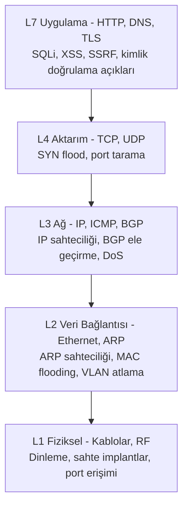
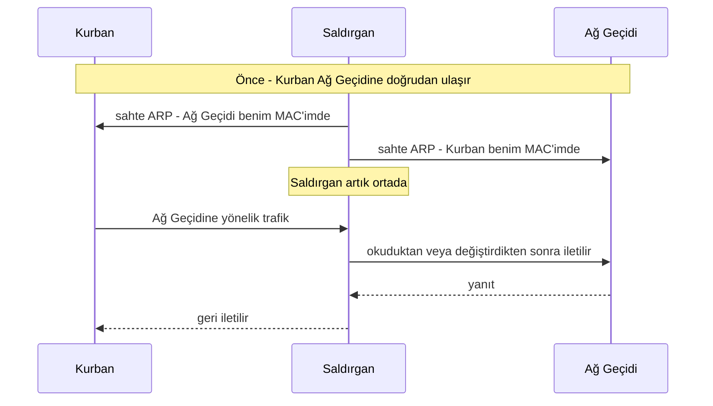
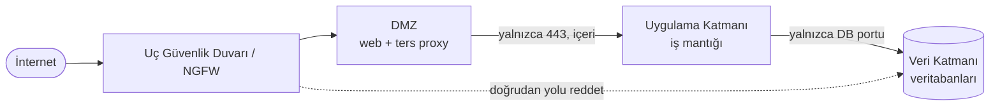
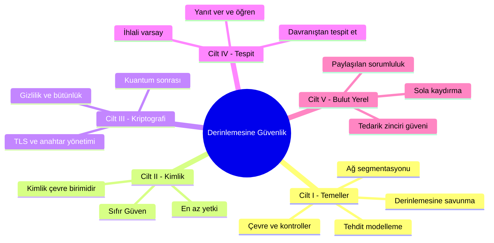
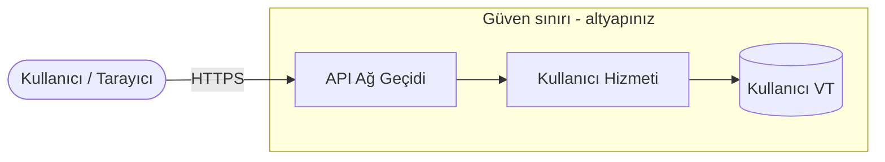
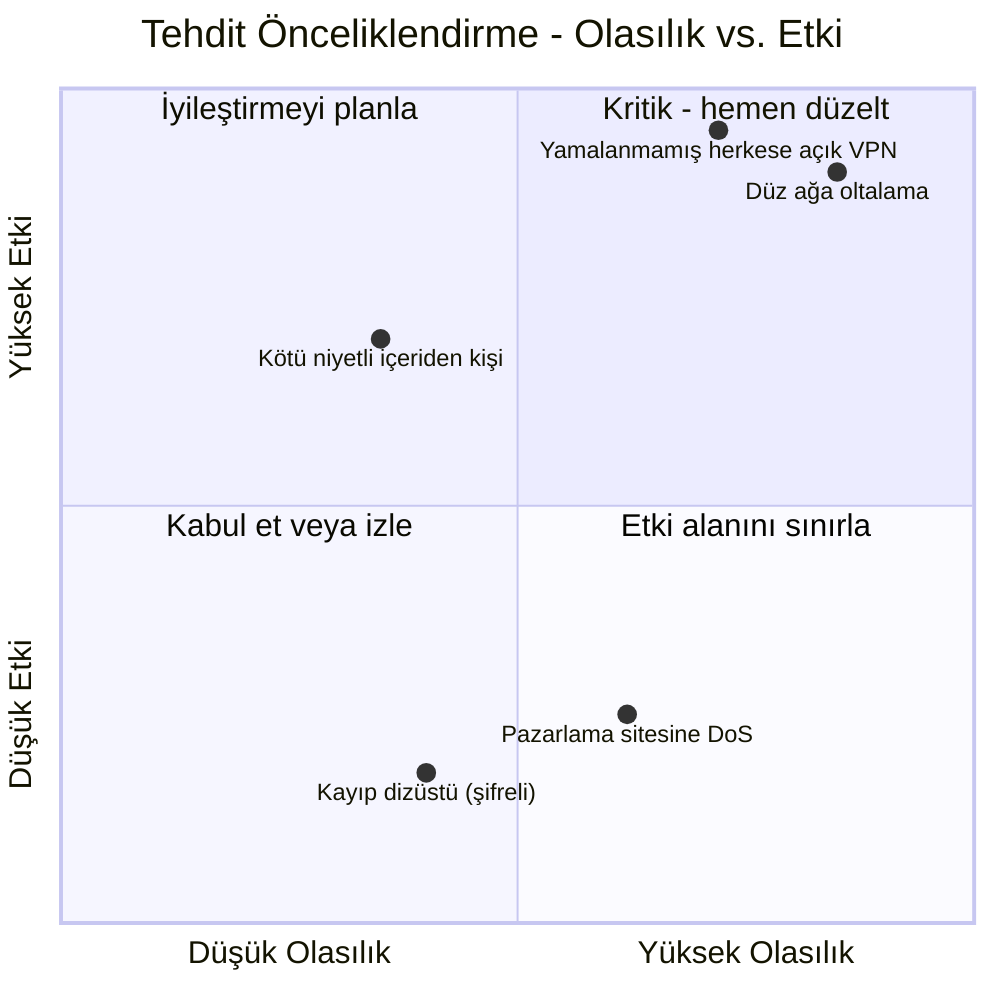
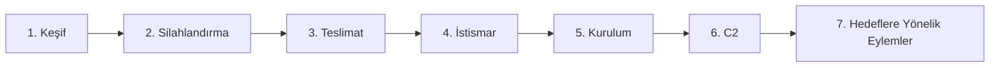
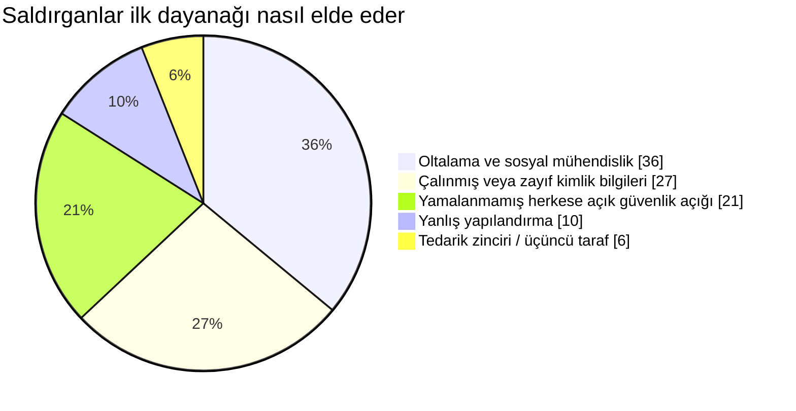
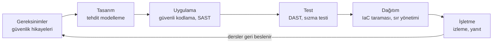
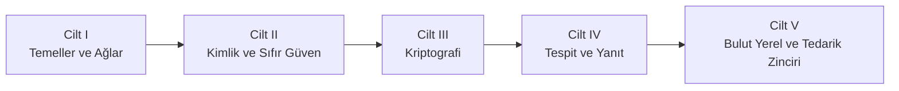

## Serinin Başladığı Yer

Bu, **Güvenlik Mimarisi** boyunca beş bölümlük bir yolculuğun açılış cildidir. Seri boyunca bakırdan konteynere kadar tüm yığını gezeceğiz ve harita şöyle görünüyor:

* **Cilt I (bu cilt)** - temeller: saldırı yüzeyi olarak ağ, savunulabilir tasarım, derinlemesine savunma, tehdit modelleme ve saldırganın yöntemi.
* **Cilt II** - [Kimlik, Erişim ve Sıfır Güven Sınırı](/posts/identity_and_access_in_depth/): çevre çözüldüğünde, kimlik yeni sınır haline gelir.
* **Cilt III** - [Kriptografi Mühendisliği](/posts/cryptography_engineering_in_depth/): tüm bunları güvenilir kılan ilkel yapı taşları.
* **Cilt IV** - [Tespit, Yanıt ve Tehdit İstihbaratı](/posts/detection_and_response_in_depth/): önleme başarısız olduğunda ne yaparsınız.
* **Cilt V** - [Bulut Yerel ve Tedarik Zinciri Güvenliği](/posts/cloud_native_and_supply_chain_security_in_depth/): geçici olanı güvenceye almak ve gönderdiğinizi kanıtlamak.

Bu kılavuzu farklı kılan, yöntemidir. Her konu **dört çift göz** aracılığıyla incelenir, çünkü gerçek bir sistem aynı anda dört tür mühendis tarafından tartışılır:

* Temeli inşa eden **Ağ Mühendisi**.
* Onu korumak zorunda olan **Savunmacı**.
* Onu kırmaya çalışan **Hacker**.
* Üzerinde çalışan kodu yazan **Yazılım Mühendisi**.

:::note[Tüm serinin ana fikri]
Hiçbir tek kontrol güvenilir değildir. Güvenlik duvarları başarısız olur, kimlik bilgileri sızar, kodda hatalar bulunur ve bağımlılıklar zehirlenir. Bu nedenle güvenlik, satın aldığınız bir ürün değil, **mühendisliğini yaptığınız bir özelliktir**: her biri, kendinden öncekinin çoktan başarısız olduğunu varsayan katmanlar. Bu cilt, en dıştaki katmanları ve zihniyeti inşa eder. Serinin geri kalanı içeriye doğru inşa eder.
:::

---

## Bölüm I: Ağ, Arazinin Kendisidir

Veri iletişimi ağda başlar ve saldırı da öyle. OSI veya TCP/IP modelinin yüzeysel bir okuması yeterli değildir [^1]; bir güvenlik uzmanı her katmanı iki kez okur: bir kez ne *yaptığı* için, bir kez de nasıl *çevrilebileceği* için.

### Bölüm 1: Güvenlik Merceğiyle Yığın

Her katman kendi doğal saldırılarını ve kendi doğal savunmalarını taşır. Ne kadar aşağı inerseniz, ihlal o kadar fiziksel ve mutlak olur.

**Katman 1 - Fiziksel.** Kabloların, fiberin ve anahtarların dünyası. Hacker için *erişilebilirse* nihai vektördür: şifrelenmemiş bir hat üzerindeki ağ dinleyicisi [^2], kalıcı bir komuta-kontrol dayanağı olarak bir güvenlik duvarının arkasına bırakılmış ucuz bir implant veya basitçe bir lobideki aktif bir jaka takılmış bir dizüstü bilgisayar. Savunmacının yanıtı prosedürel ve fizikseldir - kilitli odalar, devre dışı bırakılmış portlar, kurcalamayı gösteren mühürler - teknik olarak **IEEE 802.1X** ağ erişim kontrolüyle desteklenir; bu, fiziksel olarak bağlanan herhangi bir cihazı, kullanılabilir tek bir çerçeve almadan önce kimlik doğrulamaya zorlar [^3].

**Katman 2 - Veri Bağlantısı.** MAC adresleri, anahtarlar ve **ARP** - IP'yi MAC'e eşleyen ve örtük güvenle tasarlanmış protokol [^4]. Bu güven, güvenlik açığının kendisidir:

İşte bu **ARP sahteciliğidir** ve saldırgana yerel segmentte bir Ortadaki Adam (Man-in-the-Middle) konumu verir [^5]. Kuzenleri **MAC flooding** (anahtarın CAM tablosunu, açık kalıp bir hub gibi her şeyi yayınlayana kadar taşırmak [^6]) ve **VLAN atlamadır** (yanlış yapılandırılmış bir trunk portu üzerinden kendi VLAN'ınızdan kaçmak [^7]). Savunmacının buradaki araç seti anahtar hijyenidir: port başına MAC sabitlemek için **port güvenliği** [^8], sahte DHCP sunucularını öldürmek için **DHCP snooping** ve güvenilir bir bağlama tablosuna karşı sahte ARP'yi düşürmek için **Dinamik ARP Denetimi**.

**Katman 3 - Ağ.** IP adresleri ve yönlendirme. **IP sahteciliği** bir kaynak adresi taklit eder - klasik Smurf saldırısı gibi yansıtmalı DoS'un arkasındaki motor [^9] - ve **BGP ele geçirme** internetin yönlendirme tablolarını bozarak trafiği toptan yutar; casusluk ve kitlesel dinleme için ulus-devlet düzeyinde bir araç [^10]. Savunmacı filtreler: BCP 38 / RFC 2827 uyarınca **giriş/çıkış filtreleme**, kaynak IP'si yalan olan paketleri düşürür [^11] ve ACL'ler kimin kiminle konuşabileceğini zorunlu kılar.

**Katman 4 - Aktarım.** **TCP** (bağlantı odaklı, üç yönlü el sıkışma) ve **UDP** (ateşle ve unut). **SYN flood**, hiçbir zaman tamamlanmayan sahte SYN'lerle bir sunucunun yarı açık bağlantı tablosunu tüketir [^12]; `nmap` gibi araçlarla **port tarama** dinleyen saldırı yüzeyini haritalandırır [^13]. Savunmacı, yalnızca bir el sıkışmasına sahip oldukları bir ACK'yı geçiren **durum bilgili güvenlik duvarları** ve istemci gerçek olduğunu kanıtlayana kadar hiçbir durum ayırmayan **SYN çerezleriyle** yanıt verir [^14].

### Bölüm 2: Savunulabilir Bir Ağ Tasarlamak

**Düz bir ağ** - her cihazın diğer her cihaza ulaşabildiği - bir hacker'ın cennetidir. Unutulmuş bir yazıcıyı ele geçirin ve etki alanı denetleyicisine kadar yürüyebilirsiniz. Savunulabilir bir ağ, **segmentlere ayrılmış** olandır [^15].

Segmentasyon - alt ağlar, **VLAN'lar** ve katmanlı bir **DMZ** [^16] - her sıçramayı izlenen bir tıkanma noktasına dönüştürür. Bu, topoloji olarak ifade edilen en az yetkidir: web sunucusunun etki alanı denetleyicisini aramakla işi yoktur, bu yüzden güvenlik duvarı bunu yasaklar ve ele geçirilmiş bir web sunucusu, bir otoyolda değil, çıkmaz bir sokakta bulur kendini.

**Mikrosegmentasyon** bunu mantıksal sonucuna götürür: her bölge değil, *her iş yükü* etrafında bir politika sınırı. Aynı alt ağdaki iki VM örtük olarak güvenilir değildir; her akışa açıkça izin verilmelidir. Bu ilke - *asla güvenme, her zaman doğrula* - **Sıfır Güven**'in tohumudur ve bir sonraki cildin tüm konusuna dönüşür.

:::important[İlk devir]
Mikrosegmentasyon şunu sorar: *"bu iki öznenin konuşmasına izin verilmeli mi?"* - ve bu soruyu ciddiye aldığınızda, ağ adresi yeterince iyi bir yanıt olmaktan çıkar. **Kimliği** doğrulamanız gerekir. **[Cilt II](/posts/identity_and_access_in_depth/)** tam da buradan devralır: yeni çevre birimi olarak kimlik.
:::

### Bölüm 3: Kapı Bekçileri - Güvenlik Duvarları ve IDS/IPS

**Durum bilgili bir güvenlik duvarı** bağlantı bağlamını anlar; bir **Yeni Nesil Güvenlik Duvarı (NGFW)** uygulama farkındalığı (bir uygulamayı engelle, başka birine izin ver, her ikisi de port 443 üzerinde), entegre izinsiz giriş önleme ve tehdit istihbaratı akışlarıyla daha da ileri gider [^17]. Bir **Web Uygulaması Güvenlik Duvarı (WAF)**, OWASP Top 10 saldırılarını köreltmek için Katman 7'de çalışır [^18].

:::warning[WAF bir güvenlik ağıdır, tedavi değil]
Bir WAF naif bir `OR 1=1` ifadesini engelleyebilir, ancak WAF atlatma köklü bir disiplindir - kodlama, gizleme ve harf hileleri imzaları her gün atlar. Enjeksiyonun gerçek çözümü, önüne cıvatalanmış bir filtrede değil, kodun içinde yaşar (parametreli sorgular). WAF'ı derinlemesine savunmanın bir parçası olarak görün, asla *tek* savunma olarak değil.
:::

**IDS** izler ve uyarır; **IPS** hat içinde durur ve engeller. Her ikisi de **imza** (bilinen tehditlere karşı kesin, yeni olanlara kör) veya **anomali** (bilinmeyeni yakalayabilir, sizi yanlış pozitiflerde boğar) ile tespit eder [^19]. Ve her ikisi de, şifre çözme için ödeme yapmadığınız sürece şifrelenmiş trafiğe karşı sağır kalır - *tespitin* eninde sonunda neden telden çıkıp uç noktaya taşınması gerektiğinin bir habercisi; Cilt IV'ün hikayesi.

---

## Bölüm II: Derinlemesine Savunma - ve Neden Bu Serinin Kendisi Olduğu

Derinlemesine savunma, herhangi bir kontrolün *başarısız olacağının* kabulüdür; bu yüzden her biri zaman, görünürlük ve saldırganı durdurmak için başka bir şans kazandıran katmanlar inşa edersiniz [^20]. Ortaçağ kalesi, yorucu ama kusursuz bir benzetmedir: hendek, duvar, okçular, iç kale, kraliyet mücevherleri ve hepsini bir araya bağlayan muhafızlar.

Bu tüm seriyi düzenleyen hamle şudur: **kalenin her katmanı bir cilttir.**

* **Hendek ve dış duvar**, ağ çevresi ve segmentasyondur - **bu cilt**.
* **Her kapıdaki muhafız**, kimlik ve erişimdir - **[Cilt II](/posts/identity_and_access_in_depth/)**.
* Muhafızların güvendiği **mühürlü mesajlar**, kriptografidir - **[Cilt III](/posts/cryptography_engineering_in_depth/)**.
* **İhlali gözleyen okçular**, tespit ve yanıttır - **[Cilt IV](/posts/detection_and_response_in_depth/)**.
* **Taşların kendilerinin kökeni**, tedarik zinciri ve bulut yerel güvenliğidir - **[Cilt V](/posts/cloud_native_and_supply_chain_security_in_depth/)**.

**Hacker'ın Görüşü:** bir saldırgan katmanları engeller olarak görür ve her birindeki en zayıf dikişi arar. Bir çalışan bir oltalama bağlantısına tıklarsa kusursuz bir güvenlik duvarı değersizdir; yamalanmamış bir ana bilgisayarda hatasız kod değersizdir. Derinlik tam da bu yüzden önemlidir: saldırganın yalnızca *tek* bir yola ihtiyacı vardır ve derinlik, hiçbir tekil başarısızlığın o yol olmamasını sağlama yönteminizdir.

---

## Bölüm III: Tehdit Modelleme - Bilerek Bir Saldırgan Gibi Düşünmek

Tehdit modelleme, zayıf dikişleri onları inşa etmeden *önce* bulmanın yapılandırılmış bir yoludur [^21]. Proaktif, ucuz ve bir ekibin yapabileceği en yüksek kaldıraçlı güvenlik faaliyetlerinden biridir. Kanonik anımsatıcı, Microsoft'un **STRIDE**'ıdır [^22].

Sıradan bir uç noktayı düşünün: `PUT /api/users/{id}`. Önce veri akış şemasını çizin ve verinin düşman dış dünyadan altyapınıza geçtiği **güven sınırını** işaretleyin.

Şimdi STRIDE'ı her öğe ve akış boyunca yürütün:

| STRIDE tehdidi | Bu uç noktaya sorulacak soru | Birincil savunma |
|---|---|---|
| **S**poofing (Kimlik sahteciliği) | A kullanıcısı `{id}` değerini değiştirip B kullanıcısının profilini düzenleyebilir mi? | Güçlü authN + nesne başına authZ |
| **T**ampering (Kurcalama) | Bir MitM aktarım sırasında gövdeyi değiştirebilir mi? | TLS (Cilt III) |
| **R**epudiation (İnkar) | Bir kullanıcı değişikliği yaptığını inkar edebilir mi? | İmzalı, değiştirilemez denetim günlükleri |
| **I**nformation disclosure (Bilgi ifşası) | Yanıt, PII veya bir parola hash'i sızdırıyor mu? | Çıktıyı en aza indir, beklemede şifrele |
| **D**enial of service (Hizmet reddi) | Tek bir istemci onu doldurup VT'yi aç bırakabilir mi? | Hız sınırlama, kotalar |
| **E**levation of privilege (Yetki yükseltme) | Yöneticiye giden bir enjeksiyon yolu var mı? | Parametreli sorgular, en az yetki |

Gerçek dünyadaki ihlallerin çoğu, bu tablonun iki ucuyla başlar: **Spoofing** (bozuk kimlik doğrulama) ve **Elevation of privilege** (yetki yükseltme). En yaygın tekil web açığı olan **Güvensiz Doğrudan Nesne Referansı (IDOR)**, sadece bir URL giymiş Spoofing'dir - uygulama, kullanıcı tarafından sağlanan bir `{id}` değerine, *bu* kullanıcının *o* nesneye dokunabilip dokunamayacağını kontrol etmeden güvenir [^23].

Tehditleri sıralamak işin yalnızca yarısıdır; her şeyi düzeltemezsiniz, bu yüzden **olasılık × etki** ile sıralar ve bütçenizi ikisinin çarpımının en yüksek olduğu yere harcarsınız.

İşte aynı disiplin, bir saatlik bir tasarım toplantısında çalıştırabileceğiniz tekrarlanabilir bir döngü olarak:

:::steps

:::step[Sistemi ayrıştır]{subtitle="Veri akış şemasını çiz"}
Her süreci, veri deposunu, harici varlığı ve akışı haritalandırın. **Güven sınırlarını** açıkça çizin - saldırıların güvenilmezden güvenilire geçtiği ve bulgularınızın çoğunun kümeleneceği yer burasıdır. Çizemiyorsanız, onu güvenceye alacak kadar iyi anlamıyorsunuz demektir.
:::

:::step[STRIDE ile tehditleri sırala]{subtitle="Zekice değil, sistematik ol"}
Her öğe boyunca Spoofing, Tampering, Repudiation, Information disclosure, Denial of service ve Elevation of privilege'i yürütün. Bir anımsatıcının amacı, düşünmemeyi tercih ettiğiniz kategoriyi atlamanızı engellemektir.
:::

:::step[Olasılık ve etkiye göre sırala]{subtitle="Önemli olan yere harca"}
Her tehdidi risk matrisine yerleştirin. Feci ama imkansız bir tehdit ve önemsiz ama sürekli olan bir tehdit, ikisi de dikkatinizi boşa harcar. Önce sağ üst çeyreği finanse edin.
:::

:::step[Azalt, sonra doğrula]{subtitle="Bulguları testlere dönüştür"}
Kabul edilen her tehdit, bir mühendislik görevine *ve* bir test senaryosuna dönüşür - bir authZ entegrasyon testi, bir hız sınırı kontrolü, bir fuzzing hedefi. Backlog'u değiştirmeyen bir tehdit modeli, tiyatroydu.
:::

:::

---

## Bölüm IV: Saldırganın Yöntemi

Zinciri kırmak için önce onu görmelisiniz. Lockheed Martin'in **Siber Öldürme Zinciri**, tipik bir izinsiz girişi yedi aşama olarak modeller; savunmacının amacı, onu mümkün olduğunca *erken* kırmaktır, çünkü düzeltme maliyeti her adımda tırmanır [^24].

Keşif, **pasif OSINT**'i **aktif** araştırmayla (port taramaları, DNS numaralandırma, Shodan taramaları) harmanlar. Silahlandırma ve teslimat, yükü oluşturur ve gönderir - ezici çoğunlukla **oltalama** yoluyla; hâlâ bir numaralı giriş yolu:

**İstismar** ve **kurulumdan** sonra saldırgan bir **C2** kanalı üzerinden "eve telefon eder" ve **hedeflere yönelik eylemlere** başlar. Dayanak sonrası, ustalık sessiz kalmaya kayar:

* **Yatay hareket** - ilk ana bilgisayardan kraliyet mücevherlerine doğru sıçramak. Bir Windows etki alanında bu, kimlik bilgilerini bellekten dökmek ve genellikle **Pass-the-Hash** yoluyla, düz metin parolaya gerek kalmadan yeniden kullanmak anlamına gelir.
* **Kalıcılık** - yeniden büyüyen bir dayanakla yeniden başlatmalardan ve yamalardan sağ çıkmak.
* **Araziden Geçinme (LotL)** - özel kötü amaçlı yazılımdan tamamen kaçının; `PowerShell`, `PsExec` ve makinede zaten güvenilen diğer araçları kullanın, böylece hiçbir şey yersiz görünmez.

:::caution[Çevre tek başına neden asla kazanamaz]
LotL, Cilt I'in duvarlarının neden gerekli ama yetersiz olduğunun nedenidir. Yalnızca meşru, imzalı sistem araçlarını kullanan bir saldırgan, bir güvenlik duvarının veya antivirüsün eşleştireceği hiçbir imza bırakmaz. Onları yakalamak, *davranışı* izlemeyi gerektirir - bir ağ soketi açan PowerShell'i başlatan bir Word belgesi - ki bu, **[Cilt IV](/posts/detection_and_response_in_depth/)**'ün ve onun saldırgan davranışı haritası **MITRE ATT&CK**'in alanıdır. Önleme, onları dışarıda tutabileceğinizi varsayar. Tespit ise tutamayacağınızı varsayar.
:::

---

## Bölüm V: Tasarım Yoluyla Güvenli

En ucuz güvenlik açığı, hiç yazılmamış olandır. **Sola kaydırma**, güvenliği yaşam döngüsünde daha erkene taşımak demektir; burada bir düzeltme, bir olay yerine bir kod incelemesine mal olur [^25].

Boru hattının altında, buluttan önce gelen ve ondan sonra da yaşayacak bir avuç ilke yatar - Saltzer ve Schroeder tarafından dile getirilen zamansız tasarım kuralları [^26]:

* **En az yetki** - her özne ihtiyacı olan minimum erişimi alır, fazlasını değil.
* **Güvenli varsayılanlar (fail-safe)** - varsayılan olarak reddet; istisna ile izin ver.
* **Tam aracılık** - yalnızca ilkini değil, her erişimi, her seferinde kontrol et.
* **Mekanizma ekonomisi** - güvenlik açısından kritik kısımları denetlenebilecek kadar küçük tut.
* **Derinlemesine savunma** - tüm bu serinin ana ekseni.

Bunlar sabitlerdir. Onları nasıl karşıladığınızın *ayrıntıları*, serinin geri kalanının yaşadığı yerdir ve Cilt I, her birini çoğaltmak yerine kasıtlı olarak devreder:

* Kimlik doğrulama, yetkilendirme, oturum yönetimi ve sırlar - **[Cilt II](/posts/identity_and_access_in_depth/)**.
* "Asla kendi kriptonuzu yazmayın," TLS'in gerçekte nasıl çalıştığı ve anahtarların nasıl yönetileceği - **[Cilt III](/posts/cryptography_engineering_in_depth/)**.
* SOC, SIEM/SOAR, tehdit avcılığı ve bir kontrol başarısız olduğunda çalıştırdığınız olay müdahale yaşam döngüsü - **[Cilt IV](/posts/detection_and_response_in_depth/)**.
* Konteyner ve Kubernetes sıkılaştırması, IaC taraması, SBOM'lar ve bağımlılık tedarik zincirini savunma (**Log4Shell**'i hatırlayın [^27]) - **[Cilt V](/posts/cloud_native_and_supply_chain_security_in_depth/)**.

:::tip[İleriye taşınacak zihinsel model]
Sonraki her cildi, burada ortaya atılan bir soruya verilen daha derin bir yanıt olarak okuyun. Cilt I şunu sorar: *"saldırganı dışarıda nasıl tutar ve yavaşlatırız?"* - ve her yanıt eninde sonunda kendi sınırını kabul eder, ki bu bir sonraki cildin açılış sorusudur. Bu dürüst sınırlar zinciri, serinin kendisidir.
:::

---

## Sonuç ve İlerideki Yol

Fiziksel katmanda başladık - bir kablo, bir anahtar, sahte bir ARP yanıtı - ve dört mühendisin bir veri akış şeması üzerinde tartıştığı bir tasarım toplantısına tırmandık. Yol boyunca dış savunmaları inşa ettik: segmentlere ayrılmış, savunulabilir bir ağ; birbirinin başarısızlığını varsayan katmanlı kontroller; bir saldırgandan önce zayıf dikişleri bulmanın tekrarlanabilir bir yolu; ve o saldırganın gerçekte nasıl çalıştığına dair net bir model.

Modern sistem mühendisi bir çok yönlü kişi olmalıdır - paket ve uygulama mantığı, güvenlik duvarı kuralı ve konteyner manifestosu hakkında akıl yürüten, aynı anda bir inşaatçı, bir savunmacı ve bir kırıcı gibi düşünen. Güvenlik, eklediğiniz bir özellik değildir. Her katmanda, yanındaki katmanın başarısızlığından sağ çıkacak şekilde mühendisliği yapılmış bir sistemin özelliğidir.

Bu ciltte duvarlar inşa ettik. Ancak dizüstü bilgisayarlar eve gittiği, sunucular başkasının veri merkezine taşındığı ve API'lar açık internet üzerinden API'ları çağırdığı anda, duvar gerçeği tanımlamayı bırakır. Koruduğunuz "içerisi", bir özneler kümesine çözülür - insanlar, hizmetler, cihazlar, iş yükleri - her biri bir şey yapmayı talep eden, her biri kim olduğunu ve neye dokunabileceğini kanıtlaması gereken.

**[Cilt II - Kimlik, Erişim ve Sıfır Güven Sınırı](/posts/identity_and_access_in_depth/)** işte burada başlar. **Kimlik yeni çevre birimidir** ve her istek bir sınır geçişidir. Orada görüşürüz.

---

## Referanslar

[^1]: [Cloudflare - OSI Modeli nedir?](https://www.cloudflare.com/learning/ddos/glossary/open-systems-interconnection-model-osi/)
[^2]: [Krebs, B. (2012) - Küçük, Sessiz Ağ Dinleyicilerinden Kaynaklanan Büyüyen Tehdit](https://krebsonsecurity.com/2012/03/the-growing-threat-from-tiny-silent-network-taps/)
[^3]: [Cisco - 802.1X Nedir?](https://www.cisco.com/c/en/us/products/security/what-is-802-1x.html)
[^4]: [Microsoft (2021) - Adres Çözümleme Protokolü](https://learn.microsoft.com/en-us/windows-server/administration/performance-tuning/network-subsystem/address-resolution-protocol)
[^5]: [OWASP - Adres Çözümleme Protokolü Sahteciliği](https://owasp.org/www-community/attacks/ARP_Spoofing)
[^6]: [Imperva - MAC Flooding](https://www.imperva.com/learn/application-security/mac-flooding/)
[^7]: [Cisco - VLAN Atlama Saldırısı](https://www.cisco.com/c/en/us/td/docs/switches/lan/catalyst4500/12-2/15-02SG/configuration/guide/config/dhcp.html)
[^8]: [GeeksforGeeks (2023) - Bilgisayar Ağlarında Port Güvenliği](https://www.geeksforgeeks.org/port-security-in-computer-networks/)
[^9]: [Cloudflare - Smurf DDoS Saldırısı](https://www.cloudflare.com/learning/ddos/smurf-ddos-attack/)
[^10]: [Cloudflare - BGP ele geçirme nedir?](https://www.cloudflare.com/learning/security/glossary/bgp-hijacking/)
[^11]: [IETF (2000) - RFC 2827: Ağ Giriş Filtreleme](https://datatracker.ietf.org/doc/html/rfc2827)
[^12]: [Cloudflare - SYN Flood Saldırısı](https://www.cloudflare.com/learning/ddos/syn-flood-ddos-attack/)
[^13]: [Nmap - Resmi Nmap Proje Sitesi](https://nmap.org/)
[^14]: [Wikipedia - SYN cookies](https://en.wikipedia.org/wiki/SYN_cookies)
[^15]: [SANS Institute (2016) - Ağ Segmentasyonunun Uygulanması](https://www.sans.org/white-papers/37232/)
[^16]: [Palo Alto Networks - DMZ nedir?](https://www.paloaltonetworks.com/cyberpedia/what-is-a-dmz)
[^17]: [Palo Alto Networks - Yeni Nesil Güvenlik Duvarı (NGFW) nedir?](https://www.paloaltonetworks.com/cyberpedia/what-is-a-next-generation-firewall-ngfw)
[^18]: [OWASP - OWASP Top 10](https://owasp.org/www-project-top-ten/)
[^19]: [SANS Institute (2001) - Saldırı Tespit Sistemlerini Anlamak](https://www.sans.org/white-papers/27/)
[^20]: [NSA (2021) - Derinlemesine Savunma](https://www.nsa.gov/portals/75/documents/what-we-do/cybersecurity/professional-resources/csg-defense-in-depth-20210225.pdf)
[^21]: [OWASP - Tehdit Modelleme](https://owasp.org/www-community/Threat_Modeling)
[^22]: [Microsoft (2022) - STRIDE Tehdit Modeli](https://learn.microsoft.com/en-us/azure/security/develop/threat-modeling-tool-threats)
[^23]: [OWASP - A01:2021 Bozuk Erişim Kontrolü (IDOR)](https://owasp.org/Top10/A01_2021-Broken_Access_Control/)
[^24]: [Lockheed Martin - Siber Öldürme Zinciri](https://www.lockheedmartin.com/en-us/capabilities/cyber/cyber-kill-chain.html)
[^25]: [OWASP - Sola Kaydırma](https://owasp.org/www-community/Shift_Left)
[^26]: [Saltzer & Schroeder (1975) - Bilgisayar Sistemlerinde Bilginin Korunması](https://www.cs.virginia.edu/~evans/cs551/saltzer/)
[^27]: [CISA - Apache Log4j Güvenlik Açığı Kılavuzu](https://www.cisa.gov/uscert/apache-log4j-vulnerability-guidance)
