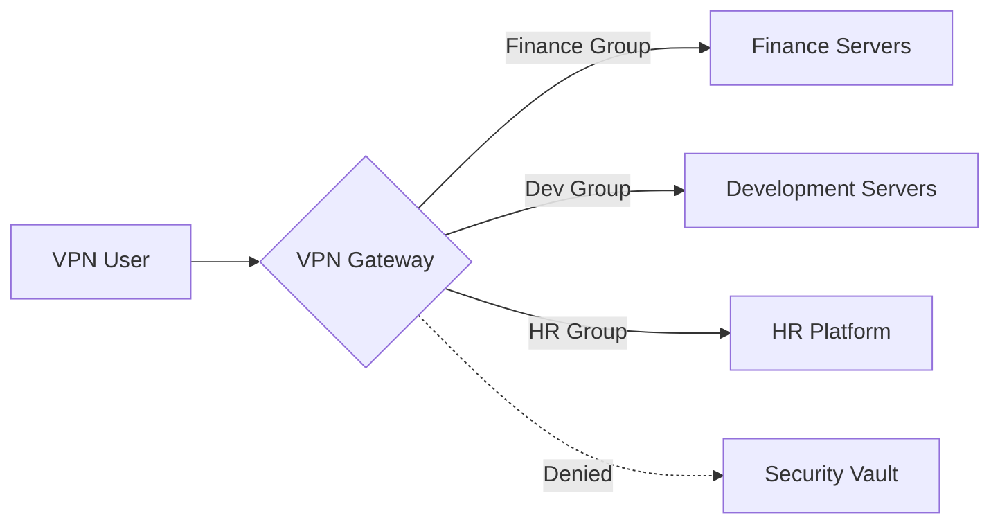

## 0.0 执行摘要：在零信任世界中VPN为何依然重要

在现代企业中，“边界”已基本消失。然而，虚拟专用网络（VPN）对于基础设施管理、安全管理访问和传统应用程序桥接仍然是至关重要的工具。本指南专为300用户规模的环境设计——在这个规模下，手动管理变得不切实际，但“超大型企业”解决方案可能又过于复杂。

我们将重点放在 **WireGuard** 作为主要协议，因为它具有高性能、现代密码学原语和简化的代码库，同时我们也承认OpenVPN和IPsec在特定用例中的作用。

## 0.1 本指南阅读须知

本文档采用渐进式技术栈构建。我们将从高层次的概念模型，逐步深入到低层次的实现细节和操作手册。

- **1.0-3.0节：** 基础概念（“是什么”）。
- **4.0-8.0节：** 架构与设计（“为什么”）。
- **9.0-13.0节：** 身份与安全（“如何做”）。
- **14.0-18.0节：** 高级工程与扩展（“难点”）。
- **附录：** 实际配置模板和故障排除。

:::tip[操作员视角]
VPN本身并不是一个独立的安全性解决方案；它是一个**传输层**，应由强大的身份提供商（IdP）和严格的出站策略来管理。绝不允许在您的隧道内进行“Any/Any”路由。
:::

---

## 1.0 VPN基础：加密覆盖层

本质上，VPN通过不可信的物理网络创建虚拟的点对点连接。在企业环境中，这通常涉及客户端设备（笔记本电脑、手机）与中央网关之间的加密隧道。

### 1.1 连接的生命周期

当用户发起VPN连接时，会发生以下序列：

1. **认证：** 客户端证明其身份（通常通过证书或MFA支持的凭证）。
2. **密钥交换：** 客户端和服务器使用Diffie-Hellman或Noise等协议协商会话密钥。
3. **隧道实例化：** 在两端创建虚拟网络接口（例如 `wg0` 或 `tun0`）。
4. **路由注入：** 更新系统路由表，以通过虚拟接口发送特定的IP范围。
5. **封装：** 出站数据包被封装在外层报头（UDP/TCP）中，加密后发送到网关。
6. **解封装：** 网关解封数据包并将其转发到内部目的地。

### 1.2 封装与开销

每次将数据包封装到VPN隧道中时，都会增加额外的字节。

- **WireGuard开销：** 32字节（IP报头 + UDP报头 + WireGuard报头）。
- **OpenVPN开销：** 60-80字节（因加密算法和传输方式而异）。
如果您的标准互联网连接的最大传输单元（MTU）为1500字节，而VPN增加了32字节，那么隧道内的实际数据限制为1468字节。如果忽略这一点，您的数据包将被“分片”，导致速度变慢和网站无法正常访问。

---

## 2.0 面向网络工程师的专业术语

要设计一个专业的系统，您必须掌握数据包流和密码学的语言：

- **传输层（UDP vs. TCP）：** VPN严格优先选择UDP。TCP over TCP（TCP崩溃）在数据包丢失时会导致灾难性的性能下降，因为两层都会尝试重传。
- **MTU（最大传输单元）：** 数据包大小的物理限制（通常为1500字节）。由于VPN会添加报头（开销），内部MTU必须更低（例如，WireGuard为1420）以避免分片。
- **MSS限制（MSS Clamping）：** 路由器用于拦截TCP握手并“限制”最大报文段大小，使其适应VPN降低后的MTU，从而防止报头符合但数据负载不符合的“黑洞”连接。
- **PFS（完美前向保密）：** 一种特性，即长期密钥的泄露不会危及过去的会话密钥。每个会话都使用唯一的临时密钥。
- **分流隧道：** 仅将公司流量（例如 `10.0.0.0/8`）通过VPN路由，而将Netflix/YouTube等流量通过用户的本地ISP发送。这对于带宽节约至关重要。
- **全隧道（强制隧道）：** 将所有流量通过VPN路由。在高合规性环境中，这是必需的，以确保所有Web流量都经过公司DNS和DLP（数据防泄漏）过滤器。
- **CGNAT（运营商级NAT）：** 当ISP将一个公共IP共享给许多用户时。这通常会破坏IPsec等传统VPN，但WireGuard能很好地处理。
- **完美前向保密（PFS）：** 如果您的服务器长期私钥今天被盗，攻击者无法解密他们昨天记录的会话。每次握手都会生成一个动态的、一次性会话密钥。

---

## 3.0 协议深入探讨：WireGuard vs. 其他

对于300个用户，您选择的协议将决定您未来三年的维护开销。

### 3.1 WireGuard（黄金标准）

- **优点：** 约4,000行代码（可审计），最先进的加密技术（ChaCha20，Poly1305），几乎即时握手，极高吞吐量。
- **缺点：** 设计上是无状态的（对于300+用户，需要手动管理或一个协调层，如NetBird、Tailscale或Firezone）。
- **适用于：** 注重性能的团队、移动用户以及现代Linux/云环境。

### 3.2 OpenVPN（传统主力）

- **优点：** 极强的灵活性，支持TCP（以绕过限制性防火墙），几乎可在任何系统上运行。
- **缺点：** 庞大的代码库（60万+行），上下文切换慢（用户空间 vs 内核空间），证书管理复杂。
- **适用于：** 需要严格基于TLS合规性或传统硬件支持的环境。

### 3.3 IKEv2/IPsec（原生选择）

- **优点：** 高性能，Windows、iOS和macOS原生支持，无需额外应用程序。
- **缺点：** 配置正确异常困难；“IPsec”有许多不兼容的变体。
- **适用于：** 无法向用户推送第三方客户端的“零安装”部署。

---

## 4.0 架构：为300用户设计

当用户规模达到300人时，您不能再仅仅依靠一台运行bash脚本的Linux机器。您需要一个能够经受住周五下午硬件故障考验的架构。

### 4.1 高可用性（HA）对

以主动-被动或主动-主动配置部署两个VPN网关。

- **Keepalived/VRRP：** 使用虚拟IP（VIP）。如果网关A宕机，网关B将在几秒钟内接管VIP。
- **状态同步：** 对于IPsec等协议，您可能需要同步会话状态，以确保用户在故障转移期间不会中断连接。（WireGuard是“静默的”并能即时重新连接，这使得操作更简单）。

### 4.2 “每个大陆都有网关”模型

对于分布式劳动力，位于伦敦的单一网关会让东京的用户感到沮丧。

- **Anycast IP：** 使用基于云的Anycast服务将用户路由到最近的健康VPN节点。
- **地理DNS：** 根据用户位置将 `vpn.company.com` 解析到不同的区域IP。

### 4.3 弹性伸缩（云原生方式）

在AWS或Azure中，将您的VPN网关放置在**自动伸缩组**中。如果CPU使用率超过70%，云会自动启动第三个网关。这需要一个外部状态存储（如Redis）或一个协调层来在节点间共享用户密钥。

---

## 5.0 安全目标：“五大支柱”

您的实施方案必须在上线前证明其符合以下标准：

1. **身份优先访问：** 没有在IdP（例如 Entra ID、Okta、Google Workspace）中拥有有效条目的人员不得进入。
2. **密码学完整性：** 仅使用现代密码。禁用RSA-2048、SHA-1和3DES。
3. **横向移动防御：** 默认使用“拒绝所有”策略。`市场`组的用户不应该能够ping通`数据库`子网。
4. **端点姿态：** 在允许隧道建立之前，检查连接设备是否启用了磁盘加密和有效的防病毒软件。
5. **可见性：** 每次连接、断开和失败的握手都必须记录到中央SIEM（安全信息和事件管理）系统。

---

## 6.0 VPN网关威胁建模

VPN网关是一个巨大的目标。如果它被攻破，攻击者就“进入了内部”。

### 6.1 内部威胁（“偷偷摸摸的管理员”）

- **风险：** IT人员为其个人笔记本电脑创建了“后门”静态密钥。
- **缓解措施：** 每个会话强制执行MFA。无一例外。记录所有密钥生成事件并每周审计。对管理员任务使用“即时”（JIT）访问。

### 6.2 外部威胁（“撞库攻击者”）

- **风险：** 攻击者发现泄露的密码并以副总裁身份登录。
- **缓解措施：** 设备绑定。VPN仅在密码和特定硬件证书/设备ID同时存在时才有效。在认证端点实施速率限制。

### 6.3 基础设施威胁（“DDoS”）

- **风险：** UDP洪水攻击导致VPN对所有人不可用。
- **缓解措施：** WireGuard用于DoS保护的“Cookie”机制。在握手被证明有效之前，它会忽略没有有效MAC的数据包。使用基于云的WAF（Web应用程序防火墙）在边缘过滤恶意流量。

---

## 7.0 路由和子网设计（中等难度）

高效的路由可防止性能瓶颈并简化安全规则。

### 7.1 避免子网冲突

许多家用路由器使用 `192.168.1.0/24`。如果您的公司网络也使用该范围，用户将无法访问内部资源，因为他们的计算机认为流量是其家庭“本地”的。

- **标准化使用 `10.x.x.x` 或 `172.16.x.x` 范围。**
- **为VPN池使用一个独特的网段**（例如 `100.64.0.0/10` - 运营商级NAT范围）以避免重叠。

### 7.2 NAT陷阱

如果您在用户进入网络时将所有人都NAT到一个单一IP，您的防火墙日志将显示所有流量都来自“VPN服务器”。您将无法查看*哪个*用户访问了*哪个*服务器。

- **解决方案：** 直接路由VPN子网。确保内部服务器有返回VPN网关的路由以处理这些IP。

---

## 8.0 全隧道与分流隧道：深入情境分析

这个决定通常是政治性的，而非技术性的。

### 8.1 全隧道的理由

- **安全性：** 您可以将所有网络流量强制通过安全网关（SWG）。这可以防止用户在工作时间访问网络钓鱼网站或下载恶意软件。
- **隐私性：** 它保护用户流量免受公共Wi-Fi（酒店、咖啡馆）上的窥探。
- **合规性：** 许多行业（金融、医疗）要求全隧道以符合数据保护法律。

### 8.2 分流隧道的理由

- **性能：** Zoom/Teams通话无需先到达您的数据中心再出去；让它们直接访问互联网。
- **成本：** 您无需为用户午休时间观看4K YouTube的带宽付费。
- **硬件负担：** 您的VPN网关不必处理千兆字节的无害流量（如Netflix）。

:::caution[混合中间路线]
大多数现代企业使用**分流包含（Split Inclusion）**模式。即包含您的内部CIDR范围（例如 `10.0.0.0/8`）和特定的SaaS IP，但将其他所有流量留给本地ISP。
:::

---

## 9.0 身份架构：将VPN连接到现实

对于300个用户，您无法在网关上管理本地Linux用户。您需要一个身份桥接。

### 9.1 身份循环

1. **客户端应用程序**请求登录。
2. **网关**将用户重定向到OIDC/SAML登录页面（Okta/Entra ID）。
3. **用户**完成MFA（FIDO2，身份验证器应用）。
4. **IdP**将令牌（JWT）发回网关。
5. **网关**生成一个短寿命的WireGuard密钥并将其推送到客户端。

### 9.2 MFA实施策略

- **避免短信：** 它容易受到SIM卡互换和SS7拦截的攻击。
- **优先选择TOTP或WebAuthn：** 如果您非常重视安全性，请要求使用硬件密钥（Yubikey）进行VPN访问。FIDO2是现代身份验证安全的巅峰。

---

## 10.0 访问控制列表（ACL）和微隔离

VPN不应该是一个“扁平”网络。



### 10.1 实施RBAC

- 将IdP组映射到网络标签。
- 如果您使用 **WireGuard**，请使用 **NetBird** 或 **Tailscale** 等工具通过Web UI定义这些规则。
- 如果您使用 **Linux/Iptables**，您需要一个动态脚本，在用户连接时更新规则。这通常被称为“动态防火墙策略”。

---

## 11.0 监控和日志记录：成为“天空之眼”

如果有人问“谁在凌晨2点访问了备份服务器？”，您的VPN日志必须能给出答案。

### 11.1 关键指标跟踪

- **并发会话数：** 我们是否达到了硬件CPU/RAM的限制？
- **每用户数据吞吐量：** 是否有人在泄露数据（相对于其角色，上传量异常高）？
- **握手延迟：** 认证服务器是否缓慢？
- **丢包：** 表明存在MTU问题或ISP限速。

### 11.2 SIEM集成

将您的日志流式传输到Elasticsearch、Splunk或Azure Monitor。寻找“不可能的旅行”——用户从纽约登录，然后10分钟后从法兰克福登录。这是会话令牌被盗的主要指标。

---

## 12.0 解决MTU/MSS难题（硬核）

这是VPN技术支持请求的首要原因。用户连接后，却无法打开大型网站或发送电子邮件。

### 12.1 “死亡Ping”测试

如果您的VPN已连接但数据传输受阻，请运行：
`ping -M do -s 1400 10.0.0.1` （在Linux上）或 `ping 10.0.0.1 -f -l 1400` （在Windows上）。
持续降低 `1400` 直到ping成功。那就是您的路径MTU。

### 12.2 解决方案

- 将WireGuard MTU设置为 `1280`（IPv6最安全的最小值）。
- 在您的网关上启用MSS限制：
    `iptables -t mangle -A FORWARD -p tcp --tcp-flags SYN,RST SYN -j TCPMSS --clamp-mss-to-pmtu`
这确保您的服务器在远程服务器的数据包到达VPN隧道之前，就通知它缩小数据包大小。

---

## 13.0 高可用性和负载均衡（硬核）

为了支持300个用户而无停机时间，您需要冗余。

### 13.1 轮询DNS

最简单的形式。将 `vpn.company.com` 指向三个不同的IP地址。客户端随机选择一个。如果其中一个失败，用户可能需要重新连接2-3次才能连接到“活动”服务器。

### 13.2 TCP/UDP负载均衡器

使用云负载均衡器（如AWS NLB或Azure Load Balancer）。它执行健康检查，并且只将流量发送到正常工作的网关。注意：这对于WireGuard来说可能很棘手，因为它采用无连接的UDP协议。您必须基于源IP使用“会话粘滞性”。

---

## 14.0 VPN的灾难恢复（DR）

如果您的主数据中心发生故障，会发生什么？

- **云备份：** 始终在不同的云区域（例如AWS vs GCP）准备一个“冷备用”网关。
- **配置即代码：** 将您的VPN配置存储在Git中。如果服务器宕机，您应该能够在5分钟内使用Terraform或Ansible启动一个新服务器。“不可变性”是您在灾难恢复中的最佳伙伴。
- **紧急密钥：** 在安全的地方保留一套物理“玻璃破碎”密钥，以防IdP本身发生故障。

---

## 15.0 卓越运营：开发者体验

一个难以使用的安全VPN会被您最有才华的工程师绕过。

- **自动连接：** 配置客户端，让用户不在公司办公室Wi-Fi时自动开启。
- **SSO集成：** 一键登录。无需用户管理独立的密码或复杂的密钥文件。
- **静默更新：** 使用MDM（Jamf，InTune）推送客户端更新，而不打扰用户。
- **友好的主机名：** 确保您的内部DNS（例如 `jira.int.company.com`）可以通过VPN工作，这样用户就不必记住IP地址。

---

## 16.0 合规性和审计（“枯燥”但至关重要的一部分）

如果您的业务受SOC2、HIPAA或GDPR监管，您的VPN是一个关键的控制措施。

- **审计追踪：** 记录管理员每次更改ACL的操作。
- **会话终止：** 在12或24小时后自动强制用户下线，以使用MFA重新进行身份验证。这可以防止被盗笔记本电脑上的“永恒隧道”。
- **数据驻留：** 如果您位于欧盟，请确保您的VPN网关不会通过非合规司法管辖区（例如某些位于美国的T数据中心）的节点路由流量。

---

## 17.0 内核级性能优化

为了获得最大速度，请调整您网关上的Linux内核。这些更改能让服务器轻松处理每秒10,000+个数据包。

```bash
# Increase packet queue lengths
sysctl -w net.core.netdev_max_backlog=5000
# Increase receive/send buffer sizes (16MB)
sysctl -w net.core.rmem_max=16777216
sysctl -w net.core.wmem_max=16777216
# Enable BBR (Bottleneck Bandwidth and Round-trip propagation time) for TCP
sysctl -w net.core.default_qdisc=fq
sysctl -w net.ipv4.tcp_congestion_control=bbr
```

### 17.1 多队列支持

现代服务器拥有16个以上的CPU核心。WireGuard默认能很好地处理这个问题，但请确保您的服务器NIC（网卡）已配置为将中断请求（IRQs）分布到所有核心。检查 `/proc/interrupts` 进行验证。如果所有中断都集中在核心0，您的性能将会遇到瓶颈。

---

## 18.0 面向未来：ZTNA与后VPN时代

行业正朝着零信任网络访问（ZTNA）方向发展。

- **理念：** 并非给予用户“网络访问权限”，而是通过反向代理给予他们“应用程序访问权限”。
- **时间线：** 开始将基于Web的应用程序迁移到ZTNA（Cloudflare Tunnel、Zscaler、Pomerium），同时保留VPN用于厚客户端应用程序和服务器管理。VPN成为“管理平面”，而ZTNA成为“用户平面”。

---

## 19.0 故障排除场景：真实世界教训

### 场景A：“视频通话缓慢”

**症状：** 用户反映Zoom在家用Wi-Fi下工作正常，但在VPN上出现卡顿。
**诊断：** 用户位于“长肥管道”（高延迟、高带宽）上。标准的TCP拥塞控制（Cubic）在此处失效，因为它认为延迟是拥塞的标志。
**修复：** 将网关切换到BBR（如第17.0节所示）。BBR衡量实际带宽，并更优雅地处理延迟。

### 场景B：“僵尸会话”

**症状：** 控制面板显示用户已连接，但用户表示他们4小时前就已断开连接。
**诊断：** 客户端的互联网突然断开（例如隧道进入电梯），网关从未收到“再见”数据包。由于UDP是无连接的，服务器会保持会话活动。
**修复：** 减少 `PersistentKeepalive` 并实施10分钟的服务器端“死对等体检测”（DPD）超时。

### 场景C：“内部网站无限加载”

**症状：** 浏览器标签页显示了页面标题，但页面内容始终无法加载。
**诊断：** MTU不匹配。小的握手数据包能通过，但大的数据包（HTML/图像）被中间路由器丢弃了。
**修复：** 在网关上实施MSS限制（第12.2节）。

---

## 20.0 Linux、Mac和Windows CLI快速入门

### 20.1 Linux（客户端）

```bash
# Install
sudo apt install wireguard
# Config
sudo nano /etc/wireguard/wg0.conf
# Up
sudo wg-quick up wg0
```

### 20.2 macOS（客户端）

使用官方Mac App Store应用程序可获得最佳体验，或使用Homebrew进行CLI操作：

```bash
brew install wireguard-tools
sudo wg-quick up ./myconfig.conf
```

### 20.3 Windows（客户端）

从 `wireguard.com` 使用官方MSI安装程序。它会安装一个系统服务，允许非管理员用户（如果配置正确）启用或禁用VPN。

---

## 附录A：WireGuard基础服务器配置 (Ubuntu 22.04)

```ini
# /etc/wireguard/wg0.conf
[Interface]
PrivateKey = <SERVER_PRIVATE_KEY>
Address = 10.0.0.1/24
ListenPort = 51820

# Force MTU to avoid fragmentation
MTU = 1420

# PostUp/PostDown for routing
PostUp = iptables -A FORWARD -i %i -j ACCEPT; iptables -t nat -A POSTROUTING -o eth0 -j MASQUERADE
PostDown = iptables -D FORWARD -i %i -j ACCEPT; iptables -t nat -D POSTROUTING -o eth0 -j MASQUERADE

[Peer]
# Staff Member 1
PublicKey = <CLIENT_PUBLIC_KEY>
AllowedIPs = 10.0.0.2/32
```

## 附录B：高级Linux客户端设置

```bash
# Generate keys
wg genkey | tee privatekey | wg pubkey > publickey
# Create config
sudo nano /etc/wireguard/wg0.conf
# Start service permanently
sudo systemctl enable --now wg-quick@wg0
```

## 附录C：故障排除清单

1. **无法连接？** -> 检查公司防火墙是否打开了UDP端口51820。
2. **已连接但无互联网？** -> 检查 `sysctl net.ipv4.ip_forward` 是否设置为 `1`。
3. **性能缓慢？** -> 将MTU降低到 `1280`。
4. **特定应用程序失效？** -> 检查MSS限制规则。
5. **DNS故障？** -> 确保客户端上的 `/etc/resolv.conf` 指向内部DNS服务器，或在 `wg0.conf` 中使用 `DNS = 10.0.0.1` 指令。

---

## 总结：致架构师的最终思考

为300个用户构建VPN是 **安全性**、**隐私性** 和 **可用性** 之间的一种平衡。通过选择像WireGuard这样的现代协议，自动化您的身份流程，并遵守网络规则（MTU/MSS），您可以构建一个对用户而言不可见，对攻击者而言坚不可摧的系统。

最成功的VPN是那种无人知晓其正在运行的VPN。保持警惕，保持日志记录，并在需要之前务必测试您的故障转移。

---

## 21.0 安全隧道的先进加密配置

虽然WireGuard和IPsec开箱即用就能提供强大的安全性，但企业环境通常需要明确的加密强化来满足FIPS 140-2或NIST指南等监管标准。

### 21.1 密码套件选择（现代堆栈）

在一个量子计算潜力日益增长的世界中，选择正确的密码至关重要：

- **KEM（密钥封装机制）：** 开始研究后量子算法，如 **Kyber** 或 **McEliece**。尽管它们尚未成为大多数VPN客户端的标准，但在某些WireGuard分支中已进入“实验性支持”阶段。
- **AEAD（带有关联数据的认证加密）：** 始终使用支持AEAD的密码，如 **ChaCha20-Poly1305** 或 **AES-GCM**。这些密码可在一次操作中提供机密性和完整性，从而防止“密文可塑性”攻击。

### 21.2 Noise协议框架

WireGuard基于 **Noise协议框架** 构建。该框架允许“1-RTT”握手，意味着连接可在一次往返中建立。这就是为什么WireGuard比旧协议所需的“四次握手”感觉明显更快的原因。

---

## 22.0 云原生VPN集成（AWS、GCP、Azure）

如果您的300名用户主要访问公共云中的资源，您的VPN架构应反映这一点。

### 22.1 AWS Transit Gateway (TGW)

不要将每个用户连接到VPC中的网关，而是将他们连接到与Transit Gateway关联的 **AWS客户端VPN**。

- **优点：** Transit Gateway充当所有VPC的中央路由器。您创建的任何新VPC都可以通过VPN立即访问，而无需重新配置网关。
- **安全性：** 您可以对TGW附件应用安全组，创建一个中央控制点。

### 22.2 Azure Virtual WAN

对于在Microsoft 365和Azure上投入巨资的组织，**Azure Virtual WAN** 提供了一个全球性的“分支到云”连接模型。

- **点到站点 (P2S)：** 这是Azure中用于用户到网关VPN的术语。它支持OpenVPN和IKEv2，并与Microsoft Entra ID（前身为Azure AD）原生集成以实现MFA。

---

## 23.0 管理VPN延迟：物理定律

无论您的服务器有多快，您都无法超越光速。但是，您可以优化“最后一英里”和“中间一英里”。

### 23.1 减少握手延迟

在高延迟区域（例如，南美用户连接到弗吉尼亚州的服务器），握手过程中每次额外的往返都会增加500毫秒的等待时间。

- **解决方案：** 使用需要最少往返次数的基于UDP的协议（WireGuard）。不惜一切代价避免使用基于TCP的VPN。

### 23.2 “中间一英里”优化

大型云服务提供商（AWS、Cloudflare、Google）拥有私有光纤骨干网，其速度比公共互联网快30-40%。

- **技术：** 让用户连接到其家附近的“本地”入口点（PoP）。该PoP随后通过服务提供商的私有骨干网将流量传输到您的中央数据中心。这是 **Tailscale**（通过其DERP中继）和 **Cloudflare Warp** 速度背后的秘密。

---

## 24.0 总结：关于弹性恢复的最终结论

归根结底，为300名用户提供VPN是一项**任务关键型基础设施**。如果VPN宕机，公司将无法正常运作。

1. **冗余至关重要。** （两个节点算一个；一个节点等于没有）。
2. **身份即边界。** （MFA并非可选）。
3. **性能是二元的。** （如果速度慢，用户就不会使用）。
4. **日志即真相。** （如果没有记录，就等于没有发生）。

保持勤勉，监控您的丢包，并始终保护好您的私钥。
