## 局面再次转变

在前四卷中，我们构建了防御墙（[一](/posts/secure_systems_architecture/)），在每个入口验证了所有主体（[二](/posts/identity_and_access_in_depth/)），使我们的消息不可伪造（[三](/posts/cryptography_engineering_in_depth/)），并学会了检测并存活于无论如何都会发生的漏洞中（[四](/posts/detection_and_response_in_depth/)）。所有这些理念都曾假设了一些正在悄然失效的事实：存在一个*服务器*、一台*机器*、一个*持久存在的实体*，你拥有它，并且可以指向它。

在云原生世界中，这个假设瓦解了：

* “服务器”是一个生命周期为九十秒的**容器**，然后被一个完全相同的副本取代。
* 基础设施不是通过机架部署的；它是一个由管道应用的**YAML文件**。
* 应用程序不是你编写的；它是**你的代码加上你没有编写的、数千个依赖项**，由一个你难以完全审计的构建系统组装而成。

本终章旨在防御*那个*世界，在那个世界里，边界已完全消失，工作负载是“牛”而非“宠物”，而这十年中最具破坏性的漏洞并非通过你的前门，而是通过你的**供应链**入侵。本系列所教的一切仍然适用，但它所应用的对象现在每天都在闪烁、数千次地出现和消失。

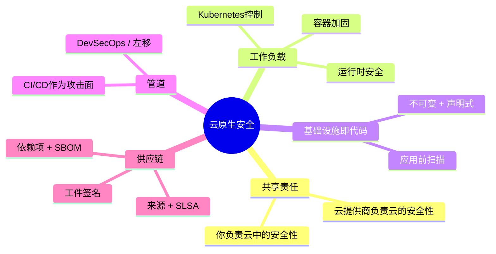

---

## 第一部分：共享责任模型

云安全中第一个也是最容易被误解的概念：**云提供商不负责保护你的应用程序。** 他们保护云运行的*基础设施*；你保护你*放入*其中的内容。这条界限根据服务模型的不同而移动，而漏洞就存在于人们对这条界限位置的混淆中 [^1]：

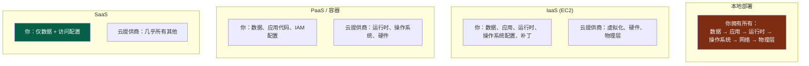

:::important[你的责任永不归零]
请注意每一列中的不变项：**你始终拥有你的数据和访问配置。** 绝大多数“云安全漏洞”并非是提供商被攻击，而是*客户*配置错误：一个公开的S3存储桶、一个权限过高的IAM角色、一个暴露给`0.0.0.0/0`的数据库。云提供了强大的默认关闭的基础功能；保持它们关闭是你的责任。配置错误，而非提供商泄露，是云数据泄露的首要原因。 [^2]
:::

---

## 第二部分：保护工作负载

### 第一章：容器安全 - 分层现实

容器不是轻量级虚拟机；它是在**共享宿主内核**上的一组隔离*进程*。这一事实决定了其整个威胁模型，而防御则从镜像到运行时分层进行：

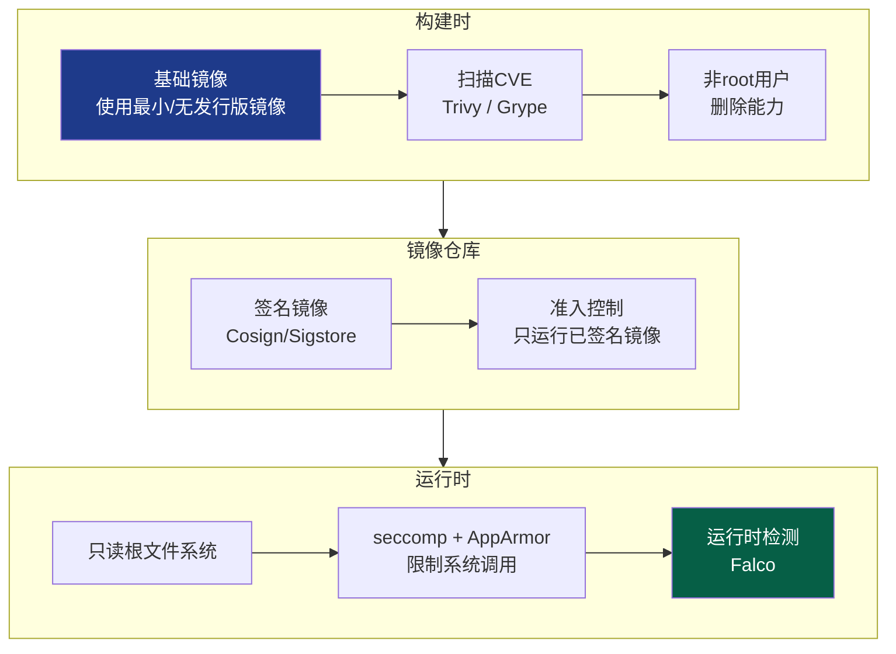

最具杠杆效应的容器实践，按投入产出比排序：

*   **最小化基础镜像** - `distroless`或scratch镜像只包含你的应用程序，*不含其他任何东西*：没有shell、没有包管理器、没有`curl`。攻击者一旦进入，将没有可用于横向移动的工具。这还将CVE攻击面缩小了一个数量级，没有操作系统包意味着没有操作系统包漏洞。
*   **永不以root身份运行** - 以root身份运行的容器进程一旦逃逸容器，就相当于*在宿主机上*以root身份运行。设置一个非root `USER`，删除所有Linux能力，并仅添加所需的能力。
*   **只读根文件系统** - 如果容器无法写入其自身的文件系统，攻击者就无法在其上放置恶意载荷。
*   **扫描所有镜像** - 在CI中使用`Trivy`/`Grype`，并根据关键CVE阻止构建。

:::warning[容器逃逸是关键]
由于容器共享宿主内核，**内核漏洞利用或配置错误就意味着完全控制宿主机**，而从一台宿主机，往往就能控制整个集群。使这变得轻而易举的致命错误有：以`--privileged`模式运行、将Docker套接字（`/var/run/docker.sock`）挂载到容器中（这相当于将root权限直接授予宿主机）、以及以UID 0运行。对待特权容器的决策，应像授予`sudo`权限一样严格审查。 [^3]
:::

### 第二章：Kubernetes - 编排器加固

Kubernetes是一个用于容器的分布式操作系统，其安全性本身就是一个重要议题。攻击面涵盖四个方面，可概括为**云原生安全的4C原则**：云（Cloud）、集群（Cluster）、容器（Container）、代码（Code） [^4]。

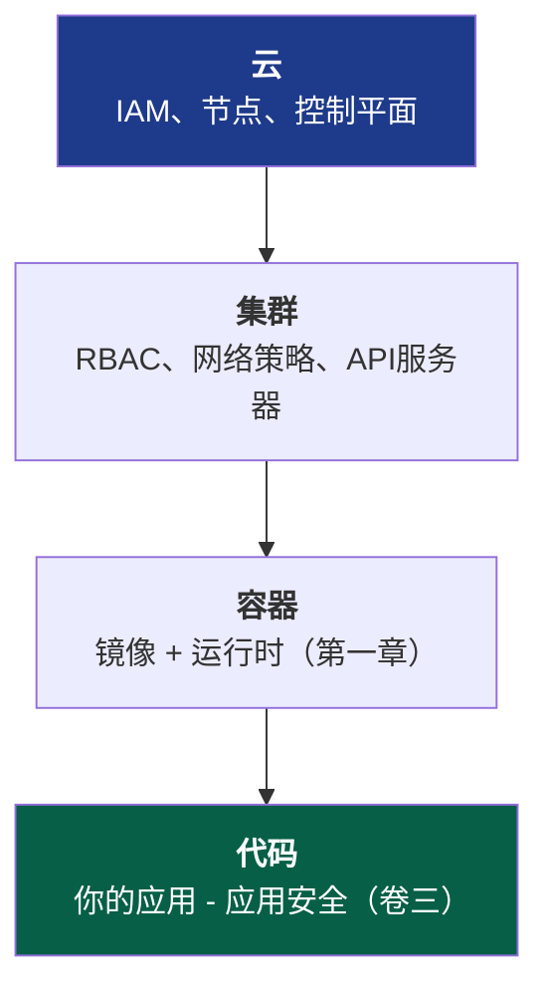

核心集群控制措施，每个都旨在封闭特定的攻击路径：

::::steps

:::step[RBAC - API的最小权限原则]{subtitle="谁能对集群做什么"}
Kubernetes API服务器是核心，控制它就意味着控制所有工作负载。应用卷二的最小权限原则：服务账户不要使用通配符`cluster-admin`，将角色范围限定到命名空间，并且在不需要的地方绝不挂载默认的服务账户令牌。一个拥有过高权限令牌的Pod是直接通向集群接管的枢纽点。
:::

:::step[网络策略 - 默认拒绝]{subtitle="东西向分段"}
默认情况下，*每个Pod都可以与所有其他Pod通信*，扁平、信任，这正是卷一中警告过的网络模型。应用**默认拒绝**的网络策略，并仅明确允许所需的流量。这是应用于Pod网络的微隔离（卷一/二）：它将单个受损的Pod从一个启动平台变成一个死胡同。
:::

:::step[Pod安全标准 - 限制危险行为]{subtitle="强制执行容器规则"}
强制执行**受限（Restricted）**Pod安全标准：不允许特权Pod，不允许宿主命名空间共享，只允许非root用户，只读根文件系统。这是平台*强制执行*第一章容器规则的地方，而不是仅仅向开发人员推荐。
:::

:::step[Secrets - 不要将base64用作“加密”]{subtitle="保护敏感数据"}
Kubernetes Secret默认在etcd中仅是**base64编码**的，而不是加密的。为etcd启用**静态加密**，更好的是，集成一个外部管理器（Vault，通过CSI驱动的云KMS），这样Secret就不会以可恢复的形式存储在etcd中。否则，任何拥有etcd读访问权限的人都可以读取所有Secret。
:::

::::

:::tip[准入控制是你的策略执行关键点]
每个进入集群的对象都会通过**准入控制器**，这是以代码形式强制执行策略的理想位置。**OPA Gatekeeper**或**Kyverno**等工具允许你*拒绝*不符合规范的工作负载：“没有签名的镜像不允许运行”、“没有资源限制的容器不允许运行”、“不允许使用`latest`标签”。这是卷二零信任模型中的PEP（策略执行点），应用于集群的入口。在准入阶段强制执行的策略不会被开发人员遗忘。 [^5]
:::

### 第三章：运行时安全 - 假定Pod已被攻破

到目前为止，所有措施都是预防性的。将卷四的*假定入侵*思维应用于工作负载：容器*终将*运行不该运行的东西。**运行时安全**监控实时行为并标记异常，例如在一个只应运行一个进程的容器中产生一个shell，一个对外连接到从未见过的IP，或写入`/etc/passwd`。**Falco**等工具将内核的系统调用流转化为检测，将卷四的SIEM/检测工程方法论扩展到瞬时工作负载。

---

## 第三部分：基础设施即代码 - 保护蓝图

在云原生中，基础设施是**声明式的，而非配置式的**，例如Terraform、CloudFormation、Pulumi。这是一份安全*馈赠*：因为整个基础设施都是代码，你可以在**单个资源存在之前就扫描其配置错误。**

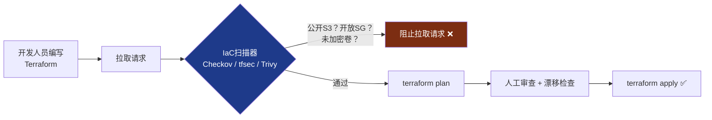

这是**左移**（卷一的SSDLC主题）的终极体现：那些可能导致漏洞的配置错误，如对世界开放的安全组、未加密的数据库、公开的存储桶，在代码审查阶段就被捕获，*在它们进入生产环境之前*。漏洞发现得越晚，修复成本就以数量级增长：

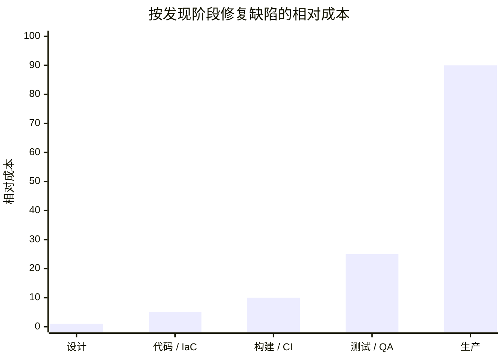

向右的每一步都会使成本倍增，而生产环境中的*漏洞*则完全超出了这张图表的范围。IaC扫描是如何将检测推到成本最低的环节。

:::note[不可变性是一种安全属性]
IaC实现了**不可变基础设施**：服务器从不在原地打补丁，而是从一个已知良好镜像*替换*而来。这悄然解决了两个问题。**配置漂移**（“实际运行情况”与“我们认为运行情况”的缓慢偏离）消失了，因为每次部署都从源头重建。攻击者的**持久性**也变得更加困难，植入在运行中的宿主机上的后门会在该宿主机下次重新部署时被清除，这可能在几小时后发生。视作“牛”而非“宠物”，这是一种安全态势，而不仅仅是运维便利性。
:::

---

## 第四部分：供应链 - 十年来的前沿阵地

这是现代软件中一个令人不安的真相：**你编写的可能只占你所交付内容的5%。** 其余95%是开源依赖项、基础镜像和构建工具，这些代码来自陌生人，被间接拉取，并以你应用程序的全部权限运行。供应链现在是安全领域中最活跃的被利用前沿，因为当你可以妥协*它信任的东西*时，为什么还要去攻破一个加固的目标呢？

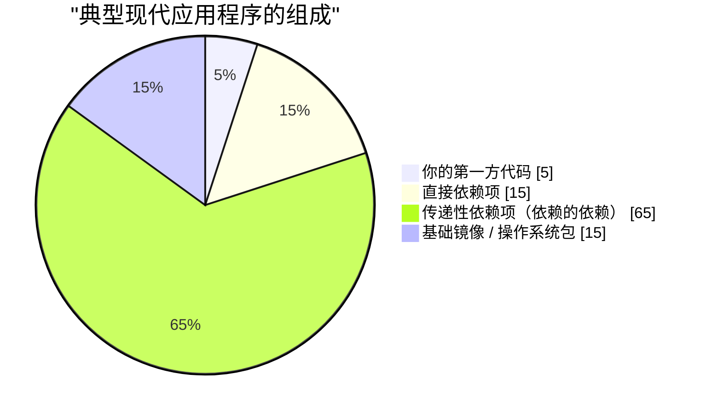

那个巨大的“传递性”部分是关键：你*选择了*你的15个直接依赖项，但你却继承了数百个你从未听说过的依赖项，其中任何一个都可能终结你的安全。

### 第四章：供应链攻击剖析

近年来的灾难性事件，**SolarWinds**（2020年，一个被攻破的构建管道将后门注入到发给18,000个组织的签名更新中）和**Log4Shell**（2021年，一个存在于数百万应用程序中日志库的RCE漏洞，易于利用） [^6]，它们具有相似的模式：

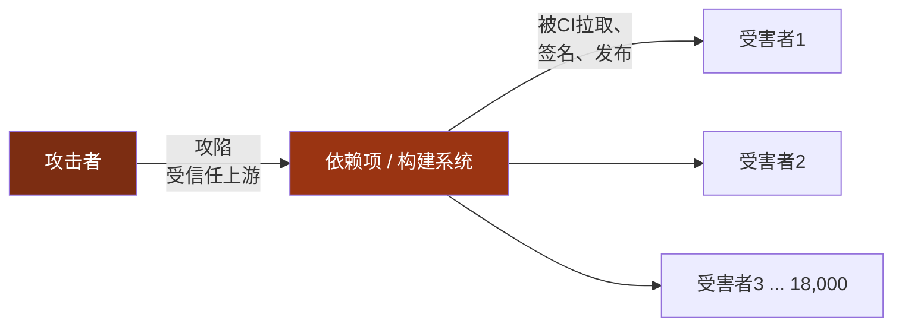

一次妥协，数千名受害者，所有其他方面都做得很好。这种不对称性使得供应链安全成为国家安全优先事项，也使得以下防御措施成为基本要求，而非复杂高级的手段。

### 第五章：现代防御 - SBOM、签名与SLSA

三项相互关联的实践回答了三个供应链问题：*里面有什么，它是否如声称的那样，以及我能否信任它的构建方式*：

| 防御措施 | 解决的问题 | 措施内容 |
| --- | --- | --- |
| **SBOM** | *我的软件中实际包含什么？* | 软件物料清单，一个机器可读的组件和版本清单。当下一个Log4Shell漏洞出现时，你可以通过搜索SBOM在几分钟内（而非几周内）知道你是否受到影响。 [^7] |
| **工件签名** | *这个工件是真实的且未被篡改的吗？* | 对构建输出进行密码学签名（**Sigstore/Cosign**），以便消费者验证其来源，将卷三的签名应用于你的构建工件。 |
| **SLSA** | *我能信任构建它的过程吗？* | 软件工件供应链等级，一个用于构建完整性的分级框架：源代码经过验证，构建环境隔离，来源信息生成并签名。 [^8] |

端到端的安全管道将这些与本系列中的所有内容编织在一起：

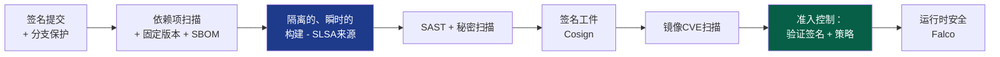

:::warning[CI/CD管道本身就是首要目标]
你的构建系统拥有神一般的权限，它可以读取所有秘密，签署所有工件，并部署到生产环境。泄露的CI令牌、在特权运行器中运行不可信代码的恶意拉取请求，或者被投毒的GitHub Action，都可能直接导致发布带有*你自身有效签名*的后门软件。将管道视为生产基础设施：最小权限令牌（OIDC联邦、短生命周期，根据卷二）、日志中不包含秘密信息、固定Action版本（通过SHA而非标签），以及用于不可信代码的隔离、瞬时运行器。构建你防御体系的管道成为攻击目标的原因，与铸币厂成为攻击目标的原因相同：它生产信任。 [^9]
:::

---

## 第六部分：DevSecOps - 实现持续安全

所有五卷都汇聚于一个单一的文化转变。旧模式下，安全团队在最后审查软件并说“不”，这种模式无法在每天部署上千次的现代世界中生存。**DevSecOps**解除了安全团队的守门员角色，将其专业知识*融入*到管道中，使安全实现自动化、持续化，并成为每个人的职责。

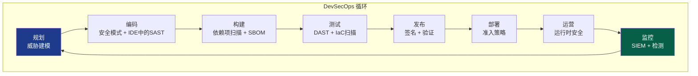

循环中的每个节点都是本系列中的一个章节，现在已实现自动化和嵌入：威胁建模（一）、安全编码和密码学（三）、依赖项和IaC扫描（五）、签名（三/五）、准入控制和零信任强制执行（二）、运行时检测和SIEM（四）。安全不再是一个*阶段*，而成为管道的一个*属性*，持续检查，通过代码强制执行，通过时无形，失败时响亮。

:::important[其核心文化]
DevSecOps是20%的工具和80%的文化。其基本信念是：**安全是共享责任，而非某个部门的否决权。** 实现这一目标的方法是让安全路径成为*简单*路径：预先批准的加固基础镜像、默认安全的模板、开箱即用的合规IaC模块，以及在拉取请求中提供秒级自动化反馈，而不是在季度审计中才发现。当做安全的事情比做不安全的事情工作量*更少*时，安全就能规模化。当它成为一种负担时，开发人员每次都会绕过它。
:::

---

## 结论：本系列的综合

我们从卷一开始，从物理层入手，墙壁中的电缆，线路上的帧，我们在此结束，在一个存在90秒的容器中，其基础设施本身只是Git仓库中的文本。贯穿五卷，一个真理在每个层面都得到了印证：

> **没有单一的控制措施能够保护系统。安全是深度防御，是相互独立、相互重叠的控制层，每一层都假定它前面的层最终会失效。**

回顾一下这种深度防御实际上包含了什么：

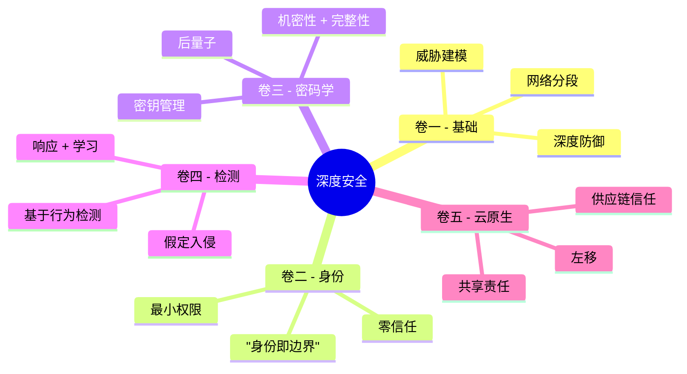

防火墙假定网络可能被攻破，因此身份验证每个请求。身份假定凭证可能被盗，因此密码学使会话不可伪造且具有前向保密性。密码学假定端点仍可能被控制，因此检测机制监控背叛行为。检测机制假定工作负载本身可能被投毒，因此供应链证明我们发布的是我们构建的。这些控制措施中没有一个信任其他措施是完美的，而*这种被设计到架构中的不信任感*，正是其全部艺术所在。

边界已消失。机器变得瞬时。代码大部分来自陌生人。而贯穿所有这一切，这一原则始终不变：**分层防御，验证一切，假定入侵，证明来源，永不相信一堵墙会是最后一堵。** 这就是深度安全。这就是我们的职责。

感谢您一路走过整个技术栈。去构建那些难以被攻破，并且足够谦逊以承受被攻破后仍能生存的系统吧。

---

## 参考资料

[^1]: [AWS - 共享责任模型](https://aws.amazon.com/compliance/shared-responsibility-model/)
[^2]: [Gartner / CSA - 十大云安全威胁：最严峻的十一项](https://cloudsecurityalliance.org/artifacts/top-threats-to-cloud-computing-egregious-eleven/)
[^3]: [NIST (2017) - SP 800-190: 应用程序容器安全指南](https://csrc.nist.gov/publications/detail/sp/800-190/final)
[^4]: [Kubernetes - 云原生安全概览（4C原则）](https://kubernetes.io/docs/concepts/security/overview/)
[^5]: [Open Policy Agent - Gatekeeper](https://open-policy-agent.github.io/gatekeeper/website/docs/)
[^6]: [CISA - Apache Log4j 漏洞指南](https://www.cisa.gov/uscert/apache-log4j-vulnerability-guidance)
[^7]: [NTIA - 软件物料清单 (SBOM)](https://www.ntia.gov/SBOM)
[^8]: [SLSA - 软件工件供应链等级](https://slsa.dev/)
[^9]: [OWASP - CI/CD 十大安全风险](https://owasp.org/www-project-top-10-ci-cd-security-risks/)