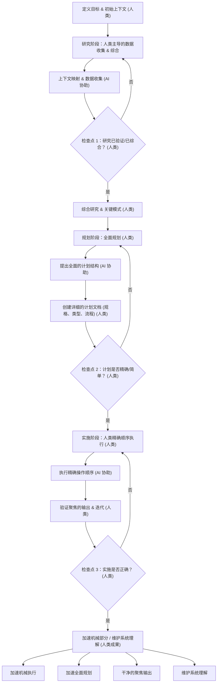

现在，工程团队中正发生着一个悄无声息的现象。一位开发者使用 AI 代理生成了一个复杂的功能。测试通过了。代码已部署。但如果你问这位开发者确切解释所交付内容的机制，他们可能会感到困难。

我们正在交付我们不完全理解的代码，而且交付的速度是前所未有的。

最近的行业讨论——特别是来自那些在大型企业公司处理庞大代码库的工程领导者的声音——凸显了现代软件开发中一个显而易见的悖论。AI 工具已将过去需要数天才能完成的任务缩短到数小时。但大型生产系统最终会失败，而当它们失败时，你需要一个深刻理解系统的人来调试它。

我们并非第一代面临软件危机的，但我们是第一代以无限的生成规模来应对它的。

## "简单"的幻觉

要理解为什么我们的代码库越来越难以理解，我们必须回顾一个基本的工程哲学：*简单* (simple) 和*容易* (easy) 之间的区别。

正如 Rich Hickey（Clojure 的创造者）所著名定义的，**简单**指的是结构。它意味着一个组件只做一件事，并且与其他组件没有纠缠。而**容易**，另一方面，指的是近距离。它意味着解决方案就在你手边——就像从 npm 拉取一个包，从 Stack Overflow 复制一个代码片段，或者提示一个 LLM。

简单性需要深思熟虑、设计和架构上的解耦。“容易”则几乎不需要思考。

AI 是终极的“容易”按钮。在一个聊天界面中，添加功能的阻力为零。你让 AI 添加认证，然后是 OAuth，然后修补一个会话 bug。不知不觉中，你就不再是做软件工程了，而是在管理一个臃肿的上下文窗口。因为 AI 模型总是渴望取悦，它们会简单地将新代码叠加在旧代码之上，修改逻辑以满足你最新的提示，而不会对糟糕的架构决策产生任何抵触。

我们现在用速度换取简单性，却要在未来为巨大的复杂性付出代价。

## AI 时代的意外复杂性

在其具有里程碑意义的 1986 年论文《没有银弹》中，Fred Brooks 将软件复杂性分为两类：
1.  **本质复杂性 (Essential Complexity)：** 解决实际业务问题的根本困难。
2.  **意外复杂性 (Accidental Complexity)：** 我们在尝试实现解决方案时创建的混乱的变通方法、遗留抽象和技术债务。

在一个庞大、陈旧的代码库中，这两种复杂性是深度交织的。要将它们分开，需要历史背景和人类的直觉。

AI 生成工具在这方面非常挣扎。当一个 LLM 扫描一个代码库时，它缺乏判断力来区分核心业务规则和一个过时的、hacky 的变通方法。它将每个现有模式都视为必须保留的严格要求。如果你让 AI 重构一个深度耦合的遗留系统，它通常会失控，要么放弃，要么用新的语法重新创建旧的、破损的模式。

## 解决方案：规格驱动开发

如果核心问题是缺乏理解，那么解决方案不是更努力地提示或等待一个更聪明的模型。解决方案是完全改变我们与代码生成的关系。我们必须从编写代码转向*指定架构*。

这种方法——通常被称为上下文压缩或规格驱动开发——迫使人类工程师在 AI 进行打字这一机械工作之前，完成思考这一艰苦的工作。它通常涉及三个不同的阶段：

### 1. 指导性研究
与其让 AI 开始编写代码，不如向其输入相关的架构图、文档和有针对性的代码片段。你让它映射依赖关系并识别边缘情况。作为人类，你来验证和纠正这些分析。输出的不是代码，而是一份已验证的研究文档。

### 2. 高保真度规划
利用研究结果，起草一个严格的实施计划。这包括定义函数签名、数据流和服务边界。这份文档应该非常精确，以至于一名初级工程师在无需做出架构选择的情况下就能执行它。这是你主动剥离意外复杂性的地方。

### 3. 受限的实施
最后，将精确、已验证的规格交给 AI 来执行。由于 AI 受你蓝图的严格约束，它不会陷入“复杂性螺旋”。你可以快速审查生成的代码，因为你只是在根据自己的计划进行验证。

## 工程师的未来

软件工程中最困难的部分从来都不是键入语法。而一直是首先知道*应该*键入什么。

如果我们利用 AI 来绕过关键思考阶段，我们的系统直觉就会萎缩。我们将失去那种来之不易的本能，它告诉我们某个特定架构过于脆弱或耦合过紧。

在 AI 时代蓬勃发展的工程师，将不是那些生成代码量最大的工程师。他们将是那些对他们正在构建的东西保持深刻、结构性理解的人，他们能够看到架构的接缝，并利用 AI 来加速机械执行，同时坚决保护设计的简单性。

***