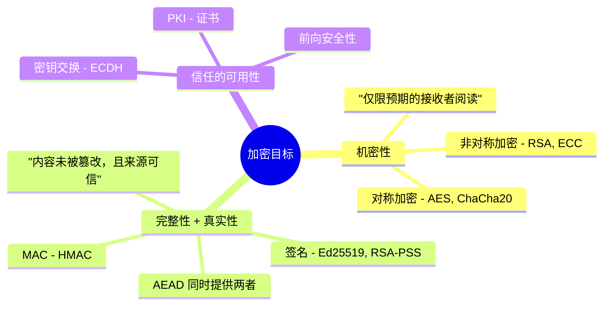
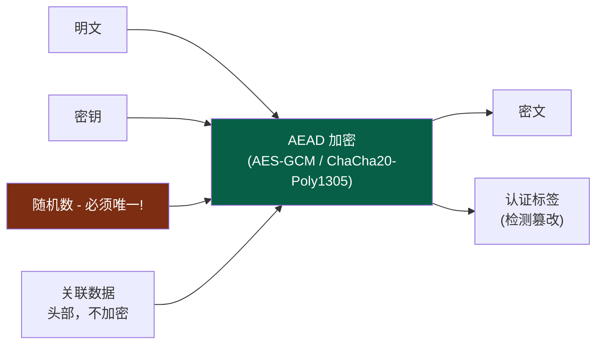
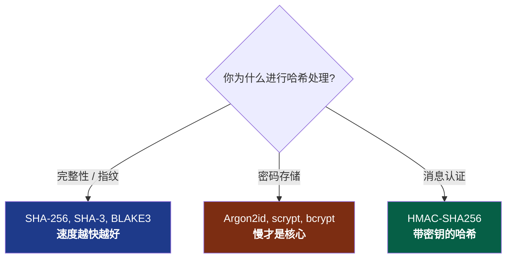
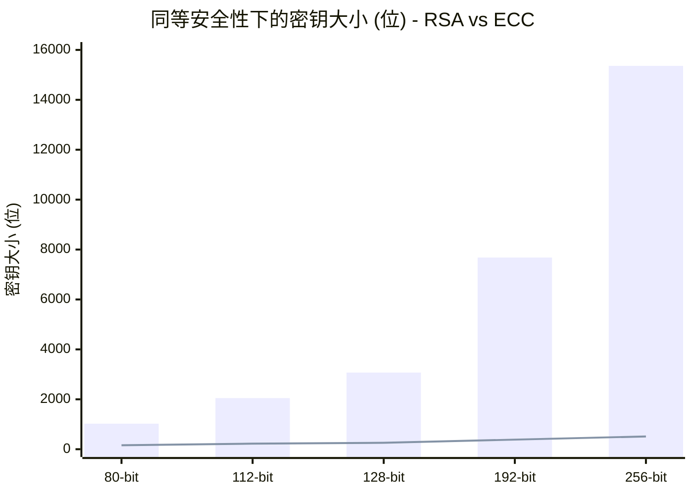
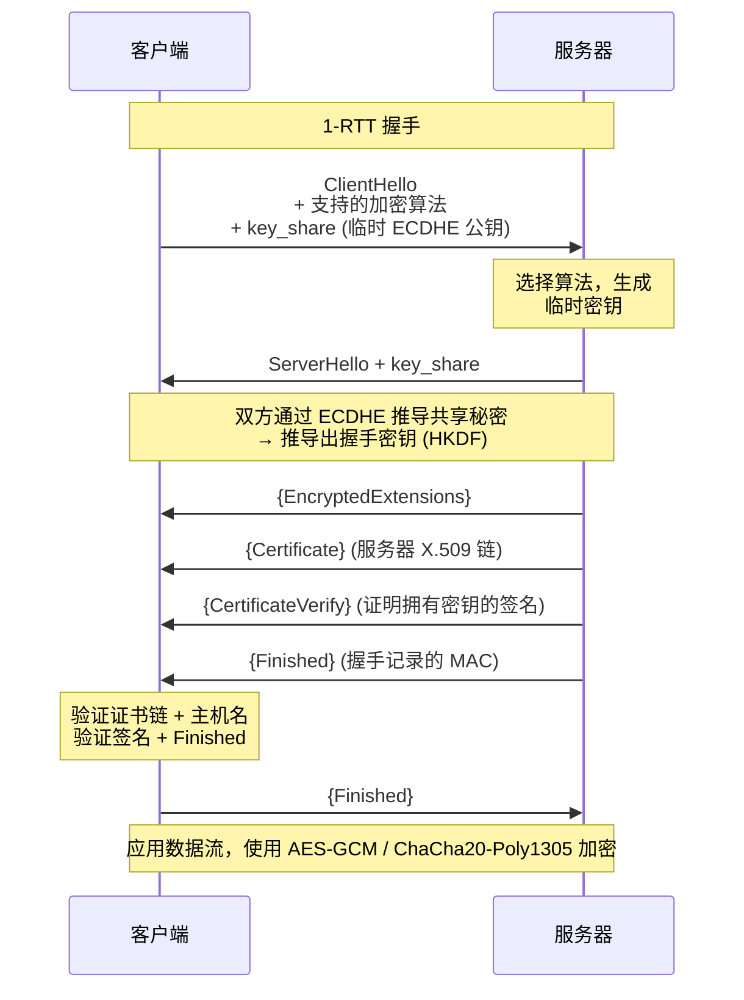
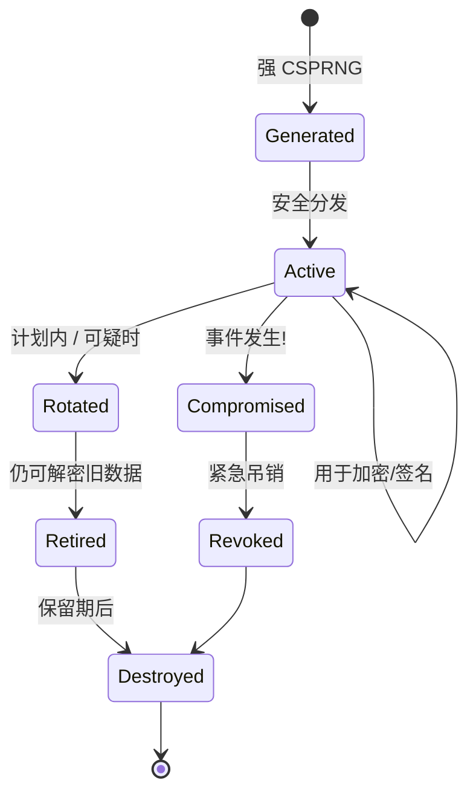
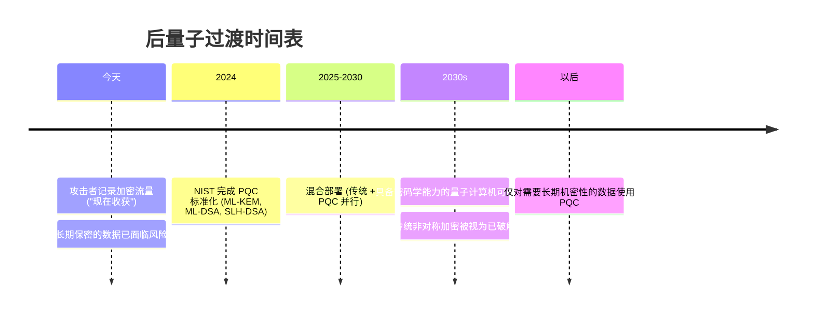
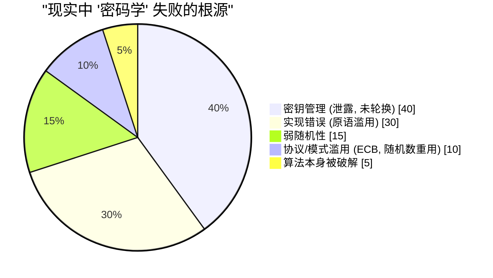

## 我们曾一直试图关闭的盒子

本系列文章已经两次引用密码学并“挥手示意”带过。 [第一卷](/posts/secure_systems_architecture/) 提到过“使用 TLS”。 [第二卷](/posts/identity_and_access_in_depth/) 提到过“签名必须与来源绑定”和“使用 Argon2id 进行哈希”，然后便匆匆略过。这些句子中的每一句，背后都隐藏着一套精致且脆弱的机制。

本卷将打开这个盒子。

我们的目标不是把你培养成密码学家——那条路需要数年的数学沉淀，以及对自身“小聪明”的敬畏。我们的目标是让你成为一名**密码学 *工程师***：能够明确哪个原语解决哪个问题、理解为何安全默认配置是安全的，最重要的是，当你即将犯下灾难性错误时，能够及时察觉。

:::important[第一戒律]
**不要发明自己的密码学。不要实现自己的原语。** 无论是加密算法、模式、填充方式，还是随机数生成器，都不要自己写。请使用经过验证的高级库（如 libsodium、Tink、平台原生加密库），这些库会将安全选项作为*默认*选择。本卷中的所有内容都是为了让你理解这些库在做什么，而不是让你去重构它们。历史上每一次灾难性的加密失败，都始于一位认为这条规则对自己不适用的工程师。 [^1]
:::

---

## 第一部分：三大目标与为其服务的原语

实际上，所有的密码学应用都旨在实现以下三个目标的某种组合：

第四个目标，**不可否认性**（即你无法否认自己曾签署过某文件），专门源于数字签名。这是对称加密*无法*提供的唯一属性，因为双方共享密钥，任何一方都可能生成该标签。

### 第 1 章：对称密码学 - 快速、共享且有模式

对称加密使用**一个共享密钥**进行加密和解密。它非常*快速*（硬件加速的 AES 每秒可处理数 GB 数据），但存在一个严峻的问题：**如何在监听者不发现的情况下，让双方获得相同的密钥？**（第二部分将解答此问题。）

让初学者掉进坑里的微妙之处在于**操作模式 (Modes of Operation)**。像 AES 这样的块加密算法每次加密一个固定的 16 字节块。为了加密实际数据，你需要将块链接起来，而这种链接模式决定了安全性是成是败。

:::warning[ECB 企鹅 - 为什么模式很重要]
最原始的模式 **ECB (电子密码本模式)** 会独立加密每个块。相同的明文块会产生相同的密文块。如果用 ECB 模式加密 Linux 企鹅的位图，你仍然可以在密文中*看到企鹅*——轮廓直接泄露了。ECB 会摧毁任何有结构数据的机密性。如果你在代码中看到 `AES/ECB`，请将其视为一个 Bug。 [^2]
:::

现代的解决方案是 **AEAD (带关联数据的认证加密)**，它将机密性*和*完整性融合为一个原语，这样你就不会只拥有其中之一：

你应该优先选择的两种 AEAD 加密算法：

| 算法 | 优势 | 注意事项 |
| --- | --- | --- |
| **AES-256-GCM** | 随处可见硬件加速 (AES-NI)，广泛使用 | **随机数重用是灾难性的**，在同一密钥下重复使用随机数会泄露认证密钥和明文异或结果 |
| **ChaCha20-Poly1305** | 在*软件*层面极快（非常适合没有 AES-NI 的移动端/物联网设备），设计上具备恒定时间特性 | 同样要求随机数唯一 |

:::caution[随机数不是秘密，但必须唯一]
**随机数 (Nonce)** 不需要保密，它是明文传输的。但在给定的密钥下，它**绝不能重复**。对于 GCM 的 96 位随机数，在同一个密钥下，经过大约 $2^{32}$ 条消息后，生日攻击碰撞将成为真正的风险。安全的做法：使用*计数器*随机数（保证唯一）、在达到限制前及时轮换密钥，或使用类似 **AES-GCM-SIV** 这种抗随机数滥用的模式。 [^3]
:::

### 第 2 章：哈希 - 单行道

密码学哈希将任意输入映射为固定大小的摘要，使得 (a) 逆向计算不可行，(b) 找到两个具有相同摘要的输入不可行 (**抗碰撞性**)，以及 (c) 找到与给定摘要匹配的输入不可行 (**抗原像性**)。

人们经常混淆的三种用途，它们需要*不同*的函数：

关键点在于：**对于文件完整性，你需要最快的安全哈希；对于密码，你需要最慢的哈希。** 将 SHA-256 用于密码存储是一个漏洞（GPU 每秒可以破解数十亿次）；将 Argon2id 用于文件校验和则纯属无意义的缓慢。虽然都叫“哈希”，但需求完全相反。

**MAC** 加入了密钥，因此只有持有秘密的人才能生成或验证标签，这兼顾了完整性和真实性。请使用 **HMAC** 并始终使用**恒定时间比较 (constant-time comparison)** 进行标签验证，早退出的 `==` 会泄露定时信息，攻击者可以利用该信息逐字节伪造标签。

$$
\text{HMAC}(K, m) = H\big((K \oplus opad)\,\|\,H((K \oplus ipad)\,\|\,m)\big)
$$

这种双哈希结构不仅仅是装饰，它防御了**长度扩展攻击**，否则攻击者可以将数据附加到原始的 `H(K \| m)` 结构后方。

### 第 3 章：非对称密码学 - 解决密钥交换问题

非对称（公钥）密码学使用**密钥对**：你可以自由分享的公钥和你誓死保护的私钥。任何人都可以用你的公钥进行加密，只有你的私钥能解密。或者：你用私钥签名，任何人都可以用公钥验证。

* **RSA** - 经典算法。安全性基于大整数分解的难度。目前被认为是*臃肿且缓慢的*，128 位安全等级需要 3072 位密钥。虽可用，但效率较低。
* **椭圆曲线密码学 (ECC)** - 同样的安全性，密钥尺寸小得多，因为它基于椭圆曲线离散对数问题，其单位比特的难度更高。**256 位 ECC 密钥 ≈ 3072 位 RSA 密钥**。

在高安全等级下，柱状图 (RSA) 和折线图 (ECC) 之间的鸿沟正是现代协议默认使用椭圆曲线的原因：**Ed25519** 用于签名，**X25519** 用于密钥交换，它们速度快、体积小，且设计上就很难被滥用 [^4]。

:::note[非对称加密很少直接加密数据]
公钥运算缓慢且有大小限制。实际上，你几乎从不使用 RSA 直接加密文件。你使用非对称加密来**交换或封装一个对称密钥**，然后用快速的 AEAD 加密大量数据。这就是**混合加密**，也是 TLS、PGP、age 以及所有健全系统所采用的方式。
:::

---

## 第二部分：密钥交换与 TLS 1.3 握手

我们现在可以回答对称加密无法解决的问题：两个陌生人如何在攻击者监控的线路中就共享秘密达成一致？

### 第 4 章：Diffie-Hellman 与前向安全性

**Diffie-Hellman (DH)** 是其核心的优美技巧。双方将各自的私有秘密与对方的公开值混合，利用代数特性，双方都能得出*相同的*共享秘密，而监听者即便看到了两个公开值，也无法计算出该秘密。

其核心属性是**（完美）前向安全性 (Forward Secrecy)**。如果每个会话都使用一个*临时* DH 密钥对（ECDHE，“E”即代表临时），用完即丢，那么即使攻击者今天记录了你所有的加密流量，*并在明年窃取了你的长期私钥*，他们仍然无法解密之前记录的会话。会话密钥随会话结束而销毁。

:::important[为什么前向安全性现在是不可谈判的]
“先记录，后解密”是目前真实存在且资金充足的敌对策略，尤其是在量子计算机即将来临的背景下（第 7 章）。前向安全性意味着即使今天捕获的密文，也不会在你服务器密钥泄露的那天成为负担。TLS 1.3 强制要求前向安全的 ECDHE，旧的静态 RSA 密钥交换（无前向安全性）已被完全移除。 [^5]
:::

### 第 5 章：真实的 TLS 1.3 握手

这就是我们一直说“使用 TLS”所指的握手过程。TLS 1.3 将往返次数从两次减少到一次，并剥离了所有不安全的选项 [^5]：

每一步都有其存在意义：

* **第一条消息中的 `key_share`** - 客户端直接*猜测*加密组并立即发送其临时密钥，这就是 TLS 1.3 节省往返次数的方法。
* **`Certificate` + `CertificateVerify`** - 证书将服务器身份与公钥绑定（通过第二卷中的 PKI 链）；而*签名*证明了服务器确实持有匹配的私钥。没有私钥的被盗证书是无用的。
* **`Finished`** - 对整个握手记录的 MAC。如果有中间人篡改了*任何*之前的消息（例如剥离强加密算法的降级攻击），记录将无法匹配，握手中止。

:::tip[TLS 1.3 删减的内容与保留的一样重要]
TLS 1.3 移除了 RSA 密钥交换、静态 DH、CBC 模式加密、RC4、MD5、SHA-1、压缩（告别 CRIME/BREACH）以及重协商机制。其设计哲学是：**更少的控制钮意味着更少因错误配置而导致泄露的可能。** 一个没有不安全选项的协议不可能被诱导使用不安全方案。禁用所有地方的 TLS 1.0/1.1；优先使用 1.3，仅允许传统客户端使用 1.2。
:::

---

## 第三部分：密钥管理 - 理论与现实的碰撞

应用密码学中肮脏的秘密是：**算法几乎从不是弱点，密钥管理才是。** AES-256 从未被破解。但密钥被提交到 Git、被记录日志、通过电子邮件发送、硬编码在代码中且从不轮换。其生命周期管理才是纪律所在：

支撑性的实践：

::::steps

:::step[从真实的 CSPRNG 生成]{subtitle="诞生"}
密钥必须来自**密码学安全的**随机源 (`/dev/urandom`, `getrandom()`, 平台 CSPRNG)。永远不要使用 `Math.random()`，不要使用时间戳作为种子，不要使用“巧妙的”伪随机数生成器。可预测的随机性是“无法破解”的加密被轻易破解的最常见根本原因。
:::

:::step[存储在 KMS 或 HSM 中]{subtitle="托管"}
**硬件安全模块 (HSM)** 或云端 **KMS** 存储密钥的方式是让其以明文形式*永不离开*边界，你将数据发送*给*它进行签名/解密。这意味着即便是控制了你应用服务器的攻击者，也无法窃取原始密钥。
:::

:::step[使用信封加密来扩展]{subtitle="结构"}
使用每个对象专用的 **数据加密密钥 (DEK)** 加密数据；使用 KMS 中持有的中央 **密钥加密密钥 (KEK)** 加密每个 DEK。轮换时，你只需重新加密较小的 DEK，而不是拍字节 (PB) 级别的数据。这是所有主流云厂商实现静态加密的方式。
:::

:::step[轮换，且能够*快速*轮换]{subtitle="维护"}
轮换必须自动化且无感，通过密钥 ID 标记密文，使旧密钥和新密钥在转换期间共存。能够在几分钟内轮换密钥的组织能从泄露中幸存；而需要长达一周迁移过程的组织则被其架构所绑架。
:::

::::

:::warning[导致历史灾难的随机性故障]
2008 年 Debian OpenSSL 漏洞：一个出于好意的补丁破坏了熵源，将密钥空间缩小到约 32,767 种可能性，两年间生成的每个 SSH 和 TLS 密钥都是可猜测的。2010 年：索尼 PS3 在 ECDSA 签名中重复使用固定的随机数，泄露了主签名密钥。模式是永恒的：**密码学在随机性和重用性上失败，而不是在算法本身。** [^6]
:::

---

## 第四部分：量子地平线

本卷中的每个非对称原语（RSA、ECC、Diffie-Hellman）都依赖于一个数学问题（因子分解、离散对数），而一台运行 **Shor 算法** 的足够大的**量子计算机**将能高效解决这些问题。虽然这台机器目前还不存在，但威胁已经显现。

### 第 7 章：现在收获，以后解密

量子威胁中非对称算法的分裂性：

* **非对称加密 (RSA, ECC, DH)** - 被 Shor 算法*破解*。这是紧急情况。
* **对称加密 (AES) 和哈希 (SHA-2/3)** - 仅被 Grover 算法*削弱*，这实际上将安全等级减半。修复方法很简单：使用 **AES-256**（量子后仍保持 128 位安全）和 384 位以上的哈希。对称加密基本是安全的。

2024 年，NIST 标准化了首批后量子算法 [^7]：

* **ML-KEM** (Kyber) - 密钥封装，ECDH 密钥交换的替代品。
* **ML-DSA** (Dilithium) 和 **SLH-DSA** (SPHINCS+) - 数字签名。

:::note[现在的务实之举：混合]
没有人会一夜之间切换到纯 PQC，新算法更年轻，经过的实战检验较少。业界的答案是**混合密钥交换**：同时运行传统的 X25519 *和* ML-KEM，结合两个共享秘密，这样除非*两者*都被破解，否则会话就是安全的。Chrome、Cloudflare 等厂商默认已经部署了 X25519+ML-KEM。如果你采购的加密需求有十年以上的保密期，请务必*现在*询问供应商的 PQC 路线图。 [^8]
:::

---

## 第五部分：耻辱殿堂 - 工程师如何破坏优秀的加密

算法本身是健全的。以下是现实系统最终崩溃的方式，也是你将在审查中实际制造或发现的失败指南：

| 反模式 | 致命原因 | 修复方法 |
| --- | --- | --- |
| **自造加密算法** | 你会弄错微妙的细节；攻击者不会放过它 | 使用 libsodium / Tink / 平台加密 |
| **ECB 模式** | 泄露明文结构（企鹅图像） | 使用 AEAD：AES-GCM / ChaCha20-Poly1305 |
| **随机数 (IV) 重用** | GCM 下灾难性的密钥/明文泄露 | 使用计数器随机数，或 AES-GCM-SIV |
| **弱随机性** | 可预测的密钥 = 无密钥 | 仅使用 CSPRNG，绝不使用 `Math.random()` |
| **SHA-256 存储密码** | GPU 每秒可破解数十亿次 | Argon2id / scrypt / bcrypt |
| **使用 `==` 比较 MAC/标签** | 定时侧信道伪造标签 | 使用恒定时间比较 |
| **不验证证书** | `verify=False` 重开中间人攻击大门 | 验证链 + 主机名 + 有效期 |
| **没有前向安全性** | 一个密钥泄露解密所有历史 | 临时 ECDHE (TLS 1.3) |
| **加密不认证** | 填充预言机 (Padding-oracle) 及位翻转攻击 | 使用 AEAD，或先加密后 MAC |

再读一遍这个图表。**真正的算法破解是最小的一块。** 95% 的“密码学失败”是工程失败，包括密钥处理、滥用、随机性问题，所有这些都完全在*你的*控制范围内，并包含在本卷的纪律之中。

:::important[总结]
优秀的密码学不在于了解数学，而在于**尊重数学设定的边界**：唯一的随机数、秘密密钥、真实的随机性、经认证的密文、经过验证的证书、前向安全性、轮换机制。通过经过验证的库正确建立这些边界，你就继承了更聪明的人花了数十年时间强化的原语的全部力量。一旦越界，任何算法都无法拯救你。
:::

---

## 结语与前进之路

我们现在已经从基础原语开始构建信任：保持秘密的加密算法、证明身份的签名、在敌对线路中将它们绑定在一起的握手、保持一切诚信的密钥生命周期，以及已经在投下阴影的量子计算时刻。

但密码学、身份认证和网络壁垒都只是*预防性*控制。它们假设你可以将攻击者拒之门外。**第四卷**将接受相反的前提，这是每个经验丰富的防御者都内化的结论：*假设漏洞存在。* 我们将进入红蓝对抗的操作现实、检测工程、MITRE ATT&CK 框架、威胁狩猎、SIEM/SOAR 流水线，以及在预防措施失败时（不是如果，是当）你运行的事件响应和取证手册。

预防是一个你无法完全遵守的承诺。检测才是你幸免于难的方式。

---

## 参考文献

[^1]: [Latacora - Cryptographic Right Answers](https://www.latacora.com/blog/2018/04/03/cryptographic-right-answers/)
[^2]: [Filippo Valsorda / Wikipedia - Block cipher mode of operation (ECB penguin)](https://en.wikipedia.org/wiki/Block_cipher_mode_of_operation#Electronic_codebook_(ECB))
[^3]: [IETF - RFC 8452: AES-GCM-SIV Nonce Misuse-Resistant AEAD](https://datatracker.ietf.org/doc/html/rfc8452)
[^4]: [Bernstein, D. J. et al. - Ed25519 & Curve25519](https://ed25519.cr.yp.to/)
[^5]: [IETF - RFC 8446: The Transport Layer Security (TLS) Protocol Version 1.3](https://datatracker.ietf.org/doc/html/rfc8446)
[^6]: [Debian - DSA-1571-1 openssl predictable random number generator](https://www.debian.org/security/2008/dsa-1571)
[^7]: [NIST (2024) - Post-Quantum Cryptography Standards (FIPS 203/204/205)](https://csrc.nist.gov/projects/post-quantum-cryptography)
[^8]: [Cloudflare - The state of the post-quantum Internet](https://blog.cloudflare.com/pq-2024/)